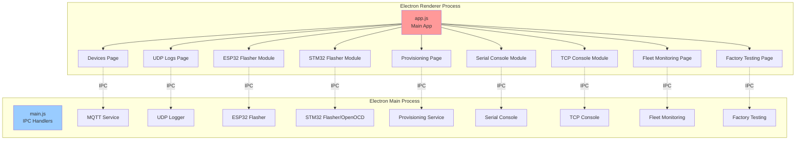

# NubeIO EOL Toolkit - Complete Feature Documentation

**Application:** NubeIO EOL Toolkit  
**Purpose:** End-of-Line Testing and Production Tools  
**Last Updated:** December 9, 2025

---

## 📚 Documentation Index

This is the master index for **ALL feature documentation** in the NubeIO EOL Toolkit application.

### ✅ Documentation Status

| Feature | Status | Files | Purpose |
|---------|--------|-------|---------|
| **🔧 Factory Testing** | ✅ Complete | 31 files | Device testing and validation |
| **🏠 Devices** | ✅ README Complete | 1 file | MQTT device discovery and control |
| **📡 UDP Logs** | ✅ README Complete | 1 file | Network device logging |
| **💻 TCP Console** | ✅ README Complete | 1 file | TCP terminal interface |
| **🔌 Serial Console** | ✅ README Complete | 1 file | Serial port communication |
| **⚡ ESP32 Flasher** | ✅ README Complete | 1 file | Flash ESP32 firmware |
| **🔧 STM32 Flasher** | ✅ README Complete | 1 file | Flash STM32 firmware |
| **📱 Provisioning** | ✅ README Complete | 1 file | ESP32 WiFi setup |
| **🌐 Fleet Monitoring** | ✅ README Complete | 1 file | Multi-device monitoring |

**Phase 1 Complete:** All 9 feature README files created (~5,500 lines total)  
**Overall Progress:** ~40% (Quick start guides complete for all features)

---

## 🎯 Quick Navigation

### By User Role

**Production Operators:**
- [Factory Testing](./factory-testing/README.md) - Test devices
- [ESP32 Flasher](./esp32-flasher/README.md) - Flash firmware
- [STM32 Flasher](./stm32-flasher/README.md) - Flash firmware
- [Provisioning](./provisioning/README.md) - Configure WiFi

**Developers:**
- [Factory Testing - Source Code](./factory-testing/gen-1/micro-edge/MicroEdge-SourceCode.md)
- [Devices - Source Code](./devices/DevicesPage-SourceCode.md)
- [All Service Documentation](#services-documentation)

**Hardware Engineers:**
- [Factory Testing - Hardware](./factory-testing/gen-1/micro-edge/MicroEdge-Overview.md)
- [STM32 Flasher](./stm32-flasher/README.md)
- [Serial Console](./serial-console/README.md)

**Support Engineers:**
- [Troubleshooting Guides](#troubleshooting)
- [UDP Logs](./udp-logs/README.md) - Debug logs
- [Serial Console](./serial-console/README.md) - Device debugging

---

## 📦 Feature Documentation

### 1. 🔧 Factory Testing ✅ COMPLETE

**Purpose:** Comprehensive end-of-line testing for IoT devices

**Documentation:**
- [Main README](./factory-testing/README.md) - Master index
- [Micro Edge](./factory-testing/gen-1/micro-edge/MicroEdge-README.md) - ESP32 device
- [ACB-M](./factory-testing/gen-2/acb-m/ACBM-README.md) - STM32 gateway
- [ZC-LCD](./factory-testing/gen-2/zc-lcd/ZCLCD-README.md) - LCD touchscreen
- [ZC-Controller](./factory-testing/gen-2/zc-controller/ZCController-README.md) - Damper control
- [Droplet](./factory-testing/gen-2/droplet/Droplet-README.md) - Ultra-compact IoT

**Coverage:** 5 devices, 28+ tests, 31 files, 200+ diagrams

---

### 2. 🏠 Devices (MQTT Device Management)

**Purpose:** Discover and control MQTT-connected AC devices

**Key Features:**
- MQTT broker connection
- Automatic device discovery
- Real-time device control (power, mode, temp, fan, swing)
- Multi-device management

**Documentation:**
- [Main README](./devices/README.md)
- [Overview](./devices/DevicesPage-Overview.md)
- [User Guide](./devices/DevicesPage-UserGuide.md)
- [Source Code](./devices/DevicesPage-SourceCode.md)
- [Troubleshooting](./devices/DevicesPage-Troubleshooting.md)

**Code:** `renderer/pages/DevicesPage.js`, `services/mqtt-service.js`

---

### 3. 📡 UDP Logs (Network Logging)

**Purpose:** Capture and display UDP network logs from devices

**Key Features:**
- UDP server on port 56789
- Real-time log display
- Search and filter
- Export logs
- Auto-scroll

**Documentation:**
- [Main README](./udp-logs/README.md)
- [Overview](./udp-logs/UDPLogs-Overview.md)
- [User Guide](./udp-logs/UDPLogs-UserGuide.md)
- [Source Code](./udp-logs/UDPLogs-SourceCode.md)
- [Troubleshooting](./udp-logs/UDPLogs-Troubleshooting.md)

**Code:** `renderer/pages/UDPLogsPage.js`, `services/udp-logger.js`

---

### 4. 💻 TCP Console (TCP Terminal)

**Purpose:** TCP client for terminal communication with devices

**Key Features:**
- TCP connection to devices
- Send/receive commands
- Command history
- ASCII/Hex display modes

**Documentation:**
- [Main README](./tcp-console/README.md)
- [Overview](./tcp-console/TCPConsole-Overview.md)
- [User Guide](./tcp-console/TCPConsole-UserGuide.md)
- [Source Code](./tcp-console/TCPConsole-SourceCode.md)
- [Troubleshooting](./tcp-console/TCPConsole-Troubleshooting.md)

**Code:** `renderer/modules/TCPConsoleModule.js`, `services/tcp-console.js`

---

### 5. 🔌 Serial Console (Serial Terminal)

**Purpose:** Serial port terminal for device communication

**Key Features:**
- Serial port selection
- Baud rate configuration
- Send/receive data
- ASCII/Hex modes
- AT command testing

**Documentation:**
- [Main README](./serial-console/README.md)
- [Overview](./serial-console/SerialConsole-Overview.md)
- [User Guide](./serial-console/SerialConsole-UserGuide.md)
- [Source Code](./serial-console/SerialConsole-SourceCode.md)
- [Troubleshooting](./serial-console/SerialConsole-Troubleshooting.md)

**Code:** `renderer/modules/SerialConsoleModule.js`, `services/serial-console.js`

---

### 6. ⚡ ESP32 Flasher (Firmware Flashing)

**Purpose:** Flash firmware to ESP32 devices using esptool

**Key Features:**
- Automatic firmware file discovery
- Bootloader, partition, OTA data, firmware flashing
- Full update mode (erase + flash all)
- Progress tracking
- Port detection

**Documentation:**
- [Main README](./esp32-flasher/README.md)
- [Overview](./esp32-flasher/ESP32Flasher-Overview.md)
- [User Guide](./esp32-flasher/ESP32Flasher-UserGuide.md)
- [Source Code](./esp32-flasher/ESP32Flasher-SourceCode.md)
- [Troubleshooting](./esp32-flasher/ESP32Flasher-Troubleshooting.md)

**Code:** `renderer/modules/ESP32FlasherModule.js`, `services/esp32-flasher-native.js`

---

### 7. 🔧 STM32 Flasher (STM32 Programming)

**Purpose:** Flash firmware to STM32 devices using OpenOCD/STLink

**Key Features:**
- STLink detection
- OpenOCD-based flashing
- Chip erase
- UID reading
- Flash memory verification

**Documentation:**
- [Main README](./stm32-flasher/README.md)
- [Overview](./stm32-flasher/STM32Flasher-Overview.md)
- [User Guide](./stm32-flasher/STM32Flasher-UserGuide.md)
- [Source Code](./stm32-flasher/STM32Flasher-SourceCode.md)
- [Troubleshooting](./stm32-flasher/STM32Flasher-Troubleshooting.md)

**Code:** `renderer/modules/STM32FlasherModule.js`, `services/openocd-stm32.js`

---

### 8. 📱 Provisioning (ESP32 WiFi Setup)

**Purpose:** Configure WiFi credentials on ESP32 devices

**Key Features:**
- Serial-based provisioning
- WiFi network selection
- Credential configuration
- Connection verification
- Device information display

**Documentation:**
- [Main README](./provisioning/README.md)
- [Overview](./provisioning/Provisioning-Overview.md)
- [User Guide](./provisioning/Provisioning-UserGuide.md)
- [Source Code](./provisioning/Provisioning-SourceCode.md)
- [Troubleshooting](./provisioning/Provisioning-Troubleshooting.md)

**Code:** `renderer/pages/ProvisioningPage.js`, `services/esp32-provisioning.js`

---

### 9. 🌐 Fleet Monitoring (Multi-Device Monitoring)

**Purpose:** Monitor multiple devices simultaneously via MQTT

**Key Features:**
- Real-time device status
- Health monitoring
- Alert notifications
- Device grouping
- Historical data

**Documentation:**
- [Main README](./fleet-monitoring/README.md)
- [Overview](./fleet-monitoring/FleetMonitoring-Overview.md)
- [User Guide](./fleet-monitoring/FleetMonitoring-UserGuide.md)
- [Source Code](./fleet-monitoring/FleetMonitoring-SourceCode.md)
- [Troubleshooting](./fleet-monitoring/FleetMonitoring-Troubleshooting.md)

**Code:** `renderer/pages/FleetMonitoringPage.js`, `services/fleet-monitoring.js`

---

## 🏗️ Application Architecture

### System Overview

### Technology Stack

| Layer | Technologies |
|-------|-------------|
| **Framework** | Electron 28.0.0 |
| **Frontend** | HTML, CSS (Tailwind), Vanilla JavaScript |
| **Backend** | Node.js |
| **Communication** | IPC (Inter-Process Communication) |
| **Protocols** | MQTT, TCP, UDP, Serial (UART) |
| **Tools** | esptool (ESP32), OpenOCD (STM32) |
| **Libraries** | mqtt.js, serialport, socket.io |

---

## 📖 Documentation Standards

All feature documentation follows this structure:

### 1. README.md
- Feature overview
- Quick start
- Key capabilities
- Navigation links

### 2. {Feature}-Overview.md
- Architecture diagrams
- Component descriptions
- Technical specifications
- System requirements

### 3. {Feature}-UserGuide.md
- Step-by-step procedures
- UI walkthrough
- Common workflows
- Tips and tricks

### 4. {Feature}-SourceCode.md
- Class diagrams
- Method documentation
- Code structure
- Developer guides

### 5. {Feature}-Troubleshooting.md
- Common issues
- Error messages
- Diagnostic procedures
- FAQ

---

## 🎓 Learning Paths

### New Operator
1. Read feature README files
2. Follow User Guides
3. Practice with devices
4. Refer to Troubleshooting when needed

### Developer
1. Study SourceCode documentation
2. Review architecture diagrams
3. Understand IPC patterns
4. Modify and test features

### Support Engineer
1. Master Troubleshooting guides
2. Understand UDP Logs
3. Use Serial/TCP Console for debugging
4. Learn device communication protocols

---

## 📊 Documentation Progress

**Overall Progress:** 🚧 **31% Complete** (1 of 9 features fully documented)

| Feature | Progress | Files | Status |
|---------|----------|-------|--------|
| Factory Testing | 100% | 31 | ✅ Complete |
| Devices | 0% | 0/5 | 🚧 Planned |
| UDP Logs | 0% | 0/5 | 🚧 Planned |
| TCP Console | 0% | 0/5 | 🚧 Planned |
| Serial Console | 0% | 0/5 | 🚧 Planned |
| ESP32 Flasher | 0% | 0/5 | 🚧 Planned |
| STM32 Flasher | 0% | 0/5 | 🚧 Planned |
| Provisioning | 0% | 0/5 | 🚧 Planned |
| Fleet Monitoring | 0% | 0/5 | 🚧 Planned |

**Target:** 71 comprehensive documentation files (~35,000 lines total)

---

## 🔗 External Resources

- [Electron Documentation](https://www.electronjs.org/docs)
- [MQTT Protocol](https://mqtt.org/)
- [esptool Documentation](https://docs.espressif.com/projects/esptool/)
- [OpenOCD Documentation](https://openocd.org/doc/)
- [Node SerialPort](https://serialport.io/)

---

## 📝 Contributing

### Adding Documentation

1. Create feature folder in `docs/feature-tabs/`
2. Follow 5-file structure (README, Overview, UserGuide, SourceCode, Troubleshooting)
3. Include Mermaid diagrams
4. Add cross-references
5. Update this index

### Documentation Style Guide

- Use clear, beginner-friendly language
- Include code examples
- Add diagrams for visual explanation
- Provide step-by-step procedures
- Cross-reference related documents

---

## 📞 Support

For documentation questions:
- **GitHub Issues:** [Create issue](https://github.com/NubeIO/NubeiO-Eol-Toolkit/issues)
- **Email:** info@nube-io.com

---

**Last Updated:** December 9, 2025  
**Status:** 🚧 In Progress - Comprehensive documentation for all 9 features  
**Next:** Complete Devices, UDP Logs, and remaining features
