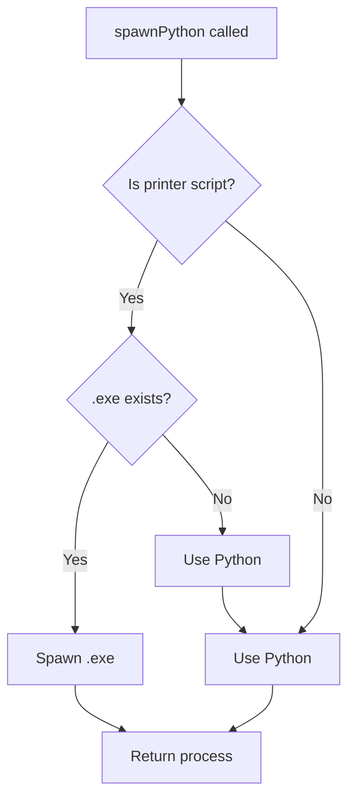
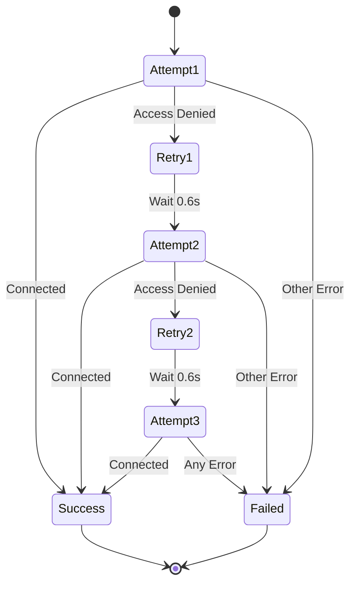
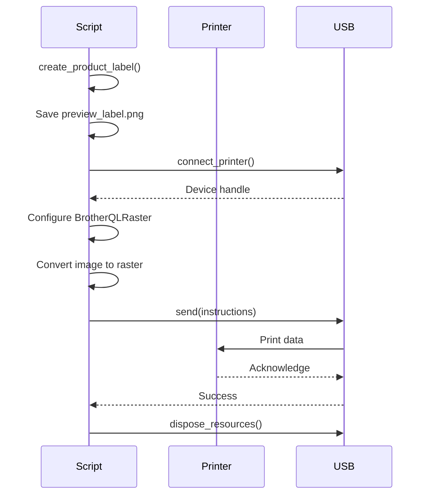
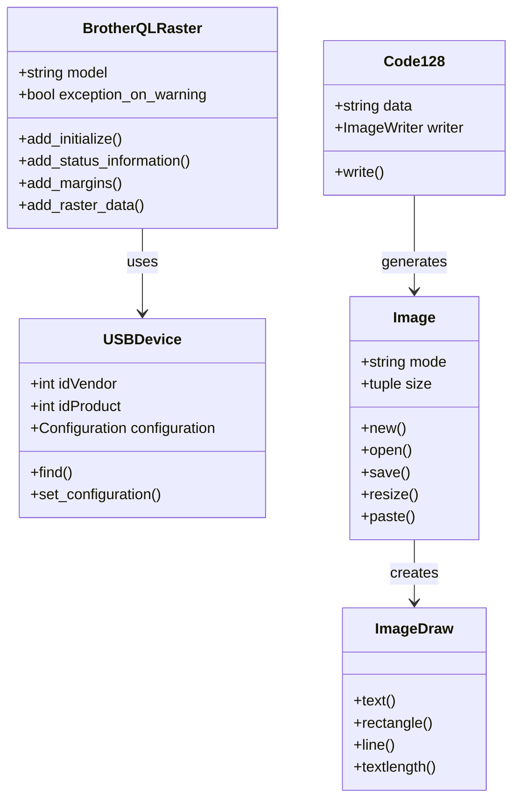

# Class and Method Reference

## Module: print_product_label.py

### Overview

The main Python module for Brother PT-P900W label printing. Handles label creation, barcode generation, and USB communication.

---

## Functions

### `resolvePythonExecutable()`

**Location**: main.js (Electron)

**Purpose**: Resolves the Python executable path or returns the standalone .exe

**Returns**: `{ cmd: string, args: array }` or `null`

**Logic**:
```javascript
1. Check environment variables (NUBE_PYTHON_PATH, etc.)
2. Try platform-specific commands (py, python3, python)
3. Return first working executable
4. Cache result for performance
```

**Example**:
```javascript
const pythonCmd = resolvePythonExecutable();
// Returns: { cmd: 'py', args: [] }
```

---

### `spawnPython(pythonArgs, options)`

**Location**: main.js

**Purpose**: Spawns Python process or .exe for printer operations

**Parameters**:
- `pythonArgs` (Array): Arguments to pass to Python/exe
- `options` (Object): spawn options (optional)

**Returns**: ChildProcess

**Behavior**:


**Example**:
```javascript
const proc = spawnPython([scriptPath, '--check'], {
  cwd: printerDir
});
```

---

### `connect_printer()`

**Location**: print_product_label.py

**Purpose**: Establishes USB connection to Brother PT-P900W

**Returns**: `usb.core.Device` object

**Raises**:
- `ValueError`: Printer not found
- `usb.core.USBError`: USB communication error

**Implementation**:
```python
def connect_printer():
    vendor_id = 0x04f9  # Brother
    product_id = 0x2085  # PT-P900W
    
    dev = usb.core.find(
        idVendor=vendor_id, 
        idProduct=product_id,
        backend=usb_backend
    )
    
    if dev is None:
        raise ValueError("Printer not found")
    
    return dev
```

**Example**:
```python
try:
    printer = connect_printer()
    print("Printer connected!")
except ValueError as e:
    print(f"Error: {e}")
```

---

### `check_printer_connection(max_attempts=3, retry_delay=0.6)`

**Location**: print_product_label.py

**Purpose**: Verifies printer connectivity with retry logic

**Parameters**:
- `max_attempts` (int): Maximum connection attempts
- `retry_delay` (float): Delay between retries in seconds

**Returns**: `bool` - True if connected, False otherwise

**Flow**:


**Example**:
```python
if check_printer_connection():
    print("Printer ready")
    sys.exit(0)
else:
    print("Printer not available")
    sys.exit(1)
```

---

### `create_product_label(barcode_data, mn_text, sw_text, ba_text, product_code, date_text)`

**Location**: print_product_label.py

**Purpose**: Generates label image with barcode and product information

**Parameters**:
- `barcode_data` (str): Data for Code128 barcode
- `mn_text` (str): Model number
- `sw_text` (str): Software/firmware version
- `ba_text` (str): Batch ID
- `product_code` (str): Product code (LoRa address)
- `date_text` (str): Date string

**Returns**: `PIL.Image` object (grayscale)

**Label Layout**:
```
┌─────────────────────────────────────┐
│                                     │
│  ║║║║║║║║║║║║║  MN: ME-05-N1       │
│  ║║ BARCODE ║║   SW: 1.3.6          │
│  ║║ CONTENT ║║   BA: 01202434       │
│  ║║║║║║║║║║║║║  2024/11/08          │
│                                     │
│      ME-05-F8AC119F                 │
└─────────────────────────────────────┘
```

**Image Specifications**:
```python
# Canvas
width = barcode_width + 500
height = 160

# Barcode
height = 120 pixels
module_width = 0.5
quiet_zone = 6

# Fonts
font_medium = 44pt (MN, SW, BA)
font_tiny = 34pt (date)

# Color
mode = 'L' (grayscale)
background = 255 (white)
foreground = 0 (black)
```

**Example**:
```python
label_img = create_product_label(
    barcode_data="ME051EACDADB",
    mn_text="ME-05-N1",
    sw_text="1.3.6",
    ba_text="01202434",
    product_code="F8AC119F",
    date_text="2024/11/08"
)
```

---

### `print_label(barcode_data, mn_text, fw_text, ba_text, uid_text, date_text)`

**Location**: print_product_label.py

**Purpose**: Creates and prints label via Brother PT-P900W

**Parameters**: Same as `create_product_label()`

**Returns**: None

**Raises**:
- `usb.core.USBError`: USB communication error
- `Exception`: Any printing error

**Process**:


**Example**:
```python
try:
    print_label(
        barcode_data="ME051EACDADB",
        mn_text="ME-05-N1",
        fw_text="1.3.6",
        ba_text="01202434",
        uid_text="F8AC119F",
        date_text="2024/11/08"
    )
    print("Print succeeded!")
except Exception as e:
    print(f"Print failed: {e}")
    sys.exit(1)
```

---

### `main()`

**Location**: print_product_label.py

**Purpose**: Entry point for command-line execution

**Command-Line Interface**:

**Check Mode**:
```bash
print_product_label.exe --check
```
- Tests printer connection
- Exit code 0: Success
- Exit code 1: Failure

**Print Mode**:
```bash
print_product_label.exe <barcode> <mn> <fw> <ba> <uid> <date>
```
- Prints label with provided data
- All arguments are positional

**Arguments**:
```python
sys.argv[1]  # barcode_data
sys.argv[2]  # mn_text
sys.argv[3]  # fw_text
sys.argv[4]  # ba_text
sys.argv[5]  # uid_text
sys.argv[6]  # date_text (optional, defaults to today)
```

**Example**:
```bash
# Check printer
print_product_label.exe --check

# Print label
print_product_label.exe \
  "ME051EACDADB" \
  "ME-05-N1" \
  "1.3.6" \
  "01202434" \
  "F8AC119F" \
  "2024/11/08"
```

---

## IPC Handlers (main.js)

### `printer:checkConnection`

**Purpose**: Checks if printer is connected

**Parameters**: None

**Returns**: 
```javascript
{
  connected: boolean,
  output: string,
  error: string | null
}
```

**Example**:
```javascript
const result = await ipcRenderer.invoke('printer:checkConnection');
if (result.connected) {
  console.log('Printer ready!');
}
```

---

### `printer:printLabel`

**Purpose**: Prints a product label

**Parameters**:
```javascript
{
  barcode: string,  // UID for barcode
  mn: string,       // Model number
  firmware: string, // Firmware version
  batchId: string,  // Batch ID
  uid: string,      // UID for display
  date: string      // Date (YYYY/MM/DD)
}
```

**Returns**:
```javascript
{
  success: boolean,
  error: string | null,
  output: string
}
```

**Example**:
```javascript
const payload = {
  barcode: 'ME051EACDADB',
  mn: 'ME-05-N1',
  firmware: '1.3.6',
  batchId: '01202434',
  uid: 'F8AC119F',
  date: '2024/11/08'
};

const result = await ipcRenderer.invoke('printer:printLabel', payload);
if (result.success) {
  console.log('Label printed successfully!');
} else {
  console.error('Print failed:', result.error);
}
```

---

## Helper Functions

### `_is_access_denied(exc)`

**Purpose**: Checks if exception is an access denied error

**Parameters**:
- `exc` (Exception): Exception to check

**Returns**: `bool`

**Implementation**:
```python
def _is_access_denied(exc):
    message = str(exc).lower()
    if 'access denied' in message or 'errno 13' in message:
        return True
    errno = getattr(exc, 'errno', None)
    return errno == 13
```

---

### `_dispose_printer(printer)`

**Purpose**: Safely releases USB resources

**Parameters**:
- `printer`: USB device handle

**Returns**: None

**Implementation**:
```python
def _dispose_printer(printer):
    if not printer:
        return
    try:
        usb.util.dispose_resources(printer)
    except Exception as dispose_error:
        print(f"CHECK_DISPOSE_WARN: {dispose_error}")
```

---

### `draw_text_with_spacing(draw, pos, text, font, fill, letter_spacing=2)`

**Purpose**: Draws text with custom letter spacing

**Parameters**:
- `draw` (ImageDraw): PIL drawing context
- `pos` (tuple): (x, y) position
- `text` (str): Text to draw
- `font`: PIL font object
- `fill` (int): Color (0=black, 255=white)
- `letter_spacing` (int): Pixels between letters

**Example**:
```python
draw_text_with_spacing(
    draw, 
    (100, 50), 
    "ME-05-N1", 
    font_medium, 
    0, 
    letter_spacing=14
)
```

---

## Constants

```python
# USB Identifiers
VENDOR_ID = 0x04f9   # Brother
PRODUCT_ID = 0x2085  # PT-P900W

# Printer Model
PRINTER_MODEL = 'PT-P900W'

# Tape Size
TAPE_SIZE = '12'  # 12mm

# Image Dimensions
BARCODE_HEIGHT = 120
LABEL_HEIGHT = 160
FONT_SIZE_MEDIUM = 44
FONT_SIZE_SMALL = 39
FONT_SIZE_TINY = 34

# Spacing
LINE_SPACING = 36
LETTER_SPACING_LABELS = 14
LETTER_SPACING_DATE = 4
LETTER_SPACING_BARCODE = 6
```

---

## Error Codes

| Exit Code | Meaning |
|-----------|---------|
| 0 | Success |
| 1 | Printer not found / Connection failed |
| 2 | Import error (missing dependencies) |
| 3 | Invalid arguments |

---

## Dependencies

### Python Packages

- **brother_ql** (v0.9.4+): Brother QL label printer library
- **pyusb** (v1.2.1+): USB communication
- **Pillow** (v10.0.0+): Image processing
- **python-barcode** (v0.15.1+): Barcode generation

### System Libraries

- **libusb-1.0**: USB backend (Windows/Linux/Mac)

---

## Class Hierarchy



---

## Build Configuration

### PyInstaller Spec

```python
# Hidden imports
hiddenimports = [
    'PIL',
    'PIL._imaging',
    'barcode',
    'barcode.writer',
    'brother_ql',
    'brother_ql.backends',
    'brother_ql.backends.helpers',
    'brother_ql.conversion',
    'brother_ql.raster',
    'usb',
    'usb.core',
    'usb.util',
    'usb.backend',
    'usb.backend.libusb1',
]

# Build options
onefile = True
windowed = True  # No console window
name = 'print_product_label'
```

See [DEPLOYMENT.md](./DEPLOYMENT.md) for complete build instructions.
