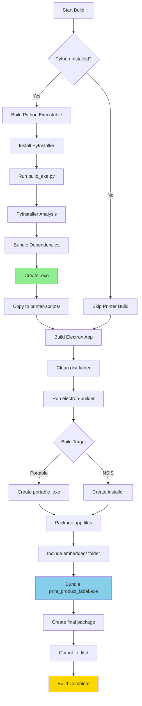

# Deployment Guide

## Overview

This guide covers building and deploying the Brother printer integration as part of the Nube iO Toolkit application.

---

## Build Process Flow



---

## Prerequisites

### Development Machine

1. **Node.js** (v16 or higher)
   ```bash
   node --version
   ```

2. **Python** (v3.8 or higher)
   ```bash
   python --version
   ```

3. **Git**
   ```bash
   git --version
   ```

### Python Dependencies

```bash
pip install pyinstaller brother_ql pyusb Pillow python-barcode
```

### Node Dependencies

```bash
npm install
```

---

## Step-by-Step Build Instructions

### 1. Build Python Executable

```bash
# Navigate to printer scripts directory
cd embedded/printer-scripts

# Install dependencies (if not already installed)
pip install pyinstaller brother_ql pyusb Pillow python-barcode

# Run build script
python build_exe.py
```

**Output**:
```
Building print_product_label.exe...
...
✓ Build complete!
Executable: C:\...\embedded\printer-scripts\dist\print_product_label.exe
```

**Verify**:
```bash
# Should create ~15MB executable
ls -lh dist/print_product_label.exe

# Test it
dist/print_product_label.exe --check
```

### 2. Copy Executable

```bash
# Copy to deployment location
copy dist\print_product_label.exe .

# Or on Linux/Mac
cp dist/print_product_label.exe .
```

### 3. Verify Integration

```bash
# Check file exists
ls print_product_label.exe

# Check git status (should be tracked)
git ls-files print_product_label.exe
```

### 4. Build Electron Application

```bash
# Navigate to project root
cd ../..

# Clean previous build
rm -rf dist

# Build for Windows Portable
npm run build:win

# Or build with electron-builder directly
npx electron-builder --win portable
```

### 5. Verify Build Output

```bash
# Check dist folder
ls -lh dist/

# Should contain:
# - Nube_iO_Toolkit-1.0.0-Portable.exe (~200MB)
# - win-unpacked/ (unpacked files)
```

---

## Build Configurations

### PyInstaller Configuration

File: `embedded/printer-scripts/build_exe.py`

```python
PyInstaller.__main__.run([
    'print_product_label.py',
    '--onefile',                    # Single executable
    '--windowed',                   # No console window
    '--name=print_product_label',   # Output name
    '--clean',                      # Clean cache
    '--noconfirm',                  # No prompts
    '--hidden-import=PIL',
    '--hidden-import=barcode',
    '--hidden-import=brother_ql',
    '--hidden-import=usb',
    # ... more hidden imports
])
```

### Electron Builder Configuration

File: `package.json`

```json
{
  "build": {
    "files": [
      "main.js",
      "preload.js",
      "renderer/**/*",
      "services/**/*",
      "embedded/**/*",
      // Includes print_product_label.exe
    ],
    "win": {
      "target": ["portable"],
      "extraResources": [
        {
          "from": "embedded/printer-scripts",
          "to": "embedded/printer-scripts"
        }
      ]
    }
  }
}
```

---

## Deployment Scenarios

### Scenario 1: Production Deployment (Recommended)

**Build**: With `print_product_label.exe`

**Requirements**: None (standalone)

```bash
# Build executable
cd embedded/printer-scripts
python build_exe.py
copy dist\print_product_label.exe .

# Build app
cd ../..
npm run build:win

# Deploy
# Copy dist/Nube_iO_Toolkit-1.0.0-Portable.exe to target machines
```

**Result**: Users do NOT need Python installed.

---

### Scenario 2: Development Deployment

**Build**: Without .exe (uses Python)

**Requirements**: Python must be installed on target

```bash
# Skip Python build
# Just build Electron app
npm run build:win
```

**Result**: App will use Python interpreter (if found).

---

### Scenario 3: Mixed Deployment

**Build**: Include both .exe and .py

**Requirements**: None (falls back to Python if .exe fails)

```bash
# Build executable
cd embedded/printer-scripts
python build_exe.py
copy dist\print_product_label.exe .

# Build app (includes both .exe and .py)
cd ../..
npm run build:win
```

**Result**: 
- Uses .exe if available (preferred)
- Falls back to Python if .exe fails
- Maximum compatibility

---

## File Structure in Built Application

### Portable Build

```
Nube_iO_Toolkit-1.0.0-Portable.exe
└── (Self-extracting archive)
    └── resources/
        └── app.asar (or unpacked)
            ├── main.js
            ├── renderer/
            ├── services/
            └── embedded/
                └── printer-scripts/
                    ├── print_product_label.exe  ← Standalone
                    ├── print_product_label.py   ← Fallback
                    ├── py-brotherlabel/         ← Source
                    └── README.md
```

### Paths at Runtime

```javascript
// In production
__dirname = "C:\\Users\\User\\AppData\\Local\\Temp\\Nube_iO_Toolkit\\resources\\app.asar"

// Printer script path
const scriptPath = path.join(
  __dirname, 
  'embedded', 
  'printer-scripts', 
  'print_product_label.exe'  // or .py
);
```

---

## CI/CD Integration

### GitHub Actions Example

```yaml
name: Build and Release

on:
  push:
    tags:
      - 'v*'

jobs:
  build:
    runs-on: windows-latest
    
    steps:
      - uses: actions/checkout@v3
      
      - name: Setup Python
        uses: actions/setup-python@v4
        with:
          python-version: '3.11'
      
      - name: Setup Node.js
        uses: actions/setup-node@v3
        with:
          node-version: '18'
      
      - name: Install Python Dependencies
        run: |
          pip install pyinstaller brother_ql pyusb Pillow python-barcode
      
      - name: Build Printer Executable
        run: |
          cd embedded/printer-scripts
          python build_exe.py
          copy dist\print_product_label.exe .
      
      - name: Install Node Dependencies
        run: npm install
      
      - name: Build Electron App
        run: npm run build:win
      
      - name: Upload Artifacts
        uses: actions/upload-artifact@v3
        with:
          name: windows-portable
          path: dist/*.exe
```

---

## Testing Deployment

### Pre-Deployment Tests

1. **Test Python Executable**
   ```bash
   cd embedded/printer-scripts
   print_product_label.exe --check
   ```
   Expected: Exit code 0 or 1 (not crash)

2. **Test Electron Build**
   ```bash
   npm start
   ```
   Open Factory Testing, click "Check Printer"

3. **Test Production Build**
   ```bash
   # Run the portable exe
   dist/Nube_iO_Toolkit-1.0.0-Portable.exe
   ```

### Post-Deployment Tests

1. **On clean Windows machine** (no Python):
   - Install the app
   - Connect printer
   - Navigate to Factory Testing
   - Click "Check Printer" → Should work
   - Print a test label → Should work

2. **Verify no Python dependency**:
   ```powershell
   # On test machine
   where python
   # Should be "INFO: Could not find files"
   
   # But printer still works!
   ```

---

## Troubleshooting Builds

### PyInstaller Issues

**Problem**: Hidden import not found

**Solution**: Add to `build_exe.py`:
```python
'--hidden-import=missing_module',
```

---

**Problem**: DLL not found

**Solution**: Copy DLL to script directory or add path:
```python
'--add-binary=path/to/lib.dll;.',
```

---

**Problem**: Executable too large (>50MB)

**Solution**: Use UPX compression:
```python
'--upx-dir=path/to/upx',
```

---

### Electron Builder Issues

**Problem**: File not included in build

**Solution**: Update `package.json`:
```json
"files": [
  "embedded/printer-scripts/*.exe"
]
```

---

**Problem**: Permission errors during build

**Solution**: Run as administrator:
```powershell
# Windows
Start-Process powershell -Verb RunAs
```

---

**Problem**: NSIS and Portable conflict

**Solution**: Build separately:
```bash
npx electron-builder --win portable
npx electron-builder --win nsis
```

---

## Version Management

### Updating Printer Module

1. **Modify Python script**
   ```bash
   # Edit print_product_label.py
   ```

2. **Rebuild executable**
   ```bash
   cd embedded/printer-scripts
   python build_exe.py
   copy dist\print_product_label.exe .
   ```

3. **Test changes**
   ```bash
   print_product_label.exe --check
   ```

4. **Commit and rebuild app**
   ```bash
   git add print_product_label.exe
   git commit -m "Update printer module"
   npm run build:win
   ```

### Version Numbers

- **App version**: `package.json` → `version`
- **Executable**: Embedded in filename
- **Printer module**: Internal to .exe (not visible)

---

## Distribution

### Distribution Checklist

- [ ] Build printer executable
- [ ] Test on clean machine
- [ ] Build Electron app
- [ ] Test portable .exe
- [ ] Create release notes
- [ ] Upload to release platform
- [ ] Update documentation
- [ ] Notify users

### Recommended Distribution Methods

1. **GitHub Releases**
   - Upload .exe as asset
   - Include SHA256 checksum
   - Provide release notes

2. **Internal Server**
   - Host on company server
   - Provide download link
   - Track download metrics

3. **USB Distribution**
   - Copy .exe to USB drives
   - Include README
   - For offline deployment

---

## Maintenance

### Regular Updates

- **Monthly**: Check for library updates
- **Quarterly**: Rebuild executable with latest dependencies
- **Annually**: Major version upgrade

### Update Checklist

```bash
# 1. Update Python dependencies
pip install --upgrade brother_ql pyusb Pillow python-barcode

# 2. Rebuild executable
cd embedded/printer-scripts
python build_exe.py

# 3. Test
print_product_label.exe --check

# 4. Rebuild app
cd ../..
npm run build:win

# 5. Test full workflow

# 6. Commit and release
```

---

## Support

For build issues:
- Check [BUILD_EXE.md](./embedded/printer-scripts/BUILD_EXE.md)
- Review [GitHub Issues](https://github.com/NubeIO/NubeiO-Eol-Toolkit/issues)
- Contact: dev@nube-io.com
