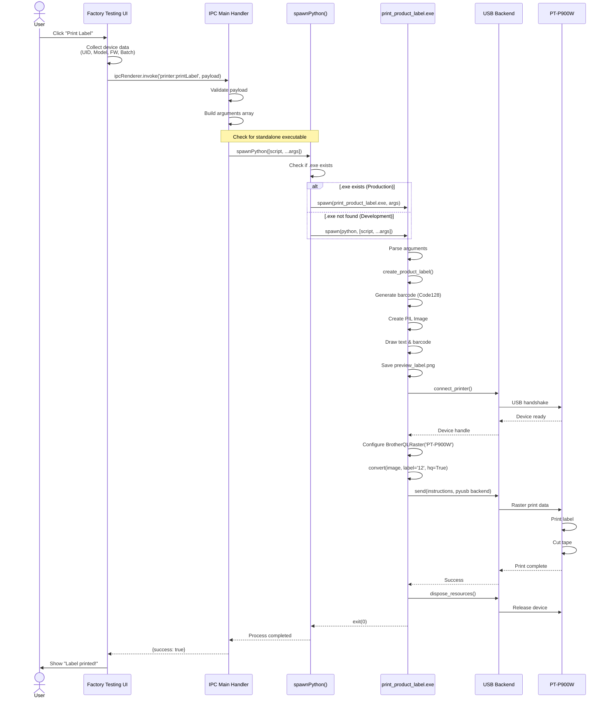
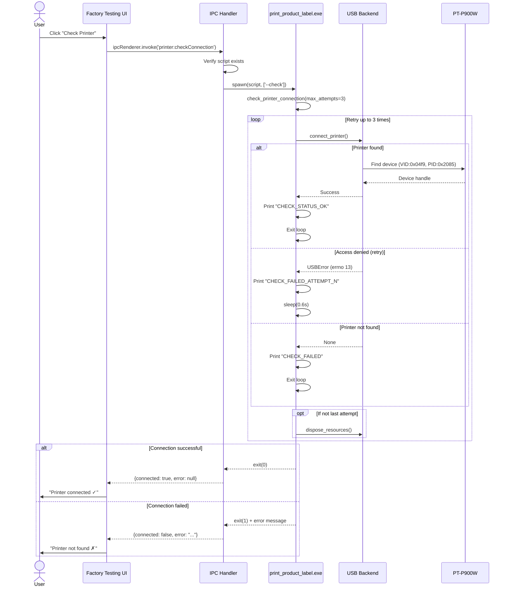
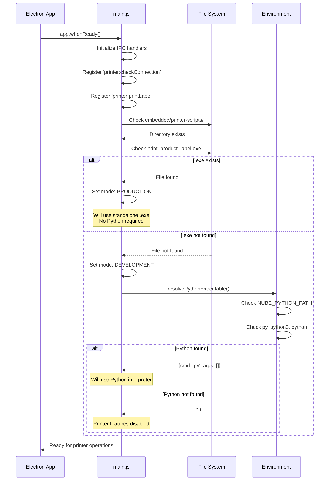
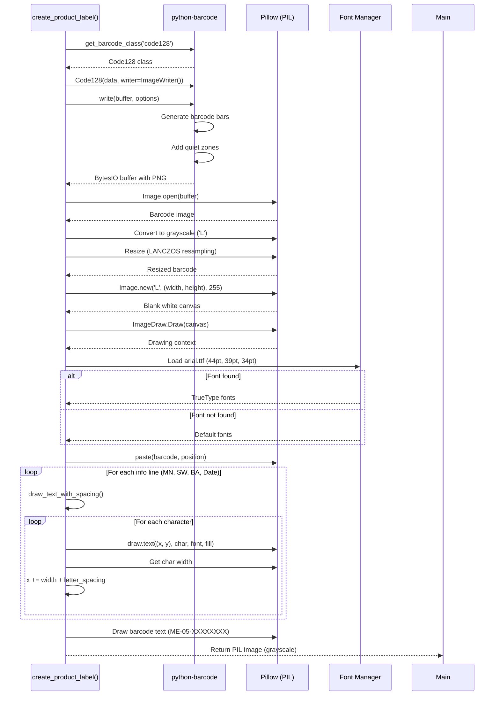
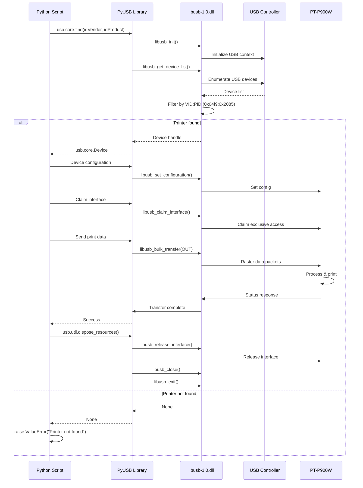
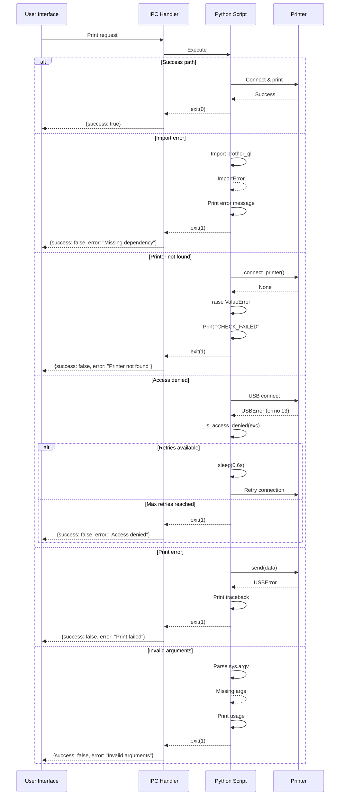
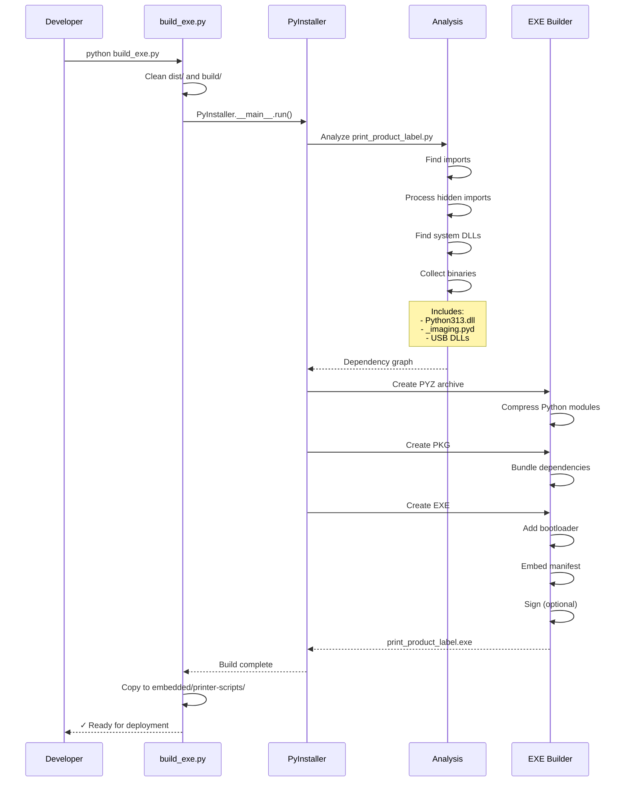
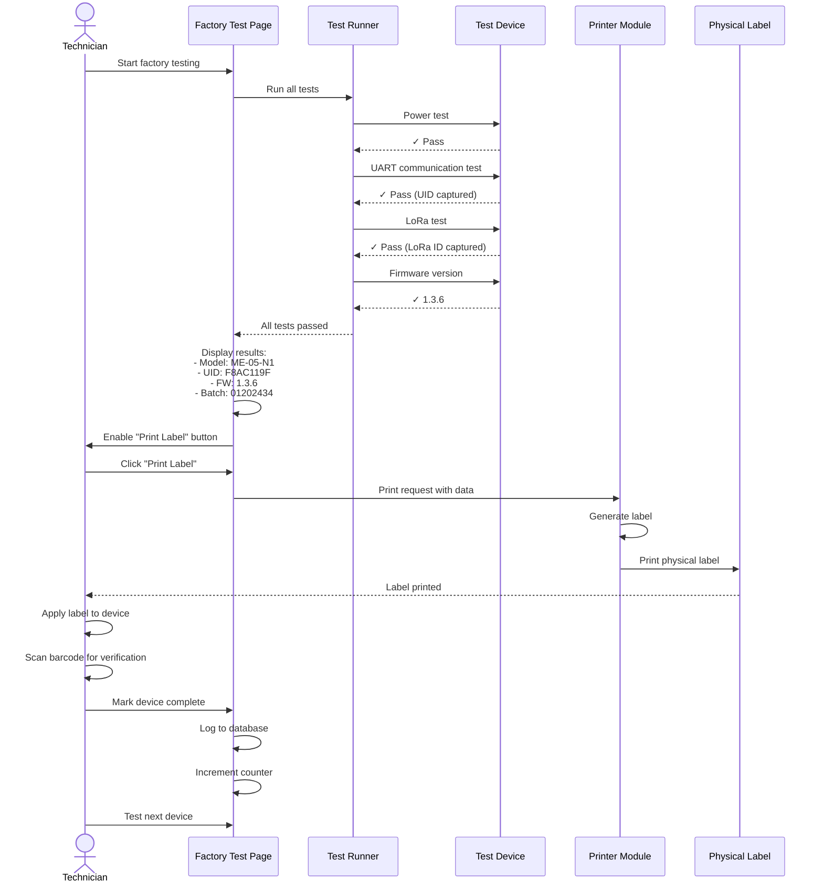

# Sequence Diagrams

## Overview

This document contains detailed sequence diagrams for the Brother printer integration workflows.

---

## 1. Print Label Sequence

Complete flow from UI button click to physical label printing.

---

## 2. Check Printer Connection Sequence

Printer connectivity verification with retry logic.

---

## 3. Application Startup - Printer Module Initialization

---

## 4. Label Generation Process

Detailed image creation workflow.

---

## 5. USB Communication Flow

Low-level USB communication sequence.

---

## 6. Error Handling Flow

Comprehensive error handling sequence.

---

## 7. PyInstaller Build Process

Build sequence for creating standalone executable.

---

## 8. Factory Testing Integration

How printer integrates with factory testing workflow.

---

## Notes

### Timing Considerations

- **Printer connection**: ~500ms
- **Label generation**: ~200ms
- **Print operation**: ~3-5 seconds
- **Total time**: ~4-6 seconds per label

### Retry Logic

- Connection retries: 3 attempts
- Retry delay: 0.6 seconds
- Total max wait: ~2 seconds

### Thread Safety

- All USB operations are synchronous
- No concurrent printer access
- IPC ensures sequential operations

### Error Recovery

- Automatic retry on access denied
- Clean resource disposal on errors
- Detailed error logging for debugging
