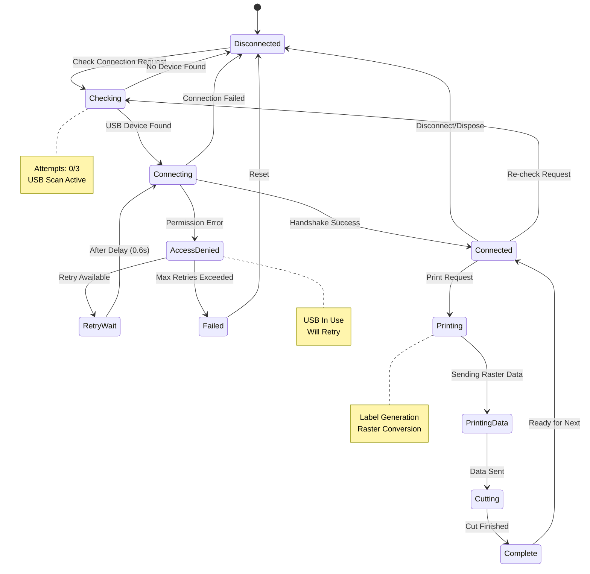
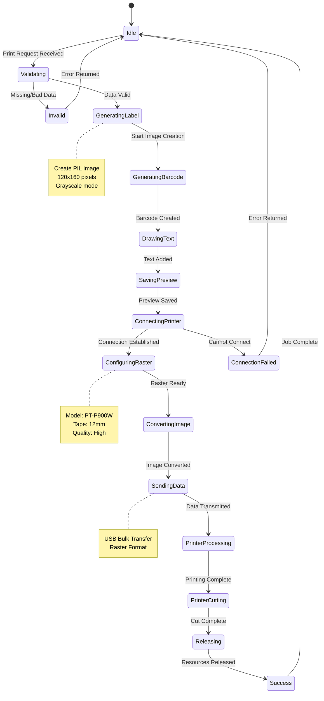
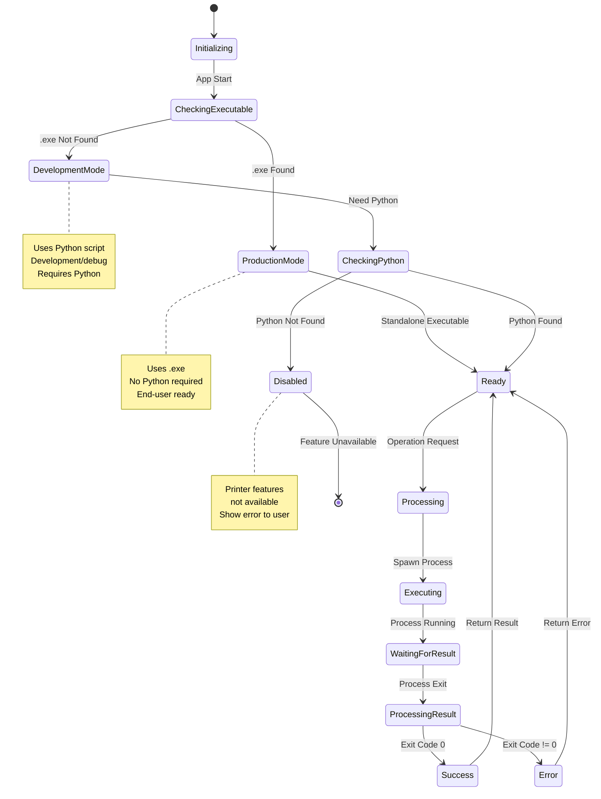
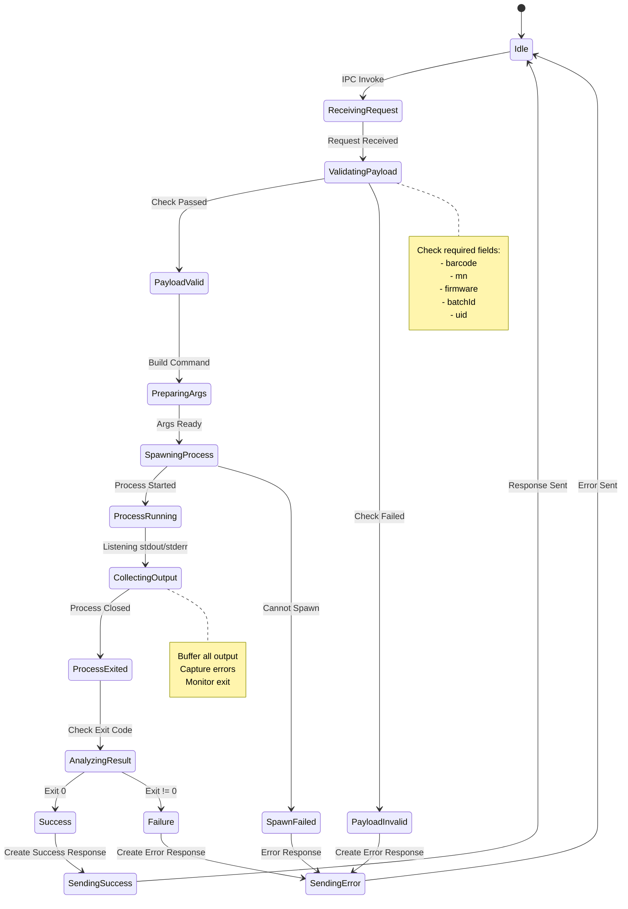
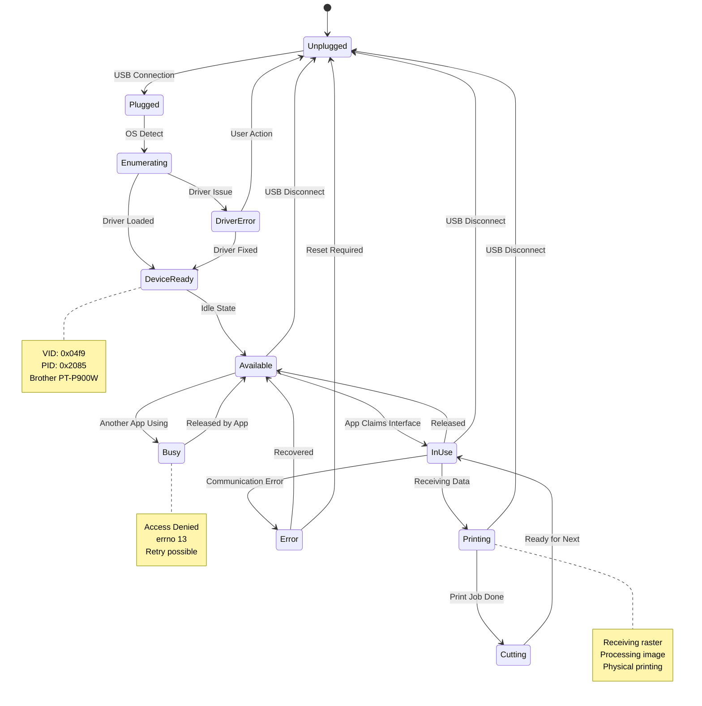
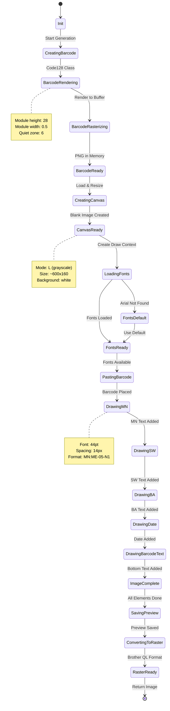
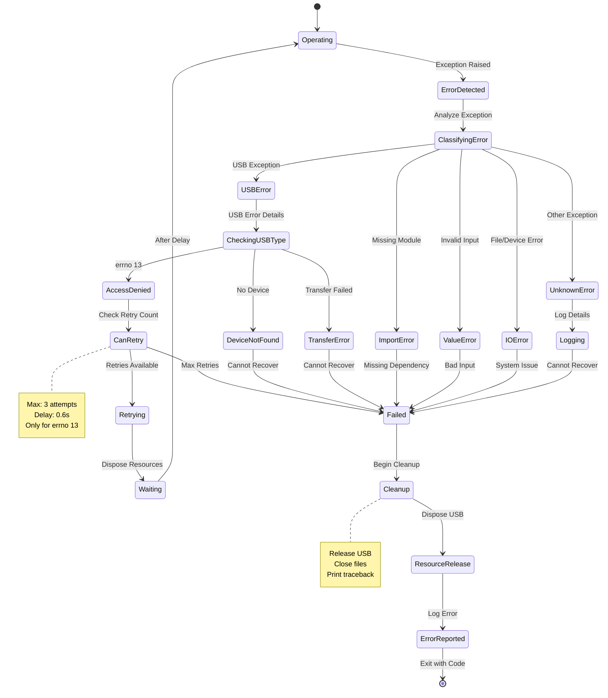
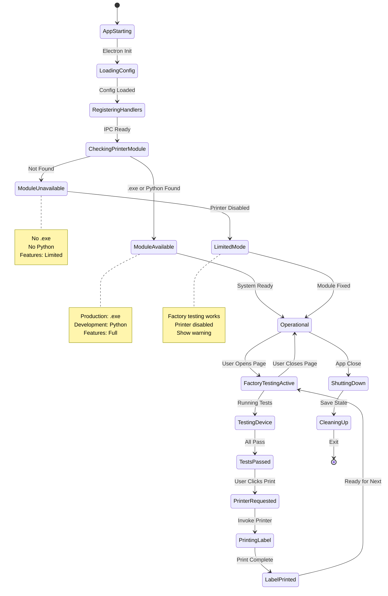
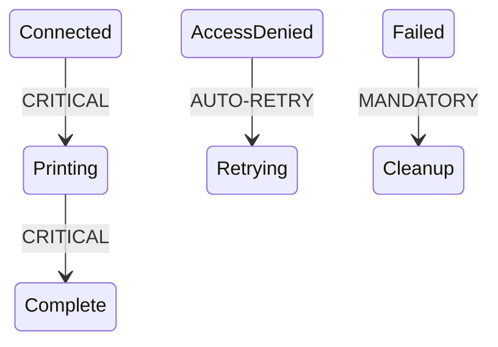

# State Diagrams

## Overview

This document contains state machine diagrams for the Brother printer integration system.

---

## 1. Printer Connection State Machine



---

## 2. Print Job State Machine



---

## 3. Application Printer Module State



---

## 4. Electron IPC Handler State



---

## 5. USB Device State



---

## 6. Label Generation Workflow State



---

## 7. Error Recovery State Machine



---

## 8. System Lifecycle State



---

## State Transition Summary

### Key States

| State | Description | Duration | Next States |
|-------|-------------|----------|-------------|
| **Disconnected** | No printer connection | Indefinite | Checking, [*] |
| **Checking** | Scanning for USB device | <500ms | Connecting, Disconnected |
| **Connected** | Printer ready for operations | Stable | Printing, Disconnected |
| **Printing** | Active print job | 3-5s | Complete, Error |
| **Failed** | Unrecoverable error | Terminal | Disconnected |

### Critical Transitions



### State Persistence

- **Connection state**: Not persisted (check on demand)
- **Print jobs**: Not queued (one at a time)
- **Errors**: Logged to console
- **Success count**: Tracked in UI only

---

## Timing Diagrams

### Connection Retry Timing

```
Attempt 1:  t=0s        → Fail (errno 13)
Wait:       t=0.6s
Attempt 2:  t=0.6s      → Fail (errno 13)
Wait:       t=1.2s
Attempt 3:  t=1.2s      → Success/Fail
Result:     t=1.2-1.5s
```

### Print Job Timing

```
Request:    t=0s
Generate:   t=0s-0.2s   (label creation)
Connect:    t=0.2s-0.7s (USB handshake)
Convert:    t=0.7s-0.9s (raster conversion)
Send:       t=0.9s-1.5s (data transfer)
Print:      t=1.5s-5.5s (physical printing)
Cut:        t=5.5s-6.0s (tape cutting)
Complete:   t=6.0s
```

---

## Notes

### State Storage

- States are **runtime only** (not persisted)
- Each operation starts fresh
- No state carried between print jobs

### Concurrency

- **Single-threaded**: One operation at a time
- **No queuing**: Reject concurrent requests
- **Resource locking**: USB device exclusive access

### Error Handling

- **Transient errors**: Retry (errno 13)
- **Permanent errors**: Fail fast
- **Resource cleanup**: Always executed

### Recovery Strategy

1. Identify error type
2. Determine if recoverable
3. Retry if appropriate
4. Clean up resources
5. Report to user
