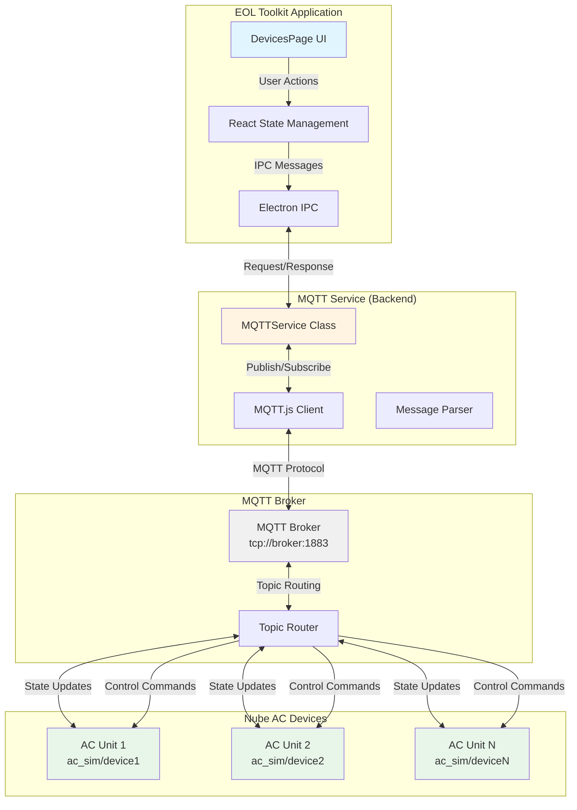
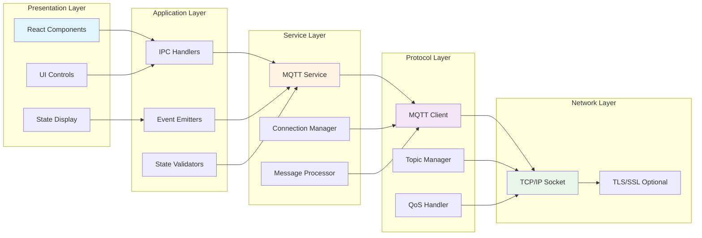
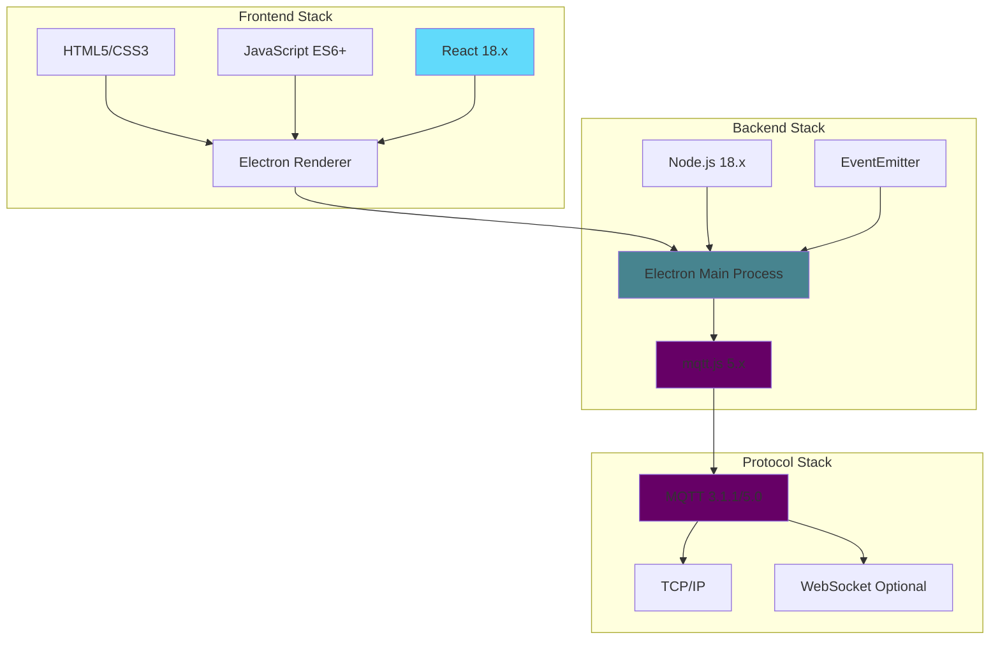
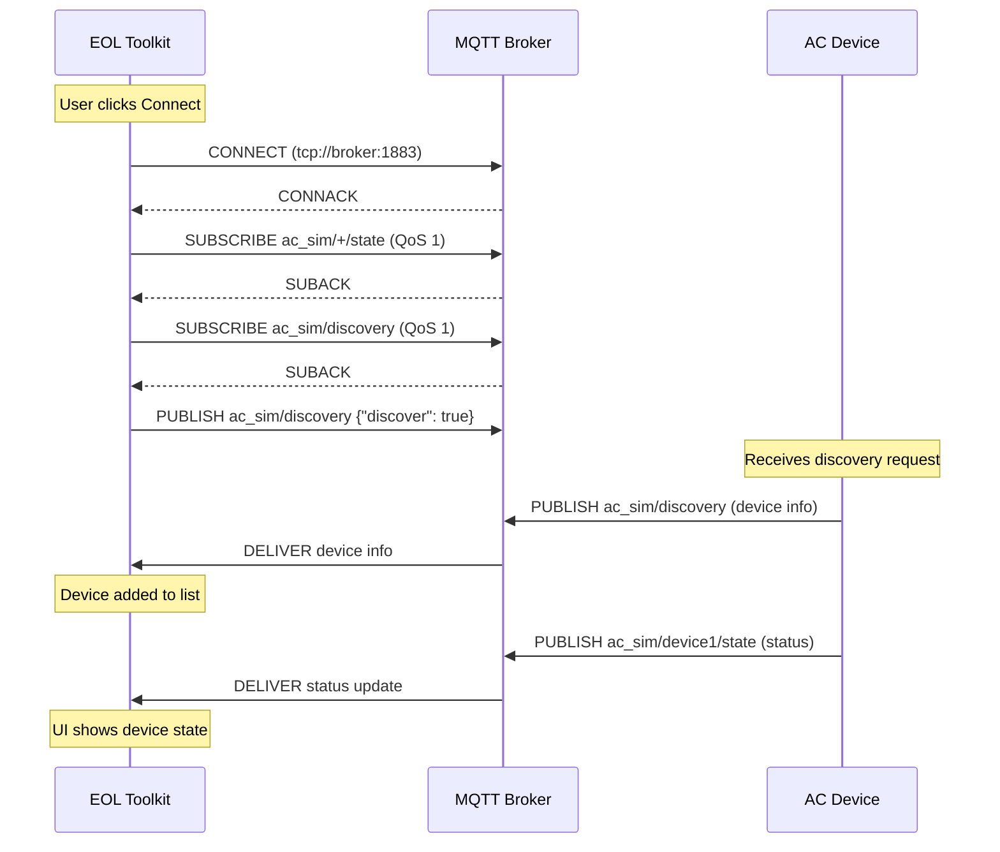
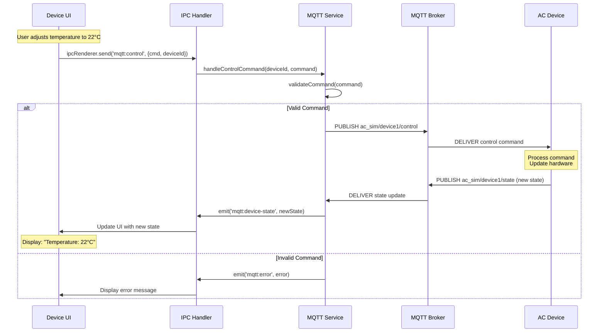
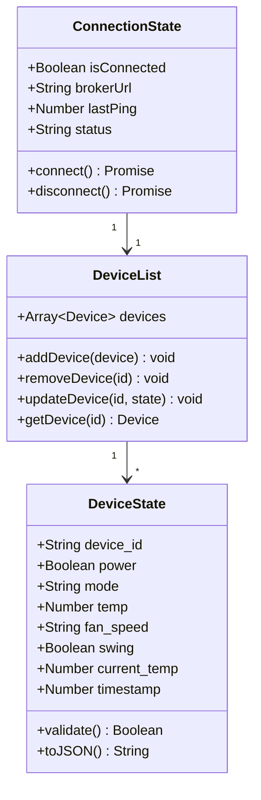
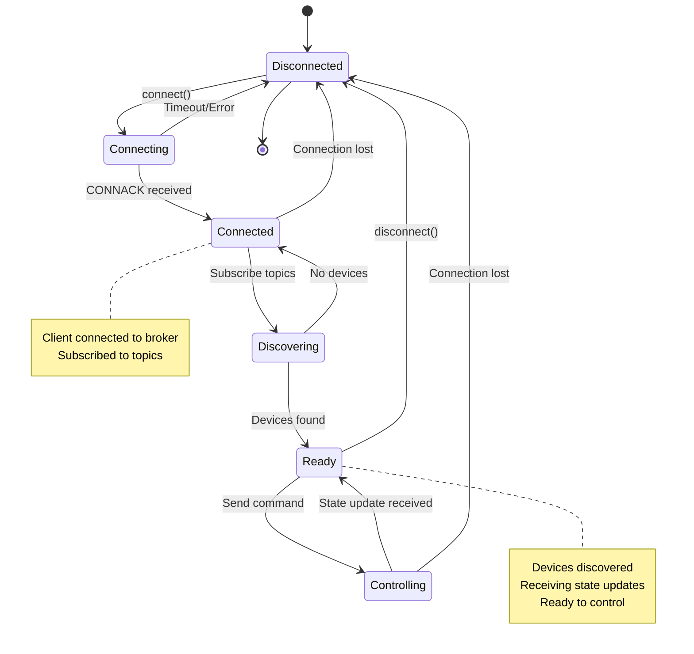

# Devices Feature - Technical Overview

**Feature:** MQTT Device Discovery and Control  
**Component:** DevicesPage + MQTTService  
**Status:** Production Ready  
**Last Updated:** December 9, 2025

---

## Table of Contents

1. [Introduction](#introduction)
2. [Architecture Overview](#architecture-overview)
3. [System Components](#system-components)
4. [Hardware Requirements](#hardware-requirements)
5. [Software Stack](#software-stack)
6. [MQTT Protocol Details](#mqtt-protocol-details)
7. [Device Discovery Mechanism](#device-discovery-mechanism)
8. [AC Control Protocol](#ac-control-protocol)
9. [Data Flow](#data-flow)
10. [State Management](#state-management)
11. [Performance Characteristics](#performance-characteristics)
12. [Security Considerations](#security-considerations)
13. [Integration Points](#integration-points)
14. [Technical Specifications](#technical-specifications)

---

## Introduction

The **Devices** feature provides MQTT-based device discovery and control capabilities for Nube AC systems. It implements a real-time, bidirectional communication system that allows the EOL Toolkit to discover, monitor, and control air conditioning units over MQTT.

### Purpose

This feature serves three primary purposes:

1. **Device Discovery:** Automatically discover Nube AC devices on the MQTT network
2. **Real-Time Monitoring:** Display current device status (temperature, mode, fan speed, etc.)
3. **Remote Control:** Send control commands to adjust AC settings

### Use Cases

- **Production Testing:** Verify AC control functionality during manufacturing
- **Field Commissioning:** Configure and test installed AC units
- **Remote Management:** Monitor and control multiple AC units from a central location
- **Debugging:** Troubleshoot device communication and control issues

---

## Architecture Overview

### High-Level Architecture



### Component Layers



---

## System Components

### 1. DevicesPage (Frontend)

**File:** `renderer/pages/DevicesPage.js` (265 lines)

**Responsibilities:**
- Render device list and controls
- Handle user interactions
- Manage local UI state
- Send IPC commands to backend
- Display connection status

**Key React State:**
```javascript
{
  brokerUrl: 'tcp://localhost:1883',
  isConnected: false,
  devices: [],           // Discovered devices
  selectedDevice: null,  // Currently controlled device
  lastUpdate: null      // Last status update timestamp
}
```

**UI Sections:**
1. **Broker Configuration Panel:** URL input, connect/disconnect buttons
2. **Device List:** Discovered devices with basic info
3. **Control Panel:** AC controls (power, mode, temp, fan, swing)
4. **Status Display:** Current device state

---

### 2. MQTTService (Backend)

**File:** `services/mqtt-service.js` (271 lines)

**Responsibilities:**
- Manage MQTT client lifecycle
- Handle connection/disconnection
- Subscribe to device topics
- Publish control commands
- Parse and validate messages
- Emit events to frontend

**Key Methods:**
```javascript
class MQTTService {
  connect(brokerUrl)           // Establish MQTT connection
  disconnect()                 // Gracefully disconnect
  subscribeToDevice(deviceId)  // Subscribe to device topics
  sendControl(deviceId, cmd)   // Send control command
  handleMessage(topic, msg)    // Process incoming messages
  parseDeviceState(payload)    // Parse JSON state
}
```

**Event Emitters:**
- `mqtt:connected` - Connection established
- `mqtt:disconnected` - Connection lost
- `mqtt:device-discovered` - New device found
- `mqtt:device-state` - Device state update
- `mqtt:error` - Error occurred

---

### 3. MQTT Client (Library)

**Library:** `mqtt@5.x` (MQTT.js)

**Configuration:**
```javascript
const options = {
  clientId: `eol-toolkit-${Math.random().toString(16).slice(3)}`,
  clean: true,                    // Clean session
  connectTimeout: 4000,           // 4 second timeout
  reconnectPeriod: 1000,          // Auto-reconnect every 1s
  keepalive: 60,                  // Keepalive interval
  protocolVersion: 4,             // MQTT 3.1.1
  qos: 1                          // At least once delivery
};
```

**Supported Protocols:**
- `tcp://` - Plain TCP (default port 1883)
- `mqtt://` - Same as tcp://
- `ws://` - WebSocket (port 9001)
- `wss://` - WebSocket Secure
- `mqtts://` - MQTT over TLS (port 8883)

---

## Hardware Requirements

### EOL Toolkit Host

**Minimum:**
- **CPU:** Dual-core processor
- **RAM:** 4GB (MQTT service uses ~50MB)
- **Network:** 100 Mbps Ethernet or WiFi
- **OS:** Windows 10/11, Linux (Ubuntu 20.04+), macOS 10.15+

**Recommended:**
- **CPU:** Quad-core processor
- **RAM:** 8GB
- **Network:** Gigabit Ethernet
- **Display:** 1920x1080 for optimal UI

---

### Network Infrastructure

**MQTT Broker:**
- **Software:** Mosquitto 2.x, EMQX, HiveMQ, or compatible
- **Performance:** Support for 100+ concurrent connections
- **Latency:** < 100ms round-trip time
- **Bandwidth:** ~1 Kbps per device (status updates)

**Network Topology:**
```
┌─────────────────┐
│  MQTT Broker    │
│  tcp://broker   │
│  Port 1883      │
└────────┬────────┘
         │
    ┌────┴────┬─────────┬─────────┐
    │         │         │         │
┌───┴───┐ ┌──┴───┐ ┌───┴───┐ ┌───┴───────┐
│ AC #1 │ │ AC #2│ │ AC #3 │ │EOL Toolkit│
└───────┘ └──────┘ └───────┘ └───────────┘
```

**Requirements:**
- All devices on same network (or routed)
- Multicast/broadcast not required (MQTT handles discovery)
- No special firewall rules if broker is local

---

### Nube AC Devices

**Communication Interface:**
- **Protocol:** MQTT 3.1.1 or 5.0
- **Connection:** WiFi (2.4GHz or 5GHz)
- **Update Rate:** 1-5 seconds for state updates
- **Command Response:** < 1 second typical

**Supported Models:**
- Nube AC Simulator (ac_sim)
- FGA-Gen2-Fw devices
- Custom MQTT-compatible AC units

---

## Software Stack

### Technology Stack



### Dependencies

**Frontend:**
```json
{
  "react": "^18.0.0",
  "react-dom": "^18.0.0"
}
```

**Backend:**
```json
{
  "mqtt": "^5.3.0",
  "electron": "^28.0.0"
}
```

---

## MQTT Protocol Details

### Topic Structure

**Device Discovery:**
```
ac_sim/discovery
```

**Device State (Subscribe):**
```
ac_sim/{device_id}/state
```

**Device Control (Publish):**
```
ac_sim/{device_id}/control
```

**Broadcast Control (Publish):**
```
ac_sim/all/control
```

### Message Format

**State Update Message:**
```json
{
  "device_id": "ac_unit_001",
  "power": true,
  "mode": "cool",
  "temp": 24,
  "fan_speed": "auto",
  "swing": false,
  "current_temp": 26.5,
  "timestamp": 1701234567890
}
```

**Control Command Message:**
```json
{
  "command": "set_temperature",
  "value": 22,
  "device_id": "ac_unit_001"
}
```

**Discovery Response:**
```json
{
  "device_id": "ac_unit_001",
  "device_type": "nube_ac",
  "firmware_version": "2.1.0",
  "ip_address": "192.168.1.100",
  "mac_address": "AA:BB:CC:DD:EE:FF"
}
```

---

### QoS Levels

**QoS 0 (At Most Once):**
- Used for: High-frequency state updates (optional)
- Reliability: No acknowledgment
- Use case: Non-critical status updates

**QoS 1 (At Least Once):**
- Used for: Control commands (default)
- Reliability: Acknowledged delivery
- Use case: Critical control commands

**QoS 2 (Exactly Once):**
- Used for: Not currently implemented
- Reliability: Guaranteed exactly once
- Use case: Future use for critical operations

**Current Implementation:**
```javascript
// Subscribe with QoS 1 for reliable delivery
client.subscribe('ac_sim/+/state', { qos: 1 });

// Publish control commands with QoS 1
client.publish('ac_sim/device1/control', message, { qos: 1 });
```

---

## Device Discovery Mechanism

### Discovery Flow



### Discovery Implementation

**Step 1: Subscribe to Discovery Topic**
```javascript
// Subscribe to discovery responses
await client.subscribeAsync('ac_sim/discovery', { qos: 1 });
```

**Step 2: Publish Discovery Request**
```javascript
// Request all devices to identify themselves
const discoveryMsg = JSON.stringify({ discover: true });
await client.publishAsync('ac_sim/discovery', discoveryMsg, { qos: 1 });
```

**Step 3: Handle Discovery Responses**
```javascript
client.on('message', (topic, message) => {
  if (topic === 'ac_sim/discovery') {
    const deviceInfo = JSON.parse(message.toString());
    addDiscoveredDevice(deviceInfo);
  }
});
```

**Step 4: Subscribe to Device State**
```javascript
// After discovery, subscribe to each device's state topic
await client.subscribeAsync(`ac_sim/${deviceId}/state`, { qos: 1 });
```

---

### Automatic Re-discovery

**Periodic Discovery:**
```javascript
// Re-discover every 30 seconds to find new devices
setInterval(() => {
  if (client.connected) {
    publishDiscoveryRequest();
  }
}, 30000);
```

**On Reconnect:**
```javascript
client.on('reconnect', () => {
  // Re-discover devices after reconnection
  setTimeout(() => publishDiscoveryRequest(), 2000);
});
```

---

## AC Control Protocol

### Control Commands

**Available Commands:**

1. **Power Control**
   ```json
   {
     "command": "power",
     "value": true  // true = ON, false = OFF
   }
   ```

2. **Mode Selection**
   ```json
   {
     "command": "mode",
     "value": "cool"  // "auto", "cool", "dry", "fan", "heat"
   }
   ```

3. **Temperature Set**
   ```json
   {
     "command": "temperature",
     "value": 24  // 16-30°C
   }
   ```

4. **Fan Speed**
   ```json
   {
     "command": "fan_speed",
     "value": "medium"  // "auto", "low", "medium", "high", "quiet"
   }
   ```

5. **Swing Control**
   ```json
   {
     "command": "swing",
     "value": true  // true = ON, false = OFF
   }
   ```

---

### Control Flow



---

### Command Validation

**Temperature Validation:**
```javascript
function validateTemperature(temp) {
  const MIN_TEMP = 16;
  const MAX_TEMP = 30;
  
  if (typeof temp !== 'number') {
    throw new Error('Temperature must be a number');
  }
  
  if (temp < MIN_TEMP || temp > MAX_TEMP) {
    throw new Error(`Temperature must be between ${MIN_TEMP}°C and ${MAX_TEMP}°C`);
  }
  
  return Math.round(temp); // Round to integer
}
```

**Mode Validation:**
```javascript
function validateMode(mode) {
  const VALID_MODES = ['auto', 'cool', 'dry', 'fan', 'heat'];
  
  if (!VALID_MODES.includes(mode)) {
    throw new Error(`Invalid mode. Must be one of: ${VALID_MODES.join(', ')}`);
  }
  
  return mode;
}
```

---

## Data Flow

### State Update Flow


### Control Command Flow


---

## State Management

### Device State Model



### State Transitions



---

## Performance Characteristics

### Latency Metrics

| Operation | Typical | Maximum | Notes |
|-----------|---------|---------|-------|
| **Connection** | 500ms | 4s | Includes broker handshake |
| **Discovery** | 1-2s | 5s | Depends on device count |
| **Control Command** | 100ms | 500ms | End-to-end (UI to AC) |
| **State Update** | 50ms | 200ms | AC to UI display |
| **Reconnection** | 1s | 10s | Auto-retry with backoff |

### Throughput

**Message Rate:**
- **State Updates:** ~1 Hz per device (1 message/second)
- **Control Commands:** ~0.1 Hz (burst capable)
- **Total Bandwidth:** ~1 Kbps per device

**Scalability:**
- **Supported Devices:** 100+ concurrent
- **MQTT Subscriptions:** 500+ topics
- **Memory Usage:** ~50MB base + 1MB per 10 devices

### Resource Usage

**CPU Usage:**
```
Idle:           1-2% (message processing)
Active Control: 5-10% (UI updates + MQTT)
Discovery:      10-15% (peak during discovery)
```

**Memory Usage:**
```
Base:           ~50MB (MQTT service)
Per Device:     ~100KB (state storage)
UI:             ~150MB (Electron renderer)
Total (10 dev): ~250MB
```

**Network Usage:**
```
Per Device:     ~1 Kbps (state updates)
Control:        ~500 bytes per command
Discovery:      ~2 KB burst
Total (10 dev): ~10 Kbps steady-state
```

---

## Security Considerations

### Authentication

**MQTT Username/Password:**
```javascript
const options = {
  username: 'eol_toolkit',
  password: 'secure_password', // Use environment variable
  clientId: `eol-toolkit-${randomId}`
};
```

**Best Practices:**
- Store credentials in environment variables
- Use unique clientId per connection
- Implement credential rotation

---

### Authorization

**Topic Access Control (Broker-side):**
```
# Example Mosquitto ACL
user eol_toolkit
topic readwrite ac_sim/#
topic read $SYS/#
```

**Application-level:**
- Validate device_id before sending commands
- Check device ownership/permissions
- Log all control commands

---

### Encryption

**TLS/SSL Support:**
```javascript
const options = {
  protocol: 'mqtts',  // MQTT over TLS
  port: 8883,
  rejectUnauthorized: true,
  ca: fs.readFileSync('ca.crt'),
  cert: fs.readFileSync('client.crt'),
  key: fs.readFileSync('client.key')
};
```

**Recommendations:**
- Use mqtts:// for production
- Validate broker certificates
- Use modern TLS versions (1.2+)

---

### Data Validation

**Input Sanitization:**
```javascript
function sanitizeDeviceId(deviceId) {
  // Only allow alphanumeric, dash, underscore
  if (!/^[a-zA-Z0-9_-]+$/.test(deviceId)) {
    throw new Error('Invalid device_id format');
  }
  return deviceId;
}
```

**Message Validation:**
```javascript
function validateStateMessage(message) {
  const schema = {
    device_id: 'string',
    power: 'boolean',
    mode: 'string',
    temp: 'number',
    // ... etc
  };
  
  return validateSchema(message, schema);
}
```

---

## Integration Points

### Electron IPC

**Frontend → Backend:**
```javascript
// Send control command
ipcRenderer.send('mqtt:control', {
  deviceId: 'ac_unit_001',
  command: 'temperature',
  value: 24
});
```

**Backend → Frontend:**
```javascript
// Send state update
mainWindow.webContents.send('mqtt:device-state', {
  deviceId: 'ac_unit_001',
  state: { temp: 24, power: true, /* ... */ }
});
```

---

### Other Features

**Integration with Fleet Monitoring:**
```javascript
// Share MQTT connection for fleet monitoring
const mqttService = require('./mqtt-service');
const fleetService = require('./fleet-monitoring');

fleetService.setMQTTClient(mqttService.getClient());
```

**Integration with UDP Logs:**
```javascript
// Log MQTT messages to UDP logger
mqttService.on('message', (topic, message) => {
  udpLogger.log(`MQTT: ${topic} - ${message}`);
});
```

---

## Technical Specifications

### Protocol Compliance

**MQTT Version:** 3.1.1 (OASIS Standard)
- Full support for MQTT 3.1.1 features
- Backward compatible with MQTT 3.1
- Forward compatible with MQTT 5.0 (via mqtt.js)

**Features Used:**
- ✅ QoS 0, 1 (QoS 2 not used)
- ✅ Retained messages
- ✅ Clean session
- ✅ Last Will and Testament (LWT)
- ✅ Persistent connections
- ✅ Automatic reconnection

---

### Topic Naming Convention

**Pattern:** `{namespace}/{device_id}/{message_type}`

**Components:**
- `namespace`: `ac_sim` (application namespace)
- `device_id`: Unique device identifier (alphanumeric + dash/underscore)
- `message_type`: `state`, `control`, `discovery`

**Wildcards:**
- `+`: Single-level wildcard (e.g., `ac_sim/+/state`)
- `#`: Multi-level wildcard (e.g., `ac_sim/#`)

---

### Error Handling

**Connection Errors:**
```javascript
client.on('error', (error) => {
  console.error('MQTT Error:', error);
  
  if (error.code === 'ECONNREFUSED') {
    // Broker not reachable
    showNotification('Broker unreachable. Check URL and firewall.');
  } else if (error.code === 'ENOTFOUND') {
    // DNS resolution failed
    showNotification('Cannot resolve broker hostname.');
  }
});
```

**Message Errors:**
```javascript
try {
  const state = JSON.parse(message.toString());
  validateState(state);
} catch (error) {
  console.error('Invalid message format:', error);
  // Log but don't crash
}
```

---

### Logging

**Log Levels:**
- **ERROR:** Connection failures, invalid messages
- **WARN:** Slow responses, unexpected disconnects
- **INFO:** Connection established, device discovered
- **DEBUG:** All MQTT messages (verbose)

**Log Format:**
```
[2025-12-09 10:15:30] [INFO] [MQTTService] Connected to tcp://localhost:1883
[2025-12-09 10:15:31] [INFO] [MQTTService] Device discovered: ac_unit_001
[2025-12-09 10:15:35] [DEBUG] [MQTTService] State update: ac_unit_001 - {"temp": 24, "power": true}
```

---

## Revision History

| Version | Date | Changes | Author |
|---------|------|---------|--------|
| 1.0 | 2025-12-09 | Initial technical overview created | Documentation Team |

---

## Related Documentation

- [README.md](./README.md) - Quick start guide
- [UserGuide.md](./UserGuide.md) - Detailed user procedures
- [SourceCode.md](./SourceCode.md) - Code documentation
- [Troubleshooting.md](./Troubleshooting.md) - Problem solving

---

**[← Back to Devices README](./README.md)** | **[Next: User Guide →](./UserGuide.md)**
