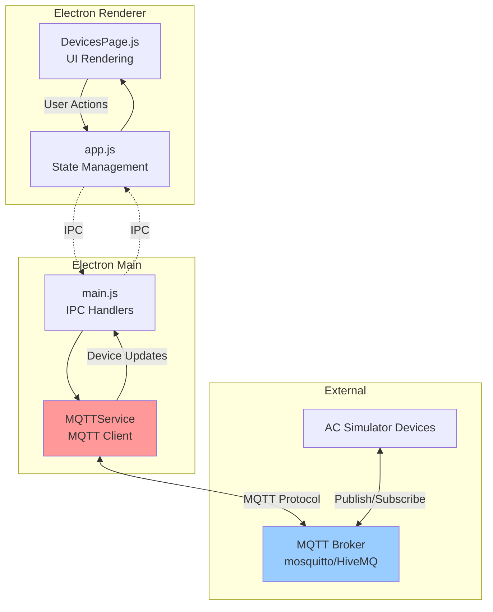

# Devices - MQTT Device Management

**Feature:** Devices (Main Dashboard)  
**Purpose:** MQTT-based device discovery and control  
**Status:** Core feature - Always enabled  
**Last Updated:** December 9, 2025

---

## 📋 Overview

The **Devices** feature is the main dashboard of the NubeIO EOL Toolkit, providing MQTT-based device discovery and real-time control of AC simulator devices. This is the landing page when you open the application.

### Key Capabilities

- 🔌 **MQTT Broker Connection** - Connect to local or remote MQTT brokers
- 🔍 **Automatic Device Discovery** - Discover devices via MQTT topics
- 🎮 **Real-Time Control** - Control AC parameters (power, mode, temp, fan, swing)
- 📊 **Multi-Device Management** - Manage multiple devices simultaneously
- 💾 **Persistent Configuration** - Remember broker settings
- 🌓 **Theme Support** - Light/dark mode

---

## 🚀 Quick Start

### 1. Configure MQTT Broker

Click **⚙️ Config** button to set broker details:
- **Broker:** localhost (or remote IP/hostname)
- **Port:** 1883 (default MQTT port)
- **Device ID:** Auto-generated unique ID

### 2. Connect

Click **Connect** button to establish MQTT connection.

### 3. Discover Devices

Devices automatically appear in the grid when they publish to MQTT topics:
- `ac_sim/{device_id}/state`
- `ac_sim/discovery`

### 4. Control Devices

Use the AC control panel for each device:
- **Power:** Toggle on/off
- **Mode:** Auto, Cool, Dry, Fan, Heat
- **Temperature:** 16-30°C (slider or +/- buttons)
- **Fan Speed:** Auto, Low, Medium, High, Quiet
- **Swing:** Toggle on/off

---

## 🏗️ Architecture

### System Overview



### Component Diagram

```mermaid
graph LR
    subgraph UI Components
        HEADER[Header Controls<br/>Connect/Config]
        GRID[Device Grid<br/>3-column layout]
        PANEL[Device Panel<br/>AC Controls]
    end
    
    subgraph State Management
        CONFIG[MQTT Config<br/>broker, port, deviceId]
        DEVICES_STATE[Devices Map<br/>deviceId → state]
        CONNECTION[Connection State<br/>isConnected]
    end
    
    subgraph MQTT Topics
        STATE[ac_sim/{id}/state]
        CONTROL[ac_sim/{id}/control]
        DISCOVERY[ac_sim/discovery]
        BROADCAST[ac_sim/all/control]
    end
    
    HEADER --> CONFIG
    GRID --> DEVICES_STATE
    PANEL --> DEVICES_STATE
    
    CONNECTION --> HEADER
    DEVICES_STATE --> GRID
    
    STATE -.Subscribe.-> DEVICES_STATE
    CONTROL -.Publish.-> PANEL
    DISCOVERY -.Subscribe.-> DEVICES_STATE
    
    style MQTT fill:#ffcc99
```

---

## 🎮 Features

### MQTT Connection Management

**Configuration:**
- Broker address (IP or hostname)
- Port (default: 1883)
- Auto-generated device ID
- Persistent config storage

**Connection States:**
- 🔴 **Disconnected** - Not connected to broker
- 🟡 **Connecting** - Attempting connection
- 🟢 **Connected** - Active connection with device count

### Device Discovery

**Discovery Methods:**
1. **State Updates:** Devices publishing to `ac_sim/{device_id}/state`
2. **Discovery Messages:** Devices announcing on `ac_sim/discovery`

**Device Information:**
- Unique device ID
- Current state (power, mode, temp, fan, swing)
- Last update timestamp
- Connection status

### AC Control Panel

Each device displays:

**Status Display:**
- Power indicator (green/red LED)
- Current mode with icon
- Set temperature (large display)
- Current temperature
- Fan speed
- Swing status

**Control Buttons:**
- **Power:** On/Off toggle
- **Mode:** Cycle through Auto → Cool → Dry → Fan → Heat
- **Temperature:** 
  - Slider (16-30°C)
  - +/- buttons (0.5°C increments)
- **Fan Speed:** Cycle through Auto → Low → Med → High → Quiet
- **Swing:** On/Off toggle

**Visual Feedback:**
- Background color changes (green when on, gray when off)
- Smooth animations
- Real-time updates

---

## 📡 MQTT Protocol

### Topics Structure

**Subscribe Topics (Receive):**
```
ac_sim/{device_id}/state       - Device state updates
ac_sim/discovery                - Device discovery announcements
```

**Publish Topics (Send):**
```
ac_sim/{device_id}/control      - Control individual device
ac_sim/all/control              - Broadcast to all devices
```

### Message Formats

**State Message (Receive):**
```json
{
  "power": true,
  "mode": "Cool",
  "temperature": 22.0,
  "fanSpeed": "Auto",
  "swing": false,
  "currentTemp": 24.5,
  "model": 1
}
```

**Control Message (Send):**
```json
{
  "command": "setPower",
  "value": true
}
```

**Control Commands:**
- `setPower` - value: true/false
- `setMode` - value: "Auto"|"Cool"|"Dry"|"Fan"|"Heat"
- `setTemp` - value: 16-30 (number)
- `setFan` - value: "Auto"|"Low"|"Med"|"High"|"Quiet"
- `setSwing` - value: true/false

---

## 💻 User Interface

### Main Controls

**Header Bar:**
- **Title:** "AC Devices"
- **Status Indicator:** 
  - 🔴 Disconnected
  - 🟢 Connected (with device count)
- **Config Button:** Opens MQTT configuration modal
- **Connect/Disconnect Button:** Toggle connection

**Device Grid:**
- Responsive 3-column layout (2 on medium screens, 1 on small)
- Auto-adjusts based on device count
- Empty state message when no devices

### Device Panel Layout

```
┌─────────────────────────────────┐
│ FUJITSU                    ●    │ Header
├─────────────────────────────────┤
│ ┌───────────────────────────┐   │
│ │ AC_SIM_ABC123      12:34  │   │ Device Info
│ │                           │   │
│ │  Mode    Set Temp   Fan   │   │ Status Display
│ │  ❄️       22.0°C    🌪️    │   │
│ │  Cool      ---     Auto   │   │
│ └───────────────────────────┘   │
│                                 │
│ Current Temperature: 24.5°C     │ Ambient Temp
│                                 │
│ ┌─────────────────────────────┐ │
│ │  Power     Mode    Temp     │ │ Control Buttons
│ │  [ON/OFF]  [CYCLE] [SLIDER] │ │
│ │  Fan       Swing            │ │
│ │  [CYCLE]   [TOGGLE]         │ │
│ └─────────────────────────────┘ │
└─────────────────────────────────┘
```

---

## 🔧 Configuration

### MQTT Broker Setup

**Local Broker (Recommended for testing):**
```bash
# Install Mosquitto
sudo apt install mosquitto mosquitto-clients  # Linux
brew install mosquitto                        # macOS
# Or use Docker
docker run -p 1883:1883 eclipse-mosquitto
```

**Configuration in App:**
1. Click ⚙️ Config button
2. Enter broker: `localhost`
3. Enter port: `1883`
4. Click Save

**Remote Broker:**
- Use IP address or hostname of remote broker
- Ensure port 1883 is accessible
- Consider using VPN for security

### Device ID

**Auto-Generated:**
- Format: `AC_SIM_XXXXXX` (6 hex digits)
- Stored in: `{userData}/device_id.txt`
- Persists across app restarts
- Unique per installation

**Manual Override:**
- Edit `device_id.txt` in app data folder
- Restart application

---

## 🎯 Common Tasks

### Task 1: Connect to MQTT Broker

1. Open application (Devices tab)
2. Click **⚙️ Config**
3. Enter broker address and port
4. Click **Connect**
5. Wait for green status indicator

**Expected Result:** Status shows "Connected (0 devices)" initially

---

### Task 2: Add Simulated Device

**Using AC Simulator:**
1. Run AC simulator application
2. Configure same MQTT broker
3. Connect simulator
4. Device appears automatically in grid

**Using MQTT Command Line:**
```bash
# Publish device state
mosquitto_pub -h localhost -t "ac_sim/TEST_001/state" -m '{
  "power": true,
  "mode": "Cool",
  "temperature": 22.0,
  "fanSpeed": "Auto",
  "swing": false,
  "currentTemp": 24.5,
  "model": 1
}'
```

---

### Task 3: Control AC Device

**Power On/Off:**
1. Click power button on device panel
2. Background turns green (on) or gray (off)
3. Device receives command via MQTT

**Change Temperature:**
1. Use slider to set temperature (16-30°C)
2. Or click +/- buttons for 0.5°C adjustments
3. Device updates in real-time

**Change Mode:**
1. Click mode button repeatedly
2. Cycles: Auto → Cool → Dry → Fan → Heat → Auto
3. Icon updates to reflect mode

---

### Task 4: Monitor Multiple Devices

**Setup:**
1. Connect multiple AC simulators
2. Each appears in grid automatically
3. Grid auto-layouts (3 columns)

**Monitoring:**
- Each panel shows device status independently
- Real-time updates from all devices
- Scroll to view more devices

**Broadcast Control:**
- MQTT topic: `ac_sim/all/control`
- Affects all connected devices simultaneously

---

## 🐛 Troubleshooting

### Issue: Can't Connect to Broker

**Symptoms:**
- Connection fails
- Status stays "Disconnected"
- Error in console

**Solutions:**
1. Verify broker is running:
   ```bash
   ps aux | grep mosquitto
   ```
2. Check broker port is open:
   ```bash
   netstat -an | grep 1883
   ```
3. Test with mosquitto_sub:
   ```bash
   mosquitto_sub -h localhost -p 1883 -t "#" -v
   ```
4. Check firewall settings
5. Verify broker address (no http://)

---

### Issue: No Devices Appear

**Symptoms:**
- Connected to broker
- But no devices in grid

**Solutions:**
1. Verify devices are publishing to correct topics
2. Check MQTT topic structure: `ac_sim/{device_id}/state`
3. Monitor MQTT traffic:
   ```bash
   mosquitto_sub -h localhost -t "ac_sim/#" -v
   ```
4. Ensure device is connected to same broker
5. Check for JSON parsing errors in console

---

### Issue: Device Controls Don't Work

**Symptoms:**
- Buttons click but device doesn't respond
- State doesn't update

**Solutions:**
1. Verify device is subscribed to control topic
2. Check MQTT publish is working:
   ```bash
   mosquitto_sub -h localhost -t "ac_sim/+/control" -v
   ```
3. Ensure JSON format is correct
4. Check device is processing commands
5. Review device console logs

---

### Issue: Connection Drops

**Symptoms:**
- Connected, then disconnects randomly
- Status indicator goes red

**Solutions:**
1. Check network stability
2. Increase broker keepalive timeout
3. Check broker max connections limit
4. Monitor broker logs
5. Consider using reconnect logic (already implemented)

---

## 📚 Code References

**Main Files:**
- `renderer/pages/DevicesPage.js` - UI rendering (265 lines)
- `services/mqtt-service.js` - MQTT client logic (271 lines)
- `main.js` - IPC handlers for MQTT

**Key Methods:**
- `app.handleConnectMQTT()` - Initiate connection
- `app.handleDisconnectMQTT()` - Close connection
- `MQTTService.connect()` - MQTT broker connection
- `DevicesPage.render()` - UI rendering
- `DevicesPage.renderDevicePanel()` - Individual device UI

**IPC Channels:**
- `mqtt:connect` - Connect to broker
- `mqtt:disconnect` - Disconnect from broker
- `mqtt:control` - Send control command
- `mqtt:device-discovered` - Device added
- `mqtt:device-updated` - Device state changed
- `mqtt:connected` - Connection established
- `mqtt:disconnected` - Connection lost

---

## 🔗 Related Features

- **UDP Logs** - Monitor device debug logs
- **Serial Console** - Direct device communication
- **Provisioning** - Configure device WiFi for MQTT
- **Fleet Monitoring** - Advanced multi-device monitoring

---

## 📝 Best Practices

### For Users

1. **Start broker first** before connecting
2. **Use localhost** for local testing
3. **Monitor UDP logs** for device debugging
4. **Keep devices on same network** as broker

### For Developers

1. **Follow MQTT topic conventions** (`ac_sim/{id}/...`)
2. **Use QoS 0** for state updates (fast, fire-and-forget)
3. **Use QoS 1** for control commands (delivery guaranteed)
4. **Implement retained messages** for device state persistence
5. **Add error handling** for JSON parsing

---

## 🎓 Learning Resources

**MQTT Protocol:**
- [MQTT Essentials](https://www.hivemq.com/mqtt-essentials/)
- [Mosquitto Documentation](https://mosquitto.org/documentation/)

**Related Documentation:**
- [Main Documentation Index](../../README.md)
- [Factory Testing](../factory-testing/README.md)
- [Fleet Monitoring](../fleet-monitoring/README.md)

---

## 📄 File Listing

**This Feature's Documentation:**
- [README.md](./README.md) - This file (overview)
- [DevicesPage-Overview.md](./DevicesPage-Overview.md) - Technical deep dive
- [DevicesPage-UserGuide.md](./DevicesPage-UserGuide.md) - Detailed procedures
- [DevicesPage-SourceCode.md](./DevicesPage-SourceCode.md) - Developer documentation
- [DevicesPage-Troubleshooting.md](./DevicesPage-Troubleshooting.md) - Problem solving

---

**Last Updated:** December 9, 2025  
**Status:** ✅ Core Feature - Always Available  
**Next:** Read [DevicesPage-UserGuide.md](./DevicesPage-UserGuide.md) for detailed instructions
