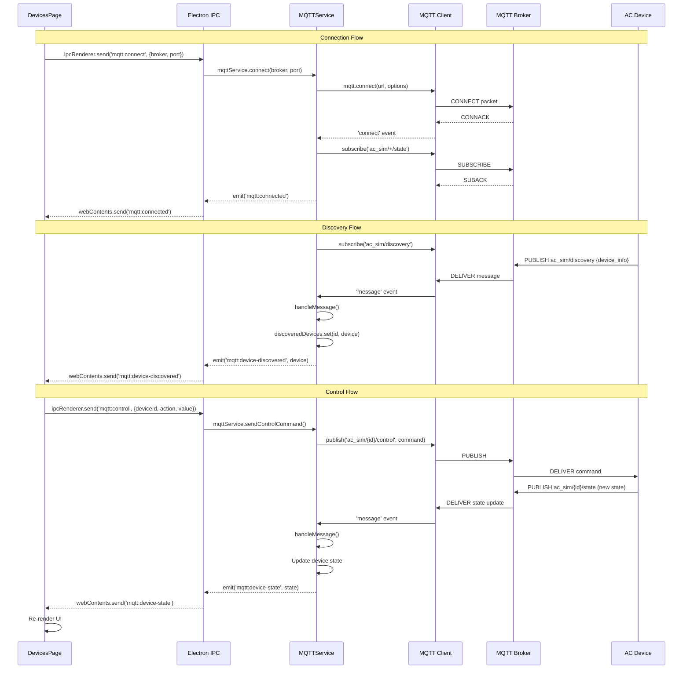
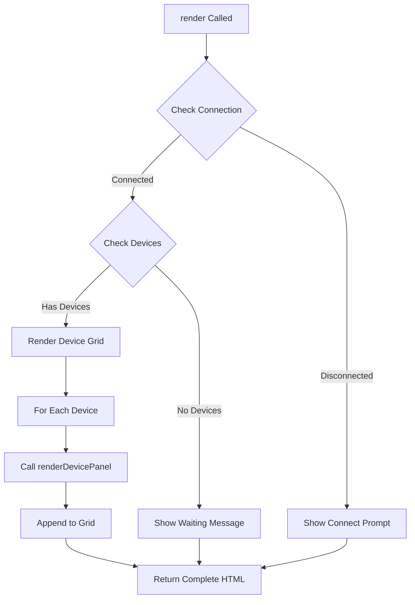
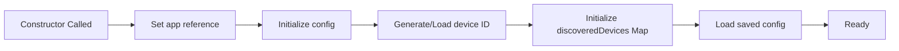
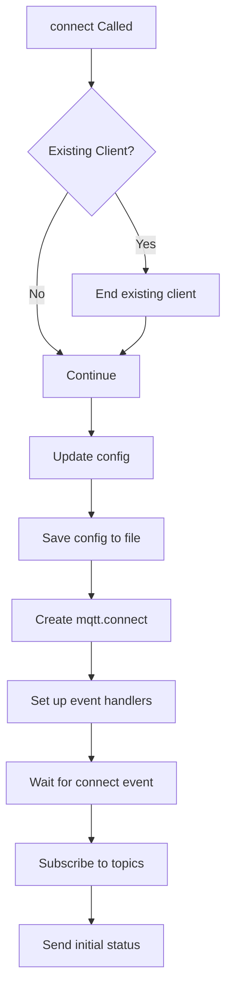
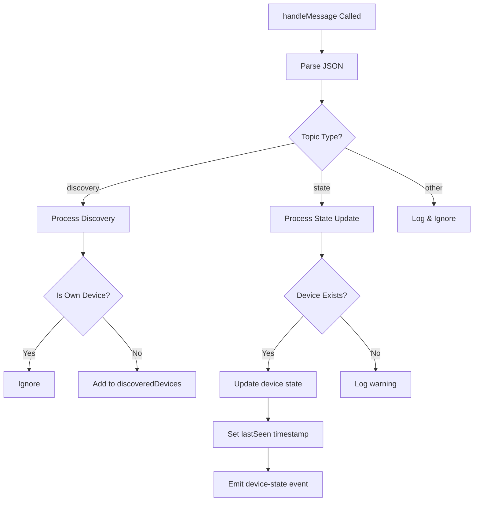
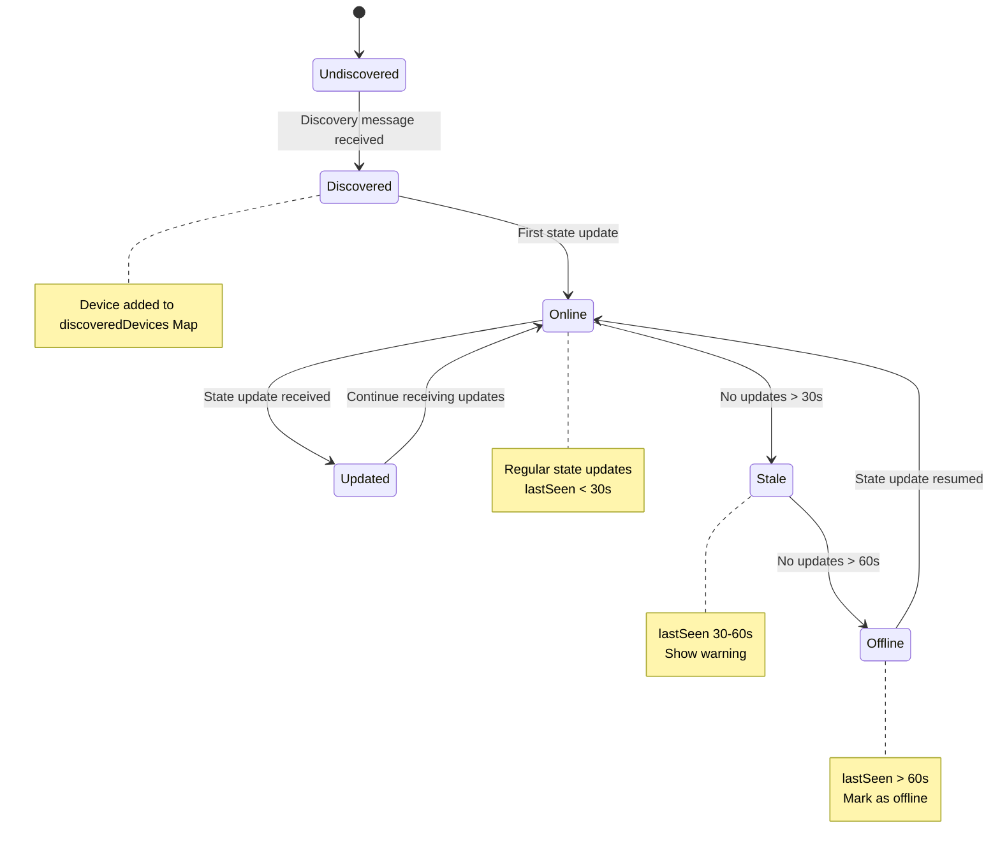

# Devices Feature - Source Code Documentation

**Feature:** MQTT Device Discovery and Control  
**Audience:** Software Developers, System Architects  
**Last Updated:** December 9, 2025

---

## Table of Contents

1. [Introduction](#introduction)
2. [System Architecture](#system-architecture)
3. [Class Documentation](#class-documentation)
4. [Method Reference](#method-reference)
5. [Data Structures](#data-structures)
6. [IPC Communication](#ipc-communication)
7. [MQTT Protocol Implementation](#mqtt-protocol-implementation)
8. [State Management](#state-management)
9. [Error Handling](#error-handling)
10. [Code Examples](#code-examples)
11. [Adding New Features](#adding-new-features)
12. [Testing Guide](#testing-guide)
13. [Performance Optimization](#performance-optimization)
14. [Code Maintenance](#code-maintenance)

---

## Introduction

This document provides complete source code documentation for the Devices feature, including class structures, method APIs, data flows, and implementation details.

### File Structure

```
renderer/pages/
  └── DevicesPage.js          (265 lines) - Frontend UI component

services/
  └── mqtt-service.js          (271 lines) - Backend MQTT service

main.js                        - IPC handlers in main process
```

### Technology Stack

- **Frontend:** Vanilla JavaScript ES6+, TailwindCSS
- **Backend:** Node.js with mqtt.js library
- **IPC:** Electron IPC (Main ↔ Renderer)
- **Protocol:** MQTT 3.1.1

---

## System Architecture

### Component Architecture

```mermaid
classDiagram
    class DevicesPage {
        -app: App
        +constructor(app)
        +render() string
        +renderDevicePanel(device) string
    }
    
    class MQTTService {
        -app: ElectronApp
        -client: MQTTClient
        -config: Config
        -discoveredDevices: Map
        -isConnected: boolean
        +constructor(app)
        +connect(broker, port)
        +disconnect()
        +handleMessage(topic, message)
        +sendStatus()
        +sendControlCommand(deviceId, action, value)
        +getDiscoveredDevices() Array
        +getStatus() boolean
    }
    
    class MQTTClient {
        <<external library>>
        +connect(url, options)
        +subscribe(topic, options)
        +publish(topic, message, options)
        +on(event, callback)
        +end()
    }
    
    class ElectronApp {
        -mqttService: MQTTService
        +ipcMain handlers
    }
    
    DevicesPage --> ElectronApp : IPC calls
    ElectronApp --> MQTTService : service calls
    MQTTService --> MQTTClient : mqtt operations
    MQTTClient --> "MQTT Broker" : network
    
    style DevicesPage fill:#e1f5ff
    style MQTTService fill:#fff4e1
    style MQTTClient fill:#f3e5f5
```

---

### Data Flow Architecture



---

## Class Documentation

### DevicesPage Class

**File:** `renderer/pages/DevicesPage.js`  
**Lines:** 1-265  
**Purpose:** Frontend component for device management UI

```javascript
class DevicesPage {
  constructor(app)
  render()
  renderDevicePanel(device)
}
```

#### Properties

| Property | Type | Description |
|----------|------|-------------|
| `app` | `App` | Reference to main application instance |

#### Constructor

```javascript
/**
 * Create a DevicesPage instance
 * @param {App} app - Main application instance
 */
constructor(app) {
  this.app = app;
}
```

**Parameters:**
- `app` (App): Main application instance containing state and methods

**Usage:**
```javascript
const devicesPage = new DevicesPage(app);
```

---

#### Method: render()

```javascript
/**
 * Render the devices page HTML
 * @returns {string} - HTML string for the page
 */
render()
```

**Returns:** `string` - Complete HTML for devices page

**Description:**
Generates the full HTML markup for the devices page, including:
- Broker configuration section
- Connection status indicator
- Device grid (if devices discovered)
- Empty state (if no devices)

**Logic Flow:**


**Code Structure:**
```javascript
render() {
  return `
    <div class="controls">
      <!-- Connection status -->
      <!-- Connect/Disconnect button -->
    </div>
    
    ${this.app.discoveredDevices.length === 0 ? `
      <!-- Empty state -->
    ` : `
      <!-- Device grid -->
      ${this.app.discoveredDevices.map(device => 
        this.renderDevicePanel(device)
      ).join('')}
    `}
  `;
}
```

---

#### Method: renderDevicePanel(device)

```javascript
/**
 * Render a single device control panel
 * @param {Object} device - Device object with state
 * @returns {string} - HTML string for device panel
 */
renderDevicePanel(device)
```

**Parameters:**
- `device` (Object): Device object containing:
  ```javascript
  {
    deviceId: string,      // Unique device identifier
    lastSeen: Date,        // Last update timestamp
    ipAddress: string,     // Device IP address
    firmwareVer: string,   // Firmware version
    state: {               // Current AC state
      power: boolean,
      mode: string,
      temperature: number,
      fanSpeed: string,
      swing: boolean,
      currentTemp: number,
      model: number
    }
  }
  ```

**Returns:** `string` - HTML for single device panel

**Description:**
Renders a complete AC control panel with:
- Device header (name, status indicator)
- Current state display (mode, temp, fan)
- Room temperature with adjustment buttons
- Power button
- Temperature adjustment buttons
- Mode and fan control buttons
- Swing control button

**UI Sections:**

1. **Header Section:**
   ```javascript
   <div class="header">
     <h1>FUJITSU</h1>
     <div class="status-dot ${power ? 'green' : 'red'}"></div>
   </div>
   ```

2. **State Display:**
   ```javascript
   <div class="state-display">
     <div class="mode">${getModeIcon(mode)} ${mode}</div>
     <div class="temp">${temperature.toFixed(1)}°C</div>
     <div class="fan">≈ ${fanSpeed}</div>
   </div>
   ```

3. **Control Buttons:**
   ```javascript
   <button onclick="app.handleDevicePower('${deviceId}')">
     ON/OFF
   </button>
   <button onclick="app.handleDeviceTemp('${deviceId}', 0.5)">
     TEMP+
   </button>
   <!-- etc. -->
   ```

**Disabled State Logic:**
```javascript
${!this.app.isConnected ? 'disabled' : ''}
${!this.app.isConnected || !acState.power ? 'disabled' : ''}
```
- Controls disabled when MQTT disconnected
- Some controls disabled when power is OFF

---

### MQTTService Class

**File:** `services/mqtt-service.js`  
**Lines:** 1-271  
**Purpose:** Backend service managing MQTT connections and device communication

```javascript
class MQTTService {
  constructor(app)
  connect(broker, port)
  disconnect()
  handleMessage(topic, message)
  sendStatus()
  sendControlCommand(deviceId, action, value)
  getDiscoveredDevices()
  getConfig()
  updateConfig(broker, port)
  getStatus()
  
  // Private methods
  getDeviceID()
  loadConfig()
  saveConfig()
}
```

#### Properties

| Property | Type | Description |
|----------|------|-------------|
| `app` | `ElectronApp` | Electron app instance |
| `client` | `MQTTClient` | mqtt.js client instance |
| `config` | `Object` | MQTT configuration |
| `discoveredDevices` | `Map<string, Device>` | Map of discovered devices |
| `isConnected` | `boolean` | Connection status flag |

---

#### Constructor

```javascript
/**
 * Create MQTTService instance
 * @param {ElectronApp} app - Electron app instance
 */
constructor(app) {
  this.app = app;
  this.client = null;
  this.config = {
    broker: 'localhost',
    port: 1883,
    deviceId: this.getDeviceID()
  };
  this.discoveredDevices = new Map();
  this.isConnected = false;
  this.loadConfig();
}
```

**Initialization Flow:**


**Usage:**
```javascript
const mqttService = new MQTTService(app);
```

---

#### Method: getDeviceID()

```javascript
/**
 * Get or generate a unique device ID
 * @returns {string} - Device ID in format AC_SIM_XXXXXX
 * @private
 */
getDeviceID()
```

**Returns:** `string` - Device ID (e.g., "AC_SIM_A3F2D1")

**Description:**
Retrieves the persisted device ID from file, or generates a new one if not found.

**Implementation:**
```javascript
getDeviceID() {
  const configPath = path.join(this.app.getPath('userData'), 'device_id.txt');
  
  // Try to load existing ID
  try {
    if (fs.existsSync(configPath)) {
      return fs.readFileSync(configPath, 'utf8').trim();
    }
  } catch (error) {
    console.error('Error reading device ID:', error);
  }
  
  // Generate new ID (random 6-digit hex)
  const deviceID = `AC_SIM_${
    Math.floor(Math.random() * 0xFFFFFF)
      .toString(16)
      .toUpperCase()
      .padStart(6, '0')
  }`;
  
  // Save for future use
  try {
    fs.writeFileSync(configPath, deviceID);
  } catch (error) {
    console.error('Error saving device ID:', error);
  }
  
  return deviceID;
}
```

**ID Format:**
- Prefix: `AC_SIM_`
- Random part: 6 hex digits (0-9, A-F)
- Example: `AC_SIM_A3F2D1`
- Range: AC_SIM_000000 to AC_SIM_FFFFFF (16,777,216 possibilities)

---

#### Method: connect(broker, port)

```javascript
/**
 * Connect to MQTT broker
 * @param {string} broker - Broker hostname or IP address
 * @param {number} port - Broker port number (default: 1883)
 */
connect(broker, port)
```

**Parameters:**
- `broker` (string): Broker address (e.g., "localhost", "192.168.1.100")
- `port` (number): Broker port (default: 1883)

**Description:**
Establishes connection to MQTT broker and sets up event handlers.

**Connection Flow:**


**Implementation:**
```javascript
connect(broker, port) {
  // Close existing connection if any
  if (this.client) {
    this.client.end();
  }

  // Update configuration
  if (broker) this.config.broker = broker;
  if (port) this.config.port = port;
  this.saveConfig();

  // Build connection URL
  const url = `mqtt://${this.config.broker}:${this.config.port}`;
  console.log('Connecting to MQTT broker:', url);

  // Create MQTT client
  this.client = mqtt.connect(url, {
    clientId: `fga_simulator_${this.config.deviceId}_${Date.now()}`,
    clean: true,           // Clean session
    reconnectPeriod: 5000  // Auto-reconnect every 5s
  });

  // Connection successful
  this.client.on('connect', () => {
    console.log('Connected to MQTT broker');
    this.isConnected = true;
    
    // Subscribe to topics
    this.client.subscribe('ac_sim/discovery');
    this.client.subscribe('ac_sim/+/state');
    this.client.subscribe('ac_sim/broadcast/state');
    this.client.subscribe(`ac_sim/${this.config.deviceId}/control`);
    this.client.subscribe('ac_sim/all/control');
    
    // Send initial status
    this.sendStatus();
  });

  // Handle incoming messages
  this.client.on('message', (topic, message) => {
    this.handleMessage(topic, message);
  });

  // Handle errors
  this.client.on('error', (error) => {
    console.error('MQTT Error:', error);
    this.isConnected = false;
  });

  // Handle disconnection
  this.client.on('close', () => {
    console.log('MQTT connection closed');
    this.isConnected = false;
  });
}
```

**Event Handlers:**

| Event | Handler | Description |
|-------|---------|-------------|
| `connect` | Set isConnected, subscribe to topics | Connection established |
| `message` | handleMessage(topic, message) | Message received |
| `error` | Log error, set isConnected = false | Error occurred |
| `close` | Log, set isConnected = false | Connection closed |

**Subscribed Topics:**
```
ac_sim/discovery            - Device discovery responses
ac_sim/+/state              - All device state updates
ac_sim/broadcast/state      - Broadcast state updates
ac_sim/{deviceId}/control   - Direct control for this device
ac_sim/all/control          - Broadcast control commands
```

---

#### Method: handleMessage(topic, message)

```javascript
/**
 * Handle incoming MQTT messages
 * @param {string} topic - MQTT topic
 * @param {Buffer} message - Message payload (JSON)
 */
handleMessage(topic, message)
```

**Parameters:**
- `topic` (string): MQTT topic that received the message
- `message` (Buffer): Raw message payload

**Description:**
Parses and processes incoming MQTT messages based on topic.

**Message Processing Flow:**


**Implementation:**
```javascript
handleMessage(topic, message) {
  try {
    const payload = JSON.parse(message.toString());
    console.log('MQTT Message received:', topic, payload);

    // Handle discovery messages
    if (topic === 'ac_sim/discovery') {
      if (payload.device_id && payload.device_id !== this.config.deviceId) {
        const device = {
          deviceId: payload.device_id,
          lastSeen: new Date(),
          ipAddress: payload.ip || '',
          firmwareVer: payload.firmware_version || '',
          state: {
            power: false,
            mode: 'Auto',
            temperature: 22.0,
            fanSpeed: 'Auto',
            swing: false,
            currentTemp: 24,
            model: 1
          }
        };
        this.discoveredDevices.set(payload.device_id, device);
        console.log('Discovered device:', payload.device_id);
      }
    }

    // Handle state updates
    if (topic.startsWith('ac_sim/') && topic.endsWith('/state')) {
      const deviceId = topic.split('/')[1];
      console.log('State update for device:', deviceId);
      
      if (deviceId !== this.config.deviceId) {
        const device = this.discoveredDevices.get(deviceId);
        if (device) {
          // Extract state data
          if (payload.data) {
            device.state = { ...device.state, ...payload.data };
          } else {
            device.state = { ...device.state, ...payload };
          }
          device.lastSeen = new Date();
          this.discoveredDevices.set(deviceId, device);
          console.log('Updated device state:', device.state);
        }
      }
    }
  } catch (error) {
    console.error('Error handling message:', error);
  }
}
```

**Message Formats:**

**Discovery Message:**
```json
{
  "device_id": "AC_SIM_A3F2D1",
  "ip": "192.168.1.100",
  "firmware_version": "2.1.0"
}
```

**State Update Message:**
```json
{
  "data": {
    "power": true,
    "mode": "Cool",
    "temperature": 24.0,
    "fanSpeed": "Auto",
    "swing": false,
    "currentTemp": 26.5
  }
}
```

Or flat structure:
```json
{
  "power": true,
  "mode": "Cool",
  "temperature": 24.0,
  "fanSpeed": "Auto",
  "swing": false,
  "currentTemp": 26.5
}
```

---

#### Method: sendControlCommand(deviceId, action, value)

```javascript
/**
 * Send control command to a device
 * @param {string} deviceId - Target device ID
 * @param {string} action - Action to perform
 * @param {any} value - Value for the action
 */
sendControlCommand(deviceId, action, value)
```

**Parameters:**
- `deviceId` (string): Target device identifier
- `action` (string): Command type (e.g., "power", "temperature", "mode")
- `value` (any): Command value (type depends on action)

**Description:**
Publishes a control command to the specified device's control topic.

**Implementation:**
```javascript
sendControlCommand(deviceId, action, value) {
  if (this.client && this.isConnected) {
    const command = { action, value };
    this.client.publish(
      `ac_sim/${deviceId}/control`, 
      JSON.stringify(command)
    );
  }
}
```

**Command Examples:**

**Power Control:**
```javascript
sendControlCommand('AC_SIM_A3F2D1', 'power', true);
// Publishes: {"action": "power", "value": true}
```

**Temperature:**
```javascript
sendControlCommand('AC_SIM_A3F2D1', 'temperature', 24);
// Publishes: {"action": "temperature", "value": 24}
```

**Mode:**
```javascript
sendControlCommand('AC_SIM_A3F2D1', 'mode', 'Cool');
// Publishes: {"action": "mode", "value": "Cool"}
```

---

#### Method: getDiscoveredDevices()

```javascript
/**
 * Get list of discovered devices
 * @returns {Array<Device>} - Array of discovered devices
 */
getDiscoveredDevices()
```

**Returns:** `Array<Device>` - Array of device objects

**Implementation:**
```javascript
getDiscoveredDevices() {
  return Array.from(this.discoveredDevices.values());
}
```

**Usage:**
```javascript
const devices = mqttService.getDiscoveredDevices();
devices.forEach(device => {
  console.log(`Device: ${device.deviceId}, Temp: ${device.state.temperature}°C`);
});
```

---

## Data Structures

### Device Object

```javascript
{
  deviceId: string,          // Unique identifier "AC_SIM_XXXXXX"
  lastSeen: Date,            // Last update timestamp
  ipAddress: string,         // IP address "192.168.1.100"
  firmwareVer: string,       // Firmware version "2.1.0"
  state: {
    power: boolean,          // Power state (true = ON)
    mode: string,            // Mode: "Auto", "Cool", "Dry", "Fan", "Heat"
    temperature: number,     // Set temperature (16-30°C)
    fanSpeed: string,        // Fan: "Auto", "Low", "Medium", "High", "Quiet"
    swing: boolean,          // Swing state (true = ON)
    currentTemp: number,     // Current room temperature
    model: number            // Device model (1 = default)
  }
}
```

### MQTT Configuration

```javascript
{
  broker: string,    // Broker address "localhost"
  port: number,      // Port number 1883
  deviceId: string   // This device's ID "AC_SIM_XXXXXX"
}
```

---

## IPC Communication

### IPC Channels

**Frontend → Backend:**

| Channel | Parameters | Description |
|---------|------------|-------------|
| `mqtt:connect` | `{broker, port}` | Connect to MQTT broker |
| `mqtt:disconnect` | - | Disconnect from broker |
| `mqtt:control` | `{deviceId, action, value}` | Send control command |
| `mqtt:get-devices` | - | Get discovered devices |
| `mqtt:get-config` | - | Get current configuration |

**Backend → Frontend:**

| Channel | Parameters | Description |
|---------|------------|-------------|
| `mqtt:connected` | - | Connection established |
| `mqtt:disconnected` | - | Connection closed |
| `mqtt:device-discovered` | `{device}` | New device found |
| `mqtt:device-state` | `{deviceId, state}` | Device state updated |
| `mqtt:error` | `{error}` | Error occurred |

---

### IPC Implementation Example

**main.js (Backend):**
```javascript
const { ipcMain } = require('electron');
const MQTTService = require('./services/mqtt-service');

const mqttService = new MQTTService(app);

// Handle connect request
ipcMain.on('mqtt:connect', (event, { broker, port }) => {
  try {
    mqttService.connect(broker, port);
    
    // Notify frontend on successful connection
    mqttService.client.on('connect', () => {
      event.reply('mqtt:connected');
    });
    
    // Forward device discoveries
    mqttService.client.on('message', (topic, message) => {
      if (topic === 'ac_sim/discovery') {
        const devices = mqttService.getDiscoveredDevices();
        event.reply('mqtt:device-discovered', devices);
      }
    });
  } catch (error) {
    event.reply('mqtt:error', { error: error.message });
  }
});

// Handle control commands
ipcMain.on('mqtt:control', (event, { deviceId, action, value }) => {
  mqttService.sendControlCommand(deviceId, action, value);
});
```

**DevicesPage.js (Frontend):**
```javascript
const { ipcRenderer } = require('electron');

// Send connect request
function connectMQTT(broker, port) {
  ipcRenderer.send('mqtt:connect', { broker, port });
}

// Listen for connection confirmation
ipcRenderer.on('mqtt:connected', () => {
  console.log('Connected to MQTT');
  updateConnectionStatus(true);
});

// Listen for device discoveries
ipcRenderer.on('mqtt:device-discovered', (event, devices) => {
  console.log('Devices discovered:', devices);
  updateDeviceList(devices);
});

// Send control command
function controlDevice(deviceId, action, value) {
  ipcRenderer.send('mqtt:control', { deviceId, action, value });
}
```

---

## MQTT Protocol Implementation

### Topic Design

**Namespace:** `ac_sim/`

**Topic Pattern:**
```
ac_sim/{device_id}/{message_type}
```

**Wildcard Subscriptions:**
```javascript
// Subscribe to all device states
client.subscribe('ac_sim/+/state');

// Subscribe to all topics under ac_sim
client.subscribe('ac_sim/#');
```

### QoS Strategy

**Default QoS:** 0 (At most once)
- Fastest delivery
- No acknowledgment overhead
- Acceptable for frequent state updates

**For Critical Commands:** QoS 1 (At least once)
```javascript
client.publish(topic, message, { qos: 1 });
```

### Retained Messages

**Not currently used**, but could be enabled for:
- Last known device state
- Discovery responses

```javascript
client.publish(topic, message, { retain: true });
```

---

## State Management

### Device State Lifecycle



### State Update Logic

```javascript
// Check device staleness
function isDeviceStale(device) {
  const now = new Date();
  const timeSinceUpdate = now - device.lastSeen;
  return timeSinceUpdate > 30000; // 30 seconds
}

function isDeviceOffline(device) {
  const now = new Date();
  const timeSinceUpdate = now - device.lastSeen;
  return timeSinceUpdate > 60000; // 60 seconds
}

// Periodic staleness check
setInterval(() => {
  const devices = mqttService.getDiscoveredDevices();
  devices.forEach(device => {
    if (isDeviceOffline(device)) {
      // Mark as offline in UI
      markDeviceOffline(device.deviceId);
    } else if (isDeviceStale(device)) {
      // Show warning in UI
      markDeviceStale(device.deviceId);
    }
  });
}, 10000); // Check every 10 seconds
```

---

## Error Handling

### Connection Errors

```javascript
client.on('error', (error) => {
  console.error('MQTT Error:', error);
  
  if (error.code === 'ECONNREFUSED') {
    // Broker not reachable
    showNotification('Cannot connect to broker. Check broker URL and firewall.');
  } else if (error.code === 'ENOTFOUND') {
    // DNS resolution failed
    showNotification('Broker hostname not found. Check broker URL.');
  } else if (error.code === 'ETIMEDOUT') {
    // Connection timeout
    showNotification('Connection timeout. Check network and broker availability.');
  } else {
    // Generic error
    showNotification(`MQTT Error: ${error.message}`);
  }
  
  this.isConnected = false;
});
```

### Message Parsing Errors

```javascript
handleMessage(topic, message) {
  try {
    const payload = JSON.parse(message.toString());
    // Process message...
  } catch (error) {
    console.error('Invalid JSON message:', error);
    console.log('Raw message:', message.toString());
    // Don't crash, just log and continue
    return;
  }
}
```

### Command Validation

```javascript
function validateControlCommand(action, value) {
  switch (action) {
    case 'temperature':
      if (typeof value !== 'number' || value < 16 || value > 30) {
        throw new Error('Temperature must be between 16-30°C');
      }
      break;
      
    case 'mode':
      const validModes = ['Auto', 'Cool', 'Dry', 'Fan', 'Heat'];
      if (!validModes.includes(value)) {
        throw new Error(`Invalid mode. Must be one of: ${validModes.join(', ')}`);
      }
      break;
      
    case 'fanSpeed':
      const validSpeeds = ['Auto', 'Low', 'Medium', 'High', 'Quiet'];
      if (!validSpeeds.includes(value)) {
        throw new Error(`Invalid fan speed. Must be one of: ${validSpeeds.join(', ')}`);
      }
      break;
      
    case 'power':
    case 'swing':
      if (typeof value !== 'boolean') {
        throw new Error(`${action} must be a boolean (true/false)`);
      }
      break;
      
    default:
      throw new Error(`Unknown action: ${action}`);
  }
}
```

---

## Code Examples

### Example 1: Complete Connection Flow

```javascript
const { app, ipcMain } = require('electron');
const MQTTService = require('./services/mqtt-service');

// Initialize service
const mqttService = new MQTTService(app);

// Handle connection request from frontend
ipcMain.on('mqtt:connect', (event, { broker, port }) => {
  console.log(`Connecting to ${broker}:${port}`);
  
  try {
    mqttService.connect(broker, port);
    
    // Set up event forwarding
    mqttService.client.on('connect', () => {
      console.log('MQTT connected');
      event.reply('mqtt:connected');
      
      // Start periodic device refresh
      setInterval(() => {
        const devices = mqttService.getDiscoveredDevices();
        event.reply('mqtt:devices-updated', devices);
      }, 1000);
    });
    
    mqttService.client.on('error', (error) => {
      console.error('MQTT error:', error);
      event.reply('mqtt:error', { error: error.message });
    });
    
  } catch (error) {
    console.error('Connect failed:', error);
    event.reply('mqtt:error', { error: error.message });
  }
});
```

---

### Example 2: Device Control with Validation

```javascript
function handleDeviceControl(deviceId, action, value) {
  // Validate inputs
  if (!deviceId) {
    throw new Error('Device ID is required');
  }
  
  if (!mqttService.isConnected) {
    throw new Error('Not connected to MQTT broker');
  }
  
  // Validate command
  try {
    validateControlCommand(action, value);
  } catch (error) {
    console.error('Validation failed:', error);
    showNotification(error.message);
    return;
  }
  
  // Send command
  mqttService.sendControlCommand(deviceId, action, value);
  
  // Log for debugging
  console.log(`Sent command to ${deviceId}: ${action} = ${value}`);
  
  // Optionally wait for confirmation
  setTimeout(() => {
    const device = mqttService.discoveredDevices.get(deviceId);
    if (device && device.state[action] !== value) {
      console.warn(`Device ${deviceId} did not confirm ${action} change`);
      showNotification('Device may not have responded to command');
    }
  }, 2000);
}
```

---

### Example 3: Real-time UI Updates

```javascript
// In renderer process
const { ipcRenderer } = require('electron');

let devices = [];

// Listen for device updates
ipcRenderer.on('mqtt:devices-updated', (event, updatedDevices) => {
  devices = updatedDevices;
  renderDeviceList();
});

// Render device list
function renderDeviceList() {
  const container = document.getElementById('device-grid');
  
  if (devices.length === 0) {
    container.innerHTML = '<p>No devices found</p>';
    return;
  }
  
  container.innerHTML = devices.map(device => `
    <div class="device-panel" data-device-id="${device.deviceId}">
      <h3>${device.deviceId}</h3>
      <p>Power: ${device.state.power ? 'ON' : 'OFF'}</p>
      <p>Temp: ${device.state.temperature}°C</p>
      <p>Current: ${device.state.currentTemp}°C</p>
      <button onclick="togglePower('${device.deviceId}')">
        Toggle Power
      </button>
    </div>
  `).join('');
}

// Control function
function togglePower(deviceId) {
  const device = devices.find(d => d.deviceId === deviceId);
  const newPower = !device.state.power;
  
  ipcRenderer.send('mqtt:control', {
    deviceId,
    action: 'power',
    value: newPower
  });
}
```

---

## Adding New Features

### Adding a New Control Type

**Example:** Add "Economy Mode" control

**Step 1: Update Device State Structure**
```javascript
// In mqtt-service.js, update default state
state: {
  power: false,
  mode: 'Auto',
  temperature: 22.0,
  fanSpeed: 'Auto',
  swing: false,
  currentTemp: 24,
  model: 1,
  economyMode: false  // NEW
}
```

**Step 2: Add UI Control**
```javascript
// In DevicesPage.js, add button
<button
  onclick="app.handleEconomyMode('${device.deviceId}')"
  ${!this.app.isConnected || !acState.power ? 'disabled' : ''}
  class="control-button"
>
  Economy Mode: ${acState.economyMode ? 'ON' : 'OFF'}
</button>
```

**Step 3: Add Handler**
```javascript
// In main app.js
handleEconomyMode(deviceId) {
  const device = this.discoveredDevices.find(d => d.deviceId === deviceId);
  if (!device) return;
  
  const newMode = !device.state.economyMode;
  ipcRenderer.send('mqtt:control', {
    deviceId,
    action: 'economyMode',
    value: newMode
  });
}
```

**Step 4: Update Validation (if needed)**
```javascript
case 'economyMode':
  if (typeof value !== 'boolean') {
    throw new Error('Economy mode must be boolean');
  }
  break;
```

---

### Adding a New MQTT Topic

**Example:** Subscribe to energy consumption topic

**Step 1: Subscribe in connect()**
```javascript
this.client.on('connect', () => {
  // Existing subscriptions...
  this.client.subscribe('ac_sim/+/energy');  // NEW
  
  this.sendStatus();
});
```

**Step 2: Handle in handleMessage()**
```javascript
// Handle energy updates
if (topic.startsWith('ac_sim/') && topic.endsWith('/energy')) {
  const deviceId = topic.split('/')[1];
  const device = this.discoveredDevices.get(deviceId);
  
  if (device) {
    device.energyConsumption = payload.watts;
    device.energyCost = payload.cost;
    this.discoveredDevices.set(deviceId, device);
    console.log(`Energy update for ${deviceId}: ${payload.watts}W`);
  }
}
```

**Step 3: Display in UI**
```javascript
<p>Energy: ${device.energyConsumption || 0}W</p>
<p>Cost: $${device.energyCost || 0}</p>
```

---

## Testing Guide

### Unit Testing MQTT Service

```javascript
const assert = require('assert');
const MQTTService = require('../services/mqtt-service');

describe('MQTTService', () => {
  let mqttService;
  
  beforeEach(() => {
    mqttService = new MQTTService(mockApp);
  });
  
  describe('getDeviceID', () => {
    it('should generate device ID in correct format', () => {
      const deviceId = mqttService.getDeviceID();
      assert.match(deviceId, /^AC_SIM_[0-9A-F]{6}$/);
    });
    
    it('should persist device ID across instances', () => {
      const id1 = mqttService.getDeviceID();
      const mqttService2 = new MQTTService(mockApp);
      const id2 = mqttService2.getDeviceID();
      assert.strictEqual(id1, id2);
    });
  });
  
  describe('handleMessage', () => {
    it('should parse discovery messages', () => {
      const topic = 'ac_sim/discovery';
      const message = Buffer.from(JSON.stringify({
        device_id: 'AC_SIM_123456',
        ip: '192.168.1.100'
      }));
      
      mqttService.handleMessage(topic, message);
      
      const devices = mqttService.getDiscoveredDevices();
      assert.strictEqual(devices.length, 1);
      assert.strictEqual(devices[0].deviceId, 'AC_SIM_123456');
    });
    
    it('should update device state', () => {
      // Add device first
      mqttService.discoveredDevices.set('AC_SIM_123456', {
        deviceId: 'AC_SIM_123456',
        state: { power: false, temperature: 22 }
      });
      
      // Send state update
      const topic = 'ac_sim/AC_SIM_123456/state';
      const message = Buffer.from(JSON.stringify({
        power: true,
        temperature: 24
      }));
      
      mqttService.handleMessage(topic, message);
      
      const device = mqttService.discoveredDevices.get('AC_SIM_123456');
      assert.strictEqual(device.state.power, true);
      assert.strictEqual(device.state.temperature, 24);
    });
  });
});
```

---

### Integration Testing

```javascript
describe('MQTTService Integration', () => {
  let mqttService;
  let mqttBroker;
  
  before(async () => {
    // Start test MQTT broker
    mqttBroker = await startTestBroker(1884);
    mqttService = new MQTTService(mockApp);
  });
  
  after(async () => {
    await mqttBroker.close();
  });
  
  it('should connect to broker', (done) => {
    mqttService.connect('localhost', 1884);
    
    mqttService.client.on('connect', () => {
      assert.strictEqual(mqttService.isConnected, true);
      done();
    });
  });
  
  it('should discover devices', (done) => {
    mqttService.connect('localhost', 1884);
    
    mqttService.client.on('connect', () => {
      // Simulate device publishing discovery
      mqttService.client.publish('ac_sim/discovery', JSON.stringify({
        device_id: 'AC_SIM_TEST',
        ip: '192.168.1.100'
      }));
      
      setTimeout(() => {
        const devices = mqttService.getDiscoveredDevices();
        assert(devices.length > 0);
        done();
      }, 100);
    });
  });
});
```

---

## Performance Optimization

### Throttling State Updates

```javascript
// Throttle UI updates to max 10 Hz (every 100ms)
const throttledUpdate = throttle(() => {
  renderDeviceList();
}, 100);

ipcRenderer.on('mqtt:devices-updated', (event, devices) => {
  throttledUpdate();
});

// Throttle implementation
function throttle(func, wait) {
  let timeout;
  return function executedFunction(...args) {
    const later = () => {
      clearTimeout(timeout);
      func(...args);
    };
    clearTimeout(timeout);
    timeout = setTimeout(later, wait);
  };
}
```

---

### Efficient Device Lookup

```javascript
// Use Map instead of Array for O(1) lookup
// Already implemented in MQTTService:
this.discoveredDevices = new Map();

// Fast lookup by deviceId
const device = this.discoveredDevices.get(deviceId);

// vs Array.find() which is O(n)
// const device = this.discoveredDevices.find(d => d.deviceId === deviceId);
```

---

### Memory Management

```javascript
// Limit message history
const MAX_HISTORY = 1000;

class MessageHistory {
  constructor() {
    this.messages = [];
  }
  
  add(message) {
    this.messages.push(message);
    
    // Keep only last MAX_HISTORY messages
    if (this.messages.length > MAX_HISTORY) {
      this.messages.shift();
    }
  }
}
```

---

## Code Maintenance

### Code Style Guidelines

**Naming Conventions:**
- Classes: PascalCase (`MQTTService`, `DevicesPage`)
- Methods: camelCase (`getDeviceID`, `handleMessage`)
- Constants: UPPER_SNAKE_CASE (`MAX_HISTORY`, `DEFAULT_PORT`)
- Private methods: prefixed with underscore (`_internalMethod`)

**Documentation:**
- All public methods must have JSDoc comments
- Include parameter types and return types
- Document exceptions thrown

**Example:**
```javascript
/**
 * Send control command to a device
 * @param {string} deviceId - Target device ID
 * @param {string} action - Action to perform
 * @param {any} value - Value for the action
 * @throws {Error} If not connected to broker
 * @throws {Error} If device ID is invalid
 */
sendControlCommand(deviceId, action, value) {
  // Implementation...
}
```

---

### Refactoring Checklist

When modifying code:
- [ ] Update JSDoc comments
- [ ] Run tests (`npm test`)
- [ ] Check for console errors
- [ ] Test with real MQTT broker
- [ ] Test disconnection/reconnection
- [ ] Check memory leaks (DevTools Memory profiler)
- [ ] Update user documentation if needed

---

## Revision History

| Version | Date | Changes | Author |
|---------|------|---------|--------|
| 1.0 | 2025-12-09 | Initial source code documentation | Documentation Team |

---

## Related Documentation

- [README.md](./README.md) - Quick start guide
- [Overview.md](./Overview.md) - Technical architecture
- [UserGuide.md](./UserGuide.md) - User procedures
- [Troubleshooting.md](./Troubleshooting.md) - Problem solving

---

**[← Back to User Guide](./UserGuide.md)** | **[Next: Troubleshooting →](./Troubleshooting.md)**
