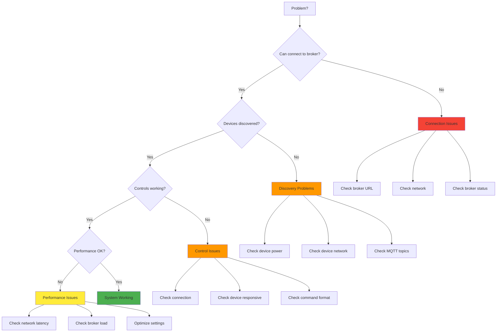
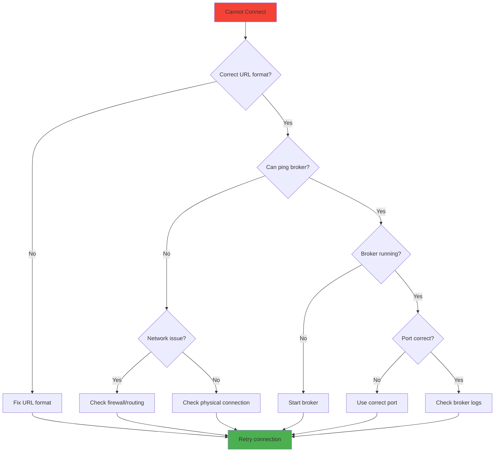
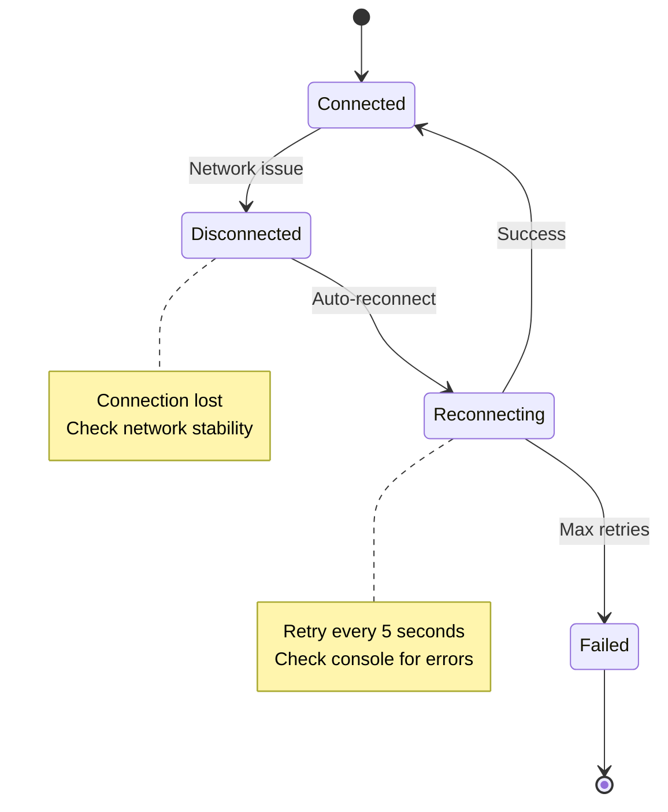
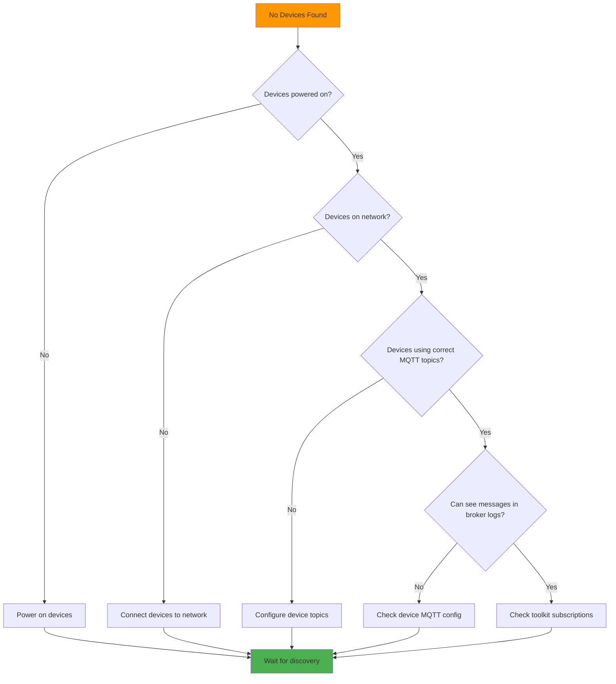
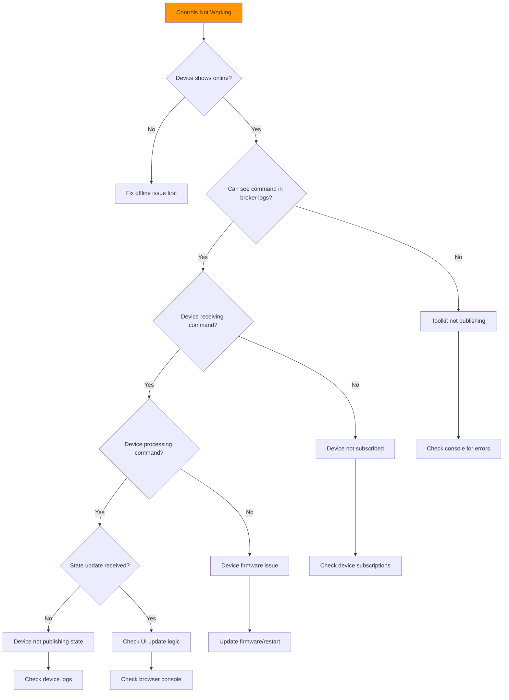
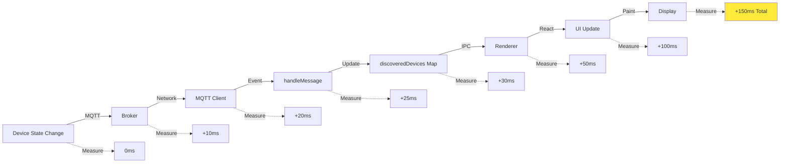
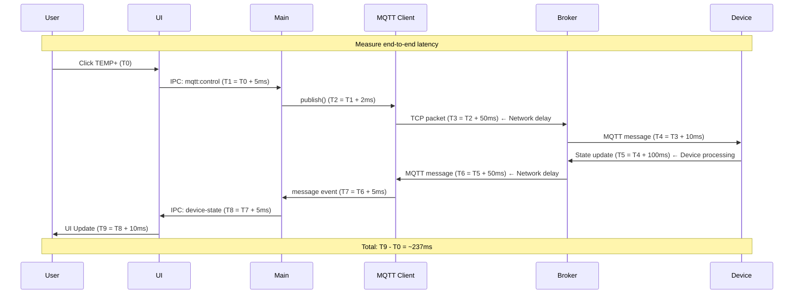

# Devices Feature - Troubleshooting Guide

**Feature:** MQTT Device Discovery and Control  
**Audience:** Support Engineers, System Administrators, Developers  
**Last Updated:** December 9, 2025

---

## Table of Contents

1. [Quick Diagnosis](#quick-diagnosis)
2. [Connection Issues](#connection-issues)
3. [Discovery Problems](#discovery-problems)
4. [Control Command Failures](#control-command-failures)
5. [Performance Issues](#performance-issues)
6. [Network Problems](#network-problems)
7. [Broker Configuration](#broker-configuration)
8. [Device-Specific Issues](#device-specific-issues)
9. [Diagnostic Tools](#diagnostic-tools)
10. [FAQ](#faq)

---

## Quick Diagnosis

### Diagnostic Flowchart



---

### Common Symptoms and Quick Fixes

| Symptom | Likely Cause | Quick Fix |
|---------|--------------|-----------|
| "Connection Failed" | Wrong broker URL | Check URL format: `tcp://host:1883` |
| "Connection Refused" | Broker not running | Start broker: `sudo systemctl start mosquitto` |
| No devices found | Devices offline | Check device power and network |
| Controls don't work | Device not responding | Check device logs, restart device |
| Slow updates | Network latency | Check network, reduce update frequency |
| Frequent disconnects | Network unstable | Check WiFi signal, use wired connection |

---

## Connection Issues

### Issue: Cannot Connect to Broker

**Symptoms:**
- Status shows "Connection Failed"
- Error in console: "ECONNREFUSED"
- Red status indicator

**Diagnostic Steps:**



**Step-by-Step Diagnosis:**

**1. Verify Broker URL Format**
```bash
# Correct formats:
tcp://localhost:1883          ✓
tcp://192.168.1.100:1883      ✓
mqtt://broker.example.com:1883 ✓

# Incorrect formats:
localhost:1883                ✗ (missing protocol)
tcp://localhost               ✗ (missing port)
http://localhost:1883         ✗ (wrong protocol)
```

**2. Test Network Connectivity**
```powershell
# Windows PowerShell
Test-NetConnection -ComputerName localhost -Port 1883

# Expected output:
# TcpTestSucceeded : True

# If False, broker is not reachable
```

**3. Check Broker Status**
```powershell
# Windows (if running Mosquitto as service)
Get-Service -Name mosquitto

# Expected: Status = Running

# If Stopped, start it:
Start-Service -Name mosquitto
```

**4. Check Firewall**
```powershell
# Windows Firewall - Check if port 1883 is allowed
Get-NetFirewallRule | Where-Object {$_.LocalPort -eq 1883}

# If no rule exists, add one:
New-NetFirewallRule -DisplayName "MQTT" -Direction Inbound -LocalPort 1883 -Protocol TCP -Action Allow
```

**5. Test with MQTT Client**
```bash
# Install mosquitto_sub utility
# Then test connection:
mosquitto_sub -h localhost -p 1883 -t test/topic -v

# If this fails, broker is definitely the problem
```

---

### Issue: Connection Drops Frequently

**Symptoms:**
- Status changes between connected/disconnected
- Devices disappear and reappear
- Console shows repeated "MQTT connection closed"

**State Diagram:**



**Solutions:**

**1. Check Network Stability**
```powershell
# Continuous ping to broker
ping -t 192.168.1.100

# Look for:
# - Timeouts (indicates packet loss)
# - High latency (>100ms)
# - Inconsistent times
```

**2. Check WiFi Signal (if using WiFi)**
```powershell
# Show WiFi signal strength
netsh wlan show interfaces

# Look for "Signal" field:
# 90-100% : Excellent
# 70-90%  : Good
# 50-70%  : Fair (may cause drops)
# <50%    : Poor (will cause drops)
```

**3. Increase Keepalive Interval**
```javascript
// In mqtt-service.js, modify connection options:
this.client = mqtt.connect(url, {
  clientId: `fga_simulator_${this.config.deviceId}_${Date.now()}`,
  clean: true,
  reconnectPeriod: 5000,
  keepalive: 120       // Increase from 60 to 120 seconds
});
```

**4. Use Wired Connection**
- If possible, connect via Ethernet instead of WiFi
- WiFi interference can cause drops
- Wired connection is more stable

---

### Issue: "ENOTFOUND" Error

**Symptoms:**
- Error: "getaddrinfo ENOTFOUND hostname"
- Cannot resolve broker hostname

**Cause:** DNS resolution failure

**Solutions:**

**1. Use IP Address Instead of Hostname**
```
Before: tcp://mqtt-broker:1883
After:  tcp://192.168.1.100:1883
```

**2. Check DNS Resolution**
```powershell
# Test DNS lookup
Resolve-DnsName mqtt-broker

# If fails, add to hosts file:
# C:\Windows\System32\drivers\etc\hosts
192.168.1.100  mqtt-broker
```

**3. Check Network DNS Settings**
```powershell
# Show DNS servers
Get-DnsClientServerAddress

# If no DNS servers, add one:
Set-DnsClientServerAddress -InterfaceAlias "Ethernet" -ServerAddresses ("8.8.8.8","8.8.4.4")
```

---

## Discovery Problems

### Issue: No Devices Discovered

**Symptoms:**
- Connected to broker successfully
- Device list remains empty
- "Waiting for devices..." message

**Diagnostic Flowchart:**



**Step-by-Step Diagnosis:**

**1. Verify Devices are Online**
```bash
# Ping device IP address
ping 192.168.1.101

# If fails:
# - Check device power
# - Check network cable/WiFi
# - Check device network configuration
```

**2. Monitor MQTT Broker for Device Messages**
```bash
# Subscribe to all topics
mosquitto_sub -h localhost -p 1883 -t '#' -v

# Look for messages from devices:
ac_sim/discovery {"device_id":"AC_SIM_123456",...}
ac_sim/AC_SIM_123456/state {"power":false,...}

# If no messages seen:
# - Device not publishing to MQTT
# - Check device MQTT configuration
# - Check device logs
```

**3. Check Toolkit Subscriptions**
```javascript
// In browser console (Renderer process):
// Check if subscriptions are active

// Expected subscriptions:
// - ac_sim/discovery
// - ac_sim/+/state
// - ac_sim/broadcast/state

// To debug, enable verbose logging:
localStorage.setItem('mqtt-debug', 'true');
```

**4. Verify Topic Namespace**
```bash
# Device might be using wrong namespace

# Expected: ac_sim/
# Device using: fga_ac/  ← Wrong!

# Fix: Update device configuration to use "ac_sim/" namespace
```

**5. Manual Discovery Trigger**
```javascript
// In browser console:
// Manually trigger discovery
app.handleConnectMQTT();

// Or send discovery message via MQTT client:
mosquitto_pub -h localhost -t ac_sim/discovery -m '{"discover":true}'
```

---

### Issue: Devices Discovered but Show as Offline

**Symptoms:**
- Devices appear in list
- Status indicator is gray (offline)
- "Last Update" timestamp is old

**Diagnosis:**

**1. Check Last Update Timestamp**
```javascript
// In browser console:
app.discoveredDevices.forEach(device => {
  const timeSinceUpdate = Date.now() - device.lastSeen.getTime();
  console.log(`${device.deviceId}: ${timeSinceUpdate}ms since last update`);
});

// If > 60 seconds, device is considered offline
```

**2. Check if Device is Sending State Updates**
```bash
# Monitor specific device topic
mosquitto_sub -h localhost -t 'ac_sim/AC_SIM_123456/state' -v

# If no messages:
# - Device stopped publishing
# - Device crashed or restarted
# - Device disconnected from MQTT
```

**3. Check Device Logs**
```bash
# If device has logging (e.g., via UDP or serial):
# Look for MQTT publish errors
# Look for network errors
# Look for crash/restart messages
```

**Solutions:**

- **Restart Device:** Power cycle the device
- **Check Device MQTT Config:** Verify broker URL, credentials
- **Check Device Network:** Ensure stable connection
- **Update Device Firmware:** May fix MQTT bugs

---

## Control Command Failures

### Issue: Controls Don't Respond

**Symptoms:**
- Click controls but device state doesn't change
- No error messages
- Device appears online

**Diagnostic Flowchart:**



**Step-by-Step Diagnosis:**

**1. Verify Command is Sent**
```javascript
// In browser console, intercept control commands:
const originalSend = ipcRenderer.send;
ipcRenderer.send = function(channel, ...args) {
  if (channel === 'mqtt:control') {
    console.log('Sending control:', args);
  }
  return originalSend.apply(this, arguments);
};

// Then click controls and check console
```

**2. Monitor MQTT Broker for Control Messages**
```bash
# Subscribe to control topics
mosquitto_sub -h localhost -t 'ac_sim/+/control' -v

# Expected when clicking TEMP+:
ac_sim/AC_SIM_123456/control {"action":"temperature","value":25}

# If not seen:
# - IPC not working
# - MQTT service not publishing
# - Check main process logs
```

**3. Verify Device Receives Command**
```bash
# Check device logs (if available via UDP/serial)
# Look for:
# - "Received MQTT command"
# - "Processing temperature change"
# - etc.

# If device not receiving:
# - Device not subscribed to control topic
# - Check device MQTT subscription code
```

**4. Check Command Format**
```javascript
// Expected format:
{
  "action": "temperature",
  "value": 24
}

// If device expects different format:
{
  "command": "set_temperature",  // ← Different key
  "data": { "temp": 24 }         // ← Nested
}

// May need to update sendControlCommand() to match device expectations
```

**5. Wait for State Confirmation**
```bash
# After sending command, monitor state updates:
mosquitto_sub -h localhost -t 'ac_sim/AC_SIM_123456/state' -v

# Expected within 1-2 seconds:
ac_sim/AC_SIM_123456/state {"power":true,"temperature":24,...}

# If not received:
# - Device not responding
# - Device busy/crashed
# - Network issue
```

---

### Issue: Wrong Value Applied

**Symptoms:**
- Set temperature to 24°C but device shows 22°C
- Command seems to work but value is different

**Diagnosis:**

**1. Check Value Rounding**
```javascript
// Device may only support integer temperatures
Set: 24.5°C → Device shows: 24°C or 25°C (rounded)

// Solution: Round before sending
value = Math.round(value);
```

**2. Check Value Range**
```javascript
// Device may have different range than UI
UI allows: 16-30°C
Device supports: 18-30°C

// If send 16°C, device may clamp to 18°C

// Solution: Match UI range to device capabilities
```

**3. Check Unit Conversion**
```javascript
// Device may use different units
UI: Celsius
Device: Fahrenheit

// Need to convert:
fahrenheit = (celsius * 9/5) + 32;
```

**4. Check for Mode Restrictions**
```javascript
// Some modes may restrict temperature range
Mode: Fan → Temperature control disabled
Mode: Dry → Temperature limited to 20-24°C

// Solution: Check mode first, adjust range accordingly
```

---

## Performance Issues

### Issue: Slow UI Updates

**Symptoms:**
- Delay between device change and UI update
- UI feels sluggish
- High CPU usage

**Performance Analysis:**



**Optimization Steps:**

**1. Profile Renderer Performance**
```javascript
// In browser console:
performance.mark('render-start');
renderDeviceList();
performance.mark('render-end');
performance.measure('render-time', 'render-start', 'render-end');
console.log(performance.getEntriesByName('render-time')[0].duration);

// If > 16ms (60fps), UI will feel sluggish
```

**2. Throttle Updates**
```javascript
// In app.js, throttle device list updates:
const throttledUpdate = throttle(() => {
  renderDeviceList();
}, 100); // Max 10 updates per second

ipcRenderer.on('mqtt:devices-updated', (event, devices) => {
  throttledUpdate();
});
```

**3. Use Virtual Scrolling**
```javascript
// If showing 50+ devices, use virtual scrolling
// Only render visible devices

// Example with simple implementation:
function renderVisibleDevices() {
  const scrollTop = container.scrollTop;
  const viewportHeight = container.clientHeight;
  const deviceHeight = 400; // pixels per device
  
  const firstVisible = Math.floor(scrollTop / deviceHeight);
  const lastVisible = Math.ceil((scrollTop + viewportHeight) / deviceHeight);
  
  const visibleDevices = allDevices.slice(firstVisible, lastVisible + 1);
  
  // Only render visible devices
  container.innerHTML = visibleDevices.map(d => renderDevice(d)).join('');
}
```

**4. Reduce DOM Manipulations**
```javascript
// Instead of updating each device individually:
devices.forEach(device => {
  updateDevice(device); // ← Triggers reflow each time
});

// Batch updates:
const html = devices.map(device => renderDevice(device)).join('');
container.innerHTML = html; // ← Single reflow
```

**5. Profile Main Process**
```javascript
// In main.js, add timing logs:
console.time('handleMessage');
mqttService.handleMessage(topic, message);
console.timeEnd('handleMessage');

// If > 10ms, optimize handleMessage()
```

---

### Issue: High Memory Usage

**Symptoms:**
- Memory usage grows over time
- Application becomes slow after hours of use
- Eventually crashes

**Memory Leak Detection:**

**1. Use Chrome DevTools Memory Profiler**
```
1. Open DevTools (F12)
2. Go to Memory tab
3. Take heap snapshot
4. Use app for 10 minutes
5. Take another snapshot
6. Compare snapshots
7. Look for objects that continuously grow
```

**2. Common Memory Leaks:**

**Leak: Unbounded Message History**
```javascript
// BAD: Messages grow indefinitely
class MessageHistory {
  constructor() {
    this.messages = [];
  }
  
  add(message) {
    this.messages.push(message); // ← Leak!
  }
}

// GOOD: Limit message history
class MessageHistory {
  constructor(maxSize = 1000) {
    this.messages = [];
    this.maxSize = maxSize;
  }
  
  add(message) {
    this.messages.push(message);
    if (this.messages.length > this.maxSize) {
      this.messages.shift(); // ← Remove oldest
    }
  }
}
```

**Leak: Event Listeners Not Removed**
```javascript
// BAD: Listener never removed
ipcRenderer.on('mqtt:device-state', handleState);

// GOOD: Remove when done
const listener = (event, state) => handleState(state);
ipcRenderer.on('mqtt:device-state', listener);

// Later, when component unmounted:
ipcRenderer.removeListener('mqtt:device-state', listener);
```

**Leak: Stale Device References**
```javascript
// BAD: Old devices never removed
discoveredDevices.set(deviceId, device); // ← Never deleted

// GOOD: Remove offline devices periodically
setInterval(() => {
  const now = Date.now();
  discoveredDevices.forEach((device, deviceId) => {
    const timeSinceUpdate = now - device.lastSeen.getTime();
    if (timeSinceUpdate > 300000) { // 5 minutes
      discoveredDevices.delete(deviceId);
      console.log(`Removed stale device: ${deviceId}`);
    }
  });
}, 60000); // Check every minute
```

---

## Network Problems

### Issue: High Latency

**Symptoms:**
- Controls take 2-5+ seconds to respond
- State updates delayed
- UI feels unresponsive

**Network Latency Measurement:**



**Latency Breakdown:**

| Component | Typical | Problematic | Cause if High |
|-----------|---------|-------------|---------------|
| UI → IPC | 5ms | >20ms | Heavy UI rendering |
| IPC → MQTT Client | 2ms | >10ms | Main process busy |
| Client → Broker | 10-50ms | >200ms | Network latency |
| Broker → Device | 10-50ms | >200ms | Network latency |
| Device Processing | 50-100ms | >500ms | Device overloaded |
| Total | 77-207ms | >1000ms | Multiple issues |

**Troubleshooting High Network Latency:**

**1. Measure Network Latency**
```powershell
# Ping broker continuously
ping -t 192.168.1.100

# Look for:
# - Average latency >100ms
# - High variance (e.g., 10ms, 200ms, 15ms, 180ms)
# - Packet loss
```

**2. Check Network Path**
```powershell
# Trace route to broker
tracert 192.168.1.100

# Look for:
# - Many hops (>10)
# - Slow hops (>100ms)
# - Timeouts
```

**3. Check WiFi Issues**
```powershell
# Check for WiFi interference
netsh wlan show interfaces

# Look for:
# - Low signal strength (<70%)
# - Channel congestion
# - Radio type (2.4GHz vs 5GHz)
```

**4. Optimize MQTT Settings**
```javascript
// Reduce QoS for non-critical messages
client.publish(topic, message, { qos: 0 }); // Instead of qos: 1

// This eliminates acknowledgment overhead
```

---

## Broker Configuration

### Issue: Broker Authentication Required

**Symptoms:**
- Connection refused
- Error: "Connection refused: Not authorized"

**Solution: Configure Authentication**

**Step 1: Create Password File (Mosquitto)**
```bash
# Create password file
mosquitto_passwd -c /etc/mosquitto/passwd eol_toolkit

# Enter password when prompted
```

**Step 2: Configure Mosquitto**
```bash
# Edit /etc/mosquitto/mosquitto.conf
sudo nano /etc/mosquitto/mosquitto.conf

# Add:
password_file /etc/mosquitto/passwd
allow_anonymous false

# Restart broker
sudo systemctl restart mosquitto
```

**Step 3: Update Toolkit Connection**
```javascript
// In mqtt-service.js, add credentials:
this.client = mqtt.connect(url, {
  clientId: `fga_simulator_${this.config.deviceId}_${Date.now()}`,
  clean: true,
  reconnectPeriod: 5000,
  username: 'eol_toolkit',
  password: 'your_password_here' // ← Add credentials
});
```

---

### Issue: TLS/SSL Required

**Symptoms:**
- Connection refused when using tcp://
- Error: "TLS required"

**Solution: Use mqtts:// Protocol**

**Step 1: Configure Broker for TLS (Mosquitto)**
```bash
# Generate certificates (or use existing)
# In /etc/mosquitto/certs/:
# - ca.crt (CA certificate)
# - server.crt (server certificate)
# - server.key (server private key)

# Edit /etc/mosquitto/mosquitto.conf
listener 8883
cafile /etc/mosquitto/certs/ca.crt
certfile /etc/mosquitto/certs/server.crt
keyfile /etc/mosquitto/certs/server.key

# Restart broker
sudo systemctl restart mosquitto
```

**Step 2: Update Toolkit Connection**
```javascript
const fs = require('fs');
const path = require('path');

// Read certificates
const ca = fs.readFileSync(path.join(__dirname, 'certs', 'ca.crt'));
const cert = fs.readFileSync(path.join(__dirname, 'certs', 'client.crt'));
const key = fs.readFileSync(path.join(__dirname, 'certs', 'client.key'));

// Connect with TLS
this.client = mqtt.connect('mqtts://broker:8883', {
  ca: ca,
  cert: cert,
  key: key,
  rejectUnauthorized: true
});
```

---

## Device-Specific Issues

### Issue: Device Not Responding After Firmware Update

**Symptoms:**
- Device was working before firmware update
- Now device doesn't respond to commands
- Discovery works but controls fail

**Diagnosis:**

**1. Check Firmware Version**
```bash
# Subscribe to device discovery
mosquitto_sub -h localhost -t 'ac_sim/discovery' -v

# Look for firmware_version field:
{"device_id":"AC_SIM_123456","firmware_version":"2.1.0"}

# Check release notes for breaking changes
```

**2. Check Command Format Changes**
```bash
# Old firmware might have used:
{"action":"temperature","value":24}

# New firmware might require:
{"command":"set_temp","data":{"value":24}}

# Test with mosquitto_pub:
mosquitto_pub -h localhost -t 'ac_sim/AC_SIM_123456/control' \
  -m '{"command":"set_temp","data":{"value":24}}'
```

**3. Rollback Firmware (if possible)**
```bash
# Flash previous firmware version
# Use STM32 Flasher or ESP32 Flasher feature
```

---

### Issue: Device Reboots Frequently

**Symptoms:**
- Device appears/disappears from list
- State resets to defaults
- "Last Seen" timestamp resets

**Diagnosis:**

**1. Check Device Logs**
```bash
# View device logs (if available via UDP Logs feature)
# Look for:
# - "Watchdog reset"
# - "Stack overflow"
# - "Out of memory"
# - "Exception"
```

**2. Check Power Supply**
```bash
# Device may be restarting due to power issues
# - Brownout detection
# - Insufficient current
# - Voltage drops

# Solutions:
# - Use higher current power supply
# - Add decoupling capacitors
# - Check power cable integrity
```

**3. Check for Firmware Bugs**
```bash
# Device may have firmware bug causing crashes
# - Update to latest stable firmware
# - Report bug to device manufacturer
```

---

## Diagnostic Tools

### Tool 1: MQTT Explorer

**Purpose:** Visualize all MQTT topics and messages

**Installation:**
```bash
# Download from: http://mqtt-explorer.com/
# Or install via npm:
npm install -g mqtt-explorer
```

**Usage:**
```
1. Launch MQTT Explorer
2. Connect to broker (localhost:1883)
3. Expand topic tree
4. View real-time messages
5. Publish test messages
```

**Benefits:**
- See all topics and messages
- Identify topic structure issues
- Test commands manually
- Monitor message frequency

---

### Tool 2: Mosquitto Client Tools

**Purpose:** Command-line MQTT testing

**Installation:**
```bash
# Windows (via Chocolatey)
choco install mosquitto

# Linux
sudo apt-get install mosquitto-clients
```

**Usage:**

**Subscribe to All Topics:**
```bash
mosquitto_sub -h localhost -p 1883 -t '#' -v
```

**Subscribe to Specific Device:**
```bash
mosquitto_sub -h localhost -t 'ac_sim/AC_SIM_123456/state' -v
```

**Publish Test Command:**
```bash
mosquitto_pub -h localhost -t 'ac_sim/AC_SIM_123456/control' \
  -m '{"action":"power","value":true}'
```

**Monitor Message Rate:**
```bash
mosquitto_sub -h localhost -t 'ac_sim/+/state' -v | while read line; do echo "$(date +%T) $line"; done
```

---

### Tool 3: Wireshark

**Purpose:** Capture and analyze network traffic

**Usage:**
```
1. Install Wireshark
2. Start capture on network interface
3. Filter for MQTT: tcp.port == 1883
4. Analyze packets:
   - CONNECT/CONNACK
   - PUBLISH/PUBACK
   - SUBSCRIBE/SUBACK
   - Connection timing
   - Message sizes
```

**Benefits:**
- See actual network traffic
- Identify network issues
- Measure latency precisely
- Debug protocol issues

---

### Tool 4: Chrome DevTools

**Purpose:** Debug frontend issues

**Usage:**
```
1. Open DevTools (F12)
2. Console tab: View logs, errors
3. Network tab: Monitor IPC calls
4. Performance tab: Profile rendering
5. Memory tab: Detect memory leaks
```

**Debugging Tips:**

**Console Logging:**
```javascript
// Enable verbose logging
localStorage.setItem('debug', 'true');

// View IPC messages
localStorage.setItem('debug-ipc', 'true');
```

**Breakpoints:**
```javascript
// Set breakpoint in handleMessage()
// Step through message processing
// Inspect variables
```

---

## FAQ

### Q: Why do devices take 30+ seconds to discover?

**A:** Several reasons:
1. **Discovery Interval:** Discovery runs every 30 seconds by default
2. **Device Boot Time:** Device may take time to boot and connect to MQTT
3. **Network Latency:** Slow network delays message delivery

**Solutions:**
- Trigger manual discovery (disconnect/reconnect)
- Reduce discovery interval in code
- Check device boot time

---

### Q: Can I use multiple toolkits with the same broker?

**A:** Yes, but be aware:
- Each toolkit generates its own device ID
- All toolkits see all devices
- Control commands from any toolkit work
- Last command wins (no coordination)
- **Use unique client IDs** to avoid conflicts

---

### Q: What happens if broker crashes?

**A:**
- Toolkit shows "Disconnected"
- Auto-reconnect attempts every 5 seconds
- When broker restarts, toolkit reconnects automatically
- Devices rediscover automatically
- No permanent data loss

---

### Q: How do I debug IPC communication?

**A:**

**In Main Process (main.js):**
```javascript
ipcMain.on('mqtt:control', (event, args) => {
  console.log('[IPC Main] Received mqtt:control:', args);
  // Process...
  event.reply('mqtt:device-state', state);
  console.log('[IPC Main] Sent mqtt:device-state:', state);
});
```

**In Renderer Process:**
```javascript
ipcRenderer.on('mqtt:device-state', (event, state) => {
  console.log('[IPC Renderer] Received mqtt:device-state:', state);
});

ipcRenderer.send('mqtt:control', { deviceId, action, value });
console.log('[IPC Renderer] Sent mqtt:control');
```

---

### Q: Device works with MQTT Explorer but not with toolkit?

**A:** Check:
1. **Topic Format:** Toolkit expects `ac_sim/` namespace
2. **Message Format:** Toolkit expects specific JSON structure
3. **QoS:** Ensure QoS 0 or 1 (not 2)
4. **Retained Messages:** Toolkit may not handle retained messages

**Test:**
```bash
# Publish message exactly as toolkit would:
mosquitto_pub -h localhost -t 'ac_sim/TEST_DEVICE/state' \
  -m '{"power":true,"temperature":24,"mode":"Cool","fanSpeed":"Auto","swing":false,"currentTemp":26}'

# Then check if toolkit sees it
```

---

## Revision History

| Version | Date | Changes | Author |
|---------|------|---------|--------|
| 1.0 | 2025-12-09 | Initial troubleshooting guide | Documentation Team |

---

## Related Documentation

- [README.md](./README.md) - Quick start guide
- [Overview.md](./Overview.md) - Technical architecture
- [UserGuide.md](./UserGuide.md) - User procedures
- [SourceCode.md](./SourceCode.md) - Code documentation

---

**[← Back to Source Code](./SourceCode.md)** | **[Back to README](./README.md)**
