# Devices Feature - User Guide

**Feature:** MQTT Device Discovery and Control  
**Audience:** Test Operators, Field Technicians, System Integrators  
**Last Updated:** December 9, 2025

---

## Table of Contents

1. [Introduction](#introduction)
2. [Getting Started](#getting-started)
3. [Broker Configuration](#broker-configuration)
4. [Connecting to MQTT Broker](#connecting-to-mqtt-broker)
5. [Device Discovery](#device-discovery)
6. [Controlling AC Devices](#controlling-ac-devices)
7. [Monitoring Device Status](#monitoring-device-status)
8. [Working with Multiple Devices](#working-with-multiple-devices)
9. [Common Workflows](#common-workflows)
10. [Best Practices](#best-practices)
11. [Troubleshooting](#troubleshooting)
12. [FAQ](#faq)

---

## Introduction

This guide will help you use the **Devices** feature to discover and control Nube AC units over MQTT. Whether you're testing in the factory, commissioning in the field, or managing devices remotely, this guide has step-by-step instructions for all common tasks.

### What You'll Learn

- How to connect to an MQTT broker
- How to discover AC devices automatically
- How to control temperature, mode, and other settings
- How to monitor device status in real-time
- Best practices for production environments

### Prerequisites

Before starting, ensure you have:
- ✅ EOL Toolkit installed and running
- ✅ MQTT broker accessible (Mosquitto, EMQX, etc.)
- ✅ AC devices powered on and connected to network
- ✅ Network connectivity between toolkit and broker

---

## Getting Started

### Opening the Devices Page

1. Launch the **NubeIO EOL Toolkit** application
2. Click on the **"Devices"** tab in the left sidebar
3. You'll see the Devices page with three main sections:
   - Broker configuration (top)
   - Device list (left)
   - Control panel (right)

### Understanding the Interface

```
┌─────────────────────────────────────────────────────────────┐
│  Devices - MQTT Device Management                           │
├─────────────────────────────────────────────────────────────┤
│                                                              │
│  🔧 Broker Configuration                                    │
│  ┌────────────────────────────────────────────────────────┐ │
│  │ Broker URL: [tcp://localhost:1883        ] [Connect] │ │
│  │ Status: ● Disconnected                                 │ │
│  └────────────────────────────────────────────────────────┘ │
│                                                              │
│  ┌──────────────────┐  ┌─────────────────────────────────┐ │
│  │  📋 Device List  │  │   🎮 Control Panel              │ │
│  │                  │  │                                  │ │
│  │ No devices       │  │  Select a device to control     │ │
│  │ found            │  │                                  │ │
│  │                  │  │                                  │ │
│  │                  │  │                                  │ │
│  │                  │  │                                  │ │
│  │                  │  │                                  │ │
│  │                  │  │                                  │ │
│  └──────────────────┘  └─────────────────────────────────┘ │
└─────────────────────────────────────────────────────────────┘
```

---

## Broker Configuration

### Broker URL Format

The broker URL tells the toolkit where to connect. Use one of these formats:

**Local Broker:**
```
tcp://localhost:1883
```

**Remote Broker (IP Address):**
```
tcp://192.168.1.100:1883
```

**Remote Broker (Hostname):**
```
tcp://mqtt.example.com:1883
```

**WebSocket:**
```
ws://broker.example.com:9001
```

**Secure Connection (TLS):**
```
mqtts://broker.example.com:8883
```

### Common Broker Addresses

| Environment | Typical URL |
|-------------|-------------|
| **Local Testing** | `tcp://localhost:1883` |
| **Factory Network** | `tcp://10.0.1.50:1883` |
| **Cloud MQTT** | `mqtts://cloud.mqtt.com:8883` |
| **Development** | `tcp://192.168.1.100:1883` |

---

## Connecting to MQTT Broker

### Step-by-Step Connection

**Step 1: Enter Broker URL**

1. Locate the "Broker URL" input field at the top of the page
2. Clear any existing URL
3. Type your broker URL (e.g., `tcp://localhost:1883`)
4. Press Enter or click elsewhere to save

**Step 2: Click Connect**

1. Click the **"Connect"** button
2. You'll see "Connecting..." status
3. Wait 2-5 seconds for connection

**Step 3: Verify Connection**

✅ **Success indicators:**
- Status shows: ● Connected (green dot)
- Connect button changes to "Disconnect"
- Device discovery begins automatically

❌ **Failure indicators:**
- Status shows: ● Connection Failed (red dot)
- Error message appears
- See [Troubleshooting](#troubleshooting) section

### Visual Connection Flow

```mermaid
graph LR
    A[Enter URL] --> B[Click Connect]
    B --> C{Connection?}
    C -->|Success| D[● Connected]
    C -->|Failed| E[● Connection Failed]
    D --> F[Auto-discover devices]
    E --> G[Check URL & broker]
    
    style D fill:#4caf50
    style E fill:#f44336
```



---

## Device Discovery

### Automatic Discovery

Once connected, the toolkit **automatically discovers devices**:

1. Toolkit subscribes to `ac_sim/+/state` topic
2. Toolkit publishes discovery request to `ac_sim/discovery`
3. All AC devices respond with their information
4. Devices appear in the "Device List" on the left

### Discovery Time

- **First Discovery:** 1-5 seconds after connection
- **New Devices:** Appear within 30 seconds (auto-refresh)
- **Manual Refresh:** Click "Refresh Devices" button (if available)

### Device Information Displayed

Each discovered device shows:
- **Device ID:** Unique identifier (e.g., `ac_unit_001`)
- **Device Type:** Device model (e.g., `nube_ac`)
- **Status:** Online/Offline indicator
- **Last Seen:** Timestamp of last update

### Example Device List

```
┌──────────────────┐
│  📋 Device List  │
├──────────────────┤
│                  │
│ ● ac_unit_001   │ ← Green dot = Online
│   Nube AC        │
│   24°C | Cool    │
│                  │
│ ● ac_unit_002   │
│   Nube AC        │
│   22°C | Auto    │
│                  │
│ ○ ac_unit_003   │ ← Gray dot = Offline
│   Nube AC        │
│   (offline)      │
│                  │
└──────────────────┘
```

---

## Controlling AC Devices

### Selecting a Device

1. Click on any device in the "Device List"
2. The control panel on the right activates
3. Current device state loads into controls

### Control Panel Layout

```
┌─────────────────────────────────┐
│   🎮 Control Panel              │
├─────────────────────────────────┤
│  Device: ac_unit_001            │
│                                  │
│  ⚡ Power:  [ON  | OFF]         │
│                                  │
│  🌡️ Mode:   [Auto ▼]            │
│             ├─ Auto              │
│             ├─ Cool              │
│             ├─ Dry               │
│             ├─ Fan               │
│             └─ Heat              │
│                                  │
│  🌡️ Temperature:                │
│     [16]───●─────────[30]       │
│           24°C                   │
│                                  │
│  💨 Fan Speed: [Auto ▼]         │
│                ├─ Auto           │
│                ├─ Low            │
│                ├─ Medium         │
│                ├─ High           │
│                └─ Quiet          │
│                                  │
│  🌊 Swing:  [ON  | OFF]         │
│                                  │
│  📊 Current Temp: 26.5°C        │
│  🕐 Last Update: 10:15:30       │
└─────────────────────────────────┘
```

---

### Power Control

**Turning ON:**
1. Select device from list
2. Click **"ON"** button in Power section
3. Wait 1-2 seconds for confirmation
4. Device status updates to "ON"

**Turning OFF:**
1. Select device from list
2. Click **"OFF"** button in Power section
3. Wait 1-2 seconds for confirmation
4. Device status updates to "OFF"

**Visual Feedback:**
- Button highlights when active
- Power icon changes (⚡ = ON, 🌙 = OFF)
- Device list shows updated status

---

### Mode Selection

**Changing Mode:**
1. Click on the **"Mode"** dropdown
2. Select desired mode:
   - **Auto:** Automatic mode selection
   - **Cool:** Cooling mode
   - **Dry:** Dehumidification mode
   - **Fan:** Fan only (no cooling/heating)
   - **Heat:** Heating mode
3. Mode changes immediately
4. Device confirms new mode within 1 second

**Mode Descriptions:**

| Mode | When to Use | Icon |
|------|-------------|------|
| **Auto** | Let AC decide based on temp | 🔄 |
| **Cool** | Hot weather, need cooling | ❄️ |
| **Dry** | High humidity, need dehumidification | 💧 |
| **Fan** | Air circulation without temp change | 💨 |
| **Heat** | Cold weather, need warming | 🔥 |

---

### Temperature Control

**Adjusting Temperature:**

**Method 1: Slider**
1. Click and drag the temperature slider
2. Release at desired temperature
3. Temperature updates in real-time

**Method 2: Buttons (if available)**
1. Click **"+"** to increase (up to 30°C)
2. Click **"-"** to decrease (down to 16°C)
3. Each click changes by 1°C

**Temperature Range:**
- **Minimum:** 16°C
- **Maximum:** 30°C
- **Default:** 24°C
- **Step:** 1°C increments

**Visual Temperature Scale:**
```
16°C ─────────────────────── 30°C
 ❄️     ⛄    🌡️    🔥      🔥🔥
Cold    Cool   Mild   Warm   Hot
```

---

### Fan Speed Control

**Changing Fan Speed:**
1. Click on the **"Fan Speed"** dropdown
2. Select desired speed:
   - **Auto:** Automatic speed based on temp difference
   - **Low:** Quiet operation, minimal airflow
   - **Medium:** Balanced airflow and noise
   - **High:** Maximum airflow
   - **Quiet:** Ultra-quiet mode (if supported)
3. Fan speed changes immediately

**Fan Speed Characteristics:**

| Speed | Airflow | Noise Level | Best For |
|-------|---------|-------------|----------|
| **Auto** | Variable | Variable | General use |
| **Low** | 30% | Very Quiet | Night, bedrooms |
| **Medium** | 60% | Moderate | Daytime, offices |
| **High** | 100% | Loud | Quick cooling/heating |
| **Quiet** | 20% | Silent | Sleep mode |

---

### Swing Control

**Enabling Swing:**
1. Click **"ON"** in Swing section
2. Air vanes start oscillating
3. Even air distribution

**Disabling Swing:**
1. Click **"OFF"** in Swing section
2. Air vanes stop at current position
3. Fixed air direction

**Swing Modes:**
- **ON:** Vanes move up/down continuously
- **OFF:** Vanes stay in fixed position

---

## Monitoring Device Status

### Real-Time Status Display

The control panel shows live status:

**Current Temperature:**
```
📊 Current Temp: 26.5°C
```
- Updates every 1-5 seconds
- Reflects actual room temperature
- Read by AC's internal sensor

**Set Temperature vs Current:**
```
Set:     24°C  ────────────────┐
Current: 26.5°C                │ Difference: 2.5°C
                                └─ AC is cooling
```

**Last Update Timestamp:**
```
🕐 Last Update: 10:15:30
```
- Shows when last status received
- If > 10 seconds old, may indicate connection issue

---

### Status Indicators

**Connection Status:**
- ● **Green Dot:** Device online, responding
- ○ **Gray Dot:** Device offline or not responding
- ⚠️ **Yellow Warning:** Device slow to respond

**Power Status:**
- ⚡ **Lightning:** AC is ON
- 🌙 **Moon:** AC is OFF

**Mode Status:**
- ❄️ **Snowflake:** Cooling mode
- 🔥 **Fire:** Heating mode
- 💧 **Droplet:** Dry mode
- 💨 **Wind:** Fan mode
- 🔄 **Cycle:** Auto mode

---

### Status Update Frequency

**Normal Operation:**
- Device sends status every 1-5 seconds
- UI updates immediately upon receipt
- Latency: < 100ms typical

**Slow Updates:**
- If updates > 10 seconds apart:
  - Check network connection
  - Check device power
  - Check MQTT broker status

---

## Working with Multiple Devices

### Controlling Multiple Devices

**One at a Time:**
1. Click device in list
2. Adjust settings
3. Click next device
4. Adjust settings
5. Repeat as needed

**Broadcast Control (All Devices):**
> ⚠️ **Note:** Broadcast feature may not be available in all versions

If available:
1. Click "Control All" button
2. Make setting changes
3. All devices update simultaneously

---

### Monitoring Multiple Devices

**Device List View:**
- Scroll through device list
- Each shows summary: temp, mode, status
- Quick overview of all devices

**Sorting Options:**
- By device ID (alphabetical)
- By last update (most recent first)
- By status (online first)

**Filtering:**
- Show online only
- Show offline only
- Search by device ID

---

### Comparing Device States

**Side-by-Side Comparison:**

| Device | Temp | Mode | Fan | Status |
|--------|------|------|-----|--------|
| ac_unit_001 | 24°C | Cool | Auto | ● Online |
| ac_unit_002 | 22°C | Auto | Low | ● Online |
| ac_unit_003 | 25°C | Cool | High | ○ Offline |

---

## Common Workflows

### Workflow 1: Factory Testing AC Control

**Goal:** Verify AC responds to all commands

**Steps:**

1. **Connect to factory MQTT broker**
   ```
   URL: tcp://10.0.1.50:1883
   ```

2. **Wait for device discovery**
   - Device should appear within 5 seconds
   - Verify device ID matches unit under test

3. **Test Power Control**
   - Turn ON → Wait 2s → Verify status shows ON
   - Turn OFF → Wait 2s → Verify status shows OFF

4. **Test Mode Selection**
   - Set to Cool → Verify mode shows Cool
   - Set to Heat → Verify mode shows Heat
   - Set to Auto → Verify mode shows Auto

5. **Test Temperature Control**
   - Set to 16°C → Verify temp shows 16°C
   - Set to 30°C → Verify temp shows 30°C
   - Set to 24°C → Verify temp shows 24°C

6. **Test Fan Speed**
   - Set to Low → Verify fan shows Low
   - Set to High → Verify fan shows High
   - Set to Auto → Verify fan shows Auto

7. **Test Swing**
   - Turn ON → Verify swing shows ON
   - Turn OFF → Verify swing shows OFF

8. **Verify Status Updates**
   - Observe current temperature updates
   - Check last update timestamp < 5 seconds

9. **Pass Criteria:**
   - ✅ All commands acknowledged within 1 second
   - ✅ All status updates received within 5 seconds
   - ✅ Current temperature reading reasonable (15-35°C)

---

### Workflow 2: Field Commissioning

**Goal:** Configure and test newly installed AC

**Steps:**

1. **Connect to site MQTT broker**
   ```
   URL: tcp://192.168.1.100:1883
   ```

2. **Verify device online**
   - Check device appears in list
   - Note device ID for records

3. **Configure initial settings**
   - Power: ON
   - Mode: Auto
   - Temperature: 24°C
   - Fan Speed: Auto
   - Swing: ON

4. **Test thermostat function**
   - Set temperature to 20°C
   - Wait 5 minutes
   - Observe current temp decreasing
   - Set temperature to 28°C
   - Observe current temp increasing

5. **Test all modes**
   - Cool: Verify cold air output
   - Heat: Verify warm air output (if applicable)
   - Dry: Verify dehumidification
   - Fan: Verify airflow without temp change

6. **Document results**
   - Device ID: _____________
   - Installation date: _____________
   - Test results: PASS / FAIL
   - Technician: _____________

---

### Workflow 3: Remote Troubleshooting

**Goal:** Diagnose and fix AC issue remotely

**Steps:**

1. **Connect to production broker**
   ```
   URL: mqtts://prod.mqtt.example.com:8883
   ```

2. **Locate problem device**
   - Search for device ID in list
   - Check online/offline status

3. **Check current status**
   - Verify power state
   - Check current temp vs set temp
   - Review mode and fan settings
   - Check last update time

4. **Attempt reset sequence**
   - Turn OFF → Wait 10s → Turn ON
   - Set to known good configuration:
     * Mode: Auto
     * Temp: 24°C
     * Fan: Auto

5. **Monitor for improvement**
   - Watch status updates for 5 minutes
   - Check if current temp approaches set temp
   - Verify regular status updates

6. **If issue persists:**
   - Check device logs (see UDP Logs feature)
   - Verify network connectivity
   - Schedule on-site visit if needed

---

### Workflow 4: Batch Configuration

**Goal:** Configure multiple AC units with same settings

**Steps:**

1. **Connect to broker**
2. **Define target settings:**
   ```
   Power: ON
   Mode: Cool
   Temperature: 24°C
   Fan Speed: Auto
   Swing: ON
   ```

3. **For each device:**
   - Select device from list
   - Apply settings from template
   - Wait for confirmation
   - Mark as configured

4. **Verify all devices:**
   - Scroll through device list
   - Check each shows correct settings
   - Note any devices that failed

5. **Retry failures:**
   - Re-configure failed devices
   - Check network if multiple failures

---

## Best Practices

### Production Environment

**✅ Do:**
- Use secure connection (mqtts://) in production
- Implement authentication (username/password)
- Monitor broker availability
- Log all control commands
- Verify device response before moving to next
- Keep device list documented

**❌ Don't:**
- Use plain tcp:// in production networks
- Share MQTT credentials
- Control devices without verification
- Ignore connection errors
- Assume commands succeeded without checking

---

### Testing Environment

**✅ Do:**
- Use local broker for testing (tcp://localhost:1883)
- Test all commands before deployment
- Verify timeout handling
- Test with slow/unreliable networks
- Document test results

**❌ Don't:**
- Test on production broker
- Skip negative testing (connection failures, etc.)
- Assume test and production behave identically

---

### Performance Optimization

**For Many Devices (50+):**
- Use QoS 0 for state updates (if acceptable)
- Implement device filtering
- Limit status update frequency
- Consider multiple brokers for load balancing

**For Slow Networks:**
- Increase connection timeout (4s → 10s)
- Reduce status update frequency
- Use compression (if supported by broker)
- Monitor network latency

---

### Maintenance

**Daily:**
- Check broker connectivity
- Verify devices are online
- Review any error logs

**Weekly:**
- Update offline device list
- Check for firmware updates
- Review control command logs

**Monthly:**
- Audit MQTT credentials
- Check broker performance
- Update documentation

---

## Troubleshooting

### Cannot Connect to Broker

**Symptom:** Connection fails, status shows "Connection Failed"

**Causes & Solutions:**

1. **Wrong Broker URL**
   - Check URL format: `tcp://hostname:port`
   - Verify hostname resolves: `ping hostname`
   - Try IP address instead: `tcp://192.168.1.100:1883`

2. **Broker Not Running**
   - Check broker status: `sudo systemctl status mosquitto`
   - Start broker: `sudo systemctl start mosquitto`
   - Check broker logs: `tail -f /var/log/mosquitto/mosquitto.log`

3. **Network Issue**
   - Ping broker: `ping broker-hostname`
   - Check firewall: Port 1883 must be open
   - Try from another machine

4. **Authentication Required**
   - Check if broker requires username/password
   - Update connection options with credentials
   - Verify credentials are correct

---

### No Devices Discovered

**Symptom:** Connected to broker but device list is empty

**Causes & Solutions:**

1. **Devices Not Online**
   - Check device power
   - Verify device network connection
   - Check device MQTT configuration

2. **Wrong Topic Namespace**
   - Verify devices use `ac_sim/` namespace
   - Check broker logs for device messages
   - Use MQTT client to monitor topics: `mosquitto_sub -h broker -t '#' -v`

3. **Discovery Timeout**
   - Wait up to 30 seconds for discovery
   - Click "Refresh Devices" (if available)
   - Disconnect and reconnect

4. **Firewall Blocking**
   - Check device firewall allows MQTT
   - Verify no network ACLs blocking traffic

---

### Controls Not Working

**Symptom:** Click controls but device doesn't respond

**Causes & Solutions:**

1. **Device Offline**
   - Check device shows online (green dot)
   - Verify "Last Update" timestamp is recent
   - Check device power and network

2. **Command Not Sent**
   - Check MQTT connection still active
   - Look for error messages in console
   - Verify broker is still running

3. **Device Not Responding**
   - Check device logs for errors
   - Verify device firmware is up to date
   - Try power cycling device

4. **Invalid Command**
   - Check value is in valid range (e.g., temp 16-30°C)
   - Verify mode is supported by device
   - Check console for validation errors

---

### Slow Status Updates

**Symptom:** "Last Update" timestamp > 10 seconds old

**Causes & Solutions:**

1. **Network Latency**
   - Check network ping time: `ping broker`
   - Verify network not congested
   - Check WiFi signal strength (for wireless devices)

2. **Broker Overloaded**
   - Check broker CPU/memory usage
   - Reduce number of connected clients
   - Increase broker resources

3. **Device Issue**
   - Check device CPU usage
   - Verify device not in error state
   - Check device logs

4. **QoS Settings**
   - Reduce QoS if acceptable (1 → 0)
   - Check broker QoS handling

---

## FAQ

### Q: What MQTT broker should I use?

**A:** Popular options:
- **Mosquitto:** Free, open-source, good for local/small deployments
- **EMQX:** Enterprise-grade, scalable, good for production
- **HiveMQ:** Commercial, high-performance, good for large deployments
- **AWS IoT Core / Azure IoT Hub:** Cloud-managed, good for cloud deployments

For testing: Mosquitto is recommended (easy to install and configure).

---

### Q: Can I control devices without discovery?

**A:** Technically yes, if you know the device ID:
1. Manually subscribe to `ac_sim/{device_id}/state`
2. Manually publish to `ac_sim/{device_id}/control`

However, using the built-in discovery is recommended for reliability.

---

### Q: How many devices can I control simultaneously?

**A:** Limits:
- **Toolkit:** 100+ devices (tested)
- **MQTT Broker:** Depends on broker (Mosquitto: thousands, EMQX: millions)
- **Network:** Bandwidth usually not a bottleneck (1 Kbps per device)

Practical limit is usually UI performance (scrolling through 100+ devices).

---

### Q: Can I use this with non-Nube AC devices?

**A:** Yes, if the device:
- ✅ Supports MQTT protocol
- ✅ Uses similar topic structure (`namespace/device_id/message_type`)
- ✅ Sends JSON messages with compatible format

You may need to customize the MQTT service code for different message formats.

---

### Q: What happens if the broker goes down?

**A:**
- Toolkit shows "Disconnected" status
- Auto-reconnect attempts every 1 second
- When broker returns, toolkit reconnects automatically
- Device list may need to be refreshed (auto-discovery runs)

No data is lost, but control is unavailable during downtime.

---

### Q: Can I control devices from multiple toolkits simultaneously?

**A:** Yes, MQTT supports multiple clients:
- Each toolkit connects independently
- All receive status updates
- Control commands from any toolkit work
- Last command wins (no command queuing)

**Caution:** Multiple operators can cause conflicts (e.g., one sets 20°C, another sets 25°C).

---

### Q: How do I secure the MQTT connection?

**A:**
1. **Use TLS/SSL:**
   ```
   mqtts://broker:8883
   ```

2. **Enable Authentication:**
   - Configure broker with username/password
   - Update toolkit connection options

3. **Use ACLs (Access Control Lists):**
   - Restrict topics per user
   - Read-only vs read-write permissions

4. **Network Isolation:**
   - Use VPN for remote access
   - Firewall rules to limit access

See [Security Considerations](./Overview.md#security-considerations) for details.

---

## Related Documentation

- [README.md](./README.md) - Quick start guide
- [Overview.md](./Overview.md) - Technical architecture
- [SourceCode.md](./SourceCode.md) - Code documentation
- [Troubleshooting.md](./Troubleshooting.md) - Detailed troubleshooting

---

**[← Back to Overview](./Overview.md)** | **[Next: Source Code →](./SourceCode.md)**
