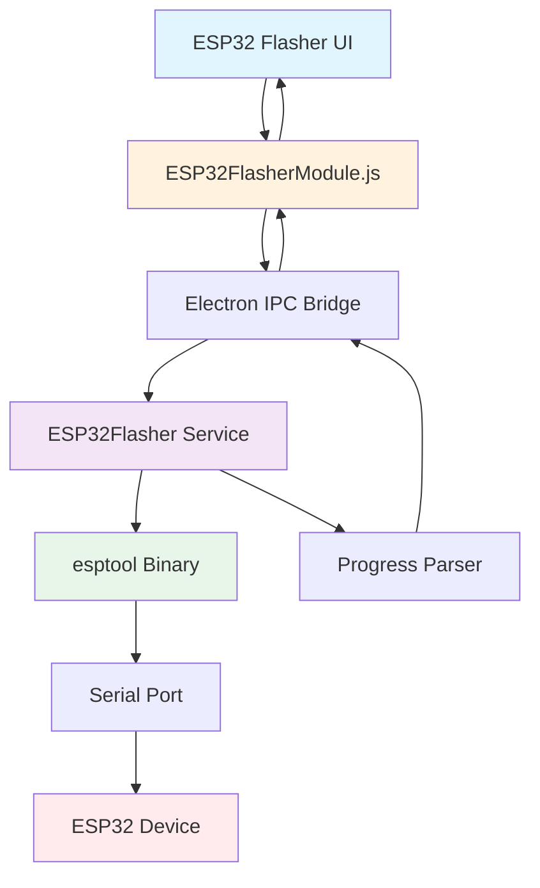
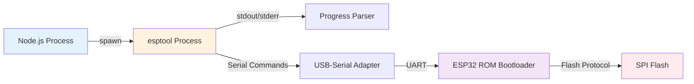
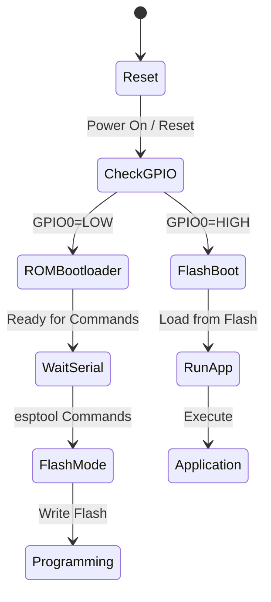
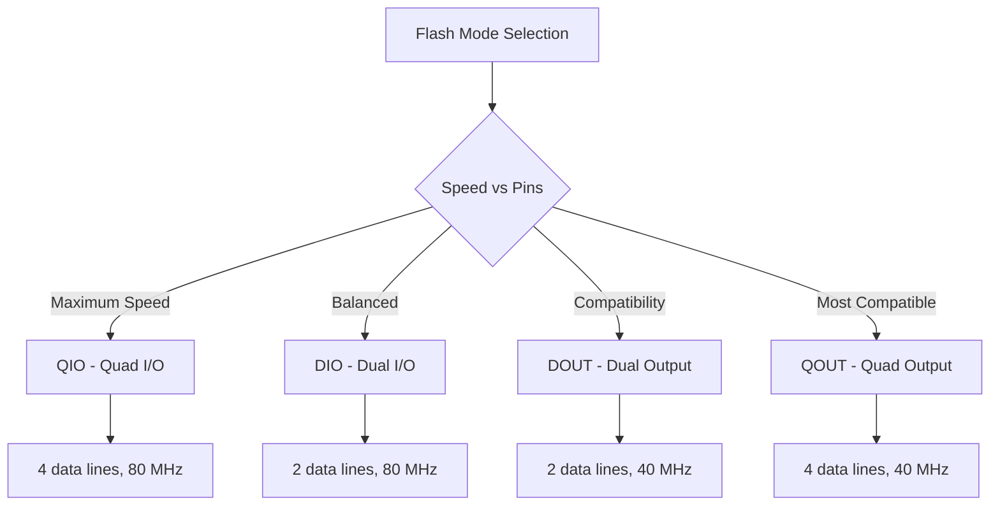
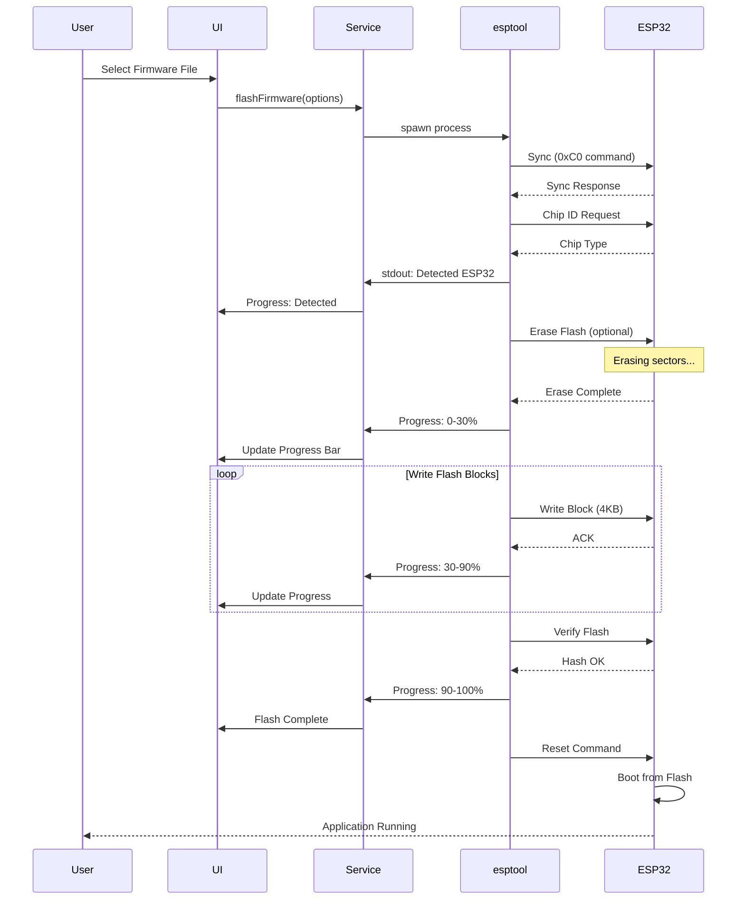
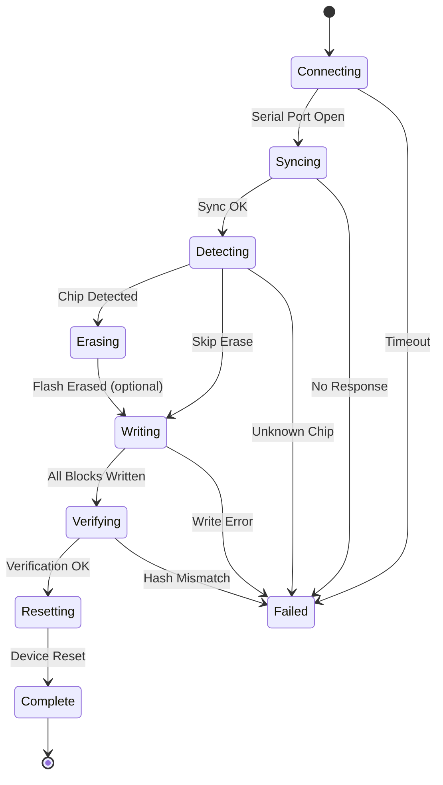
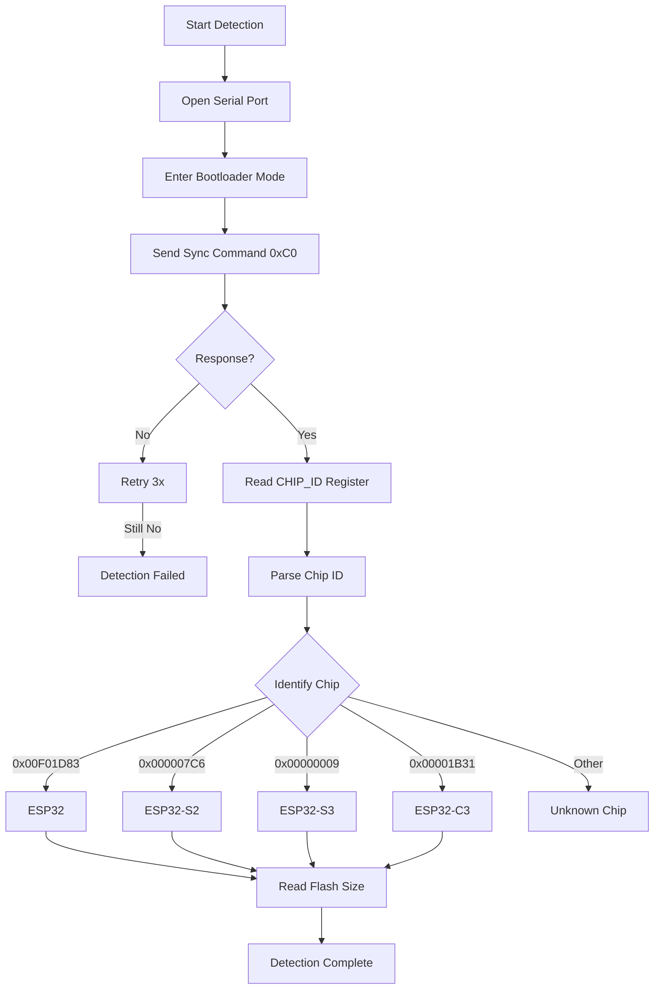
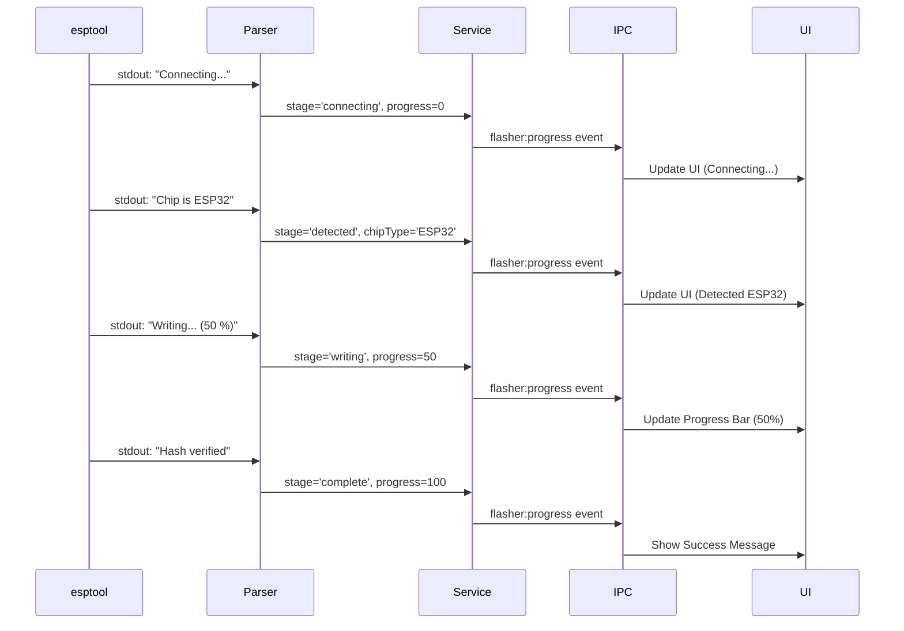

# ESP32 Flasher - Technical Overview

## Table of Contents
1. [Introduction](#introduction)
2. [Architecture Overview](#architecture-overview)
3. [esptool Integration](#esptool-integration)
4. [ESP32 Boot Modes](#esp32-boot-modes)
5. [Flash Memory Layout](#flash-memory-layout)
6. [Flashing Process](#flashing-process)
7. [Chip Detection](#chip-detection)
8. [Progress Tracking](#progress-tracking)
9. [Platform Support](#platform-support)
10. [Security Considerations](#security-considerations)

---

## Introduction

The **ESP32 Flasher** module provides firmware programming capabilities for ESP32/ESP32-S/ESP32-C series microcontrollers using the official **esptool** utility from Espressif Systems.

### Key Features

- **Chip Auto-Detection**: Automatically identifies ESP32 chip type (ESP32, ESP32-S2, ESP32-S3, ESP32-C3)
- **Firmware Flashing**: Programs .bin firmware files to flash memory
- **Progress Monitoring**: Real-time progress updates during flashing
- **Erase Support**: Optional full chip erase before flashing
- **Multi-Platform**: Works on Windows, Linux, and macOS
- **High-Speed Transfer**: Uses 460800 baud default for fast flashing
- **Error Recovery**: Handles connection failures and retry logic

### Use Cases

| Use Case | Description |
|----------|-------------|
| **Firmware Updates** | Install new firmware versions on ESP32 devices |
| **Production Programming** | Flash firmware during manufacturing |
| **Recovery** | Restore bricked devices with bootloader |
| **Development** | Rapid firmware iteration during development |
| **Multi-Variant Flashing** | Flash different firmware to different devices |

---

## Architecture Overview

### System Components



### Component Roles

| Component | Responsibility |
|-----------|----------------|
| **ESP32FlasherModule** | Frontend UI controller, user interaction |
| **IPC Bridge** | Communication between renderer and main process |
| **ESP32Flasher Service** | Backend logic, esptool process management |
| **esptool** | Low-level ESP32 flash programming |
| **Progress Parser** | Extracts progress from esptool output |
| **Serial Port** | Physical USB-to-UART communication |

---

## esptool Integration

### What is esptool?

**esptool** is the official flashing tool from Espressif Systems for ESP32 series chips. It communicates with the ESP32 ROM bootloader via serial UART to:

- Detect chip type and features
- Read/write flash memory
- Read chip MAC address and eFuses
- Verify flash contents
- Generate flash images

### Architecture



### Binary Location

**Development Mode:**
```
tools/
  esptool/
    esptool-win64/
      esptool.exe
    esptool-linux-amd64/
      esptool
    esptool-macos/
      esptool
```

**Production Mode (packaged):**
```
resources/
  tools/
    esptool/
      esptool-win64/
      esptool-linux-amd64/
```

### Command Structure

```bash
esptool --chip <chip_type> \
        --port <serial_port> \
        --baud <baud_rate> \
        write_flash \
        --flash-mode <mode> \
        --flash-freq <frequency> \
        --flash-size <size> \
        <address> <firmware.bin>
```

**Example:**
```bash
esptool --chip esp32 \
        --port COM3 \
        --baud 460800 \
        write_flash \
        --flash-mode dio \
        --flash-freq 40m \
        --flash-size 4MB \
        0x10000 firmware.bin
```

### esptool Commands Used

| Command | Purpose | Usage |
|---------|---------|-------|
| **chip_id** | Detect chip type | `esptool --port COM3 chip_id` |
| **flash_id** | Read flash chip info | `esptool --port COM3 flash_id` |
| **erase_flash** | Erase entire flash | `esptool --port COM3 erase_flash` |
| **write_flash** | Write firmware | `esptool --port COM3 write_flash 0x10000 fw.bin` |
| **verify_flash** | Verify flash contents | `esptool --port COM3 verify_flash 0x10000 fw.bin` |
| **read_mac** | Read MAC address | `esptool --port COM3 read_mac` |

---

## ESP32 Boot Modes

### Boot Mode Selection

ESP32 enters different boot modes based on GPIO pin states during reset:



### Boot Mode Table

| GPIO0 | GPIO2 | Boot Mode | Description |
|-------|-------|-----------|-------------|
| **LOW** | Don't Care | **Download Boot** (UART) | ROM bootloader, accepts esptool commands |
| **HIGH** | Don't Care | **Flash Boot** (SPI) | Boot from flash memory, run application |
| **LOW** | **HIGH** | **Download Boot** (UART) | Most common for flashing |

### Entering Download Mode

**Method 1: Hardware (Manual)**
```
1. Press and hold BOOT button (GPIO0 → GND)
2. Press and release RESET button
3. Release BOOT button
→ ESP32 now in download mode
```

**Method 2: Automatic (esptool)**
```
esptool uses DTR/RTS signals to automatically enter download mode:
- DTR controls GPIO0
- RTS controls EN (reset)

Sequence:
1. DTR=HIGH, RTS=LOW → Normal operation
2. DTR=LOW, RTS=HIGH → Pull GPIO0 low
3. DTR=HIGH, RTS=LOW → Reset with GPIO0 low
→ ESP32 enters download mode
```

**Method 3: USB-Serial Adapter with Auto-Reset**

Most modern ESP32 dev boards have auto-reset circuit:
```
DTR → GPIO0 (via transistor)
RTS → EN (via capacitor)
```

---

## Flash Memory Layout

### ESP32 Flash Partitions

```
┌─────────────────────────────────┐  0x0000
│  Bootloader (2nd stage)         │  32 KB
├─────────────────────────────────┤  0x8000
│  Partition Table                │  4 KB
├─────────────────────────────────┤  0x9000
│  NVS (Non-Volatile Storage)     │  20 KB
├─────────────────────────────────┤  0xE000
│  OTA Data                        │  8 KB
├─────────────────────────────────┤  0x10000
│  Application Firmware           │  ~1-3 MB
│  (Main program code)            │
├─────────────────────────────────┤
│  OTA Update Partition (optional)│  ~1-3 MB
├─────────────────────────────────┤
│  SPIFFS / LittleFS (optional)   │  Variable
└─────────────────────────────────┘  End
```

### Common Flash Addresses

| Address | Component | Size | Description |
|---------|-----------|------|-------------|
| **0x0000** | Bootloader | 32 KB | Second-stage bootloader |
| **0x8000** | Partition Table | 4 KB | Partition configuration |
| **0x9000** | NVS | 12-20 KB | WiFi credentials, settings |
| **0xD000** | PHY Init | 4 KB | RF calibration data |
| **0xE000** | OTA Data | 8 KB | OTA status |
| **0x10000** | Application | 1-3 MB | Main firmware |

### Flash Sizes

| Size | Common Usage |
|------|--------------|
| **2 MB** | Minimum for basic applications |
| **4 MB** | Standard for most ESP32 modules (ESP32-WROOM-32) |
| **8 MB** | Advanced applications with OTA + filesystem |
| **16 MB** | High-end modules (ESP32-WROVER) |

### Flash Modes



| Mode | Pins Used | Speed | Compatibility | Recommendation |
|------|-----------|-------|---------------|----------------|
| **QIO** | 6 (CLK, CMD, 4×Data) | Fastest | Lowest | Only if you need max speed |
| **QOUT** | 6 | Fast | Low | Use if GPIO9-10 not needed |
| **DIO** | 4 (CLK, CMD, 2×Data) | Medium | **High** | **Recommended default** |
| **DOUT** | 4 | Slower | Highest | Most compatible, slower |

**Note:** DIO mode is the recommended default as it provides good speed while maintaining compatibility.

---

## Flashing Process

### Complete Workflow



### Flash Stages



### Stage Details

| Stage | Duration | Description | Progress % |
|-------|----------|-------------|------------|
| **Connecting** | 1-2s | Opening serial port, setting baud rate | 0-5% |
| **Syncing** | 1-3s | Synchronizing with ROM bootloader | 5-10% |
| **Detecting** | 1s | Reading chip ID and features | 10-15% |
| **Erasing** | 5-30s | Erasing flash sectors (if enabled) | 15-30% |
| **Writing** | 10-60s | Writing firmware blocks (depends on size) | 30-90% |
| **Verifying** | 2-5s | Computing and checking hash | 90-98% |
| **Resetting** | 1s | Resetting chip to run application | 98-100% |

### Timing Analysis

**Typical 1MB Firmware Flash:**

```
Baud Rate: 460800
Block Size: 4096 bytes
Transfer Rate: ~45 KB/s (with overhead)

Time = (Firmware Size / Transfer Rate) + Overhead

Example:
1,048,576 bytes / 46,080 bytes/s ≈ 22.7 seconds
+ Connecting: 2s
+ Erasing: 10s (if enabled)
+ Verifying: 3s
──────────────────
Total: ~37 seconds (with erase)
Total: ~27 seconds (without erase)
```

**Baud Rate Impact:**

| Baud Rate | Transfer Rate | 1MB Flash Time |
|-----------|---------------|----------------|
| 115200 | ~11 KB/s | ~90s |
| 230400 | ~22 KB/s | ~45s |
| 460800 | ~45 KB/s | **~23s** ⭐ |
| 921600 | ~80 KB/s | ~13s (less stable) |

**Recommendation:** Use **460800 baud** for optimal balance of speed and reliability.

---

## Chip Detection

### Detection Process



### Chip Identification

**Chip ID Register Values:**

| Chip Type | Chip ID (hex) | Features |
|-----------|---------------|----------|
| **ESP32** | 0x00F01D83 | Dual-core, WiFi + BT Classic + BLE |
| **ESP32-S2** | 0x000007C6 | Single-core, WiFi, No Bluetooth |
| **ESP32-S3** | 0x00000009 | Dual-core, WiFi + BLE, AI acceleration |
| **ESP32-C3** | 0x00001B31 | Single-core RISC-V, WiFi + BLE |
| **ESP32-C6** | 0x0000000D | RISC-V, WiFi 6 + BLE 5 + Zigbee |

### Detection Command Sequence

```javascript
// Pseudo-code representation
1. Set DTR/RTS for bootloader mode
2. Send sync frame: 0xC0 0x00 0x08 ...
3. Wait for response: 0xC0 0x01 ...
4. Read chip ID: READ_REG 0x40001000
5. Parse response to determine chip type
```

### Flash Detection

After chip detection, esptool reads SPI flash chip:

```
esptool reads:
- Flash Manufacturer ID (JEDEC ID)
- Flash Size
- Flash Speed

Example Output:
Detecting chip type... ESP32
Chip is ESP32-D0WD-V3 (revision v3.0)
Flash manufacturer: c8
Flash device: 4016
Flash size: 4MB
```

---

## Progress Tracking

### Progress Parsing

esptool outputs progress to stdout/stderr in formats like:

```
Connecting....
Chip is ESP32-D0WD-V3 (revision v3.0)
Erasing flash (this may take a while)...
Writing at 0x00010000... (10 %)
Writing at 0x00020000... (20 %)
Writing at 0x00030000... (30 %)
...
Writing at 0x000f0000... (100 %)
Hash of data verified.
Hard resetting via RTS pin...
```

### Progress Extraction

```javascript
// Progress parsing regex patterns
const patterns = {
  connecting: /Connecting/,
  chipDetected: /Chip is (ESP32[^\s]*)/,
  erasing: /Erasing flash/,
  writing: /Writing at 0x[0-9a-f]+\.\.\. \((\d+) %\)/,
  verifying: /Verifying/,
  verified: /Hash of data verified/,
  resetting: /Hard resetting/
};

// Example: extract percentage
const match = line.match(/\((\d+) %\)/);
if (match) {
  const percentage = parseInt(match[1]);
  updateProgress(percentage);
}
```

### Progress Events



---

## Platform Support

### Cross-Platform Binary Selection

```javascript
// Platform detection
const platform = os.platform();

const binaryPaths = {
  'win32': 'esptool-win64/esptool.exe',
  'linux': 'esptool-linux-amd64/esptool',
  'darwin': 'esptool-macos/esptool'
};

// Make executable on Unix
if (platform !== 'win32') {
  fs.chmodSync(esptoolPath, '755');
}
```

### Serial Port Naming

| Platform | Port Format | Example |
|----------|-------------|---------|
| **Windows** | `COM#` | COM3, COM4 |
| **Linux** | `/dev/ttyUSB#` or `/dev/ttyACM#` | /dev/ttyUSB0 |
| **macOS** | `/dev/cu.usbserial-*` | /dev/cu.usbserial-1420 |

### Platform-Specific Issues

**Windows:**
- Requires CH340/CP210x/FTDI drivers
- May need to run as Administrator for driver installation
- Device Manager shows port conflicts

**Linux:**
- User must be in `dialout` group
- ModemManager may interfere (disable it)
- udev rules for non-root access

**macOS:**
- May need to allow kernel extension in Security settings
- Some adapters require FTDI or CP210x driver installation
- Port names change based on USB port used

---

## Security Considerations

### Secure Boot (Optional)

ESP32 supports secure boot to prevent running unauthorized firmware:

```
┌─────────────────────────────────┐
│  Bootloader (signed)            │
├─────────────────────────────────┤
│  Application (signed)           │
├─────────────────────────────────┤
│  Public Key (eFuse)             │
└─────────────────────────────────┘

If enabled:
- Bootloader verifies application signature
- Cannot flash unsigned firmware
- One-time enable (via eFuse)
```

### Flash Encryption (Optional)

Encrypts flash contents to prevent reading:

```
Plain Firmware → Encrypt → Write to Flash

On Boot:
Flash → Hardware Decrypt → Execute

External Read:
Flash → Encrypted Data (unreadable)
```

**Note:** This toolkit assumes **non-encrypted, non-secure-boot** devices for development use.

### Permission Requirements

**Linux:**
```bash
# Required: Read/write access to /dev/ttyUSB*
sudo usermod -a -G dialout $USER

# Or temporary
sudo chmod 666 /dev/ttyUSB0
```

**Windows:**
- No special permissions required
- Driver must be installed

---

## Summary

This technical overview covered:

✅ **Architecture** - Component interaction and data flow  
✅ **esptool Integration** - Binary location, command structure, process spawning  
✅ **Boot Modes** - Download mode, flash boot, GPIO control  
✅ **Flash Layout** - Partitions, addresses, sizes, modes  
✅ **Flashing Process** - Complete workflow with timing analysis  
✅ **Chip Detection** - Identification process and chip types  
✅ **Progress Tracking** - Parsing esptool output for UI updates  
✅ **Platform Support** - Windows, Linux, macOS considerations  
✅ **Security** - Secure boot and flash encryption notes  

**Key Takeaways:**

| Aspect | Recommendation |
|--------|----------------|
| **Baud Rate** | 460800 (optimal speed/stability) |
| **Flash Mode** | DIO (best compatibility) |
| **Flash Frequency** | 40 MHz (standard) |
| **Erase First** | Yes for production, optional for dev |
| **Verify** | Always enabled for reliability |

**Next Steps:**  
See [UserGuide.md](UserGuide.md) for step-by-step flashing procedures.
