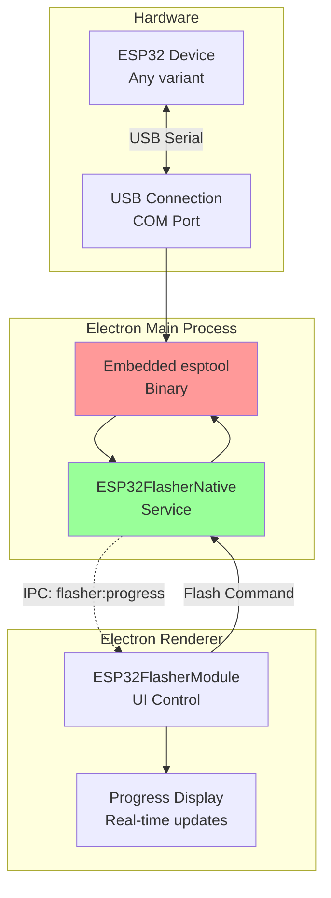
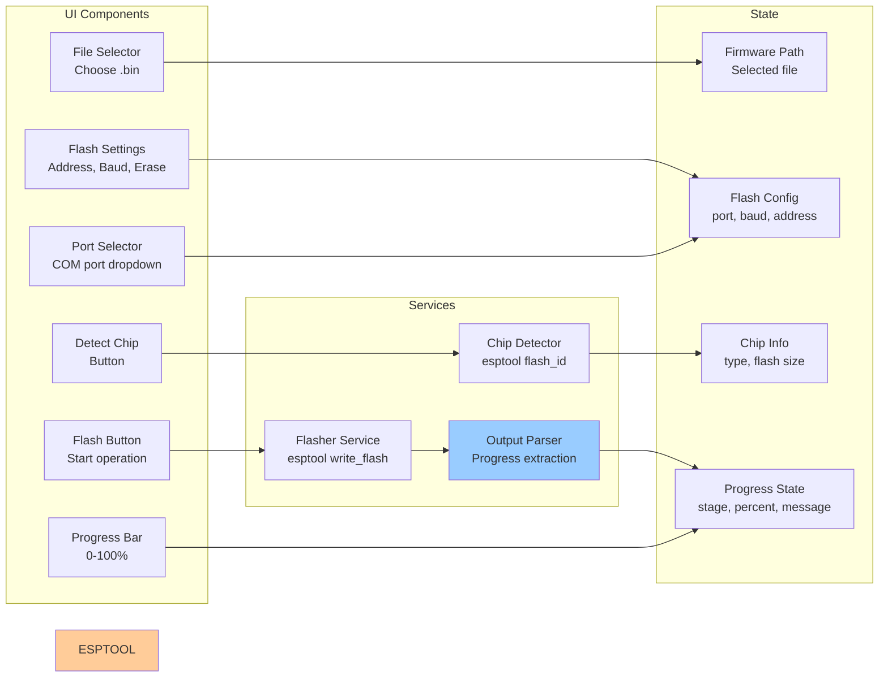

# ESP32 Flasher - ESP32 Firmware Flashing Tool

**Feature:** ESP32 Flasher (Firmware Update)  
**Purpose:** Flash firmware to ESP32 microcontrollers  
**Status:** Core feature - Always enabled  
**Last Updated:** December 9, 2025

---

## 📋 Overview

The **ESP32 Flasher** provides a native, cross-platform solution for flashing firmware to ESP32 family microcontrollers. Using embedded esptool binaries, it supports automatic chip detection and high-speed flashing for production and development.

### Key Capabilities

- 🔍 **Auto Chip Detection** - Detect ESP32, ESP32-S2, S3, C2, C3, C6, H2
- ⚡ **High-Speed Flashing** - Up to 921600 baud (default: 460800)
- 💾 **Flexible Flash Addresses** - Custom offset support (0x0, 0x10000, etc.)
- 🗑️ **Erase Options** - Full chip erase or skip erase
- 📊 **Real-Time Progress** - Visual progress bar with stage updates
- 🔧 **Production Ready** - Reliable embedded binaries (Windows/Linux)
- 🎯 **Multiple Chip Support** - All ESP32 variants

---

## 🚀 Quick Start

### 1. Connect ESP32

**Hardware:**
1. Connect ESP32 to PC via USB cable
2. ESP32 should enumerate as COM port
3. Install CP210x or CH340 drivers if needed

**Boot Mode:**
- Normal boot: Flash existing firmware
- Download mode (optional): Hold BOOT button during power-on

### 2. Select Firmware

1. Click **📁 Select Firmware** button
2. Choose `.bin` file from file dialog
3. Firmware path displayed below button

### 3. Detect Chip

1. Select COM port from dropdown
2. Click **🔍 Detect Chip** button
3. Wait for detection (2-5 seconds)
4. Chip type displayed (e.g., ESP32-S3)

### 4. Flash Firmware

1. Verify settings:
   - Port: Correct COM port
   - Chip: Detected chip type
   - Firmware: Selected file
   - Flash address: 0x10000 (default app)
   - Baud rate: 460800 (default)
2. Click **⚡ Flash Firmware**
3. Wait for completion (~30 seconds)
4. Green success message appears

---

## 🏗️ Architecture

### System Overview



### Component Diagram



---

## 🎮 Features

### Chip Detection

**Supported Chips:**
- ✅ **ESP32** - Original (Xtensa dual-core)
- ✅ **ESP32-S2** - Single-core, USB-OTG
- ✅ **ESP32-S3** - Dual-core, USB-OTG, AI acceleration
- ✅ **ESP32-C2** - RISC-V single-core (cost-optimized)
- ✅ **ESP32-C3** - RISC-V single-core
- ✅ **ESP32-C6** - RISC-V, WiFi 6
- ✅ **ESP32-H2** - RISC-V, 802.15.4, BLE 5.2

**Detection Process:**
1. Connects to device via serial
2. Sends chip ID query command
3. Reads flash ID and chip info
4. Detects flash size (2MB, 4MB, 8MB, 16MB)
5. Returns chip type and specifications

**Detection Time:** 2-5 seconds

### Flash Configuration

**Flash Address Options:**
```
0x0      → Bootloader (dangerous, usually avoid)
0x8000   → Partition table
0x10000  → Application binary (most common)
0xE000   → Boot app partition
Custom   → For OTA, NVS, etc.
```

**Baud Rate Options:**
- 115200 - Safe, slow (~2 min for 1MB)
- 230400 - Moderate speed
- **460800** - Default, good balance (~30 sec for 1MB)
- 921600 - Fastest, may fail on some systems

**Erase Options:**
- ✅ **Erase Flash** - Full chip erase before flashing (recommended)
- ⬜ **Skip Erase** - Faster, but may cause issues

### Progress Tracking

**Flash Stages:**
1. **Connecting** (0-10%) - Establishing serial connection
2. **Detecting** (10-20%) - Reading chip info
3. **Erasing** (20-40%) - Erasing flash memory (if enabled)
4. **Writing** (40-95%) - Writing firmware data
5. **Verifying** (95-100%) - Verifying written data
6. **Complete** (100%) - Flash successful

**Progress Display:**
- Visual progress bar
- Percentage complete
- Current stage description
- Estimated time remaining (calculated)
- Error messages (if failed)

---

## 💻 User Interface

### Main Controls

```
┌─────────────────────────────────────────────────┐
│ ESP32 Flasher                                   │
├─────────────────────────────────────────────────┤
│                                                 │
│  Port: [COM3 ▼]        [🔍 Detect Chip]         │
│  Detected: ESP32-S3 (8MB Flash)                 │
│                                                 │
│  Firmware: [📁 Select Firmware]                 │
│  Selected: firmware_v2.1.0.bin                  │
│                                                 │
│  Flash Address: [0x10000]                       │
│  Baud Rate: [460800 ▼]                          │
│  ☑ Erase flash before writing                   │
│                                                 │
│  [⚡ Flash Firmware]                             │
│                                                 │
│  ▓▓▓▓▓▓▓▓▓░░░░░░░░░ 65%                         │
│  Writing firmware... (512KB / 786KB)            │
│                                                 │
└─────────────────────────────────────────────────┘
```

---

## 🔧 Configuration

### Flash Memory Layout

**Standard ESP32 App:**
```
Address    Size     Purpose
0x0000     24KB     Bootloader
0x8000     3KB      Partition table
0xE000     8KB      NVS (config storage)
0x10000    ~1-4MB   Application firmware ← Flash here
0xXXXXXX   Variable OTA partition (optional)
```

**Multiple Partitions (Advanced):**
```bash
# Flash bootloader (rarely needed)
esptool write_flash 0x0 bootloader.bin

# Flash partition table
esptool write_flash 0x8000 partition-table.bin

# Flash application
esptool write_flash 0x10000 app.bin

# Flash NVS data
esptool write_flash 0xA20000 nvs.bin
```

### Command Line Equivalent

**What the app does behind the scenes:**
```bash
# Detect chip
esptool.py --port COM3 flash_id

# Flash firmware
esptool.py --port COM3 --baud 460800 \
  --chip esp32s3 \
  --before default_reset \
  --after hard_reset \
  write_flash --erase-all \
  --flash_mode dio \
  --flash_freq 80m \
  --flash_size detect \
  0x10000 firmware.bin
```

---

## 🎯 Common Tasks

### Task 1: Flash Production Firmware

**Scenario:** Mass production flashing

**Setup:**
1. Prepare firmware file: `product_v1.0.0.bin`
2. Connect first device

**Procedure:**
1. Select firmware (once)
2. For each device:
   - Connect device USB
   - Select COM port (or auto-detect)
   - Click **Flash Firmware**
   - Wait for completion (~30 seconds)
   - Disconnect device
   - Connect next device

**Tips:**
- Use default settings (460800 baud, 0x10000 address)
- Enable "Erase flash" for clean slate
- Keep firmware file open (no need to reselect)

---

### Task 2: Update Existing Firmware (OTA Address)

**Scenario:** Update app without erasing NVS

**Settings:**
- Flash Address: `0x10000` (main app)
- Erase Flash: **Unchecked** (preserve NVS)
- Baud Rate: `921600` (faster)

**Procedure:**
1. Select new firmware
2. **Uncheck** "Erase flash"
3. Flash firmware
4. Device reboots with new app
5. NVS data preserved

---

### Task 3: Recover Bricked Device

**Scenario:** Device won't boot, need complete reflash

**Procedure:**
1. Enter download mode manually:
   - Disconnect USB
   - Hold **BOOT** button
   - Connect USB (while holding BOOT)
   - Release BOOT after 2 seconds
2. Select firmware
3. **Enable** "Erase flash" (important!)
4. Flash firmware
5. Device should boot normally

**If still fails:**
- Try slower baud rate (115200)
- Check USB cable quality
- Verify firmware file is correct for chip
- Try different USB port
- Check power supply (>500mA)

---

### Task 4: Flash Multiple Partitions

**Scenario:** Flash bootloader + app + NVS

**Method 1: Multiple Operations**
1. Flash bootloader at 0x0
2. Flash partition table at 0x8000
3. Flash app at 0x10000
4. Flash NVS at 0xA20000

**Method 2: Combined Binary**
- Create combined binary with esptool:
  ```bash
  esptool.py merge_bin -o combined.bin \
    --flash_mode dio \
    --flash_size 8MB \
    0x0 bootloader.bin \
    0x8000 partition-table.bin \
    0x10000 app.bin \
    0xA20000 nvs.bin
  ```
- Flash combined.bin at address 0x0

---

## 🐛 Troubleshooting

### Issue: Chip Detection Failed

**Symptoms:**
- "Failed to connect" error
- Timeout during detection
- No chip detected

**Solutions:**

**1. Check USB Connection**
- Verify cable is data cable (not charge-only)
- Try different USB port
- Check Device Manager (Windows) for COM port

**2. Enter Download Mode**
```
Manual bootloader mode:
1. Disconnect USB
2. Hold BOOT button on ESP32
3. Connect USB while holding BOOT
4. Release BOOT after 2 seconds
5. Try detection again
```

**3. Install USB Drivers**
- CP210x: [Silicon Labs](https://www.silabs.com/developers/usb-to-uart-bridge-vcp-drivers)
- CH340: [WCH](http://www.wch.cn/downloads/CH341SER_ZIP.html)

**4. Check Serial Port Busy**
```powershell
# Close other programs using port
# Serial console, Arduino IDE, PlatformIO, etc.
```

---

### Issue: Flash Failed / Timeout

**Symptoms:**
- Flash starts but fails midway
- "Timed out waiting for packet" error
- Flash stuck at certain percentage

**Solutions:**

**1. Lower Baud Rate**
- Change from 460800 → 115200
- Slower but more reliable
- Especially for long cables or USB hubs

**2. Check Power Supply**
- ESP32 needs >500mA during flash
- USB 2.0 ports may not provide enough
- Use powered USB hub
- Or external 3.3V/5V power supply

**3. Disable Power Saving**
```powershell
# Windows USB power management
Device Manager → USB Root Hub → Properties
→ Power Management → Uncheck "Allow computer to turn off"
```

**4. Shorter USB Cable**
- Long cables cause signal degradation
- Use cable < 1 meter
- Avoid extension cables

---

### Issue: Device Boots to Download Mode

**Symptoms:**
- After flash, device stuck in bootloader
- Serial output shows "waiting for download"
- Normal app doesn't run

**Solutions:**

**1. Check Boot Strapping Pins**
- GPIO0 pulled low = download mode
- Ensure GPIO0 is high or floating during boot
- Check for hardware short

**2. Flash Correct Bootloader**
- May need to flash bootloader at 0x0
- Get bootloader from ESP-IDF or PlatformIO build
- Flash bootloader + partition table + app

**3. Manual Reset After Flash**
- Unplug USB
- Replug USB
- Device should boot normally

---

### Issue: Wrong Chip Detected

**Symptoms:**
- Detects ESP32 when device is ESP32-S3
- Or vice versa
- Flash fails with chip mismatch

**Solutions:**

**1. Use Auto-Detection**
- Always click "Detect Chip" first
- Don't manually select chip type
- esptool detects correctly 99% of time

**2. Check Device Labeling**
- Verify physical chip marking
- ESP32-WROOM-32 = ESP32
- ESP32-S3-WROOM-1 = ESP32-S3

**3. If Detection Wrong, Force Reset**
- Power cycle device
- Try detection again
- Check for counterfeit chips

---

## 📚 Code References

**Main Files:**
- `renderer/modules/ESP32FlasherModule.js` - UI control (203 lines)
- `services/esp32-flasher-native.js` - Flasher logic (690 lines)
- `embedded/esptool-binaries/` - Embedded esptool binaries
- `main.js` - IPC handlers for flashing

**Key Methods:**
- `ESP32FlasherNative.initialize()` - Extract esptool binary
- `ESP32FlasherNative.detectChip(port)` - Detect chip type
- `ESP32FlasherNative.flashFirmware(options)` - Flash firmware
- `ESP32FlasherModule.selectFirmwareFile()` - File dialog
- `ESP32FlasherModule.flashFirmware(options)` - UI handler

**IPC Channels:**
- `flasher:show-firmware-dialog` - Open file dialog
- `flasher:detect-chip` - Detect chip type
- `flasher:flash-firmware` - Start flashing
- `flasher:progress` - Progress updates (main → renderer)
- `flasher:complete` - Flash complete (main → renderer)
- `flasher:error` - Flash error (main → renderer)

---

## 🔗 Related Features

- **Serial Console** - Monitor device output during flash
- **Provisioning** - Flash NVS partition with credentials
- **Factory Testing** - Flash firmware + run tests
- **UDP Logs** - Monitor device logs post-flash

---

## 📝 Best Practices

### For Production

1. **Use consistent settings** - Document flash address, baud
2. **Always erase flash** - Ensures clean state
3. **Verify firmware files** - Check SHA256 hash
4. **Test one device first** - Before mass production
5. **Keep logs** - Record flash success/failure rates

### For Development

1. **Use higher baud rates** - 921600 for faster iteration
2. **Skip erase for OTA testing** - Faster reflash
3. **Keep serial console open** - Monitor boot immediately
4. **Use debug builds** - More verbose output
5. **Name firmware files clearly** - Include version, date

### For Troubleshooting

1. **Start with chip detection** - Verifies connection
2. **Try slow baud rate first** - 115200 is most reliable
3. **Check device console** - Use Serial Console feature
4. **Verify power supply** - Measure voltage under load
5. **Test with known-good firmware** - Isolate firmware issues

---

## 🎓 Learning Resources

**ESP32 Flashing:**
- [esptool Documentation](https://docs.espressif.com/projects/esptool/en/latest/)
- [ESP32 Flash Download Tool](https://www.espressif.com/en/support/download/other-tools)
- [ESP-IDF Programming Guide](https://docs.espressif.com/projects/esp-idf/en/latest/)

**Related Documentation:**
- [Main Documentation Index](../../README.md)
- [Serial Console](../serial-console/README.md)
- [Provisioning](../provisioning/README.md)
- [Factory Testing](../factory-testing/README.md)

---

## 📄 File Listing

**This Feature's Documentation:**
- [README.md](./README.md) - This file (overview)
- [ESP32Flasher-Overview.md](./ESP32Flasher-Overview.md) - Technical deep dive
- [ESP32Flasher-UserGuide.md](./ESP32Flasher-UserGuide.md) - Detailed procedures
- [ESP32Flasher-SourceCode.md](./ESP32Flasher-SourceCode.md) - Developer documentation
- [ESP32Flasher-Troubleshooting.md](./ESP32Flasher-Troubleshooting.md) - Problem solving

---

**Last Updated:** December 9, 2025  
**Status:** ✅ Core Feature - Always Available  
**Next:** Read [ESP32Flasher-UserGuide.md](./ESP32Flasher-UserGuide.md) for step-by-step instructions
