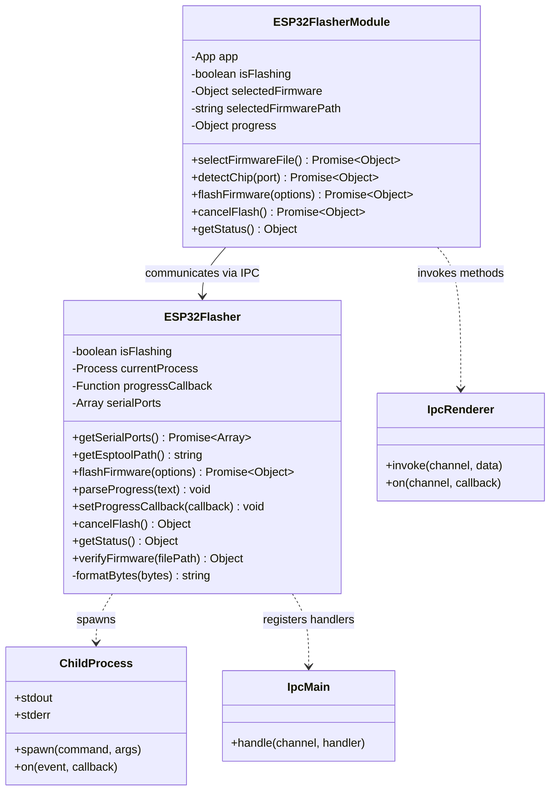
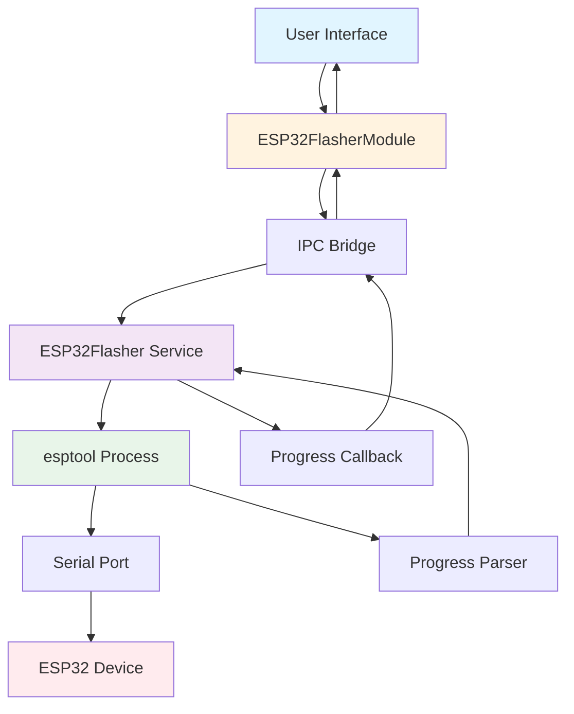
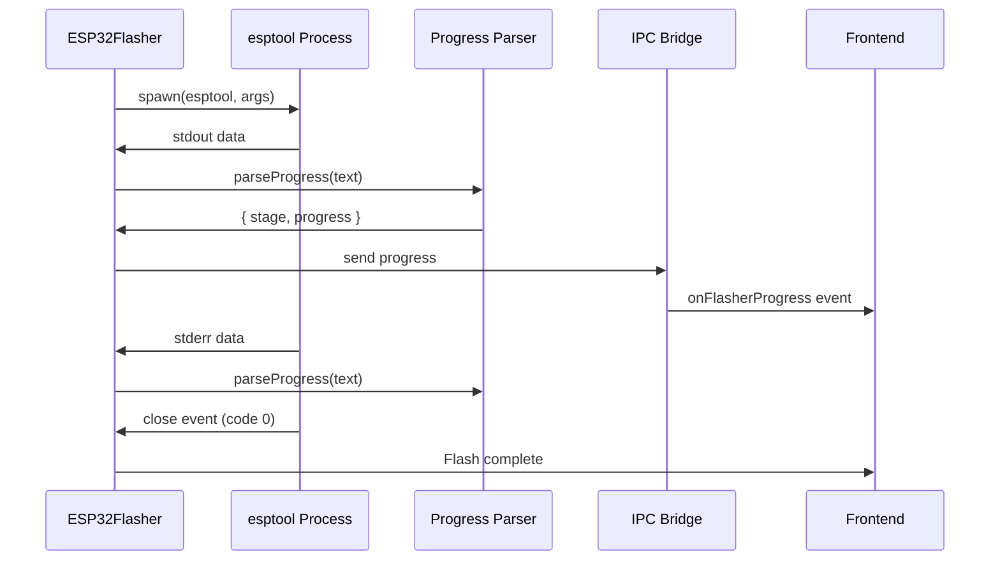

# ESP32 Flasher - Source Code Documentation

## Table of Contents
1. [Architecture Overview](#architecture-overview)
2. [ESP32Flasher Class (Backend)](#esp32flasher-class-backend)
3. [ESP32FlasherModule Class (Frontend)](#esp32flashermodule-class-frontend)
4. [IPC Communication](#ipc-communication)
5. [esptool Process Management](#esptool-process-management)
6. [Progress Parsing](#progress-parsing)
7. [Code Examples](#code-examples)
8. [Testing Guide](#testing-guide)

---

## Architecture Overview

### Class Diagram



### Component Flow



---

## ESP32Flasher Class (Backend)

**Location:** `services/esp32-flasher.js`

### Class Overview

```javascript
/**
 * ESP32 Flasher Service
 * Manages ESP32 firmware flashing using native esptool binaries
 */
class ESP32Flasher {
  constructor() {
    this.isFlashing = false;
    this.currentProcess = null;
    this.progressCallback = null;
    this.serialPorts = [];
  }
}
```

### Properties

| Property | Type | Description |
|----------|------|-------------|
| `isFlashing` | `boolean` | Indicates if flash operation is in progress |
| `currentProcess` | `ChildProcess` | Reference to spawned esptool process |
| `progressCallback` | `Function` | Callback for progress updates |
| `serialPorts` | `Array<Object>` | Cached list of available serial ports |

---

### Methods

#### getSerialPorts()

Lists available serial ports for ESP32 connection.

**Signature:**
```javascript
async getSerialPorts(): Promise<Array<Object>>
```

**Returns:**
```javascript
[
  {
    path: "COM3",
    manufacturer: "Silicon Labs",
    serialNumber: "0001",
    productId: "ea60",
    vendorId: "10c4"
  },
  // ... more ports
]
```

**Implementation:**
```javascript
async getSerialPorts() {
  try {
    const ports = await SerialPort.list();
    this.serialPorts = ports.map(port => ({
      path: port.path,
      manufacturer: port.manufacturer || 'Unknown',
      serialNumber: port.serialNumber || '',
      productId: port.productId || '',
      vendorId: port.vendorId || ''
    }));
    return this.serialPorts;
  } catch (error) {
    console.error('Error listing serial ports:', error);
    return [];
  }
}
```

**Usage:**
```javascript
const flasher = new ESP32Flasher();
const ports = await flasher.getSerialPorts();
console.log('Available ports:', ports);
```

---

#### getEsptoolPath()

Returns platform-specific path to bundled esptool binary.

**Signature:**
```javascript
getEsptoolPath(): string
```

**Returns:**
```javascript
// Windows: "C:\\...\\esptool-win64\\esptool.exe"
// Linux:   "/opt/.../esptool-linux-amd64/esptool"
// macOS:   "/Applications/.../esptool-macos/esptool"
```

**Implementation:**
```javascript
getEsptoolPath() {
  const path = require('path');
  const { app } = require('electron');
  const os = require('os');
  
  const platform = os.platform();
  
  const resourcePath = app.isPackaged 
    ? path.join(process.resourcesPath, 'tools', 'esptool')
    : path.join(__dirname, '..', 'tools', 'esptool');
  
  if (platform === 'win32') {
    return path.join(resourcePath, 'esptool-win64', 'esptool.exe');
  } else {
    const esptoolPath = path.join(resourcePath, 'esptool-linux-amd64', 'esptool');
    
    // Make executable
    try {
      const fs = require('fs');
      fs.chmodSync(esptoolPath, '755');
    } catch (err) {
      console.warn('Could not set esptool permissions:', err);
    }
    
    return esptoolPath;
  }
}
```

**Platform Detection:**

| Platform | `os.platform()` | Binary Path |
|----------|----------------|-------------|
| Windows | `'win32'` | `esptool-win64/esptool.exe` |
| Linux | `'linux'` | `esptool-linux-amd64/esptool` |
| macOS | `'darwin'` | `esptool-macos/esptool` |

---

#### flashFirmware()

Flashes firmware to ESP32 device.

**Signature:**
```javascript
async flashFirmware(options: Object): Promise<Object>
```

**Parameters:**
```javascript
{
  port: string,              // e.g., "COM3" or "/dev/ttyUSB0"
  baudRate: number,          // Default: 460800
  firmwarePath: string,      // Absolute path to .bin file
  chipType: string,          // Default: "esp32"
  flashMode: string,         // Default: "dio"
  flashFreq: string,         // Default: "40m"
  flashSize: string,         // Default: "4MB"
  eraseFlash: boolean,       // Default: false
  address: string            // Default: "0x10000"
}
```

**Returns:**
```javascript
{
  success: true,
  message: "Firmware flashed successfully",
  output: "esptool.py v4.5...\nConnecting...\n...",
  exitCode: 0
}

// On failure:
{
  success: false,
  message: "Flash failed with exit code 1",
  output: "...",
  error: "Error: ...",
  exitCode: 1
}
```

**Implementation:**
```javascript
async flashFirmware(options) {
  const {
    port,
    baudRate = 460800,
    firmwarePath,
    chipType = 'esp32',
    flashMode = 'dio',
    flashFreq = '40m',
    flashSize = '4MB',
    eraseFlash = false,
    address = '0x10000'
  } = options;

  return new Promise((resolve, reject) => {
    if (this.isFlashing) {
      reject(new Error('Flash operation already in progress'));
      return;
    }

    if (!fs.existsSync(firmwarePath)) {
      reject(new Error(`Firmware file not found: ${firmwarePath}`));
      return;
    }

    this.isFlashing = true;
    const esptool = this.getEsptoolPath();
    const args = [
      '--chip', chipType,
      '--port', port,
      '--baud', baudRate.toString()
    ];

    if (eraseFlash) {
      args.push('erase_flash');
    } else {
      args.push('write-flash');
      args.push('--flash-mode', flashMode);
      args.push('--flash-freq', flashFreq);
      args.push('--flash-size', flashSize);
      args.push(address, firmwarePath);
    }

    this.currentProcess = spawn(esptool, args);

    let output = '';
    let errorOutput = '';

    this.currentProcess.stdout.on('data', (data) => {
      const text = data.toString();
      output += text;
      this.parseProgress(text);
    });

    this.currentProcess.stderr.on('data', (data) => {
      const text = data.toString();
      errorOutput += text;
      this.parseProgress(text);
    });

    this.currentProcess.on('close', (code) => {
      this.isFlashing = false;
      this.currentProcess = null;

      if (code === 0) {
        resolve({
          success: true,
          message: 'Firmware flashed successfully',
          output: output,
          exitCode: code
        });
      } else {
        reject({
          success: false,
          message: `Flash failed with exit code ${code}`,
          output: output,
          error: errorOutput,
          exitCode: code
        });
      }
    });

    this.currentProcess.on('error', (error) => {
      this.isFlashing = false;
      this.currentProcess = null;
      reject({
        success: false,
        message: `Failed to start esptool: ${error.message}`,
        error: error.message
      });
    });
  });
}
```

**Example Usage:**
```javascript
const result = await flasher.flashFirmware({
  port: 'COM3',
  baudRate: 460800,
  firmwarePath: 'C:\\firmware\\app.bin',
  chipType: 'esp32',
  eraseFlash: true,
  address: '0x10000'
});

console.log(result.message); // "Firmware flashed successfully"
```

---

#### parseProgress()

Extracts progress information from esptool output.

**Signature:**
```javascript
parseProgress(text: string): void
```

**Parameters:**
- `text`: Line of output from esptool stdout/stderr

**Implementation:**
```javascript
parseProgress(text) {
  // Extract percentage: "Writing at 0x00010000... (10 %)"
  const progressMatch = text.match(/\((\d+)\s*%\)/);
  if (progressMatch && this.progressCallback) {
    const progress = parseInt(progressMatch[1]);
    this.progressCallback({
      progress: progress,
      stage: this.getFlashStage(text)
    });
  }

  // Detect stage changes
  if (this.progressCallback) {
    if (text.includes('Connecting')) {
      this.progressCallback({ stage: 'connecting', progress: 0 });
    } else if (text.includes('Erasing')) {
      this.progressCallback({ stage: 'erasing', progress: 0 });
    } else if (text.includes('Writing')) {
      this.progressCallback({ stage: 'writing', progress: 0 });
    } else if (text.includes('Verifying')) {
      this.progressCallback({ stage: 'verifying', progress: 0 });
    } else if (text.includes('Hash of data verified')) {
      this.progressCallback({ stage: 'complete', progress: 100 });
    }
  }
}
```

**Progress Patterns:**

| esptool Output | Extracted Data |
|----------------|----------------|
| `"Connecting...."` | `{ stage: 'connecting', progress: 0 }` |
| `"Erasing flash..."` | `{ stage: 'erasing', progress: 0 }` |
| `"Writing at 0x00010000... (25 %)"` | `{ stage: 'writing', progress: 25 }` |
| `"Verifying..."` | `{ stage: 'verifying', progress: 0 }` |
| `"Hash of data verified."` | `{ stage: 'complete', progress: 100 }` |

---

#### setProgressCallback()

Registers callback function for progress updates.

**Signature:**
```javascript
setProgressCallback(callback: Function): void
```

**Parameters:**
- `callback`: Function receiving progress objects

**Usage:**
```javascript
flasher.setProgressCallback((progress) => {
  console.log(`Stage: ${progress.stage}, Progress: ${progress.progress}%`);
  
  // Send to frontend via IPC
  mainWindow.webContents.send('flasher:progress', progress);
});
```

---

#### cancelFlash()

Cancels ongoing flash operation.

**Signature:**
```javascript
cancelFlash(): Object
```

**Returns:**
```javascript
{
  success: true,
  message: "Flash operation cancelled"
}

// Or if no operation in progress:
{
  success: false,
  message: "No flash operation in progress"
}
```

**Implementation:**
```javascript
cancelFlash() {
  if (this.currentProcess) {
    this.currentProcess.kill();
    this.currentProcess = null;
    this.isFlashing = false;
    return {
      success: true,
      message: 'Flash operation cancelled'
    };
  }
  return {
    success: false,
    message: 'No flash operation in progress'
  };
}
```

---

#### getStatus()

Returns current flasher status.

**Signature:**
```javascript
getStatus(): Object
```

**Returns:**
```javascript
{
  isFlashing: false,
  hasProcess: false,
  portsAvailable: 3
}
```

---

#### verifyFirmware()

Validates firmware file before flashing.

**Signature:**
```javascript
verifyFirmware(filePath: string): Object
```

**Returns:**
```javascript
{
  success: true,
  message: "Firmware file is valid",
  size: 1048576,
  sizeHuman: "1 MB",
  extension: ".bin"
}

// On failure:
{
  success: false,
  message: "Invalid file type. Expected .bin or .elf"
}
```

**Implementation:**
```javascript
verifyFirmware(filePath) {
  try {
    if (!fs.existsSync(filePath)) {
      return {
        success: false,
        message: 'File not found'
      };
    }

    const stats = fs.statSync(filePath);
    const ext = path.extname(filePath).toLowerCase();

    if (!['.bin', '.elf'].includes(ext)) {
      return {
        success: false,
        message: 'Invalid file type. Expected .bin or .elf'
      };
    }

    return {
      success: true,
      message: 'Firmware file is valid',
      size: stats.size,
      sizeHuman: this.formatBytes(stats.size),
      extension: ext
    };
  } catch (error) {
    return {
      success: false,
      message: `Error verifying firmware: ${error.message}`
    };
  }
}
```

---

## ESP32FlasherModule Class (Frontend)

**Location:** `renderer/modules/ESP32FlasherModule.js`

### Class Overview

```javascript
/**
 * ESP32 Flasher Module (Frontend)
 * UI controller for ESP32 firmware flashing
 */
class ESP32FlasherModule {
  constructor(app) {
    this.app = app;
    this.isFlashing = false;
    this.selectedFirmware = null;
    this.selectedFirmwarePath = '';
    this.progress = {
      stage: '',
      progress: 0,
      message: '',
      chipType: null
    };

    // Listen for progress updates
    window.electronAPI.onFlasherProgress((progress) => {
      this.progress = { ...this.progress, ...progress };
      this.app.render();
    });
  }
}
```

### Properties

| Property | Type | Description |
|----------|------|-------------|
| `app` | `App` | Reference to main application |
| `isFlashing` | `boolean` | Flash operation in progress |
| `selectedFirmware` | `Object` | Selected firmware file info |
| `selectedFirmwarePath` | `string` | Absolute path to firmware |
| `progress` | `Object` | Current flash progress state |

---

### Methods

#### selectFirmwareFile()

Opens file dialog for firmware selection.

**Signature:**
```javascript
async selectFirmwareFile(): Promise<Object>
```

**Returns:**
```javascript
{
  success: true,
  file: {
    name: "firmware.bin",
    path: "C:\\firmware\\firmware.bin"
  },
  name: "firmware.bin",
  path: "C:\\firmware\\firmware.bin"
}
```

**Implementation:**
```javascript
async selectFirmwareFile() {
  try {
    const result = await window.electronAPI.showFirmwareDialog();

    if (!result.canceled && result.filePaths && result.filePaths.length > 0) {
      this.selectedFirmwarePath = result.filePaths[0];
      this.selectedFirmware = {
        name: this.selectedFirmwarePath.split(/[/\\]/).pop(),
        path: this.selectedFirmwarePath
      };

      return {
        success: true,
        file: this.selectedFirmware,
        name: this.selectedFirmware.name,
        path: this.selectedFirmwarePath
      };
    }

    return { success: false };
  } catch (error) {
    console.error('Error selecting firmware file:', error);
    return { success: false, error: error.message };
  }
}
```

---

#### detectChip()

Detects ESP32 chip type on specified port.

**Signature:**
```javascript
async detectChip(port: string): Promise<Object>
```

**Returns:**
```javascript
{
  success: true,
  chipType: "ESP32-D0WD-V3",
  flashSize: "4MB",
  macAddress: "24:0A:C4:XX:XX:XX"
}
```

**Implementation:**
```javascript
async detectChip(port) {
  try {
    this.progress = {
      stage: 'detecting',
      progress: 5,
      message: 'Detecting chip type...',
      chipType: null
    };
    this.app.render();

    const result = await window.electronAPI.detectChip(port);

    if (result.success) {
      this.progress = {
        stage: 'detected',
        progress: 10,
        message: `Detected ${result.chipType}`,
        chipType: result.chipType
      };
    } else {
      this.progress = {
        stage: 'failed',
        progress: 0,
        message: result.error || 'Chip detection failed',
        chipType: null
      };
    }

    this.app.render();
    return result;
  } catch (error) {
    console.error('Error detecting chip:', error);
    this.progress = {
      stage: 'failed',
      progress: 0,
      message: error.message,
      chipType: null
    };
    this.app.render();
    return { success: false, error: error.message };
  }
}
```

---

#### flashFirmware()

Initiates firmware flash operation.

**Signature:**
```javascript
async flashFirmware(options: Object): Promise<Object>
```

**Parameters:**
```javascript
{
  port: string,
  firmwarePath: string,
  baudRate: number,        // Default: 460800
  flashAddress: string,    // Default: "0x10000"
  eraseFlash: boolean      // Default: true
}
```

**Implementation:**
```javascript
async flashFirmware(options) {
  const {
    port,
    firmwarePath,
    baudRate = 460800,
    flashAddress = '0x10000',
    eraseFlash = true
  } = options;

  try {
    this.isFlashing = true;
    this.progress = {
      stage: 'starting',
      progress: 0,
      message: 'Starting flash operation...',
      chipType: null
    };
    this.app.render();

    const result = await window.electronAPI.flashFirmware({
      port,
      firmwarePath,
      baudRate,
      flashAddress,
      eraseFlash
    });

    this.isFlashing = false;

    if (result.success) {
      this.progress = {
        stage: 'complete',
        progress: 100,
        message: 'Flash completed successfully!',
        chipType: this.progress.chipType
      };
    } else {
      this.progress = {
        stage: 'failed',
        progress: 0,
        message: result.error || 'Flash failed',
        chipType: null
      };
    }

    this.app.render();
    return result;
  } catch (error) {
    console.error('Flash error:', error);
    this.isFlashing = false;
    this.progress = {
      stage: 'failed',
      progress: 0,
      message: error.message,
      chipType: null
    };
    this.app.render();
    return { success: false, error: error.message };
  }
}
```

---

## IPC Communication

### IPC Methods Reference

**Renderer → Main Process:**

```javascript
// Get serial ports
const ports = await window.electronAPI.getSerialPorts();

// Show firmware file dialog
const result = await window.electronAPI.showFirmwareDialog();

// Detect chip type
const chipInfo = await window.electronAPI.detectChip('COM3');

// Flash firmware
const flashResult = await window.electronAPI.flashFirmware({
  port: 'COM3',
  firmwarePath: 'C:\\firmware.bin',
  baudRate: 460800,
  flashAddress: '0x10000',
  eraseFlash: true
});

// Cancel flash
const cancelResult = await window.electronAPI.cancelFlash();
```

**Main → Renderer Process:**

```javascript
// Progress updates (main process sends)
mainWindow.webContents.send('flasher:progress', {
  stage: 'writing',
  progress: 50,
  message: 'Writing at 0x00050000...'
});

// Renderer listens
window.electronAPI.onFlasherProgress((progress) => {
  console.log('Progress:', progress);
  // Update UI
});
```

### IPC Registration (main.js)

```javascript
const ESP32Flasher = require('./services/esp32-flasher');
const flasher = new ESP32Flasher();

// Set up progress callback
flasher.setProgressCallback((progress) => {
  mainWindow.webContents.send('flasher:progress', progress);
});

// Register handlers
ipcMain.handle('flasher:getSerialPorts', async () => {
  return await flasher.getSerialPorts();
});

ipcMain.handle('flasher:detectChip', async (event, port) => {
  return await flasher.detectChip(port);
});

ipcMain.handle('flasher:flashFirmware', async (event, options) => {
  return await flasher.flashFirmware(options);
});

ipcMain.handle('flasher:cancelFlash', async () => {
  return flasher.cancelFlash();
});

ipcMain.handle('flasher:showFirmwareDialog', async () => {
  return await dialog.showOpenDialog({
    properties: ['openFile'],
    filters: [
      { name: 'Firmware', extensions: ['bin', 'elf'] }
    ]
  });
});
```

---

## esptool Process Management

### Process Lifecycle



### Process Spawn

```javascript
const { spawn } = require('child_process');

// Build command
const esptool = this.getEsptoolPath();
const args = [
  '--chip', 'esp32',
  '--port', 'COM3',
  '--baud', '460800',
  'write-flash',
  '--flash-mode', 'dio',
  '--flash-freq', '40m',
  '--flash-size', '4MB',
  '0x10000', 'firmware.bin'
];

// Spawn process
this.currentProcess = spawn(esptool, args);

// Handle output
this.currentProcess.stdout.on('data', (data) => {
  const text = data.toString();
  console.log('esptool:', text);
  this.parseProgress(text);
});

this.currentProcess.stderr.on('data', (data) => {
  const text = data.toString();
  console.error('esptool error:', text);
  this.parseProgress(text);
});

// Handle completion
this.currentProcess.on('close', (code) => {
  if (code === 0) {
    console.log('Flash successful');
  } else {
    console.error('Flash failed with code', code);
  }
});

// Handle errors
this.currentProcess.on('error', (error) => {
  console.error('Failed to start esptool:', error);
});
```

---

## Progress Parsing

### Regular Expression Patterns

```javascript
const progressPatterns = {
  // Percentage: "Writing at 0x00010000... (25 %)"
  percentage: /\((\d+)\s*%\)/,
  
  // Chip detection: "Chip is ESP32-D0WD-V3 (revision v3.0)"
  chipType: /Chip is (ESP32[^\s]+)/,
  
  // Flash size: "Detected flash size: 4MB"
  flashSize: /Detected flash size: (\d+MB)/,
  
  // Address: "Writing at 0x00010000"
  address: /Writing at (0x[0-9a-fA-F]+)/,
  
  // Stages
  connecting: /Connecting/,
  erasing: /Erasing flash/,
  writing: /Writing/,
  verifying: /Verifying/,
  verified: /Hash of data verified/,
  resetting: /Hard resetting/
};
```

### Stage Extraction

```javascript
getFlashStage(text) {
  if (text.includes('Connecting')) return 'connecting';
  if (text.includes('Erasing')) return 'erasing';
  if (text.includes('Writing')) return 'writing';
  if (text.includes('Verifying')) return 'verifying';
  if (text.includes('Hash of data verified')) return 'complete';
  return 'unknown';
}
```

### Progress Mapping

```javascript
// Map esptool stages to progress percentage ranges
const stageRanges = {
  connecting: [0, 5],
  syncing: [5, 10],
  detecting: [10, 15],
  erasing: [15, 30],      // If enabled
  writing: [30, 90],      // Main flash operation
  verifying: [90, 98],
  resetting: [98, 100]
};

function mapProgress(stage, stageProgress) {
  const [min, max] = stageRanges[stage];
  return min + (stageProgress / 100) * (max - min);
}
```

---

## Code Examples

### Example 1: Basic Flash Operation

```javascript
const ESP32Flasher = require('./services/esp32-flasher');

async function flashFirmware() {
  const flasher = new ESP32Flasher();
  
  // List ports
  const ports = await flasher.getSerialPorts();
  console.log('Available ports:', ports);
  
  // Select first port
  const port = ports[0].path;
  
  // Set up progress callback
  flasher.setProgressCallback((progress) => {
    console.log(`[${progress.stage}] ${progress.progress}%`);
  });
  
  // Flash firmware
  try {
    const result = await flasher.flashFirmware({
      port: port,
      firmwarePath: 'C:\\firmware\\app.bin',
      baudRate: 460800,
      eraseFlash: true,
      address: '0x10000'
    });
    
    console.log('Success:', result.message);
  } catch (error) {
    console.error('Flash failed:', error.message);
  }
}

flashFirmware();
```

---

### Example 2: Frontend Integration

```javascript
class FlashPage {
  constructor() {
    this.module = new ESP32FlasherModule(app);
  }
  
  async onFlashClick() {
    // Check firmware selected
    if (!this.module.selectedFirmwarePath) {
      alert('Please select firmware first');
      return;
    }
    
    // Get selected port from UI
    const port = document.getElementById('portSelect').value;
    
    // Flash firmware
    const result = await this.module.flashFirmware({
      port: port,
      firmwarePath: this.module.selectedFirmwarePath,
      baudRate: 460800,
      flashAddress: '0x10000',
      eraseFlash: true
    });
    
    if (result.success) {
      console.log('Flash completed successfully');
    } else {
      console.error('Flash failed:', result.error);
    }
  }
  
  render() {
    const { progress } = this.module;
    
    return `
      <div class="flash-progress">
        <p>Stage: ${progress.stage}</p>
        <progress value="${progress.progress}" max="100"></progress>
        <p>${progress.message}</p>
      </div>
    `;
  }
}
```

---

### Example 3: Progress Monitoring

```javascript
// Real-time progress monitoring
flasher.setProgressCallback((progress) => {
  const { stage, progress: percent } = progress;
  
  // Update progress bar
  updateProgressBar(percent);
  
  // Log stage changes
  if (progress.stage !== lastStage) {
    console.log(`Stage changed: ${lastStage} → ${progress.stage}`);
    lastStage = progress.stage;
  }
  
  // Estimate time remaining
  const elapsed = Date.now() - startTime;
  const rate = percent / elapsed;
  const remaining = (100 - percent) / rate;
  console.log(`ETA: ${Math.round(remaining / 1000)} seconds`);
  
  // Send notification on completion
  if (stage === 'complete') {
    new Notification('Flash Complete', {
      body: 'Firmware flashed successfully'
    });
  }
});
```

---

### Example 4: Batch Flashing

```javascript
async function flashMultipleDevices(firmwarePath, ports) {
  const flasher = new ESP32Flasher();
  const results = [];
  
  for (const port of ports) {
    console.log(`Flashing ${port}...`);
    
    try {
      const result = await flasher.flashFirmware({
        port: port,
        firmwarePath: firmwarePath,
        baudRate: 460800,
        eraseFlash: true,
        address: '0x10000'
      });
      
      results.push({
        port: port,
        success: true,
        message: result.message
      });
      
      console.log(`✓ ${port} flashed successfully`);
    } catch (error) {
      results.push({
        port: port,
        success: false,
        error: error.message
      });
      
      console.error(`✗ ${port} failed:`, error.message);
    }
  }
  
  return results;
}

// Usage
const results = await flashMultipleDevices(
  'C:\\firmware\\app.bin',
  ['COM3', 'COM4', 'COM5']
);

console.log('Batch flash results:', results);
```

---

## Testing Guide

### Unit Tests

```javascript
const ESP32Flasher = require('./services/esp32-flasher');
const assert = require('assert');

describe('ESP32Flasher', () => {
  let flasher;
  
  beforeEach(() => {
    flasher = new ESP32Flasher();
  });
  
  describe('getEsptoolPath()', () => {
    it('should return path to esptool binary', () => {
      const path = flasher.getEsptoolPath();
      assert(path.includes('esptool'));
    });
  });
  
  describe('verifyFirmware()', () => {
    it('should accept .bin files', () => {
      const result = flasher.verifyFirmware('test.bin');
      assert(result.success === true || result.message === 'File not found');
    });
    
    it('should reject invalid file types', () => {
      const result = flasher.verifyFirmware('test.txt');
      assert(result.success === false);
      assert(result.message.includes('Invalid file type'));
    });
  });
  
  describe('parseProgress()', () => {
    it('should extract percentage from output', () => {
      let capturedProgress = null;
      
      flasher.setProgressCallback((progress) => {
        capturedProgress = progress;
      });
      
      flasher.parseProgress('Writing at 0x00010000... (50 %)');
      
      assert(capturedProgress.progress === 50);
      assert(capturedProgress.stage === 'writing');
    });
  });
  
  describe('getStatus()', () => {
    it('should return current status', () => {
      const status = flasher.getStatus();
      assert(typeof status.isFlashing === 'boolean');
      assert(typeof status.hasProcess === 'boolean');
    });
  });
});
```

### Integration Tests

```javascript
describe('ESP32Flasher Integration', () => {
  it('should list serial ports', async () => {
    const flasher = new ESP32Flasher();
    const ports = await flasher.getSerialPorts();
    assert(Array.isArray(ports));
  });
  
  it('should handle missing firmware file', async () => {
    const flasher = new ESP32Flasher();
    
    try {
      await flasher.flashFirmware({
        port: 'COM3',
        firmwarePath: 'nonexistent.bin',
        baudRate: 460800
      });
      assert.fail('Should have thrown error');
    } catch (error) {
      assert(error.message.includes('not found'));
    }
  });
});
```

### Manual Testing Checklist

✅ **Port Detection:**
- [ ] Plug in ESP32, verify port appears in list
- [ ] Unplug ESP32, verify port disappears
- [ ] Test with multiple USB ports

✅ **Firmware Selection:**
- [ ] Click "Select Firmware", verify file dialog opens
- [ ] Select .bin file, verify filename displays
- [ ] Try selecting non-.bin file, verify error

✅ **Flash Operation:**
- [ ] Flash with erase enabled, verify completes
- [ ] Flash without erase, verify faster completion
- [ ] Verify progress updates during flash
- [ ] Verify device resets after flash

✅ **Error Handling:**
- [ ] Disconnect device during flash, verify error
- [ ] Try flashing while another program uses port, verify error
- [ ] Flash with incorrect baud rate, verify timeout/failure

---

## Summary

This source code documentation covered:

✅ **Architecture** - Class diagrams and component flow  
✅ **ESP32Flasher Class** - Backend service with 8 methods  
✅ **ESP32FlasherModule Class** - Frontend controller with UI integration  
✅ **IPC Communication** - Complete API reference with examples  
✅ **Process Management** - esptool spawning and lifecycle  
✅ **Progress Parsing** - Regex patterns and stage mapping  
✅ **Code Examples** - 4 practical implementations  
✅ **Testing Guide** - Unit tests, integration tests, manual checklist  

**Key Classes:**

| Class | Location | Purpose |
|-------|----------|---------|
| `ESP32Flasher` | `services/esp32-flasher.js` | Backend flash service |
| `ESP32FlasherModule` | `renderer/modules/ESP32FlasherModule.js` | Frontend UI controller |

**Key Methods:**

| Method | Class | Description |
|--------|-------|-------------|
| `flashFirmware()` | ESP32Flasher | Execute flash operation |
| `parseProgress()` | ESP32Flasher | Extract progress from output |
| `getEsptoolPath()` | ESP32Flasher | Get platform-specific binary |
| `detectChip()` | ESP32FlasherModule | Identify ESP32 chip type |
| `selectFirmwareFile()` | ESP32FlasherModule | Open file selection dialog |

**Next Steps:**  
See [Troubleshooting.md](Troubleshooting.md) for common issues and solutions.
