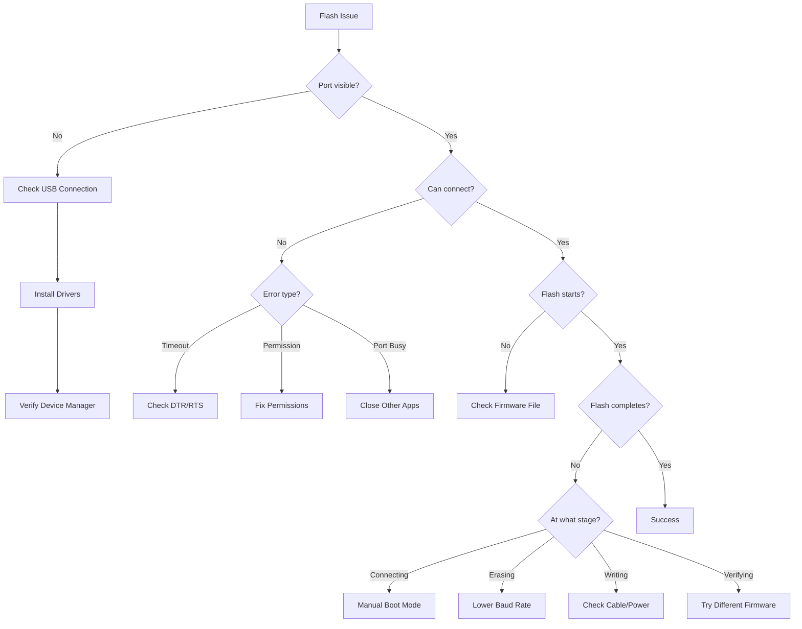

# ESP32 Flasher - Troubleshooting Guide

## Table of Contents
1. [Diagnostic Flowchart](#diagnostic-flowchart)
2. [Connection Issues](#connection-issues)
3. [Flash Failures](#flash-failures)
4. [Chip Detection Problems](#chip-detection-problems)
5. [File and Path Issues](#file-and-path-issues)
6. [Performance Problems](#performance-problems)
7. [Platform-Specific Issues](#platform-specific-issues)
8. [Common Error Messages](#common-error-messages)
9. [Advanced Diagnostics](#advanced-diagnostics)
10. [FAQ](#faq)

---

## Diagnostic Flowchart



---

## Connection Issues

### Issue: Port Not Detected

**Symptom:**  
Port dropdown is empty, or ESP32 port doesn't appear.

**Diagnostic Steps:**

**Windows:**
```powershell
# Check Device Manager
devmgmt.msc

# Look under "Ports (COM & LPT)"
# If no port shown, check under "Other devices" for "Unknown Device"

# List COM ports via PowerShell
Get-WmiObject Win32_SerialPort | Select-Object Name, DeviceID

# Check USB devices
Get-PnpDevice | Where-Object {$_.Class -eq "Ports"}
```

**Linux:**
```bash
# Check USB devices
lsusb

# Should show something like:
# Bus 001 Device 005: ID 1a86:7523 QinHeng Electronics HL-340 USB-Serial

# Check for serial devices
ls -l /dev/ttyUSB* /dev/ttyACM*

# Watch kernel log while plugging
dmesg -w
# Then plug in ESP32

# Check if device detected
dmesg | grep -i "usb\|tty" | tail -20
```

**Common Causes:**

| Cause | Windows Symptom | Linux Symptom | Solution |
|-------|----------------|---------------|----------|
| **No USB connection** | No device in Device Manager | `lsusb` shows nothing new | Check physical cable |
| **Charge-only cable** | Device powers but no port | No /dev/ttyUSB* | Use data-capable cable |
| **Driver not installed** | Yellow exclamation mark | No port created | Install CH340/CP2102 driver |
| **USB port issue** | Device keeps disconnecting | USB reset messages | Try different USB port |

---

### Issue: "Failed to Connect" or Timeout

**Symptom:**
```
Error: Failed to connect to ESP32
Connecting........_____....._____.....
```

**Causes & Solutions:**

**1. ESP32 Not in Download Mode**

ESP32 must enter bootloader mode for flashing.

**Automatic Entry (Most Boards):**
- esptool uses DTR/RTS to automatically enter download mode
- If board has auto-reset circuit, this works automatically

**Manual Entry (If Auto-Reset Fails):**
```
1. Press and HOLD the BOOT button (GPIO0)
2. Click "Flash Firmware" in application
3. When you see "Connecting...", press and release RESET button
4. Release BOOT button
5. Flash should proceed
```

**2. Incorrect Baud Rate**

Try lower baud rate:
```
Change from: 460800
To:          115200
```

**3. DTR/RTS Not Working**

Some USB adapters don't support DTR/RTS control.

**Test:**
```bash
# Linux - test DTR/RTS with Python
python3 -c "
import serial
ser = serial.Serial('/dev/ttyUSB0', 115200)
ser.dtr = False
ser.rts = True
print('DTR/RTS toggled')
ser.close()
"
```

**Fix:** Use manual boot mode entry (see above).

---

### Issue: Port Access Denied (Linux)

**Full Error:**
```
Error: Permission denied, cannot open /dev/ttyUSB0
```

**Solution:**

```bash
# Permanent fix: Add user to dialout group
sudo usermod -a -G dialout $USER

# LOG OUT and LOG BACK IN (required!)
exit

# After logging back in, verify
groups
# Should include "dialout"

# Test access
cat /dev/ttyUSB0
# Should NOT show "Permission denied"
```

**Temporary fix (for testing):**
```bash
sudo chmod 666 /dev/ttyUSB0
# This resets when device is unplugged
```

**udev Rule (Permanent, Specific Device):**
```bash
# Find device IDs
lsusb
# Note vendor:product ID (e.g., 1a86:7523)

# Create udev rule
sudo nano /etc/udev/rules.d/50-esp32.rules

# Add this line (replace XXXX:YYYY with your IDs):
SUBSYSTEM=="tty", ATTRS{idVendor}=="1a86", ATTRS{idProduct}=="7523", MODE="0666"

# Reload udev
sudo udevadm control --reload-rules
sudo udevadm trigger

# Unplug and replug device
```

---

## Flash Failures

### Issue: Flash Fails During Erasing

**Symptom:**
```
Erasing flash (this may take a while)...
A fatal error occurred: Timed out waiting for packet header
```

**Causes:**

1. **Power Supply Insufficient**
   - ESP32 draws significant current during flash erase
   - Weak USB port can't provide enough power

**Fix:**
```
- Use powered USB hub
- Connect to rear USB port on desktop (not front panel)
- Use external 3.3V power supply (advanced)
```

2. **Bad USB Cable**

**Test cable:**
```
- Try different cable
- Use cable < 2 meters long
- Ensure it's a data cable (not charge-only)
```

3. **Baud Rate Too High**

**Fix:**
```
Lower baud rate:
921600 → 460800 → 230400 → 115200

Try: 115200 baud (most reliable)
```

---

### Issue: Flash Fails During Writing

**Symptom:**
```
Writing at 0x00020000... (30 %)
A fatal error occurred: MD5 checksum does not match
```

or

```
Writing at 0x00050000... (50 %)
A fatal error occurred: Invalid head of packet
```

**Causes:**

**1. USB Cable Issues**
- Poor quality cable
- Cable too long
- Loose connection

**Fix:**
- Use high-quality shielded USB cable
- Keep cable < 1 meter for high baud rates
- Reseat cable connections

**2. Electromagnetic Interference**

**Fix:**
- Move away from power supplies, motors, fluorescent lights
- Use shielded USB cable
- Ground ESP32 board properly

**3. Power Supply Issues**

**Fix:**
- Use powered USB hub
- Try different USB port
- Add decoupling capacitor (100µF) near ESP32 power pins (advanced)

---

### Issue: Flash Succeeds but Device Won't Boot

**Symptom:**
```
Flash completed successfully!
[Device resets but doesn't boot]

Serial console shows:
ets Jun  8 2016 00:22:57
rst:0x10 (RTCWDT_RTC_RESET),boot:0x13 (SPI_FAST_FLASH_BOOT)
configsip: 0, SPIWP:0xee
E (12) flash: SPIRead error
```

**Causes:**

**1. Wrong Flash Address**

**Check flash address:**
- **0x0000** - Complete image (bootloader + app)
- **0x10000** - Application only (standard)

If you flashed application-only firmware to 0x0000, or complete image to 0x10000, it won't boot.

**Fix:**
```
1. Get correct firmware type
2. Flash to correct address:
   - Complete image → 0x0000
   - Application only → 0x10000
```

**2. Incompatible Firmware**

**Check:**
- Firmware built for ESP32 (not ESP32-S2/S3/C3)
- Flash size matches (4MB firmware on 4MB flash)
- Correct partition table

**Fix:**
```
Flash correct firmware for your chip type
```

**3. Corrupted Flash**

**Fix:**
```
1. Enable "Erase Flash" checkbox
2. Flash again
3. If still fails, full erase:

# Command line
esptool --port COM3 erase_flash

Then flash firmware again
```

---

### Issue: Verification Failed

**Symptom:**
```
Hash of data verified.
Hard resetting via RTS pin...
ERROR: Verification failed!
```

**Cause:** Data written to flash doesn't match firmware file.

**Solutions:**

**1. Lower Baud Rate**
```
Current: 460800
Try:     115200

Lower baud rate = more reliable transfer
```

**2. Enable Full Erase**
```
☑ Erase flash before writing

Full erase ensures clean flash state
```

**3. Check Firmware File**
```
- Ensure firmware file isn't corrupted
- Re-download or re-build firmware
- Verify file size matches expected
```

**4. Hardware Issue**
```
If still fails after above:
- Try different ESP32 board
- Faulty flash chip
- Check for physical damage
```

---

## Chip Detection Problems

### Issue: Chip Detection Fails

**Symptom:**
```
Detecting chip type...
A fatal error occurred: Failed to connect
```

**Solutions:**

**1. Enter Download Mode Manually**
```
1. Press and hold BOOT button
2. Click "Detect Chip"
3. When you see "Detecting...", press RESET briefly
4. Release BOOT button
```

**2. Check Connection**
```
- USB cable properly connected
- Driver installed
- Port visible in Device Manager
```

**3. Try Different Baud Rate**
```
Detection uses 115200 baud by default
Some boards may need slower rate
```

---

### Issue: Wrong Chip Type Detected

**Symptom:**
```
Detected: ESP32-S2
Actual:   ESP32 (original)
```

**Cause:** Chip ID misread or firmware incompatibility.

**Verify Chip Type:**

**Visual Check:**
```
Look at chip marking:
ESP32-D0WDQ6     → ESP32
ESP32-S2-WROVER  → ESP32-S2
ESP32-S3-WROOM   → ESP32-S3
ESP32-C3-MINI    → ESP32-C3
```

**If Detection Wrong:**
```
1. Manually select correct chip type in UI
2. Flash with explicit --chip parameter
```

---

## File and Path Issues

### Issue: Firmware File Not Found

**Symptom:**
```
Error: Firmware file not found: C:\firmware\app.bin
```

**Solutions:**

**1. Check File Exists**
```powershell
# Windows
Test-Path "C:\firmware\app.bin"

# Linux
ls -l /path/to/firmware.bin
```

**2. Check File Path**
- No special characters in path
- No spaces (or use quotes)
- Use absolute path, not relative

**3. File Extension**
```
Supported: .bin, .elf
Invalid:   .hex, .txt, .zip
```

---

### Issue: File Dialog Doesn't Open

**Symptom:**  
Clicking "Select Firmware" does nothing.

**Causes:**

**1. Electron Dialog Issue**

**Check console (F12):**
```javascript
// Should NOT see errors like:
Error: dialog.showOpenDialog is not a function
```

**2. IPC Handler Not Registered**

**Verify main.js:**
```javascript
ipcMain.handle('flasher:showFirmwareDialog', async () => {
  return await dialog.showOpenDialog({
    properties: ['openFile'],
    filters: [{ name: 'Firmware', extensions: ['bin', 'elf'] }]
  });
});
```

---

## Performance Problems

### Issue: Flash Takes Too Long

**Symptom:**  
Flash takes > 2 minutes for 1MB firmware.

**Normal Times:**

| Baud Rate | 1MB Firmware | 2MB Firmware |
|-----------|--------------|--------------|
| 115200 | ~90s | ~180s |
| 230400 | ~45s | ~90s |
| 460800 | ~25s | ~50s |
| 921600 | ~15s | ~30s |

**Solutions:**

**1. Increase Baud Rate**
```
Current: 115200
Try:     460800 (recommended)
Max:     921600 (less stable)
```

**2. Disable Erase (Development)**
```
☐ Erase flash before writing

Saves ~10 seconds
Only safe if flash was previously erased
```

**3. Check USB Connection**
```
- Use USB 2.0 or 3.0 port (not 1.1)
- Avoid USB hubs if possible
- Use short cable (< 1m)
```

---

### Issue: UI Freezes During Flash

**Symptom:**  
Application becomes unresponsive while flashing.

**Cause:** Flash operation blocking main thread (shouldn't happen with proper async).

**Debug:**

```javascript
// Check if flash is async
console.log('Starting flash...');
await flasher.flashFirmware(options);  // Should use await
console.log('Flash complete');
```

**Fix:**

Ensure all flash operations use `async/await` properly:
```javascript
// Correct (non-blocking):
async flashFirmware() {
  const result = await window.electronAPI.flashFirmware(options);
  // ...
}

// Incorrect (blocking):
flashFirmware() {
  const result = window.electronAPI.flashFirmware(options);  // Missing await
  // ...
}
```

---

## Platform-Specific Issues

### Windows: CH340 Driver Issues

**Symptom:**  
CH340-based ESP32 shows in Device Manager but can't connect.

**Solution:**

**1. Uninstall Old Driver**
```
Device Manager → USB-SERIAL CH340 → Right-click → Uninstall
Check "Delete driver software"
Restart computer
```

**2. Install Latest Driver**
```
Download: http://www.wch-ic.com/downloads/CH341SER_EXE.html
Run as Administrator
Restart computer
```

**3. Verify Installation**
```powershell
Get-WmiObject Win32_SerialPort | Where-Object {$_.Name -like "*CH340*"}
```

---

### Linux: ModemManager Interference

**Symptom:**  
Port appears then disappears immediately, or connection fails instantly.

**Cause:** ModemManager trying to probe ESP32 as modem.

**Solution:**

**Option 1: Disable ModemManager**
```bash
sudo systemctl stop ModemManager
sudo systemctl disable ModemManager
```

**Option 2: Blacklist Device**
```bash
# Create udev rule
sudo nano /etc/udev/rules.d/99-esp32.rules

# Add (replace vendor:product with yours from lsusb):
ATTRS{idVendor}=="1a86", ATTRS{idProduct}=="7523", ENV{ID_MM_DEVICE_IGNORE}="1"

# Reload
sudo udevadm control --reload-rules
```

---

### macOS: Security Blocking Driver

**Symptom:**  
Driver installed but port not appearing.

**Solution:**

```
1. Open System Preferences
2. Security & Privacy → General
3. Look for message: "System software from developer ... was blocked"
4. Click "Allow"
5. Restart Mac
6. Replug ESP32
```

---

## Common Error Messages

### Error Reference Table

| Error Message | Meaning | Solution |
|---------------|---------|----------|
| **"Failed to connect to ESP32"** | Can't communicate with bootloader | Enter download mode manually |
| **"Permission denied"** | No access to serial port (Linux) | Add user to dialout group |
| **"Port is already open"** | Another program using port | Close Arduino IDE, PuTTY, etc. |
| **"Timed out waiting for packet header"** | Communication timeout | Lower baud rate, check cable |
| **"MD5 checksum does not match"** | Data corruption during transfer | Lower baud rate, better cable |
| **"Invalid head of packet"** | Serial communication error | Check cable, lower baud rate |
| **"Flash stub timeout"** | ESP32 not responding | Try manual boot mode entry |
| **"Firmware file not found"** | Invalid file path | Check file exists, use absolute path |
| **"Invalid file type"** | Wrong file extension | Use .bin or .elf file |

---

### Error: "A fatal error occurred: Failed to connect"

**Full Message:**
```
esptool.py v4.5
Serial port COM3
Connecting........_____....._____
A fatal error occurred: Failed to connect to ESP32: Timed out waiting for packet header
```

**Diagnostic Steps:**

**1. Verify Port**
```powershell
# Windows - check if port exists
mode COM3

# Should show port configuration
# If "port does not exist", port is wrong
```

**2. Test with External Terminal**
```
Open PuTTY or Arduino Serial Monitor
Connect to same port at 115200 baud
Press RESET on ESP32
Should see boot messages (may be garbled at first)
If you see nothing, connection issue
```

**3. Manual Boot Mode**
```
1. Hold BOOT button
2. Press RESET button
3. Release RESET
4. Release BOOT
5. Try flash again
```

---

## Advanced Diagnostics

### Enable Verbose Output

**Command Line:**
```bash
# Windows
cd C:\path\to\toolkit\tools\esptool\esptool-win64
esptool.exe --port COM3 --baud 115200 chip_id

# Linux
cd /path/to/toolkit/tools/esptool/esptool-linux-amd64
./esptool --port /dev/ttyUSB0 --baud 115200 chip_id
```

**Expected Output:**
```
esptool.py v4.5
Serial port COM3
Connecting....
Detecting chip type... ESP32
Chip is ESP32-D0WD-V3 (revision v3.0)
Features: WiFi, BT, Dual Core, Coding Scheme None
Crystal is 40MHz
MAC: 24:0a:c4:xx:xx:xx
```

---

### Test esptool Directly

**Minimal Test:**
```bash
# Windows PowerShell
$esptool = "C:\path\to\esptool.exe"
& $esptool --port COM3 chip_id

# Linux Bash
esptool --port /dev/ttyUSB0 chip_id
```

**If this works:** Application IPC issue  
**If this fails:** Hardware/driver issue

---

### Check esptool Binary Permissions (Linux)

```bash
# Check if esptool is executable
ls -l /path/to/esptool
# Should show: -rwxr-xr-x

# If not executable:
chmod +x /path/to/esptool

# Test
/path/to/esptool --help
```

---

### Monitor Serial During Flash

Use second serial monitor to watch ESP32 output during flash:

**Setup:**
1. Connect USB-to-Serial adapter to ESP32 TX pin
2. Open serial monitor at 115200 baud
3. Start flash operation
4. Watch for boot messages

**What to Look For:**
```
Normal:
rst:0x1 (POWERON),boot:0x3 (DOWNLOAD_BOOT(UART0/UART1/SDIO_REI_FEO_V2))
waiting for download

Abnormal:
E (1234) flash: SPIRead error
(indicates flash read failure)
```

---

## FAQ

### Q: Which baud rate should I use?

**A:**

| Baud Rate | Use Case |
|-----------|----------|
| **115200** | Troubleshooting, maximum compatibility |
| **230400** | Stable alternative |
| **460800** | **Recommended for production** ⭐ |
| **921600** | Maximum speed (may be unstable with long cables) |

Start with **460800**. If issues occur, drop to **115200**.

---

### Q: Do I need to erase flash every time?

**A:**

**Production (first time):** Yes  
**Development updates:** No

```
Erase = Yes:  Clean slate, removes old data, slower
Erase = No:   Faster, preserves NVS (WiFi credentials)
```

**When to erase:**
- ✅ First-time flash
- ✅ Switching between different projects
- ✅ Device behaving strangely
- ❌ Quick firmware updates during development

---

### Q: Can I flash multiple ESP32s simultaneously?

**A:**

Current application supports **one flash at a time**.

**Workaround:**
- Open multiple instances of application (if supported)
- Or use command-line esptool in parallel:

```bash
# Linux - parallel flash
esptool --port /dev/ttyUSB0 write_flash 0x10000 fw.bin &
esptool --port /dev/ttyUSB1 write_flash 0x10000 fw.bin &
wait
```

---

### Q: Flash succeeded but application doesn't run. How to debug?

**A:**

**1. Connect Serial Console**
```
1. Switch to "Serial Console" tab
2. Select same port
3. Baud: 115200
4. Press RESET on ESP32
5. Watch boot messages
```

**2. Look for Error Messages**
```
Normal boot:
I (29) boot: ESP-IDF v4.4 2nd stage bootloader
I (29) boot: compile time 12:34:56
...

Errors:
E (123) flash: SPIRead error
E (456) boot: Failed to verify app
```

**3. Check Firmware Compatibility**
- Built for correct chip (ESP32 vs ESP32-S2/S3/C3)
- Correct flash size
- Compatible partition table

---

### Q: How do I update just the application without touching bootloader?

**A:**

```
Flash Address: 0x10000

This writes only to application partition.
Bootloader at 0x0000 remains unchanged.
NVS data at 0x9000 remains unchanged.
```

---

### Q: ESP32 enters boot loop after flash. How to fix?

**A:**

**Full Recovery Procedure:**

```
1. Full erase
   esptool --port COM3 erase_flash

2. Flash complete factory image at 0x0000
   (includes bootloader + partition table + app)

3. If still fails, check:
   - Power supply stable?
   - Flash chip damaged?
   - Try different ESP32 board
```

---

### Q: Can I flash ESP32-S2/S3/C3 with this tool?

**A:**

**Yes**, esptool supports all ESP32 variants:

```
Supported chips:
- ESP32 (original)
- ESP32-S2
- ESP32-S3
- ESP32-C3
- ESP32-C6
- ESP32-H2

Chip type auto-detected during flash.
```

---

### Q: Flash gets stuck at "Connecting....."

**A:**

**Quick Fixes:**

```
1. Manual boot mode:
   Hold BOOT → Click Flash → Press RESET → Release BOOT

2. Lower baud rate:
   460800 → 115200

3. Check cable:
   Must be data cable, not charge-only

4. Try different USB port:
   Use rear USB port on desktop, not front panel
```

---

### Q: How to verify flash was successful?

**A:**

**Method 1: Automatic Verification**
```
esptool automatically verifies via hash:
"Hash of data verified." ← Look for this
```

**Method 2: Device Boots**
```
After flash, device resets and runs application.
Connect serial console to verify.
```

**Method 3: Read Flash Back (Advanced)**
```bash
# Read 1MB from 0x10000
esptool --port COM3 read_flash 0x10000 0x100000 readback.bin

# Compare hashes
# Windows
Get-FileHash firmware.bin
Get-FileHash readback.bin

# Linux
sha256sum firmware.bin readback.bin
```

---

## Summary

This troubleshooting guide covered:

✅ **Diagnostic Flowchart** - Visual problem resolution path  
✅ **Connection Issues** - Port detection, timeout, permissions  
✅ **Flash Failures** - Erase, write, verify failures  
✅ **Chip Detection** - Detection failures, wrong chip type  
✅ **File Issues** - File not found, dialog problems  
✅ **Performance** - Slow flash, UI freezing  
✅ **Platform Issues** - Windows drivers, Linux ModemManager, macOS security  
✅ **Error Messages** - Complete reference with solutions  
✅ **Advanced Diagnostics** - Direct esptool testing, serial monitoring  
✅ **FAQ** - Common questions with detailed answers  

**Quick Reference:**

| Problem | First Check | Quick Fix |
|---------|-------------|-----------|
| Can't connect | Download mode? | Manual boot mode entry |
| Flash timeout | Baud rate too high? | Lower to 115200 |
| Permission denied | Linux dialout? | `sudo usermod -a -G dialout $USER` |
| Port not visible | Driver installed? | Install CH340/CP2102 driver |
| Slow flash | Baud rate? | Increase to 460800 |
| Won't boot after flash | Wrong address? | Flash complete image to 0x0000 |

**Need More Help?**  
Check application logs and esptool verbose output for detailed diagnostics.
