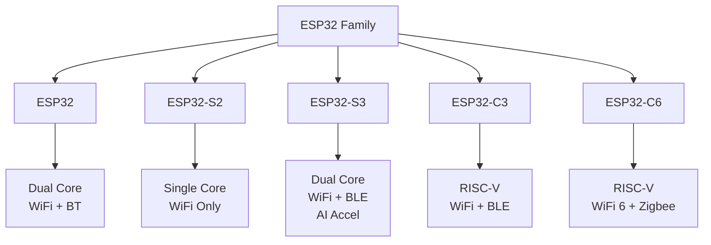
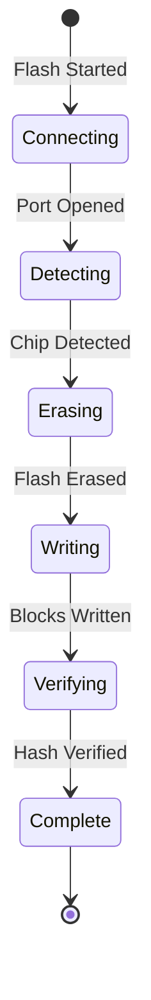
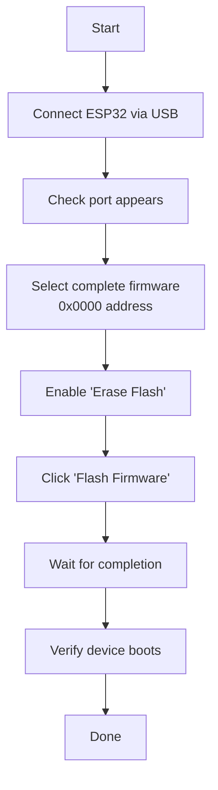
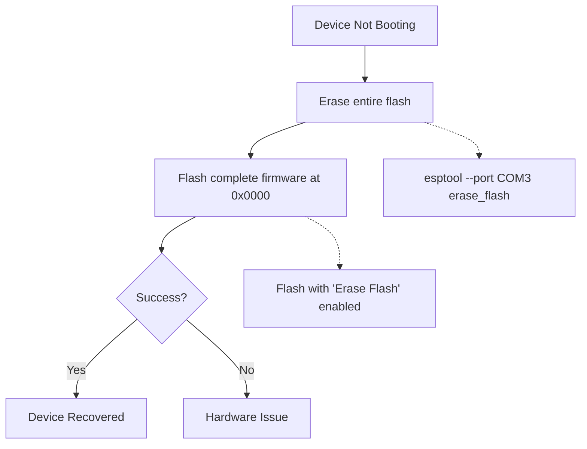

# ESP32 Flasher - User Guide

## Table of Contents
1. [Getting Started](#getting-started)
2. [Hardware Setup](#hardware-setup)
3. [Firmware Selection](#firmware-selection)
4. [Chip Detection](#chip-detection)
5. [Flashing Firmware](#flashing-firmware)
6. [Verification](#verification)
7. [Common Workflows](#common-workflows)
8. [Best Practices](#best-practices)
9. [Tips & Tricks](#tips--tricks)

---

## Getting Started

### Prerequisites

**Hardware:**
- ESP32 development board or module
- USB cable (data-capable, not charge-only)
- Computer with available USB port

**Software:**
- Nube EOL Toolkit installed
- USB-to-Serial drivers installed (CH340, CP2102, or FTDI)
- Firmware .bin file

### Driver Installation

**Check if Driver Needed:**

**Windows:**
```powershell
# Open Device Manager
devmgmt.msc

# Look under "Ports (COM & LPT)"
# If you see "USB-SERIAL CH340" or "Silicon Labs CP210x", driver is installed
# If you see "Unknown Device", driver is needed
```

**Linux:**
```bash
# Check if device detected
lsusb

# Should show something like:
# Bus 001 Device 005: ID 1a86:7523 QinHeng Electronics HL-340 USB-Serial adapter

# Check if serial device created
ls /dev/ttyUSB*
# Should show: /dev/ttyUSB0 (or similar)
```

**Driver Download:**

| Chip | Download Link | Platform |
|------|---------------|----------|
| **CH340/CH341** | [CH341SER.EXE](http://www.wch-ic.com/downloads/CH341SER_EXE.html) | Windows |
| **CP2102** | [CP210x VCP Drivers](https://www.silabs.com/developers/usb-to-uart-bridge-vcp-drivers) | All |
| **FTDI** | [FTDI VCP Drivers](https://ftdichip.com/drivers/vcp-drivers/) | All |

**Installation (Windows):**
1. Download driver for your chip
2. Run installer as Administrator
3. Follow installation wizard
4. Restart computer if prompted

**Linux Setup:**
```bash
# Add user to dialout group (required for serial port access)
sudo usermod -a -G dialout $USER

# Log out and log back in for changes to take effect

# Verify
groups
# Should include "dialout"
```

---

## Hardware Setup

### Connection Diagram

```
┌──────────────────┐         ┌────────────────────┐
│   Computer USB   │◄───────►│  ESP32 Dev Board   │
└──────────────────┘  Cable  │                    │
                              │  [ESP32 Chip]      │
                              │  [USB-Serial]      │
                              │  BOOT Button       │
                              │  RESET Button      │
                              └────────────────────┘
```

### Physical Connection Steps

**Step 1: Check USB Cable**
- Use a **data cable**, not a charge-only cable
- Data cables have 4 wires (power + data)
- Charge-only cables have 2 wires (power only)

**Test:** If the cable charges your phone but doesn't transfer data, it's charge-only.

**Step 2: Connect ESP32**
```
1. Plug USB cable into ESP32 board
2. Plug other end into computer USB port
3. Look for LED indicator on board (should light up)
4. Listen for USB connection sound (Windows)
```

**Step 3: Verify Connection**

**Windows:**
```powershell
# Check Device Manager
devmgmt.msc

# Should show new COM port under "Ports (COM & LPT)"
# Example: Silicon Labs CP210x USB to UART Bridge (COM3)
```

**Linux:**
```bash
# Watch kernel messages while plugging in
dmesg -w

# Should show:
# usb 1-1: new full-speed USB device number 5 using xhci_hcd
# usb 1-1: New USB device found, idVendor=1a86, idProduct=7523
# ch341 1-1:1.0: ch341-uart converter detected
# usb 1-1: ch341-uart converter now attached to ttyUSB0
```

### Auto-Reset Circuit

Most ESP32 dev boards have automatic download mode entry using DTR/RTS signals:

```
DTR ──┬─────────► GPIO0 (via transistor)
      │
RTS ──┴─────────► EN (via capacitor)

esptool automatically toggles DTR/RTS to:
1. Pull GPIO0 low (download mode)
2. Reset chip
→ ESP32 enters bootloader
```

**If your board doesn't have auto-reset:**

Manual entry to download mode:
```
1. Press and hold BOOT button (GPIO0)
2. Press and release RESET button
3. Release BOOT button
→ ESP32 now in download mode (ready for flashing)
```

---

## Firmware Selection

### Firmware File Format

ESP32 firmware files use the **.bin** format:

```
firmware.bin
├─ Bootloader code
├─ Partition table
├─ Application code
└─ Data (optional)
```

**Supported File Types:**
- `.bin` - Binary firmware image (most common)
- `.elf` - Executable Linkable Format (advanced)

### Selecting Firmware in Application

**Step 1: Open ESP32 Flasher Tab**

```
┌────────────────────────────────────────────┐
│ Nube EOL Toolkit                           │
├────────────────────────────────────────────┤
│ [Devices] [ESP32 Flasher] [STM32 Flasher] │
│           ^^^^^^^^^^^^^^^^                 │
└────────────────────────────────────────────┘
```

**Step 2: Click "Select Firmware" Button**

```
┌─────────────────────────────────────┐
│  ESP32 Flasher                      │
├─────────────────────────────────────┤
│  Firmware:  [Select Firmware...]   │◄── Click here
│                                     │
│  Port:      [Select Port ▼]        │
│  Baud Rate: [460800 ▼]             │
└─────────────────────────────────────┘
```

**Step 3: File Dialog Appears**

Navigate to your firmware file:
```
Common locations:
- C:\firmware\esp32\
- ~/Downloads/
- Project build folder: project/build/firmware.bin
```

**Step 4: Verify Selection**

After selecting, the filename appears:
```
┌─────────────────────────────────────┐
│  Firmware:  firmware.bin            │✓
│             (Size: 1.2 MB)          │
└─────────────────────────────────────┘
```

### Firmware Naming Conventions

Common firmware naming patterns:

| Pattern | Example | Description |
|---------|---------|-------------|
| `firmware.bin` | `firmware.bin` | Generic name |
| `<project>-<version>.bin` | `sensor-v1.2.3.bin` | Versioned firmware |
| `<device>-<date>.bin` | `esp32-20240115.bin` | Date-stamped |
| `<variant>-<hw>.bin` | `controller-esp32s3.bin` | Hardware variant |

### Where to Get Firmware

**Option 1: Pre-Built Firmware**
- Download from vendor/manufacturer
- GitHub releases
- Internal firmware repository

**Option 2: Build Your Own**

**Arduino IDE:**
```
1. Sketch → Export compiled Binary
2. Look in project folder: sketch_name.ino.esp32.bin
```

**ESP-IDF:**
```bash
cd project
idf.py build

# Firmware at:
build/firmware.bin
```

**PlatformIO:**
```bash
pio run

# Firmware at:
.pio/build/esp32dev/firmware.bin
```

---

## Chip Detection

### Automatic Detection

Before flashing, the application can automatically detect the ESP32 chip type.

**Step 1: Select Port**

```
Port: [COM3 ▼]  ◄── Select your ESP32's port
```

**Step 2: Click "Detect Chip"**

```
┌─────────────────────────────────────┐
│  [Detect Chip]                      │◄── Click
└─────────────────────────────────────┘

Status: Detecting chip...
```

**Step 3: Detection Result**

```
┌─────────────────────────────────────┐
│  Chip Type: ESP32-D0WD-V3           │✓
│  Flash Size: 4MB                    │
│  MAC Address: 24:0A:C4:XX:XX:XX     │
└─────────────────────────────────────┘
```

### Supported Chip Types



### Chip Identification Table

| Chip | Cores | WiFi | Bluetooth | Special Features |
|------|-------|------|-----------|------------------|
| **ESP32** | 2 (Xtensa) | Yes | Classic + BLE | Most common |
| **ESP32-S2** | 1 (Xtensa) | Yes | No | USB OTG |
| **ESP32-S3** | 2 (Xtensa) | Yes | BLE 5 | AI acceleration, USB OTG |
| **ESP32-C3** | 1 (RISC-V) | Yes | BLE 5 | Low cost, smaller |
| **ESP32-C6** | 1 (RISC-V) | 6 | BLE 5 | Zigbee, Thread |

### Manual Chip Identification

If automatic detection fails, identify chip by markings:

**ESP32 (Original):**
```
Marking on chip:
ESP32-D0WDQ6
      ↑
      Model variant
```

**ESP32-S3:**
```
Marking:
ESP32-S3-WROOM-1
```

**Visual Guide:**

| Board Label | Chip Type |
|-------------|-----------|
| ESP32-DevKitC | ESP32 |
| ESP32-S2-Saola | ESP32-S2 |
| ESP32-S3-DevKitC | ESP32-S3 |
| ESP32-C3-DevKitM | ESP32-C3 |

---

## Flashing Firmware

### Pre-Flash Checklist

✅ **Firmware file selected**  
✅ **Correct COM port selected**  
✅ **ESP32 connected via USB**  
✅ **Drivers installed**  
✅ **No other programs using the port** (Arduino IDE, PuTTY, etc.)

### Flash Configuration

**Baud Rate:**
```
┌──────────────────────────────────┐
│  Baud Rate: [460800 ▼]          │
│             ────────             │
│             Recommended: 460800  │
│             Fast: 921600         │
│             Safe: 115200         │
└──────────────────────────────────┘
```

**Baud Rate Guide:**

| Baud Rate | Speed | Reliability | Use Case |
|-----------|-------|-------------|----------|
| **115200** | Slow | Very High | Troubleshooting, old hardware |
| **230400** | Medium | High | Stable alternative |
| **460800** | Fast | High | **Recommended default** ⭐ |
| **921600** | Fastest | Medium | Short cables, good connection |

**Flash Address:**
```
┌──────────────────────────────────┐
│  Flash Address: [0x10000]        │
│                 ────────         │
│  Common addresses:               │
│  0x0000  - Full image            │
│  0x10000 - Application only      │
└──────────────────────────────────┘
```

**Common Flash Addresses:**

| Address | What Gets Flashed | When to Use |
|---------|-------------------|-------------|
| **0x0000** | Complete image (bootloader + app) | Full factory image |
| **0x10000** | Application only | **Standard firmware update** ⭐ |
| **0x8000** | Partition table | Changing partition scheme |
| **0x9000** | NVS data | Provisioning data |

**Erase Flash:**
```
☐ Erase flash before writing

Recommended: ✓ Checked (production)
             ☐ Unchecked (development, faster)
```

**When to Erase:**
- ✅ First-time flash
- ✅ Switching between different firmware
- ✅ Device behaving strangely
- ❌ Quick firmware updates during development

### Flashing Steps

**Step 1: Configure Settings**

```
┌─────────────────────────────────────────────┐
│  ESP32 Flasher                              │
├─────────────────────────────────────────────┤
│  Firmware:      firmware.bin (1.2 MB)      │✓
│  Port:          COM3                        │✓
│  Baud Rate:     460800                      │✓
│  Flash Address: 0x10000                     │✓
│  ☑ Erase flash before writing              │
└─────────────────────────────────────────────┘
```

**Step 2: Click "Flash Firmware"**

```
┌─────────────────────────────────────────────┐
│  [Flash Firmware]                           │◄── Click
└─────────────────────────────────────────────┘
```

**Step 3: Monitor Progress**



**Progress Display:**

```
┌─────────────────────────────────────────────┐
│  Status: Writing firmware...               │
│                                             │
│  [████████████████████░░░░░░░░] 75%        │
│                                             │
│  Stage: Writing at 0x000B0000               │
│  Chip:  ESP32-D0WD-V3                       │
└─────────────────────────────────────────────┘
```

**Stage Descriptions:**

| Stage | What's Happening | Typical Time |
|-------|------------------|--------------|
| **Connecting** | Opening serial port | 1-2s |
| **Syncing** | Communicating with bootloader | 1-3s |
| **Detecting** | Reading chip information | 1s |
| **Erasing** | Erasing old firmware (if enabled) | 5-30s |
| **Writing** | Transferring new firmware | 10-60s |
| **Verifying** | Checking flash integrity | 2-5s |
| **Resetting** | Rebooting device | 1s |

**Step 4: Flash Complete**

```
┌─────────────────────────────────────────────┐
│  ✓ Flash completed successfully!           │
│                                             │
│  [████████████████████████████] 100%       │
│                                             │
│  Time: 27 seconds                           │
│  Device reset and running application      │
└─────────────────────────────────────────────┘
```

### Canceling Flash Operation

If you need to stop flashing:

```
┌─────────────────────────────────────────────┐
│  [Cancel Flash]                             │◄── Click anytime
└─────────────────────────────────────────────┘

Status: Flash operation cancelled
```

**Note:** Canceling mid-flash may leave device in non-bootable state. You'll need to flash again.

---

## Verification

### Automatic Verification

esptool automatically verifies the flash after writing:

```
Writing at 0x000f0000... (100 %)
Wrote 1048576 bytes at 0x00010000 in 22.7 seconds
Verifying...
Hash of data verified.  ✓
```

**What Gets Verified:**
- SHA256 hash of written data
- Compared with hash of firmware file
- Ensures no corruption during transfer

### Manual Verification

**Method 1: Check Application Runs**

1. After flash completes, device resets automatically
2. Connect Serial Console (115200 baud)
3. Should see boot messages:

```
rst:0x1 (POWERON),boot:0x13 (SPI_FAST_FLASH_BOOT)
configsip: 0, SPIWP:0xee
clk_drv:0x00,q_drv:0x00,d_drv:0x00,cs0_drv:0x00,hd_drv:0x00,wp_drv:0x00
mode:DIO, clock div:2
load:0x3fff0030,len:1184
load:0x40078000,len:13232
load:0x40080400,len:3028
entry 0x400805e4
I (29) boot: ESP-IDF v4.4 2nd stage bootloader
I (29) boot: compile time 12:34:56
...
```

**Method 2: Read Flash Back**

Advanced users can read flash and compare:

```bash
# Read 1MB from address 0x10000
esptool --port COM3 read_flash 0x10000 0x100000 readback.bin

# Compare with original
# Windows PowerShell:
Get-FileHash firmware.bin
Get-FileHash readback.bin
# Hashes should match

# Linux:
sha256sum firmware.bin readback.bin
# Hashes should match
```

### Verification Failures

**If verification fails:**

```
Hash mismatch!
Expected: a1b2c3d4...
Got:      e5f6g7h8...
```

**Causes:**
1. **Bad USB cable** - Use different cable
2. **Interference** - Try lower baud rate (115200)
3. **Power issue** - Use powered USB hub
4. **Faulty flash** - Try different ESP32 board

**Fix:**
1. Lower baud rate to 115200
2. Enable "Erase flash" option
3. Flash again
4. If still fails, hardware issue (replace board)

---

## Common Workflows

### Workflow 1: First-Time Flash (Factory Programming)

**Scenario:** Brand new ESP32 from factory, needs firmware.

**Steps:**



**Configuration:**
- Firmware: `factory_image.bin`
- Address: `0x0000`
- Erase: ✅ **Yes**
- Baud: `460800`

**Expected Time:** ~60 seconds (includes erase)

---

### Workflow 2: Firmware Update (Development)

**Scenario:** Updating application code during development.

**Steps:**

```
1. Build new firmware
   → Application generates: build/firmware.bin

2. Select firmware in flasher
   → Browse to build/firmware.bin

3. Configure:
   - Address: 0x10000 (application partition)
   - Erase: ☐ No (faster, preserves NVS/WiFi settings)
   - Baud: 460800

4. Flash
   → Takes ~25 seconds

5. Device auto-resets
   → New code runs immediately
```

**Expected Time:** ~25 seconds (no erase)

**Tip:** Keep "Erase flash" unchecked during development to preserve WiFi credentials in NVS.

---

### Workflow 3: Recovery (Bricked Device)

**Scenario:** Device won't boot, stuck in bootloop, corrupted firmware.

**Symptoms:**
```
Serial console shows:
ets Jun  8 2016 00:22:57
rst:0x10 (RTCWDT_RTC_RESET),boot:0x13
...
E (1234) flash: SPIRead error
```

**Recovery Steps:**



**Configuration:**
- Firmware: `complete_factory_image.bin` (includes bootloader)
- Address: `0x0000`
- Erase: ✅ **Yes** (full erase)
- Baud: `115200` (safer for corrupted devices)

**Expected Time:** ~90 seconds (full erase + slow baud)

---

### Workflow 4: Multi-Device Production Flashing

**Scenario:** Flash 10 ESP32 boards with same firmware in factory.

**Setup:**

```
Station 1:  Station 2:  Station 3:
┌─────┐     ┌─────┐     ┌─────┐
│ESP32│     │ESP32│     │ESP32│
│ ↓   │     │ ↓   │     │ ↓   │
│ PC  │     │ PC  │     │ PC  │
└─────┘     └─────┘     └─────┘
```

**Batch Process:**

```
For each board:
1. Connect board → Wait for port detection (2s)
2. Click "Flash" → Configured with preset (25s)
3. Verify boot → Check serial output (3s)
4. Label board → Apply QR code (5s)
5. Disconnect → Move to next board (2s)

Total per board: ~37 seconds
10 boards: ~6 minutes per station
```

**Preset Configuration File:**

```json
{
  "firmware": "C:\\production\\product_v1.2.3.bin",
  "address": "0x10000",
  "baudRate": 460800,
  "eraseFlash": true,
  "verifyFlash": true
}
```

---

## Best Practices

### Hardware

✅ **Use quality USB cables**
- Data-capable (4-wire), not charge-only
- Length < 2 meters for high baud rates
- Shielded cables for noisy environments

✅ **Stable power supply**
- Some USB ports provide insufficient current
- Use powered USB hub if device keeps resetting
- Check board has stable 3.3V regulator

✅ **Avoid port switching**
- Use same USB port during production run
- Port changes may cause driver issues on Windows

### Firmware Management

✅ **Version your firmware**
```
firmware_v1.2.3_20240115.bin
         ↑      ↑
         |      └─ Date
         └──────── Version
```

✅ **Keep checksums**
```
firmware.bin          → Your firmware
firmware.bin.sha256   → Hash for verification
```

✅ **Test firmware before production**
- Flash test board first
- Verify all features work
- Document any configuration needed

### Flash Settings

✅ **Use recommended defaults**
| Setting | Value | Reason |
|---------|-------|--------|
| Baud Rate | 460800 | Fast and reliable |
| Flash Mode | DIO | Best compatibility |
| Flash Frequency | 40 MHz | Standard safe frequency |
| Erase Flash | Yes (production) | Clean state |

✅ **Document custom addresses**
If using non-standard addresses:
```
0x10000 → Main application
0x210000 → OTA partition
0x310000 → SPIFFS filesystem
```

### Troubleshooting Prevention

✅ **Close conflicting software**
Before flashing:
- Arduino IDE Serial Monitor
- PuTTY / TeraTerm
- Other instances of this application

✅ **Check port before each flash**
```
Port may change if:
- Device unplugged/replugged
- USB hub reassigned port
- Multiple devices connected
```

---

## Tips & Tricks

### Tip 1: Identify ESP32 Port Quickly

**Windows:**
```powershell
# Before plugging ESP32
mode

# After plugging ESP32
mode

# Compare output - new port is your ESP32
```

**Linux:**
```bash
# Watch for new device
dmesg -w

# Plug in ESP32, you'll see:
# usb 1-1: ch341-uart converter now attached to ttyUSB0
#                                              ^^^^^^^^
```

### Tip 2: Faster Development Flashing

During development, skip erase to save time:

```
☐ Erase flash before writing  ← Uncheck

Saves ~10 seconds per flash!
```

**Note:** Erase occasionally if device behaves strangely.

### Tip 3: Serial Console After Flash

After flashing, immediately connect Serial Console to see boot logs:

```
1. Flash completes → Device resets
2. Switch to "Serial Console" tab
3. Select same port → Click Connect → Baud 115200
4. Press RESET button on ESP32
5. See boot messages
```

### Tip 4: Keep Firmware Organized

```
project/
  firmware/
    production/
      product_v1.0.0.bin
      product_v1.1.0.bin
      product_v1.2.0.bin  ← Current production
    development/
      dev_build_latest.bin
      dev_build_20240115.bin
    bootloader/
      bootloader_v1.bin
```

### Tip 5: Batch Flash with Scripts

For production, automate with CLI:

```bash
# Windows PowerShell script
$firmware = "C:\firmware\product.bin"
$ports = @("COM3", "COM4", "COM5")

foreach ($port in $ports) {
    Write-Host "Flashing $port..."
    esptool --port $port --baud 460800 write_flash 0x10000 $firmware
}
```

### Tip 6: Verify Flash Size Matches

If firmware is too large:
```
Error: Firmware size (5 MB) exceeds flash size (4 MB)
```

**Fix:**
- Use smaller firmware (reduce features, compress)
- Or use ESP32 module with larger flash (8 MB, 16 MB)

### Tip 7: ROM Bootloader Messages

At 115200 baud during reset, you'll see garbage characters:
```
��r�~�b|�b�b��bnn�lnn�og�b
```

This is **normal** - ROM bootloader outputs at 74880 baud (non-standard).

### Tip 8: Hold BOOT Button if Auto-Reset Fails

If flashing times out with "Connecting...", manually enter bootloader:

```
1. Press and hold BOOT button
2. Click "Flash Firmware"
3. When you see "Connecting...", press and release RESET
4. Release BOOT button
5. Flash should proceed
```

---

## Summary

This user guide covered:

✅ **Getting Started** - Driver installation and prerequisites  
✅ **Hardware Setup** - Physical connection and verification  
✅ **Firmware Selection** - Choosing and loading .bin files  
✅ **Chip Detection** - Identifying ESP32 variants  
✅ **Flashing Firmware** - Step-by-step flash procedure  
✅ **Verification** - Ensuring successful flash  
✅ **Common Workflows** - Factory flash, updates, recovery, production  
✅ **Best Practices** - Hardware, firmware, and flash settings  
✅ **Tips & Tricks** - Efficiency and troubleshooting tips  

**Quick Reference Card:**

```
┌────────────────────────────────────────────┐
│  ESP32 Flasher Quick Reference             │
├────────────────────────────────────────────┤
│  Baud Rate:     460800 (default)           │
│  Address:       0x10000 (application)      │
│  Erase:         Yes (production)           │
│                 No (development)           │
│  Flash Time:    ~25s (no erase)            │
│                 ~40s (with erase)          │
│  COM Port:      Check Device Manager       │
│  Linux Port:    /dev/ttyUSB0               │
│  Manual Boot:   Hold BOOT + press RESET    │
└────────────────────────────────────────────┘
```

**Need Help?**  
See [Troubleshooting.md](Troubleshooting.md) for common issues and solutions.
