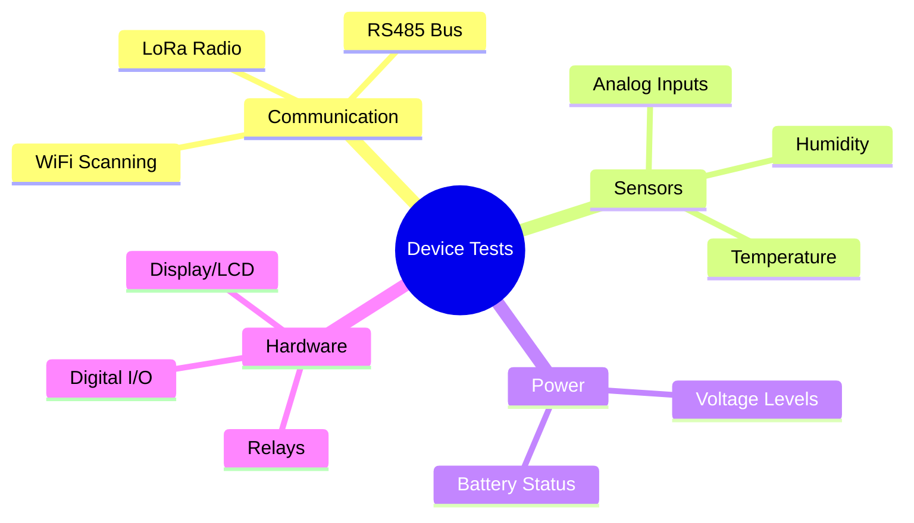
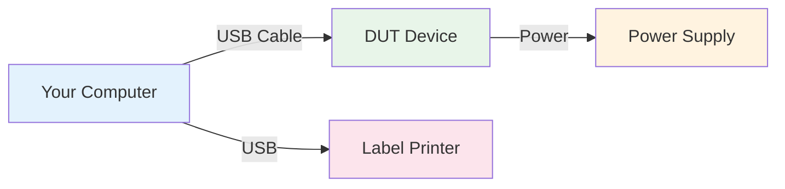
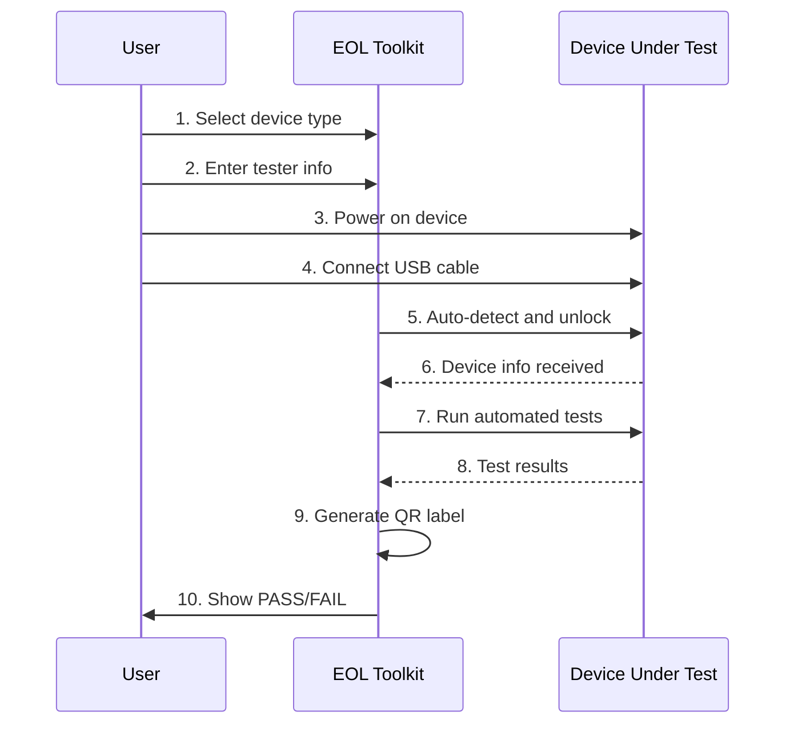
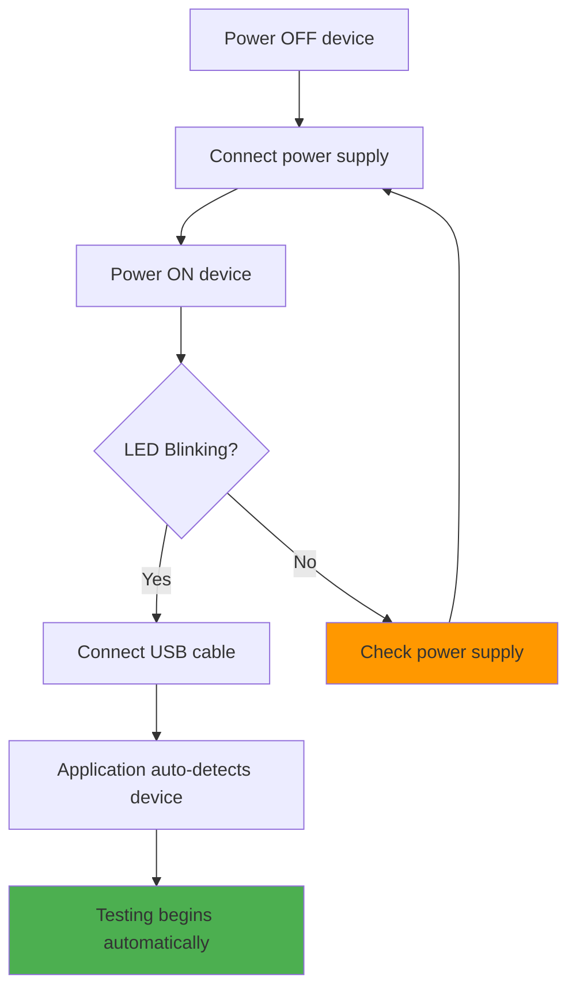
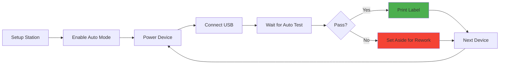
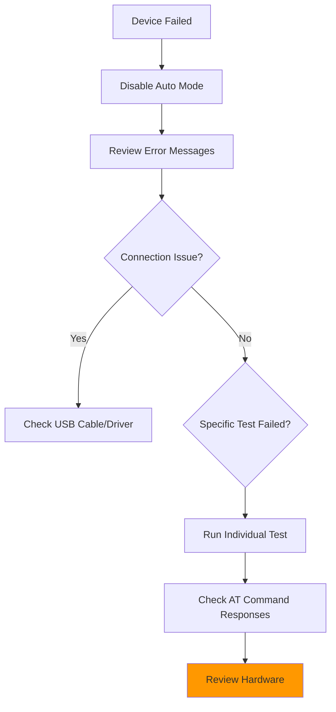

# Factory Testing - Getting Started Guide

## Welcome! 👋

This guide will help you understand and use the Factory Testing feature, whether you're a complete beginner or an experienced test operator.

---

## Table of Contents
1. [What is Factory Testing?](#what-is-factory-testing)
2. [Before You Begin](#before-you-begin)
3. [First-Time Setup](#first-time-setup)
4. [Your First Test](#your-first-test)
5. [Understanding the Interface](#understanding-the-interface)
6. [Common Workflows](#common-workflows)
7. [Next Steps](#next-steps)

---

## What is Factory Testing?

**Factory Testing** is an automated system that validates NubeIO hardware devices before they leave the factory. Think of it as a "health check" that ensures every device works correctly.

### Why Do We Need This?

- ✅ **Quality Assurance** - Catch defective hardware before shipping
- ✅ **Consistency** - Every device tested the same way
- ✅ **Documentation** - Generate labels and records for each device
- ✅ **Efficiency** - Automated tests save time vs manual checking

### What Gets Tested?



---

## Before You Begin

### Prerequisites Checklist

```
Hardware Required:
☐ Device Under Test (DUT) - The device you want to test
☐ USB-to-Serial cable (if not built into device)
☐ Power supply for DUT
☐ Brother PT-P900W label printer (optional, for printing labels)

Software Required:
☐ NubeIO EOL Toolkit installed
☐ USB drivers installed (typically CH340 or CP2102)
☐ Windows 10/11 or Linux

Knowledge Required:
☐ Basic computer skills
☐ Understanding of USB port connections
☐ Ability to follow step-by-step instructions
```

### Understanding the Hardware Setup



**Important:** Always power the DUT device BEFORE connecting USB cable to computer.

---

## First-Time Setup

### Step 1: Install USB Drivers

Most devices use CH340 or CP2102 USB-to-serial chips.

**Windows:**
1. Download driver from manufacturer website
2. Run installer
3. Restart computer
4. Verify in Device Manager → Ports (COM & LPT)

**Linux:**
```bash
# CH340 driver is usually built-in
# Verify with:
lsusb | grep -i "CH340\|CP210"

# Add user to dialout group for serial access
sudo usermod -a -G dialout $USER
sudo reboot
```

### Step 2: Connect Label Printer (Optional)

1. Connect Brother PT-P900W via USB
2. Install printer driver from Brother website
3. Load label tape (12mm or 18mm width recommended)
4. Power on printer

### Step 3: Launch Application

1. Open NubeIO EOL Toolkit
2. Navigate to **Factory Testing** tab
3. You should see the interface:

```
┌─────────────────────────────────────────────────┐
│  Factory Testing                                │
├─────────────────────────────────────────────────┤
│  Generation:  [ Gen-2 ▼ ]                      │
│  Device Type: [ Select Device ▼ ]              │
│  Auto Mode:   [✓] Enabled                      │
└─────────────────────────────────────────────────┘
```

---

## Your First Test

Let's walk through testing a device step-by-step.

### Test Flow Overview



### Step-by-Step Instructions

#### 1. Select Your Device

```
Generation: Gen-2
Device Type: ACB-M (Air Conditioning Bridge Master)
```

**Available Devices:**
- **Gen-1:** Micro Edge
- **Gen-2:** ACB-M, ZC-LCD, ZC-Controller, Droplet

#### 2. Enter Pre-Test Information

```
┌─────────────────────────────────────┐
│ Tester Name:     [John Smith    ]  │
│ Hardware Version:[2.1           ]  │
│ Batch ID:        [BATCH-2024-001]  │
│ Work Order:      [WO-12345      ]  │
└─────────────────────────────────────┘
```

**What these fields mean:**
- **Tester Name** - Your name (for tracking who tested the device)
- **Hardware Version** - PCB version (check label on device)
- **Batch ID** - Production batch identifier
- **Work Order** - Manufacturing work order number

#### 3. Enable Auto Mode (Recommended)

```
[✓] Auto Mode
```

When enabled:
- Automatically detects when device is connected
- Starts testing immediately
- Streamlined for production line use

#### 4. Connect the Device



**Critical:** Always power the device BEFORE connecting USB!

#### 5. Watch Automated Tests Run

The application will automatically:
```
Testing ACB-M Device...

✓ Connection established (COM3)
✓ Unlock command sent
✓ Reading device info...
  - MAC: 24:6F:28:XX:XX:XX
  - Firmware: v1.2.3
  - Board: ACB-M-v2.1

Running Tests:
[████████░░] 80% - Testing RS485-2...

WiFi Test:      ✓ PASS (5 networks, RSSI -45dBm)
RS485-1 Test:   ✓ PASS (Loopback OK)
RS485-2 Test:   ⟳ Running...
Power Test:     ⏳ Pending
```

#### 6. Review Results

```
═══════════════════════════════════════
        TEST RESULTS - ACB-M
═══════════════════════════════════════
Device ID: 24:6F:28:XX:XX:XX
Firmware:  v1.2.3
Hardware:  ACB-M-v2.1
Tester:    John Smith
Date:      2024-12-09 14:32:10
───────────────────────────────────────
WiFi Test:      ✓ PASS
RS485-1 Test:   ✓ PASS
RS485-2 Test:   ✓ PASS
Power Test:     ✓ PASS
───────────────────────────────────────
Overall Status: ✓✓✓ PASS ✓✓✓
═══════════════════════════════════════

[Print Label] [Save Results] [Test Another]
```

#### 7. Print Label

Click **[Print Label]** to generate QR code label:

```
┌─────────────────────────────┐
│  NUBE IO ACB-M             │
│  ┌─────────────────────┐   │
│  │  ▄▄▄▄▄▄▄ ▄ ▄▄▄▄▄▄▄ │   │
│  │  █ ▄▄▄ █ ▄ █ ▄▄▄ █ │   │
│  │  █ ███ █ ▄ █ ███ █ │   │ QR Code
│  │  █▄▄▄▄▄█ ▄ █▄▄▄▄▄█ │   │
│  │  ▄▄▄▄ ▄▄▄▄▄▄ ▄ ▄▄▄ │   │
│  └─────────────────────┘   │
│  MAC: 24:6F:28:XX:XX:XX    │
│  FW: v1.2.3  HW: v2.1      │
│  PASS ✓  2024-12-09        │
└─────────────────────────────┘
```

Stick label on device enclosure.

---

## Understanding the Interface

### Main Interface Layout

```
┌──────────────────────────────────────────────────────────────┐
│  Factory Testing                                    [Help] [?]│
├──────────────────────────────────────────────────────────────┤
│  ┌─────────────────┐  ┌───────────────────────────────────┐ │
│  │ Device Selection│  │  Pre-Test Information             │ │
│  │                 │  │  Tester: _______________          │ │
│  │ Generation:     │  │  HW Ver: _______________          │ │
│  │ [Gen-2 ▼]      │  │  Batch:  _______________          │ │
│  │                 │  │  WO:     _______________          │ │
│  │ Device Type:    │  │                                    │ │
│  │ [ACB-M ▼]      │  │  [✓] Auto Mode                    │ │
│  │                 │  │                                    │ │
│  └─────────────────┘  └───────────────────────────────────┘ │
├──────────────────────────────────────────────────────────────┤
│  Test Progress                                               │
│  ════════════════════════════════════════════════            │
│  [████████████████████░░░░░░░░] 75%                         │
│                                                              │
│  Current Test: RS485 Communication                           │
│  Status: Testing loopback...                                 │
├──────────────────────────────────────────────────────────────┤
│  Test Results                                                │
│  ☑ WiFi Test         PASS  Networks: 5, RSSI: -45 dBm      │
│  ☑ RS485-1 Test      PASS  Loopback OK, Rate: 9600         │
│  ☐ RS485-2 Test      ...   Testing...                       │
│  ☐ Power Test        ...   Pending                          │
├──────────────────────────────────────────────────────────────┤
│  [Start Test] [Stop] [Print Label] [Save Results]           │
└──────────────────────────────────────────────────────────────┘
```

### Status Indicators

| Icon | Meaning |
|------|---------|
| ☐ | Test not started |
| ⟳ | Test in progress |
| ✓ | Test passed |
| ✗ | Test failed |
| ⚠ | Test warning |

### Color Coding

- 🟢 **Green** - All good, tests passed
- 🟡 **Yellow** - Warning, check results
- 🔴 **Red** - Failed, device defective
- 🔵 **Blue** - Info, test running

---

## Common Workflows

### Workflow 1: Production Line Testing

**Goal:** Test devices quickly and efficiently on production line



**Tips:**
- Keep auto mode enabled
- Pre-fill tester name and batch ID
- Have extra label tape ready
- Mark failed devices clearly

### Workflow 2: Debugging Failed Device

**Goal:** Understand why a device failed testing



**Steps:**
1. Disable auto mode
2. Check console logs for errors
3. Run tests individually
4. Compare with known-good device
5. Check hardware connections

### Workflow 3: New Device Type Setup

**Goal:** Configure testing for a new device variant

1. Read device-specific documentation
2. Understand required tests
3. Verify AT command responses
4. Run sample tests
5. Document any issues
6. Update procedures if needed

---

## Next Steps

### For Test Operators

✅ **You're Ready!** You now know how to:
- Set up the testing station
- Connect and test devices
- Interpret results
- Print labels

**Continue Learning:**
- Read device-specific test cases
- Practice with different device types
- Learn troubleshooting techniques

**Recommended Reading:**
- [ACB-M Test Cases](./gen-2/acb-m/ACBM-TestCases.md)
- [ZC-LCD Test Cases](./gen-2/zc-lcd/ZCLCD-TestCases.md)
- [Troubleshooting Guide](./gen-2/acb-m/ACBM-Troubleshooting.md)

### For Developers

**Continue Learning:**
- [System Overview](./FactoryTesting-Overview.md) - Architecture
- [Source Code Guide](./FactoryTesting-SourceCode.md) - Implementation
- Device-specific sequence diagrams

### For Quality Assurance

**Focus Areas:**
- Test coverage and validation
- Pass/fail criteria
- Result documentation
- Process improvements

---

## Quick Reference Card

### Essential Commands

| Action | Method |
|--------|--------|
| Start test | Click "Start Test" or enable Auto Mode |
| Stop test | Click "Stop" button |
| View logs | Check console output in app |
| Print label | Click "Print Label" after pass |
| Save results | Click "Save Results" |

### Keyboard Shortcuts

| Key | Action |
|-----|--------|
| `Ctrl+T` | Start test |
| `Ctrl+S` | Save results |
| `Ctrl+P` | Print label |
| `Esc` | Stop current test |
| `F5` | Refresh device list |

### Common Error Messages

| Error | Meaning | Solution |
|-------|---------|----------|
| "Port not found" | USB not connected | Check cable, check drivers |
| "Unlock failed" | Wrong unlock code | Verify device type selected |
| "Timeout" | Device not responding | Check power, reset device |
| "Test failed" | Hardware issue | Review test details, check hardware |

---

## Tips for Success

### Do's ✅

- ✅ Always power device before connecting USB
- ✅ Use auto mode for production testing
- ✅ Keep drivers up to date
- ✅ Print labels immediately after pass
- ✅ Document any unusual failures
- ✅ Keep workspace organized

### Don'ts ❌

- ❌ Don't hot-plug USB without power
- ❌ Don't skip pre-test information
- ❌ Don't test devices with visible damage
- ❌ Don't interrupt tests mid-execution
- ❌ Don't reuse failed device labels
- ❌ Don't test without proper setup

---

## Getting Help

### If Something Goes Wrong

1. **Check this guide first** - Most common issues covered here
2. **Read device-specific troubleshooting** - Device-specific solutions
3. **Check console logs** - Technical error details
4. **Ask experienced operator** - Learn from others
5. **Report persistent issues** - Help improve the system

### Support Resources

- 📖 **Documentation:** See README.md for full documentation tree
- 🔧 **Troubleshooting:** Device-specific troubleshooting guides
- 💬 **GitHub Issues:** Report bugs and feature requests
- 📧 **Email:** info@nube-io.com

---

## Glossary

| Term | Definition |
|------|------------|
| **DUT** | Device Under Test - the hardware being tested |
| **EOL** | End of Line - final testing before shipping |
| **AT Command** | Text-based commands for device communication |
| **COM Port** | Serial communication port (e.g., COM3) |
| **UART** | Universal Asynchronous Receiver-Transmitter |
| **RS485** | Serial communication standard |
| **QR Code** | 2D barcode for device identification |
| **Loopback** | Test where signal is sent and received back |
| **RSSI** | Received Signal Strength Indicator (WiFi) |
| **Firmware** | Software running on the device |
| **MAC Address** | Unique hardware network identifier |

---

## Conclusion

Congratulations! 🎉 You've completed the Getting Started guide.

You now understand:
- ✅ What factory testing is and why it's important
- ✅ How to set up your testing station
- ✅ How to run your first test
- ✅ How to interpret results
- ✅ Common workflows for different scenarios

**Remember:** Practice makes perfect. The more devices you test, the faster and more confident you'll become.

**Next Steps:**
1. Set up your testing station
2. Run a few practice tests
3. Read device-specific guides
4. Start production testing!

---

## Document Information

- **Target Audience:** Complete beginners to factory testing
- **Reading Time:** 20-30 minutes
- **Prerequisites:** Basic computer skills
- **Last Updated:** December 9, 2025
- **Version:** 1.0.0

**Happy Testing! 🚀**
