# Factory Testing - System Overview

## Table of Contents
1. [Introduction](#introduction)
2. [System Architecture](#system-architecture)
3. [Technology Stack](#technology-stack)
4. [Communication Protocol](#communication-protocol)
5. [Testing Workflow](#testing-workflow)
6. [Data Flow](#data-flow)
7. [Hardware Integration](#hardware-integration)
8. [Software Components](#software-components)
9. [Performance Metrics](#performance-metrics)
10. [Security Considerations](#security-considerations)

---

## Introduction

The **Factory Testing** system is an Electron-based desktop application designed for automated End-of-Line (EOL) testing of NubeIO hardware devices. It provides comprehensive hardware validation through serial communication and AT command protocols.

### System Purpose

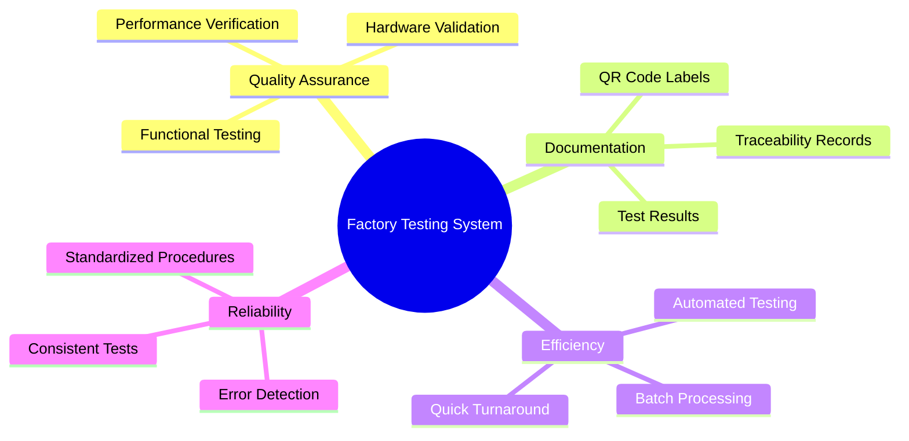

### Key Objectives

1. **Automate Testing** - Replace manual verification with automated test sequences
2. **Ensure Quality** - Detect defective hardware before shipping
3. **Generate Documentation** - Create test records and device labels
4. **Improve Efficiency** - Reduce testing time from minutes to seconds
5. **Maintain Standards** - Apply consistent test criteria across all devices

---

## System Architecture

### High-Level Architecture

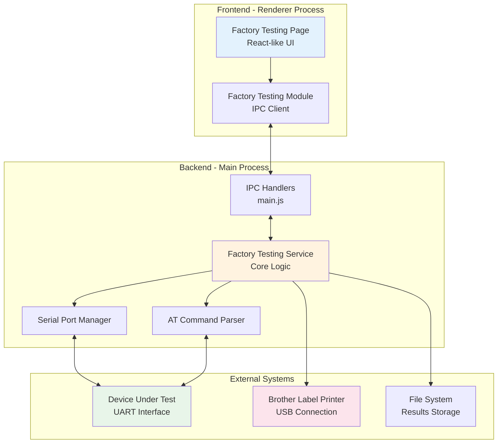

### Component Layers

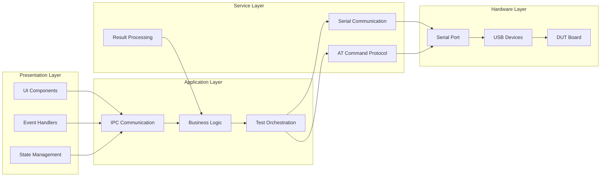

---

## Technology Stack

### Core Technologies

| Component | Technology | Version | Purpose |
|-----------|------------|---------|---------|
| **Application Framework** | Electron | 28.0.0 | Desktop app container |
| **Frontend** | Vanilla JavaScript | ES6+ | User interface |
| **Backend Runtime** | Node.js | 20.x | Main process execution |
| **Serial Communication** | serialport | 12.0.0 | UART/USB serial access |
| **Data Parsing** | @serialport/parser-readline | 12.0.0 | AT response parsing |
| **Label Printing** | Python 3.13 | 3.13.1 | Brother printer interface |
| **Barcode Generation** | brother_ql | Latest | QR code generation |

### Architecture Pattern

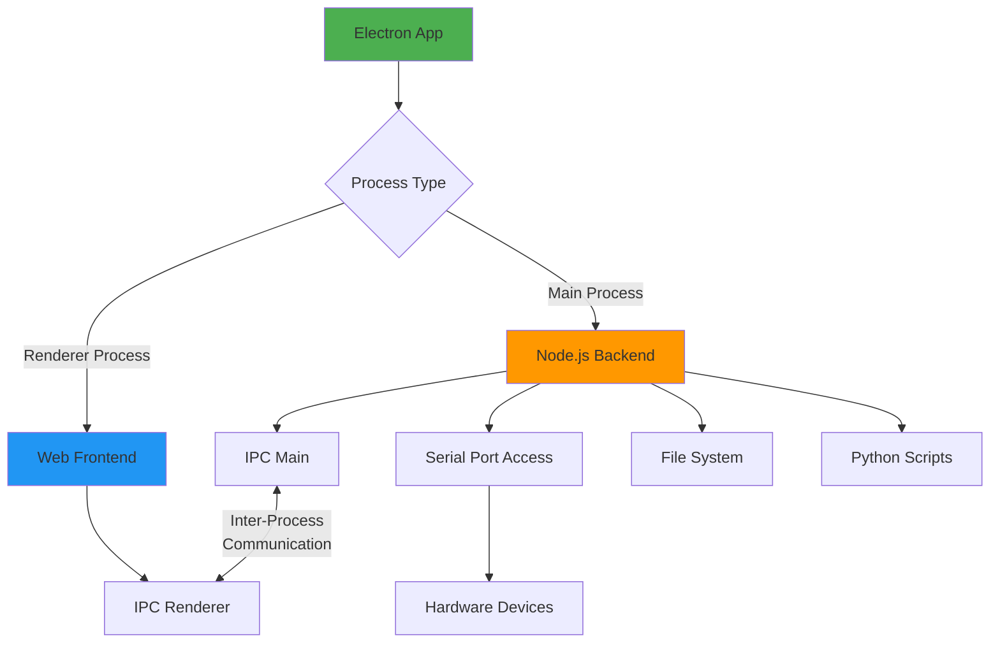

**Multi-Process Architecture:**
- **Main Process** - Backend logic, hardware access, IPC handlers
- **Renderer Process** - UI rendering, user interactions, display
- **IPC Bridge** - Async message passing between processes

---

## Communication Protocol

### AT Command Protocol

**Command Format:**
```
AT+COMMAND=PARAMETER\r\n
```

**Response Format:**
```
+PREFIX:DATA\r\n
OK\r\n

OR

ERROR\r\n
```

### Command Flow Sequence

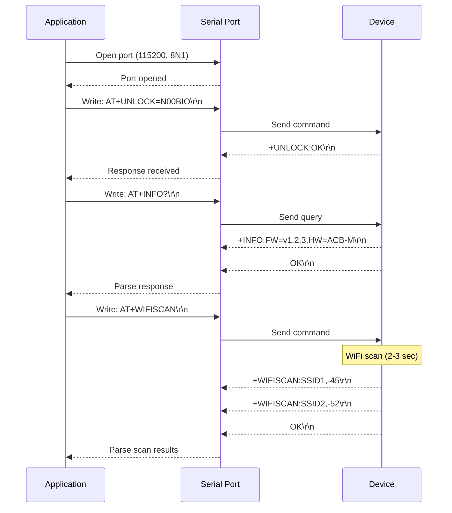

### Command Categories

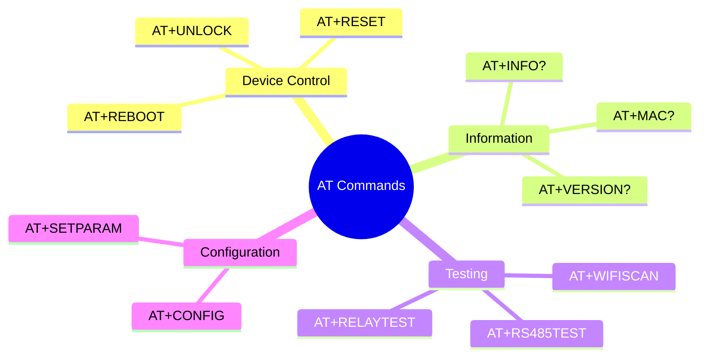

### Protocol Specification

**Serial Port Configuration:**
```javascript
{
    baudRate: 115200,
    dataBits: 8,
    stopBits: 1,
    parity: 'none',
    flowControl: false,
    delimiter: '\n'
}
```

**Timeout Handling:**
- Command timeout: 10 seconds
- WiFi scan timeout: 15 seconds
- RS485 test timeout: 5 seconds
- Connection timeout: 3 seconds

---

## Testing Workflow

### Complete Test Sequence

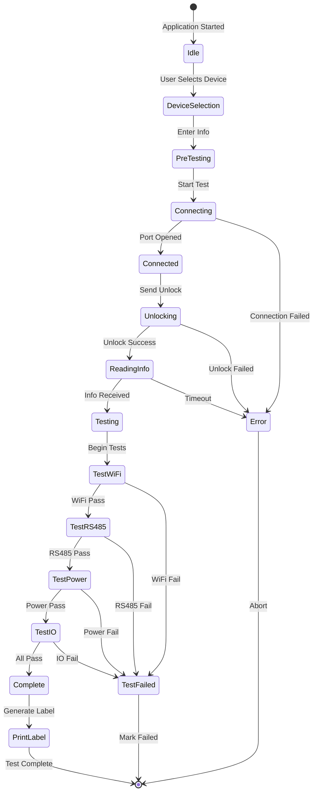

### Test Execution Flow

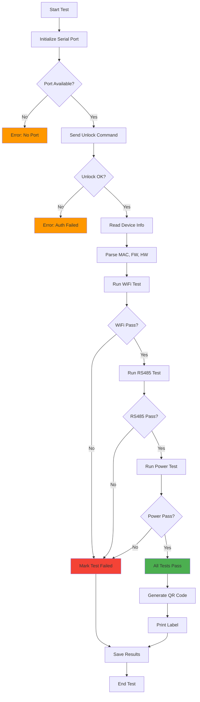

---

## Data Flow

### Information Flow Diagram

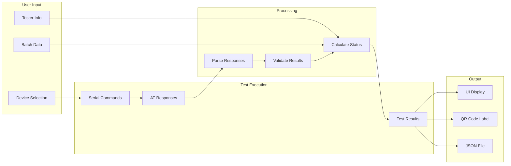

### Result Data Structure

```javascript
{
    "deviceInfo": {
        "type": "ACB-M",
        "generation": "Gen-2",
        "macAddress": "24:6F:28:XX:XX:XX",
        "firmware": "v1.2.3",
        "hardware": "ACB-M-v2.1"
    },
    "testSession": {
        "tester": "John Smith",
        "timestamp": "2024-12-09T14:32:10.123Z",
        "batchId": "BATCH-2024-001",
        "workOrder": "WO-12345"
    },
    "testResults": {
        "wifi": {
            "status": "PASS",
            "networks": 5,
            "rssi": -45,
            "duration": 3.2
        },
        "rs485_1": {
            "status": "PASS",
            "loopback": true,
            "baudRate": 9600
        },
        "rs485_2": {
            "status": "PASS",
            "loopback": true,
            "baudRate": 9600
        },
        "power": {
            "status": "PASS",
            "vcc": 3.31,
            "battery": 4.18
        }
    },
    "overallStatus": "PASS",
    "duration": 12.5
}
```

---

## Hardware Integration

### Device Connection Topology

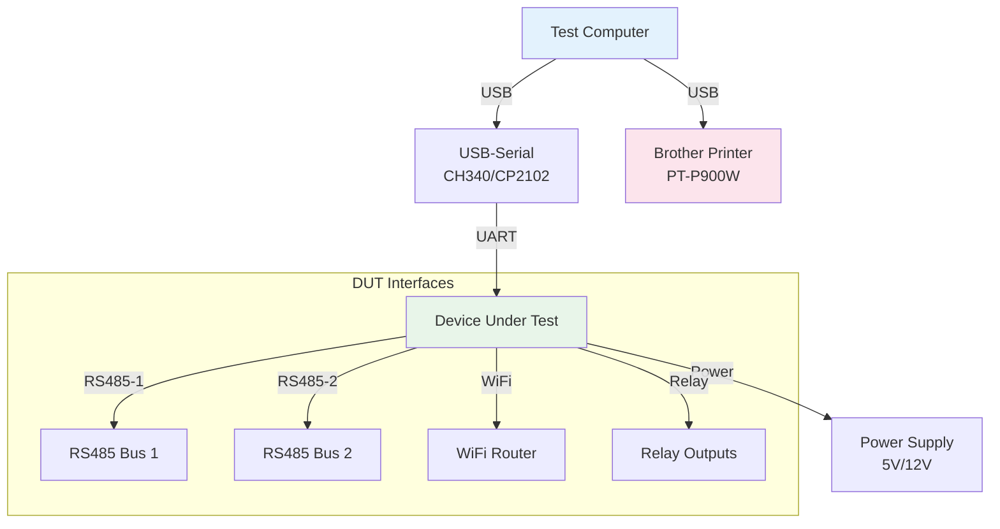

### Serial Port Detection

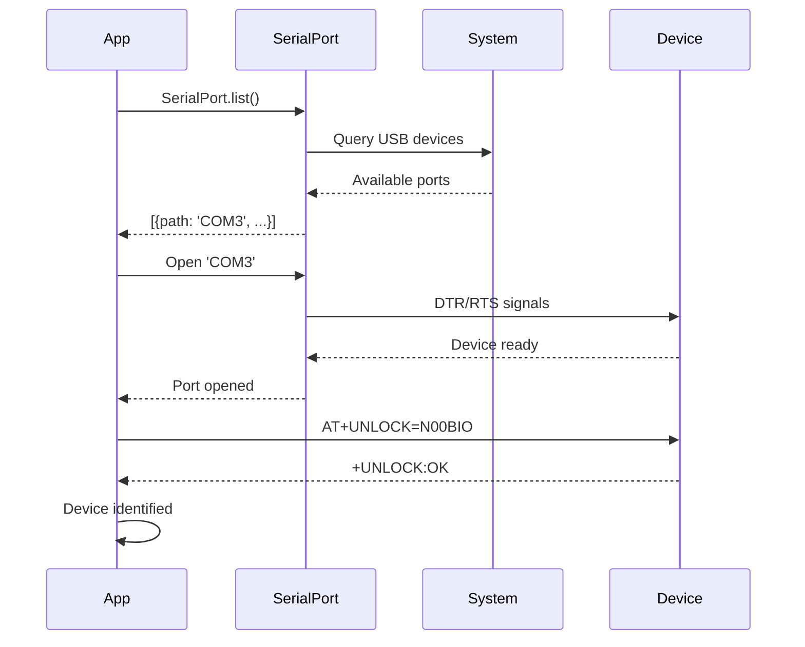

---

## Software Components

### Component Hierarchy

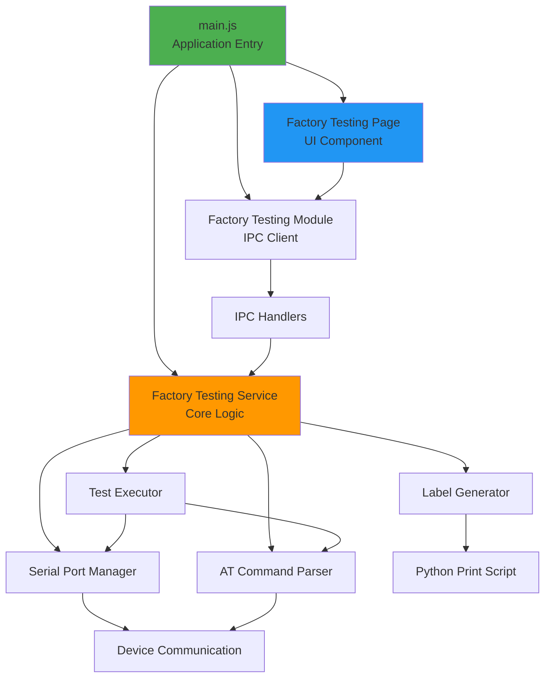

### Module Responsibilities

| Module | File | Responsibility |
|--------|------|----------------|
| **UI Page** | FactoryTestingPage.js | User interface, device selection, results display |
| **IPC Module** | FactoryTestingModule.js | Bridge between renderer and main process |
| **IPC Handlers** | main.js | Register handlers for factory testing commands |
| **Core Service** | factory-testing.js | Test orchestration, serial communication |
| **Serial Manager** | Built into service | Port management, data transmission |
| **AT Parser** | Built into service | Parse command responses, extract data |
| **Label Generator** | print_product_label.py | Generate and print QR code labels |

---

## Performance Metrics

### Timing Requirements

```mermaid
gantt
    title Typical Test Duration (ACB-M)
    dateFormat ss
    axisFormat %S sec
    
    section Connection
    Port Detection     :a1, 00, 1s
    Unlock Command     :a2, after a1, 1s
    Read Device Info   :a3, after a2, 1s
    
    section Tests
    WiFi Scan          :b1, after a3, 3s
    RS485-1 Test       :b2, after b1, 2s
    RS485-2 Test       :b3, after b2, 2s
    Power Test         :b4, after b3, 1s
    
    section Output
    Generate Label     :c1, after b4, 1s
    Print Label        :c2, after c1, 2s
```

**Performance Targets:**
- Connection: < 3 seconds
- Individual test: < 5 seconds
- Complete test suite: < 15 seconds
- Label printing: < 5 seconds
- **Total time per device: ~20 seconds**

### Resource Utilization

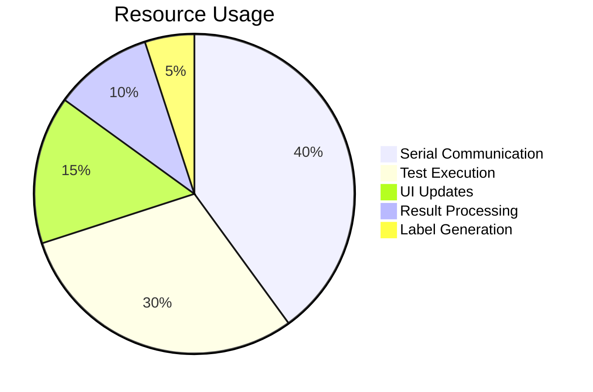

---

## Security Considerations

### Access Control

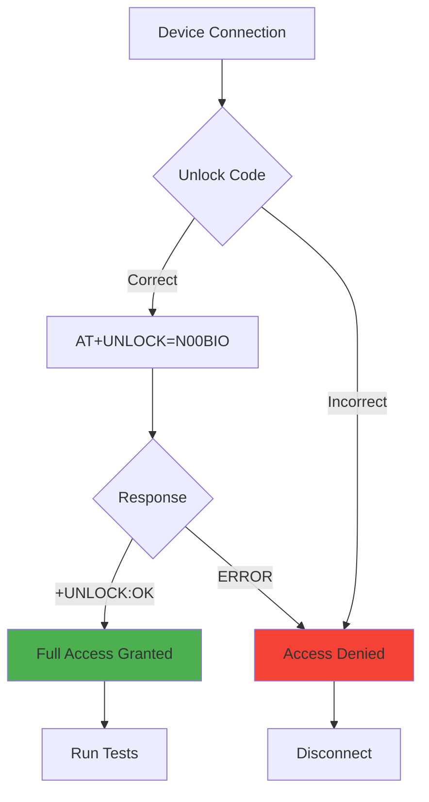

### Data Protection

- **Unlock Code Required** - Devices require unlock command before testing
- **Local Storage Only** - Test results saved locally, no cloud upload
- **Serial Port Access** - Requires user permissions on some OS
- **Limited Commands** - Only specific AT commands allowed

---

## Summary

### System Characteristics

| Aspect | Description |
|--------|-------------|
| **Architecture** | Multi-process Electron application |
| **Communication** | Serial UART with AT command protocol |
| **Testing Approach** | Automated sequential test execution |
| **User Interface** | Web-based UI in renderer process |
| **Hardware Support** | Gen-1 and Gen-2 NubeIO devices |
| **Performance** | ~20 seconds per device complete test |
| **Extensibility** | Modular design for new device types |

### Key Features

✅ Automated device detection and connection  
✅ Sequential test execution with timeout protection  
✅ Real-time progress updates in UI  
✅ QR code label generation and printing  
✅ JSON-based result storage  
✅ Support for multiple device generations  
✅ Error handling and recovery  

---

## Next Steps

For detailed implementation information:
- **Source Code:** [FactoryTesting-SourceCode.md](./FactoryTesting-SourceCode.md)
- **Getting Started:** [FactoryTesting-GettingStarted.md](./FactoryTesting-GettingStarted.md)
- **Device-Specific:** See gen-1/ and gen-2/ folders

---

## Document Information

- **Target Audience:** Developers, architects, technical staff
- **Technical Level:** Intermediate to advanced
- **Prerequisites:** Understanding of Electron, serial communication
- **Last Updated:** December 9, 2025
- **Version:** 1.0.0
