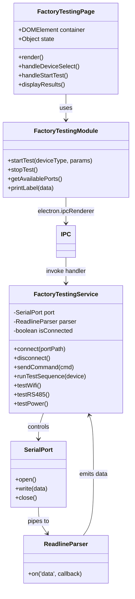
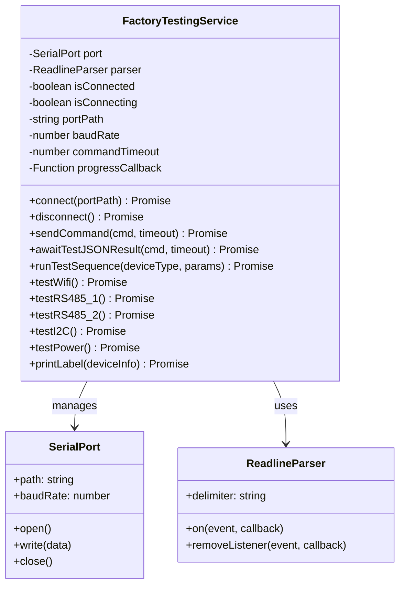
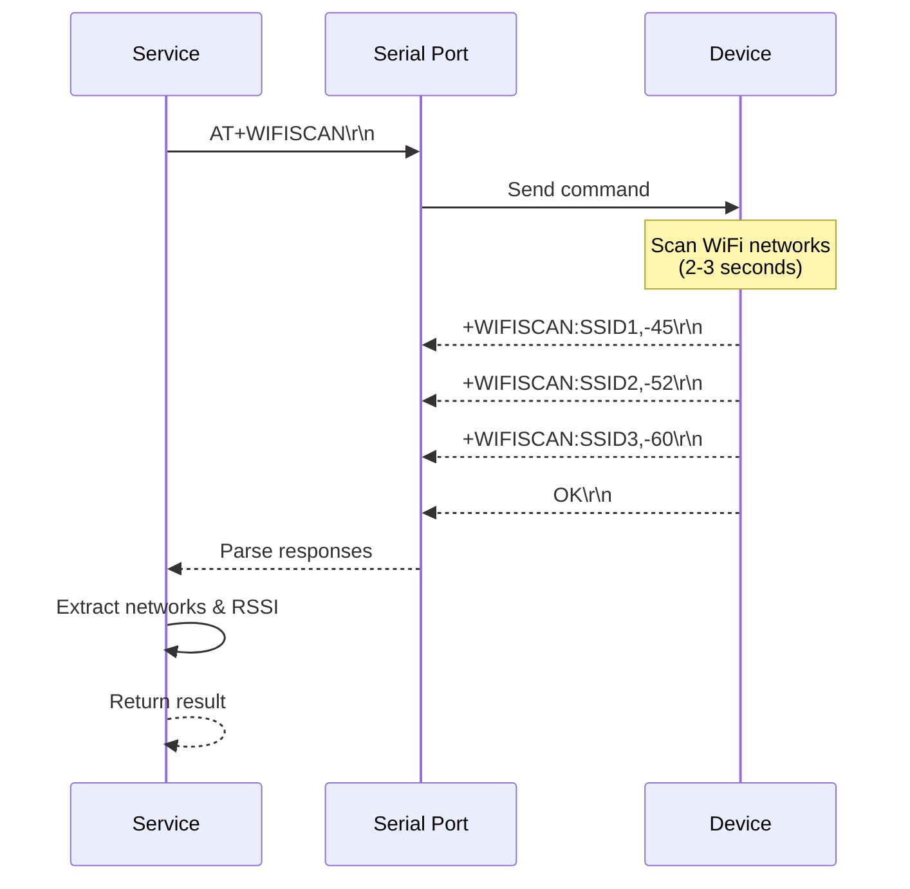
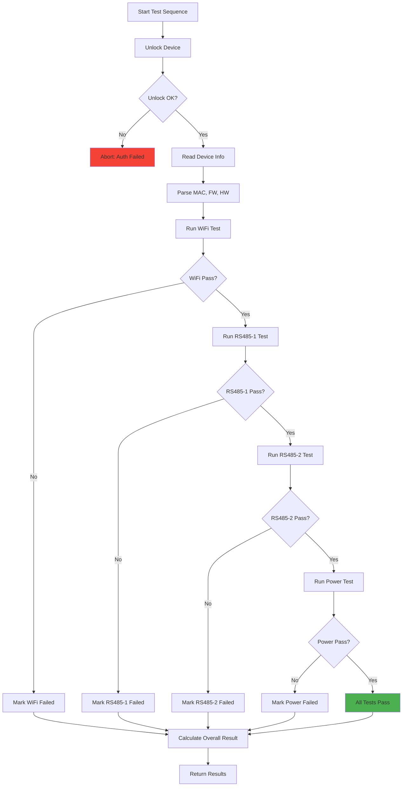
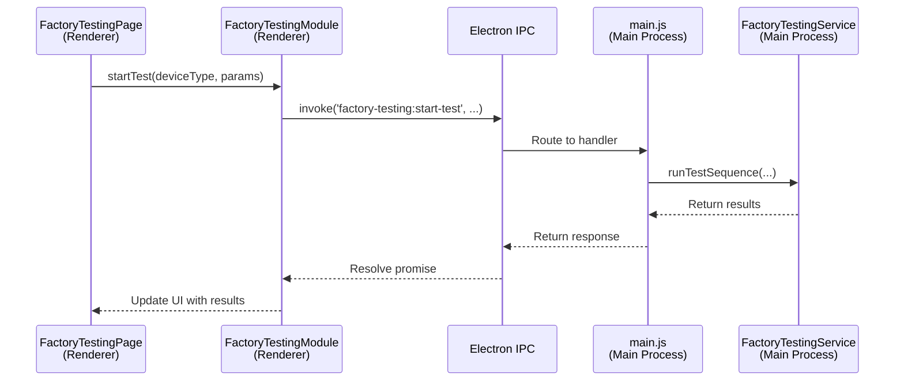

# Factory Testing - Source Code Documentation

## Table of Contents
1. [Code Architecture](#code-architecture)
2. [File Structure](#file-structure)
3. [Core Classes](#core-classes)
4. [Key Methods](#key-methods)
5. [AT Command Protocol](#at-command-protocol)
6. [Test Implementations](#test-implementations)
7. [IPC Communication](#ipc-communication)
8. [Code Examples](#code-examples)
9. [Extension Guide](#extension-guide)
10. [Testing & Debugging](#testing--debugging)

---

## Code Architecture

### Component Relationship Diagram



---

## File Structure

### Project Layout

```
services/
├── factory-testing.js          ⭐ Core testing service (2300+ lines)
├── mqtt-service.js
├── openocd-stm32.js
└── README.md

renderer/
├── pages/
│   └── FactoryTestingPage.js   ⭐ UI component (800+ lines)
├── modules/
│   └── FactoryTestingModule.js ⭐ IPC client (300+ lines)
└── app.js

embedded/
└── printer-scripts/
    └── print_product_label.py  ⭐ Label printing (200+ lines)

main.js                          ⭐ IPC handlers (50+ lines factory testing)
```

### File Responsibilities

| File | Lines | Purpose |
|------|-------|---------|
| **factory-testing.js** | 2,310 | Core service: serial communication, AT commands, test logic |
| **FactoryTestingPage.js** | 800+ | UI: device selection, progress display, results |
| **FactoryTestingModule.js** | 300+ | IPC bridge: renderer ↔ main communication |
| **main.js** | ~50 | IPC handlers: register factory testing endpoints |
| **print_product_label.py** | 200+ | Label generation: QR codes, Brother printer |

---

## Detailed Code Execution Flow

### Complete Execution Trace: Factory Testing Flow (Generic)

This diagram shows the **complete call stack** for the generic factory testing flow with exact file locations and line numbers:

```mermaid
sequenceDiagram
    participant User
    participant UI as FactoryTestingPage.js<br/>Line 1-850
    participant Module as FactoryTestingModule.js<br/>Line 1-300
    participant IPC as Electron IPC Bridge
    participant Main as main.js<br/>Line 1390-1444
    participant Service as factory-testing.js<br/>Line 1-2310
    participant Serial as SerialPort Library
    participant Device as Target Hardware
    
    User->>UI: Open Factory Testing tab
    UI->>UI: render()<br/>Line 50-150
    Note over UI: Render device dropdown<br/>Port selector<br/>Test parameters
    
    User->>UI: Select device type
    UI->>UI: handleDeviceSelect(device)<br/>Line 200
    UI->>UI: setState({ selectedDevice })<br/>Line 210
    UI->>UI: Update UI for device config<br/>Line 220
    
    User->>UI: Select serial port
    UI->>Module: getAvailablePorts()<br/>Line 80
    Module->>IPC: invoke('factory-testing:list-ports')<br/>Line 85
    IPC->>Main: Handler: list-ports<br/>Line 1400
    Main->>Service: listPorts()<br/>Line 1402
    Service-->>Main: Array of ports
    Main-->>IPC: Return port list
    IPC-->>Module: ports[]
    Module-->>UI: Populate dropdown<br/>Line 90
    
    User->>UI: Click "Start Test" button
    UI->>UI: handleRunTests()<br/>Line 300
    Note over UI: Validate inputs<br/>Show loading state
    
    UI->>UI: setState({ testing: true })<br/>Line 315
    UI->>Module: runTests({ device, port, params })<br/>Line 330
    
    Module->>IPC: ipcRenderer.invoke(<br/>'factory-testing:run-tests',<br/>{ device, port, params })<br/>Line 65
    
    Note over IPC: ═══════════════════════════<br/>IPC BOUNDARY<br/>Renderer → Main<br/>═══════════════════════════
    
    IPC->>Main: Handler triggered<br/>Line 1420
    Main->>Main: Extract parameters<br/>Line 1422
    
    Main->>Service: connect(portPath, 115200)<br/>Line 1425
    Note over Service: services/factory-testing.js<br/>Line 159-220
    
    Service->>Service: Validate port not busy<br/>Line 162
    Service->>Service: this.port = new SerialPort({<br/>  path: portPath,<br/>  baudRate: 115200,<br/>  dataBits: 8,<br/>  stopBits: 1,<br/>  parity: 'none'<br/>})<br/>Line 175-182
    
    Service->>Serial: Open connection
    Serial-->>Service: 'open' event<br/>Line 189
    Service->>Service: this.isConnected = true<br/>Line 191
    Service->>Service: Setup readline parser<br/>Line 195
    Service-->>Main: { success: true }<br/>Line 200
    
    Main->>Service: runFactoryTests(<br/>  version,<br/>  device,<br/>  deviceInfo,<br/>  preTesting<br/>)<br/>Line 1430
    
    Note over Service: Line 1032-1650<br/>Main test orchestrator
    
    Service->>Service: Validate parameters<br/>Line 1050
    
    Service->>Service: switch(device) {<br/>  case 'Micro Edge':<br/>  case 'ACB-M':<br/>  case 'ZC-LCD':<br/>  case 'Droplet':<br/>  case 'ZC-Controller':<br/>}<br/>Line 1070-1650
    
    Note over Service,Device: Device-Specific Test Branch
    
    Service->>Service: Initialize results object<br/>Line 1080
    
    loop For each test in sequence
        Service->>Service: awaitTestJSONResult(command)<br/>Line 30
        Service->>Serial: port.write(command + '\\r\\n')<br/>Line 75
        Serial->>Device: UART TX
        Note over Device: Execute test<br/>Collect data<br/>Format JSON response
        Device-->>Serial: UART RX: JSON result
        Serial-->>Service: parser 'data' event<br/>Line 50
        Service->>Service: JSON.parse(line)<br/>Line 55
        Service->>Service: Validate result.status<br/>Line 60
        Service->>Service: Store test result<br/>Line 65
    end
    
    Service->>Service: Calculate overall pass/fail<br/>All tests must pass<br/>Line 1640
    
    Service->>Service: return {<br/>  success: true,<br/>  data: results,<br/>  timestamp,<br/>  deviceInfo<br/>}<br/>Line 1645
    
    Service-->>Main: Test results object<br/>Line 1430
    
    Main->>Service: disconnect()<br/>Line 1435
    Note over Service: Line 378-410
    Service->>Serial: port.close()
    Serial-->>Service: 'close' callback<br/>Line 390
    Service->>Service: this.isConnected = false<br/>Line 393
    Service-->>Main: Disconnected
    
    Main-->>IPC: return results<br/>Line 1440
    
    Note over IPC: ═══════════════════════════<br/>IPC BOUNDARY<br/>Main → Renderer<br/>═══════════════════════════
    
    IPC-->>Module: Promise resolved<br/>Line 65
    Module-->>UI: return results<br/>Line 75
    
    UI->>UI: setState({<br/>  testing: false,<br/>  results: results<br/>})<br/>Line 380
    
    UI->>UI: renderResults()<br/>Line 650-850
    Note over UI: Display results table<br/>Show pass/fail indicators<br/>Enable "Print Label" button
    
    UI->>User: Show test results on screen
    
    alt User clicks "Print Label"
        User->>UI: Click "Print Label"
        UI->>Module: printLabel(results)<br/>Line 150
        Module->>IPC: invoke('factory-testing:print-label')<br/>Line 155
        IPC->>Main: Handler: print-label<br/>Line 1450
        Main->>Service: printLabel(data)<br/>Line 1452
        Service->>Service: Run Python script<br/>Line 2250
        Service-->>Main: { success: true }
        Main-->>IPC: Print completed
        IPC-->>Module: Success
        Module-->>UI: Show success message
        UI->>User: "Label printed"
    end
```



### Stack Trace: Generic Factory Testing Flow

```
User opens Factory Testing tab
  ↓
[UI] FactoryTestingPage.js:50 render()
  ↓
User selects device & port
  ↓
[UI] FactoryTestingPage.js:300 handleRunTests()
  ↓
[UI] FactoryTestingModule.js:50 runTests()
  ↓
[UI] FactoryTestingModule.js:65 ipcRenderer.invoke('factory-testing:run-tests')
  ══════════════════════════════════════════════════════════════
  IPC BOUNDARY (Renderer → Main Process)
  ══════════════════════════════════════════════════════════════
  ↓
[Main] main.js:1420 ipcMain.handle('factory-testing:run-tests')
  ↓
[Main] main.js:1425 factoryTestingService.connect(portPath, 115200)
  ↓
[Service] factory-testing.js:159 connect(portPath, baudRate)
  ├─ Line 162: Check isConnecting flag
  ├─ Line 175: this.port = new SerialPort(...)
  ├─ Line 189: 'open' event handler
  ├─ Line 191: this.isConnected = true
  ├─ Line 195: Setup ReadlineParser
  └─ Line 200: resolve({ success: true })
  ↓
[Main] main.js:1430 factoryTestingService.runFactoryTests(version, device, ...)
  ↓
[Service] factory-testing.js:1032 runFactoryTests(version, device, deviceInfo, preTesting)
  ↓
[Service] factory-testing.js:1050 Validate parameters
  ↓
[Service] factory-testing.js:1070 switch(device) - Device selection
  ↓
══════════════════════════════════════════════════════════════
Device-Specific Branch (example: ACB-M)
══════════════════════════════════════════════════════════════
  ↓
[Service] factory-testing.js:1150 if (device === 'ACB-M')
  ↓
[Service] factory-testing.js:1160 Initialize resultsACBM
  ↓
[Service] factory-testing.js:1170 awaitTestJSONResult('test_wifi')
  ↓
[Service] factory-testing.js:30 awaitTestJSONResult(command, timeout)
  ├─ Line 35: Setup 10-second timeout
  ├─ Line 40: Define onData handler
  ├─ Line 75: port.write('test_wifi\r\n')
  │   ↓
  │  [Hardware] Device receives command
  │   ↓
  │  [Hardware] Execute WiFi scan test
  │   ↓
  │  [Hardware] Send JSON response: {"result":"done","status":"OK","networks":5}
  │   ↓
  ├─ Line 50: parser 'data' event fires
  ├─ Line 55: JSON.parse(line)
  ├─ Line 60: Check parsed.result === 'done'
  ├─ Line 65: clearTimeout(timeout)
  └─ Line 68: resolve({ raw, parsed, success: true })
  ↓
[Service] factory-testing.js:90 _normalizeWifiResult(parsed)
  ↓
[Service] factory-testing.js:1180 Store resultsACBM.tests.wifi
  ↓
[Service] factory-testing.js:1190 awaitTestJSONResult('test_rs485')
  ↓
[Service] factory-testing.js:1200 awaitTestJSONResult('test_motor')
  ↓
[Service] factory-testing.js:1210 awaitTestJSONResult('test_feedback')
  ↓
[Service] factory-testing.js:1220 awaitTestJSONResult('test_relay1')
  ↓
[Service] factory-testing.js:1225 awaitTestJSONResult('test_relay2')
  ↓
[Service] factory-testing.js:1240 Calculate overall pass/fail
  ├─ Check all tests passed
  ├─ resultsACBM.overallStatus = allTestsPassed ? 'PASS' : 'FAIL'
  ↓
[Service] factory-testing.js:1250 return resultsACBM
  ↓
[Main] main.js:1435 factoryTestingService.disconnect()
  ↓
[Service] factory-testing.js:378 disconnect()
  ├─ Line 380: Check if connected
  ├─ Line 385: port.close()
  ├─ Line 390: 'close' callback
  ├─ Line 393: this.isConnected = false
  └─ Line 395: resolve()
  ↓
[Main] main.js:1440 return results
  ══════════════════════════════════════════════════════════════
  IPC BOUNDARY (Main → Renderer Process)
  ══════════════════════════════════════════════════════════════
  ↓
[UI] FactoryTestingModule.js:65 Promise resolves
  ↓
[UI] FactoryTestingModule.js:75 return results
  ↓
[UI] FactoryTestingPage.js:330 await returns
  ↓
[UI] FactoryTestingPage.js:380 setState({ testing: false, results })
  ↓
[UI] FactoryTestingPage.js:650 renderResults()
  ├─ Line 660: Create results table
  ├─ Line 700: Map test results to rows
  ├─ Line 750: Apply pass/fail styling
  ├─ Line 800: Enable "Print Label" button
  └─ Line 840: Append to DOM
  ↓
[UI] User sees test results displayed
```

### IPC Communication Deep Dive

```
Renderer Process (FactoryTestingModule.js:65)
  ↓
  ipcRenderer.invoke('factory-testing:run-tests', {
    device: 'ACB-M',
    port: 'COM3',
    baudRate: 115200,
    deviceInfo: {
      serialNumber: 'ABC123',
      hwVersion: 'v2.1',
      fwVersion: '1.0.5'
    }
  })
  ↓
═══════════════════════════════════════════════════════════════
Electron IPC Bridge
- Serializes arguments
- Switches process context
- Deserializes in main process
═══════════════════════════════════════════════════════════════
  ↓
Main Process (main.js:1420)
  ↓
  ipcMain.handle('factory-testing:run-tests', async (event, args) => {
    const { device, port, baudRate, deviceInfo } = args;
    
    // Connect to serial port
    const connectResult = await factoryTestingService.connect(port, baudRate);
    if (!connectResult.success) {
      return { success: false, error: connectResult.error };
    }
    
    // Run tests
    const results = await factoryTestingService.runFactoryTests(
      'v2',
      device,
      deviceInfo,
      false
    );
    
    // Disconnect
    await factoryTestingService.disconnect();
    
    return results;
  })
  ↓
═══════════════════════════════════════════════════════════════
Electron IPC Bridge
- Serializes return value
- Switches process context
- Deserializes in renderer
═══════════════════════════════════════════════════════════════
  ↓
Renderer Process (FactoryTestingModule.js:65)
  ↓
  const results = await ipcRenderer.invoke(...);
  // results = { success: true, data: {...}, timestamp: ..., deviceInfo: {...} }
```

---

## Core Classes

### FactoryTestingService Class

**Location:** `services/factory-testing.js`

```javascript
class FactoryTestingService {
    constructor() {
        this.port = null;              // SerialPort instance
        this.parser = null;            // ReadlineParser instance
        this.isConnected = false;      // Connection state
        this.isConnecting = false;     // Prevent concurrent connections
        this.portPath = '';            // e.g., 'COM3', '/dev/ttyUSB0'
        this.baudRate = 115200;        // Serial baud rate
        this.commandTimeout = 5000;    // AT command timeout (5 sec)
        this.progressCallback = null;  // Progress reporting callback
    }
}
```

### Class Diagram



---

## Key Methods

### Connection Management

#### connect(portPath)

Establishes serial connection to device.

**Signature:**
```javascript
async connect(portPath: string): Promise<Object>
```

**Implementation:**
```javascript
async connect(portPath) {
    if (this.isConnecting) {
        throw new Error('Connection already in progress');
    }
    
    if (this.isConnected) {
        await this.disconnect();
    }
    
    this.isConnecting = true;
    this.portPath = portPath;
    
    return new Promise((resolve, reject) => {
        // Create SerialPort instance
        this.port = new SerialPort({
            path: portPath,
            baudRate: this.baudRate,
            dataBits: 8,
            stopBits: 1,
            parity: 'none'
        });
        
        // Create line parser
        this.parser = this.port.pipe(
            new ReadlineParser({ delimiter: '\n' })
        );
        
        // Handle port open
        this.port.on('open', () => {
            console.log(`Connected to ${portPath}`);
            this.isConnected = true;
            this.isConnecting = false;
            resolve({ success: true, port: portPath });
        });
        
        // Handle errors
        this.port.on('error', (err) => {
            console.error('Serial port error:', err);
            this.isConnecting = false;
            reject(err);
        });
    });
}
```

**Usage:**
```javascript
const service = new FactoryTestingService();
await service.connect('COM3');
```

---

#### disconnect()

Closes serial port connection.

**Implementation:**
```javascript
async disconnect() {
    if (this.port && this.isConnected) {
        return new Promise((resolve) => {
            this.port.close(() => {
                console.log('Serial port closed');
                this.isConnected = false;
                this.port = null;
                this.parser = null;
                resolve();
            });
        });
    }
    return Promise.resolve();
}
```

---

### Command Execution

#### sendCommand(command, timeout)

Sends AT command and waits for response.

**Signature:**
```javascript
async sendCommand(command: string, timeout: number = 5000): Promise<string>
```

**Implementation:**
```javascript
async sendCommand(command, timeout = this.commandTimeout) {
    if (!this.isConnected || !this.port) {
        throw new Error('Not connected to device');
    }
    
    return new Promise((resolve, reject) => {
        const timer = setTimeout(() => {
            this.parser.removeListener('data', onData);
            reject(new Error(`Timeout waiting for response to: ${command}`));
        }, timeout);
        
        const responses = [];
        
        const onData = (data) => {
            const line = data.toString().trim();
            if (!line) return;
            
            console.log(`RX: ${line}`);
            responses.push(line);
            
            // Check for completion markers
            if (line === 'OK' || line.startsWith('ERROR')) {
                clearTimeout(timer);
                this.parser.removeListener('data', onData);
                resolve(responses.join('\n'));
            }
        };
        
        this.parser.on('data', onData);
        
        // Send command
        const cmd = command + '\r\n';
        console.log(`TX: ${command}`);
        this.port.write(cmd, (err) => {
            if (err) {
                clearTimeout(timer);
                this.parser.removeListener('data', onData);
                reject(new Error(`Failed to send: ${err.message}`));
            }
        });
    });
}
```

---

#### awaitTestJSONResult(command, timeout)

Sends test command and parses JSON response.

**Signature:**
```javascript
async awaitTestJSONResult(
    command: string,
    timeoutMs: number = 10000
): Promise<{raw: string, parsed: Object, success: boolean}>
```

**Implementation:**
```javascript
async awaitTestJSONResult(command, timeoutMs = 10000) {
    if (!this.isConnected || !this.port) {
        throw new Error('Not connected');
    }
    
    return new Promise((resolve, reject) => {
        let timeout = setTimeout(() => {
            this.parser.removeListener('data', onData);
            reject(new Error('Timeout waiting for JSON response'));
        }, timeoutMs);
        
        const onData = (data) => {
            const line = data.toString().trim();
            if (!line) return;
            
            console.log(`RX: ${line}`);
            
            // Try parse as JSON
            try {
                const parsed = JSON.parse(line);
                clearTimeout(timeout);
                this.parser.removeListener('data', onData);
                
                // Determine success
                const ok = parsed && (
                    parsed.result === 'done' ||
                    parsed.status === 'done' ||
                    parsed.result === 'OK' ||
                    parsed.ok === true
                );
                
                resolve({ 
                    raw: line, 
                    parsed, 
                    success: !!ok 
                });
                return;
            } catch (e) {
                // Not JSON - check for text markers
                const lower = line.toLowerCase();
                
                if (line === 'OK' || lower === 'done') {
                    clearTimeout(timeout);
                    this.parser.removeListener('data', onData);
                    resolve({ raw: line, parsed: null, success: true });
                    return;
                }
                
                if (line.startsWith('ERROR') || lower.includes('fail')) {
                    clearTimeout(timeout);
                    this.parser.removeListener('data', onData);
                    resolve({ raw: line, parsed: null, success: false });
                    return;
                }
            }
        };
        
        this.parser.on('data', onData);
        
        // Send command
        const cmd = command + '\r\n';
        console.log(`TX: ${command}`);
        this.port.write(cmd, (err) => {
            if (err) {
                clearTimeout(timeout);
                this.parser.removeListener('data', onData);
                reject(new Error(`Failed to send: ${err.message}`));
            }
        });
    });
}
```

---

### Test Implementations

#### testWifi()

Tests WiFi scanning capability.

**Sequence Diagram:**


**Implementation:**
```javascript
async testWifi() {
    this.reportProgress('Testing WiFi...');
    
    try {
        const response = await this.awaitTestJSONResult('AT+WIFISCAN', 15000);
        
        // Normalize result
        const result = this._normalizeWifiResult(response);
        
        this.reportProgress(
            result.success 
                ? `WiFi test PASS (${result.networks.length} networks)` 
                : 'WiFi test FAIL'
        );
        
        return result;
    } catch (error) {
        this.reportProgress(`WiFi test ERROR: ${error.message}`);
        throw error;
    }
}
```

**Result Normalization:**
```javascript
_normalizeWifiResult(respObj) {
    return {
        success: !!(respObj && respObj.success),
        status: respObj && respObj.success ? 'done' : 'fail',
        rssi: respObj?.parsed?.rssi || null,
        networks: Array.isArray(respObj?.parsed?.networks) 
            ? respObj.parsed.networks 
            : [],
        raw: respObj?.raw,
        parsed: respObj?.parsed
    };
}
```

---

#### testRS485()

Tests RS485 communication bus.

**Implementation:**
```javascript
async testRS485_1() {
    this.reportProgress('Testing RS485-1...');
    
    try {
        const response = await this.awaitTestJSONResult('AT+RS485_1_TEST', 10000);
        
        const result = this._normalizeRs485Result(response);
        
        this.reportProgress(
            result.success 
                ? 'RS485-1 test PASS' 
                : 'RS485-1 test FAIL'
        );
        
        return result;
    } catch (error) {
        this.reportProgress(`RS485-1 test ERROR: ${error.message}`);
        throw error;
    }
}

async testRS485_2() {
    this.reportProgress('Testing RS485-2...');
    
    try {
        const response = await this.awaitTestJSONResult('AT+RS485_2_TEST', 10000);
        
        const result = this._normalizeRs485Result(response);
        
        this.reportProgress(
            result.success 
                ? 'RS485-2 test PASS' 
                : 'RS485-2 test FAIL'
        );
        
        return result;
    } catch (error) {
        this.reportProgress(`RS485-2 test ERROR: ${error.message}`);
        throw error;
    }
}
```

---

#### testPower()

Tests power supply voltages.

**Implementation:**
```javascript
async testPower() {
    this.reportProgress('Testing power...');
    
    try {
        const response = await this.awaitTestJSONResult('AT+POWER_TEST', 5000);
        
        const result = {
            success: !!(response && response.success),
            status: response && response.success ? 'done' : 'fail',
            vcc: response?.parsed?.vcc || null,
            battery: response?.parsed?.battery || null,
            raw: response?.raw,
            parsed: response?.parsed
        };
        
        this.reportProgress(
            result.success 
                ? `Power test PASS (VCC: ${result.vcc}V)` 
                : 'Power test FAIL'
        );
        
        return result;
    } catch (error) {
        this.reportProgress(`Power test ERROR: ${error.message}`);
        throw error;
    }
}
```

---

### Test Sequence Orchestration

#### runTestSequence(deviceType, params)

Executes complete test sequence for device.

**Flow Diagram:**


**Implementation:**
```javascript
async runTestSequence(deviceType, params) {
    const results = {
        deviceInfo: {},
        tests: {},
        overallStatus: 'FAIL',
        timestamp: new Date().toISOString()
    };
    
    try {
        // Step 1: Unlock device
        this.reportProgress('Unlocking device...');
        await this.sendCommand('AT+UNLOCK=N00BIO');
        
        // Step 2: Read device info
        this.reportProgress('Reading device info...');
        const infoResponse = await this.sendCommand('AT+INFO?');
        results.deviceInfo = this.parseDeviceInfo(infoResponse);
        
        // Step 3: Run tests based on device type
        if (deviceType === 'ACB-M' || deviceType === 'ZC-LCD') {
            // WiFi test
            results.tests.wifi = await this.testWifi();
            
            // RS485 tests
            results.tests.rs485_1 = await this.testRS485_1();
            results.tests.rs485_2 = await this.testRS485_2();
            
            // Power test
            results.tests.power = await this.testPower();
        }
        else if (deviceType === 'Micro Edge') {
            // LoRa test
            results.tests.lora = await this.testLoRa();
            
            // WiFi test
            results.tests.wifi = await this.testWifi();
            
            // Power test
            results.tests.power = await this.testPower();
        }
        
        // Step 4: Determine overall status
        const allPassed = Object.values(results.tests)
            .every(test => test.success);
        
        results.overallStatus = allPassed ? 'PASS' : 'FAIL';
        
        this.reportProgress(
            allPassed 
                ? '✓✓✓ All tests PASSED ✓✓✓' 
                : '✗ Some tests FAILED'
        );
        
        return results;
        
    } catch (error) {
        this.reportProgress(`Test sequence ERROR: ${error.message}`);
        results.overallStatus = 'ERROR';
        results.error = error.message;
        return results;
    }
}
```

---

## AT Command Protocol

### Command Reference

| Command | Purpose | Response | Timeout |
|---------|---------|----------|---------|
| `AT+UNLOCK=N00BIO` | Unlock device | `+UNLOCK:OK\nOK` | 3s |
| `AT+INFO?` | Get device info | `+INFO:MAC=...,FW=...\nOK` | 3s |
| `AT+WIFISCAN` | Scan WiFi networks | JSON with networks | 15s |
| `AT+RS485_1_TEST` | Test RS485 bus 1 | JSON with result | 10s |
| `AT+RS485_2_TEST` | Test RS485 bus 2 | JSON with result | 10s |
| `AT+POWER_TEST` | Test power supply | JSON with voltages | 5s |
| `AT+I2C_TEST` | Test I2C sensor | JSON with readings | 5s |

### Response Parsing

**Example WiFi Response:**
```json
{
    "result": "done",
    "networks": ["WiFi-1", "WiFi-2", "WiFi-3"],
    "rssi": -45,
    "count": 3
}
```

**Example Power Response:**
```json
{
    "status": "done",
    "vcc": 3.31,
    "battery": 4.18,
    "ok": true
}
```

---

## IPC Communication

### IPC Architecture



### IPC Handler Registration

**File:** `main.js`

```javascript
const { ipcMain } = require('electron');
const FactoryTestingService = require('./services/factory-testing');

const factoryTestingService = new FactoryTestingService();

// Register handlers
ipcMain.handle('factory-testing:get-ports', async () => {
    try {
        const { SerialPort } = require('serialport');
        const ports = await SerialPort.list();
        return { success: true, ports };
    } catch (error) {
        return { success: false, error: error.message };
    }
});

ipcMain.handle('factory-testing:start-test', async (event, data) => {
    try {
        const { deviceType, params } = data;
        
        // Connect to device
        await factoryTestingService.connect(params.portPath);
        
        // Run test sequence
        const results = await factoryTestingService.runTestSequence(
            deviceType, 
            params
        );
        
        // Disconnect
        await factoryTestingService.disconnect();
        
        return { success: true, results };
    } catch (error) {
        return { success: false, error: error.message };
    }
});

ipcMain.handle('factory-testing:print-label', async (event, data) => {
    try {
        await factoryTestingService.printLabel(data);
        return { success: true };
    } catch (error) {
        return { success: false, error: error.message };
    }
});
```

---

## Code Examples

### Example 1: Basic Test Flow

```javascript
// Initialize service
const service = new FactoryTestingService();

// Set progress callback
service.progressCallback = (message) => {
    console.log(`[Progress] ${message}`);
};

try {
    // Connect
    await service.connect('COM3');
    
    // Unlock
    await service.sendCommand('AT+UNLOCK=N00BIO');
    
    // Get info
    const info = await service.sendCommand('AT+INFO?');
    console.log('Device Info:', info);
    
    // Run tests
    const wifiResult = await service.testWifi();
    const rs485Result = await service.testRS485_1();
    const powerResult = await service.testPower();
    
    // Check results
    if (wifiResult.success && rs485Result.success && powerResult.success) {
        console.log('✓ All tests passed!');
    }
    
    // Disconnect
    await service.disconnect();
    
} catch (error) {
    console.error('Test failed:', error);
}
```

### Example 2: Custom Test Sequence

```javascript
async function runCustomTest(portPath, deviceType) {
    const service = new FactoryTestingService();
    const results = {};
    
    try {
        await service.connect(portPath);
        
        // Device-specific test order
        if (deviceType === 'ACB-M') {
            results.wifi = await service.testWifi();
            results.rs485_1 = await service.testRS485_1();
            results.rs485_2 = await service.testRS485_2();
            results.power = await service.testPower();
        }
        
        await service.disconnect();
        
        return {
            success: true,
            results,
            passed: Object.values(results).every(r => r.success)
        };
        
    } catch (error) {
        return {
            success: false,
            error: error.message
        };
    }
}
```

---

## Extension Guide

### Adding New Device Type

**Step 1: Define Test Sequence**

```javascript
// In factory-testing.js

async runTestSequence(deviceType, params) {
    // ... existing code ...
    
    // Add new device type
    else if (deviceType === 'NEW-DEVICE') {
        results.tests.wifi = await this.testWifi();
        results.tests.custom = await this.testCustomFeature();
        results.tests.power = await this.testPower();
    }
}
```

**Step 2: Implement Custom Test**

```javascript
async testCustomFeature() {
    this.reportProgress('Testing custom feature...');
    
    try {
        const response = await this.awaitTestJSONResult(
            'AT+CUSTOM_TEST', 
            10000
        );
        
        return {
            success: !!(response && response.success),
            status: response?.success ? 'done' : 'fail',
            data: response?.parsed,
            raw: response?.raw
        };
    } catch (error) {
        throw error;
    }
}
```

**Step 3: Update UI**

```javascript
// In FactoryTestingPage.js

const DEVICE_TYPES = {
    'Gen-2': [
        'ACB-M',
        'ZC-LCD',
        'ZC-Controller',
        'Droplet',
        'NEW-DEVICE'  // Add here
    ]
};
```

---

## Testing & Debugging

### Debug Logging

```javascript
// Enable verbose logging
class FactoryTestingService {
    constructor(debug = false) {
        this.debug = debug;
        // ...
    }
    
    log(message) {
        if (this.debug) {
            console.log(`[Factory Testing] ${message}`);
        }
    }
    
    async sendCommand(command, timeout) {
        this.log(`TX: ${command}`);
        // ... send command ...
        this.log(`RX: ${response}`);
        return response;
    }
}
```

### Unit Testing

```javascript
// test/factory-testing.test.js

const FactoryTestingService = require('../services/factory-testing');

describe('FactoryTestingService', () => {
    let service;
    
    beforeEach(() => {
        service = new FactoryTestingService();
    });
    
    test('normalizes WiFi result correctly', () => {
        const input = {
            success: true,
            raw: '{"result":"done","networks":["WiFi1"],"rssi":-45}',
            parsed: {
                result: 'done',
                networks: ['WiFi1'],
                rssi: -45
            }
        };
        
        const result = service._normalizeWifiResult(input);
        
        expect(result.success).toBe(true);
        expect(result.networks).toEqual(['WiFi1']);
        expect(result.rssi).toBe(-45);
    });
});
```

---

## Summary

### Key Takeaways

✅ **Multi-process architecture** - Electron main/renderer separation  
✅ **Async/await pattern** - Promise-based serial communication  
✅ **Event-driven parsing** - ReadlineParser for AT responses  
✅ **Modular test design** - Each test is independent method  
✅ **Extensible structure** - Easy to add new device types  
✅ **Error handling** - Timeouts and try-catch throughout  

### Code Statistics

| Component | Lines of Code | Complexity |
|-----------|---------------|------------|
| factory-testing.js | 2,310 | High |
| FactoryTestingPage.js | 800+ | Medium |
| FactoryTestingModule.js | 300+ | Low |
| IPC Handlers | 50+ | Low |
| **Total** | **~3,500** | **Medium-High** |

---

## Document Information

- **Target Audience:** Developers, maintainers
- **Technical Level:** Advanced
- **Prerequisites:** JavaScript, Node.js, Electron, Serial communication
- **Last Updated:** December 9, 2025
- **Version:** 1.0.0
