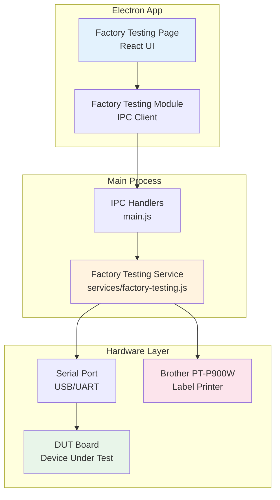
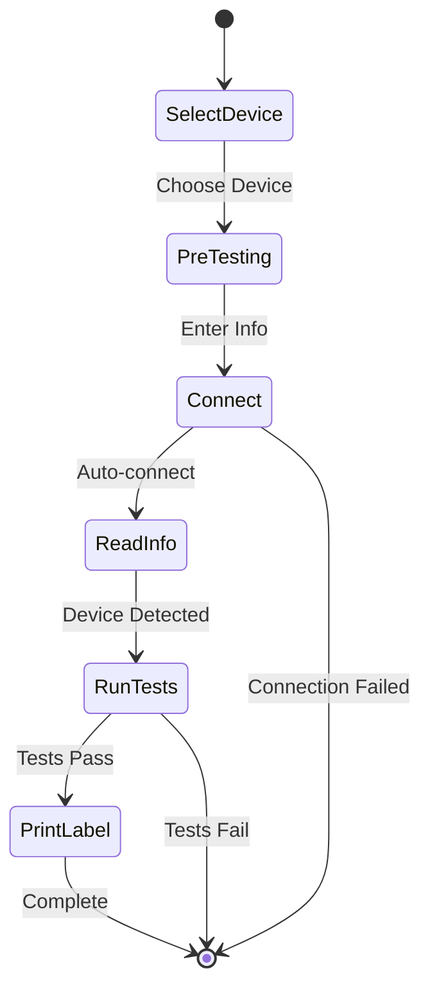

# Factory Testing Feature - Complete Documentation

## 🎯 Overview

The **Factory Testing** feature provides an automated End-of-Line (EOL) testing system for NubeIO hardware devices. This tool connects to DUT (Device Under Test) boards via serial communication and performs comprehensive hardware validation tests.

### Purpose

- Test hardware functionality before shipping
- Validate sensors, communication interfaces, and power systems
- Generate QR code labels with test results
- Maintain quality control records

### Target Users

- **Factory Test Operators** - Run tests on production line
- **Quality Assurance** - Validate test procedures
- **Developers** - Maintain and extend test functionality
- **Beginners** - Learn the system from ground up

---

## 📚 Documentation Structure

```
docs/feature-tabs/factory-testing/
│
├── README.md                           ⭐ YOU ARE HERE - Main index
├── FactoryTesting-Overview.md          System architecture & workflows
├── FactoryTesting-GettingStarted.md    Beginner's guide
├── FactoryTesting-SourceCode.md        Code structure explained
│
├── gen-1/                              GENERATION 1 DEVICES
│   └── micro-edge/
│       ├── MicroEdge-README.md         📑 Master index for Micro Edge
│       ├── MicroEdge-Overview.md       Device overview & hardware specs
│       ├── MicroEdge-Sequence.md       Test sequence diagrams
│       ├── MicroEdge-TestCases.md      Detailed test specifications
│       ├── MicroEdge-SourceCode.md     Code walkthrough & maintenance
│       └── MicroEdge-Troubleshooting.md Common issues & solutions
│
├── gen-2/                              GENERATION 2 DEVICES
│   ├── acb-m/
│   │   ├── ACBM-README.md              📑 Master index for ACB-M
│   │   ├── ACBM-Overview.md
│   │   ├── ACBM-Sequence.md
│   │   ├── ACBM-TestCases.md
│   │   ├── ACBM-SourceCode.md
│   │   └── ACBM-Troubleshooting.md
│   │
│   ├── zc-lcd/
│   │   ├── ZCLCD-README.md             📑 Master index for ZC-LCD
│   │   ├── ZCLCD-Overview.md
│   │   ├── ZCLCD-Sequence.md
│   │   ├── ZCLCD-TestCases.md
│   │   ├── ZCLCD-SourceCode.md
│   │   └── ZCLCD-Troubleshooting.md
│   │
│   ├── zc-controller/
│   │   ├── ZCController-README.md      📑 Master index for ZC-Controller
│   │   ├── ZCController-Overview.md
│   │   ├── ZCController-Sequence.md
│   │   ├── ZCController-TestCases.md
│   │   ├── ZCController-SourceCode.md
│   │   └── ZCController-Troubleshooting.md
│   │
│   └── droplet/
│       ├── Droplet-README.md           📑 Master index for Droplet
│       ├── Droplet-Overview.md
│       ├── Droplet-Sequence.md
│       ├── Droplet-TestCases.md
│       ├── Droplet-SourceCode.md
│       └── Droplet-Troubleshooting.md
│
└── support-boards/                     SUPPORT HARDWARE
    └── ac-connect/
        ├── ACConnect-README.md         📑 Master index for AC-Connect
        ├── ACConnect-Overview.md       Bridge board documentation
        └── ACConnect-Integration.md    How it connects to DUTs
```

---

## 🚀 Quick Start Guide

### For Complete Beginners

1. **Start Here:** Read [FactoryTesting-GettingStarted.md](./FactoryTesting-GettingStarted.md)
2. **Understand System:** Review [FactoryTesting-Overview.md](./FactoryTesting-Overview.md)
3. **Pick Your Device:** Navigate to the specific device folder (gen-1 or gen-2)
4. **Follow Device README:** Each device has its own master README with detailed guides

### For Test Operators

1. Review device-specific test procedures:
   - [Micro Edge Test Cases](./gen-1/micro-edge/MicroEdge-TestCases.md)
   - [ACB-M Test Cases](./gen-2/acb-m/ACBM-TestCases.md)
   - [ZC-LCD Test Cases](./gen-2/zc-lcd/ZCLCD-TestCases.md)
   - [Droplet Test Cases](./gen-2/droplet/Droplet-TestCases.md)

### For Developers

1. **Code Structure:** Read [FactoryTesting-SourceCode.md](./FactoryTesting-SourceCode.md)
2. **Device Implementation:** Check device-specific SourceCode.md files
3. **Extend Features:** Use sequence diagrams to understand flows
4. **Debug Issues:** Refer to Troubleshooting.md files

---

## 📋 Supported Devices

### Generation 1 (GEN-1)

| Device | Description | Documentation |
|--------|-------------|---------------|
| **Micro Edge** | ESP32-based edge controller | [📁 docs](./gen-1/micro-edge/MicroEdge-README.md) |

**Communication:** UART AT Commands  
**Tests:** WiFi, LoRa, Sensors, Power

---

### Generation 2 (GEN-2)

| Device | Description | Documentation |
|--------|-------------|---------------|
| **ACB-M** | Air Conditioning Bridge Master | [📁 docs](./gen-2/acb-m/ACBM-README.md) |
| **ZC-LCD** | Zone Controller with LCD Display | [📁 docs](./gen-2/zc-lcd/ZCLCD-README.md) |
| **ZC-Controller** | Damper Zone Controller | [📁 docs](./gen-2/zc-controller/ZCController-README.md) |
| **Droplet** | Compact IoT sensor node | [📁 docs](./gen-2/droplet/Droplet-README.md) |

**Communication:** UART AT Commands  
**Tests:** WiFi, RS485, Sensors, Relays, Digital I/O

---

### Support Boards

| Board | Purpose | Documentation |
|-------|---------|---------------|
| **AC-Connect** | Test bridge/programming board | [📁 docs](./support-boards/ac-connect/ACConnect-README.md) |

---

## 🏗️ System Architecture

### High-Level Architecture



### Component Overview

1. **Frontend (Renderer Process)**
   - `FactoryTestingPage.js` - UI and user interactions
   - `FactoryTestingModule.js` - IPC communication client

2. **Backend (Main Process)**
   - `main.js` - IPC handler registration
   - `factory-testing.js` - Core testing service

3. **Hardware Interfaces**
   - Serial/UART communication (115200 baud)
   - AT command protocol
   - Label printer integration

---

## 🔄 Testing Workflow

### Standard Test Flow



### Detailed Test Sequence

1. **Device Selection**
   - User selects Generation (Gen-1 or Gen-2)
   - User selects specific device type

2. **Pre-Testing Information**
   - Tester name
   - Hardware version
   - Batch ID
   - Work order serial

3. **Auto-Connection**
   - System detects COM port
   - Sends unlock command (AT+UNLOCK=N00BIO)
   - Reads device information

4. **Test Execution**
   - WiFi scan and connectivity
   - RS485 communication
   - Sensor readings
   - Power measurements
   - Digital I/O validation

5. **Results & Labeling**
   - Pass/Fail determination
   - QR code generation
   - Label printing
   - Results saved to file

---

## 📊 Test Categories

### Common Tests (All Devices)

- ✅ **WiFi Test** - Scan networks, measure RSSI
- ✅ **Device Info** - Read firmware version, MAC address
- ✅ **Power Test** - Measure voltages (VCC, Battery)

### Device-Specific Tests

#### Micro Edge (GEN-1)
- LoRa radio detection and communication
- Pulse counter functionality
- DIP switch reading
- Analog inputs (AIN1, AIN2, AIN3)
- Relay control (Relay 1, Relay 2)

#### ACB-M (GEN-2)
- RS485-1 communication
- RS485-2 communication
- Modbus protocol validation

#### ZC-LCD (GEN-2)
- LCD display functionality
- RS485 communication
- Button inputs

#### ZC-Controller (GEN-2)
- Damper motor control
- Position feedback
- RS485 communication

#### Droplet (GEN-2)
- Ultra-compact form factor tests
- Low-power mode validation

---

## 🔧 Key Features

### Auto Mode (Recommended)
- Automatic port detection
- Auto-connect when device plugged in
- Streamlined workflow for operators

### Manual Mode
- Manual COM port selection
- Step-by-step test execution
- Useful for debugging

### Result Management
- JSON-based result storage
- QR code label printing
- Historical test data tracking
- Export capabilities

### Printer Integration
- Brother PT-P900W USB label printer
- Code128 barcode generation
- Device info + test results on label

---

## 🛠️ Technical Stack

| Component | Technology |
|-----------|------------|
| **Application Framework** | Electron 28.0.0 |
| **Frontend** | Vanilla JavaScript (ES6+) |
| **Serial Communication** | serialport, @serialport/parser-readline |
| **Backend Service** | Node.js |
| **Label Printing** | Python 3.13 + PyInstaller |
| **AT Command Protocol** | Custom NubeIO implementation |

---

## 📖 Reading Guide by Role

### Test Operator Path (30 minutes)
1. [Getting Started Guide](./FactoryTesting-GettingStarted.md) - 10 min
2. [Device Test Cases](./gen-2/acb-m/ACBM-TestCases.md) - 15 min
3. [Troubleshooting](./gen-2/acb-m/ACBM-Troubleshooting.md) - 5 min

### Developer Path (2-3 hours)
1. [System Overview](./FactoryTesting-Overview.md) - 30 min
2. [Source Code Guide](./FactoryTesting-SourceCode.md) - 60 min
3. [Device Implementation](./gen-2/acb-m/ACBM-SourceCode.md) - 45 min
4. [Sequence Diagrams](./gen-2/acb-m/ACBM-Sequence.md) - 30 min

### Maintainer Path (4+ hours)
- Read all documentation systematically
- Study all sequence diagrams
- Review all device implementations
- Understand error handling patterns

---

## 🎓 Learning Resources

### Concepts to Understand

1. **Serial Communication**
   - UART protocol
   - Baud rates (typically 115200)
   - Data frames (8N1)

2. **AT Commands**
   - Command format: `AT+COMMAND=PARAM`
   - Response format: `+PREFIX:DATA`
   - OK/ERROR responses

3. **Electron IPC**
   - Renderer ↔ Main process communication
   - Async/await patterns
   - Event-driven architecture

4. **Test Automation**
   - State machines
   - Timeout handling
   - Result validation

### External References

- [Electron Documentation](https://www.electronjs.org/docs)
- [Node SerialPort Guide](https://serialport.io/)
- [AT Command Specification](https://en.wikipedia.org/wiki/Hayes_command_set)

---

## 🚨 Common Issues & Solutions

### Connection Problems
**Issue:** Cannot connect to device  
**Solution:** Check COM port, ensure device is powered, verify cable

### Test Failures
**Issue:** Tests timing out  
**Solution:** Increase timeout values, check AT command responses

### Printer Not Working
**Issue:** Labels not printing  
**Solution:** Verify printer connection, check paper loaded, restart app

See device-specific troubleshooting guides for detailed solutions.

---

## 📝 Contributing & Maintenance

### Adding New Device
1. Create device folder under gen-1/ or gen-2/
2. Copy template files from existing device
3. Implement device-specific tests in factory-testing.js
4. Add device to UI selection in FactoryTestingPage.js
5. Write comprehensive documentation

### Updating Tests
1. Identify test to modify in factory-testing.js
2. Update test logic and validation
3. Update sequence diagrams
4. Update test cases documentation
5. Test thoroughly before deployment

### Code Review Checklist
- ✅ All tests have timeout protection
- ✅ Error handling implemented
- ✅ Progress callbacks working
- ✅ Documentation updated
- ✅ Tested on actual hardware

---

## 📞 Support & Contact

- **GitHub Issues:** [NubeiO-Eol-Toolkit/issues](https://github.com/NubeIO/NubeiO-Eol-Toolkit/issues)
- **Email:** info@nube-io.com
- **Documentation Updates:** Submit PR to docs/ folder

---

## 📅 Document Information

- **Last Updated:** December 8, 2025
- **Version:** 1.0.0
- **Status:** Complete ✅
- **Target Audience:** Beginners to Advanced Users

---

## ✅ Next Steps

1. **New Users:** Read [Getting Started Guide](./FactoryTesting-GettingStarted.md)
2. **Operators:** Review device-specific test procedures
3. **Developers:** Study [Source Code Documentation](./FactoryTesting-SourceCode.md)
4. **Select Your Device:** Navigate to device folder and read the README

**Remember:** Each device folder has its own comprehensive documentation package designed for complete beginners!
