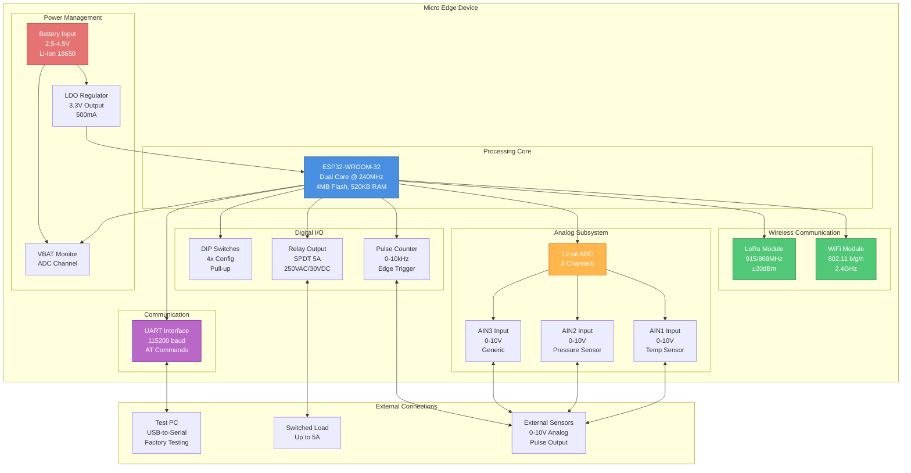
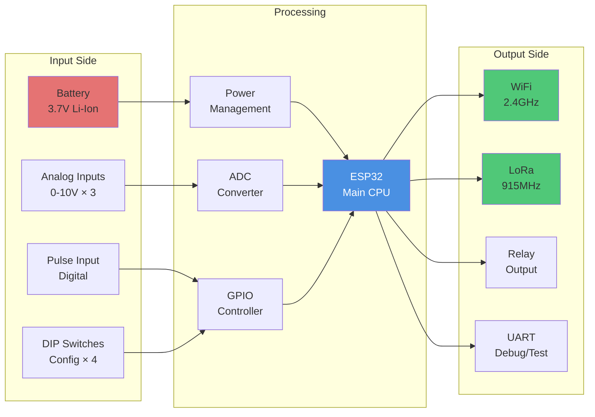
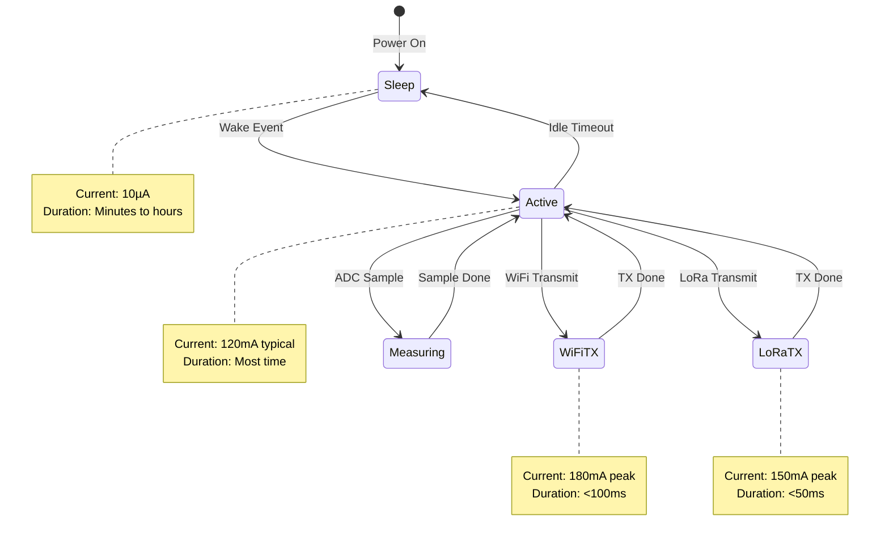
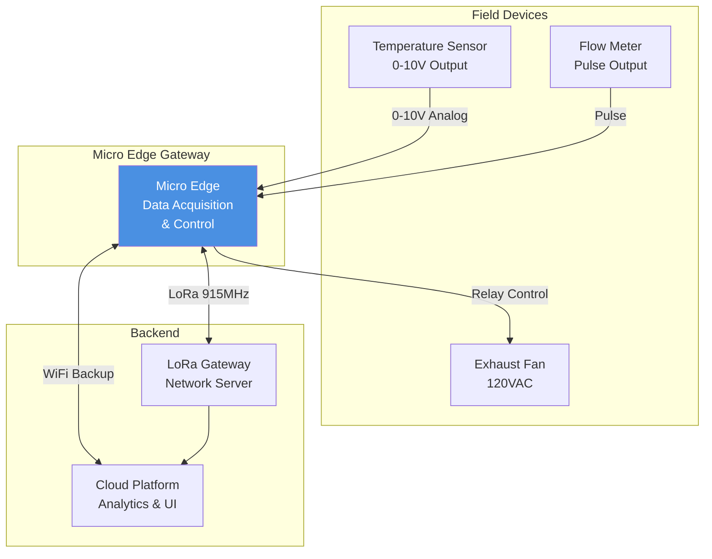

# Micro Edge - Hardware Overview

**Device Type:** GEN-1 (ESP32-based)  
**Target Audience:** Beginners, Test Operators, Hardware Engineers  
**Last Updated:** December 8, 2025

---

## Table of Contents

- [Device Summary](#device-summary)
- [Hardware Specifications](#hardware-specifications)
- [System Architecture](#system-architecture)
- [Component Descriptions](#component-descriptions)
- [Communication Interfaces](#communication-interfaces)
- [Power Requirements](#power-requirements)
- [Physical Layout](#physical-layout)
- [Test Points](#test-points)

---

## Device Summary

The **Micro Edge** is a compact IoT gateway device built on ESP32 platform, designed for industrial automation and building management systems.

### Key Features

✅ **Dual Wireless Communication**
- WiFi 802.11 b/g/n
- LoRa long-range radio

✅ **Multiple Analog Inputs**
- 3x Universal Analog Inputs (0-10V)
- 12-bit ADC resolution

✅ **Digital I/O**
- Pulse counter input
- Relay output control
- DIP switch configuration

✅ **Industrial Grade**
- Wide voltage input (2.5-4.5V typical)
- Extended temperature range
- Robust enclosure

---

## Hardware Specifications

### Microcontroller

| Specification | Value |
|---------------|-------|
| **MCU** | ESP32-WROOM-32 |
| **CPU** | Dual-core Xtensa LX6 @ 240MHz |
| **Flash** | 4MB |
| **RAM** | 520KB SRAM |
| **Operating Voltage** | 3.3V |

### Wireless Modules

#### WiFi Specifications

| Parameter | Value |
|-----------|-------|
| **Standard** | IEEE 802.11 b/g/n |
| **Frequency** | 2.4 GHz |
| **Range** | Up to 100m (line of sight) |
| **Security** | WPA/WPA2/WPA3 |
| **Antenna** | PCB trace antenna |

#### LoRa Specifications

| Parameter | Value |
|-----------|-------|
| **Frequency** | 915MHz (US) / 868MHz (EU) |
| **Modulation** | LoRa CSS |
| **Range** | Up to 2km (urban) / 10km (rural) |
| **Output Power** | Up to +20dBm |
| **Unique Address** | 8-character hex ID |

### Analog Inputs

| Input | Range | Resolution | Accuracy | Use Case |
|-------|-------|------------|----------|----------|
| **AIN1** | 0-10V | 12-bit (4096 steps) | ±2% | Temperature sensors |
| **AIN2** | 0-10V | 12-bit (4096 steps) | ±2% | Pressure sensors |
| **AIN3** | 0-10V | 12-bit (4096 steps) | ±2% | Generic analog |

**Expected Test Values:**
- AIN1: 1.4-1.7V (test fixture reference)
- AIN2: 0.75-1.2V (test fixture reference)
- AIN3: 0.5-0.9V (test fixture reference)

### Digital I/O

| I/O | Type | Specifications |
|-----|------|----------------|
| **Pulse Counter** | Input | Edge-triggered, 0-10kHz |
| **Relay Output** | SPDT | 5A @ 250VAC, 5A @ 30VDC |
| **DIP Switches** | 4x Input | Pull-up resistors, active low |

### Power Supply

| Parameter | Min | Typical | Max | Unit |
|-----------|-----|---------|-----|------|
| **Input Voltage** | 2.5 | 3.7 | 4.5 | V |
| **Operating Current** | 80 | 120 | 180 | mA |
| **Sleep Current** | - | 10 | - | µA |
| **Peak Current** | - | - | 500 | mA |

**Battery Type:** Li-Ion 18650 (3.7V nominal)

### Physical Specifications

| Parameter | Value |
|-----------|-------|
| **Dimensions** | 65mm × 45mm × 18mm (L×W×H) |
| **Weight** | 28g |
| **Enclosure** | ABS plastic |
| **Mounting** | DIN rail clip |
| **Operating Temp** | -20°C to +70°C |
| **Storage Temp** | -40°C to +85°C |
| **Humidity** | 5% to 95% RH (non-condensing) |
| **IP Rating** | IP40 |

---

## System Architecture

### Component Diagram



### Hardware Block Diagram



---

## Component Descriptions

### 1. ESP32-WROOM-32 Module

**Function:** Main microcontroller and WiFi module

**Features:**
- Dual-core processor for parallel task execution
- Integrated WiFi with TCP/IP stack
- 34 GPIO pins (18 used in Micro Edge)
- Hardware cryptographic acceleration
- OTA (Over-The-Air) firmware update capability

**Firmware:** Custom NubeIO AT command firmware

**AT Command Interface:**
- Baud rate: 115200
- Data bits: 8
- Parity: None
- Stop bits: 1
- Flow control: None

### 2. LoRa Radio Module

**Function:** Long-range wireless communication

**Implementation:** SX1276/SX1278 transceiver

**Key Features:**
- CSS (Chirp Spread Spectrum) modulation
- Frequency hopping for interference immunity
- AES-128 encryption support
- Unique 8-character hex address burned in
- Low power consumption (< 100mA TX)

**Use Cases:**
- Sensor data backhaul
- Command & control
- Mesh networking
- Long-range telemetry

### 3. Analog Input Circuitry

**Design:** Voltage divider + RC filter + ESP32 ADC

**Circuit per input:**
```
External 0-10V --> [Divider 1:3] --> [RC Filter] --> ESP32 ADC
```

**Signal Conditioning:**
- Input protection: Zener diode clamp
- EMI filtering: 100nF capacitor
- Scaling: 10V input → 3.3V ADC max
- Sampling rate: Up to 1kHz

**Calibration:**
- Factory calibration stored in flash
- Per-channel offset and gain correction

### 4. Pulse Counter Input

**Function:** High-speed edge counting for flowmeters, encoders

**Implementation:** ESP32 PCNT (Pulse Counter) peripheral

**Specifications:**
- Maximum frequency: 10kHz
- Edge detection: Rising, falling, or both
- Counter width: 16-bit
- Overflow handling: Interrupt on overflow

**Typical Applications:**
- Water/gas flowmeters
- Energy meters (pulse output)
- Rotary encoders
- Motion detection

### 5. Relay Output

**Type:** SPDT (Single Pole Double Throw) electromechanical relay

**Driver:** Transistor with flyback diode protection

**Ratings:**
- Contact: 5A @ 250VAC or 5A @ 30VDC
- Coil voltage: 5V
- Switching speed: ~10ms
- Mechanical life: 10 million operations
- Electrical life: 100,000 operations @ rated load

**Protection:**
- Snubber circuit for inductive loads
- Transient suppression

### 6. DIP Switch Array

**Configuration:** 4-position DIP switch

**Function:** Hardware configuration without reprogramming

**Common Uses:**
- Device address selection
- Operating mode selection
- Feature enable/disable
- Factory test mode entry

**Reading:** GPIO pins with internal pull-ups (active low logic)

### 7. Power Management

**Primary Regulator:** Low-dropout (LDO) 3.3V @ 500mA

**Features:**
- Input: 2.5V - 4.5V
- Output: 3.3V ±3%
- Dropout voltage: 200mV
- Thermal shutdown protection
- Short-circuit protection

**Battery Monitoring:**
- Dedicated ADC channel measures VBAT
- Software calculates battery %
- Low battery warning/shutdown

---

## Communication Interfaces

### UART Interface (Primary for Testing)

**Connection:** USB-to-Serial adapter during factory testing

**Pinout:**
- TX (GPIO1) - Transmit data
- RX (GPIO3) - Receive data
- GND - Ground reference

**Protocol:** AT Commands

**Example Commands:**
```
AT+UNLOCK=N00BIO     → Unlock device for testing
AT+WIFI?             → Query WiFi status
AT+LORA?             → Query LoRa status
AT+VALUE_VBAT?       → Read battery voltage
```

### WiFi Interface

**Mode:** Station (client) mode during testing

**Connection Process:**
1. Scan for networks
2. Measure RSSI (Received Signal Strength)
3. Report available SSIDs
4. Optional: Connect to test network

**Expected RSSI:** > -70 dBm for good signal

### LoRa Interface

**Initialization:**
1. Power up SX1276 chip
2. Load configuration (frequency, SF, BW)
3. Read unique address from chip
4. Calibrate RF

**Test Procedure:**
1. Detect LoRa module (read chip ID)
2. Read unique address
3. Send test packet
4. Verify transmission OK

---

## Power Requirements

### Operating Modes



### Current Budget

| Component | Idle | Active | Peak | Notes |
|-----------|------|--------|------|-------|
| **ESP32 Core** | 5mA | 80mA | 100mA | WiFi OFF |
| **WiFi TX** | - | - | 180mA | During transmission |
| **LoRa TX** | - | - | 130mA | +20dBm output |
| **ADC Active** | - | 5mA | - | Per conversion |
| **Relay Coil** | - | 50mA | - | When energized |
| **Total** | ~10mA | ~120mA | ~330mA | Depends on mode |

### Battery Life Calculation

**Assumptions:**
- Battery: 2600mAh Li-Ion 18650
- Duty cycle: 1% WiFi TX, 10% LoRa TX, 89% active idle
- Average current: 125mA

**Estimated runtime:**
```
Runtime = 2600mAh / 125mA ≈ 20.8 hours
```

**With sleep mode (90% sleep):**
```
Average = (0.9 × 0.01mA) + (0.1 × 125mA) = 12.5mA
Runtime = 2600mAh / 12.5mA ≈ 208 hours (8.6 days)
```

---

## Physical Layout

### PCB Layout (Top View)

```
┌─────────────────────────────────────┐
│  ┌──────────┐         ┌─────┐      │
│  │  ESP32   │  ANT1   │LORA │      │  ← Top Side
│  │ WROOM-32 │  WiFi   │ IC  │ ANT2 │
│  └──────────┘         └─────┘ LoRa │
│                                     │
│   [DIP1-4]    [AIN1] [AIN2] [AIN3] │
│                                     │
│   [RELAY]     [PULSE]   [VBAT]     │
│                                     │
│   [UART]  [USB] [RESET]  [POWER]   │
└─────────────────────────────────────┘
```

### Connector Pinouts

#### UART Test Connector (4-pin)

| Pin | Signal | Direction | Description |
|-----|--------|-----------|-------------|
| 1 | GND | - | Ground reference |
| 2 | TX | Output | Transmit data (3.3V logic) |
| 3 | RX | Input | Receive data (3.3V logic) |
| 4 | 3V3 | Output | 3.3V power (max 100mA) |

#### Analog Input Terminals (3× screw terminals)

Each terminal:
| Pin | Signal | Range |
|-----|--------|-------|
| + | Analog Input | 0-10V DC |
| - | GND | Ground |

#### Power Input

| Pin | Signal | Range |
|-----|--------|-------|
| + | VBAT | 2.5-4.5V DC |
| - | GND | Ground |

---

## Test Points

### Factory Test Points (for probing)

| Test Point | Location | Signal | Purpose |
|------------|----------|--------|---------|
| **TP1** | Near ESP32 | 3V3 | Check regulator output |
| **TP2** | Near ADC | AIN1_SCALED | Verify analog scaling |
| **TP3** | Near LoRa | SPI_CLK | Verify LoRa communication |
| **TP4** | Battery | VBAT | Check battery voltage |
| **TP5** | Ground | GND | Oscilloscope ground |

### LED Indicators

| LED | Color | State | Meaning |
|-----|-------|-------|---------|
| **PWR** | Green | On | Power good (3.3V OK) |
| **WiFi** | Blue | Blink | WiFi activity |
| **LoRa** | Yellow | Blink | LoRa TX/RX |
| **Status** | Red/Green | Various | System status |

**Status LED Codes:**
- Solid Green → Normal operation
- Blinking Green → WiFi connecting
- Blinking Yellow → LoRa transmitting
- Solid Red → Error state
- Fast Red Blink → Critical error (low battery, etc.)

---

## Typical Application

### Use Case: Building Automation



**Data Flow:**
1. Sensors provide analog/digital signals
2. Micro Edge samples and converts to engineering units
3. Data transmitted via LoRa (primary) or WiFi (backup)
4. Gateway forwards to cloud
5. Cloud platform analyzes and displays
6. Control commands sent back to operate relay

---

## Related Documentation

- **[Test Cases](./MicroEdge-TestCases.md)** - Detailed testing procedures
- **[Sequence Diagrams](./MicroEdge-Sequence.md)** - Test flow visualization
- **[Source Code Manual](./MicroEdge-SourceCode.md)** - Software architecture
- **[Troubleshooting](./MicroEdge-Troubleshooting.md)** - Common issues

---

## Revision History

| Version | Date | Author | Changes |
|---------|------|--------|---------|
| 1.0 | 2025-12-08 | Documentation Team | Initial hardware overview with component diagram |

---

**Next:** [Test Cases Documentation →](./MicroEdge-TestCases.md)
