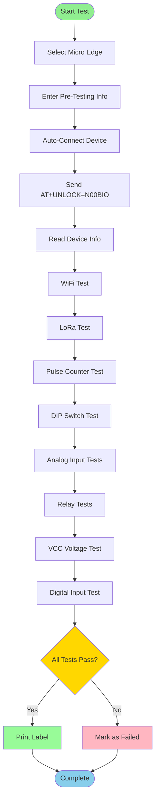

# Micro Edge (GEN-1) - Master Documentation Index

## 📑 Complete Documentation for Micro Edge Device

Welcome! This folder contains **everything you need** to understand, test, maintain, and debug the Micro Edge factory testing system.

---

## 📚 Documentation Files

| Document | Purpose | For Who |
|----------|---------|---------|
| **[MicroEdge-Overview.md](./MicroEdge-Overview.md)** | Hardware specs, device description | Everyone |
| **[MicroEdge-Sequence.md](./MicroEdge-Sequence.md)** | Test flows with diagrams | Developers, QA |
| **[MicroEdge-TestCases.md](./MicroEdge-TestCases.md)** | Detailed test specifications | Operators, QA |
| **[MicroEdge-SourceCode.md](./MicroEdge-SourceCode.md)** | Code walkthrough & maintenance | Developers |
| **[MicroEdge-Troubleshooting.md](./MicroEdge-Troubleshooting.md)** | Common issues & fixes | Everyone |

---

## 🎯 Quick Links

### For Test Operators
1. **Start Here:** [Test Procedures](./MicroEdge-TestCases.md#test-procedures)
2. **Common Issues:** [Troubleshooting Guide](./MicroEdge-Troubleshooting.md)
3. **Expected Results:** [Pass/Fail Criteria](./MicroEdge-TestCases.md#passfail-criteria)

### For Developers
1. **Code Structure:** [Source Code Guide](./MicroEdge-SourceCode.md)
2. **Test Sequence:** [Sequence Diagrams](./MicroEdge-Sequence.md)
3. **Extending Tests:** [Adding New Tests](./MicroEdge-SourceCode.md#adding-new-tests)

### For Beginners
1. **What is Micro Edge?** [Overview](./MicroEdge-Overview.md#device-description)
2. **How does testing work?** [Test Flow](./MicroEdge-Sequence.md#overview)
3. **What gets tested?** [Test Cases](./MicroEdge-TestCases.md)

---

## 🔧 Device Overview

### What is Micro Edge?

**Micro Edge** is a Generation 1 (GEN-1) ESP32-based edge controller designed for industrial IoT applications. It features:

- **WiFi & LoRa** connectivity
- **Multiple sensors** (temperature, analog inputs)
- **Digital I/O** (relays, pulse counter, DIP switches)
- **Industrial interfaces** (RS485)

### Technical Specifications

| Specification | Details |
|--------------|---------|
| **Microcontroller** | ESP32 |
| **Communication** | UART @ 115200 baud |
| **Protocol** | AT Commands |
| **WiFi** | 2.4GHz 802.11 b/g/n |
| **LoRa** | 915MHz (US) / 868MHz (EU) |
| **Power** | 12-24V DC |
| **Relays** | 2x Form-C |
| **Analog Inputs** | 3x 0-10V |

---

## 🧪 Test Summary

### Tests Performed

1. ✅ **WiFi Scan** - Detect networks and measure RSSI
2. ✅ **LoRa Test** - Radio detection and communication
3. ✅ **Pulse Counter** - Digital pulse counting
4. ✅ **DIP Switches** - Switch position reading
5. ✅ **Analog Inputs** - AIN1, AIN2, AIN3 voltage measurement
6. ✅ **Relay Control** - Relay 1 & 2 operation
7. ✅ **VCC Voltage** - Power supply measurement
8. ✅ **Digital Inputs** - Digital I/O state detection

### Test Duration
**Typical:** 45-60 seconds  
**Maximum:** 90 seconds (with retries)

### Success Criteria
- **Overall Pass:** All individual tests pass
- **WiFi:** >3 networks detected, RSSI > -70 dBm
- **LoRa:** Device detected, TX/RX successful
- **Voltages:** Within ±10% tolerance
- **Relays:** Successful ON/OFF switching
- **Digital I/O:** Correct state detection

---

## 🚀 Quick Start

### Prerequisites

1. **Hardware Setup**
   - Micro Edge board connected via UART/USB
   - AC-Connect bridge board (optional but recommended)
   - Power supply connected (12-24V)
   - LoRa antenna attached

2. **Software**
   - Nube iO EOL Toolkit running
   - Factory Testing tab open
   - Brother PT-P900W printer connected (for labels)

### Running a Test (5 Steps)

```
1. Select "Gen-1" → "Micro Edge"
2. Enter pre-testing info (name, batch, etc.)
3. Click "Proceed to Testing"
4. Connect device (auto-detect)
5. Tests run automatically → Print label if pass
```

Detailed instructions: [Test Procedures](./MicroEdge-TestCases.md#test-procedures)

---

## 📊 Test Results Format

### JSON Structure

```json
{
  "info": {
    "firmwareVersion": "v1.2.3",
    "uniqueId": "F8AC119F",
    "deviceMake": "NUBIO",
    "deviceModel": "MICROEDGE"
  },
  "tests": {
    "wifi": {
      "pass": true,
      "networks": 5,
      "rssi": -45
    },
    "lora": {
      "pass": true,
      "detected": true,
      "address": "0x1234"
    }
    // ... more tests
  },
  "_eval": {
    "pass_wifi": true,
    "pass_lora": true,
    // ... evaluation flags
  },
  "summary": {
    "passAll": true
  }
}
```

### CSV Output

Results are also saved to CSV for batch analysis:

```
Date,Time,Tester,BatchID,UID,FirmwareVersion,WiFi,LoRa,Pulses,DIP,AIN1,AIN2,AIN3,Relay1,Relay2,VCC,DigitalIn,PassAll
2025-12-08,14:30:45,John,B123,F8AC119F,v1.2.3,PASS,PASS,PASS,PASS,PASS,PASS,PASS,PASS,PASS,PASS,PASS,PASS
```

---

## 🔄 Test Flow Diagram



---

## 🎓 Understanding AT Commands

### What are AT Commands?

AT Commands are text-based commands used to communicate with devices. They follow this pattern:

```
Command:  AT+COMMAND=PARAMETER
Response: +PREFIX:DATA
Status:   OK or ERROR
```

### Example: Reading WiFi Networks

```
Send:     AT+WIFI?
Receive:  +WIFI:5,-45
          OK
```

This means: 5 networks found, strongest signal is -45 dBm.

### Micro Edge Specific Commands

| Command | Purpose | Response |
|---------|---------|----------|
| `AT+UNLOCK=N00BIO` | Unlock factory testing | `OK` |
| `AT+WIFI?` | Scan WiFi networks | `+WIFI:count,rssi` |
| `AT+LORA?` | Check LoRa radio | `+LORA:detected` |
| `AT+PULSES?` | Read pulse counter | `+PULSES:count` |
| `AT+DIPSW?` | Read DIP switches | `+DIPSW:state` |
| `AT+AIN1?` | Read analog input 1 | `+AIN1:voltage` |
| `AT+RELAY1=ON` | Turn relay 1 ON | `OK` |
| `AT+VCC?` | Read VCC voltage | `+VCC:voltage` |

Full command reference: [Test Cases](./MicroEdge-TestCases.md#at-commands)

---

## 🛠️ Maintenance Guide

### Common Maintenance Tasks

1. **Updating Test Thresholds**
   - Location: `services/factory-testing.js`
   - Find Micro Edge section (~line 1500)
   - Modify pass/fail criteria

2. **Adding New Test**
   - Follow pattern in existing tests
   - Add AT command handler
   - Update UI to display results
   - Update documentation

3. **Debugging Failed Tests**
   - Check serial monitor output
   - Verify AT command responses
   - Test with manual commands
   - See [Troubleshooting](./MicroEdge-Troubleshooting.md)

### Code Locations

```
services/factory-testing.js       - Main test logic
  └─ Line 1494: Micro Edge tests start
  └─ Line 1608: Pass/fail evaluation

renderer/pages/FactoryTestingPage.js  - UI and workflow
  └─ Line 13: Micro Edge device array
  └─ Line 171: Micro Edge step management

renderer/modules/FactoryTestingModule.js  - IPC communication
  └─ Line 152: Connect handler
  └─ Line 202: Test execution
```

---

## 📈 Performance Metrics

### Typical Test Times

| Test | Duration | Timeout |
|------|----------|---------|
| WiFi Scan | 3-5 seconds | 10s |
| LoRa Test | 2-3 seconds | 10s |
| Pulse Counter | 1 second | 5s |
| DIP Switches | 1 second | 5s |
| Analog Inputs | 2 seconds | 5s each |
| Relay Tests | 3 seconds | 5s each |
| VCC Voltage | 1 second | 5s |
| Digital Inputs | 1 second | 5s |
| **Total** | **45-60 seconds** | **90s max** |

### Success Rates (Target)

- First-pass success: >95%
- Retry success: >98%
- Hardware defects: <2%

---

## 🐛 Common Issues

### Device Not Connecting
**Symptom:** Auto-connect fails  
**Fix:** Check COM port, verify power, replug USB  
**Details:** [Troubleshooting Guide](./MicroEdge-Troubleshooting.md#connection-issues)

### WiFi Test Failing
**Symptom:** "No networks found" or low RSSI  
**Fix:** Check antenna, move away from interference  
**Details:** [WiFi Issues](./MicroEdge-Troubleshooting.md#wifi-issues)

### LoRa Test Failing
**Symptom:** "LoRa not detected"  
**Fix:** Verify LoRa module installed, check antenna  
**Details:** [LoRa Issues](./MicroEdge-Troubleshooting.md#lora-issues)

---

## 📞 Getting Help

1. **First:** Check [Troubleshooting Guide](./MicroEdge-Troubleshooting.md)
2. **Then:** Review [Test Cases](./MicroEdge-TestCases.md) for expected behavior
3. **If stuck:** Review [Source Code](./MicroEdge-SourceCode.md) for implementation details
4. **Still need help:** Contact development team

---

## ✅ Checklist for New Users

- [ ] Read [Overview](./MicroEdge-Overview.md)
- [ ] Understand [Test Flow](./MicroEdge-Sequence.md)
- [ ] Review [Test Cases](./MicroEdge-TestCases.md)
- [ ] Set up hardware
- [ ] Run first test
- [ ] Know how to [troubleshoot](./MicroEdge-Troubleshooting.md)
- [ ] Understand [results format](#test-results-format)
- [ ] Know where to find [code](#code-locations)

---

## 📅 Document Information

- **Device:** Micro Edge (Generation 1)
- **Last Updated:** December 8, 2025
- **Version:** 1.0.0
- **Maintained By:** NubeIO Development Team

---

**Next Steps:**

- **Operators:** Read [Test Cases](./MicroEdge-TestCases.md)
- **Developers:** Study [Source Code](./MicroEdge-SourceCode.md)
- **Troubleshooters:** Bookmark [Troubleshooting](./MicroEdge-Troubleshooting.md)

**Remember:** Each document is designed for beginners - start from the beginning!
