# Micro Edge - Detailed Test Sequence Diagrams

## 📊 Complete Test Flow Documentation

This document provides detailed sequence diagrams showing **exactly how** the Micro Edge factory testing works, from start to finish.

---

## Table of Contents

1. [Overview](#overview)
2. [Complete Test Sequence](#complete-test-sequence)
3. [Connection Phase](#connection-phase)
4. [Individual Test Sequences](#individual-test-sequences)
5. [Result Processing](#result-processing)
6. [Error Handling](#error-handling)

---

## Overview

### Testing Layers

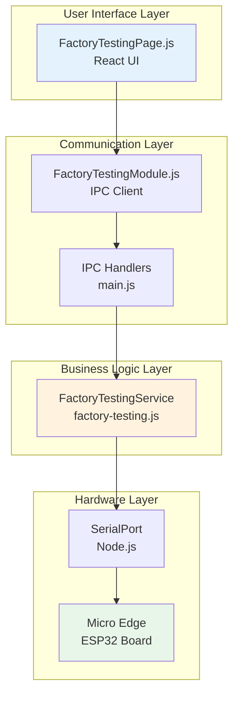

---

## Complete Test Sequence

### End-to-End Flow

```mermaid
sequenceDiagram
    participant User
    participant UI as FactoryTestingPage
    participant Module as FactoryTestingModule
    participant IPC as main.js IPC
    participant Service as FactoryTestingService
    participant Serial as SerialPort
    participant Device as Micro Edge

    %% Selection Phase
    User->>UI: Select "Gen-1" → "Micro Edge"
    activate UI
    UI->>UI: Reset data, show pre-testing form
    UI-->>User: Display form
    deactivate UI

    %% Pre-Testing Phase
    User->>UI: Enter tester info, batch ID
    activate UI
    UI->>UI: Validate inputs
    UI->>UI: Save to localStorage
    UI-->>User: Show "Proceed to Testing"
    deactivate UI

    %% Proceed to Main Testing
    User->>UI: Click "Proceed to Testing"
    activate UI
    UI->>UI: Set mode = 'auto'
    UI->>UI: Set microEdgeStep = 'main'
    UI->>Module: loadSerialPorts()
    activate Module
    Module->>IPC: serialAPI.listPorts()
    IPC-->>Module: Port list
    Module->>Module: Start auto-detection loop
    Module-->>UI: Ports loaded
    deactivate Module
    UI-->>User: Show "Waiting for device..."
    deactivate UI

    %% Auto-Connection Phase
    loop Auto-Detection (every 3s)
        Module->>Module: Check if port available
        alt New Port Detected
            Module->>IPC: factoryTestingAPI.connect(port, 115200, true, 'Micro Edge')
            activate IPC
            IPC->>Service: connect(port, baudRate, useUnlock, deviceType)
            activate Service
            
            %% Connection Sequence
            Service->>Serial: new SerialPort(port, 115200)
            Service->>Serial: port.open()
            Serial->>Device: Open connection
            Device-->>Serial: Connected
            Serial-->>Service: Port opened
            
            Service->>Service: Wait 500ms
            Service->>Serial: Write "AT+UNLOCK=N00BIO\r\n"
            Serial->>Device: AT+UNLOCK=N00BIO
            Device->>Device: Process unlock command
            Device-->>Serial: OK
            Serial-->>Service: OK received
            
            Service->>Service: readDeviceInfo()
            Service->>Serial: Write "AT+WIFI?\r\n"
            Serial->>Device: AT+WIFI?
            Device-->>Serial: +WIFI:5,-45
            Serial-->>Service: WiFi info
            
            Service->>Serial: Write "AT+UNIQUEID?\r\n"
            Serial->>Device: AT+UNIQUEID?
            Device-->>Serial: +UNIQUEID:F8AC119F
            Serial-->>Service: Unique ID
            
            Service-->>IPC: {success: true, deviceInfo}
            deactivate Service
            IPC-->>Module: Connection successful
            deactivate IPC
            
            Module->>UI: Device connected event
            activate UI
            UI->>UI: Update connection status
            UI->>UI: Display device info
            UI->>UI: Show "Run Factory Tests" button
            UI-->>User: Device ready
            deactivate UI
        end
    end

    %% Test Execution Phase
    User->>UI: Click "Run Factory Tests" (Auto mode)
    activate UI
    UI->>Module: runFactoryTests('Micro Edge')
    activate Module
    Module->>IPC: factoryTestingAPI.runFactoryTests('Micro Edge')
    activate IPC
    IPC->>Service: runFactoryTests('Micro Edge')
    activate Service
    
    %% WiFi Test
    Service->>Service: updateProgress('WiFi Test')
    Service->>Serial: Write "AT+WIFI?\r\n"
    Serial->>Device: AT+WIFI?
    Device->>Device: Scan networks
    Device-->>Serial: +WIFI:5,-45
    Serial-->>Service: WiFi data
    Service->>Service: Parse: networks=5, rssi=-45
    Service->>Service: Evaluate: pass = (networks > 3 && rssi > -70)
    Service->>IPC: Progress event: "WiFi Test complete"
    IPC->>UI: Update progress bar
    UI-->>User: "WiFi Test: PASS"
    
    %% LoRa Test
    Service->>Service: updateProgress('LoRa Test')
    Service->>Serial: Write "AT+LORA?\r\n"
    Serial->>Device: AT+LORA?
    Device->>Device: Check LoRa module
    Device-->>Serial: +LORA:1,0x1234
    Serial-->>Service: LoRa data
    Service->>Service: Parse: detected=1, address=0x1234
    Service->>Service: Evaluate: pass = (detected == 1)
    Service->>IPC: Progress event: "LoRa Test complete"
    IPC->>UI: Update progress
    UI-->>User: "LoRa Test: PASS"
    
    %% More tests... (abbreviated)
    Note over Service,Device: Pulse Counter Test
    Note over Service,Device: DIP Switch Test
    Note over Service,Device: AIN1/AIN2/AIN3 Tests
    Note over Service,Device: Relay1/Relay2 Tests
    Note over Service,Device: VCC Voltage Test
    Note over Service,Device: Digital Input Test
    
    %% Results Compilation
    Service->>Service: Compile all results
    Service->>Service: Evaluate overall pass/fail
    Service-->>IPC: {success: true, data: results}
    deactivate Service
    IPC-->>Module: Test results
    deactivate IPC
    Module-->>UI: Results received
    deactivate Module
    
    UI->>UI: Display results
    UI->>UI: Show "Save & Print Label"
    UI-->>User: Results displayed
    deactivate UI
    
    %% Save and Print
    User->>UI: Click "Save & Print Label"
    activate UI
    UI->>Module: saveResults(...)
    Module->>IPC: Save to CSV and JSON
    IPC->>Service: saveResults(...)
    Service->>Service: Write to files
    Service-->>IPC: Saved
    IPC-->>Module: Success
    
    Module->>IPC: printLabel(data)
    IPC->>IPC: Call printer script
    IPC-->>Module: Label printed
    Module-->>UI: Complete
    UI-->>User: "✓ Test Complete, Label Printed"
    deactivate UI
```

---

## Connection Phase

### Detailed Connection Sequence

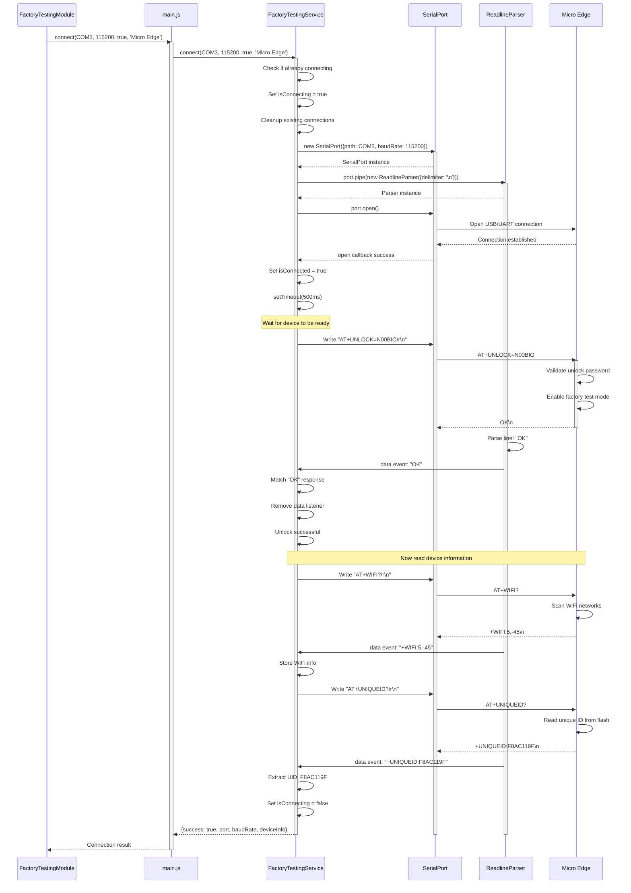

---

## Individual Test Sequences

### WiFi Test Sequence

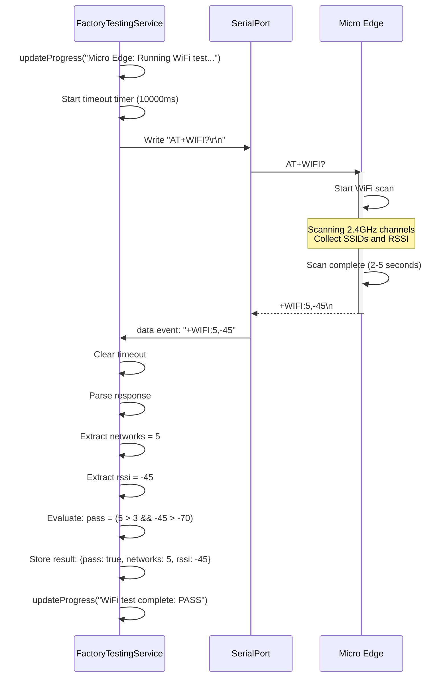

### LoRa Test Sequence

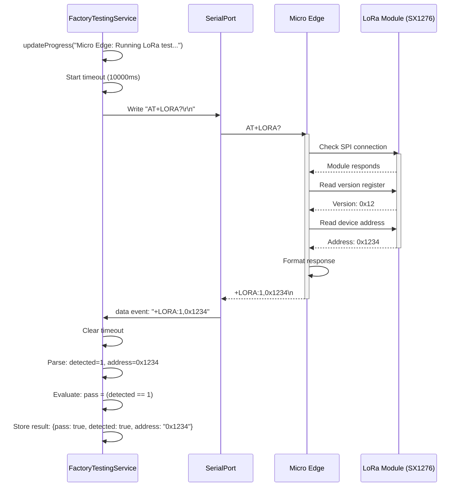

### Pulse Counter Test Sequence

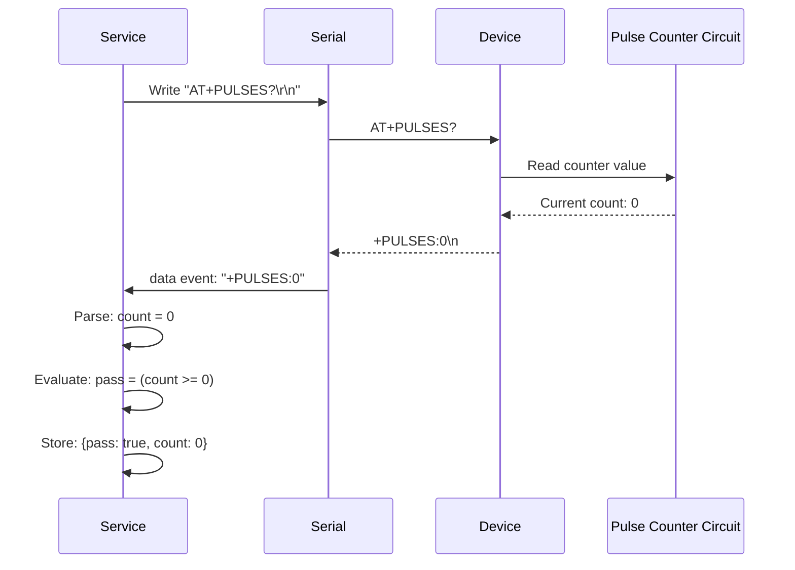

### Analog Input Test Sequence

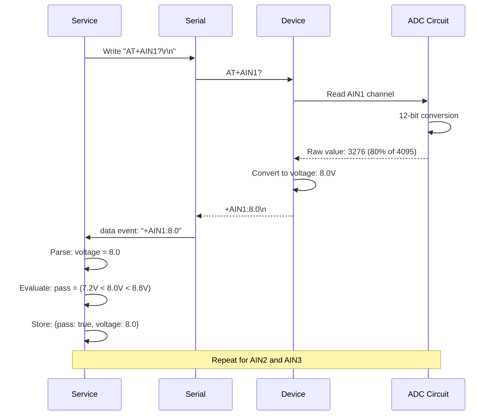

### Relay Control Test Sequence

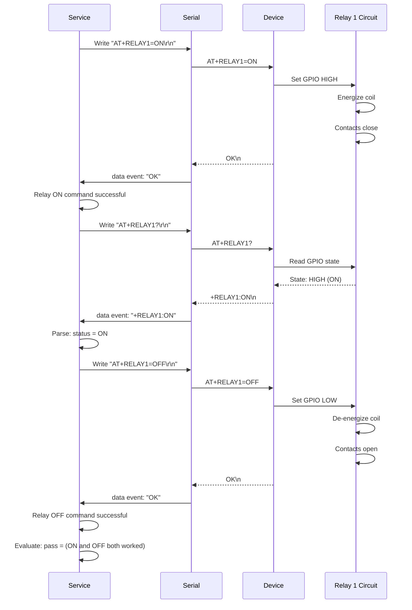

---

## Result Processing

### Compilation and Evaluation

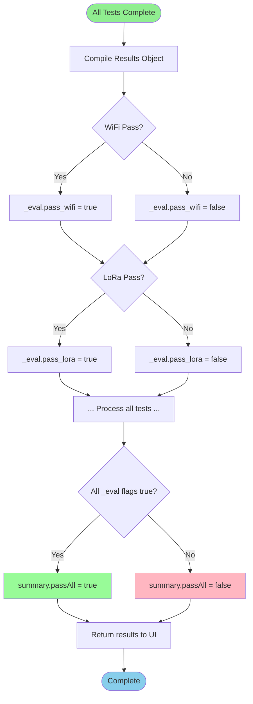

### Result Storage Sequence

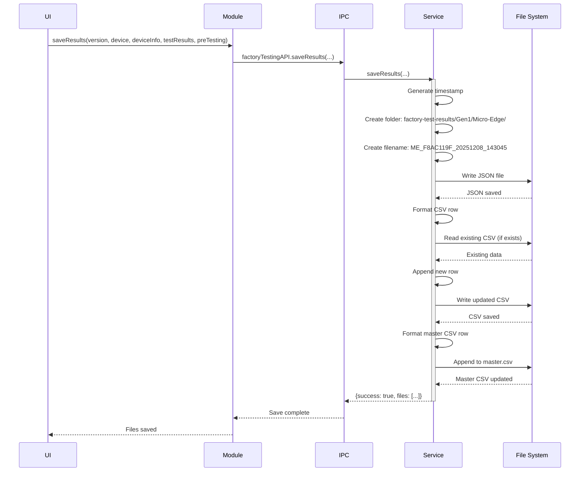

---

## Error Handling

### Timeout Handling

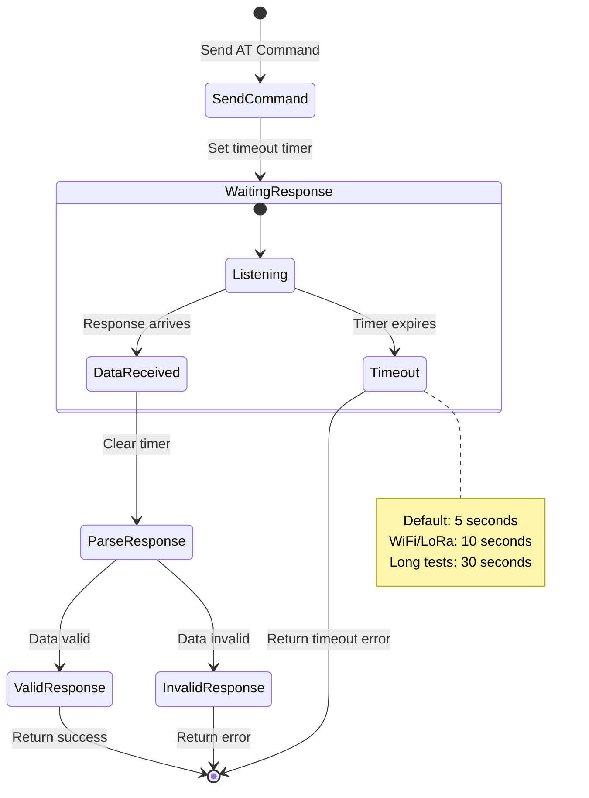

### Connection Error Recovery

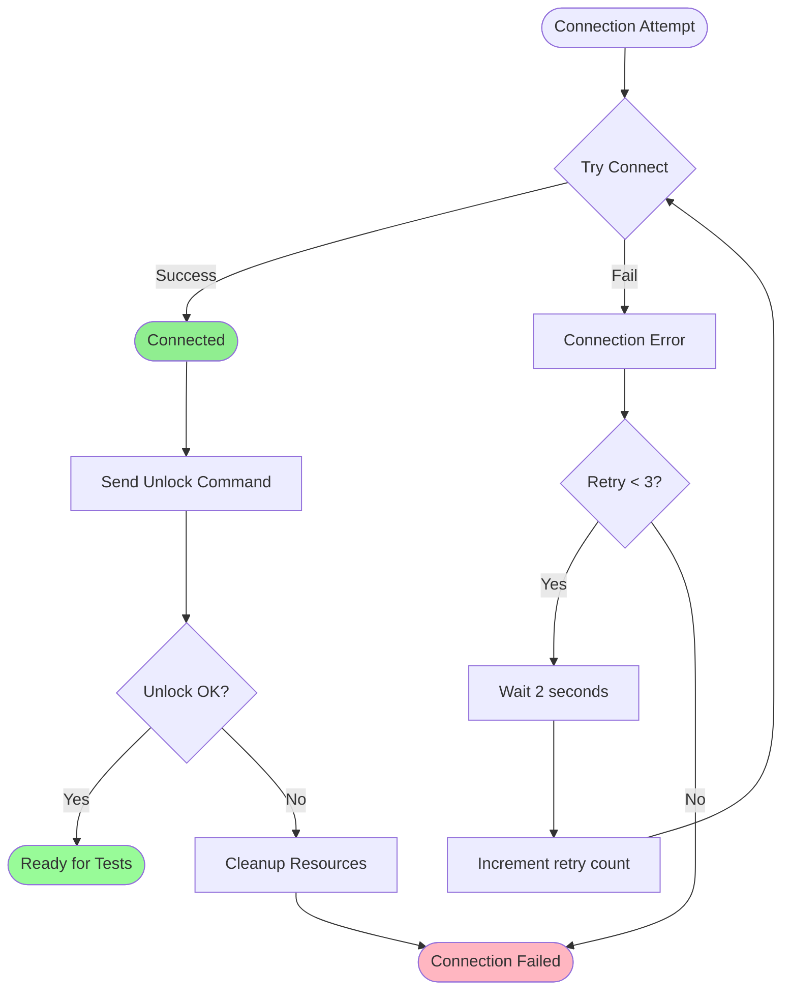

### Test Failure Handling

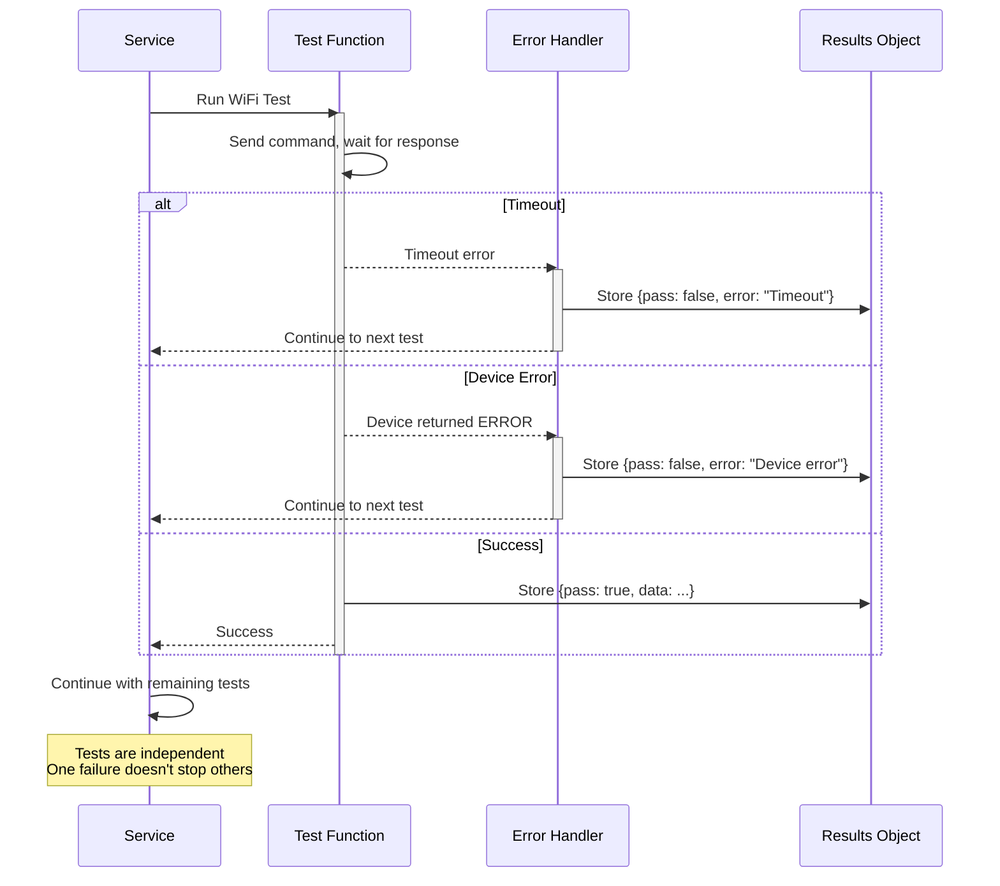

---

## State Machine

### Overall Test State

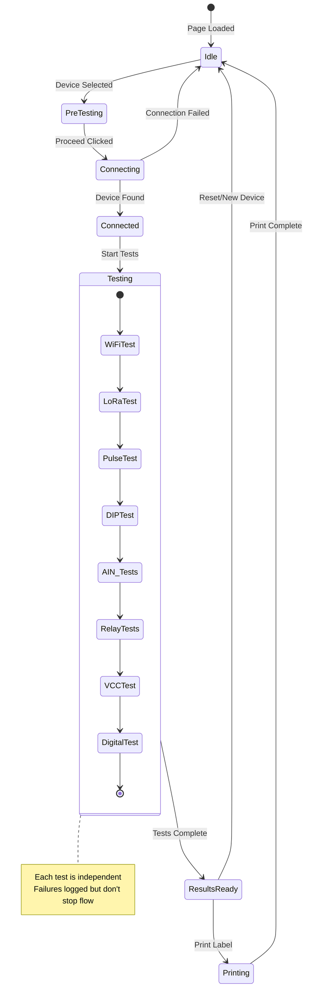

---

## 📊 Summary

### Key Takeaways

1. **Connection is Critical** - Must unlock device before testing
2. **Tests are Sequential** - But independent (one fail doesn't stop others)
3. **Timeouts are Essential** - Prevent hanging on faulty devices
4. **Progress Updates** - Keep UI responsive during long tests
5. **Result Compilation** - All results stored for analysis

### Timing Breakdown

| Phase | Duration | Can Fail? |
|-------|----------|-----------|
| Connection | 2-5s | Yes - critical |
| Unlock | 1s | Yes - critical |
| Device Info | 2-3s | No - optional |
| WiFi Test | 3-5s | Yes - logged |
| LoRa Test | 2-3s | Yes - logged |
| Other Tests | 20-30s | Yes - logged |
| **Total** | **30-50s** | **Continues on failure** |

---

**Next:** See [Test Cases](./MicroEdge-TestCases.md) for detailed test specifications
