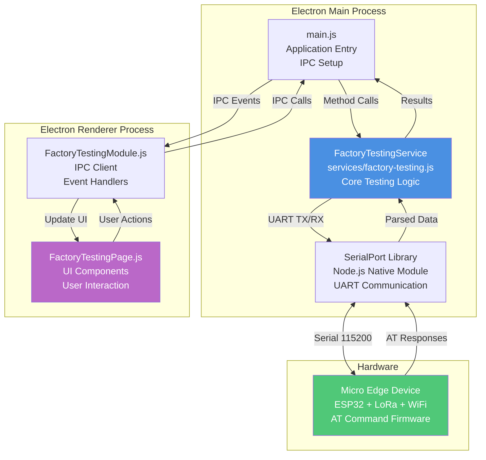
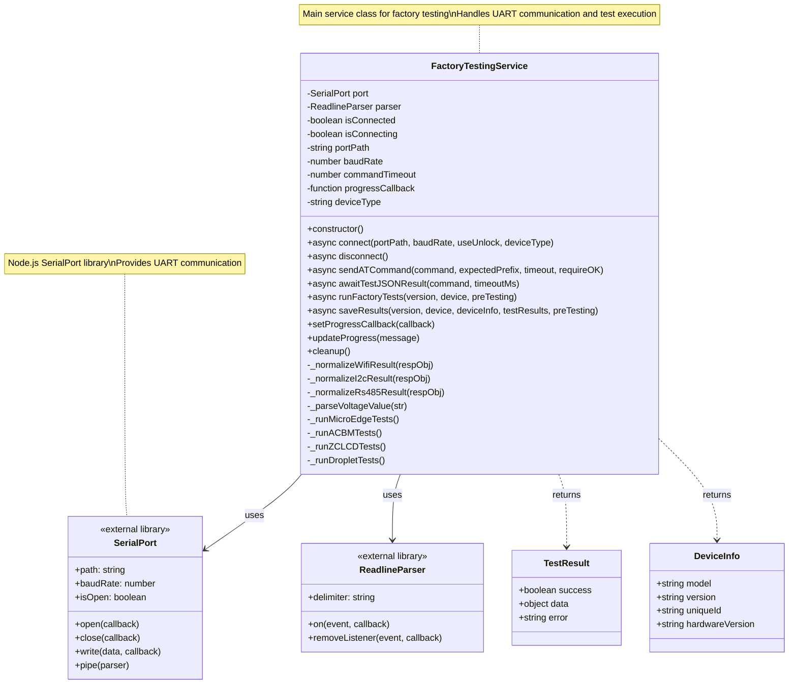
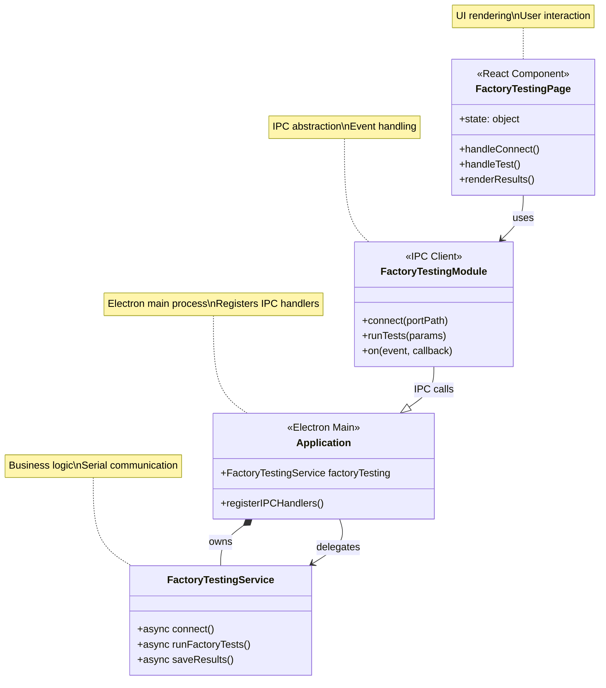
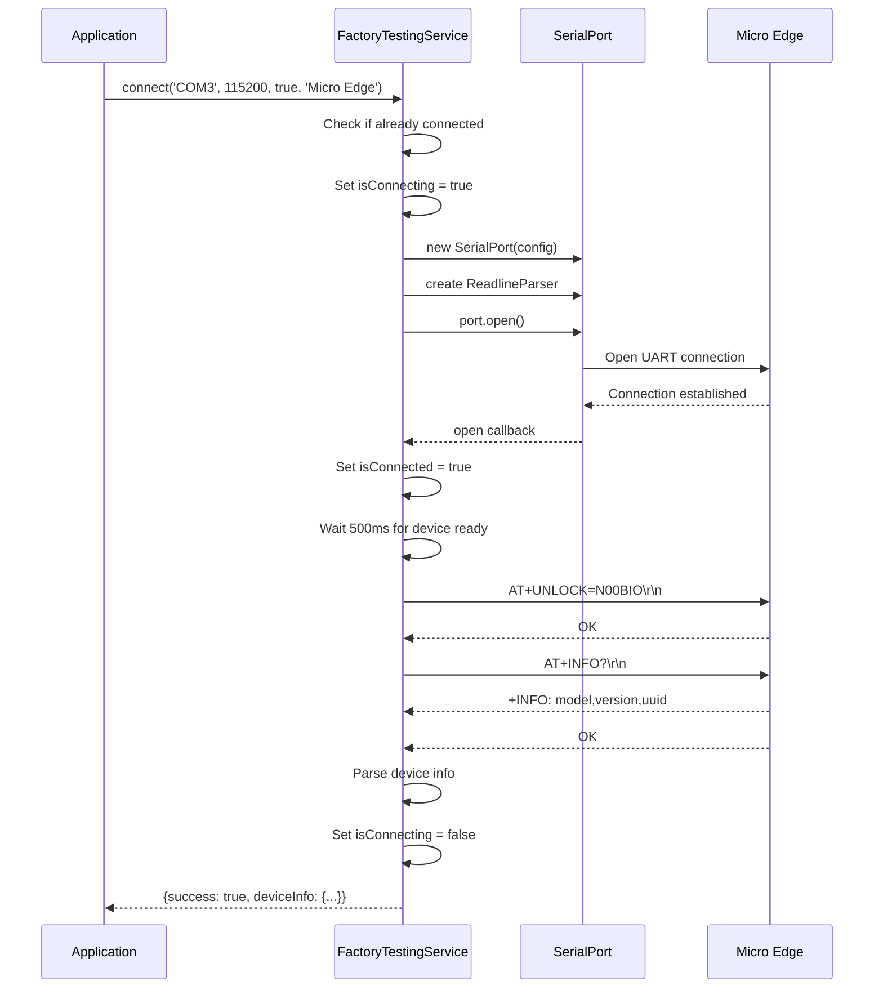
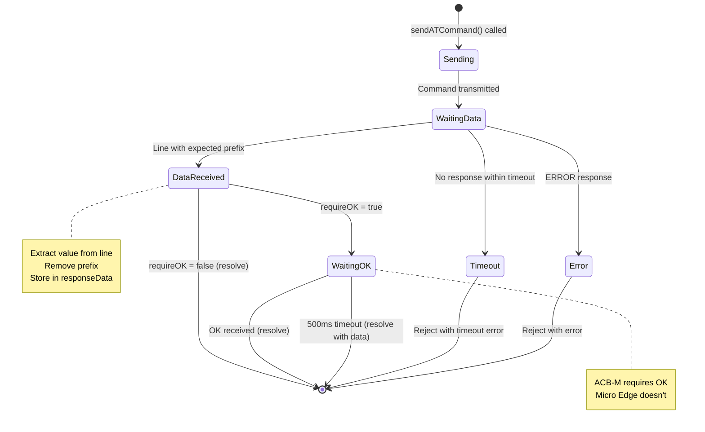
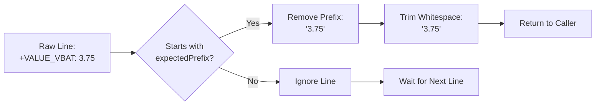
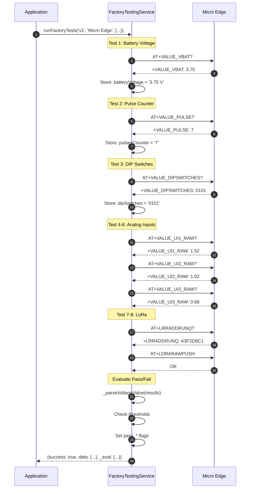

# Micro Edge - Source Code Manual

**Device Type:** GEN-1 (ESP32-based)  
**Target Audience:** Developers, Maintainers, Code Contributors  
**Last Updated:** December 8, 2025

---

## Table of Contents

- [Architecture Overview](#architecture-overview)
- [Class Diagrams](#class-diagrams)
- [File Structure](#file-structure)
- [FactoryTestingService Class](#factorytestingservice-class)
- [Method Reference](#method-reference)
- [Data Structures](#data-structures)
- [Communication Protocol](#communication-protocol)
- [Adding New Tests](#adding-new-tests)
- [Debugging Guide](#debugging-guide)
- [Code Maintenance](#code-maintenance)

---

## Architecture Overview

### System Architecture



### Component Diagram

```mermaid
graph LR
    subgraph "Presentation Layer"
        UI[FactoryTestingPage<br/>React Component]
        FORMS[Pre-Testing Forms<br/>Device Selection<br/>Progress Display]
    end
    
    subgraph "Application Layer"
        IPC_CLIENT[FactoryTestingModule<br/>IPC Client Wrapper]
        STATE[State Management<br/>Auto-connect Logic<br/>Result Processing]
    end
    
    subgraph "Business Logic Layer"
        FTS_SERVICE[FactoryTestingService<br/>Test Orchestration]
        TEST_RUNNER[runFactoryTests()<br/>Device-Specific Logic]
        EVALUATOR[Test Evaluation<br/>Pass/Fail Criteria]
    end
    
    subgraph "Data Access Layer"
        SERIAL_MGR[Serial Communication<br/>connect() / disconnect()]
        AT_CMD[AT Command Handler<br/>sendATCommand()]
        PARSER[Response Parser<br/>awaitTestJSONResult()]
    end
    
    subgraph "Infrastructure"
        NODE_SERIAL[node-serialport<br/>Native Module]
        FS[File System<br/>CSV / JSON Save]
        PRINTER[Printer Service<br/>Python Script]
    end
    
    UI --> IPC_CLIENT
    IPC_CLIENT --> FTS_SERVICE
    FTS_SERVICE --> TEST_RUNNER
    TEST_RUNNER --> EVALUATOR
    TEST_RUNNER --> AT_CMD
    AT_CMD --> SERIAL_MGR
    SERIAL_MGR --> NODE_SERIAL
    EVALUATOR --> FS
    FTS_SERVICE --> PRINTER
    
    style FTS_SERVICE fill:#4A90E2,color:#fff
    style TEST_RUNNER fill:#FFB74D,color:#fff
```

---

## Class Diagrams

### FactoryTestingService Class Structure



### Class Relationships



---

## File Structure

### Source Code Locations

```
NubeiO-Eol-Toolkit/
│
├── main.js                                    # Electron main process entry
│   ├── Line 21: require factory-testing.js
│   ├── Line 145: const factoryTesting = new FactoryTestingService()
│   ├── Line 1390-1444: IPC handler registration
│   └── IPC handlers:
│       ├── factory-testing:connect
│       ├── factory-testing:disconnect
│       ├── factory-testing:run-tests
│       ├── factory-testing:save-results
│       └── factory-testing:print-label
│
├── services/
│   └── factory-testing.js                     # Core testing service
│       ├── Line 13: class FactoryTestingService
│       ├── Line 30: awaitTestJSONResult()
│       ├── Line 88: _normalizeWifiResult()
│       ├── Line 108: _normalizeI2cResult()
│       ├── Line 132: _normalizeRs485Result()
│       ├── Line 159: connect()
│       ├── Line 378: disconnect()
│       ├── Line 414: sendATCommand()
│       ├── Line 549: readDeviceInfo()
│       ├── Line 703: readEsp32MAC()
│       ├── Line 858: isMicroEdge()
│       ├── Line 871: isZCController()
│       ├── Line 1032: runFactoryTests() [MAIN TEST ROUTER]
│       ├── Line 1200: ACB-M tests
│       ├── Line 1280: ZC-LCD tests
│       ├── Line 1362: ZC-Controller tests
│       ├── Line 1430: Droplet tests
│       ├── Line 1494: Micro Edge tests ⭐
│       ├── Line 1608: Pass/fail evaluation ⭐
│       ├── Line 1653: saveResults()
│       ├── Line 1845: printLabel()
│       └── Line 2290: Helper methods
│
├── renderer/
│   ├── pages/
│   │   └── FactoryTestingPage.js              # UI page component
│   │       ├── Line 6: class FactoryTestingPage
│   │       ├── Line 13-15: Device arrays
│   │       ├── Line 50: state management
│   │       ├── Line 140: handleConnect()
│   │       ├── Line 300: handleRunTests()
│   │       ├── Line 450: renderPreTestingForm()
│   │       ├── Line 650: renderResults()
│   │       └── Line 2800: render()
│   │
│   └── modules/
│       └── FactoryTestingModule.js            # IPC client module
│           ├── Line 10: connect()
│           ├── Line 30: disconnect()
│           ├── Line 50: runTests()
│           ├── Line 75: saveResults()
│           ├── Line 100: onProgress()
│           └── Line 130: onTestComplete()
│
└── embedded/
    └── [Device firmware - AT command implementation]
```

---

## FactoryTestingService Class

### Constructor

**Location:** `services/factory-testing.js` Line 13-24

```javascript
class FactoryTestingService {
  constructor() {
    this.port = null;                  // SerialPort instance
    this.parser = null;                // ReadlineParser instance
    this.isConnected = false;          // Connection state flag
    this.isConnecting = false;         // Prevent concurrent connections
    this.portPath = '';                // COM port path (e.g., 'COM3')
    this.baudRate = 115200;            // Fixed baud rate for all devices
    this.commandTimeout = 5000;        // Default 5 seconds for AT commands
    this.progressCallback = null;      // Callback for UI progress updates
  }
}
```

**Properties:**

| Property | Type | Default | Purpose |
|----------|------|---------|---------|
| `port` | SerialPort \| null | null | Active serial port connection |
| `parser` | ReadlineParser \| null | null | Line-based data parser |
| `isConnected` | boolean | false | Connection established flag |
| `isConnecting` | boolean | false | Connection in progress flag |
| `portPath` | string | '' | COM port identifier |
| `baudRate` | number | 115200 | Serial communication speed |
| `commandTimeout` | number | 5000 | AT command timeout (ms) |
| `progressCallback` | function \| null | null | Progress update handler |

---

## Method Reference

### Public Methods

### connect()

**Location:** Line 159-376  
**Purpose:** Establish UART connection to device and perform unlock sequence

**Signature:**
```javascript
async connect(portPath, baudRate = 115200, useUnlock = true, deviceType = null)
```

**Parameters:**

| Parameter | Type | Default | Description |
|-----------|------|---------|-------------|
| `portPath` | string | required | COM port path (e.g., 'COM3', '/dev/ttyUSB0') |
| `baudRate` | number | 115200 | Serial baud rate |
| `useUnlock` | boolean | true | Send AT+UNLOCK command for AT-based devices |
| `deviceType` | string | null | Device type identifier ('Micro Edge', 'ACB-M', etc.) |

**Returns:**
```javascript
{
  success: boolean,
  port?: string,
  baudRate?: number,
  deviceInfo?: {
    model: string,
    version: string,
    uniqueId: string
  },
  error?: string
}
```

**Flow Diagram:**



**Usage Example:**
```javascript
const service = new FactoryTestingService();
const result = await service.connect('COM3', 115200, true, 'Micro Edge');

if (result.success) {
  console.log('Connected to:', result.deviceInfo.model);
  console.log('UUID:', result.deviceInfo.uniqueId);
} else {
  console.error('Connection failed:', result.error);
}
```

**Error Handling:**

| Error | Cause | Recovery |
|-------|-------|----------|
| "Already connected" | connect() called twice | Call disconnect() first |
| "Connection already in progress" | Concurrent connect() calls | Wait for first to complete |
| "Failed to open port" | COM port not found | Check device connection, COM port number |
| "Timeout waiting for OK" | Unlock failed | Check device firmware, retry |

---

### sendATCommand()

**Location:** Line 414-548  
**Purpose:** Send AT command and wait for expected response

**Signature:**
```javascript
async sendATCommand(command, expectedPrefix, customTimeout = null, requireOK = true)
```

**Parameters:**

| Parameter | Type | Default | Description |
|-----------|------|---------|-------------|
| `command` | string | required | AT command without \r\n |
| `expectedPrefix` | string | required | Expected response prefix (e.g., '+VALUE_VBAT:') |
| `customTimeout` | number | null | Override default timeout (ms) |
| `requireOK` | boolean | true | Wait for 'OK' after data (false for Micro Edge) |

**Returns:**
```javascript
Promise<string> // Response line with prefix removed
```

**State Machine:**



**Usage Example:**
```javascript
// Micro Edge (no OK required)
const voltage = await service.sendATCommand(
  'AT+VALUE_VBAT?',     // Command
  '+VALUE_VBAT:',       // Expected prefix
  5000,                 // 5 second timeout
  false                 // Don't require OK
);
// Returns: "3.75" (prefix removed, just value)

// ACB-M (OK required)
const rtc = await service.sendATCommand(
  'AT+RTC?',
  '+RTC:',
  5000,
  true  // Wait for OK
);
```

**Response Parsing:**



---

### awaitTestJSONResult()

**Location:** Line 30-87  
**Purpose:** Send test_* command and wait for JSON response

**Signature:**
```javascript
async awaitTestJSONResult(command, timeoutMs = 10000)
```

**Parameters:**

| Parameter | Type | Default | Description |
|-----------|------|---------|-------------|
| `command` | string | required | Test command (e.g., 'test_wifi') |
| `timeoutMs` | number | 10000 | Timeout in milliseconds |

**Returns:**
```javascript
{
  raw: string,      // Raw response line
  parsed: object,   // JSON.parse() result (null if not JSON)
  success: boolean  // true if result=done/OK, false otherwise
}
```

**Usage Example:**
```javascript
// Send WiFi test (returns JSON)
const result = await service.awaitTestJSONResult('test_wifi', 15000);

if (result.success && result.parsed) {
  console.log('Networks found:', result.parsed.networks.length);
  result.parsed.networks.forEach(net => {
    console.log(`  ${net.ssid}: ${net.rssi} dBm`);
  });
} else {
  console.error('WiFi test failed:', result.raw);
}
```

---

### runFactoryTests()

**Location:** Line 1032-1652  
**Purpose:** Execute complete test suite for specified device

**Signature:**
```javascript
async runFactoryTests(version, device, preTesting)
```

**Parameters:**

| Parameter | Type | Description |
|-----------|------|-------------|
| `version` | string | Device generation ('v1' or 'v2') |
| `device` | string | Device type ('Micro Edge', 'ACB-M', etc.) |
| `preTesting` | object | Pre-testing form data (PCB ID, lot, operator, etc.) |

**Returns:**
```javascript
{
  success: boolean,
  data?: object,     // Test results
  error?: string
}
```

**Device Router:**

```mermaid
flowchart TD
    START([runFactoryTests]) --> PROGRESS[Update Progress:<br/>'Starting tests...']
    PROGRESS --> DEVICE{Device Type?}
    
    DEVICE -->|ACB-M| ACBM[Run ACB-M Tests<br/>Line 1200-1279]
    DEVICE -->|ZC-LCD| ZCLCD[Run ZC-LCD Tests<br/>Line 1280-1361]
    DEVICE -->|ZC-Controller| ZCCTRL[Run ZC-Controller Tests<br/>Line 1362-1429]
    DEVICE -->|Droplet| DROPLET[Run Droplet Tests<br/>Line 1430-1493]
    DEVICE -->|Micro Edge<br/>(default)| MICROEDGE[Run Micro Edge Tests<br/>Line 1494-1652]
    
    ACBM --> RETURN[Return Results]
    ZCLCD --> RETURN
    ZCCTRL --> RETURN
    DROPLET --> RETURN
    MICROEDGE --> EVAL[Evaluate Pass/Fail<br/>Line 1608-1641]
    
    EVAL --> RETURN
    RETURN --> END([End])
    
    style MICROEDGE fill:#4A90E2,color:#fff
    style EVAL fill:#FFB74D,color:#fff
```

**Micro Edge Test Sequence:**



---

### saveResults()

**Location:** Line 1653-1844  
**Purpose:** Save test results to JSON and CSV files

**Signature:**
```javascript
async saveResults(version, device, deviceInfo, testResults, preTesting)
```

**Parameters:**

| Parameter | Type | Description |
|-----------|------|-------------|
| `version` | string | Device generation |
| `device` | string | Device type |
| `deviceInfo` | object | Device identification (UUID, model, etc.) |
| `testResults` | object | Test results from runFactoryTests() |
| `preTesting` | object | Pre-testing form data |

**File Structure:**

```
Documents/
└── NubeIO-Factory-Testing/
    └── Micro Edge/
        └── {uniqueID}/
            ├── test-results.json          # Individual test JSON
            └── Micro Edge-master.csv      # Appended to master CSV
```

**CSV Format:**
```csv
Date,Time,PCB_ID,Lot,Operator,Battery_V,Battery_Pass,AIN1_V,AIN1_Pass,...
2025-12-08,10:30:15,ME-001234,LOT-W50,John,3.75,PASS,1.52,PASS,...
```

---

### Private/Helper Methods

### _parseVoltageValue()

**Location:** Line 2290  
**Purpose:** Extract numeric voltage from string

```javascript
_parseVoltageValue(str) {
  // Input: "3.75 V" or "1.52V" or "3.75"
  // Output: 3.75 (number) or null if unparseable
  
  const match = String(str || '').match(/([0-9.]+)/);
  if (!match) return null;
  const val = parseFloat(match[1]);
  return Number.isNaN(val) ? null : val;
}
```

---

## Data Structures

### TestResults (Micro Edge)

```javascript
{
  batteryVoltage: "3.75 V",      // string with unit
  pulsesCounter: "7",            // string integer
  dipSwitches: "0101",           // 4-char binary string
  ain1Voltage: "1.52 V",         // string with unit
  ain2Voltage: "1.02 V",
  ain3Voltage: "0.68 V",
  loraAddress: "A3F2D8C1",       // 8-char hex
  loraDetect: "A3F2D8C1",        // same as loraAddress
  loraRawPush: "OK",             // 'OK' or 'ERROR'
  
  _eval: {                       // Pass/fail flags (added by service)
    pass_battery: true,
    pass_ain1: true,
    pass_ain2: true,
    pass_ain3: true,
    pass_pulses: true,
    pass_lora: true
  }
}
```

### DeviceInfo

```javascript
{
  model: "Micro Edge",           // Device model name
  version: "1.0.2",              // Firmware version
  uniqueId: "A3F2D8C1",          // UUID or MAC address
  hardwareVersion: "v1.2"        // Optional hardware revision
}
```

### PreTesting

```javascript
{
  pcbId: "ME-2025-001234",       // PCB identifier
  lot: "LOT-2025-W50",           // Manufacturing lot
  operator: "John Doe",          // Test operator name
  date: "2025-12-08",            // Test date
  notes: "Optional notes"        // Free-form notes
}
```

---

## Communication Protocol

### AT Command Protocol

**Format:**
```
Command:  AT+<CMD>[=<param>][?]\r\n
Response: [+<PREFIX>: <data>\n]OK\n
          OR
          ERROR\n
```

**Example Query:**
```
TX: AT+VALUE_VBAT?\r\n
RX: +VALUE_VBAT: 3.75\n
RX: OK\n
```

**Example Set:**
```
TX: AT+RELAY=1\r\n
RX: OK\n
```

### AT Command Reference (Micro Edge)

| Command | Response Prefix | Purpose | Typical Duration |
|---------|-----------------|---------|------------------|
| `AT+UNLOCK=N00BIO` | - | Unlock device for testing | 100ms |
| `AT+INFO?` | `+INFO:` | Get device info | 100ms |
| `AT+VALUE_VBAT?` | `+VALUE_VBAT:` | Read battery voltage | 200ms |
| `AT+VALUE_PULSE?` | `+VALUE_PULSE:` | Read pulse count | 200ms |
| `AT+VALUE_DIPSWITCHES?` | `+VALUE_DIPSWITCHES:` | Read DIP state | 200ms |
| `AT+VALUE_UI1_RAW?` | `+VALUE_UI1_RAW:` | Read AIN1 | 200ms |
| `AT+VALUE_UI2_RAW?` | `+VALUE_UI2_RAW:` | Read AIN2 | 200ms |
| `AT+VALUE_UI3_RAW?` | `+VALUE_UI3_RAW:` | Read AIN3 | 200ms |
| `AT+LRRADDRUNQ?` | `+LRRADDRUNQ:` | Get LoRa address | 500ms |
| `AT+LORARAWPUSH` | - | Transmit LoRa packet | 1000ms |
| `AT+WIFI?` | (JSON) | Scan WiFi networks | 5-10 sec |
| `AT+RELAY=<0|1>` | - | Control relay | 100ms |

---

## Adding New Tests

### Step-by-Step Guide

**1. Define the Test in Firmware**

First, implement the AT command in the device firmware. Example:
```c
// In device firmware (ESP32)
void handle_at_command(char *cmd) {
  if (strcmp(cmd, "AT+NEW_SENSOR?") == 0) {
    float sensor_value = read_new_sensor();
    printf("+NEW_SENSOR: %.2f\n", sensor_value);
    printf("OK\n");
  }
}
```

**2. Add Test to runFactoryTests()**

Edit `services/factory-testing.js` Line ~1600:

```javascript
// After existing tests, add new test
this.updateProgress('Testing new sensor...');
try {
  const sensorResponse = await this.sendATCommand(
    'AT+NEW_SENSOR?',
    '+NEW_SENSOR:',
    5000,        // 5 second timeout
    false        // Micro Edge doesn't require OK
  );
  results.newSensor = sensorResponse.replace('+NEW_SENSOR:', '').trim();
} catch (error) {
  results.newSensor = 'ERROR';
}
```

**3. Add Pass/Fail Evaluation**

Edit Line ~1620:

```javascript
// Add evaluation logic
const sensorValue = parseFloat(results.newSensor);
evalFlags.pass_newSensor = !Number.isNaN(sensorValue) && 
                           sensorValue >= 10.0 && 
                           sensorValue <= 50.0;
```

**4. Update UI Display**

Edit `renderer/pages/FactoryTestingPage.js` Line ~700:

```javascript
renderResults() {
  // ... existing result rows ...
  
  // Add new row
  <div className="result-row">
    <span className="label">New Sensor:</span>
    <span className="value">{this.state.results.newSensor}</span>
    <span className={`status ${this.state.results._eval.pass_newSensor ? 'pass' : 'fail'}`}>
      {this.state.results._eval.pass_newSensor ? '✓ PASS' : '✗ FAIL'}
    </span>
  </div>
}
```

**5. Update CSV Export**

Edit `services/factory-testing.js` Line ~1750:

```javascript
// Add to CSV header
const header = 'Date,Time,PCB_ID,Lot,Operator,Battery_V,Battery_Pass,...,NewSensor,NewSensor_Pass,Overall\n';

// Add to CSV row
const row = `${date},${time},${pcbId},${lot},${operator},...,${results.newSensor},${evalFlags.pass_newSensor ? 'PASS' : 'FAIL'},${overall}\n`;
```

**6. Test Your Changes**

```bash
# Restart application
npm run dev

# Connect to device
# Run tests
# Verify new test executes
# Check CSV file has new columns
```

---

## Debugging Guide

### Enable Verbose Logging

**Set DEBUG mode:**

Edit `services/factory-testing.js` Line 10:

```javascript
const DEBUG = true;  // Enable detailed console logs

class FactoryTestingService {
  log(message) {
    if (DEBUG) console.log(`[FTS] ${message}`);
  }
}
```

### Common Debug Scenarios

#### 1. AT Command Not Responding

**Symptom:** Timeout on sendATCommand()

**Debug Steps:**
```javascript
// Add logging in sendATCommand() Line 440
const onData = (data) => {
  const line = data.toString().trim();
  console.log(`[DEBUG] RX: "${line}" | expecting: "${expectedPrefix}"`);
  
  // Check if prefix matches
  if (line.startsWith(expectedPrefix)) {
    console.log('[DEBUG] Prefix matched!');
  } else {
    console.log('[DEBUG] Prefix not matched');
  }
};
```

**Check:**
- Is device sending \r\n or just \n?
- Is expectedPrefix correct (case-sensitive)?
- Is baud rate correct (115200)?

#### 2. Test Fails Intermittently

**Symptom:** Test passes sometimes, fails others

**Debug Steps:**
```javascript
// Add timing logs
console.log('[DEBUG] Test start:', Date.now());
const result = await this.sendATCommand(...);
console.log('[DEBUG] Test end:', Date.now());
console.log('[DEBUG] Result:', result);
```

**Common Causes:**
- Race condition in parser
- Timeout too short
- Device not ready (need longer delay)

#### 3. Pass/Fail Evaluation Wrong

**Symptom:** Test shows PASS but should be FAIL

**Debug Steps:**
```javascript
// Add evaluation logging
const bv = this._parseVoltageValue(results.batteryVoltage);
console.log('[DEBUG] Battery voltage parsed:', bv);
console.log('[DEBUG] Pass criteria: 2.5 <= V <= 4.5');
console.log('[DEBUG] Result:', bv >= 2.5 && bv <= 4.5);
```

**Check:**
- Are thresholds correct?
- Is parsing working (_parseVoltageValue)?
- Are units consistent (V vs mV)?

### Debugging Tools

**1. Electron DevTools Console**

Press F12 to open DevTools, check Console tab for logs.

**2. Serial Monitor**

Use external serial monitor to see raw UART traffic:
```bash
# Windows
mode COM3 BAUD=115200 PARITY=N DATA=8 STOP=1

# Linux
screen /dev/ttyUSB0 115200

# Send test commands manually
AT+VALUE_VBAT?
```

**3. Logic Analyzer**

Connect logic analyzer to TX/RX lines to capture timing issues.

**4. Node Inspect**

Run Electron with Node inspector:
```bash
npm run dev -- --inspect-brk=5858
```

Then attach Chrome DevTools to debug Node.js code.

---

## Code Maintenance

### Code Style Guidelines

**1. Naming Conventions:**
- Classes: PascalCase (`FactoryTestingService`)
- Methods: camelCase (`sendATCommand`)
- Private methods: underscore prefix (`_parseVoltageValue`)
- Constants: UPPER_SNAKE_CASE (`COMMAND_TIMEOUT`)

**2. Async/Await:**
- Always use async/await, not callbacks
- Always handle errors with try/catch

**Example:**
```javascript
// Good
async runTest() {
  try {
    const result = await this.sendATCommand('AT+TEST?', '+TEST:');
    return result;
  } catch (error) {
    console.error('Test failed:', error);
    return 'ERROR';
  }
}

// Bad
runTest(callback) {
  this.sendATCommand('AT+TEST?', '+TEST:', (err, result) => {
    if (err) callback(err);
    else callback(null, result);
  });
}
```

**3. Error Handling:**
- Always catch errors in test loops
- Don't let one test failure stop others
- Return 'ERROR' string for UI display

**4. Progress Updates:**
- Call `updateProgress()` before each test
- Provide descriptive messages for users
- Update at ~10-20% intervals

### Adding New Devices

**Template for new device:**

```javascript
// In runFactoryTests() Line ~1650

if (device === 'NewDevice') {
  console.log('[Factory Testing] Running NewDevice tests');
  const resultsNew = {};
  
  // Test 1: Device-specific test
  this.updateProgress('Testing feature 1...');
  try {
    const resp1 = await this.sendATCommand('AT+FEATURE1?', '+FEATURE1:');
    resultsNew.feature1 = resp1.replace('+FEATURE1:', '').trim();
  } catch (error) {
    resultsNew.feature1 = 'ERROR';
  }
  
  // Test 2: Another test
  this.updateProgress('Testing feature 2...');
  try {
    const resp2 = await this.sendATCommand('AT+FEATURE2?', '+FEATURE2:');
    resultsNew.feature2 = resp2.replace('+FEATURE2:', '').trim();
  } catch (error) {
    resultsNew.feature2 = 'ERROR';
  }
  
  // Evaluate pass/fail
  try {
    const evalFlags = {};
    evalFlags.pass_feature1 = resultsNew.feature1 !== 'ERROR';
    evalFlags.pass_feature2 = resultsNew.feature2 !== 'ERROR';
    resultsNew._eval = evalFlags;
  } catch (e) {
    console.warn('[Factory Testing] Evaluation failed:', e.message);
  }
  
  this.updateProgress('NewDevice tests completed');
  return { success: true, data: resultsNew };
}
```

### Testing Checklist

Before committing code changes:

- [ ] Code follows style guidelines
- [ ] All methods have JSDoc comments
- [ ] Error handling in place
- [ ] Progress updates added
- [ ] Pass/fail evaluation implemented
- [ ] CSV export updated
- [ ] UI displays new fields
- [ ] Tested on real hardware
- [ ] Tested with simulated errors (unplug device mid-test)
- [ ] Verified CSV file format
- [ ] Documentation updated

### Performance Optimization

**1. Reduce Timeout Waste:**

If you know a command is fast, use shorter timeout:
```javascript
// Bad: Always 5 seconds
const result = await this.sendATCommand('AT+FAST?', '+FAST:');

// Good: 1 second is enough
const result = await this.sendATCommand('AT+FAST?', '+FAST:', 1000);
```

**2. Parallel Tests (if independent):**

```javascript
// Sequential (slow)
const test1 = await sendATCommand('AT+TEST1?', '+TEST1:');
const test2 = await sendATCommand('AT+TEST2?', '+TEST2:');

// Parallel (fast) - only if tests don't interfere
const [test1, test2] = await Promise.all([
  sendATCommand('AT+TEST1?', '+TEST1:'),
  sendATCommand('AT+TEST2?', '+TEST2:')
]);
```

**Warning:** Most devices can only handle one AT command at a time, so parallel execution usually won't work. Only use for truly independent operations.

---

## Related Documentation

- **[Hardware Overview](./MicroEdge-Overview.md)** - Hardware specifications
- **[Test Cases](./MicroEdge-TestCases.md)** - Test procedures
- **[Sequence Diagrams](./MicroEdge-Sequence.md)** - Detailed flows
- **[Troubleshooting](./MicroEdge-Troubleshooting.md)** - Common issues

---

## Revision History

| Version | Date | Author | Changes |
|---------|------|--------|---------|
| 1.0 | 2025-12-08 | Documentation Team | Initial source code manual with class diagrams |

---

**Next:** [Troubleshooting Guide →](./MicroEdge-Troubleshooting.md)
