# Micro Edge - Test Cases Documentation

**Device Type:** GEN-1 (ESP32-based)  
**Target Audience:** Test Operators, QA Engineers, Beginners  
**Last Updated:** December 8, 2025

---

## Table of Contents

- [Test Summary](#test-summary)
- [Pre-Testing Requirements](#pre-testing-requirements)
- [Test Execution Flow](#test-execution-flow)
- [Individual Test Cases](#individual-test-cases)
  - [TC-001: Battery Voltage Test](#tc-001-battery-voltage-test)
  - [TC-002: Pulse Counter Test](#tc-002-pulse-counter-test)
  - [TC-003: DIP Switch Test](#tc-003-dip-switch-test)
  - [TC-004: Analog Input 1 Test](#tc-004-analog-input-1-test)
  - [TC-005: Analog Input 2 Test](#tc-005-analog-input-2-test)
  - [TC-006: Analog Input 3 Test](#tc-006-analog-input-3-test)
  - [TC-007: LoRa Detection Test](#tc-007-lora-detection-test)
  - [TC-008: LoRa Transmission Test](#tc-008-lora-transmission-test)
  - [TC-009: WiFi Scan Test](#tc-009-wifi-scan-test)
  - [TC-010: Relay Control Test](#tc-010-relay-control-test)
- [Pass/Fail Criteria](#passfail-criteria)
- [Test Results Interpretation](#test-results-interpretation)
- [Quick Troubleshooting](#quick-troubleshooting)

---

## Test Summary

### Test Coverage

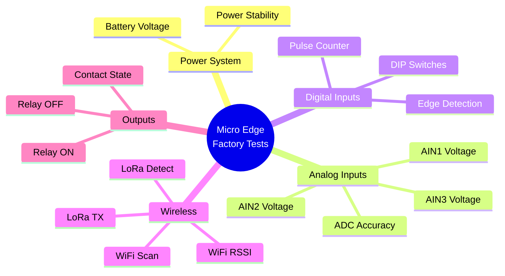

### Test Statistics

| Category | Test Count | Duration | Criticality |
|----------|------------|----------|-------------|
| **Power Tests** | 1 | ~2 sec | Critical |
| **Analog Tests** | 3 | ~6 sec | High |
| **Digital Tests** | 2 | ~4 sec | Medium |
| **Wireless Tests** | 4 | ~20 sec | Critical |
| **Output Tests** | 1 | ~3 sec | High |
| **TOTAL** | 11 | ~35-50 sec | - |

---

## Pre-Testing Requirements

### Test Fixture Setup

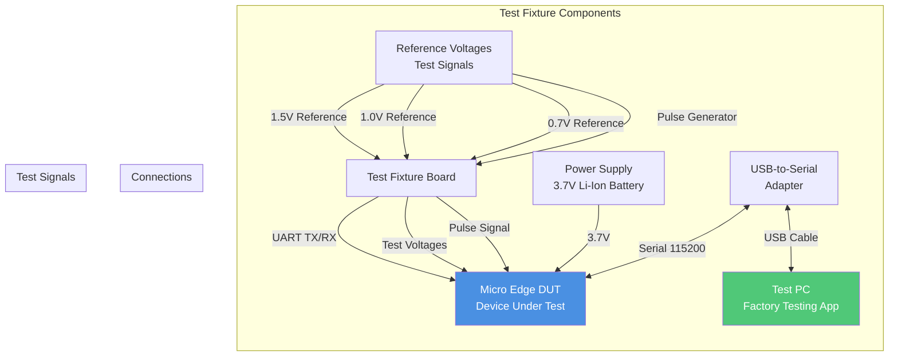

### Required Equipment

| Item | Specification | Quantity | Purpose |
|------|---------------|----------|---------|
| **Test PC** | Windows 10+, 4GB RAM | 1 | Run factory testing app |
| **USB-Serial Adapter** | FTDI FT232, 115200 baud | 1 | UART communication |
| **Test Fixture** | Custom NubeIO board | 1 | Apply test signals |
| **Power Supply** | 3.7V Li-Ion battery or bench PSU | 1 | Power the DUT |
| **Micro USB Cable** | 1m length | 1 | Connect adapter to PC |
| **Micro Edge DUT** | Production unit | 1 | Device under test |

### Test Environment

| Parameter | Requirement | Notes |
|-----------|-------------|-------|
| **Temperature** | 20-25°C | Room temperature |
| **Humidity** | 40-60% RH | Controlled environment |
| **WiFi Network** | 2.4GHz available | For WiFi scan test |
| **LoRa Gateway** | Within 10m | Optional, for RX verification |
| **Lighting** | Good visibility | Read DIP switches |
| **Workspace** | ESD-safe mat | Prevent static damage |

### Pre-Test Checklist

✅ **Hardware Preparation**
- [ ] Test fixture powered and calibrated
- [ ] USB-Serial adapter connected to PC
- [ ] Factory Testing software running
- [ ] DUT has battery installed or power connected
- [ ] All test signals verified with multimeter
- [ ] DIP switches in known position

✅ **Software Preparation**
- [ ] Factory Testing app version verified (latest)
- [ ] COM port detected and correct
- [ ] Pre-testing form filled out (PCB ID, Lot, Operator)
- [ ] Printer connected (for QR label)
- [ ] Results folder accessible

✅ **Safety**
- [ ] ESD wrist strap connected
- [ ] Workspace free of liquids
- [ ] Emergency stop accessible
- [ ] Proper lighting

---

## Test Execution Flow

### Overall Test Flowchart

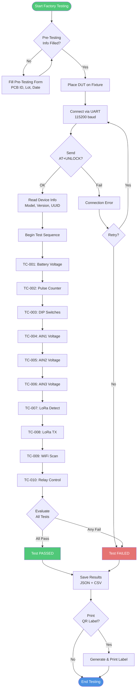

### Test Sequence State Machine

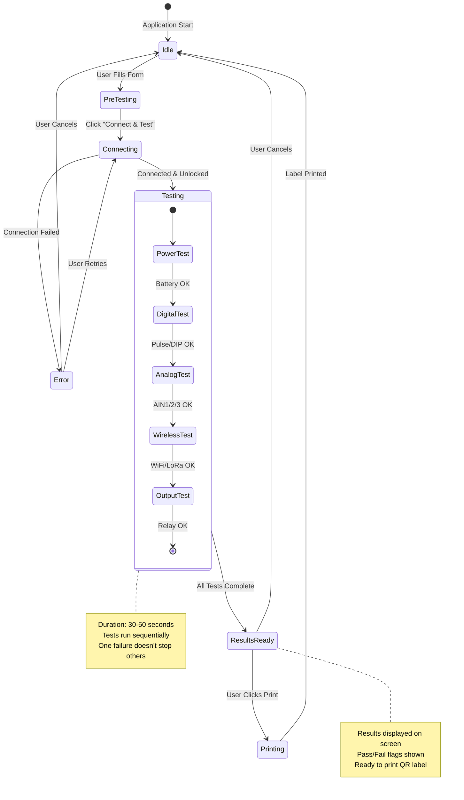

---

## Individual Test Cases

## TC-001: Battery Voltage Test

### Test Information

| Field | Value |
|-------|-------|
| **Test ID** | TC-001 |
| **Category** | Power System |
| **Priority** | Critical |
| **Duration** | ~2 seconds |
| **Dependencies** | None |

### Objective

Verify that the battery voltage is within acceptable operating range to ensure reliable device operation.

### Test Procedure

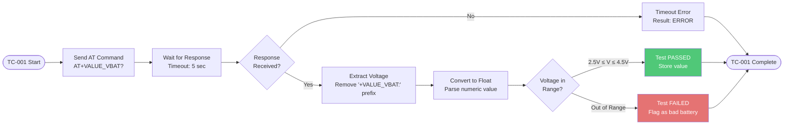

### AT Command Details

**Command:**
```
AT+VALUE_VBAT?
```

**Expected Response:**
```
+VALUE_VBAT: 3.75
OK
```

**Response Format:**
- Prefix: `+VALUE_VBAT:`
- Value: Floating point number (volts)
- Unit: Volts (V)

### Pass/Fail Criteria

| Parameter | Min | Typical | Max | Unit |
|-----------|-----|---------|-----|------|
| **Battery Voltage** | 2.5 | 3.7 | 4.5 | V |

**Pass Conditions:**
✅ Response received within timeout  
✅ Voltage value parseable as float  
✅ Voltage ≥ 2.5V  
✅ Voltage ≤ 4.5V  

**Fail Conditions:**
❌ Timeout (no response)  
❌ Invalid response format  
❌ Voltage < 2.5V (battery too low)  
❌ Voltage > 4.5V (battery overcharged or error)  

### Example Test Results

**PASS Example:**
```json
{
  "test": "batteryVoltage",
  "value": "3.75 V",
  "raw": "+VALUE_VBAT: 3.75",
  "pass": true,
  "timestamp": "2025-12-08T10:30:15Z"
}
```

**FAIL Example (Low Battery):**
```json
{
  "test": "batteryVoltage",
  "value": "2.2 V",
  "raw": "+VALUE_VBAT: 2.2",
  "pass": false,
  "reason": "Voltage below minimum (2.5V)",
  "timestamp": "2025-12-08T10:31:20Z"
}
```

### Troubleshooting

| Symptom | Possible Cause | Solution |
|---------|----------------|----------|
| **Timeout** | UART not connected | Check USB cable and COM port |
| **V < 2.5V** | Battery discharged | Replace or recharge battery |
| **V > 4.5V** | Measurement error | Check ADC calibration, retry |
| **ERROR response** | ADC malfunction | DUT hardware fault, reject unit |

---

## TC-002: Pulse Counter Test

### Test Information

| Field | Value |
|-------|-------|
| **Test ID** | TC-002 |
| **Category** | Digital Input |
| **Priority** | Medium |
| **Duration** | ~2 seconds |
| **Dependencies** | TC-001 (power OK) |

### Objective

Verify pulse counter input can accurately count digital pulses from the test fixture.

### Test Procedure

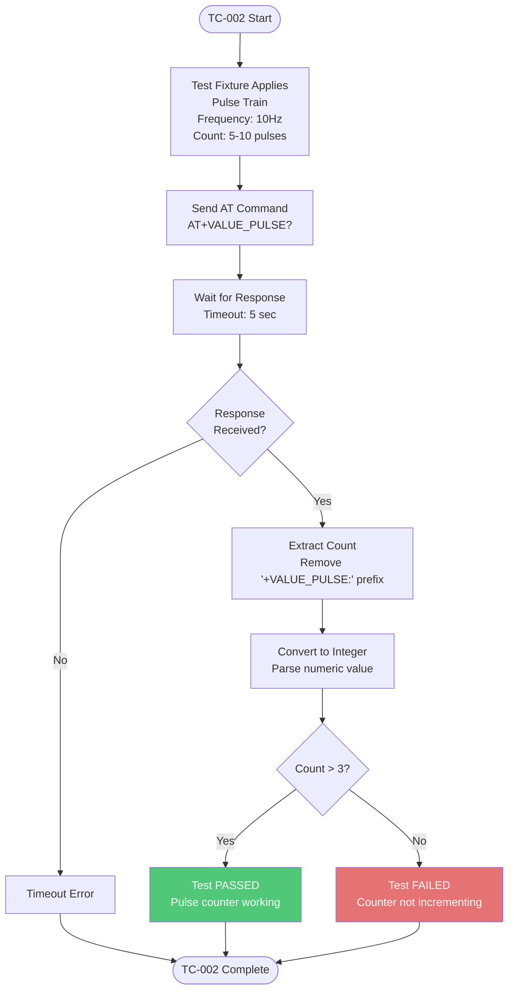

### AT Command Details

**Command:**
```
AT+VALUE_PULSE?
```

**Expected Response:**
```
+VALUE_PULSE: 7
OK
```

**Response Format:**
- Prefix: `+VALUE_PULSE:`
- Value: Integer count
- Unit: Pulses (dimensionless)

### Pass/Fail Criteria

| Parameter | Requirement |
|-----------|-------------|
| **Pulse Count** | > 3 pulses |

**Pass Conditions:**
✅ Response received  
✅ Count parseable as integer  
✅ Count > 3  

**Fail Conditions:**
❌ Timeout  
❌ Count ≤ 3 (insufficient pulses detected)  
❌ Count = 0 (no pulses detected)  

### Troubleshooting

| Symptom | Possible Cause | Solution |
|---------|----------------|----------|
| **Count = 0** | No pulse signal | Check fixture pulse output |
| **Count = 1-3** | Weak signal | Check signal amplitude (3.3V) |
| **Random count** | Noise on input | Check grounding, shielding |
| **Timeout** | UART issue | Retry connection |

---

## TC-003: DIP Switch Test

### Test Information

| Field | Value |
|-------|-------|
| **Test ID** | TC-003 |
| **Category** | Digital Input |
| **Priority** | Low |
| **Duration** | ~1 second |
| **Dependencies** | TC-001 |

### Objective

Read DIP switch configuration to verify GPIO input functionality.

### Test Procedure

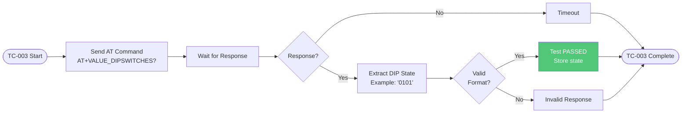

### AT Command Details

**Command:**
```
AT+VALUE_DIPSWITCHES?
```

**Expected Response:**
```
+VALUE_DIPSWITCHES: 0101
OK
```

**Response Format:**
- Prefix: `+VALUE_DIPSWITCHES:`
- Value: 4-character binary string
- '0' = Switch OFF (open, pulled high)
- '1' = Switch ON (closed, pulled low)

### Pass/Fail Criteria

**Pass Conditions:**
✅ Response received  
✅ Value is 4-character string of 0s and 1s  

**Note:** This test typically does not fail unless there's a communication error. The DIP state is informational.

---

## TC-004: Analog Input 1 Test

### Test Information

| Field | Value |
|-------|-------|
| **Test ID** | TC-004 |
| **Category** | Analog Input |
| **Priority** | High |
| **Duration** | ~2 seconds |
| **Dependencies** | TC-001 |

### Objective

Verify AIN1 analog input channel accurately measures applied reference voltage.

### Test Procedure

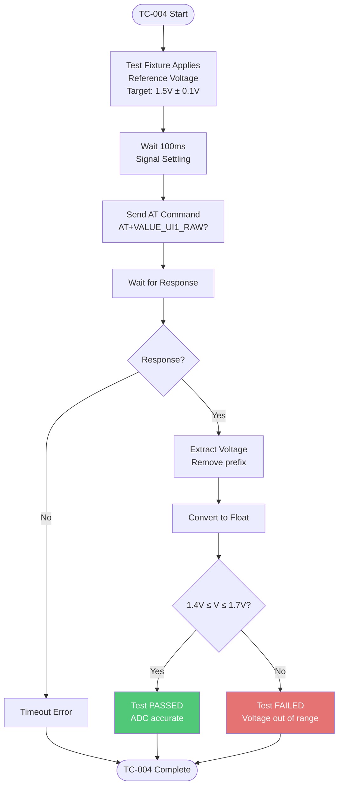

### AT Command Details

**Command:**
```
AT+VALUE_UI1_RAW?
```

**Expected Response:**
```
+VALUE_UI1_RAW: 1.52
OK
```

### Pass/Fail Criteria

| Parameter | Min | Typical | Max | Unit |
|-----------|-----|---------|-----|------|
| **AIN1 Voltage** | 1.4 | 1.5 | 1.7 | V |

**Pass Conditions:**
✅ Voltage ≥ 1.4V  
✅ Voltage ≤ 1.7V  

**Accuracy:** ±10% tolerance accounts for:
- Test fixture reference accuracy
- ADC quantization (12-bit)
- Voltage divider tolerance
- PCB trace resistance

---

## TC-005: Analog Input 2 Test

### Test Information

| Field | Value |
|-------|-------|
| **Test ID** | TC-005 |
| **Category** | Analog Input |
| **Priority** | High |
| **Duration** | ~2 seconds |
| **Dependencies** | TC-001 |

### Objective

Verify AIN2 analog input channel measures applied voltage correctly.

### AT Command Details

**Command:**
```
AT+VALUE_UI2_RAW?
```

**Expected Response:**
```
+VALUE_UI2_RAW: 1.02
OK
```

### Pass/Fail Criteria

| Parameter | Min | Typical | Max | Unit |
|-----------|-----|---------|-----|------|
| **AIN2 Voltage** | 0.75 | 1.0 | 1.2 | V |

**Pass Conditions:**
✅ Voltage ≥ 0.75V  
✅ Voltage ≤ 1.2V  

---

## TC-006: Analog Input 3 Test

### Test Information

| Field | Value |
|-------|-------|
| **Test ID** | TC-006 |
| **Category** | Analog Input |
| **Priority** | High |
| **Duration** | ~2 seconds |
| **Dependencies** | TC-001 |

### Objective

Verify AIN3 analog input channel measures applied voltage correctly.

### AT Command Details

**Command:**
```
AT+VALUE_UI3_RAW?
```

**Expected Response:**
```
+VALUE_UI3_RAW: 0.68
OK
```

### Pass/Fail Criteria

| Parameter | Min | Typical | Max | Unit |
|-----------|-----|---------|-----|------|
| **AIN3 Voltage** | 0.5 | 0.7 | 0.9 | V |

**Pass Conditions:**
✅ Voltage ≥ 0.5V  
✅ Voltage ≤ 0.9V  

---

## TC-007: LoRa Detection Test

### Test Information

| Field | Value |
|-------|-------|
| **Test ID** | TC-007 |
| **Category** | Wireless Communication |
| **Priority** | Critical |
| **Duration** | ~3 seconds |
| **Dependencies** | TC-001 |

### Objective

Verify LoRa radio module is present, communicating via SPI, and has valid unique address.

### Test Procedure

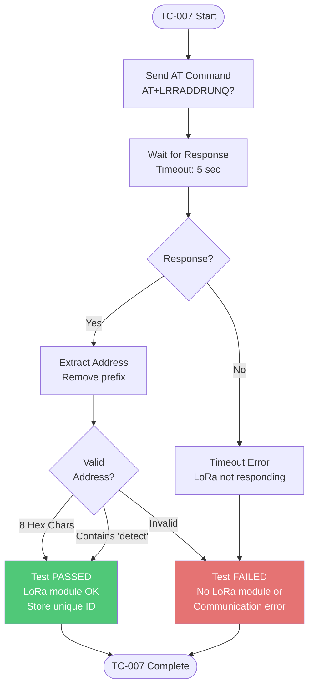

### AT Command Details

**Command:**
```
AT+LRRADDRUNQ?
```

**Expected Response (Normal):**
```
+LRRADDRUNQ: A3F2D8C1
OK
```

**Alternative Response (Detection Mode):**
```
+LRRADDRUNQ: detect-ok
OK
```

### Pass/Fail Criteria

**Pass Conditions:**
✅ Response received  
✅ Address is 8 hexadecimal characters (e.g., `A3F2D8C1`)  
**OR**  
✅ Response contains `detect` keyword  

**Fail Conditions:**
❌ Timeout (LoRa module not responding)  
❌ Invalid address format  
❌ Address is all zeros (`00000000`)  
❌ ERROR response  

### LoRa Address Format

The LoRa unique address is:
- **8 characters** hexadecimal
- **Factory programmed** into SX1276 chip
- **Globally unique** per device
- **Used for** device identification and routing

**Example Valid Addresses:**
- `A3F2D8C1`
- `5B8E4712`
- `FF00A5C3`

---

## TC-008: LoRa Transmission Test

### Test Information

| Field | Value |
|-------|-------|
| **Test ID** | TC-008 |
| **Category** | Wireless Communication |
| **Priority** | Critical |
| **Duration** | ~3 seconds |
| **Dependencies** | TC-007 (LoRa detected) |

### Objective

Verify LoRa module can successfully transmit a test packet.

### Test Procedure

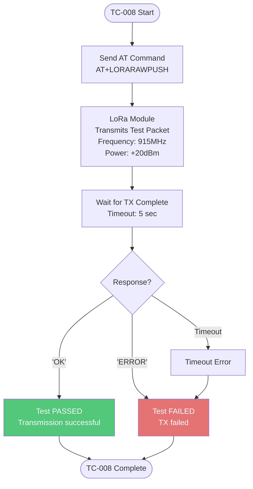

### AT Command Details

**Command:**
```
AT+LORARAWPUSH
```

**Expected Response:**
```
OK
```

**Note:** Unlike other tests, this command only returns `OK` or `ERROR`, not a value with a prefix.

### Pass/Fail Criteria

**Pass Conditions:**
✅ Response = `OK`  

**Fail Conditions:**
❌ Response = `ERROR`  
❌ Timeout  

### What This Test Verifies

✅ LoRa module powered  
✅ SPI communication working  
✅ RF frontend functional  
✅ Antenna connection OK  
✅ Transmission circuitry OK  

**Note:** This test does NOT verify:
- Packet actually received by gateway (that requires RX test setup)
- RF power output level (requires spectrum analyzer)
- Modulation accuracy

For full TX verification, optional equipment:
- LoRa gateway within 10m
- Spectrum analyzer at 915MHz
- RF power meter

---

## TC-009: WiFi Scan Test

### Test Information

| Field | Value |
|-------|-------|
| **Test ID** | TC-009 |
| **Category** | Wireless Communication |
| **Priority** | Critical |
| **Duration** | ~5-10 seconds |
| **Dependencies** | TC-001 |

### Objective

Verify WiFi module can scan for available 2.4GHz networks and measure signal strength.

### Test Procedure

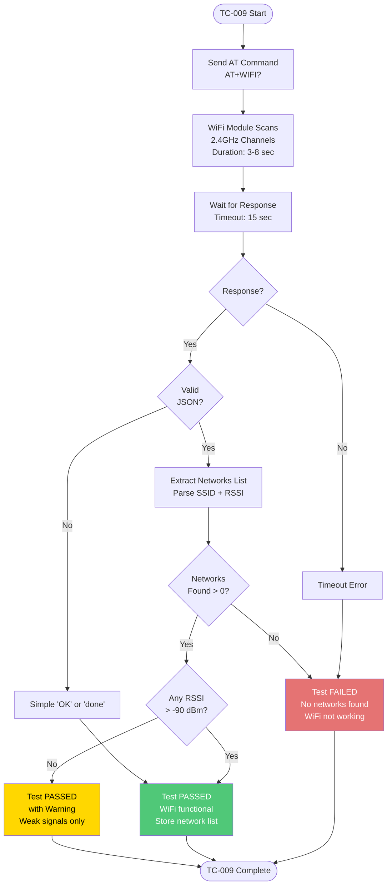

### AT Command Details

**Command:**
```
AT+WIFI?
```

**Expected Response (JSON format):**
```json
{
  "result": "done",
  "networks": [
    {"ssid": "NubeIO_Test", "rssi": -45},
    {"ssid": "Guest_WiFi", "rssi": -67},
    {"ssid": "Factory_Net", "rssi": -52}
  ],
  "count": 3
}
OK
```

**Alternative Response (Simple format):**
```
OK
```

### Pass/Fail Criteria

**Pass Conditions:**
✅ Response received (JSON or simple)  
✅ At least 1 network detected  
**OR**  
✅ Simple `OK` response (indicates scan completed)  

**Fail Conditions:**
❌ Timeout (WiFi module hung or not responding)  
❌ ERROR response  
❌ JSON indicates 0 networks (no WiFi signals at all - unusual in factory environment)  

**Warning Conditions (Still Pass):**
⚠️ All RSSI values < -80 dBm (weak signals, but WiFi is working)

### RSSI Guidelines

| RSSI Range | Signal Quality | Expected Distance |
|------------|----------------|-------------------|
| **-30 to -50 dBm** | Excellent | 0-5m from AP |
| **-50 to -60 dBm** | Good | 5-15m |
| **-60 to -70 dBm** | Fair | 15-30m |
| **-70 to -80 dBm** | Weak | 30-50m |
| **-80 to -90 dBm** | Very Weak | > 50m |
| **< -90 dBm** | Unusable | - |

### Troubleshooting

| Symptom | Possible Cause | Solution |
|---------|----------------|----------|
| **Timeout** | WiFi module not initialized | Check ESP32 power, retry |
| **0 Networks** | Antenna disconnected | Check antenna connection |
| **All RSSI < -80** | Poor test environment | Move closer to WiFi AP |
| **JSON parse error** | Firmware mismatch | Update device firmware |

---

## TC-010: Relay Control Test

### Test Information

| Field | Value |
|-------|-------|
| **Test ID** | TC-010 |
| **Category** | Output Control |
| **Priority** | High |
| **Duration** | ~3 seconds |
| **Dependencies** | TC-001 |

### Objective

Verify relay output can be controlled (switched ON and OFF) successfully.

### Test Procedure

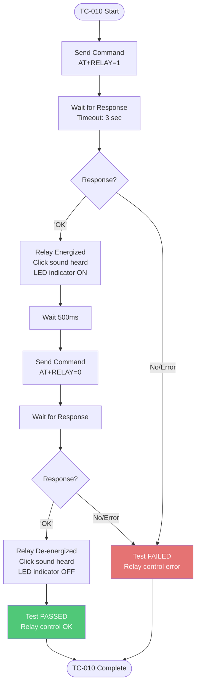

### AT Command Details

**Turn Relay ON:**
```
AT+RELAY=1
```

**Expected Response:**
```
OK
```

**Turn Relay OFF:**
```
AT+RELAY=0
```

**Expected Response:**
```
OK
```

### Pass/Fail Criteria

**Pass Conditions:**
✅ Relay ON command returns `OK`  
✅ Audible click when relay energizes  
✅ Relay OFF command returns `OK`  
✅ Audible click when relay de-energizes  

**Fail Conditions:**
❌ Either command times out  
❌ ERROR response  
❌ No audible click (relay mechanically failed)  

### Physical Verification

**What to observe:**
1. **Audible Click:** Relay makes distinct "click" sound when switching
2. **LED Indicator:** If DUT has relay LED, it should light when ON
3. **Contact Closure:** If using continuity tester on relay contacts, should show closed when ON

**Note:** In factory testing, typically only software control is verified. Contact closure verification requires additional test fixture connections.

---

## Pass/Fail Criteria

### Overall Test Evaluation

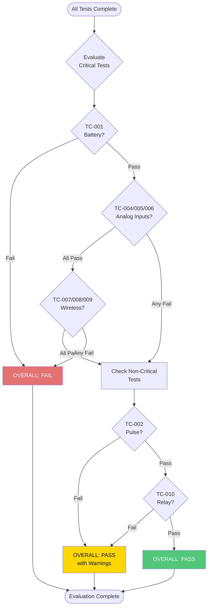

### Test Criticality Matrix

| Test ID | Test Name | Criticality | Fail Impact |
|---------|-----------|-------------|-------------|
| TC-001 | Battery Voltage | **Critical** | Unit rejected |
| TC-004 | AIN1 Voltage | **High** | Sensor inputs unreliable |
| TC-005 | AIN2 Voltage | **High** | Sensor inputs unreliable |
| TC-006 | AIN3 Voltage | **High** | Sensor inputs unreliable |
| TC-007 | LoRa Detect | **Critical** | No LoRa communication |
| TC-008 | LoRa TX | **Critical** | No LoRa communication |
| TC-009 | WiFi Scan | **Critical** | No WiFi communication |
| TC-002 | Pulse Counter | Medium | Pulse inputs won't work |
| TC-003 | DIP Switches | Low | Configuration limited |
| TC-010 | Relay Control | **High** | Output control unavailable |

### Decision Rules

**PASS:** All critical tests pass, all high-priority tests pass, at most 1 medium-priority test fails

**PASS with Warnings:** All critical tests pass, minor issues in medium/low priority tests

**FAIL:** Any critical test fails, OR 2+ high-priority tests fail

---

## Test Results Interpretation

### Result JSON Structure

```json
{
  "device": "Micro Edge",
  "version": "GEN-1",
  "pcbId": "ME-2025-001234",
  "lot": "LOT-2025-W50",
  "testDate": "2025-12-08T10:30:00Z",
  "operator": "John Doe",
  "duration": 42.5,
  "results": {
    "batteryVoltage": "3.75 V",
    "pulsesCounter": "7",
    "dipSwitches": "0101",
    "ain1Voltage": "1.52 V",
    "ain2Voltage": "1.02 V",
    "ain3Voltage": "0.68 V",
    "loraAddress": "A3F2D8C1",
    "loraDetect": "A3F2D8C1",
    "loraRawPush": "OK",
    "wifiScan": "3 networks",
    "relayControl": "OK"
  },
  "evaluation": {
    "pass_battery": true,
    "pass_ain1": true,
    "pass_ain2": true,
    "pass_ain3": true,
    "pass_pulses": true,
    "pass_lora": true,
    "pass_wifi": true,
    "pass_relay": true,
    "overall": "PASS"
  }
}
```

### CSV Export Format

The results are also saved to a master CSV file for data analysis:

```csv
Date,Time,PCB_ID,Lot,Operator,Battery_V,Battery_Pass,AIN1_V,AIN1_Pass,AIN2_V,AIN2_Pass,AIN3_V,AIN3_Pass,Pulses,Pulses_Pass,LoRa_Addr,LoRa_Pass,WiFi_Pass,Relay_Pass,Overall
2025-12-08,10:30:00,ME-2025-001234,LOT-2025-W50,John Doe,3.75,PASS,1.52,PASS,1.02,PASS,0.68,PASS,7,PASS,A3F2D8C1,PASS,PASS,PASS,PASS
```

---

## Quick Troubleshooting

### Common Test Failures

| Test | Failure Mode | Quick Fix | Escalation |
|------|--------------|-----------|------------|
| **Battery** | V < 2.5V | Charge/replace battery | If still low, check power circuit |
| **Battery** | V > 4.5V | Check fixture voltage | If correct, ADC fault - reject |
| **AIN1/2/3** | Out of range | Verify fixture voltages with DMM | If fixture OK, ADC fault - reject |
| **Pulse** | Count = 0 | Check fixture pulse output | If pulse OK, input circuit fault |
| **LoRa Detect** | Timeout | Retry connection | If persist, LoRa module missing/dead |
| **LoRa TX** | ERROR | Check LoRa detect first | If detect OK, RF circuit fault |
| **WiFi** | Timeout | Retry, check WiFi AP nearby | If persist, WiFi module fault |
| **WiFi** | 0 networks | Move closer to WiFi AP | If very close, antenna fault |
| **Relay** | No click | Listen carefully, retry | If no click, relay mechanical fault |

### Test Fixture Issues

| Symptom | Check | Fix |
|---------|-------|-----|
| **All analog tests fail** | Fixture reference voltages | Calibrate fixture |
| **All tests timeout** | UART connection | Check USB cable, COM port, baud rate |
| **Intermittent failures** | DUT seating on fixture | Clean pogo pins, reseat DUT |
| **Consistent pattern** | Fixture needs calibration | Run fixture self-test |

---

## Related Documentation

- **[Hardware Overview](./MicroEdge-Overview.md)** - Component specifications
- **[Sequence Diagrams](./MicroEdge-Sequence.md)** - Test flow visualization
- **[Source Code Manual](./MicroEdge-SourceCode.md)** - Implementation details
- **[Troubleshooting Guide](./MicroEdge-Troubleshooting.md)** - Detailed problem solving

---

## Revision History

| Version | Date | Author | Changes |
|---------|------|--------|---------|
| 1.0 | 2025-12-08 | Documentation Team | Initial test cases with flowcharts |

---

**Next:** [Source Code Manual →](./MicroEdge-SourceCode.md)
