# Micro Edge - Troubleshooting Guide

**Device Type:** GEN-1 (ESP32-based)  
**Target Audience:** Test Operators, Support Engineers, Beginners  
**Last Updated:** December 8, 2025

---

## Table of Contents

- [Quick Diagnosis](#quick-diagnosis)
- [Connection Issues](#connection-issues)
- [Test Failures](#test-failures)
- [Hardware Problems](#hardware-problems)
- [Software Issues](#software-issues)
- [Test Fixture Issues](#test-fixture-issues)
- [Advanced Diagnostics](#advanced-diagnostics)
- [FAQ](#faq)
- [Getting Help](#getting-help)

---

## Quick Diagnosis

### Problem Decision Tree

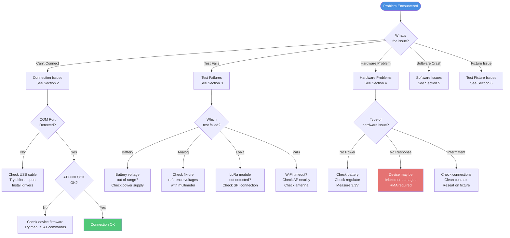

### Symptoms and Quick Fixes

| Symptom | Quick Fix | See Section |
|---------|-----------|-------------|
| **"Port not found"** | Check USB cable, try different COM port | [2.1](#21-device-not-detected) |
| **"Timeout on connect"** | Press Reset button, retry connection | [2.2](#22-connection-timeout) |
| **"All tests fail"** | Check if device powered, battery voltage OK | [3.1](#31-all-tests-failing) |
| **"Battery voltage ERROR"** | Check battery, measure with multimeter | [3.2](#32-battery-voltage-test-fails) |
| **"WiFi timeout"** | Move closer to WiFi AP, check antenna | [3.7](#37-wifi-scan-timeout) |
| **"LoRa not detected"** | Check LoRa module seated properly | [3.6](#36-lora-tests-fail) |
| **"Analog inputs wrong"** | Verify fixture voltages with DMM | [3.3](#33-analog-input-tests-fail) |
| **Application crashes** | Restart app, check for updates | [5](#software-issues) |

---

## Connection Issues

### 2.1 Device Not Detected

**Symptom:** COM port not appearing in dropdown, or "Port not found" error

**Troubleshooting State Diagram:**

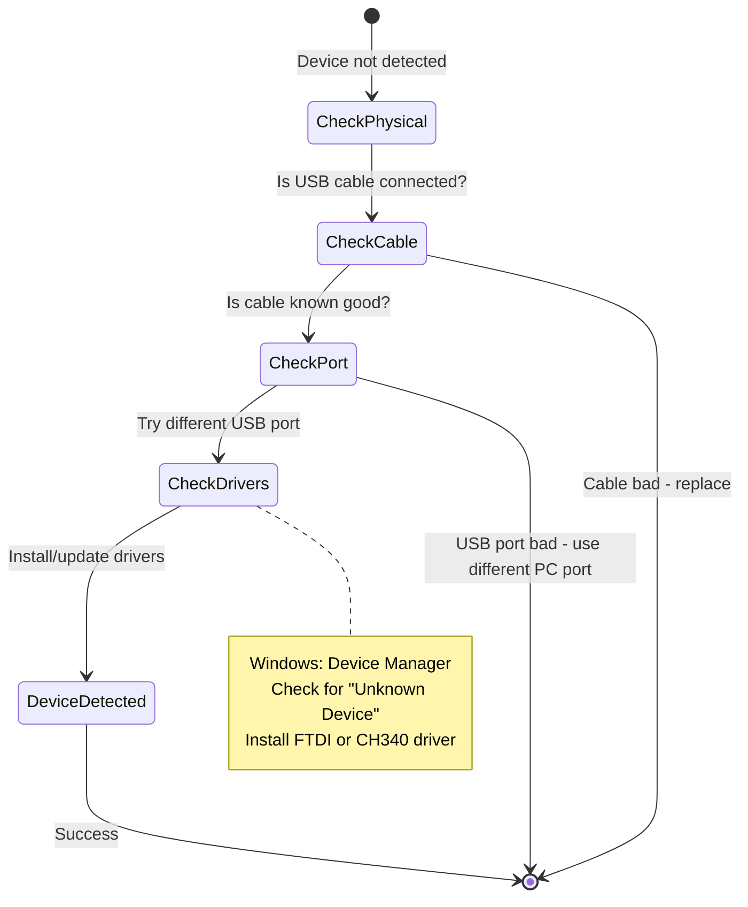

**Checklist:**

- [ ] USB cable firmly connected
- [ ] USB cable has data wires (not charge-only)
- [ ] Different USB port tried
- [ ] Device powered on (LED lit)
- [ ] Drivers installed (FTDI FT232 or CH340)
- [ ] Device Manager shows COM port (Windows)
- [ ] Try different USB cable

**Windows Driver Installation:**

1. Open Device Manager (Win+X, select Device Manager)
2. Look for "Unknown Device" or "USB Serial Port"
3. Right-click → Update Driver
4. Browse to FTDI driver folder
5. Restart application

**Linux Permissions:**

```bash
# Add user to dialout group
sudo usermod -a -G dialout $USER

# Reboot for changes to take effect
sudo reboot

# Check if device appears
ls -l /dev/ttyUSB*
```

### 2.2 Connection Timeout

**Symptom:** "Timeout waiting for OK" during connection

**Possible Causes:**

| Cause | Check | Fix |
|-------|-------|-----|
| **Wrong baud rate** | Verify 115200 | Set correct baud rate in app |
| **Device not ready** | Power LED on? | Press reset, wait 2 seconds |
| **Firmware incompatible** | AT commands work? | Update firmware |
| **UART TX/RX swapped** | Check wiring | Swap TX/RX connections |
| **Device in bootloader** | LED pattern? | Power cycle device |

**Manual Test:**

Use serial terminal to verify AT commands:

```bash
# Open terminal at 115200 baud
# Windows: PuTTY, TeraTerm
# Linux: screen /dev/ttyUSB0 115200

# Type commands:
AT+UNLOCK=N00BIO
# Expected: OK

AT+INFO?
# Expected: +INFO: Model,Version,UUID
#           OK
```

If manual AT commands work, issue is in application. If they don't work, issue is firmware.

### 2.3 "Already Connected" Error

**Symptom:** Can't reconnect after previous test

**Cause:** Port not released after disconnect

**Fix:**

1. Click "Disconnect" button
2. Wait 2 seconds
3. If still fails, restart application
4. If persistent, reboot PC

**Prevention:** Always disconnect before closing application

---

## Test Failures

### 3.1 All Tests Failing

**Symptom:** Every test returns ERROR

**Decision Flow:**

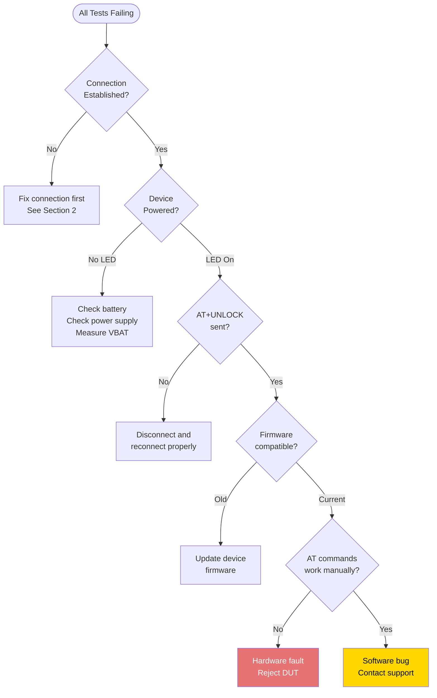

**Systematic Check:**

1. **Verify Connection:**
   ```
   Status bar shows: "Connected to COM3"
   ```

2. **Manual AT Test:**
   ```
   AT+VALUE_VBAT?
   # Should return: +VALUE_VBAT: X.XX
   ```

3. **Check Logs:**
   - Open DevTools (F12)
   - Look for error messages in Console

4. **Try Different Device:**
   - If other devices work, this DUT is faulty
   - If all devices fail, fixture/software issue

### 3.2 Battery Voltage Test Fails

**Test:** TC-001 Battery Voltage  
**Symptom:** Voltage out of range (< 2.5V or > 4.5V)

**Failure Analysis:**

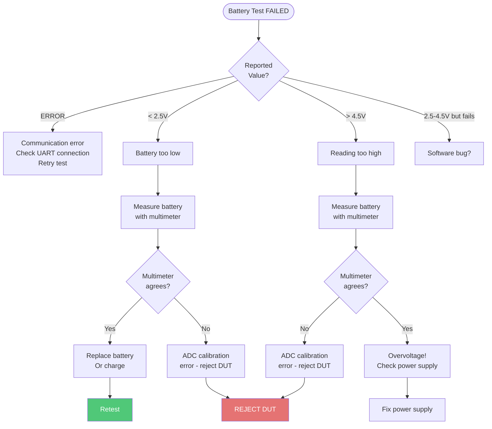

**Measurement Procedure:**

1. Disconnect device from fixture
2. Measure battery voltage with multimeter:
   - Red probe to V+
   - Black probe to GND
3. Compare with test result:
   - Within ±0.1V: ADC working correctly
   - Off by > 0.1V: ADC calibration error

**Expected Values:**

| Battery State | Voltage | Action |
|---------------|---------|--------|
| **Full** | 4.2V | OK for testing |
| **Nominal** | 3.7V | OK for testing |
| **Low** | 3.0V | OK but charge soon |
| **Critical** | < 2.5V | Charge before testing |
| **Dead** | < 2.0V | Replace battery |

### 3.3 Analog Input Tests Fail

**Tests:** TC-004, TC-005, TC-006 (AIN1, AIN2, AIN3)  
**Symptom:** Voltage readings out of expected range

**Troubleshooting Steps:**

**Step 1: Verify Fixture Voltages**

Measure test fixture reference voltages with multimeter:

| Test Point | Expected | Tolerance | If Wrong |
|------------|----------|-----------|----------|
| **AIN1 Ref** | 1.5V | ±0.1V | Calibrate fixture |
| **AIN2 Ref** | 1.0V | ±0.1V | Calibrate fixture |
| **AIN3 Ref** | 0.7V | ±0.1V | Calibrate fixture |

**Step 2: Check DUT Connections**

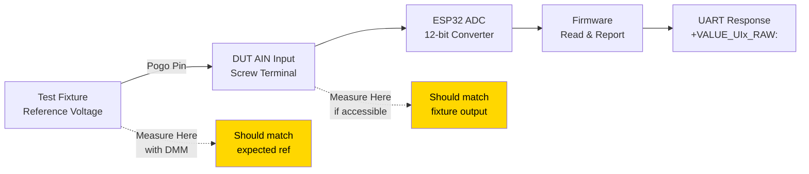

**Step 3: Isolate Fault**

| Fixture Voltage | DUT Reading | Diagnosis |
|-----------------|-------------|-----------|
| ✅ Correct | ✅ Correct | PASS (re-run test) |
| ✅ Correct | ❌ Wrong | DUT ADC fault - reject |
| ❌ Wrong | ❌ Wrong | Fixture needs calibration |
| ❌ Wrong | ✅ Correct | Impossible - recheck |

**Step 4: DUT Self-Test**

Some devices have self-test mode. Consult firmware documentation.

### 3.4 Pulse Counter Test Fails

**Test:** TC-002 Pulse Counter  
**Symptom:** Count = 0 or too low (≤ 3)

**Cause Analysis:**

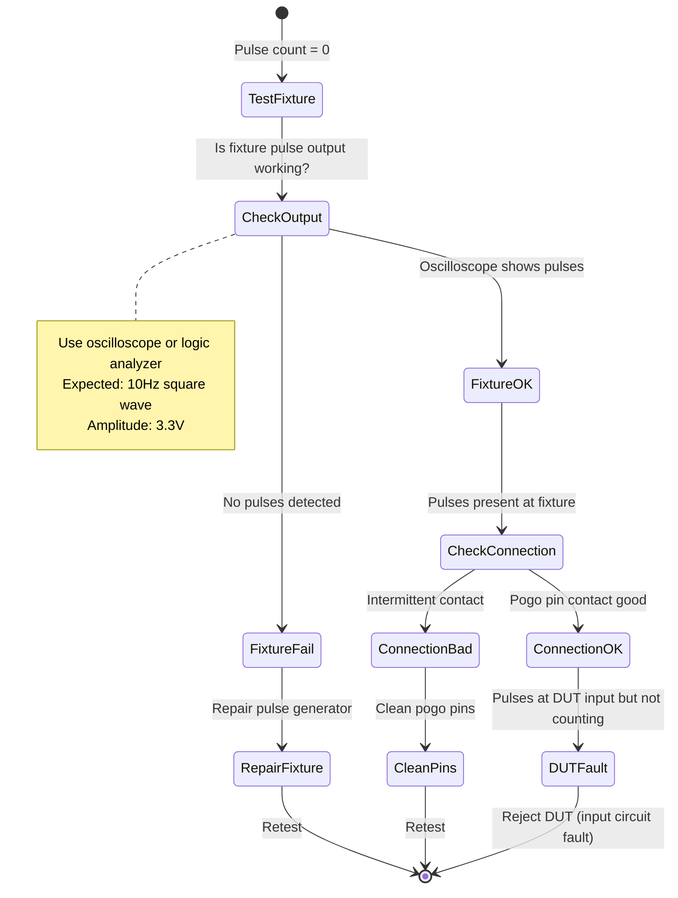

**Quick Checks:**

- [ ] Oscilloscope on fixture pulse output shows 10Hz signal
- [ ] Amplitude is 3.3V (logic high)
- [ ] Pogo pins making contact (clean if needed)
- [ ] Try different DUT to confirm fixture works
- [ ] Measure voltage at DUT pulse input pin

**If Fixture is Good but DUT Fails:** Reject DUT (pulse input circuit damaged)

### 3.5 DIP Switch Test Fails

**Test:** TC-003 DIP Switches  
**Symptom:** Invalid response or timeout

**Note:** This test rarely fails unless there's a communication error, as it only reads the state.

**Troubleshooting:**

1. **Verify switches can be read manually:**
   ```
   AT+VALUE_DIPSWITCHES?
   # Expected: +VALUE_DIPSWITCHES: 0101
   ```

2. **If timeout:** General UART issue, not DIP-specific

3. **If invalid format:** Firmware bug, update firmware

**DIP Switch States:**

- '0' = Switch OFF (open, pulled high)
- '1' = Switch ON (closed, pulled low)

Example: `0101` means switches 2 and 4 ON, switches 1 and 3 OFF.

### 3.6 LoRa Tests Fail

**Tests:** TC-007 (LoRa Detect), TC-008 (LoRa TX)  
**Symptom:** Timeout, module not detected, or TX fails

**Failure Decision Tree:**

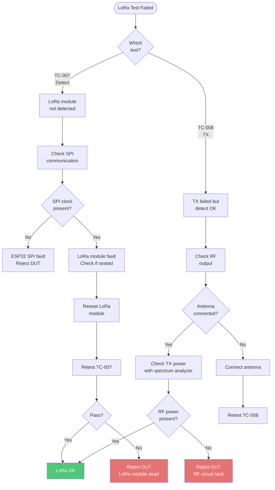

**Diagnostic Commands:**

```bash
# Try manual LoRa commands
AT+LRRADDRUNQ?
# Expected: +LRRADDRUNQ: A3F2D8C1 (8-char hex)

AT+LORARAWPUSH
# Expected: OK
```

**Advanced Diagnostics (optional equipment):**

- **Spectrum Analyzer:** Verify 915MHz transmission, +20dBm power
- **LoRa Gateway:** Receive test packet, verify content
- **Logic Analyzer:** Check SPI communication between ESP32 and SX1276

### 3.7 WiFi Scan Timeout

**Test:** TC-009 WiFi Scan  
**Symptom:** Timeout after 15 seconds

**Troubleshooting:**

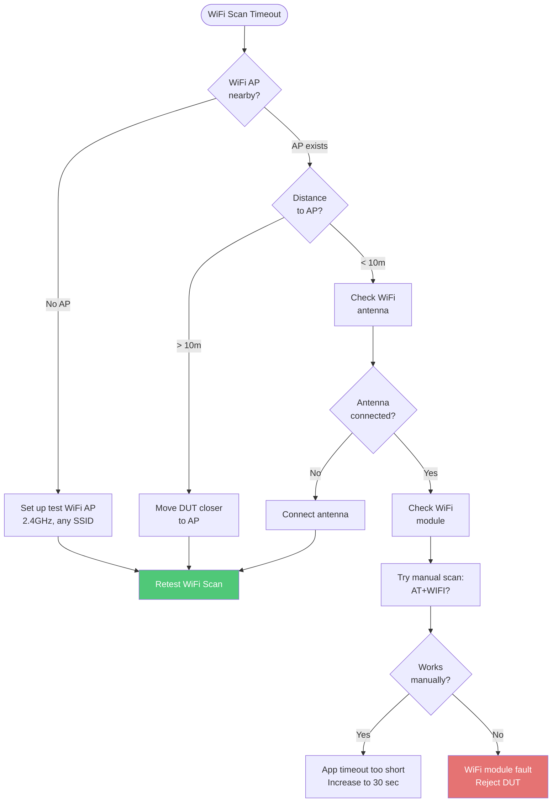

**WiFi Environment Requirements:**

- **Frequency:** 2.4 GHz (not 5GHz)
- **Distance:** < 10m for reliable scan
- **Signal Strength:** RSSI > -70 dBm recommended
- **Networks:** At least 1 network should be visible

**Check Signal Strength:**

If scan succeeds but signal is weak:
- RSSI < -80 dBm: Too weak, move closer
- RSSI -70 to -80 dBm: Marginal
- RSSI > -70 dBm: Good

### 3.8 Relay Control Test Fails

**Test:** TC-010 Relay Control  
**Symptom:** No click heard, or ERROR response

**State Diagram:**

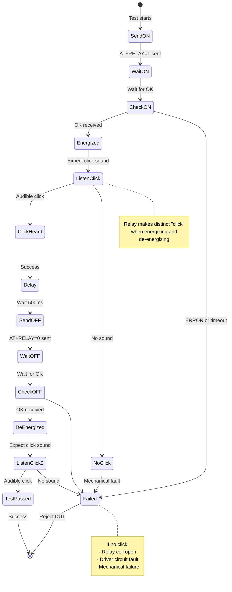

**Troubleshooting:**

| Symptom | Diagnosis | Fix |
|---------|-----------|-----|
| **No click at all** | Relay coil open or driver fault | Reject DUT |
| **Click on ON only** | Relay stuck | Reject DUT |
| **Click on OFF only** | Relay energized at start (wrong state) | Check initial state, may pass |
| **Very quiet click** | Weak coil drive | Marginal - may pass if OK response |
| **ERROR response** | GPIO fault | Reject DUT |

**Manual Test:**

```bash
AT+RELAY=1
# Listen for click
# Expected: OK

AT+RELAY=0
# Listen for click
# Expected: OK
```

---

## Hardware Problems

### 4.1 No Power (LED Off)

**Symptom:** Device completely dead, no LEDs

**Troubleshooting:**

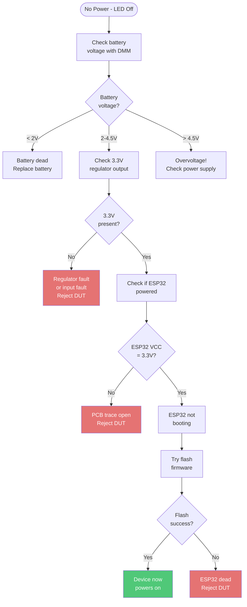

### 4.2 Intermittent Failures

**Symptom:** Tests pass sometimes, fail other times

**Root Causes:**

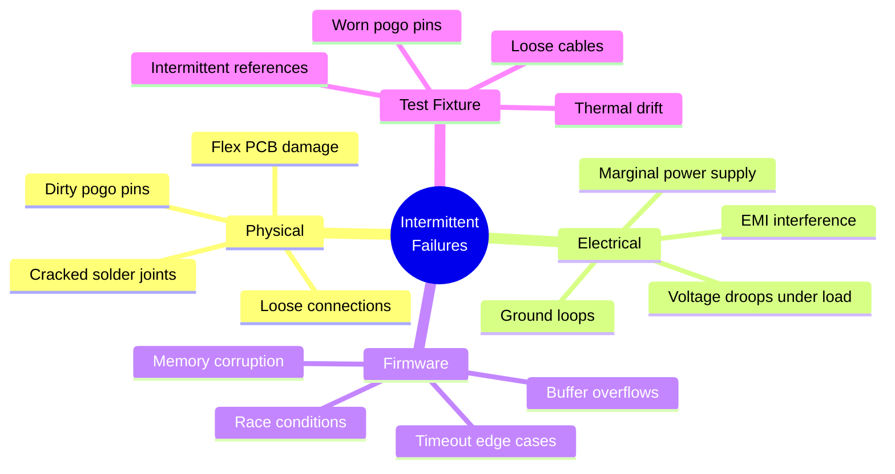

**Systematic Diagnosis:**

1. **Run test 10 times in a row:**
   - All pass: Not intermittent (was one-time glitch)
   - Random failures: Truly intermittent
   - First few pass, then fail: Thermal issue

2. **Check test fixture:**
   - Clean pogo pins with isopropyl alcohol
   - Check all cables for intermittent connections
   - Verify reference voltages stable

3. **Check DUT:**
   - Inspect solder joints under microscope
   - Look for cracked joints (especially large components)
   - Check for oxidation on connectors

4. **Environmental factors:**
   - Temperature fluctuations
   - Nearby RF interference (turn off cell phones)
   - Power supply noise

**If Consistent Pattern Emerges:**

| Pattern | Likely Cause |
|---------|--------------|
| Fails after 5-10 successful tests | Thermal - component overheating |
| Fails only on specific test | That test has timing issue |
| Fails when room is cold | Temperature-dependent solder joint |
| Fails more often in afternoon | Fixture drift, calibrate fixture |

---

## Software Issues

### 5.1 Application Crashes

**Symptom:** Factory Testing app closes unexpectedly

**Common Causes:**

| Cause | Symptom | Fix |
|-------|---------|-----|
| **Unhandled exception** | Crash during test | Check console logs for error |
| **SerialPort error** | Crash on connect/disconnect | Update node-serialport library |
| **Memory leak** | Crash after many tests | Restart app every 50 tests |
| **Electron bug** | Random crash | Update Electron version |

**Recovery Steps:**

1. Restart application
2. Check for updates
3. Clear cache:
   ```
   Windows: %APPDATA%\nubei-eol-toolkit
   Linux: ~/.config/nubei-eol-toolkit
   ```
4. Reinstall if persistent

### 5.2 Slow Performance

**Symptom:** Tests take much longer than expected

**Timeout Ladder:**

Expected test duration: **30-50 seconds**

If taking > 60 seconds:
1. Check for timeouts in console logs
2. Reduce timeout values in code
3. Check PC CPU usage (should be < 50%)
4. Close other applications

### 5.3 UI Not Updating

**Symptom:** Progress bar stuck, results not displayed

**State Management Issue:**

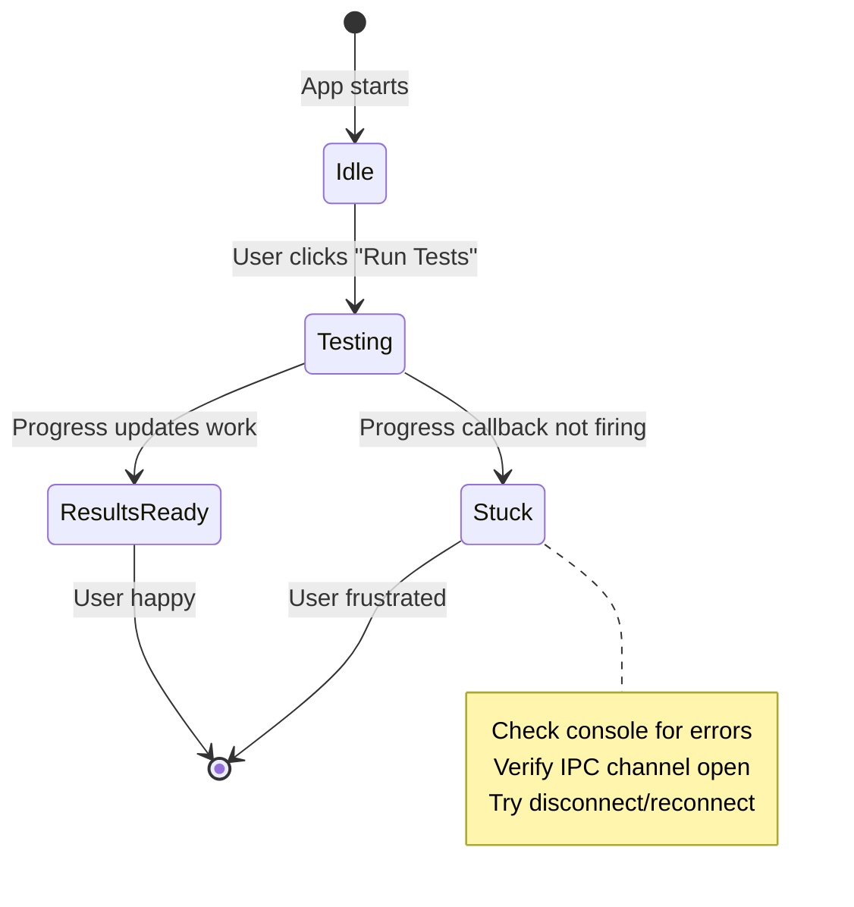

**Fix:**

1. Open DevTools (F12), check Console for errors
2. Disconnect and reconnect device
3. Restart application
4. If persists, file bug report with logs

---

## Test Fixture Issues

### 6.1 Fixture Calibration

**When to Calibrate:**

- After 1000 tests
- After physical damage
- After moving fixture
- If multiple DUTs fail analog tests

**Calibration Procedure:**

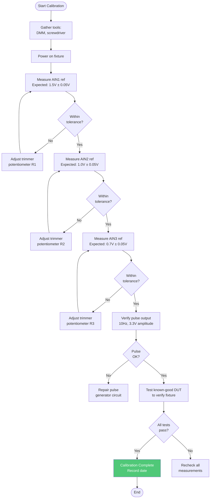

### 6.2 Pogo Pin Maintenance

**Cleaning Schedule:**

- Every 100 tests: Wipe with isopropyl alcohol
- Every 500 tests: Deep clean with brush
- Every 2000 tests: Replace pins

**Cleaning Procedure:**

1. Power off fixture
2. Soak cotton swab in 99% isopropyl alcohol
3. Wipe each pogo pin thoroughly
4. Allow to dry (30 seconds)
5. Test with known-good DUT

---

## Advanced Diagnostics

### 7.1 Logic Analyzer Capture

For timing-related issues, use logic analyzer:

**Connections:**
- CH0: TX (ESP32 → PC)
- CH1: RX (PC → ESP32)
- GND: Common ground

**Capture Settings:**
- Sample rate: 1 MHz
- Trigger: TX rising edge
- Protocol: UART 115200 baud

**What to Look For:**
- Correct baud rate (bit width = 8.68 µs for 115200)
- Start/stop bits correct
- Data bits match expected
- Timing between command and response

### 7.2 Oscilloscope Measurements

**Key Test Points:**

| Signal | Location | Expected |
|--------|----------|----------|
| **3.3V Rail** | TP1 | 3.3V ±3% |
| **Battery** | TP4 | 2.5-4.5V |
| **Pulse Input** | Pulse connector | 10Hz, 3.3Vpp |
| **AIN1** | AIN1 scaled | 1.5V DC |
| **SPI CLK** | TP3 | Activity during LoRa test |

### 7.3 Firmware Debugging

If device firmware is suspect:

1. **Flash debug firmware:**
   ```bash
   esptool.py --port COM3 write_flash 0x0 firmware-debug.bin
   ```

2. **Enable verbose logging** in firmware

3. **Monitor ESP32 console** during tests

4. **Check for crashes/reboots**

---

## FAQ

**Q: Why does battery test sometimes fail right after charging?**

A: Freshly charged Li-Ion battery may be at 4.3V, above the 4.5V limit. Wait 10 minutes for voltage to settle to 4.2V, or adjust pass/fail criteria to accept up to 4.3V.

**Q: Can I test without WiFi AP nearby?**

A: WiFi scan test will timeout without any networks. If you're in a location with no WiFi, either:
- Bring a portable WiFi hotspot
- Modify test to accept 0 networks as pass (if WiFi module responds)
- Skip WiFi test for that batch (not recommended)

**Q: How often should fixture be calibrated?**

A: Officially every 1000 tests, but if analog tests are consistently passing, calibration is likely still good. If you start seeing intermittent analog failures, calibrate immediately.

**Q: What if UART communication works but all AT commands fail?**

A: Device may be in wrong mode (bootloader, sleep mode). Try:
- Press reset button
- Power cycle
- Send AT+RESTORE to factory reset
- Reflash firmware

**Q: Can I test multiple devices in parallel?**

A: Not with current software architecture. Each test requires exclusive COM port access. You would need multiple PCs or modify software to support multiple concurrent connections.

---

## Getting Help

### Before Contacting Support

Collect this information:

- [ ] Application version
- [ ] Device type and firmware version
- [ ] Exact error message or symptom
- [ ] Console logs (F12, copy from Console tab)
- [ ] Steps to reproduce
- [ ] Test results JSON file
- [ ] Photo of device/setup if hardware issue

### Support Contacts

- **Email:** support@nube-io.com
- **GitHub Issues:** [Repository Issues Page](https://github.com/NubeIO/NubeiO-Eol-Toolkit/issues)
- **Documentation:** [docs/](https://github.com/NubeIO/NubeiO-Eol-Toolkit/tree/main/docs)

### Escalation Path

1. **Level 1:** Test operator checks this troubleshooting guide
2. **Level 2:** Test engineer investigates with DMM/oscilloscope
3. **Level 3:** Software team checks application logs
4. **Level 4:** Hardware team inspects DUT, fixture, or test setup

---

## Related Documentation

- **[Hardware Overview](./MicroEdge-Overview.md)** - Component specifications
- **[Test Cases](./MicroEdge-TestCases.md)** - Test procedures
- **[Sequence Diagrams](./MicroEdge-Sequence.md)** - Test flows
- **[Source Code Manual](./MicroEdge-SourceCode.md)** - Implementation details

---

## Revision History

| Version | Date | Author | Changes |
|---------|------|--------|---------|
| 1.0 | 2025-12-08 | Documentation Team | Initial troubleshooting guide with state diagrams |

---

**[← Back to Micro Edge Documentation](./MicroEdge-README.md)**
