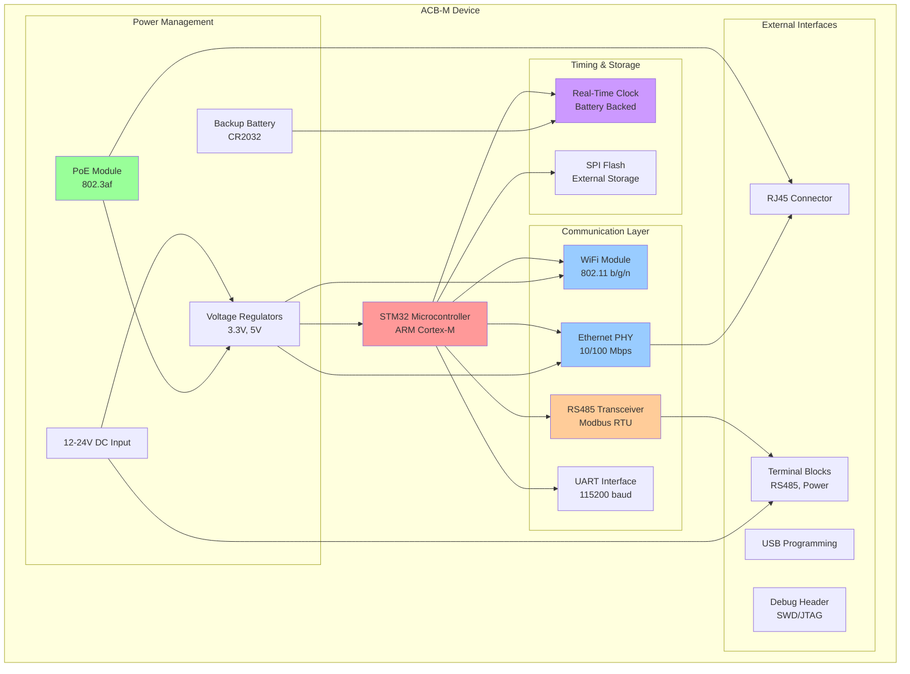
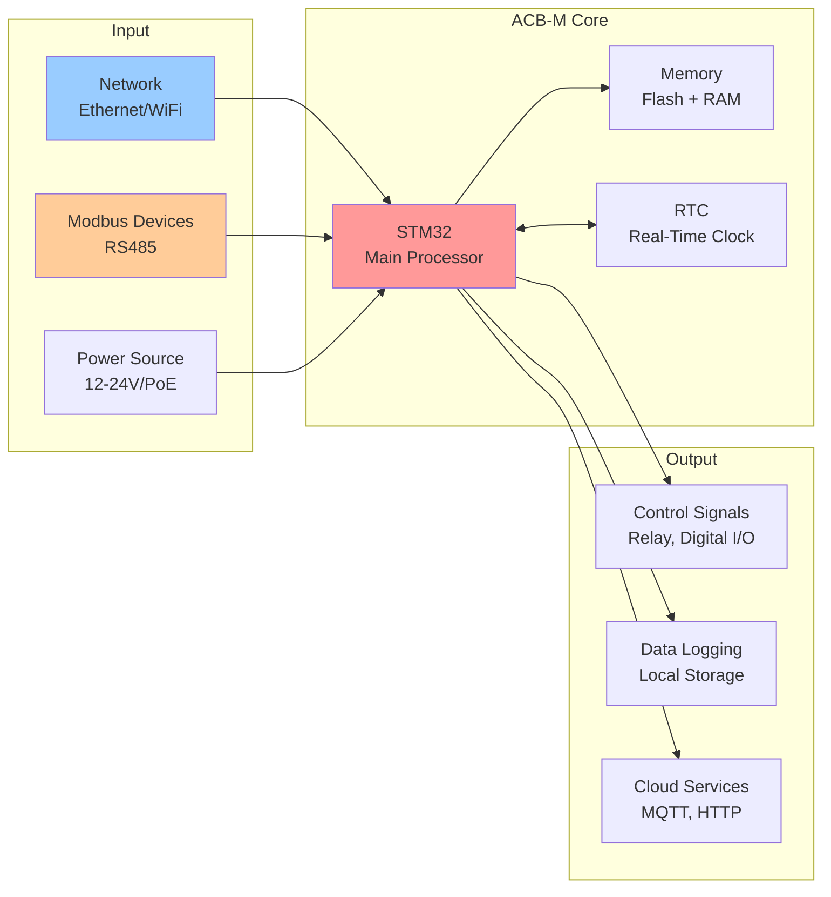
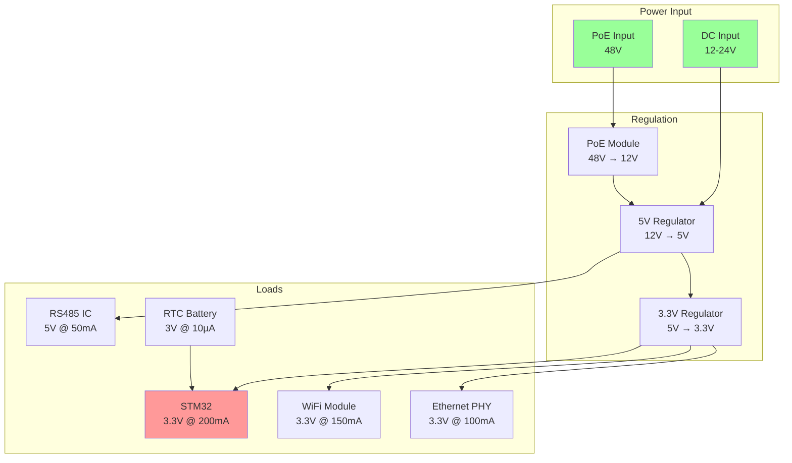
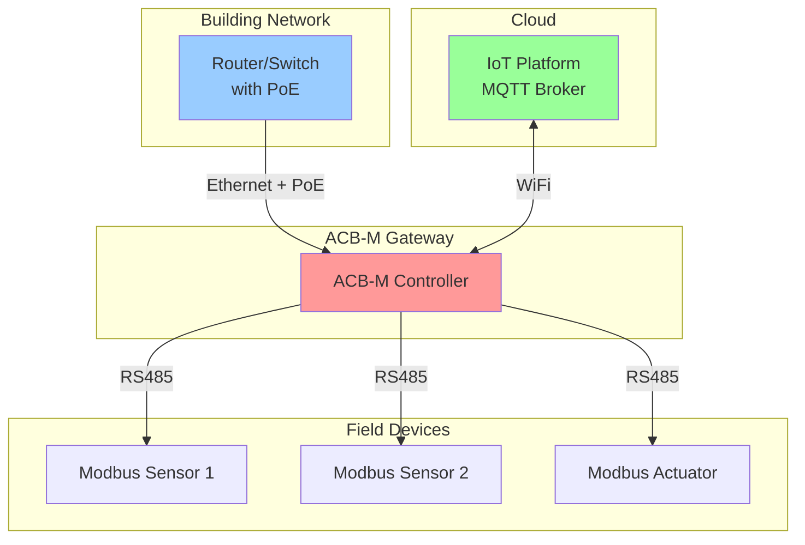

# ACB-M Hardware Overview

**Device:** ACB-M (Advanced Control Board - Modbus)  
**Generation:** GEN-2  
**Microcontroller:** STM32 (ARM Cortex-M)  
**Purpose:** Industrial IoT gateway with multi-protocol support  
**Last Updated:** December 8, 2025

---

## Table of Contents

1. [Device Summary](#device-summary)
2. [Hardware Specifications](#hardware-specifications)
3. [System Architecture](#system-architecture)
4. [Component Descriptions](#component-descriptions)
5. [Communication Interfaces](#communication-interfaces)
6. [Power Requirements](#power-requirements)
7. [Physical Specifications](#physical-specifications)
8. [Test Points & Connectors](#test-points--connectors)

---

## Device Summary

The **ACB-M** is an industrial-grade automation controller built around the STM32 microcontroller, designed for building management systems requiring multiple communication protocols. Unlike GEN-1 devices (ESP32-based), the ACB-M uses STM32 for superior real-time performance and industrial reliability.

### Key Differentiators

- **Real-Time Clock (RTC):** Battery-backed timekeeping for data logging
- **Dual Network:** WiFi + Ethernet with PoE support
- **Industrial RS485:** Modbus RTU for legacy equipment integration
- **UART Loopback:** Hardware-level testing capability
- **Extended Temperature:** -20°C to +70°C operation

---

## Hardware Specifications

### Microcontroller

| Parameter | Specification |
|-----------|---------------|
| **MCU** | STM32 (ARM Cortex-M series) |
| **Architecture** | 32-bit ARM Cortex-M3/M4 |
| **Clock Speed** | 72-168 MHz (model dependent) |
| **Flash Memory** | 256KB - 1MB |
| **RAM** | 64KB - 192KB |
| **UART Ports** | 3+ hardware UARTs |
| **Timers** | Multiple 16/32-bit timers |

### Wireless Module (WiFi)

| Parameter | Specification |
|-----------|---------------|
| **Standard** | IEEE 802.11 b/g/n |
| **Frequency** | 2.4 GHz |
| **TX Power** | +20 dBm max |
| **RX Sensitivity** | -95 dBm @ 1 Mbps |
| **Security** | WPA/WPA2-PSK, WPA2-Enterprise |
| **Modes** | Station, AP, Station+AP |

### Ethernet Module

| Parameter | Specification |
|-----------|---------------|
| **Standard** | IEEE 802.3 (10/100 Mbps) |
| **Interface** | RJ45 connector |
| **PoE Support** | IEEE 802.3af (Class 0, up to 12.95W) |
| **Auto-MDI/MDIX** | Yes |
| **Link Indication** | LED indicators |

### RS485 Interface

| Parameter | Specification |
|-----------|---------------|
| **Ports** | RS485-2 (Port 2) |
| **Protocol** | Modbus RTU |
| **Baud Rate** | 9600 - 115200 bps |
| **Termination** | 120Ω selectable |
| **Protection** | ESD protection, surge protection |
| **Max Distance** | 1200 meters |

### Real-Time Clock (RTC)

| Parameter | Specification |
|-----------|---------------|
| **Accuracy** | ±20 ppm @ 25°C |
| **Battery Backup** | CR2032 or supercap |
| **Battery Life** | 5+ years (CR2032) |
| **Time Range** | 2000-2099 |
| **Alarm Functions** | Yes |

### UART Test Interface

| Parameter | Specification |
|-----------|---------------|
| **Loopback Mode** | Hardware TX-RX loopback |
| **Test Pattern** | 0xEE byte transmission |
| **Baud Rate** | 115200 (testing) |
| **Purpose** | Factory validation of UART integrity |

---

## System Architecture

### Component Diagram



### Block Diagram - Signal Flow



---

## Component Descriptions

### 1. STM32 Microcontroller (Main Processor)

**Purpose:** Central processing unit managing all communication, data processing, and control logic.

**Key Features:**
- Real-time operating system (RTOS) capable
- Hardware floating-point unit (FPU)
- DMA controllers for efficient data transfer
- Multiple communication peripherals (SPI, I2C, UART)
- Watchdog timers for system reliability

**In Factory Testing:**
- Executes AT command interpreter
- Coordinates all test sequences
- Manages UART loopback testing
- Reads RTC values
- Controls WiFi/Ethernet/RS485 interfaces

### 2. WiFi Module

**Purpose:** Wireless connectivity for network access and IoT cloud services.

**Key Features:**
- IEEE 802.11 b/g/n support
- WPA2 security
- Station and AP modes
- Network scanning for site survey

**In Factory Testing:**
- Scans for available WiFi networks
- Connects to test SSID
- Reports network count and connection status
- Pass criteria: Networks > 1, Connected = 1

### 3. Ethernet Module

**Purpose:** Wired network connectivity with PoE power delivery.

**Key Features:**
- 10/100 Mbps auto-negotiation
- PoE (Power over Ethernet) support
- Hardware MAC address
- Auto-MDI/MDIX crossover detection

**In Factory Testing:**
- Reads hardware MAC address
- Obtains IP address via DHCP
- Reports link status
- Pass criteria: Valid MAC (12+ chars), IP ≠ 0.0.0.0

### 4. RS485-2 Interface

**Purpose:** Industrial serial communication for Modbus RTU protocol.

**Key Features:**
- Differential signaling (A/B pairs)
- Long-distance communication (up to 1200m)
- Multi-drop capability (up to 32 devices)
- ESD and surge protection

**In Factory Testing:**
- Loopback test on RS485-2 port
- Sends test pattern and verifies reception
- Reports byte count and status
- Pass criteria: Status = 0 (success)

### 5. Real-Time Clock (RTC)

**Purpose:** Accurate timekeeping for data logging and scheduled operations.

**Key Features:**
- Battery backup (continues during power loss)
- Alarm and calendar functions
- Low power consumption
- Crystal oscillator for accuracy

**In Factory Testing:**
- Reads current RTC time
- Validates time is within initialization window
- Checks battery backup functionality
- Pass criteria: Time within 2001-01-01 to 2001-01-02 (manufacturing window)

### 6. UART Interface (Test Port)

**Purpose:** Factory testing interface and programming port.

**Key Features:**
- Hardware loopback capability
- AT command protocol support
- 115200 baud rate
- TX/RX with hardware flow control

**In Factory Testing:**
- Primary test interface
- Loopback test (TX → RX internally)
- Sends 0xEE byte and verifies reception
- Pass criteria: Loopback value = "EE"

---

## Communication Interfaces

### UART Protocol (AT Commands)

**Configuration:**
- Baud Rate: 115200
- Data Bits: 8
- Parity: None
- Stop Bits: 1
- Flow Control: None

**Command Format:**
```
AT+COMMAND[=param]<CR><LF>
```

**Response Format:**
```
+PREFIX:data<CR><LF>
OK<CR><LF>
```

### Ethernet (TCP/IP)

**Protocols Supported:**
- TCP/IP stack
- DHCP client
- DNS resolver
- HTTP/HTTPS
- MQTT client
- Modbus TCP

**Configuration:**
- DHCP by default
- Static IP configurable
- MAC address: Factory programmed

### WiFi (802.11)

**Modes:**
- **Station Mode:** Connect to existing WiFi
- **AP Mode:** Create access point
- **Station+AP:** Simultaneous operation

**Security:**
- Open networks (for testing)
- WPA2-PSK (production)
- WPA2-Enterprise (optional)

### RS485 (Modbus RTU)

**Electrical:**
- Differential signaling: A (D+), B (D-)
- 120Ω termination resistors
- Common ground reference

**Protocol:**
- Modbus RTU framing
- CRC-16 error checking
- Master/Slave architecture
- Function codes 03, 04, 06, 16 supported

---

## Power Requirements

### Input Power Options

| Source | Voltage | Current | Power | Notes |
|--------|---------|---------|-------|-------|
| **DC Input** | 12-24V DC | 500mA max | 6-12W | Terminal block |
| **PoE** | 48V DC | 250mA max | 12W | IEEE 802.3af Class 0 |

### Power Distribution



### Power Consumption

| Operating Mode | Typical | Maximum |
|----------------|---------|---------|
| **Idle** | 1.5W | 2W |
| **WiFi Active** | 2.5W | 3.5W |
| **Ethernet Active** | 2W | 3W |
| **WiFi + Ethernet** | 3.5W | 5W |
| **All Active** | 4W | 6W |
| **Sleep Mode** | 50mW | 100mW |

### Battery Backup (RTC)

- **Type:** CR2032 Lithium coin cell (3V)
- **Capacity:** 220 mAh typical
- **RTC Current:** ~10 µA
- **Battery Life:** 5+ years
- **Replacement:** User accessible

---

## Physical Specifications

### Dimensions

| Parameter | Value |
|-----------|-------|
| **Length** | 120 mm |
| **Width** | 80 mm |
| **Height** | 35 mm (including connectors) |
| **Weight** | 150 g |
| **Mounting** | DIN rail or wall mount |

### Environmental

| Parameter | Specification |
|-----------|---------------|
| **Operating Temp** | -20°C to +70°C |
| **Storage Temp** | -40°C to +85°C |
| **Humidity** | 10% to 90% RH (non-condensing) |
| **Altitude** | 0 to 3000 meters |
| **Ingress Protection** | IP20 (indoor use) |

### Certifications

- CE (Electromagnetic Compatibility)
- FCC Part 15 (Radio Frequency)
- RoHS Compliant

---

## Test Points & Connectors

### Main Connectors

#### 1. RJ45 Ethernet Connector

**Location:** Front panel  
**Type:** Standard RJ45 8P8C  
**Pinout:**
| Pin | Signal | Notes |
|-----|--------|-------|
| 1 | TX+ | Transmit positive |
| 2 | TX- | Transmit negative |
| 3 | RX+ | Receive positive |
| 4 | Not used | PoE positive |
| 5 | Not used | PoE positive |
| 6 | RX- | Receive negative |
| 7 | Not used | PoE negative |
| 8 | Not used | PoE negative |

**PoE Pins:** 4-5 (positive), 7-8 (negative) for IEEE 802.3af

#### 2. Terminal Block (Power & RS485)

**Location:** Side panel  
**Type:** Phoenix-style screw terminals  
**Connections:**

| Terminal | Signal | Voltage | Notes |
|----------|--------|---------|-------|
| 1 | VIN+ | 12-24V DC | Power input positive |
| 2 | GND | 0V | Power ground |
| 3 | RS485 A | - | Differential positive (D+) |
| 4 | RS485 B | - | Differential negative (D-) |
| 5 | RS485 GND | 0V | Reference ground |

#### 3. USB Programming Port

**Location:** Front panel  
**Type:** USB Micro-B  
**Purpose:** Firmware programming, debugging  
**Speed:** USB 2.0 Full Speed (12 Mbps)

#### 4. Debug Header (SWD/JTAG)

**Location:** PCB internal (remove cover)  
**Type:** 10-pin 0.05" pitch  
**Purpose:** STM32 programming and debugging  
**Signals:** SWDIO, SWCLK, GND, VCC, NRST

### Test Points (PCB)

| Label | Purpose | Location |
|-------|---------|----------|
| TP1 | +3.3V Rail | Near STM32 |
| TP2 | +5V Rail | Near regulators |
| TP3 | GND | Multiple locations |
| TP4 | TX (UART) | Near test header |
| TP5 | RX (UART) | Near test header |
| TP6 | RS485 A | Near transceiver |
| TP7 | RS485 B | Near transceiver |
| TP8 | ETH TX+ | Near magnetics |
| TP9 | ETH RX+ | Near magnetics |

### LED Indicators

| LED | Color | Meaning |
|-----|-------|---------|
| **PWR** | Green | Power good |
| **ETH LINK** | Green | Ethernet link established |
| **ETH ACT** | Amber | Ethernet activity |
| **WIFI** | Blue | WiFi connected |
| **RS485 TX** | Red | RS485 transmitting |
| **RS485 RX** | Green | RS485 receiving |
| **STATUS** | RGB | System status indicator |

---

## Typical Application



**Use Case:**
- ACB-M connects to building network via Ethernet (powered by PoE)
- Collects data from Modbus RTU sensors via RS485
- Publishes data to cloud via WiFi or Ethernet
- RTC provides accurate timestamps for data logging
- Can operate standalone if network fails (battery-backed RTC)

---

## Factory Testing Relevance

### What Tests Validate

| Component | Test(s) | What It Proves |
|-----------|---------|----------------|
| **STM32** | All tests | Firmware running, AT commands working |
| **UART** | UART loopback | TX/RX hardware functional, no shorts |
| **RTC** | RTC test | Clock running, battery present, accurate |
| **WiFi** | WiFi scan | Module present, can scan networks |
| **Ethernet** | Ethernet test | PHY functional, MAC programmed, gets IP |
| **RS485-2** | RS485 test | Transceiver working, can TX/RX |

### Critical Test Points

1. **Power Rails:** Verify 3.3V and 5V before testing
2. **UART Loopback:** First test - validates basic communication
3. **RTC Battery:** Check before RTC test - ensures timekeeping
4. **Ethernet Cable:** Must be connected for Ethernet test
5. **RS485 Loopback:** Test fixture must provide loopback path

---

## Revision History

| Version | Date | Changes |
|---------|------|---------|
| 1.0 | 2025-12-08 | Initial hardware overview documentation |

---

## Related Documents

- [ACBM-README.md](./ACBM-README.md) - Main documentation index
- [ACBM-Sequence.md](./ACBM-Sequence.md) - Test execution flows
- [ACBM-TestCases.md](./ACBM-TestCases.md) - Detailed test procedures
- [ACBM-SourceCode.md](./ACBM-SourceCode.md) - Software implementation
- [ACBM-Troubleshooting.md](./ACBM-Troubleshooting.md) - Hardware diagnostics

---

**[← Back to ACB-M README](./ACBM-README.md)**
