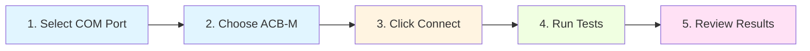
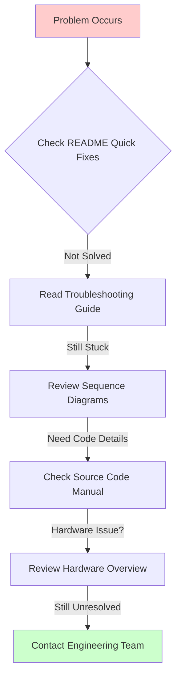

# ACB-M Factory Testing Documentation

**Device:** ACB-M (Advanced Control Board - Modbus)  
**Generation:** GEN-2  
**Microcontroller:** STM32  
**Communication:** UART (115200 baud)  
**Last Updated:** December 8, 2025

---

## 📚 Quick Navigation

### By Role

**🔧 Test Operator:**
- Start here: [Quick Start Guide](#quick-start-guide)
- Then go to: [Test Cases & Procedures](./ACBM-TestCases.md)
- When issues arise: [Troubleshooting Guide](./ACBM-Troubleshooting.md)

**👨‍💻 Software Developer:**
- Start here: [Source Code Manual](./ACBM-SourceCode.md)
- Then review: [Sequence Diagrams](./ACBM-Sequence.md)
- For hardware context: [Hardware Overview](./ACBM-Overview.md)

**⚙️ Hardware Engineer:**
- Start here: [Hardware Overview](./ACBM-Overview.md)
- For test procedures: [Test Cases](./ACBM-TestCases.md)
- For diagnostics: [Troubleshooting](./ACBM-Troubleshooting.md)

**📊 Quality Assurance:**
- Start here: [Test Cases & Procedures](./ACBM-TestCases.md)
- Review flows: [Sequence Diagrams](./ACBM-Sequence.md)
- Check criteria: Pass/fail thresholds in Test Cases

---

## 📖 Documentation Files

| File | Purpose | Audience | Diagrams |
|------|---------|----------|----------|
| **[ACBM-Overview.md](./ACBM-Overview.md)** | Hardware specifications, component architecture | Hardware engineers, beginners | Component Diagram, Block Diagrams |
| **[ACBM-Sequence.md](./ACBM-Sequence.md)** | Test execution flows, message sequences | Developers, testers | 15+ Sequence Diagrams, State Diagrams |
| **[ACBM-TestCases.md](./ACBM-TestCases.md)** | Detailed test procedures, pass/fail criteria | Test operators, QA | 15+ Flowcharts, Mind Maps |
| **[ACBM-SourceCode.md](./ACBM-SourceCode.md)** | Software manual, class/method documentation | Developers, maintainers | 5+ Class Diagrams |
| **[ACBM-Troubleshooting.md](./ACBM-Troubleshooting.md)** | Issue diagnosis, solutions | Operators, support engineers | 10+ State Diagrams, Flowcharts |

---

## 🔍 Device Overview

### What is ACB-M?

The **ACB-M (Advanced Control Board - Modbus)** is a GEN-2 STM32-based IoT gateway and automation controller designed for industrial building management systems. It combines multiple communication interfaces (WiFi, Ethernet, RS485/Modbus) with real-time clock functionality for robust data acquisition and control applications.

### Key Features

- **Microcontroller:** STM32 (ARM Cortex-M series)
- **Wireless:** WiFi 802.11b/g/n
- **Wired:** 10/100 Ethernet with PoE support
- **Industrial:** RS485-2 port for Modbus RTU communication
- **Timekeeping:** RTC (Real-Time Clock) with battery backup
- **UART Interface:** Hardware loopback testing capability
- **Power:** 12-24V DC input, PoE (Power over Ethernet) support

### Application Areas

- Building automation gateways
- Modbus RTU to TCP/IP converters
- Industrial IoT data loggers
- HVAC control interfaces
- Multi-protocol bridge devices

---

## 🧪 Test Summary

The ACB-M factory testing validates **5 critical subsystems**:

| Test | What It Checks | Pass Criteria | Typical Duration |
|------|----------------|---------------|------------------|
| **UART Loopback** | UART hardware integrity | Loopback value = `EE` | ~5 seconds |
| **RTC** | Real-time clock accuracy | Time within expected window | ~5 seconds |
| **WiFi** | Wireless connectivity | Networks > 1, Connected = 1 | ~10 seconds |
| **Ethernet** | Wired network interface | Valid MAC & IP address | ~8 seconds |
| **RS485-2** | Modbus serial interface | Status = 0 (success) | ~8 seconds |

**Total Test Time:** ~40-50 seconds  
**Pre-Testing:** Device info read (Version, UID, Make)  
**Post-Testing:** Results saved as CSV + JSON

---

## 🚀 Quick Start Guide

### Prerequisites

1. **Hardware Setup:**
   - ACB-M device powered and ready
   - USB-to-UART adapter connected to test PC
   - Ethernet cable connected (for Ethernet test)
   - WiFi access point nearby (for WiFi test)
   - RS485 test fixture/loopback (for RS485 test)

2. **Software:**
   - NubeIO EOL Toolkit application
   - Proper COM port drivers installed

### Testing in 5 Steps



#### Step-by-Step:

1. **Select Device Type:**
   - Open Factory Testing tab
   - Select **"ACB-M"** from device dropdown
   - Select COM port where ACB-M is connected

2. **Connect to Device:**
   - Click **"Connect"** button
   - Wait for green "Connected" status
   - Device info will be read automatically

3. **Run Tests:**
   - Tests run automatically after connection
   - Watch progress bar and status messages
   - Each test takes 5-10 seconds

4. **Review Results:**
   - Check ✅/❌ indicators for each test
   - Overall PASS requires all tests passing
   - Review details in results panel

5. **Save & Next:**
   - Results auto-saved to `logs/` folder
   - Optional: Print label
   - Disconnect and test next unit

---

## 📊 Understanding Results

### Device Information

Before tests run, the system reads device information:

```json
{
  "version": "1.0.4",
  "uid": "3700310031305337",
  "deviceMake": "ACB-M"
}
```

- **Version:** Firmware version (format: X.Y.Z)
- **UID:** Unique device identifier (16 hex digits)
- **Device Make:** Should match "ACB-M"

### Test Results Structure

Each test returns structured data:

```json
{
  "pass": true,
  "value": "EE",
  "raw": "+VALUE_UART:EE\r\nOK",
  "message": "Loopback value EE received"
}
```

- **pass:** Boolean - whether test passed criteria
- **value:** Extracted test value
- **raw:** Complete AT command response
- **message:** Human-readable result description

### Pass/Fail Criteria

**✅ PASS (All tests must pass):**
- UART: Loopback value = "EE"
- RTC: Time within 2001-01-01 to 2001-01-02 window
- WiFi: Networks > 1 AND Connected = 1
- Ethernet: Valid MAC (12+ chars) AND IP ≠ 0.0.0.0
- RS485-2: Status = 0

**❌ FAIL (Any test fails):**
- Device marked as FAILED
- Review failed test details
- Check troubleshooting guide
- Re-test or escalate to engineering

---

## 🔗 AT Command Reference (Quick)

| Command | Response | Purpose |
|---------|----------|---------|
| `AT+VERSION?` | `+VERSION:1.0.4` | Read firmware version |
| `AT+UID?` | `+UID:3700310031305337` | Read unique ID |
| `AT+DEVICEMAKE?` | `+DEVICEMAKE:ACB-M` | Read device type |
| `AT+TEST=uart` | `+VALUE_UART:EE` | UART loopback test |
| `AT+TEST=rtc` | `+RTC:2001-01-01 12:00:00` | RTC test |
| `AT+TEST=wifi` | `+WIFI:6,1` | WiFi scan and connect |
| `AT+TEST=eth` | `+ETH:MAC=...,IP=...` | Ethernet test |
| `AT+TEST=rs4852` | `+RS485:30,0` | RS485-2 port test |

**Note:** All commands require `OK` response. Timeout: 30 seconds per command.

---

## 🛠️ Common Issues & Quick Fixes

| Symptom | Likely Cause | Quick Fix |
|---------|--------------|-----------|
| Can't connect | Wrong COM port | Check Device Manager, select correct port |
| UART test fails | Hardware fault | Check TX/RX connections, test fixture |
| RTC outside window | RTC not initialized | Reflash firmware with RTC setup |
| WiFi networks = 0 | No AP nearby | Move closer to WiFi access point |
| Ethernet no IP | Cable not connected | Connect Ethernet cable, check switch |
| RS485 fails | Missing loopback | Install RS485 test jumper/fixture |

**For detailed troubleshooting, see:** [ACBM-Troubleshooting.md](./ACBM-Troubleshooting.md)

---

## 📈 Statistics & Performance

### Typical Test Session

- **Connection Time:** 3-5 seconds
- **Device Info Read:** 2-3 seconds
- **UART Test:** 5 seconds
- **RTC Test:** 5 seconds
- **WiFi Test:** 10 seconds (includes scan)
- **Ethernet Test:** 8 seconds
- **RS485-2 Test:** 8 seconds
- **Total Time:** ~45 seconds per unit

### Throughput

- **Per Hour:** ~70 units (with operator efficiency)
- **Per Shift (8hr):** ~500 units
- **Success Rate:** Typically 95-98% first-pass yield

---

## 📁 Files Generated

After each test session, the following files are created:

### CSV File (for database import)
```
logs/factory-results-acb-m.csv
```
Contains: Version, UID, Device Make, test results, pass/fail status, timestamp

### JSON File (for detailed analysis)
```
logs/factory-results-acb-m-[timestamp].json
```
Contains: Complete test results with all raw responses

### Log File (for debugging)
```
logs/factory-testing-[date].log
```
Contains: Detailed execution log with all AT commands and responses

---

## 🎓 Learning Resources

### For Beginners

1. **Start with concepts:**
   - Read [Hardware Overview](./ACBM-Overview.md) to understand the device
   - Study [Test Cases](./ACBM-TestCases.md) to learn what each test does
   - Review component diagram to see how parts connect

2. **Practice testing:**
   - Follow step-by-step procedures in Test Cases
   - Watch for green/red indicators
   - Use troubleshooting guide when stuck

3. **Build understanding:**
   - Read [Sequence Diagrams](./ACBM-Sequence.md) to see test flows
   - Review AT command protocol
   - Learn to interpret raw responses

### For Developers

1. **Understand the code:**
   - Study [Source Code Manual](./ACBM-SourceCode.md)
   - Review class diagrams and method documentation
   - See how ACB-M differs from Micro Edge

2. **Modify tests:**
   - Follow "Adding New Tests" guide in SourceCode.md
   - Test changes with actual hardware
   - Update documentation

3. **Debug issues:**
   - Enable verbose logging (see SourceCode.md)
   - Use serial monitor to see raw AT commands
   - Review sequence diagrams for expected flow

---

## 🔄 Comparison with Other Devices

| Feature | ACB-M | Micro Edge | ZC-LCD | Droplet |
|---------|-------|------------|--------|---------|
| **Microcontroller** | STM32 | ESP32 | ESP32 | ESP32 |
| **Ethernet** | ✅ Yes | ❌ No | ❌ No | ❌ No |
| **LoRa** | ❌ No | ✅ Yes | ❌ No | ✅ Yes |
| **LCD Display** | ❌ No | ❌ No | ✅ Yes | ❌ No |
| **RTC** | ✅ Yes | ❌ No | ❌ No | ❌ No |
| **RS485** | ✅ Yes (RS485-2) | ✅ Yes | ✅ Yes | ❌ No |
| **Test Count** | 5 tests | 10 tests | 4 tests | 3 tests |
| **Typical Duration** | ~45 sec | ~70 sec | ~35 sec | ~30 sec |

---

## 📞 Getting Help

### Documentation Chain



### Escalation Path

1. **Self-Service:** Use this documentation
2. **Peer Support:** Ask experienced operator
3. **Team Lead:** Escalate recurring issues
4. **Engineering:** Hardware/firmware defects
5. **Vendor:** Component failures

---

## 📝 Revision History

| Version | Date | Changes | Author |
|---------|------|---------|--------|
| 1.0 | 2025-12-08 | Initial comprehensive documentation | Documentation Team |

---

## 🎯 Next Steps

**Choose your path:**

- **📺 Learn Hardware:** Go to [ACBM-Overview.md](./ACBM-Overview.md)
- **🔄 Understand Flows:** Go to [ACBM-Sequence.md](./ACBM-Sequence.md)
- **🧪 Run Tests:** Go to [ACBM-TestCases.md](./ACBM-TestCases.md)
- **💻 Code Deep Dive:** Go to [ACBM-SourceCode.md](./ACBM-SourceCode.md)
- **🔧 Fix Problems:** Go to [ACBM-Troubleshooting.md](./ACBM-Troubleshooting.md)

---

**Need to test a different device?**
- [← Back to Factory Testing Main](../README.md)
- [Micro Edge Documentation](../../gen-1/micro-edge/MicroEdge-README.md)
- [ZC-LCD Documentation](../zc-lcd/ZCLCD-README.md)
- [ZC-Controller Documentation](../zc-controller/ZCController-README.md)
- [Droplet Documentation](../droplet/Droplet-README.md)
