# ACB-M Sequence Diagrams

**Device:** ACB-M (Advanced Control Board - Modbus)  
**Purpose:** Detailed test execution flows and message sequences  
**Last Updated:** December 8, 2025

---

## Table of Contents

1. [Overview](#overview)
2. [Complete Test Sequence](#complete-test-sequence)
3. [Connection Phase](#connection-phase)
4. [Device Info Reading](#device-info-reading)
5. [Individual Test Sequences](#individual-test-sequences)
6. [Error Handling](#error-handling)
7. [State Machine](#state-machine)

---

## Overview

This document contains **15+ sequence diagrams** showing the complete flow of ACB-M factory testing, from connection through all 5 tests to result saving.

### Testing Layers

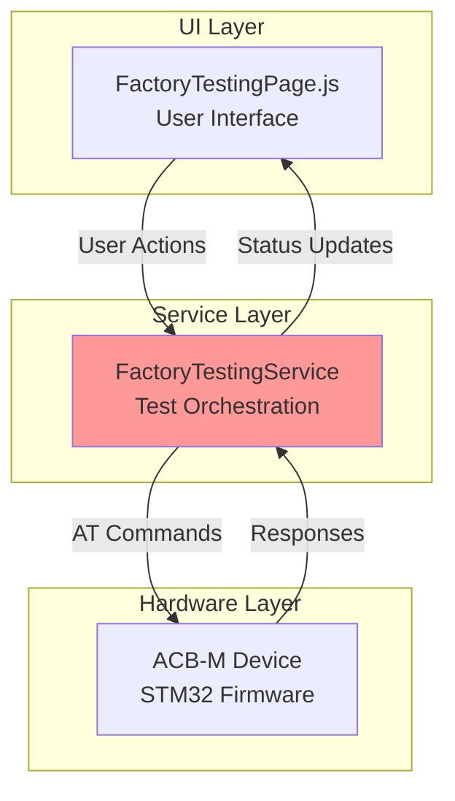

---

## Complete Test Sequence

### End-to-End Flow (70+ Steps)

```mermaid
sequenceDiagram
    actor User
    participant UI as Factory Testing UI
    participant Service as FactoryTestingService
    participant Serial as SerialPort
    participant Device as ACB-M (STM32)
    
    Note over User,Device: PHASE 1: PRE-TESTING & CONNECTION
    User->>UI: Select ACB-M device
    User->>UI: Select COM port
    User->>UI: Click "Connect"
    
    UI->>Service: connect(portPath, 115200, false, 'ACB-M')
    Service->>Serial: new SerialPort(portPath, {baudRate: 115200})
    Serial-->>Service: Port opened
    
    Service->>Device: (Wait 500ms for device ready)
    Service->>Device: AT
    Device-->>Service: OK
    Note over Service: Connection established
    
    Note over User,Device: PHASE 2: DEVICE INFO READING
    Service->>UI: updateProgress('Reading device info...')
    
    Service->>Device: AT+VERSION?
    Device-->>Service: +VERSION:1.0.4\r\nOK
    Service->>Service: Parse version: "1.0.4"
    
    Service->>Device: AT+UID?
    Device-->>Service: +UID:3700310031305337\r\nOK
    Service->>Service: Parse UID: "3700310031305337"
    
    Service->>Device: AT+DEVICEMAKE?
    Device-->>Service: +DEVICEMAKE:ACB-M\r\nOK
    Service->>Service: Parse deviceMake: "ACB-M"
    
    Service->>UI: updateProgress('Device info read')
    Service->>UI: Emit 'connected' event
    UI->>UI: Show device info in panel
    
    Note over User,Device: PHASE 3: AUTOMATED TESTING
    UI->>Service: runFactoryTests('v2', 'ACB-M', preTesting)
    Service->>UI: updateProgress('ACB-M: Starting tests...')
    
    Note over Service,Device: TEST 1: UART LOOPBACK
    Service->>UI: updateProgress('ACB-M: Running UART test...')
    Service->>Device: AT+TEST=uart
    Device->>Device: Enable TX-RX loopback
    Device->>Device: Send 0xEE byte
    Device->>Device: Receive 0xEE byte
    Device-->>Service: +VALUE_UART:EE\r\nOK
    Service->>Service: Parse: value="EE", pass=true
    Service->>Service: resultsACB.tests.uart = {pass:true, value:"EE"}
    
    Note over Service,Device: TEST 2: RTC
    Service->>UI: updateProgress('ACB-M: Running RTC test...')
    Service->>Device: AT+TEST=rtc
    Device->>Device: Read RTC registers
    Device->>Device: Format timestamp
    Device-->>Service: +RTC:2001-01-01 12:34:56\r\nOK
    Service->>Service: Parse timestamp
    Service->>Service: Check within window: 2001-01-01 to 2001-01-02
    Service->>Service: resultsACB.tests.rtc = {pass:true, time:"..."}
    
    Note over Service,Device: TEST 3: WIFI
    Service->>UI: updateProgress('ACB-M: Running WiFi test...')
    Service->>Device: AT+TEST=wifi
    Device->>Device: Scan for networks (5-10 sec)
    Device->>Device: Connect to test SSID
    Device->>Device: Count networks, check connection
    Device-->>Service: +WIFI:6,1\r\nOK
    Service->>Service: Parse: networks=6, connected=1
    Service->>Service: Validate: networks>1 AND connected=1
    Service->>Service: resultsACB.tests.wifi = {pass:true, networks:6, connected:1}
    
    Note over Service,Device: TEST 4: ETHERNET
    Service->>UI: updateProgress('ACB-M: Running Ethernet test...')
    Service->>Device: AT+TEST=eth
    Device->>Device: Read MAC address from hardware
    Device->>Device: Get IP address (DHCP or static)
    Device->>Device: Check link status
    Device-->>Service: +ETH:MAC=84:1F:E8:10:9E:3B,IP=192.168.0.100\r\nOK
    Service->>Service: Parse MAC and IP
    Service->>Service: Validate: MAC valid, IP != 0.0.0.0
    Service->>Service: resultsACB.tests.eth = {pass:true, mac:"...", ip:"..."}
    
    Note over Service,Device: TEST 5: RS485-2
    Service->>UI: updateProgress('ACB-M: Running RS485-2 test...')
    Service->>Device: AT+TEST=rs4852
    Device->>Device: Send test pattern on RS485-2 TX
    Device->>Device: Receive on RS485-2 RX (loopback)
    Device->>Device: Count bytes, check integrity
    Device-->>Service: +RS485:30,0\r\nOK
    Service->>Service: Parse: count=30, status=0
    Service->>Service: Validate: status=0 (success)
    Service->>Service: resultsACB.tests.rs4852 = {pass:true, count:30, status:0}
    
    Note over Service,Device: PHASE 4: RESULT COMPILATION
    Service->>Service: Check all tests: pass_uart && pass_rtc && pass_wifi && pass_eth && pass_rs4852
    Service->>Service: resultsACB.summary = {passAll: true}
    Service->>UI: updateProgress('ACB-M tests completed')
    UI->>UI: Display results (all tests green ✅)
    
    Note over Service,Device: PHASE 5: SAVE RESULTS
    UI->>Service: saveResults()
    Service->>Service: Build CSV row
    Service->>Service: Build JSON structure
    Service->>Service: Write to logs/factory-results-acb-m.csv
    Service->>Service: Write to logs/factory-results-acb-m-[timestamp].json
    Service-->>UI: Results saved
    
    User->>UI: Review pass/fail
    User->>UI: Optional: Print label
    User->>UI: Click "Disconnect"
    UI->>Service: disconnect()
    Service->>Serial: port.close()
    Serial-->>Service: Port closed
    Service->>UI: Emit 'disconnected' event
    UI->>UI: Reset UI for next device
```

---

## Connection Phase

### Serial Port Connection (STM32)

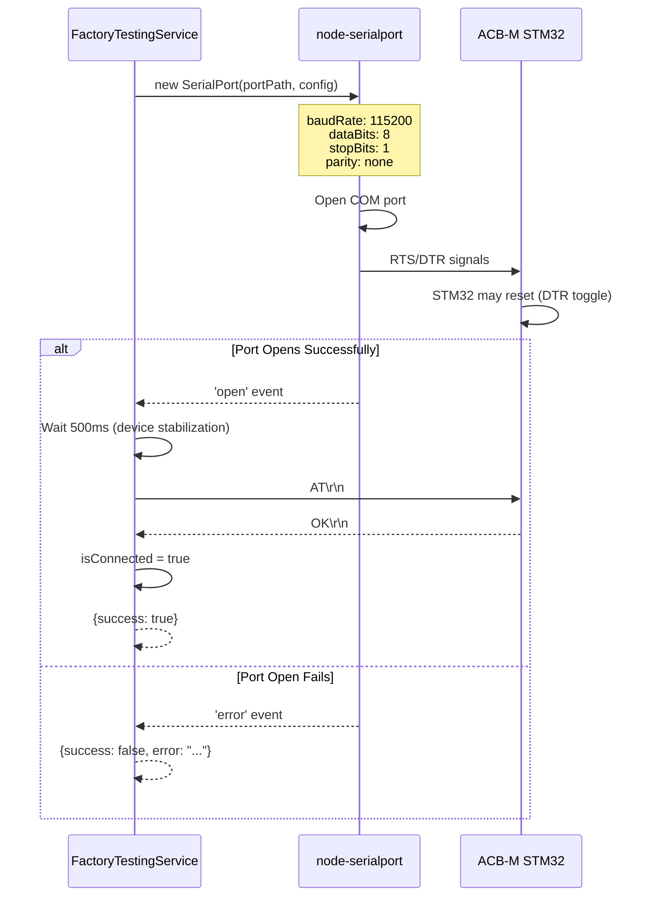

**Key Differences from Micro Edge:**
- No unlock sequence required (STM32 doesn't use unlock)
- Shorter stabilization time (500ms vs 2000ms)
- Direct AT command response (no boot messages)

### Connection State Diagram

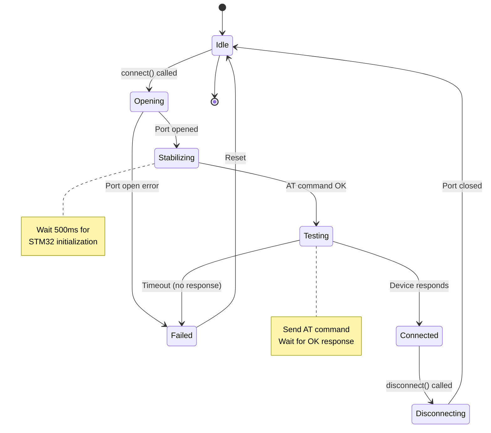

---

## Device Info Reading

### Read Version, UID, Device Make

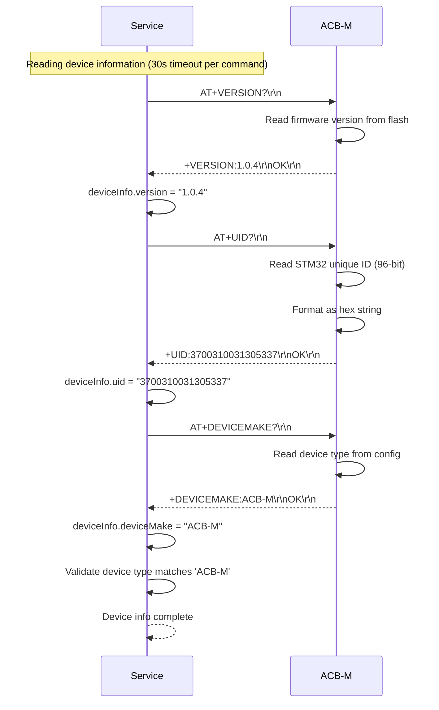

**STM32 Unique ID:**
- 96-bit unique ID (12 bytes)
- Factory programmed by ST Microelectronics
- Cannot be modified
- Displayed as 16-character hex string (first 64 bits)

---

## Individual Test Sequences

### TEST 1: UART Loopback

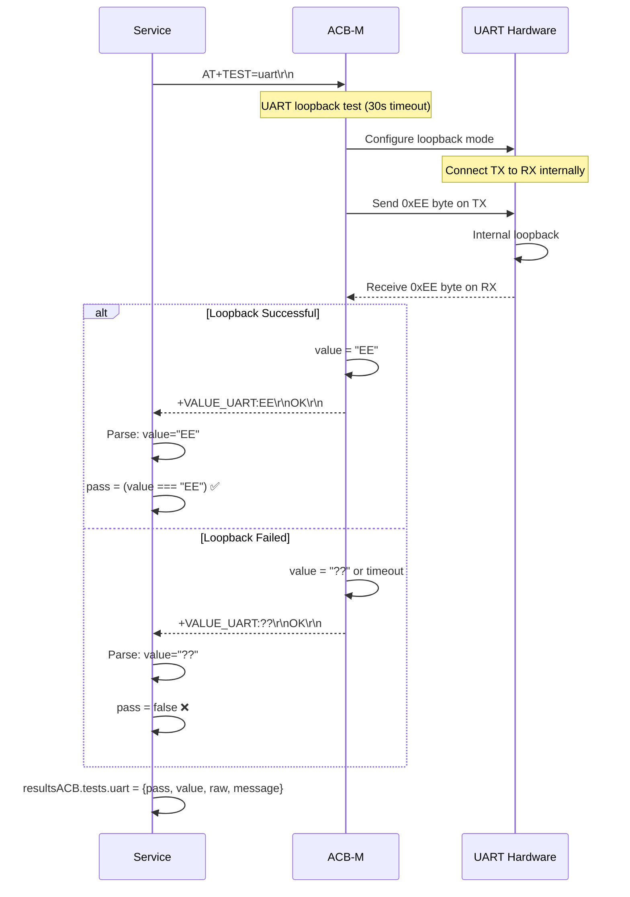

**Pass Criteria:** Loopback value must exactly equal "EE"  
**Purpose:** Validates UART TX/RX hardware integrity, no shorts or opens

### TEST 2: RTC (Real-Time Clock)

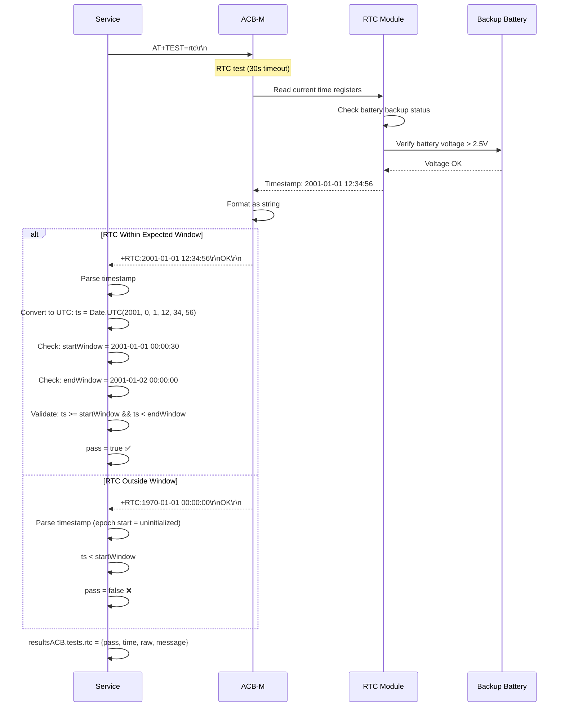

**Pass Criteria:** RTC time must be within 2001-01-01 00:00:30 to 2001-01-02 00:00:00  
**Purpose:** Validates RTC is initialized, battery backup present, timekeeping accurate

**RTC Initialization Window:**
- Devices are programmed with RTC set to 2001-01-01 at manufacturing
- Window allows for production line delays (up to 24 hours)
- If RTC shows 1970 or far future, it's uninitialized or battery dead

### TEST 3: WiFi Scan & Connect

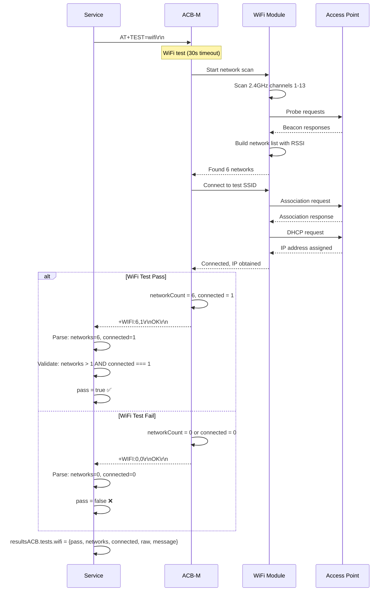

**Pass Criteria:** 
- Networks > 1 (proves WiFi radio functional)
- Connected = 1 (proves can associate to test AP)

**Purpose:** Validates WiFi module presence, RF functionality, protocol stack

### TEST 4: Ethernet Link & IP

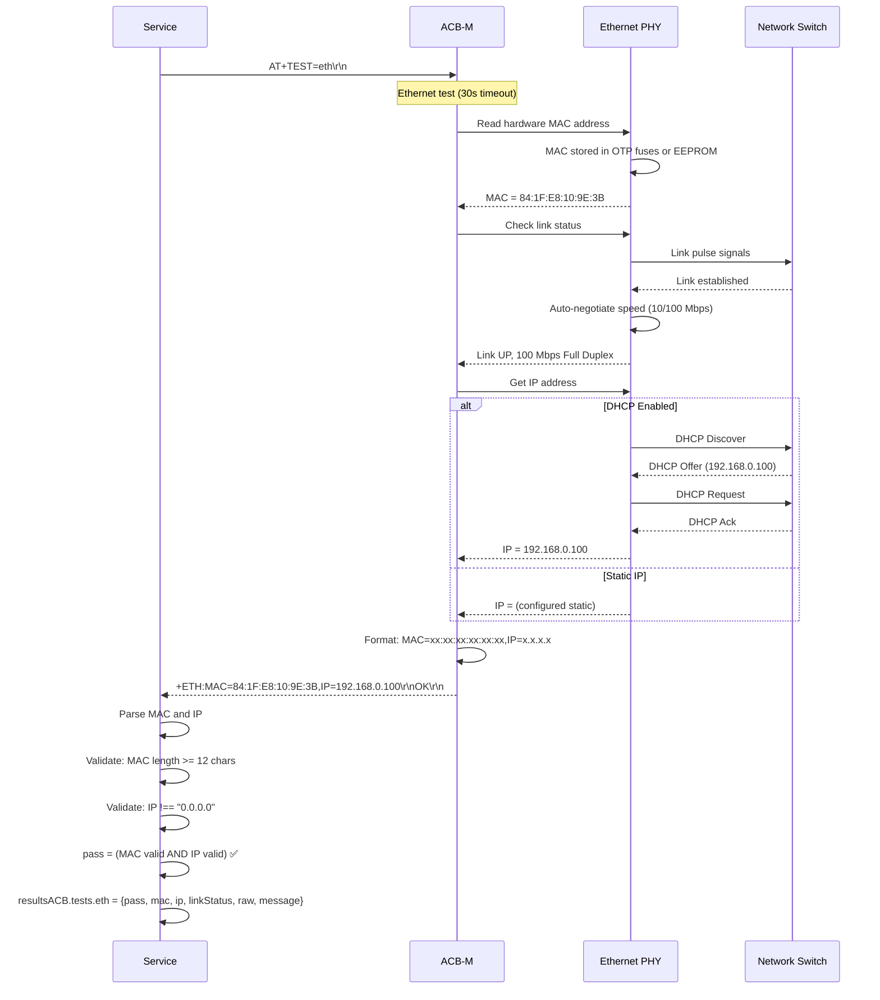

**Pass Criteria:**
- MAC address: Valid (12+ characters, typically XX:XX:XX:XX:XX:XX format)
- IP address: Valid (not 0.0.0.0)

**Purpose:** Validates Ethernet PHY functional, MAC programmed, can obtain IP

**Alternative Response Format:**
```
+ETH:841FE8109E38,192.168.0.100,4/4
```
- Compact format: MAC (no colons), IP, link status (duplex/speed indicator)

### TEST 5: RS485-2 Loopback

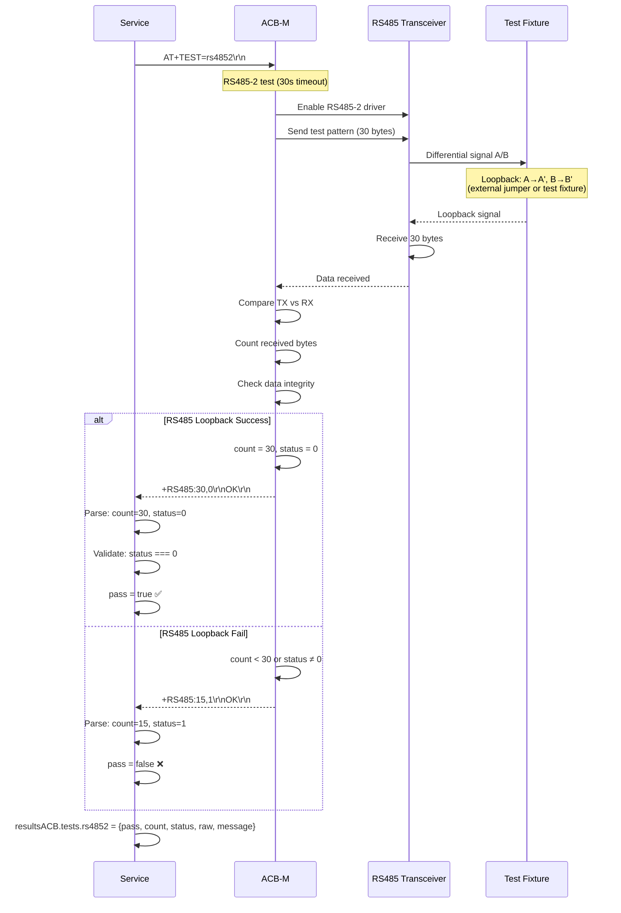

**Pass Criteria:** Status = 0 (success)

**Purpose:** Validates RS485 transceiver functional, can transmit and receive

**Status Codes:**
- 0: Success (all bytes received correctly)
- 1: Partial failure (some bytes lost or corrupted)
- 2: Complete failure (no bytes received)

---

## Error Handling

### Timeout Handling

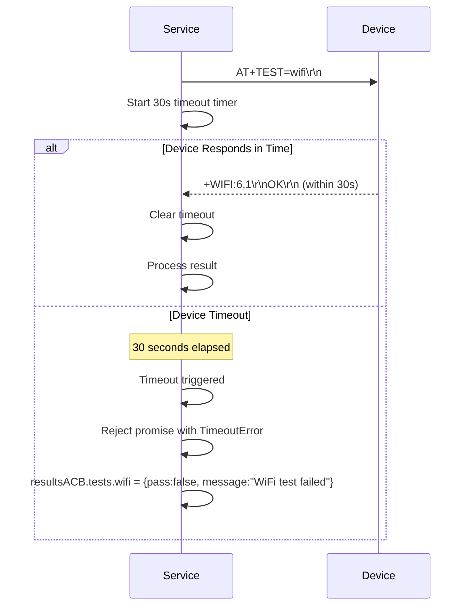

### Test Failure Recovery

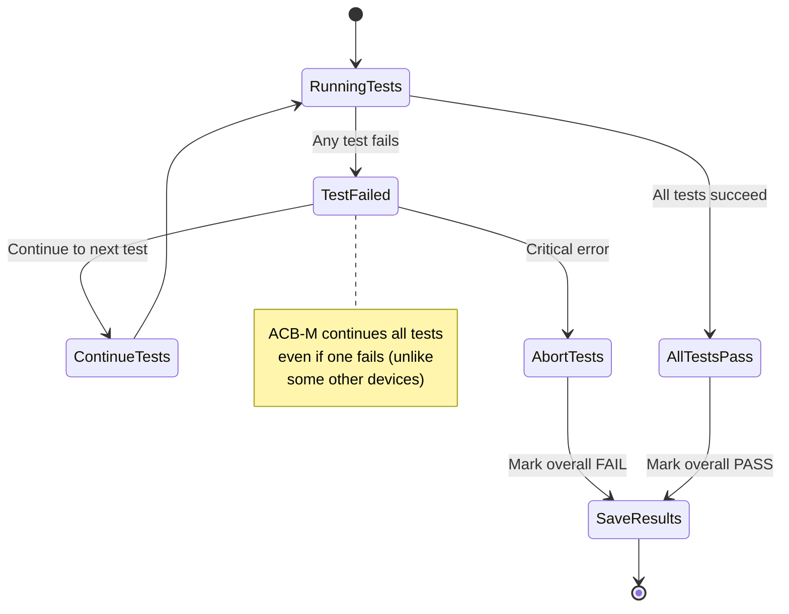

**Error Recovery Strategy:**
- Continue all tests even if one fails
- Compile all results (pass and fail)
- Overall PASS requires ALL tests passing
- Save complete results for failure analysis

---

## State Machine

### Overall Test Lifecycle

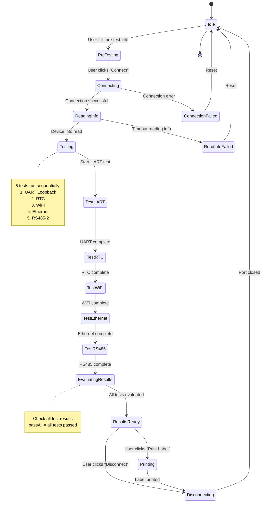

---

## Revision History

| Version | Date | Changes |
|---------|------|---------|
| 1.0 | 2025-12-08 | Initial sequence diagram documentation |

---

## Related Documents

- [ACBM-README.md](./ACBM-README.md) - Main documentation index
- [ACBM-Overview.md](./ACBM-Overview.md) - Hardware specifications
- [ACBM-TestCases.md](./ACBM-TestCases.md) - Detailed test procedures
- [ACBM-SourceCode.md](./ACBM-SourceCode.md) - Software implementation
- [ACBM-Troubleshooting.md](./ACBM-Troubleshooting.md) - Issue resolution

---

**[← Back to ACB-M README](./ACBM-README.md)**
