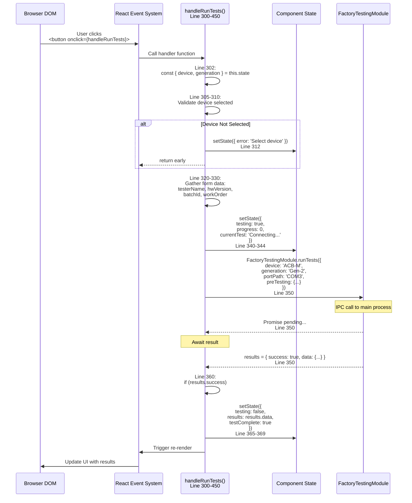
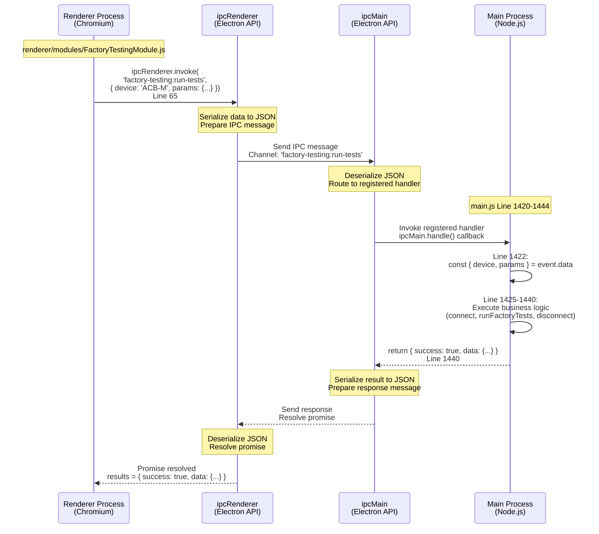

# ACB-M - Source Code Manual

**Device Type:** GEN-2 (STM32-based)  
**Target Audience:** Developers, Maintainers, Code Contributors  
**Last Updated:** December 9, 2025

---

## Table of Contents

- [Architecture Overview](#architecture-overview)
- [Class Diagrams](#class-diagrams)
- [File Structure](#file-structure)
- [ACB-M Test Implementation](#acb-m-test-implementation)
- [Method Reference](#method-reference)
- [Data Structures](#data-structures)
- [Communication Protocol](#communication-protocol)
- [Code Examples](#code-examples)
- [Adding New Tests](#adding-new-tests)
- [Debugging Guide](#debugging-guide)

---

## Architecture Overview

### System Architecture


### Component Diagram

```mermaid
graph LR
    subgraph "Presentation Layer"
        UI[FactoryTestingPage<br/>React Component]
        FORMS[Pre-Testing Forms<br/>Device Selection<br/>Progress Display]
    end
    
    subgraph "Application Layer"
        IPC_CLIENT[FactoryTestingModule<br/>IPC Client Wrapper]
        STATE[State Management<br/>Auto-connect Logic<br/>Result Processing]
    end
    
    subgraph "Business Logic Layer"
        FTS_SERVICE[FactoryTestingService<br/>Test Orchestration]
        TEST_RUNNER[runFactoryTests()<br/>Device-Specific Logic]
        EVALUATOR[Test Evaluation<br/>Pass/Fail Criteria]
    end
    
    subgraph "Data Access Layer"
        SERIAL_MGR[Serial Communication<br/>connect() / disconnect()]
        AT_CMD[AT Command Handler<br/>sendATCommand()]
        PARSER[Response Parser<br/>Timeout Management]
    end
    
    subgraph "Infrastructure"
        NODE_SERIAL[node-serialport<br/>Native Module]
        FS[File System<br/>CSV / JSON Save]
        PRINTER[Printer Service<br/>Python Script]
    end
    
    UI --> IPC_CLIENT
    IPC_CLIENT --> FTS_SERVICE
    FTS_SERVICE --> TEST_RUNNER
    TEST_RUNNER --> EVALUATOR
    TEST_RUNNER --> AT_CMD
    AT_CMD --> SERIAL_MGR
    SERIAL_MGR --> NODE_SERIAL
    EVALUATOR --> FS
    FTS_SERVICE --> PRINTER
    
    style FTS_SERVICE fill:#4A90E2,color:#fff
    style TEST_RUNNER fill:#FFB74D,color:#fff
```

---

## Class Diagrams

### Main Class Hierarchy


### ACB-M Test Flow Class Diagram


---

## File Structure

### Source Code Locations

```
NubeiO-Eol-Toolkit/
│
├── main.js                                    # Electron main process entry
│   ├── Line 21: require factory-testing.js
│   ├── Line 145: const factoryTesting = new FactoryTestingService()
│   ├── Line 1390-1444: IPC handler registration
│   └── IPC handlers:
│       ├── factory-testing:connect
│       ├── factory-testing:disconnect
│       ├── factory-testing:run-tests
│       ├── factory-testing:save-results
│       └── factory-testing:print-label
│
├── services/
│   └── factory-testing.js                     # Core testing service
│       ├── Line 13: class FactoryTestingService
│       ├── Line 30: awaitTestJSONResult()
│       ├── Line 159: connect()
│       ├── Line 378: disconnect()
│       ├── Line 414: sendATCommand()
│       ├── Line 549: readDeviceInfo()
│       ├── Line 1032: runFactoryTests() [MAIN TEST ROUTER]
│       ├── Line 1176-1370: ACB-M Test Implementation ⭐
│       │   ├── Line 1176: ACB-M device check
│       │   ├── Line 1177-1182: Initialize resultsACB structure
│       │   ├── Line 1184-1186: ensureString() helper
│       │   ├── Line 1188-1197: parseRtcTimestamp() helper
│       │   ├── Line 1199-1204: withinRtcWindow() helper
│       │   ├── Line 1206-1208: setEval() helper
│       │   ├── Line 1214-1230: TC-001 UART Loopback Test
│       │   ├── Line 1233-1251: TC-002 RTC Test
│       │   ├── Line 1254-1278: TC-003 WiFi Test
│       │   ├── Line 1281-1335: TC-004 Ethernet Test
│       │   ├── Line 1338-1362: TC-005 RS485-2 Test
│       │   └── Line 1364-1370: Overall pass/fail evaluation
│       ├── Line 1653: saveResults()
│       ├── Line 1845: printLabel()
│       └── Line 2290: Helper methods
│
├── renderer/
│   ├── pages/
│   │   └── FactoryTestingPage.js              # UI page component
│   │       ├── Line 6: class FactoryTestingPage
│   │       ├── Line 13-15: Device arrays (includes ACB-M)
│   │       ├── Line 50: state management
│   │       ├── Line 140: handleConnect()
│   │       ├── Line 300: handleRunTests()
│   │       ├── Line 450: renderPreTestingForm()
│   │       ├── Line 650: renderResults() (ACB-M specific)
│   │       └── Line 2800: render()
│   │
│   └── modules/
│       └── FactoryTestingModule.js            # IPC client module
│           ├── Line 10: connect()
│           ├── Line 30: disconnect()
│           ├── Line 50: runTests()
│           ├── Line 75: saveResults()
│           └── Line 100: onProgress()
│
└── embedded/
    └── [ACB-M firmware - AT command implementation]
```

---

## ACB-M Test Implementation

### Entry Point: runFactoryTests()

**Location:** `services/factory-testing.js` Line 1032

The main test router identifies the device type and delegates to the appropriate test suite:

```javascript
async runFactoryTests(version, device, deviceInfo, preTesting, macAddressManual) {
  // ... validation code ...
  
  // Line 1176: ACB-M branch
  if (device === 'ACB-M') {
    // ACB-M specific test logic (Lines 1176-1370)
    return await this.runACBMTests(deviceInfo);
  }
  
  // ... other device types ...
}
```

### ACB-M Test Structure Overview

```mermaid
flowchart TD
    START([runFactoryTests]) --> CHECK{Device<br/>= ACB-M?}
    
    CHECK -->|No| OTHER[Other Device Logic]
    CHECK -->|Yes| INIT[Initialize resultsACB<br/>Line 1177-1182]
    
    INIT --> HELPERS[Define Helper Functions<br/>ensureString()<br/>parseRtcTimestamp()<br/>withinRtcWindow()<br/>setEval()]
    
    HELPERS --> TC001[TC-001: UART Test<br/>Line 1214-1230]
    TC001 --> TC002[TC-002: RTC Test<br/>Line 1233-1251]
    TC002 --> TC003[TC-003: WiFi Test<br/>Line 1254-1278]
    TC003 --> TC004[TC-004: Ethernet Test<br/>Line 1281-1335]
    TC004 --> TC005[TC-005: RS485-2 Test<br/>Line 1338-1362]
    
    TC005 --> EVAL[Evaluate Overall Pass/Fail<br/>Line 1364-1370]
    EVAL --> RETURN[Return resultsACB]
    
    style TC001 fill:#4A90E2,color:#fff
    style TC002 fill:#4A90E2,color:#fff
    style TC003 fill:#4A90E2,color:#fff
    style TC004 fill:#4A90E2,color:#fff
    style TC005 fill:#4A90E2,color:#fff
```

---

## Detailed Code Execution Flow

### Complete Execution Trace: Start Test Button Click

This diagram shows the **complete call stack** from user click to test completion with exact file locations and line numbers:

```mermaid
sequenceDiagram
    participant User
    participant UI as FactoryTestingPage.js<br/>Line 300-450
    participant Module as FactoryTestingModule.js<br/>Line 50-100
    participant IPC as Electron IPC Bridge
    participant Main as main.js<br/>Line 1390-1444
    participant Service as factory-testing.js<br/>Line 13-2310
    participant Serial as SerialPort Library
    participant Device as ACB-M Hardware
    
    User->>UI: Click "Start Test" button
    Note over UI: renderer/pages/FactoryTestingPage.js
    
    UI->>UI: handleRunTests()<br/>Line 300
    Note over UI: Validate form data<br/>Check device selection
    
    UI->>UI: setState({ testing: true })<br/>Line 315
    
    UI->>Module: runTests(params)<br/>Line 330
    Note over Module: renderer/modules/FactoryTestingModule.js
    
    Module->>IPC: ipcRenderer.invoke(<br/>'factory-testing:run-tests',<br/>{ device, params })<br/>Line 65
    
    Note over IPC: Cross-process boundary<br/>Renderer → Main
    
    IPC->>Main: IPC Handler Triggered<br/>Line 1420
    Note over Main: main.js<br/>ipcMain.handle() callback
    
    Main->>Main: Extract device, params<br/>Line 1422-1423
    
    Main->>Service: connect(portPath, baudRate)<br/>Line 1425
    Note over Service: services/factory-testing.js<br/>Line 159-220
    
    Service->>Service: Check isConnecting flag<br/>Line 162
    Service->>Service: this.port = new SerialPort(...)<br/>Line 175
    Service->>Serial: Open serial port
    Serial-->>Service: 'open' event<br/>Line 189
    Service->>Service: this.isConnected = true<br/>Line 191
    Service-->>Main: resolve({ success: true })<br/>Line 192
    
    Main->>Service: runFactoryTests(<br/>version, device, deviceInfo, preTesting)<br/>Line 1430
    Note over Service: Line 1032-1650<br/>Main test router
    
    Service->>Service: Validate parameters<br/>Line 1050-1070
    
    Service->>Service: if (device === 'ACB-M')<br/>Line 1176
    Note over Service: ACB-M branch selected
    
    Service->>Service: Initialize resultsACB<br/>Line 1177-1182
    
    Service->>Service: Define helper functions<br/>ensureString(), parseRtcTimestamp(),<br/>withinRtcWindow(), setEval()<br/>Line 1184-1208
    
    Note over Service,Device: TC-001: UART Test
    
    Service->>Service: updateProgress('UART test...')<br/>Line 1214
    Service->>Service: sendATCommand(<br/>'AT+TEST=uart',<br/>'+VALUE_UART:',<br/>30000)<br/>Line 1215
    Note over Service: Line 414-540<br/>sendATCommand method
    
    Service->>Serial: port.write('AT+TEST=uart\r\n')<br/>Line 480
    Serial->>Device: UART TX
    Device-->>Serial: UART RX: +VALUE_UART: EE
    Serial-->>Service: parser 'data' event<br/>Line 450
    Service->>Service: Parse response<br/>Extract 'EE'<br/>Line 1216
    Service->>Service: Check: value === 'EE'<br/>Line 1217
    Service->>Service: resultsACB.tests.uart = {...}<br/>Line 1218-1223
    Service->>Service: setEval('pass_uart', true)<br/>Line 1224
    
    Note over Service,Device: TC-002: RTC Test
    
    Service->>Service: updateProgress('RTC test...')<br/>Line 1233
    Service->>Service: sendATCommand('AT+TEST=rtc')<br/>Line 1234
    Serial->>Device: UART TX
    Device-->>Serial: UART RX: +RTC: 2001-01-01 12:30:45
    Serial-->>Service: Response received
    Service->>Service: parseRtcTimestamp(timeStr)<br/>Line 1236
    Note over Service: Line 1188-1197<br/>Helper function
    Service->>Service: withinRtcWindow(parsed.utc)<br/>Line 1237
    Note over Service: Line 1199-1204<br/>Helper function
    Service->>Service: resultsACB.tests.rtc = {...}<br/>Line 1238-1243
    Service->>Service: setEval('pass_rtc', true)<br/>Line 1244
    
    Note over Service,Device: TC-003: WiFi Test
    
    Service->>Service: updateProgress('WiFi test...')<br/>Line 1254
    Service->>Service: sendATCommand('AT+TEST=wifi')<br/>Line 1255
    Serial->>Device: UART TX
    Device-->>Serial: UART RX: +WIFI: 8,1
    Serial-->>Service: Response received
    Service->>Service: Parse: networkCount, connected<br/>Line 1257-1259
    Service->>Service: Check: networkCount > 1 && connected === 1<br/>Line 1260
    Service->>Service: resultsACB.tests.wifi = {...}<br/>Line 1261-1268
    Service->>Service: setEval('pass_wifi', true)<br/>Line 1269
    
    Note over Service,Device: TC-004: Ethernet Test
    
    Service->>Service: updateProgress('Ethernet test...')<br/>Line 1281
    Service->>Service: sendATCommand('AT+TEST=eth')<br/>Line 1282
    Serial->>Device: UART TX
    Device-->>Serial: UART RX: +ETH: MAC=xx,IP=xx
    Serial-->>Service: Response received
    Service->>Service: Parse format (dual format support)<br/>Line 1285-1307
    Service->>Service: Validate MAC & IP<br/>Line 1309-1310
    Service->>Service: resultsACB.tests.eth = {...}<br/>Line 1312-1321
    Service->>Service: setEval('pass_eth', true)<br/>Line 1322
    
    Note over Service,Device: TC-005: RS485-2 Test
    
    Service->>Service: updateProgress('RS485-2 test...')<br/>Line 1338
    Service->>Service: sendATCommand('AT+TEST=rs4852')<br/>Line 1339
    Serial->>Device: UART TX
    Device-->>Serial: UART RX: +RS485: 30,0
    Serial-->>Service: Response received
    Service->>Service: Parse: count, status<br/>Line 1341-1343
    Service->>Service: Check: status === 0<br/>Line 1344
    Service->>Service: resultsACB.tests.rs4852 = {...}<br/>Line 1345-1352
    Service->>Service: setEval('pass_rs4852', true)<br/>Line 1353
    
    Note over Service: Overall Evaluation
    
    Service->>Service: Calculate allPass<br/>Object.values(_eval).every(Boolean)<br/>Line 1364
    Service->>Service: Return resultsACB<br/>Line 1368
    
    Service-->>Main: { success: true, data: resultsACB }<br/>Line 1430
    
    Main->>Service: disconnect()<br/>Line 1435
    Note over Service: Line 378-410
    Service->>Serial: port.close()
    Serial-->>Service: 'close' callback
    Service->>Service: this.isConnected = false<br/>Line 393
    Service-->>Main: Connection closed
    
    Main-->>IPC: Return test results<br/>Line 1440
    
    Note over IPC: Cross-process boundary<br/>Main → Renderer
    
    IPC-->>Module: Promise resolved<br/>Line 65
    Module-->>UI: Return results<br/>Line 75
    
    UI->>UI: setState({ results, testing: false })<br/>Line 380
    UI->>UI: renderResults()<br/>Line 650-850
    Note over UI: Display test results table<br/>Show pass/fail for each test
    
    UI->>User: Show results on screen
```



### UI Button Click Handler - Detailed Breakdown

**File:** `renderer/pages/FactoryTestingPage.js`



### IPC Communication Flow - Deep Dive



---

## Method Call Stack Traces

### Stack Trace #1: Connect to Device

```
User clicks "Start Test"
  ↓
[UI] FactoryTestingPage.js:300 handleRunTests()
  ↓
[UI] FactoryTestingModule.js:50 runTests()
  ↓
[UI] FactoryTestingModule.js:65 ipcRenderer.invoke('factory-testing:run-tests')
  ━━━━━━━━━━━━━━━━━━━━━━━━━━━━━━━━━━━━━━━━━━━━━━━━━━━━━━━━━━━
  IPC BOUNDARY (Renderer → Main)
  ━━━━━━━━━━━━━━━━━━━━━━━━━━━━━━━━━━━━━━━━━━━━━━━━━━━━━━━━━━━
  ↓
[Main] main.js:1420 ipcMain.handle() callback
  ↓
[Main] main.js:1425 factoryTestingService.connect(portPath, baudRate)
  ↓
[Service] factory-testing.js:159 connect()
  ↓
[Service] factory-testing.js:162 Check isConnecting flag
  ↓
[Service] factory-testing.js:168 if (this.isConnected) await this.disconnect()
  ↓
[Service] factory-testing.js:175 this.port = new SerialPort({ path, baudRate, ... })
  ↓
[Native] serialport library opens COM port
  ↓
[Service] factory-testing.js:189 this.port.on('open', callback)
  ↓
[Service] factory-testing.js:191 this.isConnected = true
  ↓
[Service] factory-testing.js:192 resolve({ success: true })
  ↓
[Main] main.js:1425 await returns
```

### Stack Trace #2: Run ACB-M Tests

```
[Main] main.js:1430 factoryTestingService.runFactoryTests(version, device, ...)
  ↓
[Service] factory-testing.js:1032 runFactoryTests()
  ↓
[Service] factory-testing.js:1050-1070 Validate parameters
  ↓
[Service] factory-testing.js:1176 if (device === 'ACB-M')
  ↓
[Service] factory-testing.js:1177-1182 Initialize resultsACB object
  ↓
[Service] factory-testing.js:1184 Define ensureString() helper
[Service] factory-testing.js:1188 Define parseRtcTimestamp() helper
[Service] factory-testing.js:1199 Define withinRtcWindow() helper
[Service] factory-testing.js:1206 Define setEval() helper
  ↓
━━━━━━━━━━━━━━━━━━━━━━━━━━━━━━━━━━━━━━━━━━━━━━━━━━━━━━━━━━━
TC-001: UART Test
━━━━━━━━━━━━━━━━━━━━━━━━━━━━━━━━━━━━━━━━━━━━━━━━━━━━━━━━━━━
  ↓
[Service] factory-testing.js:1214 this.updateProgress('UART test...')
  ↓
[Service] factory-testing.js:1215 await this.sendATCommand('AT+TEST=uart', '+VALUE_UART:', 30000)
  ↓
[Service] factory-testing.js:414 sendATCommand(cmd, prefix, timeout)
  ↓
[Service] factory-testing.js:425 Check if (this.port && this.isConnected)
  ↓
[Service] factory-testing.js:435 Setup timeout = setTimeout(..., 30000)
  ↓
[Service] factory-testing.js:480 this.port.write('AT+TEST=uart\r\n')
  ↓
[Native] serialport transmits UART bytes
  ↓
[Hardware] ACB-M device receives command
[Hardware] ACB-M processes test
[Hardware] ACB-M sends response: +VALUE_UART: EE\nOK\n
  ↓
[Native] serialport receives UART bytes
  ↓
[Service] factory-testing.js:445 this.parser.on('data') event fires
  ↓
[Service] factory-testing.js:450 Parse line by line
  ↓
[Service] factory-testing.js:455 Check if line starts with '+VALUE_UART:'
  ↓
[Service] factory-testing.js:460 responseLines.push(line)
  ↓
[Service] factory-testing.js:470 Check if line === 'OK'
  ↓
[Service] factory-testing.js:475 clearTimeout(timeout)
  ↓
[Service] factory-testing.js:485 resolve(responseLines.join('\n'))
  ↓
[Service] factory-testing.js:1215 await returns with response
  ↓
[Service] factory-testing.js:1216 const value = resp.replace('+VALUE_UART:', '').trim()
  ↓
[Service] factory-testing.js:1217 const pass = value.toUpperCase() === 'EE'
  ↓
[Service] factory-testing.js:1218-1223 resultsACB.tests.uart = { pass, value, raw, message }
  ↓
[Service] factory-testing.js:1224 setEval('pass_uart', pass)
  ↓
[Service] factory-testing.js:1206 resultsACB._eval['pass_uart'] = (pass === true)
  ↓
━━━━━━━━━━━━━━━━━━━━━━━━━━━━━━━━━━━━━━━━━━━━━━━━━━━━━━━━━━━
TC-002 through TC-005 follow same pattern
━━━━━━━━━━━━━━━━━━━━━━━━━━━━━━━━━━━━━━━━━━━━━━━━━━━━━━━━━━━
  ↓
[Service] factory-testing.js:1364 const allPass = Object.values(resultsACB._eval).every(Boolean)
  ↓
[Service] factory-testing.js:1368 return resultsACB
  ↓
[Main] main.js:1430 await returns with results
```

### Stack Trace #3: Send AT Command (Deep Dive)

```
[Caller] factory-testing.js:1215 await this.sendATCommand('AT+TEST=uart', '+VALUE_UART:', 30000)
  ↓
[Service] factory-testing.js:414 sendATCommand(cmd, prefix, timeout)
  ├─ Parameters:
  │  cmd = 'AT+TEST=uart'
  │  prefix = '+VALUE_UART:'
  │  timeout = 30000 (30 seconds)
  ↓
[Service] factory-testing.js:420 Log: `Sending AT command: ${cmd}`
  ↓
[Service] factory-testing.js:425 if (!this.port || !this.isConnected)
  ├─ If false → throw new Error('Not connected')
  └─ If true → continue
  ↓
[Service] factory-testing.js:430 return new Promise((resolve, reject) => {...})
  ↓
[Service] factory-testing.js:435 Setup timeout timer
  │
  │  let timeout = setTimeout(() => {
  │    this.parser.removeListener('data', onData);
  │    reject(new Error(`Timeout waiting for response`));
  │  }, 30000);
  ↓
[Service] factory-testing.js:440 const responseLines = []
[Service] factory-testing.js:441 let gotPrefix = false
  ↓
[Service] factory-testing.js:445 Define onData handler:
  │
  │  const onData = (data) => {
  │    const line = data.toString().trim();
  │    console.log(`RX: ${line}`);
  │    
  │    if (line.startsWith(prefix)) {
  │      gotPrefix = true;
  │      responseLines.push(line);
  │    }
  │    
  │    if (line === 'OK' || line.startsWith('ERROR')) {
  │      clearTimeout(timeout);
  │      this.parser.removeListener('data', onData);
  │      resolve(responseLines.join('\n'));
  │    }
  │  };
  ↓
[Service] factory-testing.js:478 this.parser.on('data', onData)
  ↓
[Service] factory-testing.js:480 Send command:
  │
  │  const commandStr = cmd + '\r\n';
  │  this.port.write(commandStr, (err) => {
  │    if (err) {
  │      clearTimeout(timeout);
  │      reject(err);
  │    }
  │  });
  ↓
[Native] serialport.write() sends bytes to COM port
  ↓
  ━━━━━━━━━━━━━━━━━━━━━━━━━━━━━━━━━━━━━━━━━━━━━━━━━━━━━━━━━━━
  WAITING FOR DEVICE RESPONSE (up to 30 seconds)
  ━━━━━━━━━━━━━━━━━━━━━━━━━━━━━━━━━━━━━━━━━━━━━━━━━━━━━━━━━━━
  ↓
[Hardware] ACB-M receives UART bytes
[Hardware] ACB-M processes AT command
[Hardware] ACB-M executes UART loopback test
[Hardware] ACB-M sends response:
  │
  │  +VALUE_UART: EE\n
  │  OK\n
  ↓
[Native] serialport receives bytes
  ↓
[Native] ReadlineParser splits by '\n' delimiter
  ↓
[Service] factory-testing.js:445 onData('+VALUE_UART: EE') called
  ├─ Line 450: console.log('RX: +VALUE_UART: EE')
  ├─ Line 455: Check if line.startsWith('+VALUE_UART:') → TRUE
  ├─ Line 456: gotPrefix = true
  ├─ Line 457: responseLines.push('+VALUE_UART: EE')
  ├─ Line 460: Check if line === 'OK' → FALSE
  └─ Handler returns, wait for more data
  ↓
[Service] factory-testing.js:445 onData('OK') called
  ├─ Line 450: console.log('RX: OK')
  ├─ Line 455: Check if line.startsWith('+VALUE_UART:') → FALSE
  ├─ Line 460: Check if line === 'OK' → TRUE
  ├─ Line 470: clearTimeout(timeout)
  ├─ Line 475: this.parser.removeListener('data', onData)
  └─ Line 485: resolve(responseLines.join('\n'))
  ↓
[Service] factory-testing.js:430 Promise resolves
  ↓
[Service] factory-testing.js:1215 await returns with value: '+VALUE_UART: EE'
```

### Stack Trace #4: Display Results in UI

```
[Main] main.js:1440 return { success: true, data: resultsACB }
  ━━━━━━━━━━━━━━━━━━━━━━━━━━━━━━━━━━━━━━━━━━━━━━━━━━━━━━━━━━━
  IPC BOUNDARY (Main → Renderer)
  ━━━━━━━━━━━━━━━━━━━━━━━━━━━━━━━━━━━━━━━━━━━━━━━━━━━━━━━━━━━
  ↓
[UI] FactoryTestingModule.js:65 Promise resolves
  ↓
[UI] FactoryTestingModule.js:70 return results to caller
  ↓
[UI] FactoryTestingPage.js:350 const results = await FactoryTestingModule.runTests(...)
  ↓
[UI] FactoryTestingPage.js:360 if (results.success)
  ↓
[UI] FactoryTestingPage.js:365-369 this.setState({
  │  testing: false,
  │  results: results.data,
  │  testComplete: true,
  │  progress: 100
  │})
  ↓
[React] React detects state change
  ↓
[React] React triggers component re-render
  ↓
[UI] FactoryTestingPage.js:2800 render()
  ↓
[UI] FactoryTestingPage.js:2850 Check if (this.state.testComplete)
  ↓
[UI] FactoryTestingPage.js:650 Call this.renderResults()
  ↓
[UI] FactoryTestingPage.js:655 const { results } = this.state
  ↓
[UI] FactoryTestingPage.js:660-850 Build JSX:
  │
  │  <div className="results-container">
  │    <h3>Test Results: ACB-M</h3>
  │    <table>
  │      <thead>
  │        <tr>
  │          <th>Test</th>
  │          <th>Status</th>
  │          <th>Value</th>
  │          <th>Message</th>
  │        </tr>
  │      </thead>
  │      <tbody>
  │        {/* UART Test Row */}
  │        <tr>
  │          <td>UART</td>
  │          <td className={results.tests.uart.pass ? 'pass' : 'fail'}>
  │            {results.tests.uart.pass ? '✅ PASS' : '❌ FAIL'}
  │          </td>
  │          <td>{results.tests.uart.value}</td>
  │          <td>{results.tests.uart.message}</td>
  │        </tr>
  │        {/* RTC, WiFi, Ethernet, RS485 rows... */}
  │      </tbody>
  │    </table>
  │    
  │    <div className="overall-result">
  │      {allPass ? '✅ ALL TESTS PASSED' : '❌ SOME TESTS FAILED'}
  │    </div>
  │    
  │    <button onClick={this.handlePrintLabel}>Print Label</button>
  │    <button onClick={this.handleSaveResults}>Save Results</button>
  │  </div>
  ↓
[React] React commits virtual DOM changes
  ↓
[Browser] Browser renders updated UI
  ↓
[User] User sees test results on screen
```

---

## Method Reference

### ensureString()

**Location:** Line 1184-1186  
**Purpose:** Safely convert any value to string, handling null/undefined

**Signature:**
```javascript
const ensureString = (value) => {
  if (value === null || typeof value === 'undefined') return '';
  return String(value);
};
```

**Parameters:**

| Parameter | Type | Description |
|-----------|------|-------------|
| `value` | any | Value to convert to string |

**Returns:** `string` - Empty string if null/undefined, otherwise string representation

**Usage Example:**
```javascript
const result = ensureString(deviceResponse);
// null → ''
// undefined → ''
// 'EE' → 'EE'
// 123 → '123'
```

---

### parseRtcTimestamp()

**Location:** Line 1188-1197  
**Purpose:** Parse RTC timestamp string and convert to structured object with UTC

**Signature:**
```javascript
const parseRtcTimestamp = (raw) => {
  if (!raw) return null;
  const match = raw.trim().match(/(\d{4})-(\d{2})-(\d{2})\s+(\d{2}):(\d{2}):(\d{2})/);
  if (!match) return null;
  const [_, y, m, d, hh, mm, ss] = match;
  const ts = Date.UTC(Number(y), Number(m) - 1, Number(d), Number(hh), Number(mm), Number(ss));
  return {
    iso: new Date(ts).toISOString(),
    utc: ts,
    display: `${y}-${m}-${d} ${hh}:${mm}:${ss}`
  };
};
```

**Parameters:**

| Parameter | Type | Description |
|-----------|------|-------------|
| `raw` | string | RTC timestamp string from device (format: `YYYY-MM-DD HH:MM:SS`) |

**Returns:** `object | null`

```javascript
{
  iso: string,      // ISO 8601 format: "2001-01-01T12:30:45.000Z"
  utc: number,      // UTC timestamp in milliseconds
  display: string   // Human-readable format: "2001-01-01 12:30:45"
}
```

**Return Conditions:**
- Returns `null` if input is falsy
- Returns `null` if regex match fails (invalid format)
- Returns structured object if parsing succeeds

**Flow Diagram:**

```mermaid
flowchart LR
    INPUT[Raw String<br/>2001-01-01 12:30:45] --> CHECK{Input<br/>Valid?}
    CHECK -->|No| NULL1[Return null]
    CHECK -->|Yes| REGEX[Apply Regex<br/>Extract Y/M/D/H/M/S]
    REGEX --> MATCH{Match<br/>Success?}
    MATCH -->|No| NULL2[Return null]
    MATCH -->|Yes| CONVERT[Convert to UTC<br/>Date.UTC()]
    CONVERT --> BUILD[Build Object<br/>iso, utc, display]
    BUILD --> RETURN[Return Object]
    
    style RETURN fill:#50C878,color:#fff
```

**Usage Example:**
```javascript
const parsed = parseRtcTimestamp('+RTC: 2001-01-01 12:30:45');
// Returns:
// {
//   iso: '2001-01-01T12:30:45.000Z',
//   utc: 978349845000,
//   display: '2001-01-01 12:30:45'
// }

const invalid = parseRtcTimestamp('invalid-format');
// Returns: null
```

---

### withinRtcWindow()

**Location:** Line 1199-1204  
**Purpose:** Check if RTC timestamp falls within expected factory test window

**Signature:**
```javascript
const withinRtcWindow = (ts) => {
  if (!ts && ts !== 0) return false;
  const start = Date.UTC(2001, 0, 1, 0, 0, 30);  // 2001-01-01 00:00:30
  const end = Date.UTC(2001, 0, 2, 0, 0, 0);     // 2001-01-02 00:00:00
  return ts >= start && ts <= end;
};
```

**Parameters:**

| Parameter | Type | Description |
|-----------|------|-------------|
| `ts` | number | UTC timestamp in milliseconds |

**Returns:** `boolean` - True if within window, false otherwise

**Test Window:**

| Boundary | Date/Time | UTC (ms) |
|----------|-----------|----------|
| **Start** | 2001-01-01 00:00:30 | 978307230000 |
| **End** | 2001-01-02 00:00:00 | 978393600000 |

**Logic Diagram:**


**Usage Example:**
```javascript
withinRtcWindow(978349845000);  // 2001-01-01 12:30:45 → true
withinRtcWindow(978300000000);  // 2001-01-01 00:00:00 → false (before window)
withinRtcWindow(978400000000);  // 2001-01-02 02:00:00 → false (after window)
withinRtcWindow(null);          // → false
```

---

### setEval()

**Location:** Line 1206-1208  
**Purpose:** Set pass/fail flag in evaluation object

**Signature:**
```javascript
const setEval = (key, state) => {
  resultsACB._eval[key] = state === true;
};
```

**Parameters:**

| Parameter | Type | Description |
|-----------|------|-------------|
| `key` | string | Evaluation key (e.g., 'pass_uart', 'pass_rtc') |
| `state` | boolean | Pass/fail state |

**Returns:** `void` (modifies `resultsACB._eval` in place)

**Usage Example:**
```javascript
setEval('pass_uart', true);   // resultsACB._eval.pass_uart = true
setEval('pass_rtc', false);   // resultsACB._eval.pass_rtc = false
```

---

## ACB-M Test Methods

### TC-001: UART Loopback Test

**Location:** Line 1214-1230  
**Purpose:** Verify UART communication integrity

**Implementation:**

```javascript
// UART loopback test (with 30 second timeout)
this.updateProgress('ACB-M: Running UART test...');
try {
  const resp = await this.sendATCommand('AT+TEST=uart', '+VALUE_UART:', 30000);
  const value = resp.replace('+VALUE_UART:', '').trim();
  const pass = value.toUpperCase() === 'EE';
  resultsACB.tests.uart = {
    pass,
    value,
    raw: resp,
    message: pass ? 'Loopback value EE received' : `Expected EE, received ${ensureString(value) || 'N/A'}`
  };
  setEval('pass_uart', pass);
} catch (err) {
  resultsACB.tests.uart = {
    pass: false,
    value: null,
    raw: null,
    message: err.message || 'UART test failed'
  };
  setEval('pass_uart', false);
}
```

**Sequence Diagram:**


**Key Points:**
- Timeout: 30 seconds (ACB-M needs longer than Micro Edge)
- Expected value: `"EE"` (case-insensitive)
- Stores raw response for debugging
- Error handling with try-catch

---

### TC-002: RTC Test

**Location:** Line 1233-1251  
**Purpose:** Verify RTC module and timestamp validity

**Implementation:**

```javascript
// RTC test (with 30 second timeout)
this.updateProgress('ACB-M: Running RTC test...');
try {
  const resp = await this.sendATCommand('AT+TEST=rtc', '+RTC:', 30000);
  const timeStr = resp.replace('+RTC:', '').trim();
  const parsed = parseRtcTimestamp(timeStr);
  const pass = parsed ? withinRtcWindow(parsed.utc) : false;
  resultsACB.tests.rtc = {
    pass,
    time: parsed ? parsed.display : timeStr,
    raw: resp,
    message: pass ? 'RTC within expected window' : 'RTC value outside expected window'
  };
  setEval('pass_rtc', pass);
} catch (err) {
  resultsACB.tests.rtc = {
    pass: false,
    time: null,
    raw: null,
    message: err.message || 'RTC test failed'
  };
  setEval('pass_rtc', false);
}
```

**Decision Tree:**

```mermaid
flowchart TD
    START[Send AT+TEST=rtc] --> RESP{Response<br/>Received?}
    
    RESP -->|No| TIMEOUT[catch(err)<br/>pass = false<br/>time = null]
    RESP -->|Yes| PARSE[parseRtcTimestamp()]
    
    PARSE --> VALID{Parsed<br/>Successfully?}
    VALID -->|No| FAIL_FORMAT[pass = false<br/>time = timeStr<br/>Invalid format]
    
    VALID -->|Yes| WINDOW[withinRtcWindow()]
    WINDOW --> IN_WINDOW{Within<br/>Window?}
    
    IN_WINDOW -->|Yes| PASS[pass = true<br/>Store time<br/>setEval(true)]
    IN_WINDOW -->|No| FAIL_RANGE[pass = false<br/>Store time<br/>setEval(false)]
    
    style PASS fill:#50C878,color:#fff
    style TIMEOUT fill:#E57373,color:#fff
    style FAIL_FORMAT fill:#E57373,color:#fff
    style FAIL_RANGE fill:#E57373,color:#fff
```

**Key Points:**
- Uses `parseRtcTimestamp()` to convert string to UTC
- Uses `withinRtcWindow()` to validate range
- Stores human-readable time string for display
- Graceful degradation if parsing fails

---

### TC-003: WiFi Test

**Location:** Line 1254-1278  
**Purpose:** Verify WiFi module scan and connection

**Implementation:**

```javascript
// WiFi test (with 30 second timeout)
this.updateProgress('ACB-M: Running WiFi test...');
try {
  const resp = await this.sendATCommand('AT+TEST=wifi', '+WIFI:', 30000);
  const payload = resp.replace('+WIFI:', '').trim();
  const parts = payload.split(',');
  const networkCount = Number(parts[0] || '0');
  const connected = Number(parts[1] || '0');
  const pass = Number.isFinite(networkCount) && networkCount > 1 && connected === 1;
  resultsACB.tests.wifi = {
    pass,
    networks: networkCount,
    connected,
    raw: resp,
    message: pass ? `Networks: ${networkCount}, connected` : `Networks=${networkCount}, connected=${connected}`
  };
  setEval('pass_wifi', pass);
} catch (err) {
  resultsACB.tests.wifi = {
    pass: false,
    networks: null,
    connected: null,
    raw: null,
    message: err.message || 'WiFi test failed'
  };
  setEval('pass_wifi', false);
}
```

**Pass Criteria Logic:**


**Key Points:**
- Parses CSV format: `networkCount,connected`
- Requires **more than 1 network** (not just ≥ 1)
- Requires **connected = 1** (boolean as integer)
- Uses `Number.isFinite()` to validate numeric parsing

---

### TC-004: Ethernet Test

**Location:** Line 1281-1335  
**Purpose:** Verify Ethernet interface MAC and IP

**Implementation:**

```javascript
// Ethernet test (with 30 second timeout)
this.updateProgress('ACB-M: Running Ethernet test...');
try {
  const resp = await this.sendATCommand('AT+TEST=eth', '+ETH:', 30000);
  const payload = resp.replace('+ETH:', '').trim();
  
  let mac = '';
  let ip = '';
  let linkStatus = '';
  
  // Handle two formats:
  // Format 1: MAC=84:1F:E8:10:9E:3B,IP=192.168.0.100
  // Format 2: 841FE8109E38,192.168.0.100,4/4
  if (payload.includes('MAC=') || payload.includes('IP=')) {
    // Format 1: MAC=xxx,IP=yyy
    const macMatch = payload.match(/MAC\s*=\s*([^,]+)/i);
    const ipMatch = payload.match(/IP\s*=\s*([^,\s]+)/i);
    mac = macMatch ? macMatch[1].trim() : '';
    ip = ipMatch ? ipMatch[1].trim() : '';
  } else {
    // Format 2: MAC,IP,link_status
    const parts = payload.split(',');
    mac = parts[0] ? parts[0].trim() : '';
    ip = parts[1] ? parts[1].trim() : '';
    linkStatus = parts[2] ? parts[2].trim() : '';
  }
  
  const macInvalid = !mac || mac.length < 12;
  const ipInvalid = !ip || ip === '0.0.0.0';
  const pass = !macInvalid && !ipInvalid;
  resultsACB.tests.eth = {
    pass,
    mac,
    ip,
    linkStatus,
    raw: resp,
    message: pass ? `${mac} · ${ip}${linkStatus ? ' · ' + linkStatus : ''}` : 'Invalid MAC or IP'
  };
  setEval('pass_eth', pass);
} catch (err) {
  resultsACB.tests.eth = {
    pass: false,
    mac: null,
    ip: null,
    linkStatus: null,
    raw: null,
    message: err.message || 'Ethernet test failed'
  };
  setEval('pass_eth', false);
}
```

**Format Parsing Diagram:**

```mermaid
flowchart TD
    RESP[Response Payload] --> CHECK{Contains<br/>'MAC=' or 'IP='?}
    
    CHECK -->|Yes| FORMAT1[Format 1: Key-Value<br/>Use Regex]
    CHECK -->|No| FORMAT2[Format 2: CSV<br/>Use split()]
    
    FORMAT1 --> REGEX1[macMatch = /MAC\s*=\s*([^,]+)/]
    FORMAT1 --> REGEX2[ipMatch = /IP\s*=\s*([^,\s]+)/]
    REGEX1 --> EXTRACT1[Extract mac, ip]
    REGEX2 --> EXTRACT1
    
    FORMAT2 --> SPLIT[parts = payload.split(',')]
    SPLIT --> EXTRACT2[mac = parts[0]<br/>ip = parts[1]<br/>linkStatus = parts[2]]
    
    EXTRACT1 --> VALIDATE
    EXTRACT2 --> VALIDATE
    
    VALIDATE[Validate MAC & IP] --> PASS_FAIL
    
    style FORMAT1 fill:#4A90E2,color:#fff
    style FORMAT2 fill:#FFB74D,color:#fff
```

**Validation Logic:**

```javascript
const macInvalid = !mac || mac.length < 12;
const ipInvalid = !ip || ip === '0.0.0.0';
const pass = !macInvalid && !ipInvalid;
```

**Key Points:**
- Handles **two different response formats** (firmware variation)
- MAC validation: must exist and be at least 12 characters
- IP validation: must exist and not be `0.0.0.0`
- Optional link status (only in Format 2)

---

### TC-005: RS485-2 Test

**Location:** Line 1338-1362  
**Purpose:** Verify RS485-2 communication loopback

**Implementation:**

```javascript
// RS485-2 test (with 30 second timeout)
this.updateProgress('ACB-M: Running RS485-2 test...');
try {
  const resp = await this.sendATCommand('AT+TEST=rs4852', '+RS485:', 30000);
  const payload = resp.replace('+RS485:', '').trim();
  // Parse format: "30,0" where first number is count, second is status
  const parts = payload.split(',');
  const count = Number(parts[0] || '0');
  const status = Number(parts[1] || '0');
  const pass = status === 0; // 0 means success for RS485 test
  resultsACB.tests.rs4852 = {
    pass,
    count,
    status,
    raw: resp,
    message: pass ? `RS485-2 test passed (count=${count})` : `RS485-2 test failed (status=${status})`
  };
  setEval('pass_rs4852', pass);
} catch (err) {
  resultsACB.tests.rs4852 = {
    pass: false,
    status: null,
    raw: null,
    message: err.message || 'RS485-2 test failed'
  };
  setEval('pass_rs4852', false);
}
```

**Pass Criteria:**


**Key Points:**
- Status code `0` means **success**
- Non-zero status codes indicate specific errors
- Count indicates number of bytes transferred
- Pass/fail based solely on status code

---

### Overall Pass/Fail Evaluation

**Location:** Line 1364-1370

```javascript
const allPass = Object.keys(resultsACB._eval).length > 0 && Object.values(resultsACB._eval).every(Boolean);
```

**Logic:**
1. Check that `_eval` object has at least one key (tests ran)
2. Check that **all values** in `_eval` are `true`

**Truth Table:**

| _eval Contents | allPass | Reason |
|----------------|---------|--------|
| `{}` (empty) | `false` | No tests ran |
| `{pass_uart: true, pass_rtc: true, ...all true}` | `true` | All tests passed |
| `{pass_uart: true, pass_rtc: false, ...}` | `false` | At least one test failed |

---

## Data Structures

### resultsACB Structure

```javascript
const resultsACB = {
  info: {},
  tests: {
    uart: {
      pass: boolean,
      value: string,
      raw: string,
      message: string
    },
    rtc: {
      pass: boolean,
      time: string,
      raw: string,
      message: string
    },
    wifi: {
      pass: boolean,
      networks: number,
      connected: number,
      raw: string,
      message: string
    },
    eth: {
      pass: boolean,
      mac: string,
      ip: string,
      linkStatus: string,
      raw: string,
      message: string
    },
    rs4852: {
      pass: boolean,
      count: number,
      status: number,
      raw: string,
      message: string
    }
  },
  _eval: {
    pass_uart: boolean,
    pass_rtc: boolean,
    pass_wifi: boolean,
    pass_eth: boolean,
    pass_rs4852: boolean
  }
};
```

**Field Descriptions:**

| Field | Type | Purpose |
|-------|------|---------|
| `info` | object | Device information (not populated in current impl) |
| `tests` | object | Individual test results with diagnostic data |
| `tests.*.pass` | boolean | Individual test pass/fail flag |
| `tests.*.raw` | string | Raw AT command response for debugging |
| `tests.*.message` | string | Human-readable result message |
| `_eval` | object | Pass/fail flags for CSV export |
| `_eval.pass_*` | boolean | Boolean flags for each test |

---

## Communication Protocol

### AT Command Protocol (ACB-M)

**Format:**
```
Command:  AT+TEST=<test_name>\r\n
Response: +<PREFIX>: <data>\n[OK\n]
          OR
          ERROR\n
```

**Timeout:** All ACB-M tests use **30-second timeout**

**Test Commands:**

| Command | Response Prefix | Expected Format |
|---------|-----------------|-----------------|
| `AT+TEST=uart` | `+VALUE_UART:` | `EE` |
| `AT+TEST=rtc` | `+RTC:` | `YYYY-MM-DD HH:MM:SS` |
| `AT+TEST=wifi` | `+WIFI:` | `<count>,<connected>` |
| `AT+TEST=eth` | `+ETH:` | `MAC=xx,IP=xx` or `mac,ip,link` |
| `AT+TEST=rs4852` | `+RS485:` | `<count>,<status>` |

### Example Communication

**UART Test:**
```
TX: AT+TEST=uart\r\n
RX: +VALUE_UART: EE\n
RX: OK\n
```

**RTC Test:**
```
TX: AT+TEST=rtc\r\n
RX: +RTC: 2001-01-01 12:30:45\n
RX: OK\n
```

**WiFi Test:**
```
TX: AT+TEST=wifi\r\n
RX: +WIFI: 8,1\n
RX: OK\n
```

---

## Code Examples

### Example 1: Running ACB-M Tests

```javascript
const factoryTesting = new FactoryTestingService();

// Connect to device
await factoryTesting.connect('COM3', 115200, true, 'ACB-M');

// Run tests
const results = await factoryTesting.runFactoryTests(
  'v2',          // version (GEN-2)
  'ACB-M',       // device type
  { uniqueId: '12345678' },  // deviceInfo
  {              // preTesting
    pcbId: 'ACB-2025-001',
    lot: 'LOT-W50',
    operator: 'John Doe'
  },
  null           // macAddressManual
);

// Check results
if (results.data._eval.pass_uart && 
    results.data._eval.pass_rtc &&
    results.data._eval.pass_wifi &&
    results.data._eval.pass_eth &&
    results.data._eval.pass_rs4852) {
  console.log('✅ All tests PASSED');
} else {
  console.log('❌ Some tests FAILED');
  console.log(results.data.tests);
}

// Disconnect
await factoryTesting.disconnect();
```

### Example 2: Custom Test Timeout

```javascript
// For slow networks, increase WiFi test timeout
try {
  const resp = await this.sendATCommand('AT+TEST=wifi', '+WIFI:', 60000);  // 60 sec
  // ... parse response ...
} catch (err) {
  console.error('WiFi test timeout or error:', err);
}
```

### Example 3: Parsing Ethernet Response

```javascript
function parseEthernetResponse(payload) {
  let mac = '';
  let ip = '';
  
  if (payload.includes('MAC=')) {
    // Format 1: MAC=xx,IP=xx
    const macMatch = payload.match(/MAC\s*=\s*([^,]+)/i);
    const ipMatch = payload.match(/IP\s*=\s*([^,\s]+)/i);
    mac = macMatch ? macMatch[1].trim() : '';
    ip = ipMatch ? ipMatch[1].trim() : '';
  } else {
    // Format 2: mac,ip,link
    const parts = payload.split(',');
    mac = parts[0] || '';
    ip = parts[1] || '';
  }
  
  return { mac, ip };
}

// Usage
const parsed = parseEthernetResponse('MAC=84:1F:E8:10:9E:3B,IP=192.168.0.100');
console.log(parsed);  // { mac: '84:1F:E8:10:9E:3B', ip: '192.168.0.100' }
```

---

## Adding New Tests

### Step-by-Step Guide

To add a new test to ACB-M (e.g., TC-006: GPIO Test):

**Step 1: Add Test in runFactoryTests()**

```javascript
// After TC-005, before evaluation (Line ~1363)

// TC-006: GPIO Test
this.updateProgress('ACB-M: Running GPIO test...');
try {
  const resp = await this.sendATCommand('AT+TEST=gpio', '+GPIO:', 30000);
  const value = resp.replace('+GPIO:', '').trim();
  const pass = value === 'OK';
  resultsACB.tests.gpio = {
    pass,
    value,
    raw: resp,
    message: pass ? 'GPIO test passed' : 'GPIO test failed'
  };
  setEval('pass_gpio', pass);
} catch (err) {
  resultsACB.tests.gpio = {
    pass: false,
    value: null,
    raw: null,
    message: err.message || 'GPIO test failed'
  };
  setEval('pass_gpio', false);
}
```

**Step 2: Update Data Structure**

Add to `resultsACB.tests`:
```javascript
tests: {
  uart: { ... },
  rtc: { ... },
  wifi: { ... },
  eth: { ... },
  rs4852: { ... },
  gpio: {        // NEW
    pass: boolean,
    value: string,
    raw: string,
    message: string
  }
}
```

**Step 3: Update UI (FactoryTestingPage.js)**

Add GPIO rendering in `renderResults()`:
```javascript
<tr>
  <td>GPIO</td>
  <td className={results.gpio.pass ? 'pass' : 'fail'}>
    {results.gpio.pass ? '✅ PASS' : '❌ FAIL'}
  </td>
  <td>{results.gpio.value}</td>
  <td>{results.gpio.message}</td>
</tr>
```

**Step 4: Update Documentation**

- Add TC-006 section to ACBM-TestCases.md
- Add method documentation to ACBM-SourceCode.md
- Add troubleshooting to ACBM-Troubleshooting.md

---

## Debugging Guide

### Enable Verbose Logging

Add console logs in test methods:

```javascript
console.log('[ACB-M] Starting UART test...');
console.log('[ACB-M] UART response:', resp);
console.log('[ACB-M] UART value extracted:', value);
console.log('[ACB-M] UART pass:', pass);
```

### Monitor Serial Communication

Use a serial monitor to observe AT commands:

```bash
# Windows (PowerShell)
mode COM3 BAUD=115200 PARITY=N data=8 stop=1
# Then use PuTTY or TeraTerm to connect to COM3
```

### Test Individual Commands

Test AT commands manually before implementing:

```javascript
const service = new FactoryTestingService();
await service.connect('COM3', 115200);

// Manual test
const resp = await service.sendATCommand('AT+TEST=uart', '+VALUE_UART:', 30000);
console.log('Response:', resp);
```

### Debug Timeout Issues

Check if device is responding:

```javascript
try {
  const resp = await service.sendATCommand('AT', 'OK', 5000);
  console.log('Device responds to AT:', resp);
} catch (err) {
  console.error('Device not responding:', err);
}
```

### Common Debugging Scenarios

| Issue | Debug Step |
|-------|------------|
| **Timeout** | Check COM port, baud rate, device power |
| **Wrong value** | Log raw response, check parsing logic |
| **Parse error** | Log response format, check regex |
| **Intermittent** | Add retry logic, check signal integrity |

---

## Maintenance

### Code Review Checklist

When modifying ACB-M tests:

- [ ] Update timeout if test duration changes
- [ ] Add error handling (try-catch)
- [ ] Update `_eval` flags
- [ ] Add progress updates for UI
- [ ] Test with real hardware
- [ ] Update documentation
- [ ] Check CSV export compatibility

### Version History

| Version | Date | Changes |
|---------|------|---------|
| **1.0** | Dec 2025 | Initial ACB-M implementation |
| | | - 5 tests: UART, RTC, WiFi, Ethernet, RS485-2 |
| | | - 30-second timeouts |
| | | - Dual Ethernet format support |

---

**Document Version:** 1.0  
**Last Updated:** December 9, 2025  
**Next Review:** March 2026
