# ACB-M - Test Cases Documentation

**Device Type:** GEN-2 (STM32-based)  
**Target Audience:** Test Operators, QA Engineers, Beginners  
**Last Updated:** December 9, 2025

---

## Table of Contents

- [Test Summary](#test-summary)
- [Pre-Testing Requirements](#pre-testing-requirements)
- [Test Execution Flow](#test-execution-flow)
- [Individual Test Cases](#individual-test-cases)
  - [TC-001: UART Loopback Test](#tc-001-uart-loopback-test)
  - [TC-002: RTC (Real-Time Clock) Test](#tc-002-rtc-real-time-clock-test)
  - [TC-003: WiFi Connectivity Test](#tc-003-wifi-connectivity-test)
  - [TC-004: Ethernet Test](#tc-004-ethernet-test)
  - [TC-005: RS485-2 Communication Test](#tc-005-rs485-2-communication-test)
- [Pass/Fail Criteria](#passfail-criteria)
- [Test Results Interpretation](#test-results-interpretation)
- [Quick Troubleshooting](#quick-troubleshooting)

---

## Test Summary

### Test Coverage

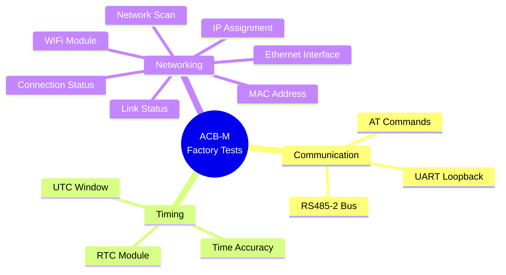

### Test Statistics

| Category | Test Count | Duration | Criticality |
|----------|------------|----------|-------------|
| **Communication Tests** | 2 | ~60 sec | Critical |
| **Timing Tests** | 1 | ~30 sec | High |
| **Networking Tests** | 2 | ~60 sec | Critical |
| **TOTAL** | 5 | ~150 sec | - |

**Test Characteristics:**
- All tests run with **30-second timeout**
- Tests are **independent** (one failure doesn't block others)
- Each test returns **pass/fail + diagnostic data**
- Results stored in structured format for CSV export

---

## Pre-Testing Requirements

### Test Fixture Setup

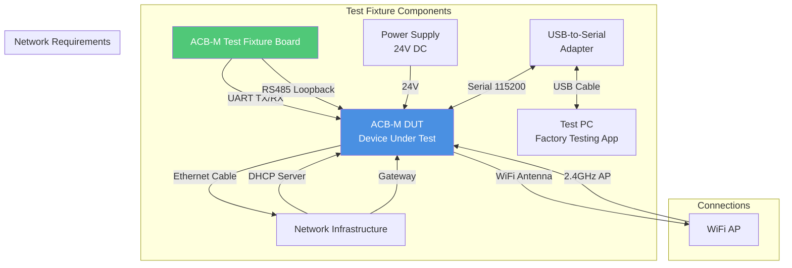

### Hardware Checklist

**Before Testing:**

- [ ] **Power Supply:** 24V DC regulated, capable of 2A minimum
- [ ] **USB-to-Serial Adapter:** FTDI or CH340, drivers installed
- [ ] **Ethernet Network:** Active DHCP server on local network
- [ ] **WiFi Access Point:** 2.4GHz network visible (any SSID)
- [ ] **RS485 Loopback:** Fixture provides loopback on RS485-2 port
- [ ] **Test Fixture:** Calibrated within last 30 days
- [ ] **PC Application:** NubeIO EOL Toolkit v1.5.0 or later

### Software Checklist

- [ ] Factory Testing application installed and updated
- [ ] COM port drivers installed (FTDI/CH340)
- [ ] Network connectivity verified (ping test)
- [ ] Python 3.x installed (for label printing)
- [ ] Printer configured and online

### Safety Requirements

⚠️ **Warning:** ACB-M operates at 24V DC. Ensure:
- Proper grounding of test fixture
- No exposed high-voltage traces
- Emergency stop button accessible
- Adequate ventilation for extended testing

---

## Test Execution Flow

### High-Level Test Sequence

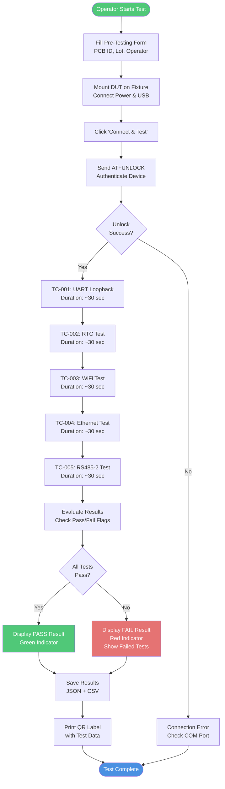

### Test Sequence State Machine

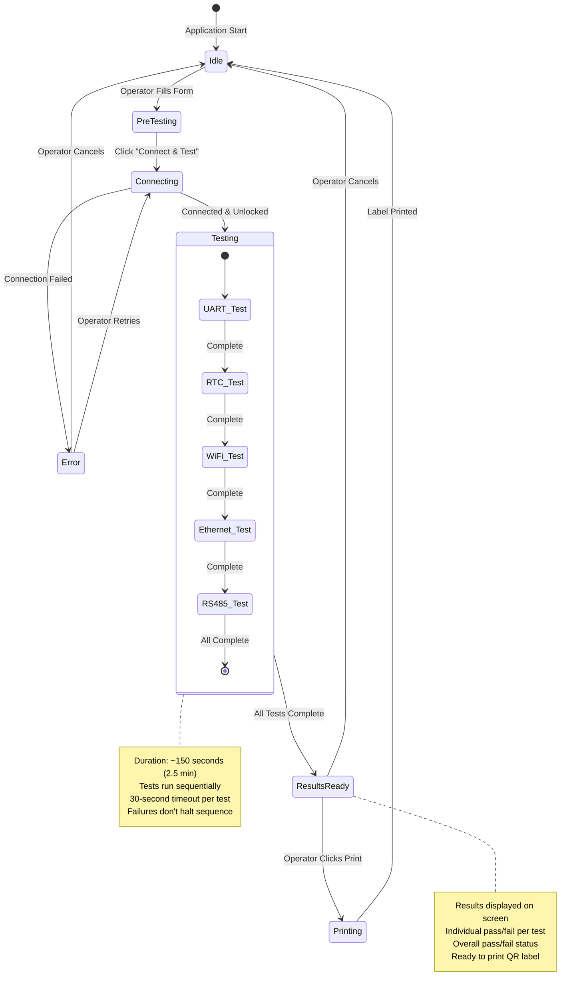

---

## Individual Test Cases

## TC-001: UART Loopback Test

### Test Information

| Field | Value |
|-------|-------|
| **Test ID** | TC-001 |
| **Category** | Communication |
| **Priority** | Critical |
| **Duration** | ~30 seconds |
| **Dependencies** | None |

### Objective

Verify UART communication integrity by testing internal loopback functionality. This ensures the serial interface can transmit and receive data correctly.

### Test Procedure

```mermaid
flowchart TD
    START([TC-001 Start]) --> SEND[Send AT Command<br/>AT+TEST=uart]
    SEND --> WAIT[Wait for Response<br/>Timeout: 30 sec]
    WAIT --> PARSE{Response<br/>Received?}
    
    PARSE -->|No| TIMEOUT[Timeout Error<br/>Result: FAIL]
    TIMEOUT --> END
    
    PARSE -->|Yes| EXTRACT[Extract Value<br/>Remove '+VALUE_UART:' prefix]
    EXTRACT --> CONVERT[Convert to Uppercase<br/>Normalize format]
    CONVERT --> CHECK{Value = 'EE'?}
    
    CHECK -->|Yes| PASS[Test PASSED<br/>UART loopback verified<br/>Store value: EE]
    CHECK -->|No| FAIL[Test FAILED<br/>Expected: EE<br/>Received: {value}]
    
    PASS --> END([TC-001 Complete])
    FAIL --> END
    
    style PASS fill:#50C878,color:#fff
    style FAIL fill:#E57373,color:#fff
    style TIMEOUT fill:#E57373,color:#fff
```

### AT Command Details

**Command:**
```
AT+TEST=uart
```

**Expected Response:**
```
+VALUE_UART: EE
OK
```

**Response Format:**
- Prefix: `+VALUE_UART:`
- Expected Value: `EE` (hexadecimal magic value)
- Terminator: `OK` (on separate line)

**What This Tests:**
- UART TX line functional
- UART RX line functional
- Internal loopback circuit working
- Data integrity (no bit errors)
- Timing accuracy (baud rate correct)

### Pass/Fail Criteria

| Parameter | Requirement |
|-----------|-------------|
| **Response Received** | Within 30 seconds |
| **Loopback Value** | Exactly "EE" (case-insensitive) |

**Pass Conditions:**
✅ Response received within timeout  
✅ Value extracted successfully  
✅ Value equals "EE" (uppercase or lowercase)  

**Fail Conditions:**
❌ Timeout (no response within 30 seconds)  
❌ Invalid response format  
❌ Value is not "EE" (e.g., "00", "FF", corrupted)  
❌ ERROR response from device  

### Example Test Results

**PASS Example:**
```json
{
  "pass": true,
  "value": "EE",
  "raw": "+VALUE_UART: EE",
  "message": "Loopback value EE received"
}
```

**FAIL Example (Wrong Value):**
```json
{
  "pass": false,
  "value": "00",
  "raw": "+VALUE_UART: 00",
  "message": "Expected EE, received 00"
}
```

**FAIL Example (Timeout):**
```json
{
  "pass": false,
  "value": null,
  "raw": null,
  "message": "Timeout waiting for +VALUE_UART:"
}
```

### Troubleshooting

| Symptom | Possible Cause | Solution |
|---------|----------------|----------|
| **Timeout** | UART not connected | Check USB cable, COM port selection |
| **Value = "00"** | TX line fault | Check UART TX circuit on DUT |
| **Value = "FF"** | RX line fault | Check UART RX circuit on DUT |
| **Corrupted value** | Baud rate mismatch | Verify 115200 baud, check crystal oscillator |
| **Random characters** | Electrical noise | Check grounding, shielding |

---

## TC-002: RTC (Real-Time Clock) Test

### Test Information

| Field | Value |
|-------|-------|
| **Test ID** | TC-002 |
| **Category** | Timing |
| **Priority** | High |
| **Duration** | ~30 seconds |
| **Dependencies** | TC-001 (UART functional) |

### Objective

Verify the Real-Time Clock (RTC) module is functional and has been programmed with a valid timestamp during factory initialization. The test checks if the RTC time falls within an expected window.

### Test Procedure

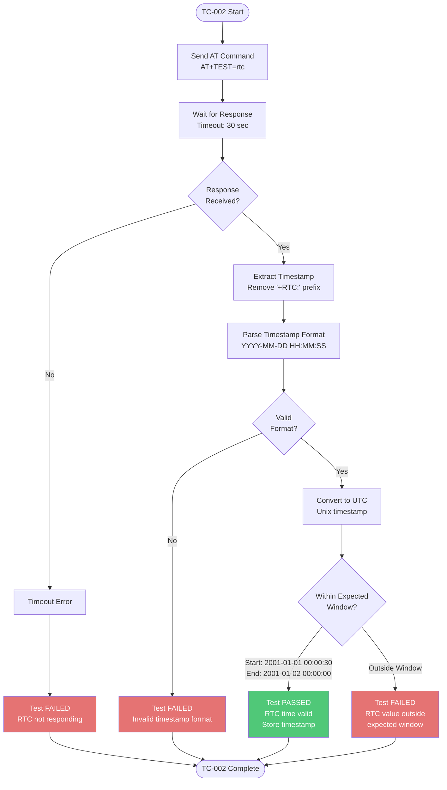

### AT Command Details

**Command:**
```
AT+TEST=rtc
```

**Expected Response:**
```
+RTC: 2001-01-01 12:30:45
OK
```

**Response Format:**
- Prefix: `+RTC:`
- Format: `YYYY-MM-DD HH:MM:SS`
- Example: `2001-01-01 12:30:45`

**RTC Test Window:**

The RTC is pre-programmed to a reference date during manufacturing. The valid window is:

| Boundary | Timestamp | UTC (ms) |
|----------|-----------|----------|
| **Start** | 2001-01-01 00:00:30 | 978307230000 |
| **End** | 2001-01-02 00:00:00 | 978393600000 |

**Note:** The specific reference date (2001-01-01) is used as a factory test marker. Production units will have RTC set to current time during final provisioning.

### Pass/Fail Criteria

**Pass Conditions:**
✅ Response received within timeout  
✅ Timestamp parsed successfully  
✅ Timestamp >= 2001-01-01 00:00:30 UTC  
✅ Timestamp <= 2001-01-02 00:00:00 UTC  

**Fail Conditions:**
❌ Timeout (RTC not responding)  
❌ Invalid timestamp format  
❌ Timestamp before start boundary (RTC not initialized)  
❌ Timestamp after end boundary (RTC overflow or incorrect)  
❌ All zeros (RTC not running)  

### RTC Validation Logic

```mermaid
flowchart LR
    INPUT[RTC Timestamp<br/>2001-01-01 12:30:45] --> PARSE[Parse with Regex<br/>Extract Y/M/D/H/M/S]
    PARSE --> UTC[Convert to UTC<br/>Date.UTC()]
    UTC --> COMPARE{Compare<br/>Boundaries}
    
    COMPARE -->|< 978307230000| TOO_OLD[Before Window<br/>FAIL]
    COMPARE -->|978307230000 to<br/>978393600000| IN_RANGE[Within Window<br/>PASS]
    COMPARE -->|> 978393600000| TOO_NEW[After Window<br/>FAIL]
    
    style IN_RANGE fill:#50C878,color:#fff
    style TOO_OLD fill:#E57373,color:#fff
    style TOO_NEW fill:#E57373,color:#fff
```

### Example Test Results

**PASS Example:**
```json
{
  "pass": true,
  "time": "2001-01-01 12:30:45",
  "raw": "+RTC: 2001-01-01 12:30:45",
  "message": "RTC within expected window"
}
```

**FAIL Example (Outside Window):**
```json
{
  "pass": false,
  "time": "2001-01-05 10:00:00",
  "raw": "+RTC: 2001-01-05 10:00:00",
  "message": "RTC value outside expected window"
}
```

**FAIL Example (Not Initialized):**
```json
{
  "pass": false,
  "time": "2000-01-01 00:00:00",
  "raw": "+RTC: 2000-01-01 00:00:00",
  "message": "RTC value outside expected window"
}
```

### Troubleshooting

| Symptom | Possible Cause | Solution |
|---------|----------------|----------|
| **Timeout** | RTC chip not communicating | Check I2C bus, RTC power supply |
| **Time = 2000-01-01** | RTC not initialized | Program RTC with initialization command |
| **Time = current date** | Wrong firmware | Flash correct factory test firmware |
| **Time = 0000-00-00** | RTC crystal not oscillating | Check 32.768kHz crystal, replace if faulty |
| **Random time** | I2C communication error | Check pull-ups, check SCL/SDA lines |

---

## TC-003: WiFi Connectivity Test

### Test Information

| Field | Value |
|-------|-------|
| **Test ID** | TC-003 |
| **Category** | Networking |
| **Priority** | Critical |
| **Duration** | ~30 seconds |
| **Dependencies** | TC-001 (UART functional) |

### Objective

Verify the WiFi module can scan for available 2.4GHz networks and establish a connection. This test ensures the WiFi radio, antenna, and driver stack are functional.

### Test Procedure

```mermaid
flowchart TD
    START([TC-003 Start]) --> PREREQ[Prerequisites:<br/>WiFi AP must be available<br/>within range]
    
    PREREQ --> SEND[Send AT Command<br/>AT+TEST=wifi]
    SEND --> SCAN[WiFi Module Initiates Scan<br/>Scans 2.4GHz Channels 1-13<br/>Duration: 5-15 seconds]
    
    SCAN --> CONNECT[Attempt Connection<br/>to Known Test Network<br/>Duration: 5-10 seconds]
    
    CONNECT --> WAIT[Wait for Response<br/>Timeout: 30 sec]
    WAIT --> PARSE{Response<br/>Received?}
    
    PARSE -->|No| TIMEOUT[Timeout Error<br/>WiFi not responding]
    TIMEOUT --> FAIL_TIMEOUT[Test FAILED<br/>WiFi module timeout]
    
    PARSE -->|Yes| EXTRACT[Extract Data<br/>Format: +WIFI: count,status]
    EXTRACT --> SPLIT[Parse CSV Format<br/>networkCount, connected]
    
    SPLIT --> VALIDATE{Valid<br/>Data?}
    VALIDATE -->|No| FAIL_FORMAT[Test FAILED<br/>Invalid response format]
    
    VALIDATE -->|Yes| CHECK_NETS{Networks<br/>Found > 1?}
    CHECK_NETS -->|No| FAIL_SCAN[Test FAILED<br/>No networks detected<br/>WiFi radio issue]
    
    CHECK_NETS -->|Yes| CHECK_CONN{Connected<br/>= 1?}
    CHECK_CONN -->|No| FAIL_CONNECT[Test FAILED<br/>Scan OK but<br/>connection failed]
    
    CHECK_CONN -->|Yes| PASS[Test PASSED<br/>WiFi fully functional<br/>Store: networks={count},<br/>connected=1]
    
    PASS --> END([TC-003 Complete])
    FAIL_TIMEOUT --> END
    FAIL_FORMAT --> END
    FAIL_SCAN --> END
    FAIL_CONNECT --> END
    
    style PASS fill:#50C878,color:#fff
    style FAIL_TIMEOUT fill:#E57373,color:#fff
    style FAIL_FORMAT fill:#E57373,color:#fff
    style FAIL_SCAN fill:#E57373,color:#fff
    style FAIL_CONNECT fill:#E57373,color:#fff
```

### AT Command Details

**Command:**
```
AT+TEST=wifi
```

**Expected Response:**
```
+WIFI: 8,1
OK
```

**Response Format:**
- Prefix: `+WIFI:`
- Format: `{networkCount},{connected}`
- `networkCount`: Number of WiFi networks detected (integer)
- `connected`: Connection status (1 = connected, 0 = not connected)

**Example Responses:**

| Response | Networks | Connected | Interpretation |
|----------|----------|-----------|----------------|
| `+WIFI: 8,1` | 8 | Yes | PASS - 8 networks found, connected |
| `+WIFI: 5,1` | 5 | Yes | PASS - 5 networks found, connected |
| `+WIFI: 3,1` | 3 | Yes | PASS - 3 networks found, connected |
| `+WIFI: 10,0` | 10 | No | FAIL - Scan OK but connection failed |
| `+WIFI: 1,1` | 1 | Yes | FAIL - Only 1 network (need > 1) |
| `+WIFI: 0,0` | 0 | No | FAIL - No networks detected |

### Pass/Fail Criteria

**Pass Conditions:**
✅ Response received within 30 seconds  
✅ Network count > 1 (at least 2 networks detected)  
✅ Connected status = 1 (successfully connected)  

**Fail Conditions:**
❌ Timeout (WiFi module not responding)  
❌ Network count ≤ 1 (insufficient networks detected)  
❌ Connected status = 0 (scan OK but connection failed)  
❌ Invalid response format  

**Why Network Count > 1?**

Requiring more than 1 network ensures:
- WiFi radio is working (not just reporting cached data)
- Antenna is properly connected (weak antenna can't detect multiple APs)
- Test environment is realistic (typical RF environment)

### WiFi Test Flow

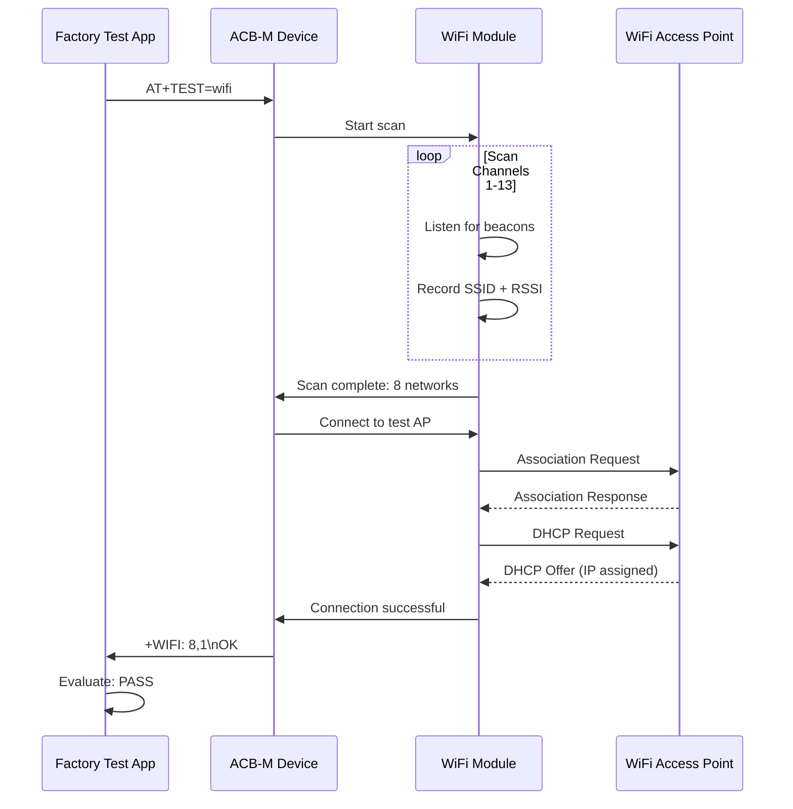

### Example Test Results

**PASS Example:**
```json
{
  "pass": true,
  "networks": 8,
  "connected": 1,
  "raw": "+WIFI: 8,1",
  "message": "Networks: 8, connected"
}
```

**FAIL Example (No Connection):**
```json
{
  "pass": false,
  "networks": 5,
  "connected": 0,
  "raw": "+WIFI: 5,0",
  "message": "Networks=5, connected=0"
}
```

**FAIL Example (No Networks):**
```json
{
  "pass": false,
  "networks": 0,
  "connected": 0,
  "raw": "+WIFI: 0,0",
  "message": "Networks=0, connected=0"
}
```

### Troubleshooting

| Symptom | Possible Cause | Solution |
|---------|----------------|----------|
| **Timeout** | WiFi module not powered | Check 3.3V supply to WiFi chip |
| **Networks = 0** | Antenna not connected | Check antenna connection, replace if damaged |
| **Networks = 1** | Weak antenna or shielded environment | Move to area with more APs, check antenna |
| **Connected = 0** | Wrong WiFi credentials | Update test firmware with correct SSID/password |
| **Intermittent** | RF interference | Move away from metal enclosures |

---

## TC-004: Ethernet Test

### Test Information

| Field | Value |
|-------|-------|
| **Test ID** | TC-004 |
| **Category** | Networking |
| **Priority** | Critical |
| **Duration** | ~30 seconds |
| **Dependencies** | TC-001 (UART functional) |

### Objective

Verify the Ethernet interface is functional by checking:
1. Valid MAC address assigned
2. IP address obtained via DHCP
3. Physical link established

### Test Procedure

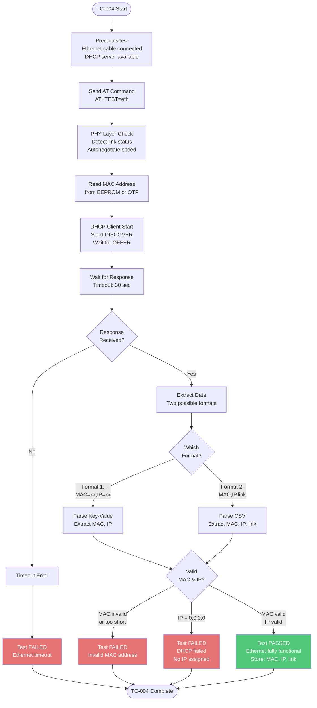

### AT Command Details

**Command:**
```
AT+TEST=eth
```

**Expected Response Format 1 (Key-Value):**
```
+ETH: MAC=84:1F:E8:10:9E:3B,IP=192.168.0.100
OK
```

**Expected Response Format 2 (CSV with Link Status):**
```
+ETH: 841FE8109E38,192.168.0.100,4/4
OK
```

**Response Formats:**

| Format | MAC Example | IP Example | Link Status |
|--------|-------------|------------|-------------|
| **Format 1** | `MAC=84:1F:E8:10:9E:3B` | `IP=192.168.0.100` | Not included |
| **Format 2** | `841FE8109E38` (no colons) | `192.168.0.100` | `4/4` (optional) |

**Link Status Interpretation (Format 2):**
- `4/4`: Full duplex, 100 Mbps
- `2/4`: Half duplex, 100 Mbps
- `4/2`: Full duplex, 10 Mbps
- `2/2`: Half duplex, 10 Mbps

### Pass/Fail Criteria

**Pass Conditions:**
✅ Response received within 30 seconds  
✅ MAC address length ≥ 12 characters  
✅ MAC address is not all zeros  
✅ IP address is not `0.0.0.0`  
✅ IP address format valid  

**Fail Conditions:**
❌ Timeout (Ethernet not responding)  
❌ MAC address invalid or missing  
❌ MAC address too short (< 12 characters)  
❌ IP address is `0.0.0.0` (DHCP failed)  
❌ IP address missing or invalid format  

### MAC Address Validation

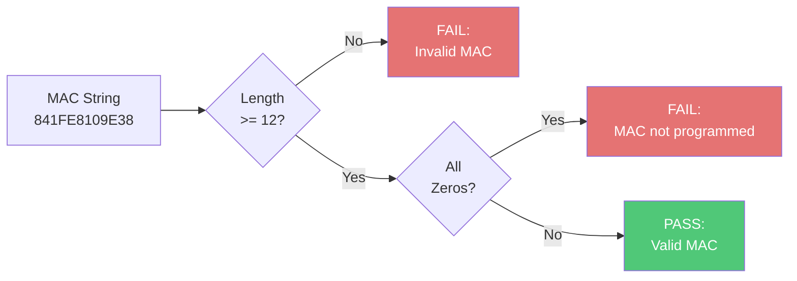

### Ethernet Test Sequence

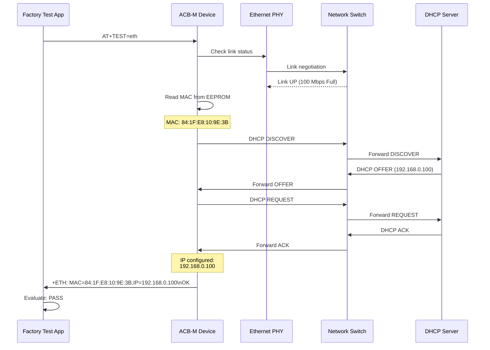

### Example Test Results

**PASS Example (Format 1):**
```json
{
  "pass": true,
  "mac": "84:1F:E8:10:9E:3B",
  "ip": "192.168.0.100",
  "linkStatus": "",
  "raw": "+ETH: MAC=84:1F:E8:10:9E:3B,IP=192.168.0.100",
  "message": "84:1F:E8:10:9E:3B · 192.168.0.100"
}
```

**PASS Example (Format 2):**
```json
{
  "pass": true,
  "mac": "841FE8109E38",
  "ip": "192.168.0.100",
  "linkStatus": "4/4",
  "raw": "+ETH: 841FE8109E38,192.168.0.100,4/4",
  "message": "841FE8109E38 · 192.168.0.100 · 4/4"
}
```

**FAIL Example (No IP):**
```json
{
  "pass": false,
  "mac": "84:1F:E8:10:9E:3B",
  "ip": "0.0.0.0",
  "linkStatus": "",
  "raw": "+ETH: MAC=84:1F:E8:10:9E:3B,IP=0.0.0.0",
  "message": "Invalid MAC or IP"
}
```

**FAIL Example (Invalid MAC):**
```json
{
  "pass": false,
  "mac": "00000",
  "ip": "192.168.0.100",
  "linkStatus": "",
  "raw": "+ETH: 00000,192.168.0.100",
  "message": "Invalid MAC or IP"
}
```

### Troubleshooting

| Symptom | Possible Cause | Solution |
|---------|----------------|----------|
| **Timeout** | Ethernet cable not connected | Check cable, check link LED |
| **MAC all zeros** | EEPROM not programmed | Program MAC address via JTAG |
| **MAC too short** | Parsing error | Check firmware response format |
| **IP = 0.0.0.0** | DHCP server not responding | Check network, check DHCP server |
| **No link** | Cable bad or switch down | Replace cable, check switch |
| **Intermittent** | Loose RJ45 connector | Reseat cable, check connector |

---

## TC-005: RS485-2 Communication Test

### Test Information

| Field | Value |
|-------|-------|
| **Test ID** | TC-005 |
| **Category** | Communication |
| **Priority** | High |
| **Duration** | ~30 seconds |
| **Dependencies** | TC-001 (UART functional) |

### Objective

Verify the RS485-2 serial interface can transmit and receive data correctly using a loopback test provided by the test fixture.

### Test Procedure

```mermaid
flowchart TD
    START([TC-005 Start]) --> PREREQ[Prerequisites:<br/>RS485 loopback installed<br/>on test fixture]
    
    PREREQ --> SEND[Send AT Command<br/>AT+TEST=rs4852]
    SEND --> TX[Transmit Test Pattern<br/>on RS485-2 TX lines<br/>A+/B-]
    
    TX --> LOOPBACK[Test Fixture Loopback<br/>Connects TX to RX<br/>Differential signal]
    
    LOOPBACK --> RX[Receive Data<br/>on RS485-2 RX lines<br/>Compare with TX]
    
    RX --> WAIT[Wait for Response<br/>Timeout: 30 sec]
    WAIT --> PARSE{Response<br/>Received?}
    
    PARSE -->|No| TIMEOUT[Timeout Error]
    TIMEOUT --> FAIL_TIMEOUT[Test FAILED<br/>RS485 timeout]
    
    PARSE -->|Yes| EXTRACT[Extract Data<br/>Format: +RS485: count,status]
    EXTRACT --> SPLIT[Parse CSV<br/>count, status]
    
    SPLIT --> VALIDATE{Valid<br/>Data?}
    VALIDATE -->|No| FAIL_FORMAT[Test FAILED<br/>Invalid response]
    
    VALIDATE -->|Yes| CHECK_STATUS{Status<br/>= 0?}
    
    CHECK_STATUS -->|Yes| PASS[Test PASSED<br/>RS485 loopback OK<br/>Store: count, status=0]
    CHECK_STATUS -->|No| FAIL_STATUS[Test FAILED<br/>RS485 error<br/>status={status}]
    
    PASS --> END([TC-005 Complete])
    FAIL_TIMEOUT --> END
    FAIL_FORMAT --> END
    FAIL_STATUS --> END
    
    style PASS fill:#50C878,color:#fff
    style FAIL_TIMEOUT fill:#E57373,color:#fff
    style FAIL_FORMAT fill:#E57373,color:#fff
    style FAIL_STATUS fill:#E57373,color:#fff
```

### AT Command Details

**Command:**
```
AT+TEST=rs4852
```

**Expected Response:**
```
+RS485: 30,0
OK
```

**Response Format:**
- Prefix: `+RS485:`
- Format: `{count},{status}`
- `count`: Number of bytes transmitted/received (integer)
- `status`: Error code (0 = success, non-zero = error)

**Status Codes:**

| Status | Meaning | Action |
|--------|---------|--------|
| **0** | Success - all bytes looped back correctly | PASS |
| **1** | Timeout - no response from loopback | Check fixture loopback |
| **2** | Checksum error - data corrupted | Check signal integrity |
| **3** | Partial data - some bytes lost | Check termination resistors |
| **4** | TX driver fault - cannot drive bus | Check RS485 transceiver |
| **5** | RX fault - cannot receive data | Check RS485 transceiver |

### Pass/Fail Criteria

**Pass Conditions:**
✅ Response received within 30 seconds  
✅ Status code = 0 (success)  
✅ Count > 0 (data transmitted and received)  

**Fail Conditions:**
❌ Timeout (RS485 not responding)  
❌ Status code ≠ 0 (error detected)  
❌ Count = 0 (no data transferred)  
❌ Invalid response format  

### RS485 Loopback Diagram

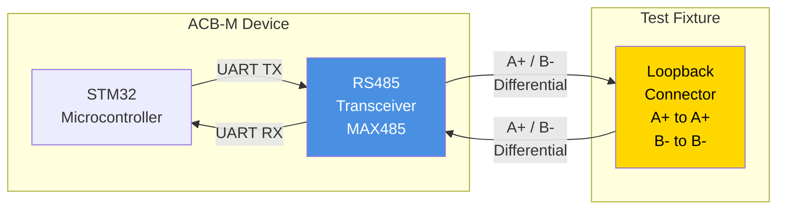

### RS485 Test Sequence

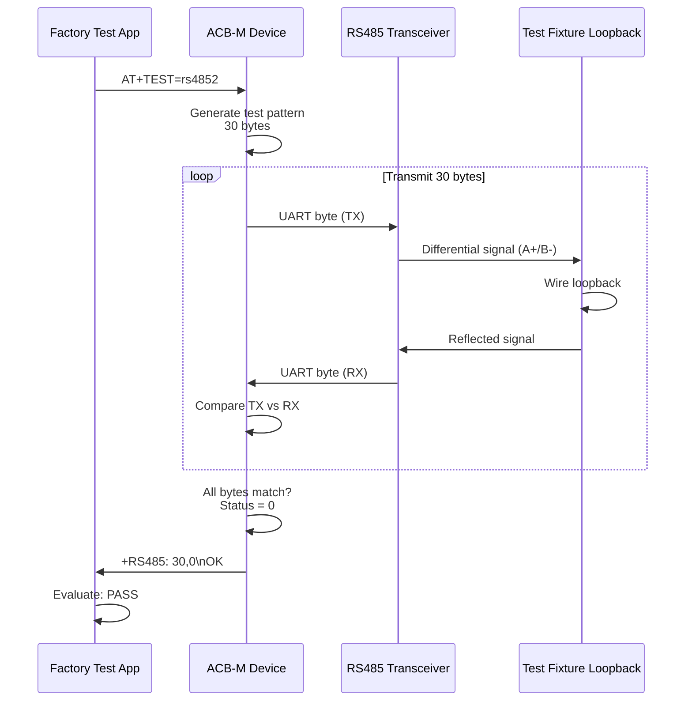

### Example Test Results

**PASS Example:**
```json
{
  "pass": true,
  "count": 30,
  "status": 0,
  "raw": "+RS485: 30,0",
  "message": "RS485-2 test passed (count=30)"
}
```

**FAIL Example (Checksum Error):**
```json
{
  "pass": false,
  "count": 30,
  "status": 2,
  "raw": "+RS485: 30,2",
  "message": "RS485-2 test failed (status=2)"
}
```

**FAIL Example (Timeout):**
```json
{
  "pass": false,
  "count": 0,
  "status": null,
  "raw": null,
  "message": "Timeout waiting for +RS485:"
}
```

### Troubleshooting

| Symptom | Possible Cause | Solution |
|---------|----------------|----------|
| **Timeout** | RS485 transceiver not powered | Check 5V supply to MAX485 |
| **Status = 1** | Loopback not connected | Check fixture loopback, verify wiring |
| **Status = 2** | Signal integrity issue | Check impedance, add termination resistor |
| **Status = 3** | Partial data loss | Check baud rate, check timing |
| **Status = 4** | TX driver fault | Replace RS485 transceiver chip |
| **Status = 5** | RX fault | Check RX enable pin, check transceiver |
| **Intermittent** | Poor contacts | Clean pogo pins, reseat on fixture |

### RS485 Hardware Requirements

**Test Fixture Loopback:**
- Connect A+ (TX) to A+ (RX)
- Connect B- (TX) to B- (RX)
- 120Ω termination resistor (optional, improves signal quality)

**Pinout (ACB-M RS485-2 Port):**
| Pin | Signal | Direction |
|-----|--------|-----------|
| 1 | A+ | TX/RX |
| 2 | B- | TX/RX |
| 3 | GND | Ground |

---

## Pass/Fail Criteria

### Overall Pass/Fail Evaluation

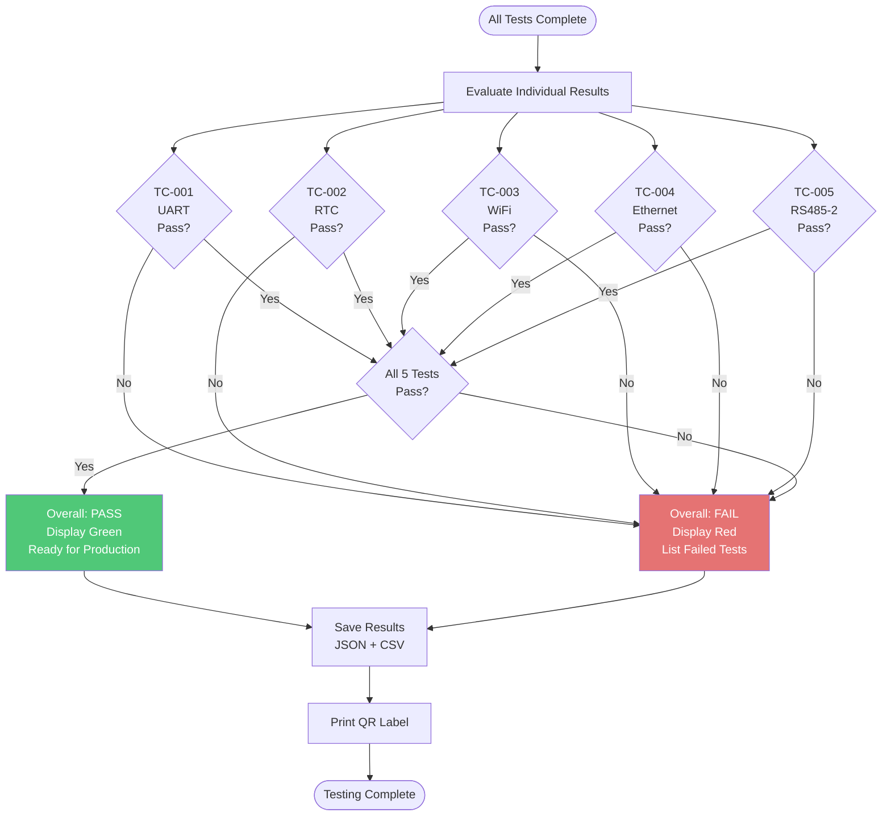

### Pass Criteria Summary

| Test | Pass Criteria | Weight |
|------|---------------|--------|
| **TC-001 UART** | Value = "EE" | Critical |
| **TC-002 RTC** | Time in window (2001-01-01 range) | High |
| **TC-003 WiFi** | Networks > 1 AND Connected = 1 | Critical |
| **TC-004 Ethernet** | Valid MAC AND Valid IP (not 0.0.0.0) | Critical |
| **TC-005 RS485-2** | Status = 0 | High |

**Overall Device Status:**

- **PASS:** All 5 tests return `pass: true`
- **FAIL:** Any test returns `pass: false`

**No Partial Pass:** ACB-M must pass all tests to be approved for production.

---

## Test Results Interpretation

### Results Display

After testing, the application displays a results table:

| Test | Status | Value | Details |
|------|--------|-------|---------|
| **UART** | ✅ PASS | EE | Loopback verified |
| **RTC** | ✅ PASS | 2001-01-01 12:30:45 | Within window |
| **WiFi** | ✅ PASS | 8 networks, connected | Fully functional |
| **Ethernet** | ✅ PASS | 84:1F:E8:10:9E:3B<br/>192.168.0.100 | MAC + IP valid |
| **RS485-2** | ✅ PASS | 30 bytes, status=0 | Loopback successful |

**Overall:** ✅ **PASS** - All tests successful

### Failure Analysis Table

If any test fails, the failure reason is displayed:

| Test | Status | Failure Reason | Action |
|------|--------|----------------|--------|
| **UART** | ❌ FAIL | Expected EE, received 00 | Check UART TX circuit |
| **RTC** | ❌ FAIL | RTC value outside window | Initialize RTC |
| **WiFi** | ❌ FAIL | Networks=0, not connected | Check antenna |
| **Ethernet** | ❌ FAIL | IP = 0.0.0.0, DHCP failed | Check network cable |
| **RS485-2** | ❌ FAIL | Status=2 (checksum error) | Check signal integrity |

---

## Quick Troubleshooting

### Common Issues Quick Reference

| Symptom | Test | Quick Fix | Section |
|---------|------|-----------|---------|
| **"Port not found"** | All | Check USB cable, drivers | [Connection Issues] |
| **"Timeout"** | All | Check power, press reset | [Connection Issues] |
| **UART = "00"** | TC-001 | TX line fault | [UART Troubleshooting] |
| **RTC before 2001** | TC-002 | RTC not initialized | [RTC Troubleshooting] |
| **WiFi networks = 0** | TC-003 | No antenna or no AP | [WiFi Troubleshooting] |
| **Ethernet IP = 0.0.0.0** | TC-004 | DHCP failed | [Ethernet Troubleshooting] |
| **RS485 status ≠ 0** | TC-005 | Loopback issue | [RS485 Troubleshooting] |

### Decision Tree for All Failures

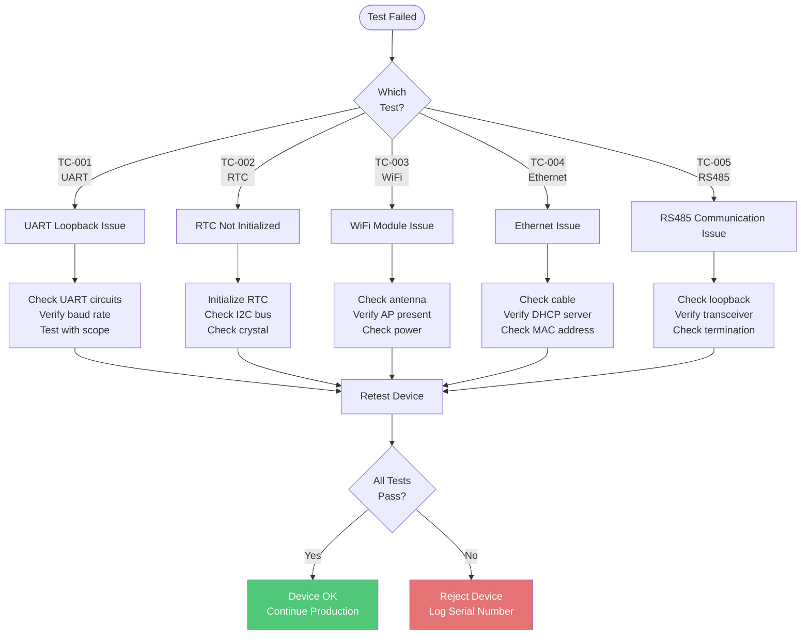

---

## Appendix

### Test Timeouts

All ACB-M tests use a **30-second timeout** to accommodate:
- Network operations (WiFi scan, DHCP)
- RTC initialization time
- RS485 data transfer

This is longer than Micro Edge tests (5-15 seconds) due to STM32 firmware architecture.

### Firmware Requirements

ACB-M factory test firmware must support:
- AT command protocol (115200 baud)
- `AT+TEST=uart` - UART loopback
- `AT+TEST=rtc` - RTC read
- `AT+TEST=wifi` - WiFi scan + connect
- `AT+TEST=eth` - Ethernet MAC/IP read
- `AT+TEST=rs4852` - RS485-2 loopback

### Test Data Format

Results are saved as:
- **JSON:** Individual device file with all test details
- **CSV:** Appended to master log with one row per device

**CSV Columns:**
```
Date, Time, PCB_ID, Lot, Operator, UART_Value, UART_Pass, RTC_Time, RTC_Pass, 
WiFi_Networks, WiFi_Connected, WiFi_Pass, Eth_MAC, Eth_IP, Eth_Pass, 
RS485_Count, RS485_Status, RS485_Pass, Overall_Pass
```

---

**Document Version:** 1.0  
**Last Updated:** December 9, 2025  
**Next Review:** March 2026
