# ACB-M - Troubleshooting Guide

**Device Type:** GEN-2 (STM32-based)  
**Target Audience:** Test Operators, Support Engineers, Beginners  
**Last Updated:** December 9, 2025

---

## Table of Contents

- [Quick Diagnosis](#quick-diagnosis)
- [Connection Issues](#connection-issues)
- [Test Failures](#test-failures)
- [Hardware Problems](#hardware-problems)
- [Software Issues](#software-issues)
- [Test Fixture Issues](#test-fixture-issues)
- [Network Infrastructure Issues](#network-infrastructure-issues)
- [Advanced Diagnostics](#advanced-diagnostics)
- [FAQ](#faq)
- [Getting Help](#getting-help)

---

## Quick Diagnosis

### Problem Decision Tree

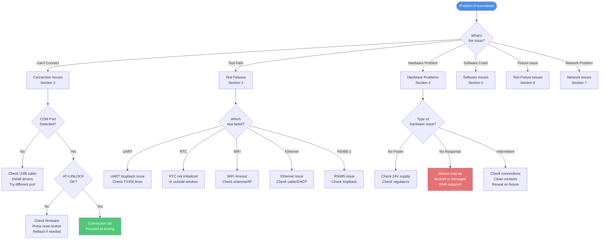
```mermaid
flowchart TD
    START([Problem Encountered]) --> TYPE{What's<br/>the issue?}
    
    TYPE -->|Can't Connect| CONN[Connection Issues<br/>Section 2]
    TYPE -->|Test Fails| TEST[Test Failures<br/>Section 3]
    TYPE -->|Hardware Problem| HW[Hardware Problems<br/>Section 4]
    TYPE -->|Software Crash| SW[Software Issues<br/>Section 5]
    TYPE -->|Fixture Issue| FIX[Test Fixture Issues<br/>Section 6]
    TYPE -->|Network Problem| NET[Network Issues<br/>Section 7]
    
    CONN --> CONN_CHECK{COM Port<br/>Detected?}
    CONN_CHECK -->|No| CONN_USB[Check USB cable<br/>Install drivers<br/>Try different port]
    CONN_CHECK -->|Yes| CONN_UNLOCK{AT+UNLOCK<br/>OK?}
    CONN_UNLOCK -->|No| CONN_FW[Check firmware<br/>Press reset button<br/>Reflash if needed]
    CONN_UNLOCK -->|Yes| CONN_SOLVED[Connection OK<br/>Proceed to testing]
    
    TEST --> TEST_TYPE{Which<br/>test failed?}
    TEST_TYPE -->|UART| TEST_UART[UART loopback issue<br/>Check TX/RX lines]
    TEST_TYPE -->|RTC| TEST_RTC[RTC not initialized<br/>or outside window]
    TEST_TYPE -->|WiFi| TEST_WIFI[WiFi timeout<br/>Check antenna/AP]
    TEST_TYPE -->|Ethernet| TEST_ETH[Ethernet issue<br/>Check cable/DHCP]
    TEST_TYPE -->|RS485-2| TEST_RS485[RS485 issue<br/>Check loopback]
    
    HW --> HW_TYPE{Type of<br/>hardware issue?}
    HW_TYPE -->|No Power| HW_POWER[Check 24V supply<br/>Check regulators]
    HW_TYPE -->|No Response| HW_DEAD[Device may be<br/>bricked or damaged<br/>RMA required]
    HW_TYPE -->|Intermittent| HW_INT[Check connections<br/>Clean contacts<br/>Reseat on fixture]
    
    style START fill:#4A90E2,color:#fff
    style CONN_SOLVED fill:#50C878,color:#fff
    style HW_DEAD fill:#E57373,color:#fff
```

### Symptoms and Quick Fixes

| Symptom | Quick Fix | See Section |
|---------|-----------|-------------|
| **"Port not found"** | Check USB cable, select correct COM port | [2.1](#21-device-not-detected) |
| **"Timeout on connect"** | Press Reset button, check 24V power | [2.2](#22-connection-timeout) |
| **"All tests fail"** | Check device powered, verify firmware | [3.1](#31-all-tests-failing) |
| **UART = "00" or "FF"** | UART circuit fault, check TX/RX lines | [3.2](#32-uart-loopback-test-fails) |
| **RTC outside window** | RTC not initialized, program RTC | [3.3](#33-rtc-test-fails) |
| **WiFi networks = 0** | Check antenna, ensure WiFi AP present | [3.4](#34-wifi-test-fails) |
| **Ethernet IP = 0.0.0.0** | DHCP failed, check network cable | [3.5](#35-ethernet-test-fails) |
| **RS485 status ≠ 0** | Loopback not connected or circuit fault | [3.6](#36-rs485-2-test-fails) |
| **Application crashes** | Restart app, check for updates | [5](#software-issues) |

---

## Connection Issues

### 2.1 Device Not Detected

**Symptom:** COM port not appearing in dropdown, or "Port not found" error

**Troubleshooting State Diagram:**

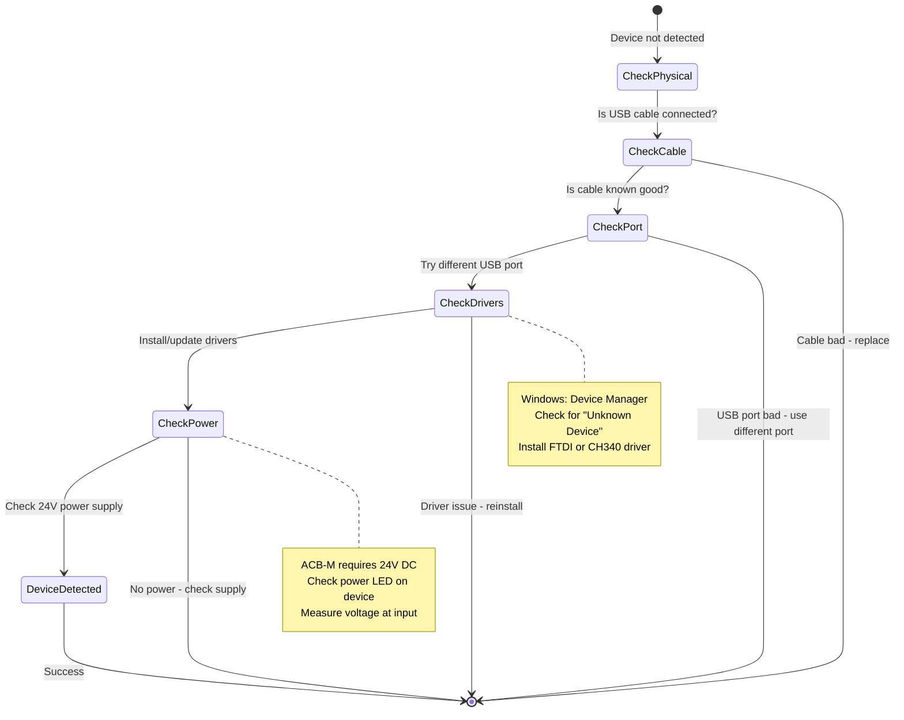
```mermaid
stateDiagram-v2
    [*] --> CheckPhysical: Device not detected
    CheckPhysical --> CheckCable: Is USB cable connected?
    CheckCable --> CheckPort: Is cable known good?
    CheckPort --> CheckDrivers: Try different USB port
    CheckDrivers --> CheckPower: Install/update drivers
    CheckPower --> DeviceDetected: Check 24V power supply
    
    CheckCable --> [*]: Cable bad - replace
    CheckPort --> [*]: USB port bad - use different port
    CheckDrivers --> [*]: Driver issue - reinstall
    CheckPower --> [*]: No power - check supply
    DeviceDetected --> [*]: Success
    
    note right of CheckDrivers
        Windows: Device Manager
        Check for "Unknown Device"
        Install FTDI or CH340 driver
    end note
    
    note right of CheckPower
        ACB-M requires 24V DC
        Check power LED on device
        Measure voltage at input
    end note
```

**Systematic Checks:**

1. **Physical Connection:**
   ```
   USB cable → USB-to-Serial adapter → ACB-M UART port
   ```
   - Check all connections secure
   - Try different USB cable (known good)
   - Try different USB-to-Serial adapter

2. **Windows Device Manager:**
   - Open Device Manager (Win + X → Device Manager)
   - Look under "Ports (COM & LPT)"
   - Should see: "USB Serial Port (COM3)" or similar
   - If "Unknown Device": Install FTDI/CH340 drivers

3. **Driver Installation:**
   - FTDI driver: https://ftdichip.com/drivers/vcp-drivers/
   - CH340 driver: https://www.wch-ic.com/downloads/CH341SER_EXE.html
   - After installation, unplug and replug USB

4. **Power Supply:**
   - ACB-M requires 24V DC input
   - Check power LED on device
   - Measure voltage at DC input jack: 22-26V acceptable

**If Still Not Detected:**
- Try different PC
- Verify device is not damaged (check for burn marks, damaged components)
- Use multimeter to check 3.3V rail (STM32 power)

---

### 2.2 Connection Timeout

**Symptom:** Application times out when trying to connect, "Timeout waiting for OK" error

**Troubleshooting Flow:**

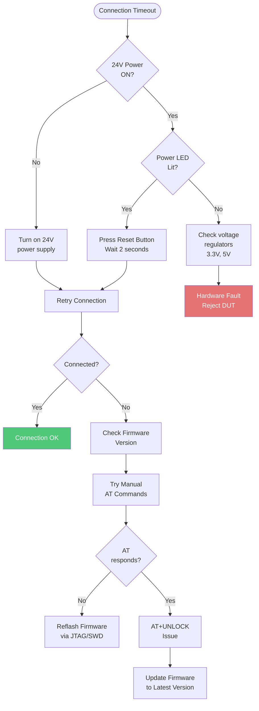
```mermaid
flowchart TD
    TIMEOUT([Connection Timeout]) --> POWER{24V Power<br/>ON?}
    
    POWER -->|No| FIX_POWER[Turn on 24V<br/>power supply]
    POWER -->|Yes| LED{Power LED<br/>Lit?}
    
    LED -->|No| CHECK_REG[Check voltage<br/>regulators<br/>3.3V, 5V]
    LED -->|Yes| RESET[Press Reset Button<br/>Wait 2 seconds]
    
    RESET --> RETRY1[Retry Connection]
    RETRY1 --> OK1{Connected?}
    OK1 -->|Yes| SUCCESS[Connection OK]
    OK1 -->|No| FIRMWARE[Check Firmware<br/>Version]
    
    FIRMWARE --> MANUAL[Try Manual<br/>AT Commands]
    MANUAL --> AT{AT<br/>responds?}
    
    AT -->|No| REFLASH[Reflash Firmware<br/>via JTAG/SWD]
    AT -->|Yes| UNLOCK_ISSUE[AT+UNLOCK<br/>Issue]
    
    UNLOCK_ISSUE --> UPDATE_FW[Update Firmware<br/>to Latest Version]
    
    FIX_POWER --> RETRY1
    CHECK_REG --> FAULT[Hardware Fault<br/>Reject DUT]
    
    style SUCCESS fill:#50C878,color:#fff
    style FAULT fill:#E57373,color:#fff
```

**Manual AT Command Test:**

Open serial terminal (PuTTY, TeraTerm, or similar):
- Port: COM3 (or detected port)
- Baud: 115200
- Data: 8 bits
- Parity: None
- Stop: 1 bit

Type commands:
```
AT
# Expected: OK

AT+UNLOCK=N00BIO
# Expected: OK

AT+INFO?
# Expected: +INFO: ACB-M,v1.2.3,12345678
#           OK
```

**If Manual Commands Work:**
- Issue is with application, not device
- Check application logs (F12 → Console)
- Update application to latest version

**If Manual Commands Don't Work:**
- Firmware issue
- Reflash device firmware via JTAG/SWD

---

### 2.3 Intermittent Connection

**Symptom:** Connection works sometimes, fails randomly

**Root Cause Analysis:**

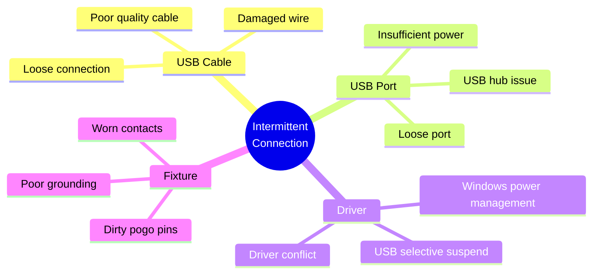
```mermaid
mindmap
  root((Intermittent<br/>Connection))
    USB Cable
      Loose connection
      Damaged wire
      Poor quality cable
    USB Port
      Insufficient power
      Loose port
      USB hub issue
    Driver
      Driver conflict
      Windows power management
      USB selective suspend
    Fixture
      Dirty pogo pins
      Worn contacts
      Poor grounding
```

**Solutions:**

1. **USB Cable:** Use high-quality USB cable (< 2m length)
2. **USB Port:** Connect directly to PC (not through hub)
3. **Windows Power Management:**
   - Device Manager → USB port → Properties
   - Power Management tab
   - Uncheck "Allow computer to turn off this device"
4. **Fixture Maintenance:** Clean pogo pins with isopropyl alcohol

---

## Test Failures

### 3.1 All Tests Failing

**Symptom:** Every test returns FAIL or timeout

**Decision Tree:**

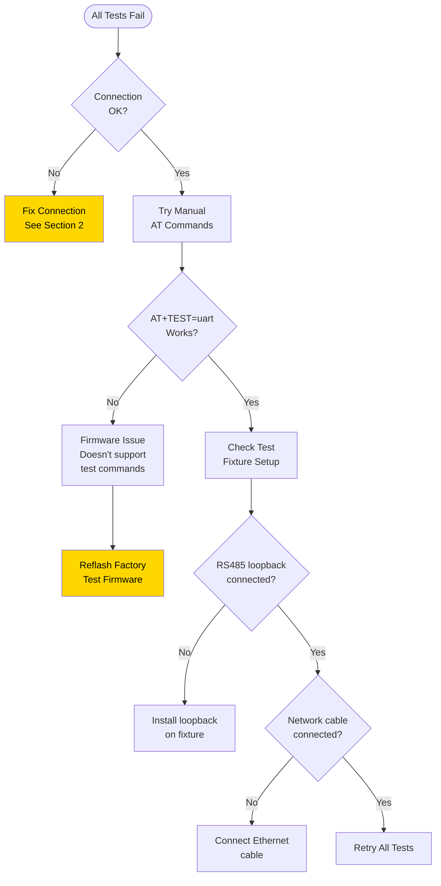
```mermaid
flowchart TD
    ALL_FAIL([All Tests Fail]) --> CONN{Connection<br/>OK?}
    
    CONN -->|No| FIX_CONN[Fix Connection<br/>See Section 2]
    CONN -->|Yes| MANUAL[Try Manual<br/>AT Commands]
    
    MANUAL --> UART{AT+TEST=uart<br/>Works?}
    UART -->|No| FW_ISSUE[Firmware Issue<br/>Doesn't support<br/>test commands]
    UART -->|Yes| FIXTURE[Check Test<br/>Fixture Setup]
    
    FW_ISSUE --> REFLASH[Reflash Factory<br/>Test Firmware]
    
    FIXTURE --> LOOPBACK{RS485 loopback<br/>connected?}
    LOOPBACK -->|No| FIX_FIXTURE[Install loopback<br/>on fixture]
    
    LOOPBACK -->|Yes| NETWORK{Network cable<br/>connected?}
    NETWORK -->|No| FIX_NET[Connect Ethernet<br/>cable]
    
    NETWORK -->|Yes| RETRY[Retry All Tests]
    
    style FIX_CONN fill:#FFD700,color:#000
    style REFLASH fill:#FFD700,color:#000
```

**Systematic Check:**

1. Verify connection (green indicator in app)
2. Check 24V power supply (device powered)
3. Try manual AT command: `AT+TEST=uart`
4. Check firmware version supports test commands
5. Verify test fixture setup (loopback, network)

---

### 3.2 UART Loopback Test Fails

**Test:** TC-001 UART  
**Symptom:** Expected "EE", received wrong value or timeout

**Failure Analysis:**

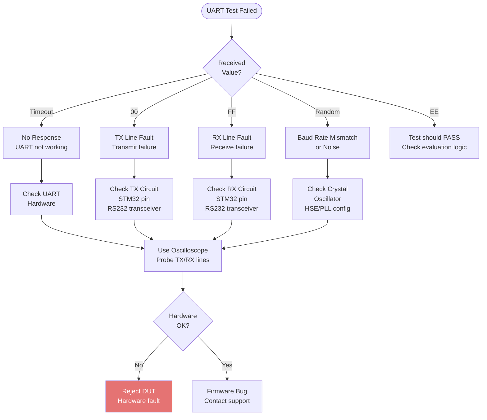
```mermaid
flowchart TD
    FAIL([UART Test Failed]) --> VALUE{Received<br/>Value?}
    
    VALUE -->|Timeout| TIMEOUT[No Response<br/>UART not working]
    VALUE -->|"00"| TX_FAULT[TX Line Fault<br/>Transmit failure]
    VALUE -->|"FF"| RX_FAULT[RX Line Fault<br/>Receive failure]
    VALUE -->|Random| BAUD_FAULT[Baud Rate Mismatch<br/>or Noise]
    VALUE -->|"EE"| PASS_ACTUALLY[Test should PASS<br/>Check evaluation logic]
    
    TIMEOUT --> CHECK_UART[Check UART<br/>Hardware]
    TX_FAULT --> CHECK_TX[Check TX Circuit<br/>STM32 pin<br/>RS232 transceiver]
    RX_FAULT --> CHECK_RX[Check RX Circuit<br/>STM32 pin<br/>RS232 transceiver]
    BAUD_FAULT --> CHECK_CLOCK[Check Crystal<br/>Oscillator<br/>HSE/PLL config]
    
    CHECK_UART --> SCOPE[Use Oscilloscope<br/>Probe TX/RX lines]
    CHECK_TX --> SCOPE
    CHECK_RX --> SCOPE
    CHECK_CLOCK --> SCOPE
    
    SCOPE --> HW_OK{Hardware<br/>OK?}
    HW_OK -->|No| REJECT[Reject DUT<br/>Hardware fault]
    HW_OK -->|Yes| FW_BUG[Firmware Bug<br/>Contact support]
    
    style REJECT fill:#E57373,color:#fff
```

**Diagnostic Steps:**

1. **Check Response Value:**
   ```
   Expected: "EE"
   Received: Check raw response in logs
   ```

2. **Value = "00":**
   - TX line not working
   - STM32 GPIO not driving high
   - Check TX circuit with oscilloscope

3. **Value = "FF":**
   - RX line stuck high (idle state)
   - Not receiving loopback data
   - Check RX circuit with oscilloscope

4. **Corrupted Data:**
   - Baud rate mismatch
   - Check STM32 clock configuration
   - Verify 8MHz external crystal

**Hardware Check (Advanced):**

Use oscilloscope to probe UART TX line:
- Expected: Square wave bursts at 115200 baud
- Voltage levels: 0V (low), 3.3V (high)
- If no activity: TX driver fault

---

### 3.3 RTC Test Fails

**Test:** TC-002 RTC  
**Symptom:** RTC value outside expected window or timeout

**Failure State Diagram:**

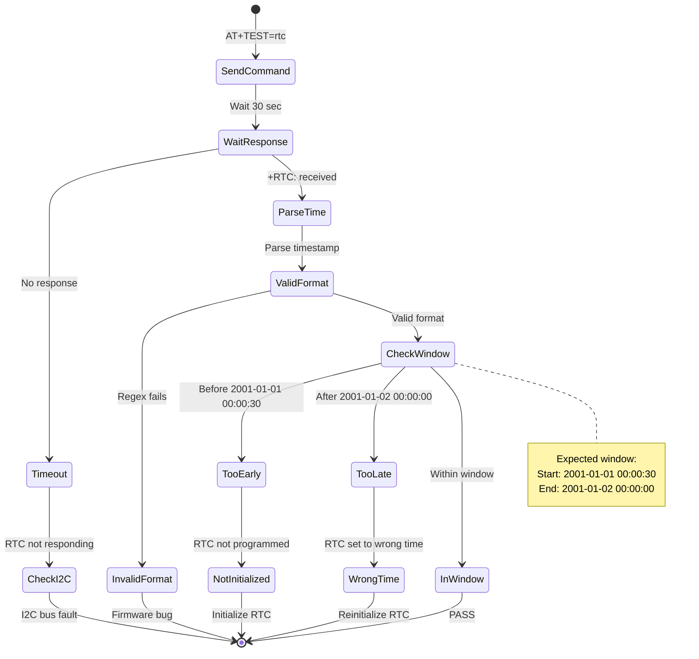
```mermaid
stateDiagram-v2
    [*] --> SendCommand: AT+TEST=rtc
    SendCommand --> WaitResponse: Wait 30 sec
    
    WaitResponse --> Timeout: No response
    WaitResponse --> ParseTime: +RTC: received
    
    Timeout --> CheckI2C: RTC not responding
    CheckI2C --> [*]: I2C bus fault
    
    ParseTime --> ValidFormat: Parse timestamp
    ValidFormat --> InvalidFormat: Regex fails
    ValidFormat --> CheckWindow: Valid format
    
    InvalidFormat --> [*]: Firmware bug
    
    CheckWindow --> TooEarly: Before 2001-01-01 00:00:30
    CheckWindow --> TooLate: After 2001-01-02 00:00:00
    CheckWindow --> InWindow: Within window
    
    TooEarly --> NotInitialized: RTC not programmed
    NotInitialized --> [*]: Initialize RTC
    
    TooLate --> WrongTime: RTC set to wrong time
    WrongTime --> [*]: Reinitialize RTC
    
    InWindow --> [*]: PASS
    
    note right of CheckWindow
        Expected window:
        Start: 2001-01-01 00:00:30
        End:   2001-01-02 00:00:00
    end note
```

**Troubleshooting by Symptom:**

| Reported Time | Diagnosis | Solution |
|---------------|-----------|----------|
| **Timeout** | RTC chip not responding | Check I2C bus, check RTC power |
| **2000-01-01 00:00:00** | RTC not initialized | Program RTC via firmware command |
| **Current date/time** | Wrong firmware loaded | Flash factory test firmware |
| **2001-01-05 xx:xx:xx** | RTC running but outside window | Reinitialize to window start |
| **0000-00-00 00:00:00** | RTC crystal not oscillating | Replace 32.768kHz crystal |

**RTC Initialization Procedure:**

If RTC not initialized, use firmware command:
```
AT+RTC_INIT=2001-01-01 12:00:00
# Expected: OK
```

Then retest:
```
AT+TEST=rtc
# Expected: +RTC: 2001-01-01 12:00:xx
```

**Hardware Check:**

1. **Check I2C Communication:**
   - Use logic analyzer on SCL/SDA lines
   - Should see I2C transactions to RTC address (0x68 or 0x51)

2. **Check RTC Crystal:**
   - 32.768kHz crystal should be present
   - Use oscilloscope to verify oscillation (very low amplitude)

3. **Check RTC Power:**
   - RTC chip should have backup battery or supercap
   - Voltage should be 3.0V - 3.3V

---

### 3.4 WiFi Test Fails

**Test:** TC-003 WiFi  
**Symptom:** Networks = 0, or connected = 0, or timeout

**Failure Decision Tree:**

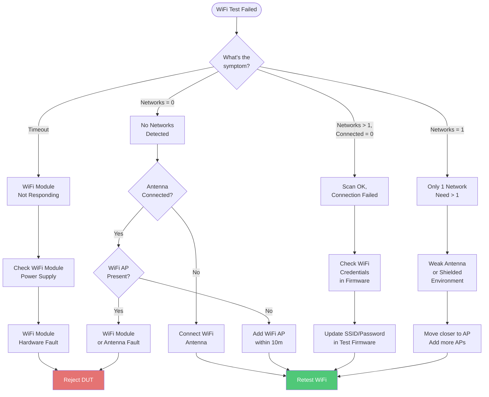
```mermaid
flowchart TD
    WIFI_FAIL([WiFi Test Failed]) --> SYMPTOM{What's the<br/>symptom?}
    
    SYMPTOM -->|Timeout| TIMEOUT_DIAG[WiFi Module<br/>Not Responding]
    SYMPTOM -->|Networks = 0| NO_SCAN[No Networks<br/>Detected]
    SYMPTOM -->|Networks > 1,<br/>Connected = 0| NO_CONNECT[Scan OK,<br/>Connection Failed]
    SYMPTOM -->|Networks = 1| ONE_NET[Only 1 Network<br/>Need > 1]
    
    TIMEOUT_DIAG --> CHECK_POWER[Check WiFi Module<br/>Power Supply]
    CHECK_POWER --> MODULE_DEAD[WiFi Module<br/>Hardware Fault]
    
    NO_SCAN --> ANT{Antenna<br/>Connected?}
    ANT -->|No| FIX_ANT[Connect WiFi<br/>Antenna]
    ANT -->|Yes| ENV{WiFi AP<br/>Present?}
    ENV -->|No| ADD_AP[Add WiFi AP<br/>within 10m]
    ENV -->|Yes| MODULE_FAULT[WiFi Module<br/>or Antenna Fault]
    
    NO_CONNECT --> CREDS[Check WiFi<br/>Credentials<br/>in Firmware]
    CREDS --> UPDATE_CREDS[Update SSID/Password<br/>in Test Firmware]
    
    ONE_NET --> WEAK_ANT[Weak Antenna<br/>or Shielded<br/>Environment]
    WEAK_ANT --> MOVE_CLOSER[Move closer to AP<br/>Add more APs]
    
    FIX_ANT --> RETEST[Retest WiFi]
    ADD_AP --> RETEST
    UPDATE_CREDS --> RETEST
    MOVE_CLOSER --> RETEST
    
    MODULE_DEAD --> REJECT[Reject DUT]
    MODULE_FAULT --> REJECT
    
    style RETEST fill:#50C878,color:#fff
    style REJECT fill:#E57373,color:#fff
```

**Systematic Troubleshooting:**

1. **Check Antenna:**
   - WiFi antenna must be connected
   - Antenna type: PCB trace, external whip, or chip antenna
   - Visual inspection: antenna physically present

2. **Check WiFi Access Point:**
   - At least one 2.4GHz WiFi AP must be within range
   - Use smartphone to verify APs visible in area
   - Ideal: 3+ APs for robust testing

3. **Check WiFi Credentials:**
   - Test firmware has hardcoded SSID/password
   - Verify test AP matches firmware credentials
   - Update firmware if necessary

4. **Check WiFi Module Power:**
   - WiFi chip requires 3.3V
   - Check voltage at WiFi module pins
   - If 0V: power supply issue

**WiFi Environment Requirements:**

| Parameter | Requirement | Reason |
|-----------|-------------|--------|
| **AP Count** | > 1 | Verify radio working (not cached data) |
| **Frequency** | 2.4GHz | ACB-M WiFi module is 2.4GHz only |
| **Distance** | < 10m | Ensure good signal strength |
| **Interference** | Low | Avoid microwave ovens, Bluetooth |

**Advanced Diagnostics:**

Use WiFi spectrum analyzer to check:
- 2.4GHz band activity
- Channel utilization
- Interference sources

---

### 3.5 Ethernet Test Fails

**Test:** TC-004 Ethernet  
**Symptom:** Invalid MAC, IP = 0.0.0.0, or timeout

**Failure Analysis Flowchart:**

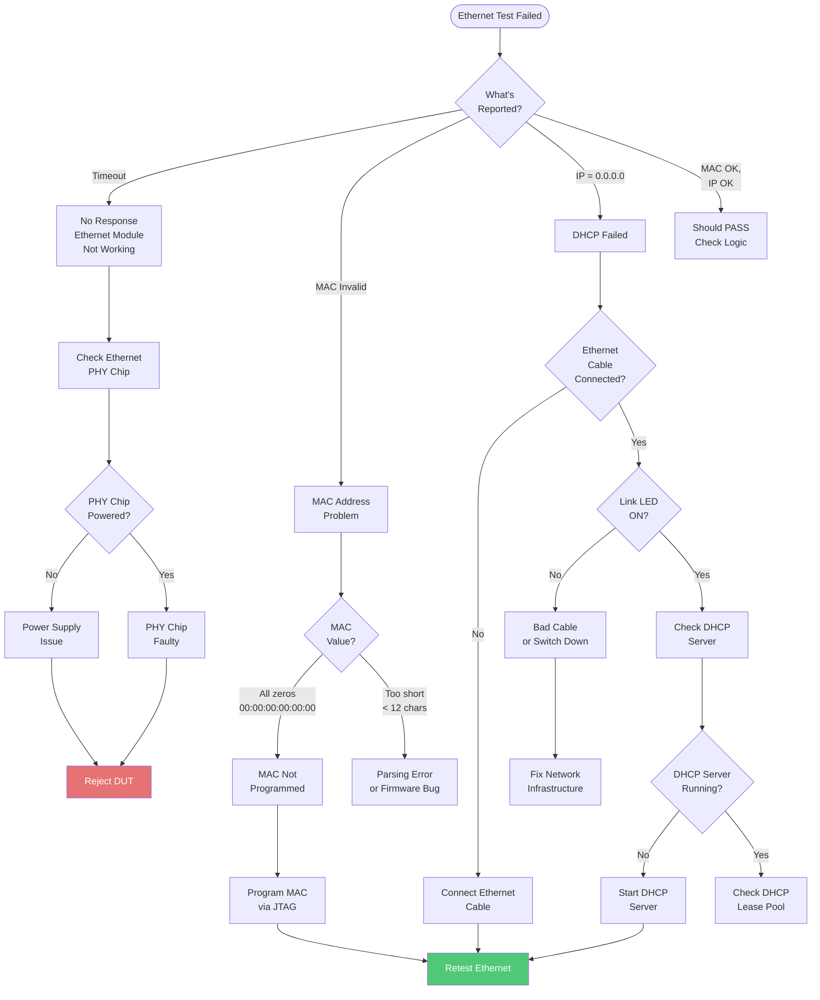
```mermaid
flowchart TD
    ETH_FAIL([Ethernet Test Failed]) --> PARSE{What's<br/>Reported?}
    
    PARSE -->|Timeout| TIMEOUT[No Response<br/>Ethernet Module<br/>Not Working]
    PARSE -->|MAC Invalid| MAC_ISSUE[MAC Address<br/>Problem]
    PARSE -->|IP = 0.0.0.0| DHCP_ISSUE[DHCP Failed]
    PARSE -->|MAC OK,<br/>IP OK| FALSE_FAIL[Should PASS<br/>Check Logic]
    
    TIMEOUT --> CHECK_PHY[Check Ethernet<br/>PHY Chip]
    CHECK_PHY --> PHY_POWER{PHY Chip<br/>Powered?}
    PHY_POWER -->|No| POWER_FAULT[Power Supply<br/>Issue]
    PHY_POWER -->|Yes| PHY_FAULT[PHY Chip<br/>Faulty]
    
    MAC_ISSUE --> MAC_TYPE{MAC<br/>Value?}
    MAC_TYPE -->|All zeros<br/>00:00:00:00:00:00| NOT_PROGRAMMED[MAC Not<br/>Programmed]
    MAC_TYPE -->|Too short<br/>< 12 chars| PARSE_ERROR[Parsing Error<br/>or Firmware Bug]
    
    NOT_PROGRAMMED --> PROGRAM_MAC[Program MAC<br/>via JTAG]
    
    DHCP_ISSUE --> CABLE{Ethernet<br/>Cable<br/>Connected?}
    CABLE -->|No| FIX_CABLE[Connect Ethernet<br/>Cable]
    CABLE -->|Yes| LINK{Link LED<br/>ON?}
    LINK -->|No| CABLE_BAD[Bad Cable<br/>or Switch Down]
    LINK -->|Yes| DHCP_CHECK[Check DHCP<br/>Server]
    
    DHCP_CHECK --> DHCP_RUNNING{DHCP Server<br/>Running?}
    DHCP_RUNNING -->|No| START_DHCP[Start DHCP<br/>Server]
    DHCP_RUNNING -->|Yes| DHCP_LEASE[Check DHCP<br/>Lease Pool]
    
    FIX_CABLE --> RETEST[Retest Ethernet]
    START_DHCP --> RETEST
    PROGRAM_MAC --> RETEST
    
    POWER_FAULT --> REJECT[Reject DUT]
    PHY_FAULT --> REJECT
    CABLE_BAD --> FIX_INFRA[Fix Network<br/>Infrastructure]
    
    style RETEST fill:#50C878,color:#fff
    style REJECT fill:#E57373,color:#fff
```

**Troubleshooting by Symptom:**

**Symptom: MAC = 00:00:00:00:00:00**

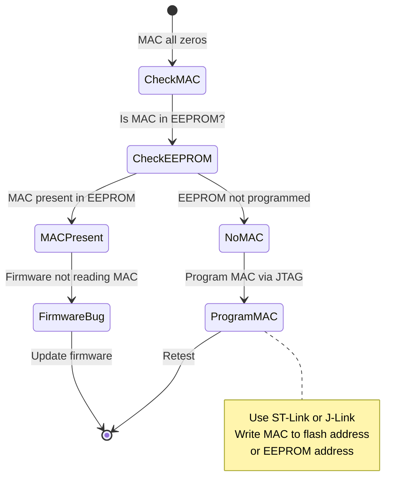
```mermaid
stateDiagram-v2
    [*] --> CheckMAC: MAC all zeros
    CheckMAC --> CheckEEPROM: Is MAC in EEPROM?
    CheckEEPROM --> NoMAC: EEPROM not programmed
    CheckEEPROM --> MACPresent: MAC present in EEPROM
    
    NoMAC --> ProgramMAC: Program MAC via JTAG
    ProgramMAC --> [*]: Retest
    
    MACPresent --> FirmwareBug: Firmware not reading MAC
    FirmwareBug --> [*]: Update firmware
    
    note right of ProgramMAC
        Use ST-Link or J-Link
        Write MAC to flash address
        or EEPROM address
    end note
```

**Solution:** Program unique MAC address via JTAG/SWD

**Symptom: IP = 0.0.0.0**

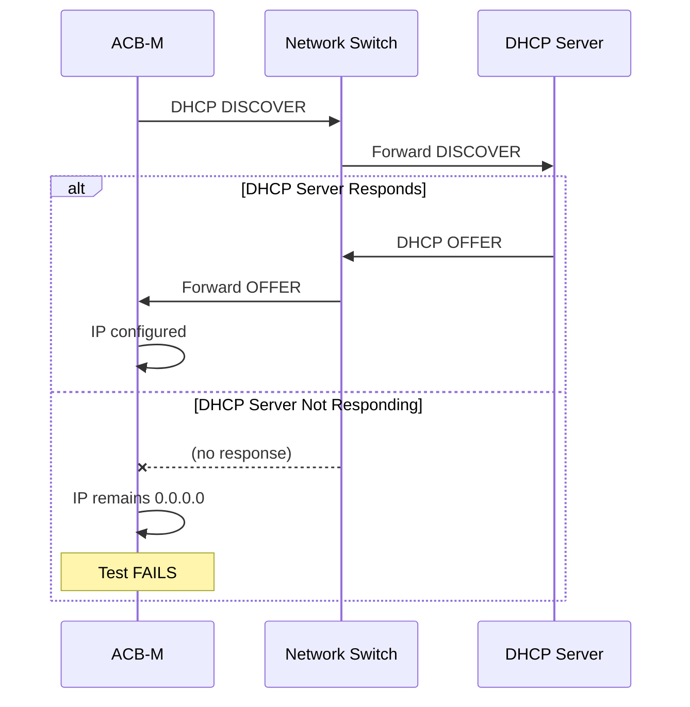
```mermaid
sequenceDiagram
    participant ACB as ACB-M
    participant Switch as Network Switch
    participant DHCP as DHCP Server
    
    ACB->>Switch: DHCP DISCOVER
    Switch->>DHCP: Forward DISCOVER
    
    alt DHCP Server Responds
        DHCP->>Switch: DHCP OFFER
        Switch->>ACB: Forward OFFER
        ACB->>ACB: IP configured
    else DHCP Server Not Responding
        Switch--xACB: (no response)
        ACB->>ACB: IP remains 0.0.0.0
        Note over ACB: Test FAILS
    end
```

**Checklist:**

1. **Check Cable:**
   - Cat5e or Cat6 Ethernet cable
   - Cable connected to both DUT and switch
   - Link LED on switch should be lit

2. **Check DHCP Server:**
   - Ping DHCP server from test PC
   - Verify DHCP service running
   - Check DHCP lease pool not exhausted

3. **Check Network:**
   - DUT and DHCP server on same VLAN
   - No firewall blocking DHCP (ports 67/68)
   - Router not blocking DHCP relay

**Network Infrastructure Requirements:**

| Component | Requirement |
|-----------|-------------|
| **Ethernet Cable** | Cat5e or better, < 100m |
| **Switch** | Managed or unmanaged, 100Mbps min |
| **DHCP Server** | Active on test network, lease pool available |
| **VLAN** | DUT and DHCP on same VLAN (no routing required) |

---

### 3.6 RS485-2 Test Fails

**Test:** TC-005 RS485-2  
**Symptom:** Status ≠ 0, or timeout

**Failure State Diagram:**

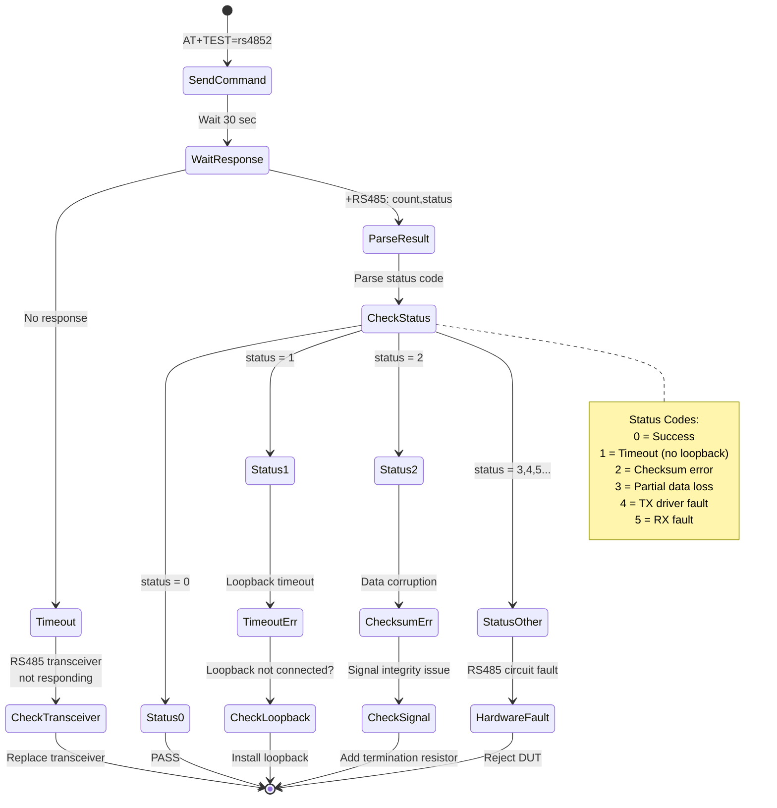
```mermaid
stateDiagram-v2
    [*] --> SendCommand: AT+TEST=rs4852
    SendCommand --> WaitResponse: Wait 30 sec
    
    WaitResponse --> Timeout: No response
    WaitResponse --> ParseResult: +RS485: count,status
    
    Timeout --> CheckTransceiver: RS485 transceiver<br/>not responding
    CheckTransceiver --> [*]: Replace transceiver
    
    ParseResult --> CheckStatus: Parse status code
    CheckStatus --> Status0: status = 0
    CheckStatus --> Status1: status = 1
    CheckStatus --> Status2: status = 2
    CheckStatus --> StatusOther: status = 3,4,5...
    
    Status0 --> [*]: PASS
    
    Status1 --> TimeoutErr: Loopback timeout
    TimeoutErr --> CheckLoopback: Loopback not connected?
    CheckLoopback --> [*]: Install loopback
    
    Status2 --> ChecksumErr: Data corruption
    ChecksumErr --> CheckSignal: Signal integrity issue
    CheckSignal --> [*]: Add termination resistor
    
    StatusOther --> HardwareFault: RS485 circuit fault
    HardwareFault --> [*]: Reject DUT
    
    note right of CheckStatus
        Status Codes:
        0 = Success
        1 = Timeout (no loopback)
        2 = Checksum error
        3 = Partial data loss
        4 = TX driver fault
        5 = RX fault
    end note
```

**Troubleshooting by Status Code:**

**Status = 1 (Timeout):**

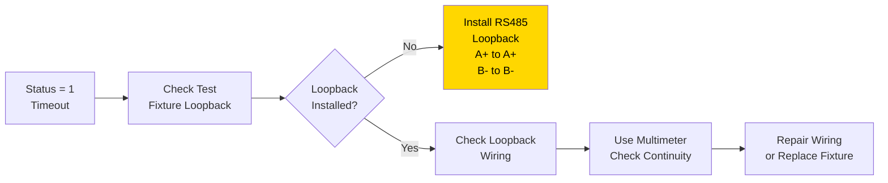
```mermaid
flowchart LR
    STATUS1[Status = 1<br/>Timeout] --> CHECK_LOOP[Check Test<br/>Fixture Loopback]
    CHECK_LOOP --> PRESENT{Loopback<br/>Installed?}
    PRESENT -->|No| INSTALL[Install RS485<br/>Loopback<br/>A+ to A+<br/>B- to B-]
    PRESENT -->|Yes| CHECK_WIRING[Check Loopback<br/>Wiring]
    CHECK_WIRING --> CONTINUITY[Use Multimeter<br/>Check Continuity]
    CONTINUITY --> FIX[Repair Wiring<br/>or Replace Fixture]
    
    style INSTALL fill:#FFD700,color:#000
```

**RS485 Loopback Wiring:**

```
Test Fixture Loopback:

   ACB-M RS485-2 Port
   ┌─────────────┐
   │  A+ ────────┼──┐
   │  B- ────────┼──┼──┐
   │  GND        │  │  │
   └─────────────┘  │  │
                    │  │
   (Loopback)       │  │
                    │  │
   ┌─────────────┐  │  │
   │  A+ ────────┼──┘  │
   │  B- ────────┼─────┘
   │  GND        │
   └─────────────┘
```

**Status = 2 (Checksum Error):**

Indicates data corruption. Possible causes:
- No termination resistor (120Ω)
- Cable too long (> 1m in test fixture)
- Electrical noise
- Ground loop

**Solution:** Add 120Ω termination resistor between A+ and B-

**Status = 4 or 5 (TX/RX Fault):**

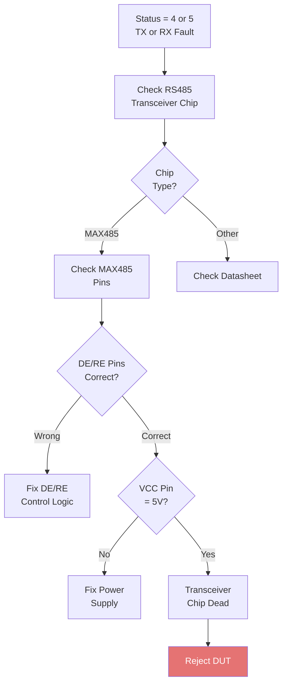
```mermaid
flowchart TD
    FAULT[Status = 4 or 5<br/>TX or RX Fault] --> CHIP[Check RS485<br/>Transceiver Chip]
    CHIP --> TYPE{Chip<br/>Type?}
    TYPE -->|MAX485| CHECK_MAX[Check MAX485<br/>Pins]
    TYPE -->|Other| CHECK_OTHER[Check Datasheet]
    
    CHECK_MAX --> DE{DE/RE Pins<br/>Correct?}
    DE -->|Wrong| FIX_PIN[Fix DE/RE<br/>Control Logic]
    DE -->|Correct| POWER{VCC Pin<br/>= 5V?}
    POWER -->|No| FIX_POWER[Fix Power<br/>Supply]
    POWER -->|Yes| DEAD[Transceiver<br/>Chip Dead]
    
    DEAD --> REJECT[Reject DUT]
    
    style REJECT fill:#E57373,color:#fff
```

---

## Hardware Problems

### 4.1 No Power

**Symptom:** Device completely dead, no LEDs

**Power Supply Check Flowchart:**

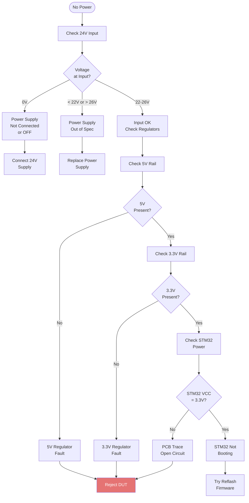
```mermaid
flowchart TD
    NO_POWER([No Power]) --> CHECK_24V[Check 24V Input]
    CHECK_24V --> MEASURE{Voltage<br/>at Input?}
    
    MEASURE -->|0V| SUPPLY_OFF[Power Supply<br/>Not Connected<br/>or OFF]
    MEASURE -->|22-26V| INPUT_OK[Input OK<br/>Check Regulators]
    MEASURE -->|< 22V or > 26V| SUPPLY_FAULT[Power Supply<br/>Out of Spec]
    
    SUPPLY_OFF --> FIX_SUPPLY[Connect 24V<br/>Supply]
    SUPPLY_FAULT --> REPLACE_SUPPLY[Replace Power<br/>Supply]
    
    INPUT_OK --> CHECK_5V[Check 5V Rail]
    CHECK_5V --> V5{5V<br/>Present?}
    V5 -->|No| REG_5V_FAULT[5V Regulator<br/>Fault]
    V5 -->|Yes| CHECK_3V3[Check 3.3V Rail]
    
    CHECK_3V3 --> V33{3.3V<br/>Present?}
    V33 -->|No| REG_3V3_FAULT[3.3V Regulator<br/>Fault]
    V33 -->|Yes| CHECK_MCU[Check STM32<br/>Power]
    
    CHECK_MCU --> MCU_VCC{STM32 VCC<br/>= 3.3V?}
    MCU_VCC -->|No| TRACE_OPEN[PCB Trace<br/>Open Circuit]
    MCU_VCC -->|Yes| MCU_FAULT[STM32 Not<br/>Booting]
    
    REG_5V_FAULT --> REJECT[Reject DUT]
    REG_3V3_FAULT --> REJECT
    TRACE_OPEN --> REJECT
    MCU_FAULT --> REFLASH[Try Reflash<br/>Firmware]
    
    style REJECT fill:#E57373,color:#fff
```

**Voltage Measurement Points:**

| Rail | Expected | Tolerance | Purpose |
|------|----------|-----------|---------|
| **24V Input** | 24.0V | 22-26V | Main power input |
| **5V Rail** | 5.0V | 4.75-5.25V | RS485 transceiver, peripherals |
| **3.3V Rail** | 3.3V | 3.15-3.45V | STM32, WiFi, Ethernet |

**Using Multimeter:**

1. Set multimeter to DC voltage mode
2. Black probe to GND (any GND point on PCB)
3. Red probe to test point
4. Read voltage

---

### 4.2 Intermittent Failures

**Symptom:** Tests pass sometimes, fail other times

**Root Cause Analysis:**

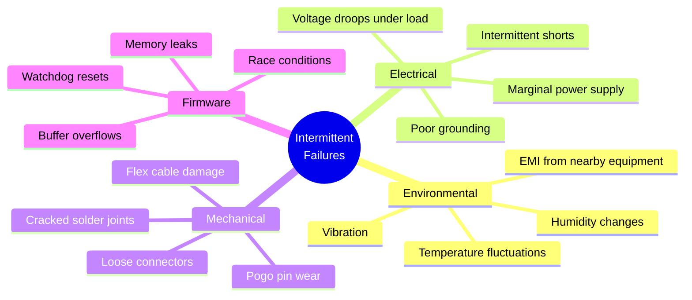
```mermaid
mindmap
  root((Intermittent<br/>Failures))
    Environmental
      Temperature fluctuations
      Humidity changes
      EMI from nearby equipment
      Vibration
    Electrical
      Marginal power supply
      Voltage droops under load
      Poor grounding
      Intermittent shorts
    Mechanical
      Loose connectors
      Cracked solder joints
      Pogo pin wear
      Flex cable damage
    Firmware
      Race conditions
      Memory leaks
      Watchdog resets
      Buffer overflows
```

**Systematic Diagnosis:**

1. **Run Test 10 Times:**
   - All pass: Not intermittent (was one-time glitch)
   - Random failures: Truly intermittent
   - Fails after N passes: Thermal or cumulative issue

2. **Check Temperature:**
   - Use thermal camera or temperature sensor
   - Look for components overheating (> 80°C)
   - Check if failures correlate with temperature rise

3. **Check Fixture Contacts:**
   - Inspect pogo pins for wear, dirt, oxidation
   - Clean with isopropyl alcohol
   - Measure contact resistance (should be < 1Ω)

4. **Check Power Supply:**
   - Measure voltage under load (during test)
   - Look for voltage droops (should stay within ±5%)
   - Check for ripple (should be < 100mV pk-pk)

**Pattern Analysis:**

| Pattern | Likely Cause | Solution |
|---------|--------------|----------|
| Fails after 5-10 tests | Thermal - component overheating | Add heatsink, improve ventilation |
| Fails on WiFi only | WiFi module temperature-sensitive | Check WiFi module power, add heatsink |
| Fails in morning | Cold solder joint | Inspect solder joints, reflow if needed |
| Random, no pattern | Loose contact or EMI | Clean contacts, add shielding |

---

## Software Issues

### 5.1 Application Crashes

**Symptom:** Factory Testing app closes unexpectedly

**Common Causes:**

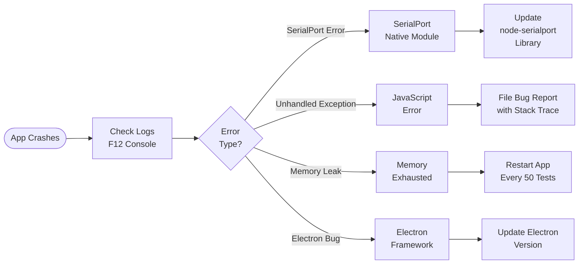
```mermaid
flowchart LR
    CRASH([App Crashes]) --> CHECK_LOGS[Check Logs<br/>F12 Console]
    CHECK_LOGS --> ERROR_TYPE{Error<br/>Type?}
    
    ERROR_TYPE -->|SerialPort Error| SERIAL_ISSUE[SerialPort<br/>Native Module]
    ERROR_TYPE -->|Unhandled Exception| CODE_BUG[JavaScript<br/>Error]
    ERROR_TYPE -->|Memory Leak| MEMORY_ISSUE[Memory<br/>Exhausted]
    ERROR_TYPE -->|Electron Bug| ELECTRON_ISSUE[Electron<br/>Framework]
    
    SERIAL_ISSUE --> UPDATE_SERIAL[Update<br/>node-serialport<br/>Library]
    CODE_BUG --> FILE_BUG[File Bug Report<br/>with Stack Trace]
    MEMORY_ISSUE --> RESTART[Restart App<br/>Every 50 Tests]
    ELECTRON_ISSUE --> UPDATE_ELECTRON[Update Electron<br/>Version]
```

**Recovery Steps:**

1. **Immediate Recovery:**
   - Close app
   - Restart app
   - Reconnect to device
   - Resume testing

2. **Check for Updates:**
   - Help → Check for Updates
   - Update to latest version

3. **Clear Cache:**
   ```
   Windows: %APPDATA%\nubei-eol-toolkit
   Delete cache folder
   Restart app
   ```

4. **Reinstall:**
   - Uninstall app
   - Download latest installer
   - Reinstall
   - Retest

---

### 5.2 Slow Performance

**Symptom:** Tests take much longer than expected (> 180 seconds)

**Expected vs Actual Duration:**

| Test | Expected | Acceptable | Slow |
|------|----------|------------|------|
| **UART** | 30 sec | 30-40 sec | > 40 sec |
| **RTC** | 30 sec | 30-35 sec | > 35 sec |
| **WiFi** | 30 sec | 30-45 sec | > 45 sec |
| **Ethernet** | 30 sec | 30-40 sec | > 40 sec |
| **RS485-2** | 30 sec | 30-35 sec | > 35 sec |
| **Total** | 150 sec | 150-180 sec | > 180 sec |

**Performance Troubleshooting:**

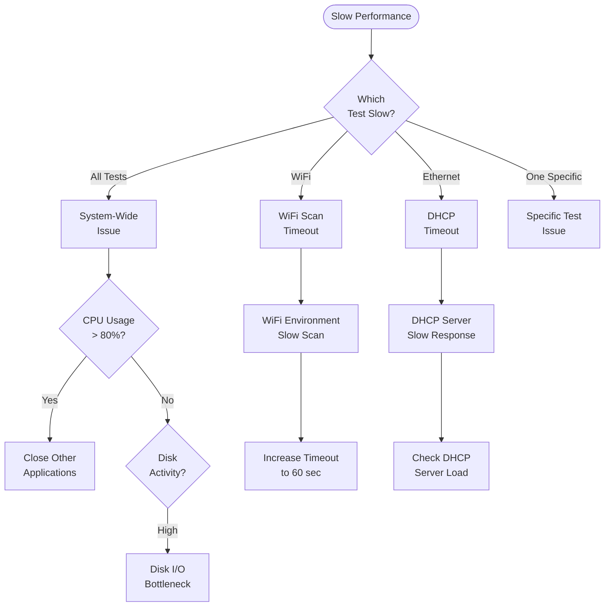
```mermaid
flowchart TD
    SLOW([Slow Performance]) --> WHERE{Which<br/>Test Slow?}
    
    WHERE -->|All Tests| SYSTEM[System-Wide<br/>Issue]
    WHERE -->|WiFi| WIFI_SLOW[WiFi Scan<br/>Timeout]
    WHERE -->|Ethernet| ETH_SLOW[DHCP<br/>Timeout]
    WHERE -->|One Specific| THAT_TEST[Specific Test<br/>Issue]
    
    SYSTEM --> CPU{CPU Usage<br/>> 80%?}
    CPU -->|Yes| CLOSE_APPS[Close Other<br/>Applications]
    CPU -->|No| CHECK_DISK{Disk<br/>Activity?}
    CHECK_DISK -->|High| DISK_ISSUE[Disk I/O<br/>Bottleneck]
    
    WIFI_SLOW --> WIFI_ENV[WiFi Environment<br/>Slow Scan]
    WIFI_ENV --> INCREASE_TO[Increase Timeout<br/>to 60 sec]
    
    ETH_SLOW --> DHCP_SLOW[DHCP Server<br/>Slow Response]
    DHCP_SLOW --> FIX_DHCP[Check DHCP<br/>Server Load]
```

**Optimization Tips:**

1. Close other applications (browsers, Office, etc.)
2. Use dedicated test PC (not shared workstation)
3. Ensure PC has adequate resources:
   - CPU: 4+ cores
   - RAM: 8GB+
   - SSD: Preferred over HDD

---

### 5.3 UI Not Updating

**Symptom:** Progress bar stuck, results not displayed

**State Management Issue:**

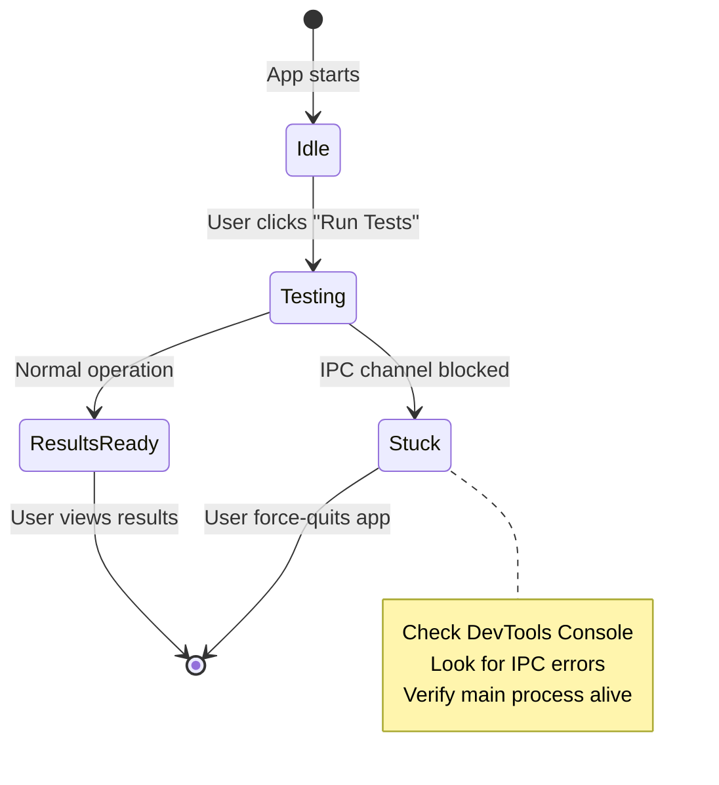
```mermaid
stateDiagram-v2
    [*] --> Idle: App starts
    Idle --> Testing: User clicks "Run Tests"
    Testing --> Stuck: IPC channel blocked
    Testing --> ResultsReady: Normal operation
    
    Stuck --> [*]: User force-quits app
    ResultsReady --> [*]: User views results
    
    note right of Stuck
        Check DevTools Console
        Look for IPC errors
        Verify main process alive
    end note
```

**Fix:**

1. Open DevTools (F12)
2. Check Console for errors
3. If IPC error: Restart app
4. If persists: File bug report

---

## Test Fixture Issues

### 6.1 Fixture Calibration

**When to Calibrate:**

- After 1000 tests
- After physical damage
- After moving fixture
- If multiple known-good DUTs fail

**Calibration Procedure:**

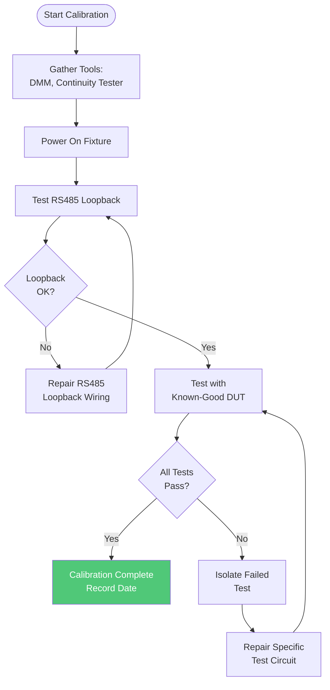
```mermaid
flowchart TD
    START([Start Calibration]) --> TOOLS[Gather Tools:<br/>DMM, Continuity Tester]
    TOOLS --> POWER[Power On Fixture]
    POWER --> RS485[Test RS485 Loopback]
    
    RS485 --> LOOP_OK{Loopback<br/>OK?}
    LOOP_OK -->|No| FIX_LOOP[Repair RS485<br/>Loopback Wiring]
    LOOP_OK -->|Yes| VERIFY[Test with<br/>Known-Good DUT]
    
    FIX_LOOP --> RS485
    
    VERIFY --> DUT_PASS{All Tests<br/>Pass?}
    DUT_PASS -->|Yes| DONE[Calibration Complete<br/>Record Date]
    DUT_PASS -->|No| ISOLATE[Isolate Failed<br/>Test]
    
    ISOLATE --> FIX_TEST[Repair Specific<br/>Test Circuit]
    FIX_TEST --> VERIFY
    
    style DONE fill:#50C878,color:#fff
```

**Checklist:**

- [ ] RS485 loopback continuity check
- [ ] Pogo pins clean and straight
- [ ] All connectors secure
- [ ] Power supply output: 24V ± 0.5V
- [ ] Test with 3 known-good DUTs: all pass

---

### 6.2 Pogo Pin Maintenance

**Pogo Pin Wear:**

After 10,000+ tests, pogo pins wear out:
- Tips become flat or damaged
- Spring tension weakens
- Contact resistance increases

**Inspection:**

```mermaid
flowchart LR
    INSPECT[Inspect Pogo Pins] --> VISUAL[Visual Check]
    VISUAL --> WORN{Pins Worn<br/>or Damaged?}
    
    WORN -->|Yes| REPLACE[Replace Pogo Pins]
    WORN -->|No| CLEAN[Clean with<br/>Isopropyl Alcohol]
    
    CLEAN --> RESISTANCE[Measure Contact<br/>Resistance]
    RESISTANCE --> OK{< 1 Ohm?}
    OK -->|Yes| GOOD[Pins OK]
    OK -->|No| REPLACE
    
    REPLACE --> RETEST[Retest Fixture]
```

**Cleaning Procedure:**

1. Power off fixture
2. Apply isopropyl alcohol (99%) to cotton swab
3. Gently clean each pogo pin tip
4. Let dry (1-2 minutes)
5. Retest with known-good DUT

---

## Network Infrastructure Issues

### 7.1 DHCP Server Not Responding

**Symptom:** Ethernet test fails with IP = 0.0.0.0

**DHCP Troubleshooting:**

```mermaid
flowchart TD
    DHCP_FAIL([DHCP Failed]) --> PING[Ping DHCP Server<br/>from Test PC]
    PING --> REACHABLE{Server<br/>Reachable?}
    
    REACHABLE -->|No| SERVER_DOWN[DHCP Server<br/>Down or Unreachable]
    REACHABLE -->|Yes| CHECK_SERVICE[Check DHCP<br/>Service Running]
    
    SERVER_DOWN --> RESTART_SERVER[Restart DHCP<br/>Server]
    
    CHECK_SERVICE --> RUNNING{Service<br/>Running?}
    RUNNING -->|No| START_SERVICE[Start DHCP<br/>Service]
    RUNNING -->|Yes| CHECK_POOL[Check Lease Pool]
    
    CHECK_POOL --> FULL{Pool<br/>Exhausted?}
    FULL -->|Yes| EXPAND_POOL[Expand Lease Pool<br/>or Release Leases]
    FULL -->|No| CHECK_FIREWALL[Check Firewall]
    
    CHECK_FIREWALL --> BLOCKED{Ports 67/68<br/>Blocked?}
    BLOCKED -->|Yes| FIX_FW[Open UDP<br/>67/68]
    BLOCKED -->|No| VLAN_CHECK[Check VLAN<br/>Configuration]
```

**DHCP Server Checklist:**

- [ ] Server powered and network connected
- [ ] DHCP service running (check with `netstat -an | findstr :67`)
- [ ] Lease pool has available addresses
- [ ] Firewall allows UDP ports 67 (server) and 68 (client)
- [ ] VLAN configuration allows DHCP traffic

**Example DHCP Configuration (Windows Server):**

```
Scope: 192.168.1.0/24
Start IP: 192.168.1.100
End IP: 192.168.1.200
Lease Duration: 8 hours
Gateway: 192.168.1.1
DNS: 192.168.1.1
```

---

### 7.2 Network Segmentation Issues

**Symptom:** Test PC can access network, but ACB-M cannot get DHCP

**VLAN Diagram:**

```mermaid
graph TB
    subgraph "Correct Setup (Same VLAN)"
        PC1[Test PC<br/>VLAN 10] --- SW1[Switch]
        ACB1[ACB-M DUT<br/>VLAN 10] --- SW1
        DHCP1[DHCP Server<br/>VLAN 10] --- SW1
    end
    
    subgraph "Incorrect Setup (Different VLANs)"
        PC2[Test PC<br/>VLAN 10] --- SW2[Switch]
        ACB2[ACB-M DUT<br/>VLAN 20] --- SW2
        DHCP2[DHCP Server<br/>VLAN 10] --- SW2
        
        style ACB2 fill:#E57373,color:#fff
    end
    
    style ACB1 fill:#50C878,color:#fff
```

**Solution:** Ensure ACB-M, test PC, and DHCP server are all on the same VLAN.

---

## Advanced Diagnostics

### 8.1 Using Logic Analyzer

**I2C Bus Monitoring (RTC):**

```
Connect logic analyzer:
- CH0: SCL (I2C clock)
- CH1: SDA (I2C data)
- GND: Ground

Expected traffic:
1. Write to RTC (set time)
2. Read from RTC (get time)

I2C address: 0x68 (PCF8563) or 0x51 (DS1307)
```

**SPI Bus Monitoring (WiFi):**

```
Connect logic analyzer:
- CH0: SCK (SPI clock)
- CH1: MOSI (Master out)
- CH2: MISO (Master in)
- CH3: CS (Chip select)
- GND: Ground

Expected traffic during WiFi test:
- Frequent SPI transactions
- CS pulsing low
- MOSI/MISO data exchange
```

---

### 8.2 Firmware Debugging

**Using ST-Link Debugger:**

1. Connect ST-Link to ACB-M SWD port
2. Open STM32CubeIDE or Keil
3. Load project and firmware symbols
4. Set breakpoints in test functions
5. Run firmware in debug mode
6. Send AT commands from PC
7. Step through code to find issues

---

## FAQ

### Q1: How long should each test take?

**A:** Each test has a 30-second timeout. Normal duration:
- UART: 5-10 seconds
- RTC: 2-5 seconds
- WiFi: 10-20 seconds (depends on AP count)
- Ethernet: 10-15 seconds (depends on DHCP)
- RS485-2: 5-10 seconds

**Total:** 30-60 seconds for all 5 tests (excluding connection time)

---

### Q2: Can I skip tests?

**A:** No. All 5 tests must run and pass for overall PASS status. Tests are designed to cover all critical functionality.

---

### Q3: What if WiFi test always times out?

**A:** WiFi timeout indicates:
1. No WiFi AP in range (add 2.4GHz AP)
2. Antenna not connected (check antenna)
3. WiFi module fault (replace DUT)

Increase timeout to 60 seconds if WiFi environment is marginal.

---

### Q4: How do I know if the test fixture is bad?

**A:** Test with 3 known-good DUTs:
- If all pass: Fixture OK
- If all fail: Fixture bad (calibrate or repair)
- If some pass: Intermittent fixture issue (clean contacts)

---

### Q5: What does RS485 status code mean?

**A:**
- 0 = Success (PASS)
- 1 = Timeout (loopback not connected)
- 2 = Checksum error (signal integrity issue)
- 3 = Partial data (cable issue)
- 4 = TX fault (transmitter driver problem)
- 5 = RX fault (receiver problem)

---

## Getting Help

### Support Channels

**For Test Operators:**
- Local supervisor or lead technician
- Training materials and videos
- This troubleshooting guide

**For Engineers:**
- Email: support@nube-io.com
- GitHub Issues: https://github.com/NubeIO/NubeiO-Eol-Toolkit/issues
- Include:
  - Device serial number
  - Test results (screenshot or CSV)
  - Application logs (F12 → Console)

### Information to Collect

When reporting issues, provide:

1. **Device Information:**
   - Device type: ACB-M
   - Serial number or unique ID
   - Firmware version

2. **Test Results:**
   - Which test(s) failed
   - Error messages
   - Raw AT responses (if available)

3. **Environment:**
   - Test fixture ID
   - Network configuration
   - Test operator name
   - Date and time of test

4. **Application Logs:**
   - Open DevTools (F12)
   - Copy Console logs
   - Include in report

---

**Document Version:** 1.0  
**Last Updated:** December 9, 2025  
**Next Review:** March 2026
