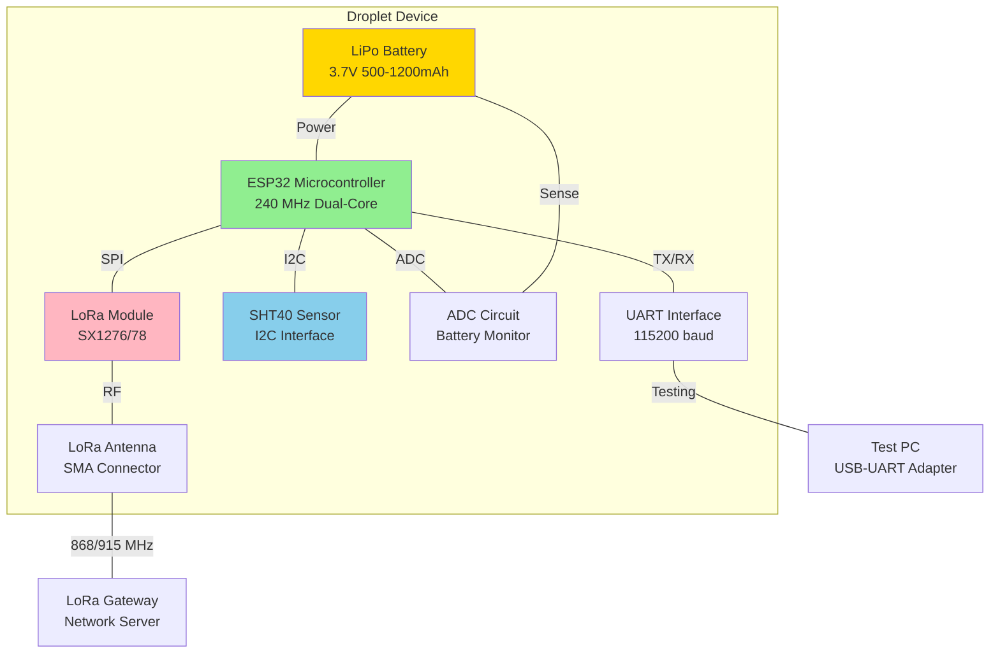
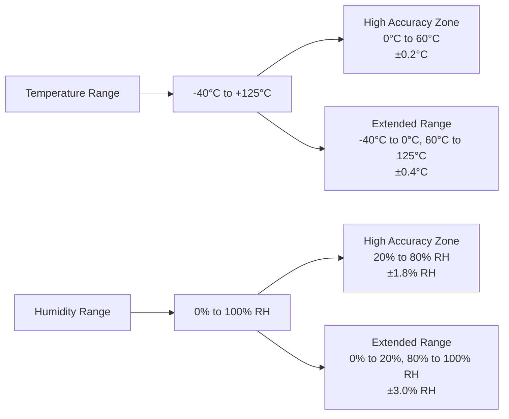
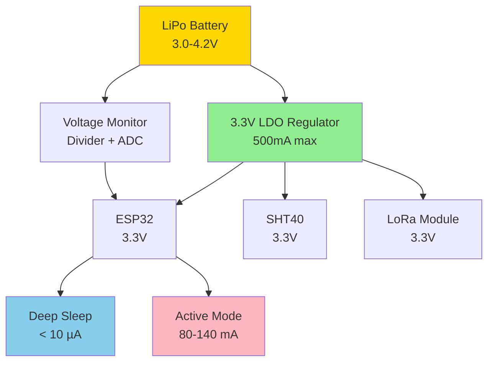
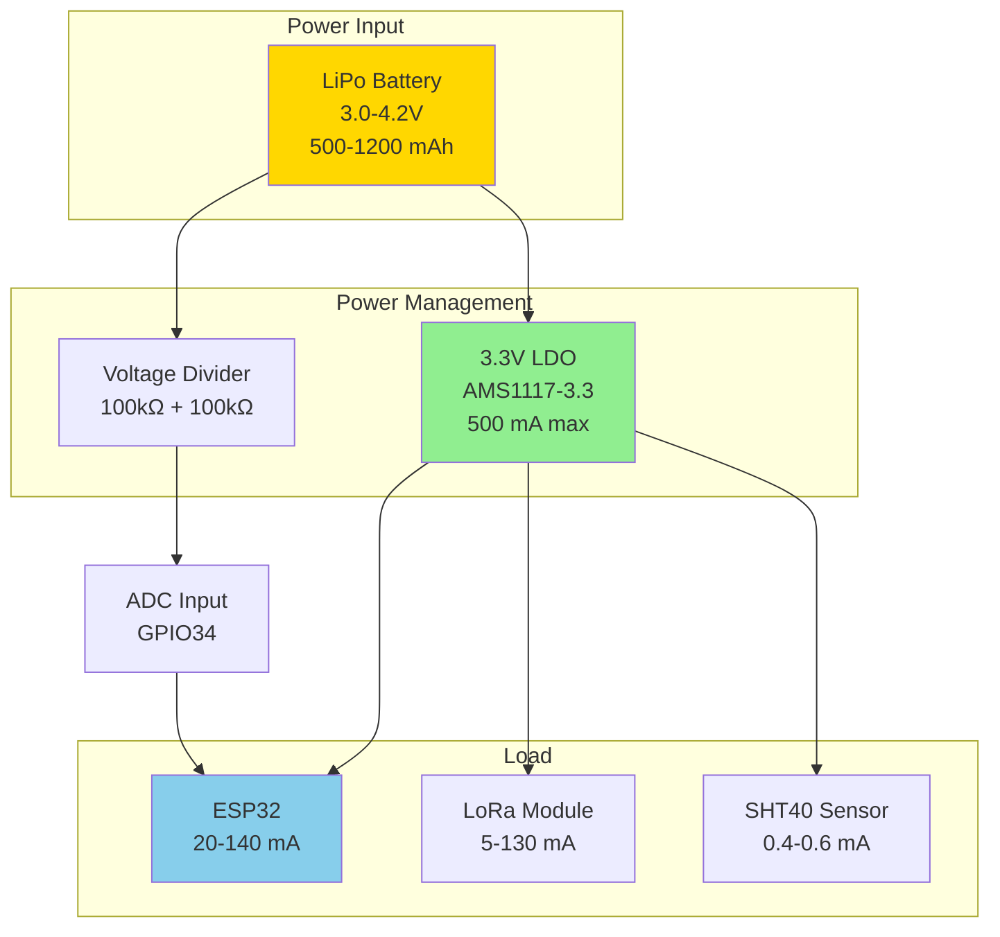
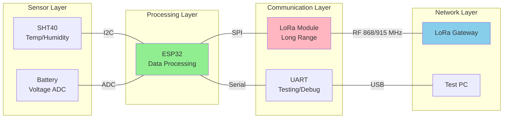
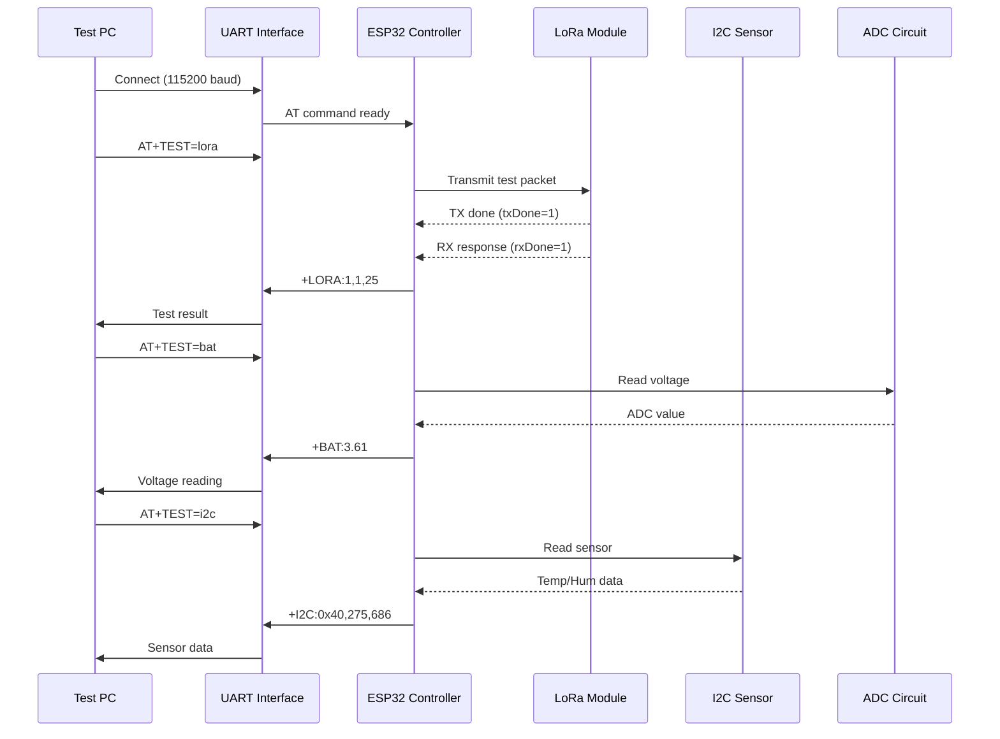

# Droplet Hardware Overview

**Device:** Droplet (Ultra-Compact IoT Sensor Node)  
**Generation:** GEN-2  
**Microcontroller:** ESP32  
**Last Updated:** December 9, 2025

---

## Table of Contents

1. [Introduction](#introduction)
2. [Hardware Specifications](#hardware-specifications)
3. [Component Architecture](#component-architecture)
4. [Subsystem Details](#subsystem-details)
5. [Power System](#power-system)
6. [Communication Interfaces](#communication-interfaces)
7. [Mechanical Design](#mechanical-design)
8. [Environmental Specifications](#environmental-specifications)
9. [Pinout and Connections](#pinout-and-connections)
10. [Block Diagrams](#block-diagrams)

---

## Introduction

The **Droplet** is an ultra-compact, battery-powered IoT sensor node designed for distributed environmental monitoring applications. Combining ESP32 processing power, LoRa long-range wireless communication, and environmental sensing in a minimal footprint, the Droplet represents the next generation of scalable sensor network endpoints.

### Design Philosophy

- **Ultra-Compact:** Minimal PCB area for deployment flexibility
- **Low Power:** Battery operation with extended runtime (months to years)
- **Long Range:** LoRa connectivity up to 10+ km line-of-sight
- **Environmental Sensing:** Integrated temperature and humidity monitoring
- **Easy Deployment:** No infrastructure required (battery + wireless)

### Target Markets

- **Smart Buildings:** Temperature/humidity monitoring in rooms, ducts, and zones
- **Agriculture:** Soil moisture, ambient conditions in greenhouses and fields
- **Cold Chain:** Transport and storage monitoring for food and pharmaceuticals
- **Industrial IoT:** Process monitoring in manufacturing facilities
- **Smart Cities:** Environmental quality monitoring in public spaces

---

## Hardware Specifications

### Microcontroller

| Parameter | Specification |
|-----------|---------------|
| **CPU** | Espressif ESP32 (Dual-core Xtensa LX6) |
| **Clock Speed** | Up to 240 MHz |
| **RAM** | 520 KB SRAM |
| **Flash** | 4 MB (external SPI flash) |
| **Operating Voltage** | 3.3V internal logic |
| **Sleep Current** | < 10 µA (deep sleep mode) |
| **Active Current** | ~80 mA (WiFi TX), ~120 mA (LoRa TX) |

### LoRa Radio Module

| Parameter | Specification |
|-----------|---------------|
| **Chipset** | Semtech SX1276/SX1278 or compatible |
| **Frequency Bands** | 433 MHz, 868 MHz, 915 MHz (region-dependent) |
| **TX Power** | +20 dBm (100 mW) maximum |
| **RX Sensitivity** | -148 dBm @ SF12/BW125 |
| **Modulation** | LoRa (CSS), FSK/OOK |
| **Data Rate** | 0.3 - 50 kbps (LoRa mode) |
| **Range** | Up to 10+ km line-of-sight, 2-5 km urban |
| **Link Budget** | 168 dB maximum |

### Environmental Sensor

| Parameter | Specification |
|-----------|---------------|
| **Model** | Sensirion SHT40 (I2C) |
| **I2C Address** | 0x40 (default, 7-bit) |
| **Temperature Range** | -40°C to +125°C |
| **Temperature Accuracy** | ±0.2°C (0-60°C range) |
| **Humidity Range** | 0% to 100% RH |
| **Humidity Accuracy** | ±1.8% RH (20-80% RH) |
| **Response Time** | < 8 seconds (τ63%) |
| **Power Consumption** | 0.4 µA (idle), 600 µA (measuring) |

### Battery System

| Parameter | Specification |
|-----------|---------------|
| **Battery Type** | 3.7V LiPo (Lithium Polymer) |
| **Capacity** | 500-1200 mAh (typical) |
| **Voltage Range** | 3.0V (min) to 4.2V (max) |
| **Charging** | Optional USB charging circuit |
| **Protection** | Over-voltage, under-voltage, over-current |
| **Monitoring** | ADC voltage measurement (12-bit) |
| **Runtime** | 6-12 months (hourly reports) |

### Physical Characteristics

| Parameter | Specification |
|-----------|---------------|
| **Dimensions** | 30mm × 25mm × 8mm (nominal) |
| **Weight** | < 10 grams (with battery) |
| **PCB Layers** | 4-layer (RF optimized) |
| **Enclosure** | IP54-rated plastic (optional) |
| **Mounting** | Adhesive backing or screw holes |
| **Antenna** | External SMA connector (LoRa) |

---

## Component Architecture

### System Block Diagram



### Component Layout (Top View)

```
┌─────────────────────────────────────┐
│  Droplet PCB - Component Side       │
│                                     │
│  [ANT]  ┌──────┐      ┌─────┐     │
│   SMA   │LoRa  │      │SHT40│     │
│         │SX127x│      │ I2C │     │
│         └──────┘      └─────┘     │
│                                     │
│         ┌──────────────┐           │
│         │   ESP32-S3   │           │
│         │              │           │
│         │  Dual Core   │           │
│         │   240 MHz    │           │
│         └──────────────┘           │
│                                     │
│  [UART]  [I2C]  [ADC]  [BAT+]     │
│   Test   Debug  Batt    Power      │
│   Pads   Pads   Mon     Input      │
│                                     │
└─────────────────────────────────────┘
```

---

## Subsystem Details

### 1. ESP32 Microcontroller Subsystem

The ESP32 serves as the central processing unit, managing all device operations:

**Core Functions:**
- **LoRa Communication:** SPI interface to LoRa module (2 MHz clock)
- **Sensor Reading:** I2C interface to SHT40 (100 kHz clock)
- **Battery Monitoring:** ADC reading of battery voltage via divider
- **Power Management:** Deep sleep control for energy efficiency
- **AT Command Processing:** UART interface for testing and configuration

**GPIO Allocation:**
```
GPIO 18 - SPI SCK  (LoRa)
GPIO 19 - SPI MISO (LoRa)
GPIO 23 - SPI MOSI (LoRa)
GPIO 5  - SPI CS   (LoRa)
GPIO 2  - DIO0     (LoRa IRQ)
GPIO 21 - I2C SDA  (Sensor)
GPIO 22 - I2C SCL  (Sensor)
GPIO 34 - ADC      (Battery voltage)
GPIO 1  - UART TX  (Debug/Test)
GPIO 3  - UART RX  (Debug/Test)
```

**Power Modes:**

| Mode | Power Consumption | Wake-up Time | Use Case |
|------|-------------------|--------------|----------|
| **Active (WiFi)** | 80-120 mA | N/A | Firmware update, configuration |
| **Active (LoRa TX)** | 120-140 mA | N/A | Data transmission |
| **Active (CPU only)** | 20-40 mA | N/A | Data processing |
| **Light Sleep** | 0.8-2.0 mA | < 1 ms | Short delays |
| **Deep Sleep** | < 10 µA | 100-500 ms | Long-term sleep between readings |

### 2. LoRa Wireless Subsystem

The LoRa module provides long-range, low-power wireless connectivity:

**Key Features:**
- **Frequency Hopping:** Supports multiple channels
- **Adaptive Data Rate (ADR):** Optimizes data rate vs. range
- **Error Correction:** Forward Error Correction (FEC)
- **Encryption:** AES-128 (application layer)

**LoRa Parameters:**

| Parameter | Typical Setting | Range | Notes |
|-----------|-----------------|-------|-------|
| **Frequency** | 915 MHz (US), 868 MHz (EU) | 433-928 MHz | Region-specific |
| **Bandwidth** | 125 kHz | 7.8-500 kHz | Lower BW = longer range |
| **Spreading Factor** | SF7-SF12 | SF7-SF12 | SF12 = max range, min data rate |
| **Coding Rate** | 4/5 | 4/5 to 4/8 | Error correction overhead |
| **TX Power** | +14 dBm | 0 to +20 dBm | Higher power = shorter battery life |

**Link Budget Example:**
```
TX Power:             +14 dBm
TX Antenna Gain:      +2 dBi (dipole)
RX Antenna Gain:      +5 dBi (gateway)
RX Sensitivity:       -137 dBm (SF12, BW125)
─────────────────────────────────────
Link Budget:          158 dB
Estimated Range:      5-8 km (urban), 10-15 km (rural)
```

### 3. Environmental Sensor Subsystem

The SHT40 provides high-accuracy temperature and humidity measurements:

**Measurement Process:**
1. ESP32 sends I2C command to address 0x40
2. SHT40 performs measurement (8-10 ms)
3. ESP32 reads 6 bytes via I2C:
   - 2 bytes temperature (MSB first)
   - 1 byte CRC (temperature)
   - 2 bytes humidity (MSB first)
   - 1 byte CRC (humidity)
4. ESP32 converts raw values to physical units

**Conversion Formulas:**
```
Temperature (°C) = -45 + 175 × (raw_temp / 65535)
Humidity (% RH)  = -6 + 125 × (raw_hum / 65535)
```

**Accuracy Characteristics:**



### 4. Battery Monitoring Subsystem

Battery voltage monitoring ensures reliable operation and low-battery warnings:

**Circuit Design:**
```
Battery+ ──[R1: 100kΩ]──┬──[R2: 100kΩ]── GND
                         │
                         ├── ESP32 ADC (GPIO34)
                         │
                    [C1: 0.1µF]
```

**ADC Specifications:**
- **Resolution:** 12-bit (0-4095)
- **Reference Voltage:** 1.1V (internal) or 3.3V (Vdd)
- **Attenuation:** 11 dB (0-3.6V range)
- **Divider Ratio:** 2:1 (allows up to 7.2V measurement)
- **Sampling Rate:** 10 samples averaged per reading

**Voltage Calculation:**
```javascript
// ADC reading (0-4095)
adcValue = analogRead(GPIO34);

// Convert to voltage (0-3.6V on ADC pin)
adcVoltage = (adcValue / 4095.0) * 3.6;

// Account for voltage divider (2:1 ratio)
batteryVoltage = adcVoltage * 2.0;

// Example:
// ADC = 2048 → 1.8V → Battery = 3.6V
```

**Battery State Estimation:**

| Voltage | State | Action |
|---------|-------|--------|
| > 4.1V | Fully Charged | Normal operation |
| 3.7-4.1V | Good | Normal operation |
| 3.4-3.7V | Fair | Continue operation |
| 3.0-3.4V | Low | Low battery warning |
| < 3.0V | Critical | Enter deep sleep, alert user |

---

## Power System

### Power Distribution



### Power Consumption Profile

**Typical Operation Cycle (1-hour interval):**

| Phase | Duration | Current | Energy |
|-------|----------|---------|--------|
| Deep Sleep | 3595 sec | 10 µA | 9.99 mAh |
| Wake-up | 1 sec | 20 mA | 0.0056 mAh |
| Sensor Read | 2 sec | 25 mA | 0.0139 mAh |
| LoRa TX | 1 sec | 130 mA | 0.0361 mAh |
| LoRa RX | 1 sec | 15 mA | 0.0042 mAh |
| **Total** | **3600 sec** | **Avg: 10.1 µA** | **10.05 mAh** |

**Battery Life Estimation:**
```
Battery Capacity: 1000 mAh (typical)
Hourly Consumption: 10.05 mAh
Battery Life: 1000 / 10.05 = 99.5 hours = 4.1 days (continuous hourly reporting)

With daily reporting (24 cycles/day):
Daily Consumption: 10.05 mAh
Battery Life: 1000 / 10.05 = 99.5 days ≈ 3.3 months
```

### Power Optimization Strategies

1. **Adaptive Reporting:**
   - Normal: Hourly reports
   - Low Battery: 4-hour reports
   - Critical: Daily reports

2. **Sensor Duty Cycling:**
   - Power off sensor between readings
   - Enable pull-ups only during I2C transactions

3. **LoRa Optimization:**
   - Use ADR (Adaptive Data Rate)
   - Reduce TX power when gateway RSSI is strong
   - Minimize payload size

4. **Deep Sleep:**
   - Enter deep sleep immediately after transmission
   - Use RTC timer for wake-up (no external oscillator)

---

## Communication Interfaces

### 1. UART Interface (Testing/Debug)

**Purpose:** Factory testing, firmware updates, AT command interface

**Specifications:**
- **Baud Rate:** 115200 (default), 9600-921600 supported
- **Data Format:** 8N1 (8 data bits, no parity, 1 stop bit)
- **Flow Control:** None
- **Voltage Levels:** 3.3V TTL logic
- **Connector:** 4-pin header (TX, RX, 3.3V, GND)

**Pinout:**
```
┌───────────────┐
│ 1: TX (output)│
│ 2: RX (input) │
│ 3: 3.3V       │
│ 4: GND        │
└───────────────┘
```

### 2. I2C Interface (Sensor Bus)

**Purpose:** SHT40 temperature/humidity sensor communication

**Specifications:**
- **Speed:** 100 kHz (standard mode)
- **Voltage Levels:** 3.3V
- **Pull-ups:** 4.7kΩ (on-board)
- **Devices:** 1 (SHT40 at 0x40)

**Transaction Example:**
```
Master (ESP32) → Slave (SHT40): [START] 0x80 [ACK] 0xFD [ACK] [STOP]
                                         (Write) (Measure command)
<wait 10 ms>
Master (ESP32) → Slave (SHT40): [START] 0x81 [ACK]
                                         (Read)
Slave → Master: [DATA:6 bytes] [NACK] [STOP]
```

### 3. SPI Interface (LoRa Module)

**Purpose:** LoRa radio module control and data transfer

**Specifications:**
- **Speed:** 2 MHz
- **Mode:** SPI Mode 0 (CPOL=0, CPHA=0)
- **Bit Order:** MSB first
- **CS Polarity:** Active low
- **Data Transfer:** Full duplex

**Register Access:**
```
Write Register: CS=0, [0x80|addr], [data], CS=1
Read Register:  CS=0, [addr], [dummy], [data], CS=1
```

### 4. LoRa Wireless (Application Layer)

**Protocol:** LoRaWAN 1.0.3 or Custom LoRa protocol

**Message Format (Custom Protocol):**
```
┌──────────┬──────────┬──────────┬──────────┬──────────┐
│  Header  │ Device ID│ Msg Type │ Payload  │   CRC    │
│  (1 byte)│ (4 bytes)│ (1 byte) │ (N bytes)│ (2 bytes)│
└──────────┴──────────┴──────────┴──────────┴──────────┘
```

**Typical Payload (Sensor Report):**
```json
{
  "deviceId": "DROP001",
  "type": "sensor_report",
  "battery": 3.61,
  "temperature": 27.5,
  "humidity": 68.6,
  "rssi": -85,
  "timestamp": 1234567890
}
```

---

## Mechanical Design

### PCB Dimensions

```
Top View:
┌─────────────────────────────────┐
│                                 │
│  30 mm                          │
│                                 │
│      ┌─────────────┐            │
│      │   ESP32     │            │
│      └─────────────┘            │
│                                 │
│  [SHT40]      [LoRa]   [ANT]   │
│                                 │
└─────────────────────────────────┘
        25 mm

Side View:
┌─────────────────────────────────┐
│                                 │  ← Components (5 mm)
├─────────────────────────────────┤
│         PCB (1.6 mm)            │
├─────────────────────────────────┤
│      Battery (2-3 mm)           │  ← Battery underneath
└─────────────────────────────────┘
        Total: ~8 mm
```

### Mounting Options

1. **Adhesive Backing:** 3M VHB double-sided tape
2. **Screw Holes:** 2× M2.5 holes at corners (2.5 mm diameter)
3. **Enclosure:** Optional IP54-rated plastic case (35×30×12 mm)

### Antenna Considerations

- **Type:** External RP-SMA 868/915 MHz omnidirectional
- **Length:** 80-100 mm (quarter-wave dipole)
- **Gain:** 2-3 dBi
- **Placement:** Mount antenna vertically for best coverage
- **Cable:** Keep connector tight to prevent signal loss

---

## Environmental Specifications

### Operating Conditions

| Parameter | Specification |
|-----------|---------------|
| **Temperature Range** | -20°C to +60°C (operating) |
| | -40°C to +85°C (storage) |
| **Humidity Range** | 0% to 95% RH (non-condensing) |
| **Altitude** | 0 to 3000 meters |
| **Vibration** | 10-55 Hz, 1.5 mm amplitude (IEC 60068-2-6) |
| **Shock** | 50g, 11 ms duration (IEC 60068-2-27) |

### Certifications (Pending)

- **FCC Part 15:** Radio interference (USA)
- **CE:** Electromagnetic compatibility (Europe)
- **IC:** Industry Canada
- **RoHS:** Hazardous substance restriction
- **REACH:** Chemical safety (EU)

---

## Pinout and Connections

### UART Test Header (J1)

```
Pin 1 [TX]  ──────  ESP32 GPIO1 (output) ──────  Test PC RX
Pin 2 [RX]  ──────  ESP32 GPIO3 (input)  ──────  Test PC TX
Pin 3 [3V3] ──────  3.3V power (output)  ──────  (Not connected)
Pin 4 [GND] ──────  Ground reference     ──────  Test PC GND
```

### Battery Connector (J2)

```
Pin 1 [BAT+] ────── LiPo Battery Positive (3.0-4.2V)
Pin 2 [BAT-] ────── LiPo Battery Negative (GND)
```

### Programming Header (J3)

```
Pin 1 [EN]   ────── ESP32 Enable (active high)
Pin 2 [IO0]  ────── ESP32 GPIO0 (boot mode select)
Pin 3 [TX]   ────── Same as J1 Pin 1
Pin 4 [RX]   ────── Same as J1 Pin 2
Pin 5 [3V3]  ────── 3.3V power
Pin 6 [GND]  ────── Ground
```

**Programming Sequence:**
1. Connect USB-UART adapter
2. Hold IO0 low (GND)
3. Pulse EN low (reset)
4. Release IO0
5. Device enters bootloader mode

---

## Block Diagrams

### Power Distribution Diagram



### Data Flow Diagram



### Test Flow Diagram



---

## Conclusion

The Droplet represents a highly integrated, ultra-compact IoT sensor platform optimized for battery-powered, long-range environmental monitoring applications. Its combination of ESP32 processing power, LoRa connectivity, and precision environmental sensing in a minimal footprint makes it ideal for scalable sensor network deployments.

### Key Advantages

✓ **Ultra-Compact Form Factor:** 30×25×8 mm  
✓ **Long Battery Life:** Months to years on single charge  
✓ **Long Range:** 10+ km with LoRa communication  
✓ **High-Accuracy Sensing:** ±0.2°C, ±1.8% RH  
✓ **Easy Deployment:** Battery-powered, no wiring required  
✓ **Low Cost:** Minimal BOM (Bill of Materials)

---

**End of Droplet Hardware Overview**
