# Droplet Test Sequence Diagrams

**Device:** Droplet (Ultra-Compact IoT Sensor Node)  
**Generation:** GEN-2  
**Last Updated:** December 9, 2025

---

## Table of Contents

1. [Overview](#overview)
2. [Complete Test Sequence](#complete-test-sequence)
3. [LoRa Test Sequence](#lora-test-sequence)
4. [Battery Test Sequence](#battery-test-sequence)
5. [I2C Sensor Test Sequence](#i2c-sensor-test-sequence)
6. [Error Handling Sequences](#error-handling-sequences)
7. [State Diagrams](#state-diagrams)
8. [Timing Diagrams](#timing-diagrams)

---

## Overview

This document provides comprehensive sequence diagrams for the Droplet factory testing process. Each diagram illustrates the message flow, timing relationships, and state transitions during test execution.

### Test Architecture

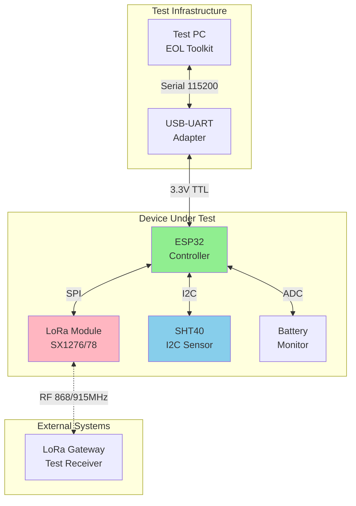

---

## Complete Test Sequence

### High-Level Test Flow

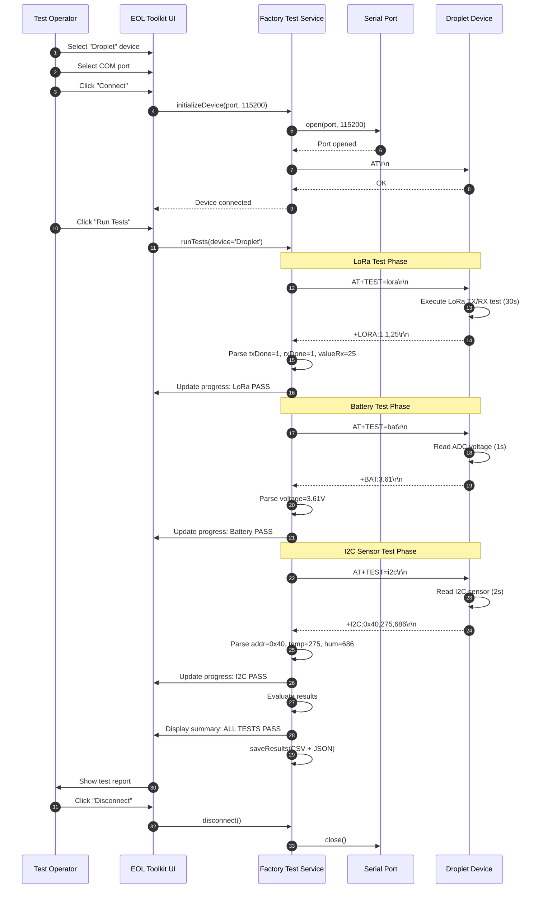

### Test Initialization Sequence

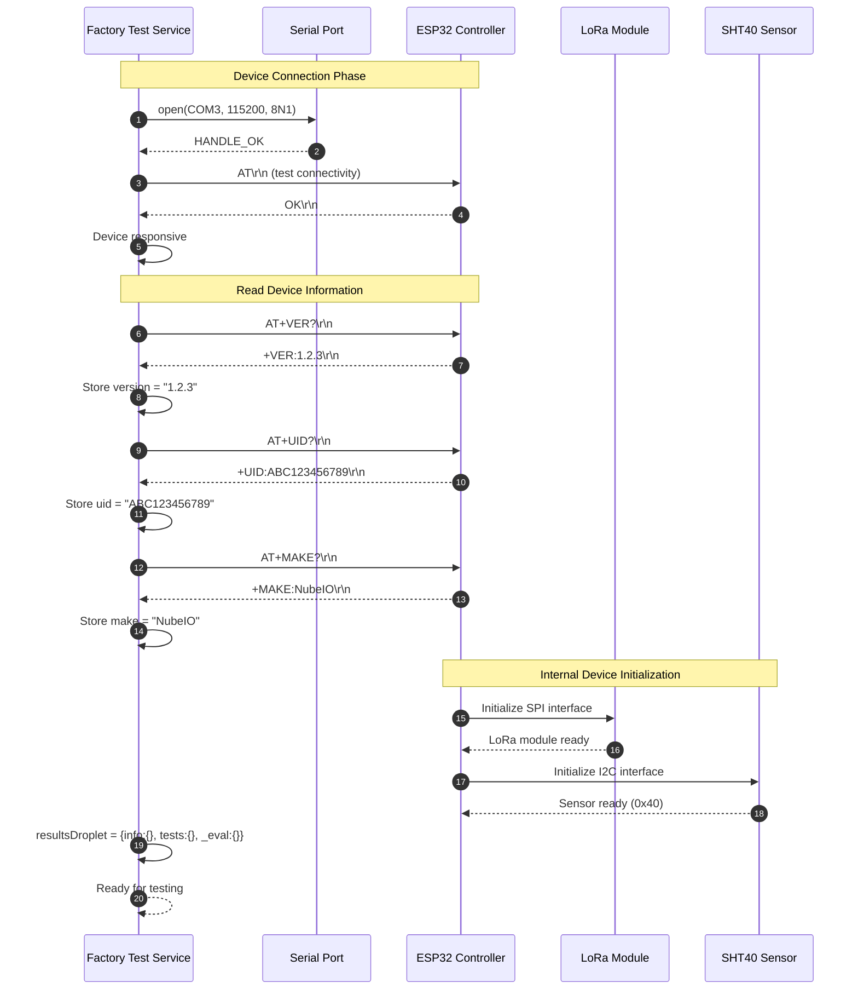

---

## LoRa Test Sequence

### Sequence Diagram: LoRa TX/RX Test

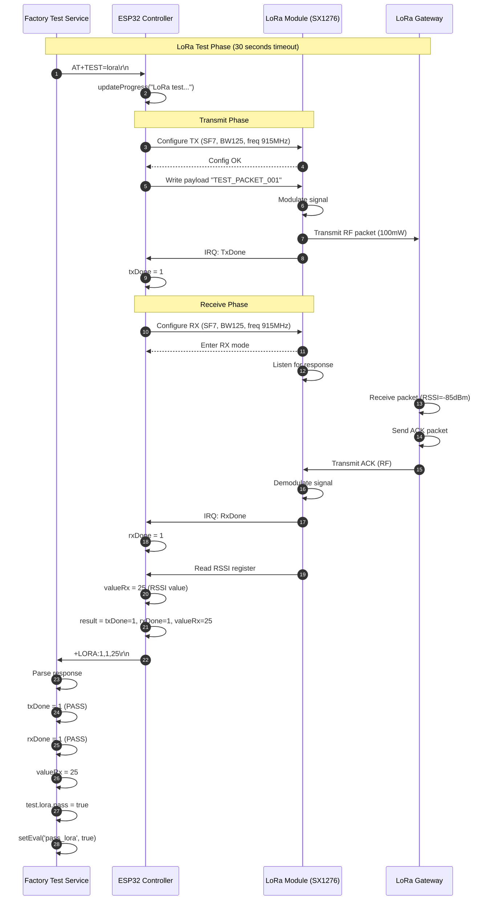

### LoRa Test State Machine

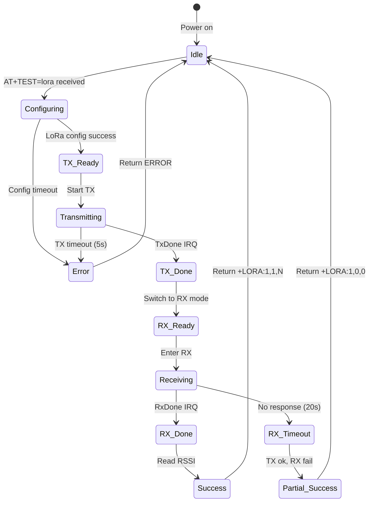

### LoRa Packet Structure

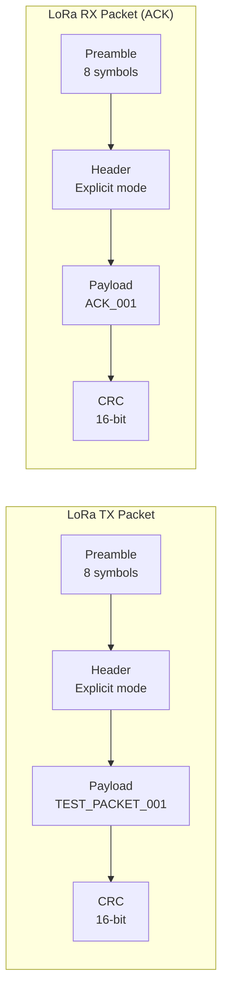

### LoRa Timing Diagram

```
Time (ms): 0────────500───────1000──────1500──────2000──────────────30000
           │          │         │         │         │                 │
AT Command:├──────────┤
           AT+TEST=lora
           
Config:              ├────┤
                     Init LoRa
                     
TX Phase:                  ├─────┤
                           Transmit
                           
TX Done IRQ:                     ├┤
                                 
RX Config:                        ├───┤
                                  Enter RX
                                  
RX Phase:                             ├──────────────────────┤
                                      Wait for response (20s max)
                                      
RX Done IRQ:                                                 ├┤
                                                             
Response:                                                     ├────┤
                                                              +LORA:1,1,25
                                                              
Total Time: ~1-30 seconds (depends on gateway response)
```

---

## Battery Test Sequence

### Sequence Diagram: Battery Voltage Test

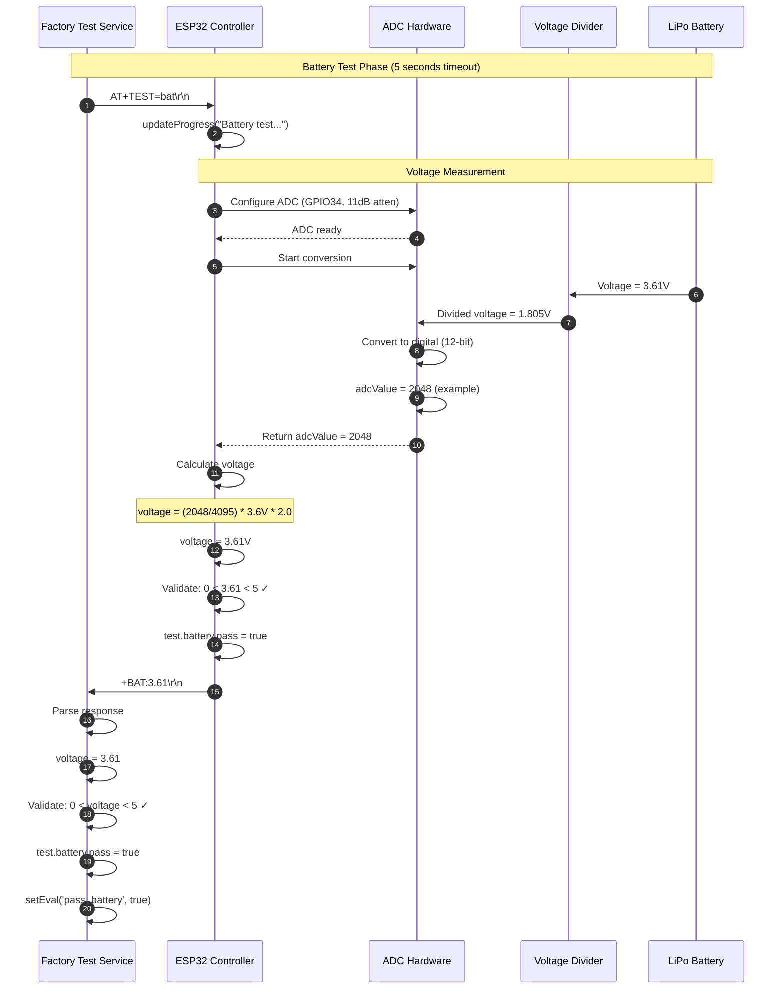

### Battery Test Flowchart

```mermaid
flowchart TD
    Start([AT+TEST=bat received]) --> Init[Configure ADC<br/>GPIO34, 11dB attenuation]
    Init --> Sample[Take 10 ADC samples]
    Sample --> Average[Calculate average]
    Average --> Convert[Convert to voltage<br/>V = ADC/4095 × 3.6V × 2]
    Convert --> Check{0 < V < 5?}
    
    Check -->|Yes| Valid[voltage = V<br/>pass = true]
    Check -->|No| Invalid[voltage = V<br/>pass = false<br/>message = "Invalid voltage"]
    
    Valid --> Range{V range?}
    Range -->|V > 4.1| FullCharge[State: Fully charged]
    Range -->|3.7 < V ≤ 4.1| Good[State: Good]
    Range -->|3.4 < V ≤ 3.7| Fair[State: Fair]
    Range -->|3.0 < V ≤ 3.4| Low[State: Low battery]
    
    FullCharge --> Success[Return +BAT:V]
    Good --> Success
    Fair --> Success
    Low --> Success
    Invalid --> Error[Return +BAT:NOT VALUE]
    
    Success --> End([Test complete])
    Error --> End
    
    style Valid fill:#90EE90
    style Invalid fill:#FFB6C1
```

### ADC Conversion Detail

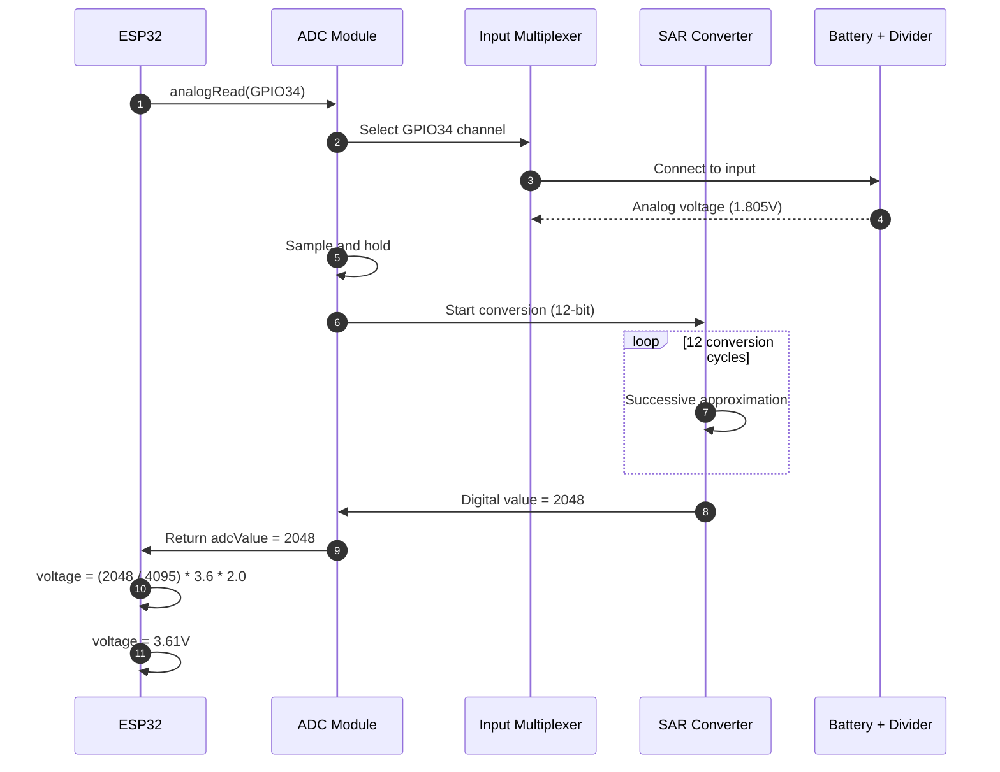

### Battery Voltage Range Diagram

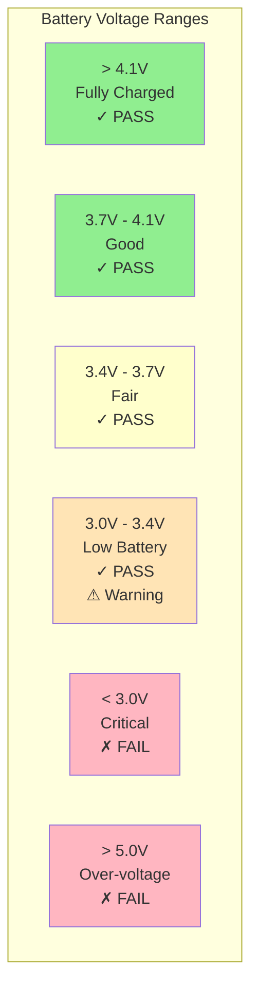

---

## I2C Sensor Test Sequence

### Sequence Diagram: I2C Sensor Test

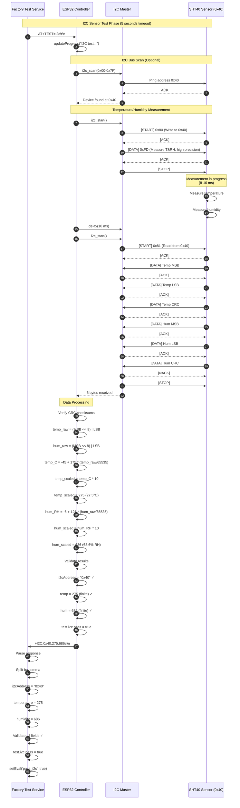

### I2C Protocol Detail

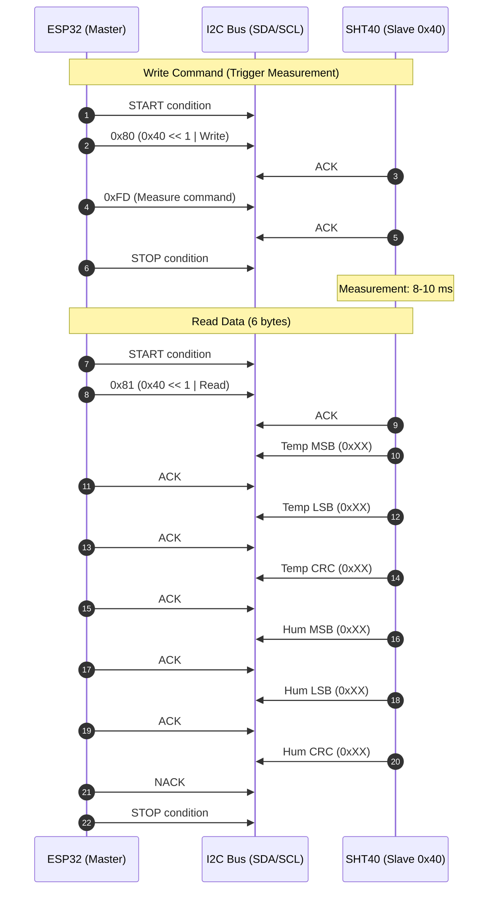

### I2C Test State Machine

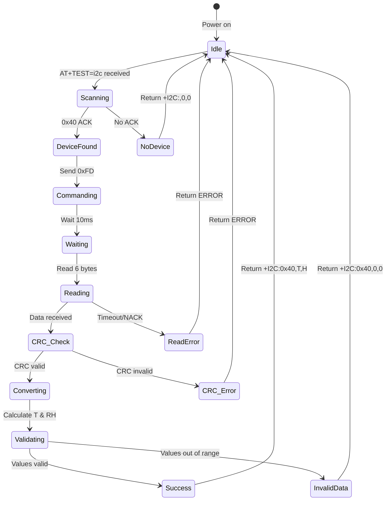

### SHT40 Data Conversion Flowchart

```mermaid
flowchart TD
    Start([Receive 6 bytes<br/>from SHT40]) --> Split[Split data:<br/>Bytes 0-2: Temp<br/>Bytes 3-5: Humidity]
    
    Split --> TempCRC{Verify<br/>Temp CRC?}
    TempCRC -->|Invalid| Error1[CRC error]
    TempCRC -->|Valid| HumCRC{Verify<br/>Hum CRC?}
    
    HumCRC -->|Invalid| Error2[CRC error]
    HumCRC -->|Valid| RawCalc[temp_raw = MSB<<8 | LSB<br/>hum_raw = MSB<<8 | LSB]
    
    RawCalc --> TempConv[temp_C = -45 + 175×raw/65535]
    TempConv --> TempScale[temp_scaled = temp_C × 10]
    TempScale --> TempInt[temp_scaled = int]
    
    TempInt --> HumConv[hum_RH = -6 + 125×raw/65535]
    HumConv --> HumScale[hum_scaled = hum_RH × 10]
    HumScale --> HumInt[hum_scaled = int]
    
    HumInt --> Result[Return: 0x40, temp_scaled, hum_scaled]
    
    Error1 --> ErrorOut[Return: ERROR]
    Error2 --> ErrorOut
    
    Result --> End([Test complete])
    ErrorOut --> End
    
    style Result fill:#90EE90
    style ErrorOut fill:#FFB6C1
```

---

## Error Handling Sequences

### Sequence: LoRa Test Timeout

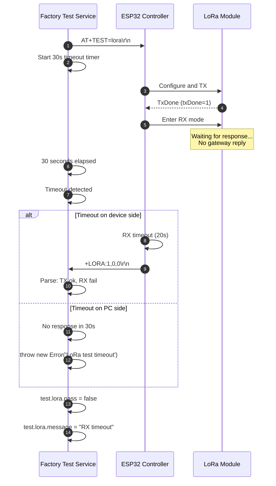

### Sequence: Battery Not Connected

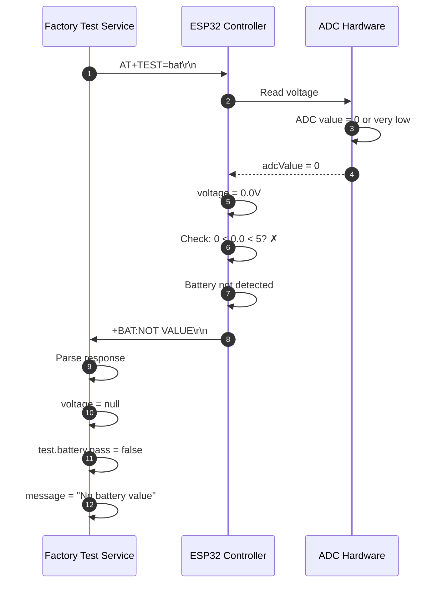

### Sequence: I2C Sensor Not Found

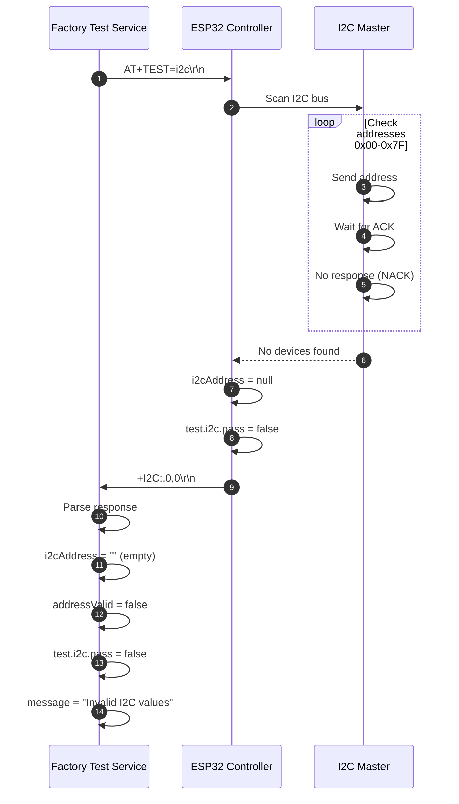

---

## State Diagrams

### Overall Test State Machine

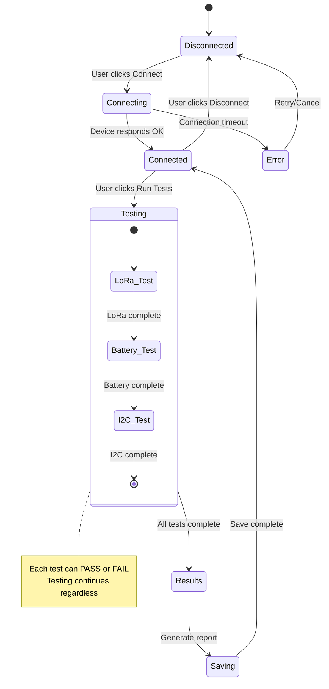

### LoRa Module State Diagram

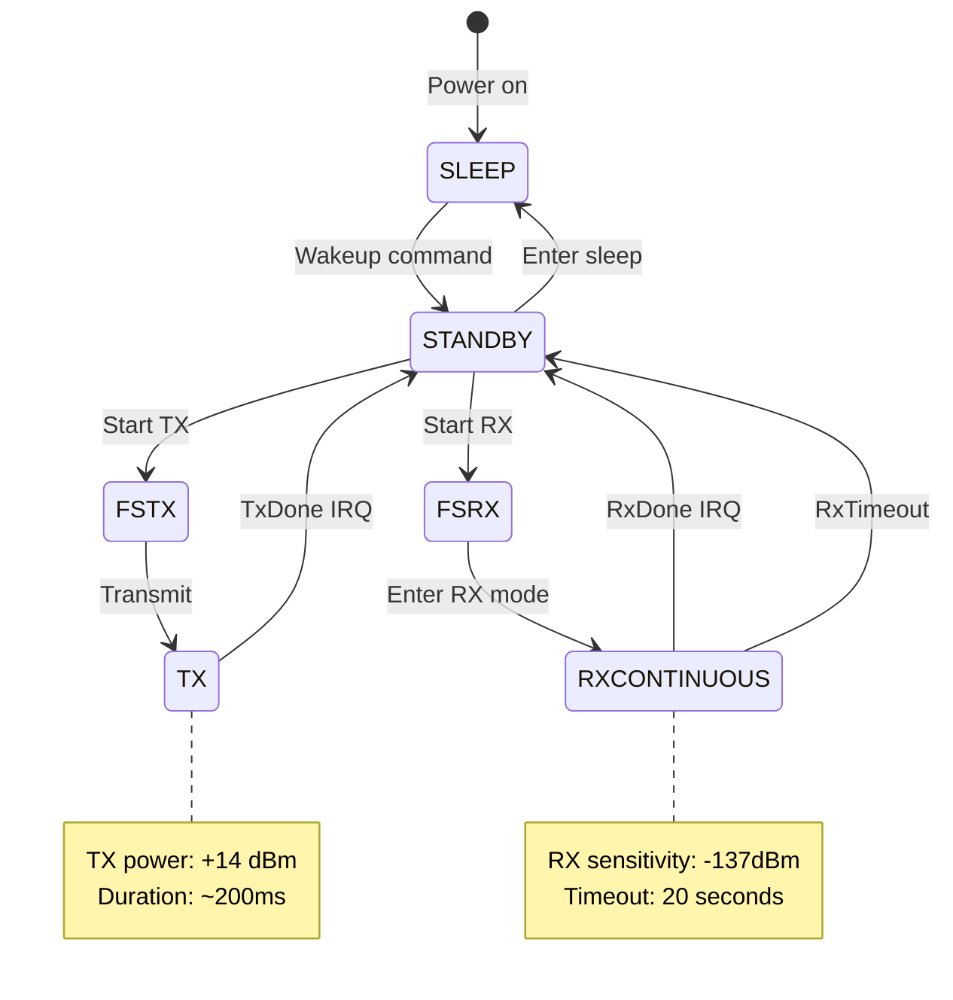

---

## Timing Diagrams

### Complete Test Timing

```
Phase:          Init    LoRa Test      Battery   I2C    Results
                │       │              │         │      │
Time (s):   0───1───────────────────31─────────36────41──43
            │   │       │              │         │      │
Activity:   │   │       │              │         │      │
            │   │       ├─TX (1s)      │         │      │
Connection  │   │       ├─RX wait (30s)│         │      │
established │   │       │              ├─ADC read│      │
            │   │       │              │         ├─I2C  │
            │   Test    │              │         │      Save
            │   start   │              │         │      report
            │           │              │         │      │
            └───────────┴──────────────┴─────────┴──────┘
                        Total: ~43 seconds
```

### LoRa TX/RX Timing Detail

```
Signal      0ms    200ms   500ms   1000ms                20000ms  20200ms
            │      │       │       │                     │        │
TX_EN       ─┐     ┌───────────────┘
            └─────┘

TX_DATA         ████████
               (transmit)

IRQ_TXDONE           ─┐
                      └─

RX_EN                 ─┐                                 ┌─
                       └─────────────────────────────────┘

RX_DATA                           (waiting...)       ████████
                                                    (receive ACK)

IRQ_RXDONE                                               ─┐
                                                          └─

Legend:
─ : Signal low
┐/┘: Transitions
████: Active data
```

### I2C Communication Timing

```
Signal      0µs   10µs  20µs  30µs  40µs  50µs  60µs  70µs  80µs  90µs
            │     │     │     │     │     │     │     │     │     │
SCL         ─┐┌─┐┌─┐┌─┐┌─┐┌─┐┌─┐┌─┐┌─┐┌─┐┌─┐┌─┐┌─┐┌─┐┌─┐┌─┐┌─┐┌─┐┌─
            └┘ └┘ └┘ └┘ └┘ └┘ └┘ └┘ └┘ └┘ └┘ └┘ └┘ └┘ └┘ └┘ └┘ └┘

SDA         ─┐ 1 0 0 0 0 0 0 0│A│ 1 1 1 1 1 1 0 1│A│
            └──────────────────┘  └────────────────┘
             [START] 0x80         0xFD (cmd)  [ACK]

Timing:
- SCL frequency: 100 kHz (10µs period)
- SDA setup time: 250 ns (min)
- SDA hold time: 0 ns (min)
- START/STOP setup time: 4.7µs (min)
```

---

## Conclusion

This document provides comprehensive sequence diagrams for all phases of Droplet factory testing. Each test follows a well-defined message flow with clear success and failure paths. The timing diagrams ensure predictable test execution within the specified timeouts.

### Key Takeaways

✓ **LoRa Test:** 30-second timeout, validates TX and RX independently  
✓ **Battery Test:** 5-second timeout, validates 0-5V range  
✓ **I2C Test:** 5-second timeout, validates sensor communication and data  
✓ **Error Handling:** All failure modes are handled gracefully  
✓ **Total Time:** ~40-45 seconds for complete test sequence

---

**End of Droplet Sequence Diagrams**
