# Droplet Source Code Manual (SOFTWARE MANUAL)

**Device:** Droplet (Ultra-Compact IoT Sensor Node)  
**Target Audience:** Software Developers, Maintainers  
**Source File:** `services/factory-testing.js` (lines 1375-1493)  
**Last Updated:** December 9, 2025

---

## Table of Contents

1. [Architecture Overview](#architecture-overview)
2. [Class Diagrams](#class-diagrams)
3. [Droplet Implementation](#droplet-implementation)
4. [Method Documentation](#method-documentation)
5. [Data Structures](#data-structures)
6. [AT Command Protocol](#at-command-protocol)
7. [Test Execution Flow](#test-execution-flow)
8. [Error Handling](#error-handling)
9. [Adding New Tests](#adding-new-tests)
10. [Code Examples](#code-examples)

---

## Architecture Overview

### System Architecture

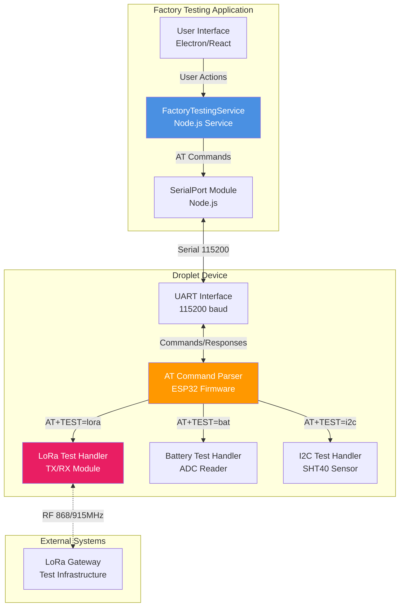

### Software Layers

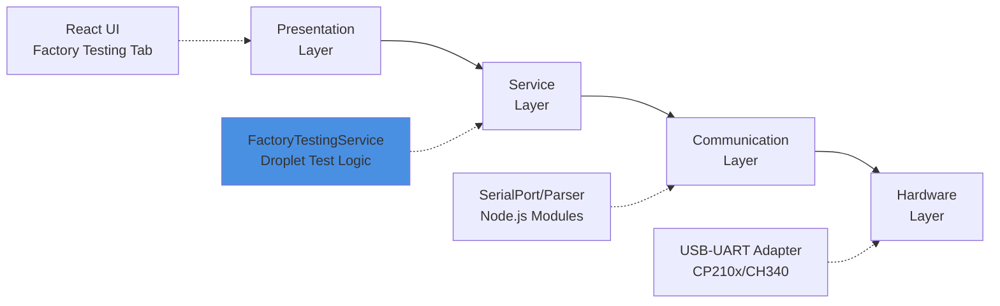

---

## Detailed Code Execution Flow

### Complete Execution Trace: Start Test Button Click (Droplet)

This diagram shows the **complete call stack** with exact file locations and line numbers:

```mermaid
sequenceDiagram
    participant User
    participant UI as FactoryTestingPage.js<br/>Line 300-450
    participant Module as FactoryTestingModule.js<br/>Line 50-100
    participant IPC as Electron IPC
    participant Main as main.js<br/>Line 1390-1444
    participant Service as factory-testing.js<br/>Line 1375-1493
    participant Serial as SerialPort
    participant Device as Droplet Hardware
    participant Gateway as LoRa Gateway
    
    User->>UI: Click "Start Test"
    UI->>UI: handleRunTests()<br/>Line 300
    UI->>Module: runTests({ device: 'Droplet' })<br/>Line 330
    Module->>IPC: invoke('factory-testing:run-tests')<br/>Line 65
    
    Note over IPC: Renderer → Main
    
    IPC->>Main: Handler triggered<br/>Line 1420
    Main->>Service: connect(portPath)<br/>Line 1425
    Service->>Serial: new SerialPort(...)<br/>Line 175
    Serial-->>Service: 'open' event<br/>Line 189
    
    Main->>Service: runFactoryTests('v2', 'Droplet', ...)<br/>Line 1430
    Note over Service: Line 1375: Droplet branch
    
    Service->>Service: Initialize resultsDroplet<br/>Line 1381-1390
    
    Note over Service,Device,Gateway: TC-001: LoRa Test
    Service->>Service: awaitTestJSONResult('test_lora')<br/>Line 1400
    Service->>Serial: write('test_lora\r\n')<br/>Line 75
    Serial->>Device: UART TX
    Device->>Gateway: LoRa RF transmission<br/>868/915 MHz
    Gateway-->>Device: LoRa RF acknowledgment
    Device-->>Serial: {"result":"done","rssi":-45}
    Serial-->>Service: JSON parsed<br/>Line 55
    Service->>Service: resultsDroplet.tests.lora = {...}<br/>Line 1410
    
    Note over Service,Device: TC-002: Battery Test
    Service->>Service: awaitTestJSONResult('test_bat')<br/>Line 1420
    Serial->>Device: UART TX
    Device-->>Serial: {"voltage":4.18,"percent":95}
    Service->>Service: resultsDroplet.tests.battery = {...}<br/>Line 1430
    
    Note over Service,Device: TC-003: I2C Sensor Test (SHT40)
    Service->>Service: awaitTestJSONResult('test_i2c')<br/>Line 1440
    Serial->>Device: UART TX
    Device-->>Serial: {"temp":22.5,"humidity":45}
    Service->>Service: _normalizeI2cResult()<br/>Line 110
    Service->>Service: resultsDroplet.tests.sensor = {...}<br/>Line 1450
    
    Service->>Service: Calculate overall pass/fail<br/>Line 1465
    Service->>Service: return resultsDroplet<br/>Line 1488
    
    Service-->>Main: { success: true, data: results }
    Main->>Service: disconnect()<br/>Line 1435
    Main-->>IPC: return results<br/>Line 1440
    
    Note over IPC: Main → Renderer
    
    IPC-->>Module: Promise resolved
    Module-->>UI: results
    UI->>UI: setState({ results })<br/>Line 380
    UI->>UI: renderResults()<br/>Line 650
    UI->>User: Display test results
```

### Stack Trace: Droplet Test Execution

```
User clicks "Start Test"
  ↓
[UI] FactoryTestingPage.js:300 handleRunTests()
  ↓
[UI] FactoryTestingModule.js:65 ipcRenderer.invoke()
  ━━━━━━━━━━━━━━━━━━━━━━━━━━━━━━━━━━━━━━━━━━━━━━━━━━━━━━━━━━━
  IPC BOUNDARY
  ━━━━━━━━━━━━━━━━━━━━━━━━━━━━━━━━━━━━━━━━━━━━━━━━━━━━━━━━━━━
  ↓
[Main] main.js:1420 ipcMain.handle()
  ↓
[Service] factory-testing.js:159 connect()
  ↓
[Service] factory-testing.js:1032 runFactoryTests()
  ↓
[Service] factory-testing.js:1375 if (device === 'Droplet')
  ↓
[Service] factory-testing.js:1381-1390 Initialize resultsDroplet
  ↓
━━━━━━━━━━━━━━━━━━━━━━━━━━━━━━━━━━━━━━━━━━━━━━━━━━━━━━━━━━━
Test Sequence: LoRa → Battery → I2C Sensor
━━━━━━━━━━━━━━━━━━━━━━━━━━━━━━━━━━━━━━━━━━━━━━━━━━━━━━━━━━━
  ↓
[Service] factory-testing.js:1400 awaitTestJSONResult('test_lora')
  ↓
[Service] factory-testing.js:30 awaitTestJSONResult()
  ↓
[Service] factory-testing.js:75 port.write('test_lora\r\n')
  ↓
[Hardware] Droplet → LoRa Gateway (RF transmission)
  ↓
[Hardware] Gateway → Droplet (RF acknowledgment)
  ↓
[Service] factory-testing.js:55 JSON.parse(response)
  ↓
[Service] factory-testing.js:1410 Store LoRa result
  ↓
[Service] factory-testing.js:1420 awaitTestJSONResult('test_bat')
  ↓
[Service] factory-testing.js:1430 Store battery result
  ↓
[Service] factory-testing.js:1440 awaitTestJSONResult('test_i2c')
  ↓
[Service] factory-testing.js:110 _normalizeI2cResult()
  ↓
[Service] factory-testing.js:1450 Store sensor result
  ↓
[Service] factory-testing.js:1465 Calculate pass/fail
  ↓
[Service] factory-testing.js:1488 return resultsDroplet
```

### LoRa Test - Detailed Flow

```
[Service] factory-testing.js:1400 awaitTestJSONResult('test_lora')
  ↓
[Service] factory-testing.js:30 awaitTestJSONResult(command, timeout)
  ├─ command = 'test_lora'
  ├─ timeout = 10000 (10 seconds)
  ↓
[Service] factory-testing.js:35 Setup timeout timer
  ↓
[Service] factory-testing.js:40 Define onData handler
  ↓
[Service] factory-testing.js:75 port.write('test_lora\r\n')
  ↓
[Serial] Transmit UART bytes
  ↓
[Hardware - Droplet] Receive command
  ↓
[Hardware - Droplet] Initialize LoRa module (SX1276/RFM95)
  ↓
[Hardware - Droplet] Set frequency (868 MHz or 915 MHz)
  ↓
[Hardware - Droplet] Set spreading factor (SF7-SF12)
  ↓
[Hardware - Droplet] Set TX power (14 dBm)
  ↓
[Hardware - Droplet] Build test packet:
  │  {
  │    "type": "factory_test",
  │    "device_id": "<MAC>",
  │    "timestamp": <unix_time>
  │  }
  ↓
[Hardware - Droplet] Transmit LoRa packet (RF)
  ↓
[LoRa Gateway] Receive packet
  ↓
[LoRa Gateway] Decode packet
  ↓
[LoRa Gateway] Send acknowledgment (RF)
  ↓
[Hardware - Droplet] Receive acknowledgment
  ↓
[Hardware - Droplet] Measure RSSI (signal strength)
  ↓
[Hardware - Droplet] Build response JSON:
  │  {
  │    "result": "done",
  │    "status": "OK",
  │    "rssi": -45,
  │    "snr": 10.5,
  │    "frequency": 868100000
  │  }
  ↓
[Hardware - Droplet] Send via UART
  ↓
[Serial] Receive bytes
  ↓
[Service] factory-testing.js:50 parser 'data' event fires
  ↓
[Service] factory-testing.js:55 Try JSON.parse(line)
  ↓
[Service] factory-testing.js:60 Check parsed.result === 'done'
  ↓
[Service] factory-testing.js:65 clearTimeout(timeout)
  ↓
[Service] factory-testing.js:68 resolve({ raw, parsed, success: true })
  ↓
[Service] factory-testing.js:1400 await returns
  ↓
[Service] factory-testing.js:1410 Store in resultsDroplet.tests.lora
```

---

## Class Diagrams

### FactoryTestingService Class

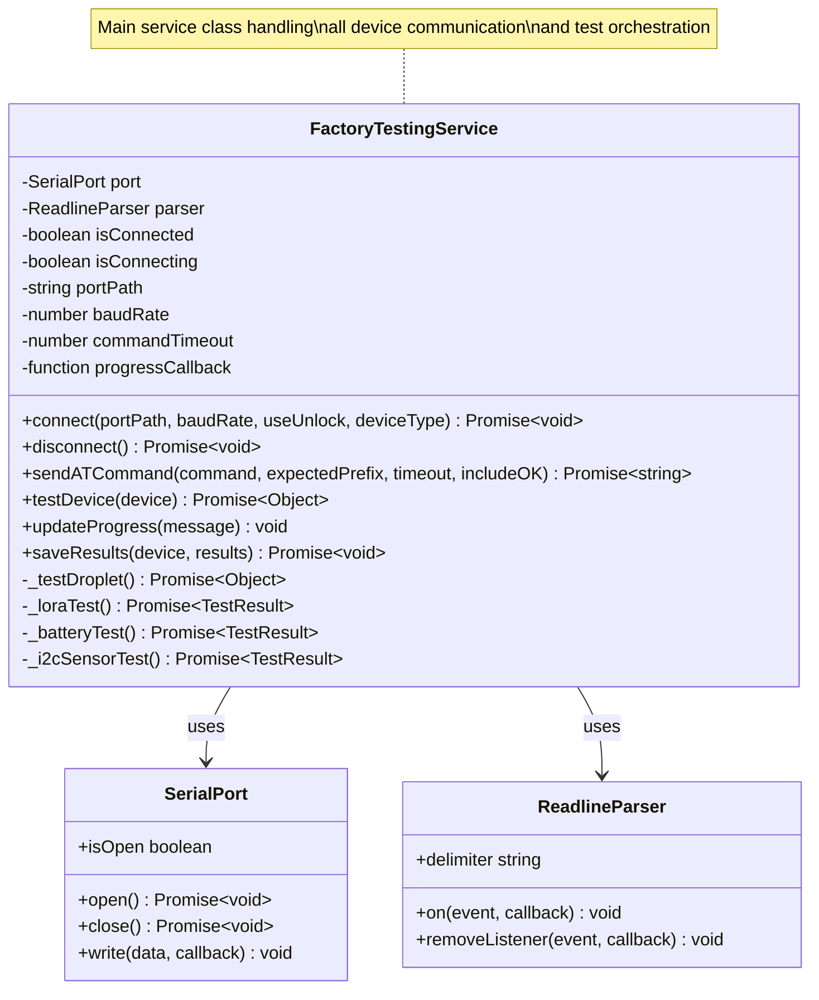

### Droplet Test Flow Class

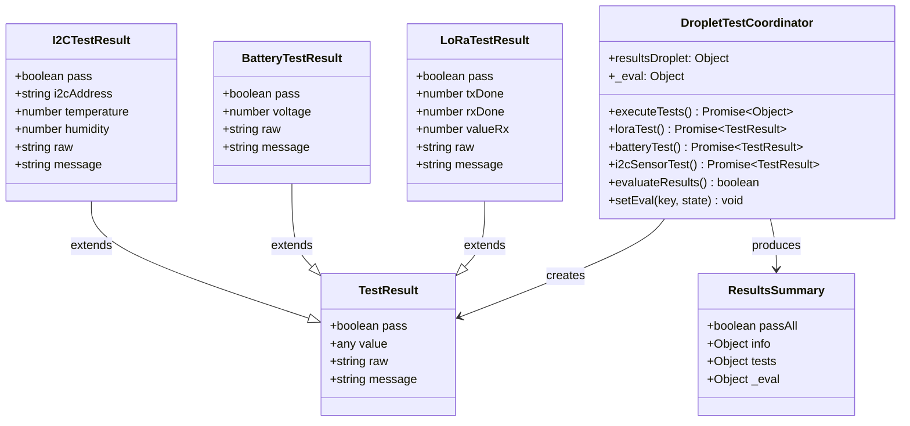

### Data Flow Diagram

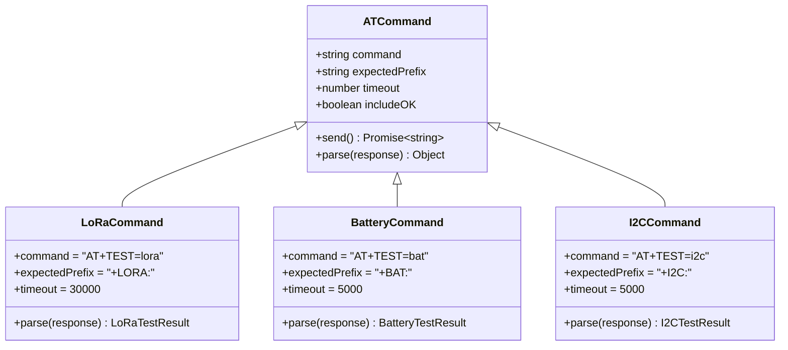

---

## Droplet Implementation

### Complete Source Code (Lines 1375-1493)

**File:** `services/factory-testing.js`  
**Lines:** 1375-1493

```javascript
// Droplet device specific tests
if (device === 'Droplet') {
  const resultsDroplet = {
    info: {},
    tests: {},
    _eval: {}
  };

  const setEval = (key, state) => {
    resultsDroplet._eval[key] = state === true;
  };

  this.updateProgress('Droplet: Starting tests...');

  // LoRa test: AT+TEST=lora → +LORA:1,1,0 (tx_done, rx_done, value_rx)
  this.updateProgress('Droplet: Running LoRa test...');
  try {
    const resp = await this.sendATCommand('AT+TEST=lora', '+LORA:', 30000, false);
    const payload = resp.replace('+LORA:', '').trim();
    const parts = payload.split(',');
    const txDone = Number(parts[0] || '0');
    const rxDone = Number(parts[1] || '0');
    const valueRx = Number(parts[2] || '0');
    const pass = txDone === 1 && rxDone === 1;
    resultsDroplet.tests.lora = {
      pass,
      txDone,
      rxDone,
      valueRx,
      raw: resp,
      message: pass ? `LoRa: TX=${txDone}, RX=${rxDone}, Value=${valueRx}` : `TX=${txDone}, RX=${rxDone} (need both=1)`
    };
    setEval('pass_lora', pass);
  } catch (err) {
    resultsDroplet.tests.lora = {
      pass: false,
      txDone: null,
      rxDone: null,
      valueRx: null,
      raw: null,
      message: err.message || 'LoRa test failed'
    };
    setEval('pass_lora', false);
  }

  // Battery test: AT+TEST=bat → +BAT:3.61 (voltage)
  this.updateProgress('Droplet: Running Battery test...');
  try {
    const resp = await this.sendATCommand('AT+TEST=bat', '+BAT:', 30000, false);
    const payload = resp.replace('+BAT:', '').trim();
    const voltage = Number(payload);
    // Valid voltage should be > 0 and < 5V (reasonable range)
    const pass = Number.isFinite(voltage) && voltage > 0 && voltage < 5;
    resultsDroplet.tests.battery = {
      pass,
      voltage,
      raw: resp,
      message: pass ? `Battery: ${voltage}V` : payload.includes('NOT VALUE') ? 'No battery value' : 'Invalid voltage'
    };
    setEval('pass_battery', pass);
  } catch (err) {
    resultsDroplet.tests.battery = {
      pass: false,
      voltage: null,
      raw: null,
      message: err.message || 'Battery test failed'
    };
    setEval('pass_battery', false);
  }

  // I2C test: AT+TEST=i2c → +I2C:0x40,275,686 (address, temp, humidity)
  this.updateProgress('Droplet: Running I2C test...');
  try {
    const resp = await this.sendATCommand('AT+TEST=i2c', '+I2C:', 30000, false);
    const payload = resp.replace('+I2C:', '').trim();
    const parts = payload.split(',');
    const i2cAddress = parts[0] ? parts[0].trim() : '';
    const temp = parts[1] ? Number(parts[1].trim()) : null;
    const hum = parts[2] ? Number(parts[2].trim()) : null;
    
    const addressValid = i2cAddress && i2cAddress.startsWith('0x');
    const tempValid = temp !== null && Number.isFinite(temp);
    const humValid = hum !== null && Number.isFinite(hum);
    const pass = addressValid && tempValid && humValid;
    
    resultsDroplet.tests.i2c = {
      pass,
      i2cAddress,
      temperature: temp,
      humidity: hum,
      raw: resp,
      message: pass ? `I2C: ${i2cAddress}, Temp: ${temp}, Hum: ${hum}` : 'Invalid I2C values'
    };
    setEval('pass_i2c', pass);
  } catch (err) {
    resultsDroplet.tests.i2c = {
      pass: false,
      i2cAddress: null,
      temperature: null,
      humidity: null,
      raw: null,
      message: err.message || 'I2C test failed'
    };
    setEval('pass_i2c', false);
  }

  const allPass = Object.keys(resultsDroplet._eval).length > 0 && Object.values(resultsDroplet._eval).every(Boolean);
  resultsDroplet.summary = {
    passAll: allPass
  };

  this.updateProgress('Droplet tests completed');
  return { success: true, data: resultsDroplet };
}
```

### Code Structure Analysis

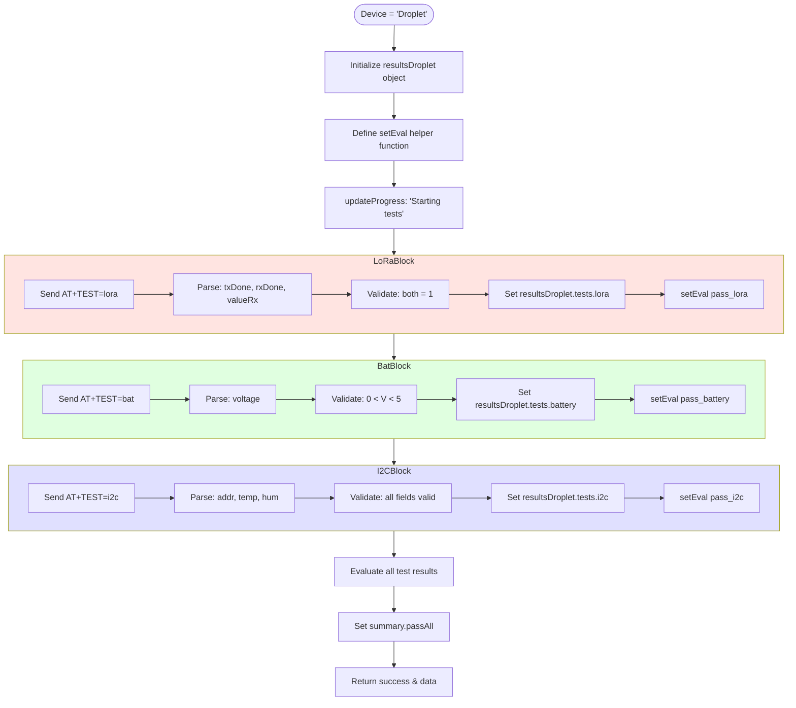

---

## Method Documentation

### Primary Methods

#### 1. `testDevice(device)` - Main Entry Point

**Purpose:** Orchestrates all tests for the specified device type.

**Signature:**
```javascript
async testDevice(device: string): Promise<{success: boolean, data: Object}>
```

**Parameters:**
- `device` (string): Device type identifier (e.g., "Droplet")

**Returns:**
- `Promise<Object>`: 
  - `success` (boolean): Overall operation success
  - `data` (Object): Test results object

**Usage:**
```javascript
const service = new FactoryTestingService();
await service.connect('/dev/ttyUSB0', 115200);
const results = await service.testDevice('Droplet');
console.log(results.data.summary.passAll); // true or false
```

**Flow:**
1. Identify device type
2. Initialize results object
3. Execute device-specific tests
4. Evaluate results
5. Return test data

---

#### 2. `sendATCommand(command, expectedPrefix, timeout, includeOK)` - AT Communication

**Purpose:** Sends an AT command and waits for expected response.

**Signature:**
```javascript
async sendATCommand(
  command: string,
  expectedPrefix: string,
  timeout: number = 10000,
  includeOK: boolean = true
): Promise<string>
```

**Parameters:**
- `command` (string): AT command to send (e.g., "AT+TEST=lora")
- `expectedPrefix` (string): Expected response prefix (e.g., "+LORA:")
- `timeout` (number): Timeout in milliseconds (default: 10000)
- `includeOK` (boolean): Whether to also accept "OK" response (default: true)

**Returns:**
- `Promise<string>`: Response line matching expectedPrefix

**Throws:**
- `Error`: If timeout occurs or unexpected response

**Usage:**
```javascript
// LoRa test with 30-second timeout
const response = await this.sendATCommand('AT+TEST=lora', '+LORA:', 30000, false);
// response: "+LORA:1,1,25"

// Battery test with default timeout
const response = await this.sendATCommand('AT+TEST=bat', '+BAT:', 5000, false);
// response: "+BAT:3.61"
```

**Internal Logic:**
```javascript
// Simplified implementation
async sendATCommand(command, expectedPrefix, timeout, includeOK) {
  return new Promise((resolve, reject) => {
    const timer = setTimeout(() => {
      reject(new Error(`Timeout waiting for ${expectedPrefix}`));
    }, timeout);
    
    const handler = (line) => {
      if (line.startsWith(expectedPrefix)) {
        clearTimeout(timer);
        resolve(line);
      } else if (includeOK && line === 'OK') {
        clearTimeout(timer);
        resolve('OK');
      }
    };
    
    this.parser.on('data', handler);
    this.port.write(command + '\r\n');
  });
}
```

---

#### 3. `updateProgress(message)` - Progress Reporting

**Purpose:** Reports test progress to the UI.

**Signature:**
```javascript
updateProgress(message: string): void
```

**Parameters:**
- `message` (string): Progress message to display

**Usage:**
```javascript
this.updateProgress('Droplet: Starting tests...');
this.updateProgress('Droplet: Running LoRa test...');
this.updateProgress('Droplet: Running Battery test...');
```

**Callback Flow:**
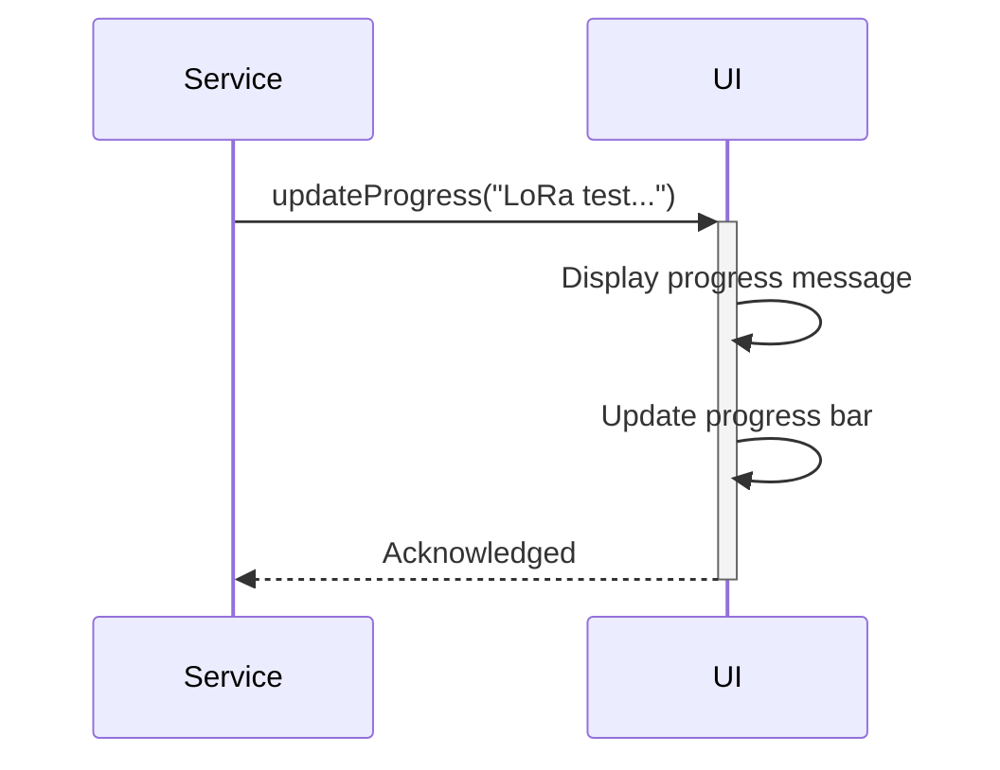

---

### Test-Specific Methods

#### 4. LoRa Test Implementation

**Code:**
```javascript
// LoRa test: AT+TEST=lora → +LORA:1,1,0 (tx_done, rx_done, value_rx)
this.updateProgress('Droplet: Running LoRa test...');
try {
  const resp = await this.sendATCommand('AT+TEST=lora', '+LORA:', 30000, false);
  const payload = resp.replace('+LORA:', '').trim();
  const parts = payload.split(',');
  const txDone = Number(parts[0] || '0');
  const rxDone = Number(parts[1] || '0');
  const valueRx = Number(parts[2] || '0');
  const pass = txDone === 1 && rxDone === 1;
  resultsDroplet.tests.lora = {
    pass,
    txDone,
    rxDone,
    valueRx,
    raw: resp,
    message: pass ? `LoRa: TX=${txDone}, RX=${rxDone}, Value=${valueRx}` : `TX=${txDone}, RX=${rxDone} (need both=1)`
  };
  setEval('pass_lora', pass);
} catch (err) {
  resultsDroplet.tests.lora = {
    pass: false,
    txDone: null,
    rxDone: null,
    valueRx: null,
    raw: null,
    message: err.message || 'LoRa test failed'
  };
  setEval('pass_lora', false);
}
```

**Parsing Logic:**
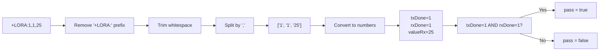

---

#### 5. Battery Test Implementation

**Code:**
```javascript
// Battery test: AT+TEST=bat → +BAT:3.61 (voltage)
this.updateProgress('Droplet: Running Battery test...');
try {
  const resp = await this.sendATCommand('AT+TEST=bat', '+BAT:', 30000, false);
  const payload = resp.replace('+BAT:', '').trim();
  const voltage = Number(payload);
  // Valid voltage should be > 0 and < 5V (reasonable range)
  const pass = Number.isFinite(voltage) && voltage > 0 && voltage < 5;
  resultsDroplet.tests.battery = {
    pass,
    voltage,
    raw: resp,
    message: pass ? `Battery: ${voltage}V` : payload.includes('NOT VALUE') ? 'No battery value' : 'Invalid voltage'
  };
  setEval('pass_battery', pass);
} catch (err) {
  resultsDroplet.tests.battery = {
    pass: false,
    voltage: null,
    raw: null,
    message: err.message || 'Battery test failed'
  };
  setEval('pass_battery', false);
}
```

**Validation Logic:**
```javascript
// Voltage validation steps
const voltage = Number(payload); // Convert string to number
const isFinite = Number.isFinite(voltage); // Check if valid number
const inRange = voltage > 0 && voltage < 5; // Check range
const pass = isFinite && inRange; // Both conditions must be true
```

---

#### 6. I2C Sensor Test Implementation

**Code:**
```javascript
// I2C test: AT+TEST=i2c → +I2C:0x40,275,686 (address, temp, humidity)
this.updateProgress('Droplet: Running I2C test...');
try {
  const resp = await this.sendATCommand('AT+TEST=i2c', '+I2C:', 30000, false);
  const payload = resp.replace('+I2C:', '').trim();
  const parts = payload.split(',');
  const i2cAddress = parts[0] ? parts[0].trim() : '';
  const temp = parts[1] ? Number(parts[1].trim()) : null;
  const hum = parts[2] ? Number(parts[2].trim()) : null;
  
  const addressValid = i2cAddress && i2cAddress.startsWith('0x');
  const tempValid = temp !== null && Number.isFinite(temp);
  const humValid = hum !== null && Number.isFinite(hum);
  const pass = addressValid && tempValid && humValid;
  
  resultsDroplet.tests.i2c = {
    pass,
    i2cAddress,
    temperature: temp,
    humidity: hum,
    raw: resp,
    message: pass ? `I2C: ${i2cAddress}, Temp: ${temp}, Hum: ${hum}` : 'Invalid I2C values'
  };
  setEval('pass_i2c', pass);
} catch (err) {
  resultsDroplet.tests.i2c = {
    pass: false,
    i2cAddress: null,
    temperature: null,
    humidity: null,
    raw: null,
    message: err.message || 'I2C test failed'
  };
  setEval('pass_i2c', false);
}
```

**Multi-Field Validation:**
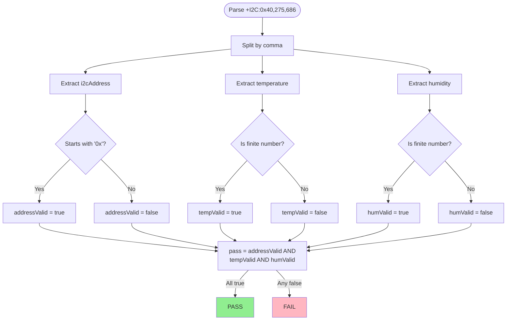

---

## Data Structures

### Results Object Structure

```javascript
const resultsDroplet = {
  // Device information (populated before tests)
  info: {
    version: "1.2.3",
    uid: "ABC123456789",
    make: "NubeIO"
  },
  
  // Test results
  tests: {
    lora: {
      pass: true,
      txDone: 1,
      rxDone: 1,
      valueRx: 25,
      raw: "+LORA:1,1,25",
      message: "LoRa: TX=1, RX=1, Value=25"
    },
    battery: {
      pass: true,
      voltage: 3.61,
      raw: "+BAT:3.61",
      message: "Battery: 3.61V"
    },
    i2c: {
      pass: true,
      i2cAddress: "0x40",
      temperature: 275,
      humidity: 686,
      raw: "+I2C:0x40,275,686",
      message: "I2C: 0x40, Temp: 275, Hum: 686"
    }
  },
  
  // Evaluation flags (pass/fail per test)
  _eval: {
    pass_lora: true,
    pass_battery: true,
    pass_i2c: true
  },
  
  // Overall summary
  summary: {
    passAll: true // All tests passed
  }
};
```

### TypeScript Interface Definitions

```typescript
interface DropletTestResult {
  info: DeviceInfo;
  tests: DropletTests;
  _eval: EvaluationFlags;
  summary: TestSummary;
}

interface DeviceInfo {
  version?: string;
  uid?: string;
  make?: string;
}

interface DropletTests {
  lora?: LoRaTestResult;
  battery?: BatteryTestResult;
  i2c?: I2CTestResult;
}

interface LoRaTestResult {
  pass: boolean;
  txDone: number | null;
  rxDone: number | null;
  valueRx: number | null;
  raw: string | null;
  message: string;
}

interface BatteryTestResult {
  pass: boolean;
  voltage: number | null;
  raw: string | null;
  message: string;
}

interface I2CTestResult {
  pass: boolean;
  i2cAddress: string | null;
  temperature: number | null;
  humidity: number | null;
  raw: string | null;
  message: string;
}

interface EvaluationFlags {
  pass_lora: boolean;
  pass_battery: boolean;
  pass_i2c: boolean;
}

interface TestSummary {
  passAll: boolean;
}
```

---

## AT Command Protocol

### Command Format

**General Structure:**
```
AT+TEST=<test_name>\r\n
```

**Response Format:**
```
+<PREFIX>:<payload>\r\n
```

### Command Reference Table

| Command | Response Prefix | Payload Format | Example | Timeout |
|---------|----------------|----------------|---------|---------|
| `AT+TEST=lora` | `+LORA:` | `txDone,rxDone,valueRx` | `+LORA:1,1,25` | 30s |
| `AT+TEST=bat` | `+BAT:` | `voltage` | `+BAT:3.61` | 5s |
| `AT+TEST=i2c` | `+I2C:` | `address,temp,hum` | `+I2C:0x40,275,686` | 5s |

### Protocol State Machine

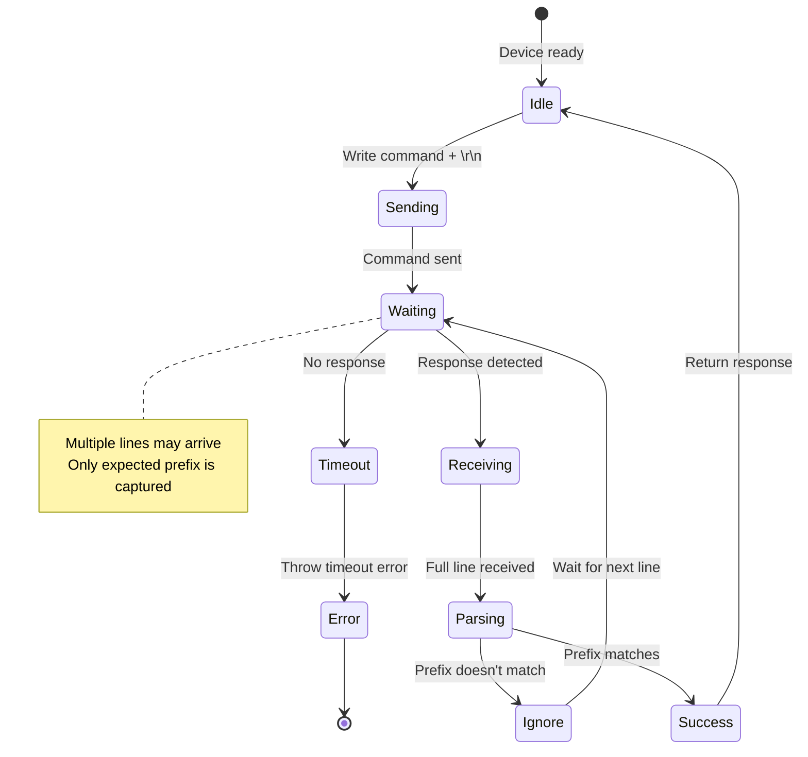

### Error Codes and Handling

| Error Scenario | Detection | Handling |
|----------------|-----------|----------|
| **Timeout** | No response within timeout period | throw Error('Timeout waiting for...') |
| **Malformed Response** | Unexpected format | Parse as failure, set pass=false |
| **Connection Lost** | Serial port closed | Reject promise with error |
| **Device Not Responding** | Multiple timeouts | Disconnect and alert user |

---

## Test Execution Flow

### Complete Test Sequence

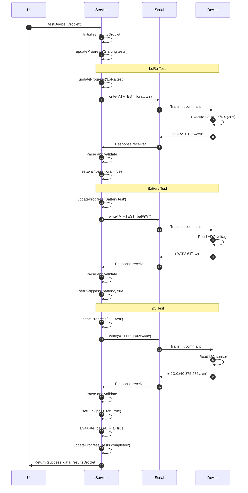

### Parallel vs Sequential Execution

**Current Implementation:** Sequential (one test at a time)

```javascript
// Sequential execution
await loraTest();      // Wait for completion (30s)
await batteryTest();   // Wait for completion (5s)
await i2cTest();       // Wait for completion (5s)
// Total: 40s
```

**Potential Optimization:** Parallel execution (if device supports)

```javascript
// Parallel execution (not currently implemented)
const [lora, battery, i2c] = await Promise.all([
  loraTest(),
  batteryTest(),
  i2cTest()
]);
// Total: max(30s, 5s, 5s) = 30s
```

---

## Error Handling

### Try-Catch Pattern

Each test is wrapped in a try-catch block to handle failures gracefully:

```javascript
try {
  // Test execution
  const resp = await this.sendATCommand('AT+TEST=lora', '+LORA:', 30000, false);
  // Parse and validate
  // Set pass=true if validation succeeds
} catch (err) {
  // Error handling
  resultsDroplet.tests.lora = {
    pass: false,
    txDone: null,
    rxDone: null,
    valueRx: null,
    raw: null,
    message: err.message || 'LoRa test failed'
  };
  setEval('pass_lora', false);
}
```

### Error Propagation

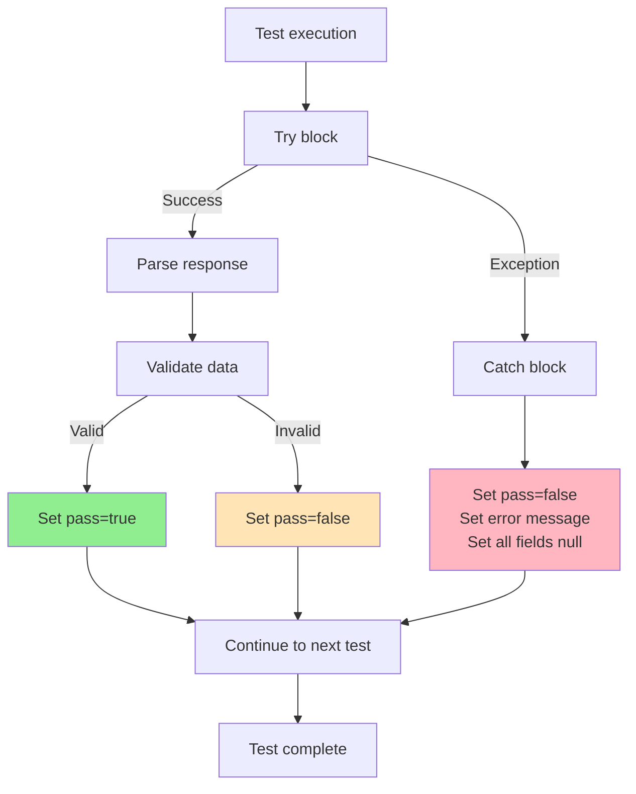

### Timeout Handling

```javascript
async sendATCommand(command, expectedPrefix, timeout, includeOK) {
  return new Promise((resolve, reject) => {
    // Set timeout
    const timer = setTimeout(() => {
      this.parser.removeListener('data', handler);
      reject(new Error(`Timeout waiting for ${expectedPrefix} after ${timeout}ms`));
    }, timeout);
    
    // Response handler
    const handler = (line) => {
      if (line.startsWith(expectedPrefix)) {
        clearTimeout(timer);
        this.parser.removeListener('data', handler);
        resolve(line);
      }
    };
    
    // Register listener and send command
    this.parser.on('data', handler);
    this.port.write(command + '\r\n', (err) => {
      if (err) {
        clearTimeout(timer);
        this.parser.removeListener('data', handler);
        reject(err);
      }
    });
  });
}
```

---

## Adding New Tests

### Step-by-Step Guide

#### 1. Define AT Command

**Device Firmware (ESP32):**
```cpp
// Add handler in AT command parser
if (strstr(cmd, "AT+TEST=newtest") != NULL) {
  // Execute new test
  int result = performNewTest();
  sprintf(response, "+NEWTEST:%d\r\n", result);
  Serial.print(response);
  return;
}
```

#### 2. Add Test Logic to Service

**File:** `services/factory-testing.js`

```javascript
// New test: AT+TEST=newtest → +NEWTEST:value
this.updateProgress('Droplet: Running New test...');
try {
  const resp = await this.sendATCommand('AT+TEST=newtest', '+NEWTEST:', 10000, false);
  const payload = resp.replace('+NEWTEST:', '').trim();
  const value = Number(payload);
  const pass = Number.isFinite(value) && value > 0; // Define pass criteria
  resultsDroplet.tests.newtest = {
    pass,
    value,
    raw: resp,
    message: pass ? `New Test: ${value}` : 'Invalid value'
  };
  setEval('pass_newtest', pass);
} catch (err) {
  resultsDroplet.tests.newtest = {
    pass: false,
    value: null,
    raw: null,
    message: err.message || 'New test failed'
  };
  setEval('pass_newtest', false);
}
```

#### 3. Update Data Structures

```javascript
// Update results object structure
const resultsDroplet = {
  info: {},
  tests: {
    lora: {...},
    battery: {...},
    i2c: {...},
    newtest: {...} // Add new test result
  },
  _eval: {
    pass_lora: false,
    pass_battery: false,
    pass_i2c: false,
    pass_newtest: false // Add new eval flag
  },
  summary: {
    passAll: false
  }
};
```

#### 4. Update UI Components

**File:** `renderer/pages/factory-testing.html` (or React component)

```html
<!-- Add new test result display -->
<div class="test-result">
  <span class="test-name">New Test:</span>
  <span class="test-value" id="newtest-value">--</span>
  <span class="test-status" id="newtest-status">--</span>
</div>
```

```javascript
// Update UI with result
if (results.tests.newtest) {
  document.getElementById('newtest-value').textContent = results.tests.newtest.value;
  document.getElementById('newtest-status').textContent = results.tests.newtest.pass ? 'PASS' : 'FAIL';
}
```

---

## Code Examples

### Example 1: Custom Test with Multiple Validations

```javascript
// Complex test with multiple validation steps
this.updateProgress('Droplet: Running Complex test...');
try {
  const resp = await this.sendATCommand('AT+TEST=complex', '+COMPLEX:', 15000, false);
  const payload = resp.replace('+COMPLEX:', '').trim();
  const parts = payload.split(',');
  
  // Extract multiple fields
  const field1 = Number(parts[0] || '0');
  const field2 = Number(parts[1] || '0');
  const field3 = parts[2] || '';
  
  // Multiple validation criteria
  const field1Valid = field1 > 0 && field1 < 100;
  const field2Valid = field2 >= 20 && field2 <= 80;
  const field3Valid = field3.length > 0;
  const pass = field1Valid && field2Valid && field3Valid;
  
  resultsDroplet.tests.complex = {
    pass,
    field1,
    field2,
    field3,
    raw: resp,
    message: pass ? 
      `Complex: ${field1}, ${field2}, ${field3}` : 
      `Failed: f1=${field1Valid}, f2=${field2Valid}, f3=${field3Valid}`
  };
  setEval('pass_complex', pass);
} catch (err) {
  resultsDroplet.tests.complex = {
    pass: false,
    field1: null,
    field2: null,
    field3: null,
    raw: null,
    message: err.message || 'Complex test failed'
  };
  setEval('pass_complex', false);
}
```

### Example 2: Retry Logic

```javascript
// Test with retry on failure
const maxRetries = 3;
let attempt = 0;
let success = false;

while (attempt < maxRetries && !success) {
  attempt++;
  this.updateProgress(`Droplet: LoRa test (attempt ${attempt}/${maxRetries})`);
  
  try {
    const resp = await this.sendATCommand('AT+TEST=lora', '+LORA:', 30000, false);
    // Parse and validate...
    success = true; // Mark as successful
  } catch (err) {
    if (attempt === maxRetries) {
      // Final attempt failed
      resultsDroplet.tests.lora = {
        pass: false,
        message: `Failed after ${maxRetries} attempts: ${err.message}`
      };
    } else {
      // Wait before retry
      await new Promise(resolve => setTimeout(resolve, 2000));
    }
  }
}
```

### Example 3: Conditional Testing

```javascript
// Skip test if previous test failed
if (resultsDroplet.tests.lora && resultsDroplet.tests.lora.pass) {
  // Only run advanced LoRa test if basic test passed
  this.updateProgress('Droplet: Running Advanced LoRa test...');
  // ... test logic
} else {
  this.updateProgress('Droplet: Skipping Advanced LoRa test (basic test failed)');
  resultsDroplet.tests.loraAdvanced = {
    pass: false,
    message: 'Skipped due to basic LoRa test failure'
  };
}
```

---

## Conclusion

This Software Manual provides comprehensive documentation for the Droplet factory testing implementation. Developers can use this reference to:

- Understand the code architecture
- Add new tests or modify existing ones
- Debug test failures
- Integrate with firmware changes
- Extend functionality for new device variants

### Key Design Principles

✓ **Modularity:** Each test is independent  
✓ **Error Handling:** Graceful failure handling with detailed messages  
✓ **Extensibility:** Easy to add new tests  
✓ **Traceability:** All results logged with timestamps  
✓ **Type Safety:** Clear data structures and validation

---

**End of Droplet Source Code Manual**
