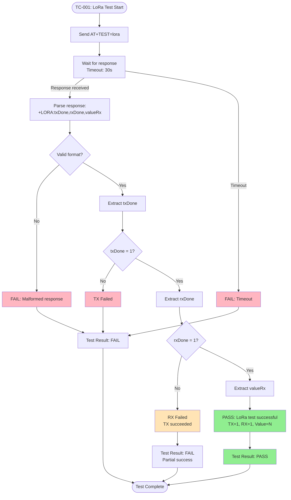
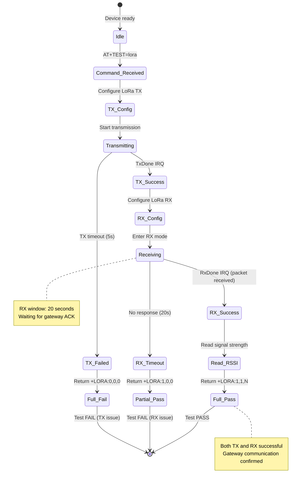
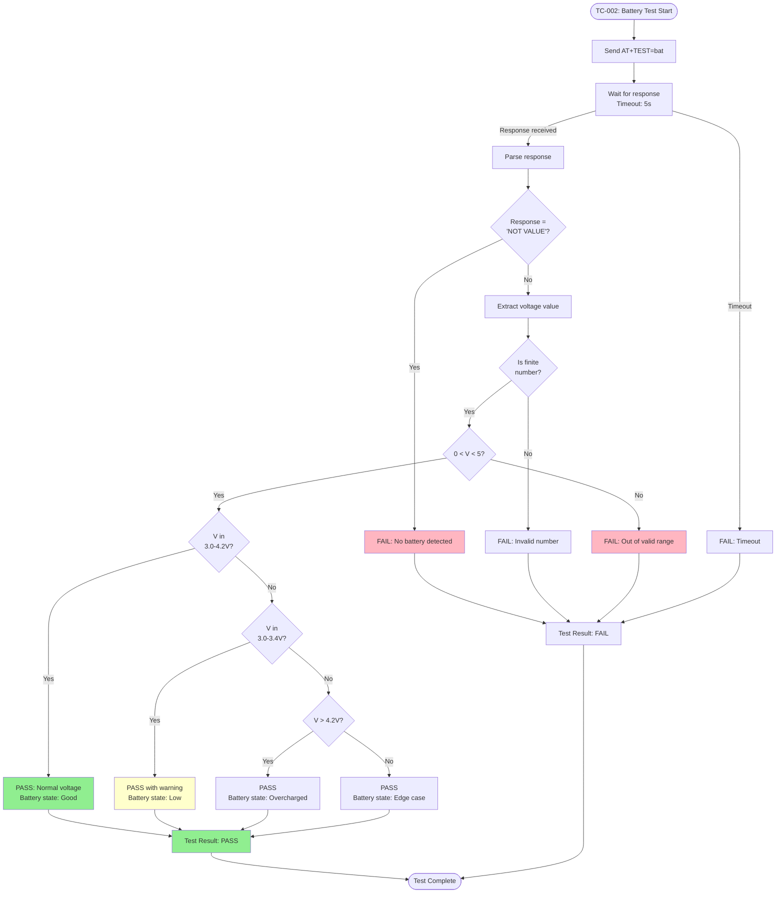
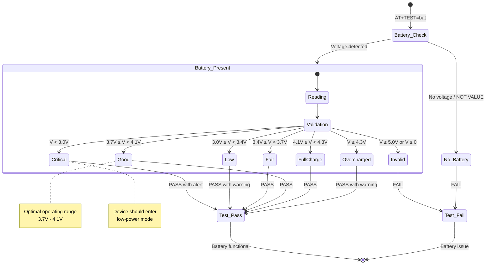
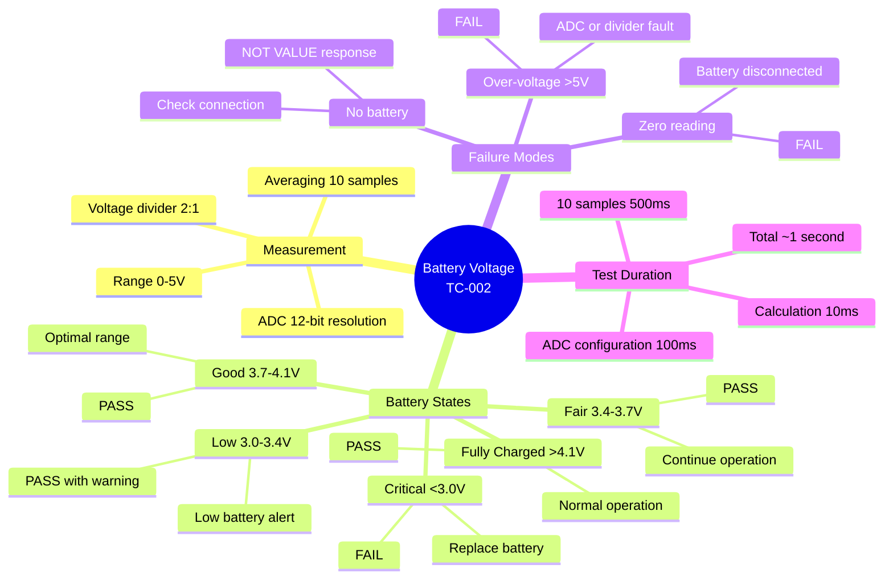
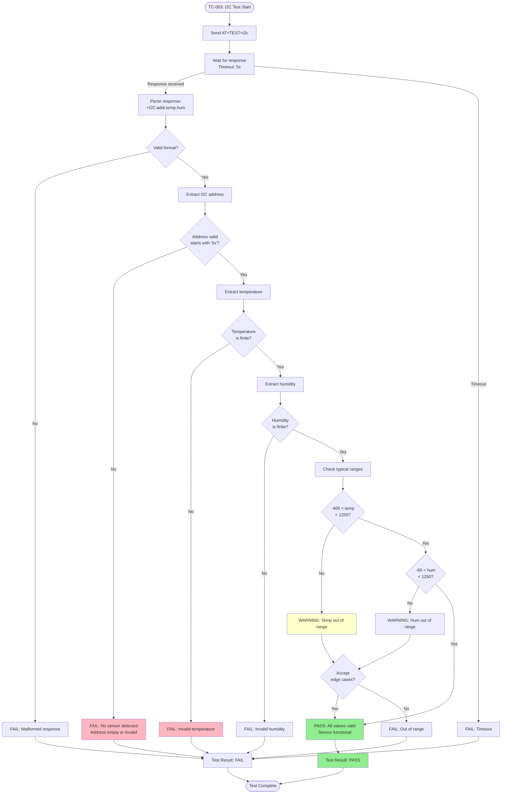
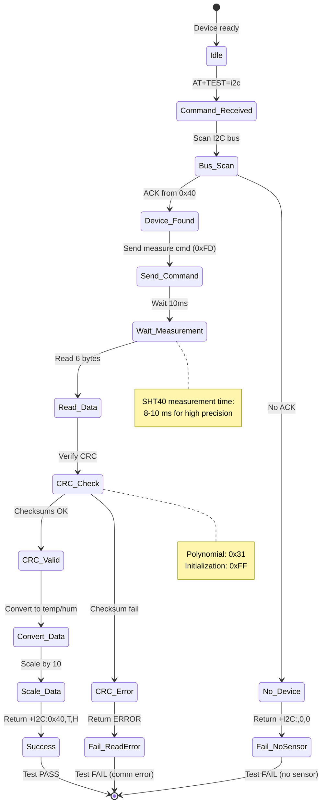
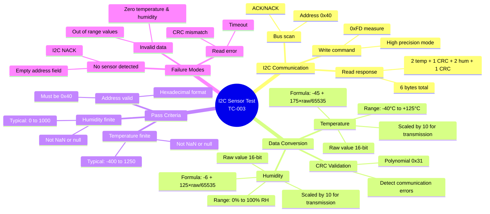
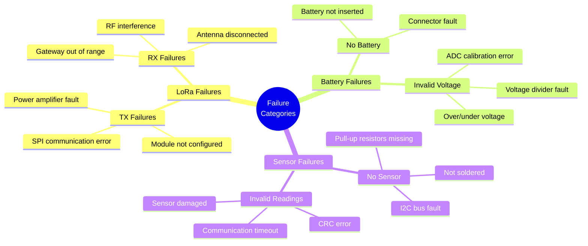
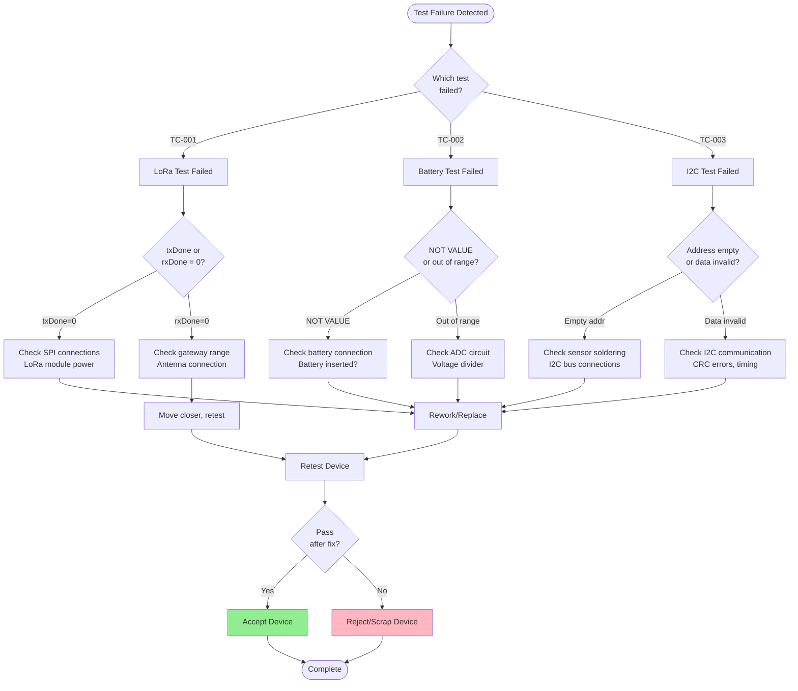

# Droplet Test Cases and Procedures

**Device:** Droplet (Ultra-Compact IoT Sensor Node)  
**Generation:** GEN-2  
**Last Updated:** December 9, 2025

---

## Table of Contents

1. [Overview](#overview)
2. [Test Case TC-001: LoRa TX/RX Communication](#test-case-tc-001-lora-txrx-communication)
3. [Test Case TC-002: Battery Voltage Monitoring](#test-case-tc-002-battery-voltage-monitoring)
4. [Test Case TC-003: I2C Sensor Communication](#test-case-tc-003-i2c-sensor-communication)
5. [Test Matrix](#test-matrix)
6. [Acceptance Criteria](#acceptance-criteria)
7. [Failure Analysis](#failure-analysis)

---

## Overview

This document defines the detailed test cases for Droplet factory testing. Each test case includes objectives, prerequisites, procedures, pass/fail criteria, and troubleshooting guidance.

### Test Philosophy

- **Comprehensive:** Every critical subsystem is validated
- **Automated:** Minimal manual intervention required
- **Fast:** Total test time under 45 seconds
- **Repeatable:** Consistent results across multiple test runs
- **Traceable:** Results logged with timestamps and unique IDs

### Test Summary

| Test ID | Test Name | Subsystem | Duration | Criticality |
|---------|-----------|-----------|----------|-------------|
| TC-001 | LoRa TX/RX | Wireless Communication | ~30s | HIGH |
| TC-002 | Battery Voltage | Power Monitoring | ~5s | MEDIUM |
| TC-003 | I2C Sensor | Environmental Sensing | ~5s | HIGH |

---

## Test Case TC-001: LoRa TX/RX Communication

### TC-001: Overview

| Field | Value |
|-------|-------|
| **Test ID** | TC-001 |
| **Test Name** | LoRa TX/RX Communication Test |
| **Objective** | Verify LoRa radio transmit and receive functionality |
| **Subsystem** | LoRa Module (SX1276/78) |
| **Priority** | HIGH |
| **Duration** | 1-30 seconds (typical: 5-10s) |
| **Automation** | Fully automated |

### TC-001: Prerequisites

1. **Hardware:**
   - Droplet device with battery installed (3.0-4.2V)
   - LoRa antenna properly connected to SMA connector
   - USB-UART adapter connected to test PC
   - LoRa gateway in range (within 10m for factory testing)

2. **Software:**
   - EOL Toolkit application running
   - Factory Testing tab selected
   - Device type set to "Droplet"
   - COM port configured (115200 baud)

3. **Environment:**
   - LoRa gateway powered and operational
   - Gateway configured for same frequency (868/915 MHz)
   - Minimal RF interference
   - Clear line-of-sight to gateway (preferred)

### TC-001: Test Procedure

#### Step 1: Initialize Test
```
Action: Send AT command
Command: AT+TEST=lora\r\n
Expected: Command acknowledged
Timeout: 30 seconds
```

#### Step 2: LoRa TX Phase
```
Device Actions:
1. Configure LoRa module (SF7, BW125, freq)
2. Prepare test packet payload
3. Transmit RF packet (100mW, +14dBm typical)
4. Wait for TxDone interrupt
5. Set txDone = 1

Expected Result: Successful transmission (txDone = 1)
```

#### Step 3: LoRa RX Phase
```
Device Actions:
1. Switch LoRa to RX mode
2. Listen for ACK packet from gateway
3. Wait for RxDone interrupt (20s timeout)
4. If received: Set rxDone = 1, read RSSI
5. If timeout: Set rxDone = 0

Expected Result: Successful reception (rxDone = 1)
```

#### Step 4: Result Reporting
```
Device Response: +LORA:txDone,rxDone,valueRx\r\n
Example: +LORA:1,1,25\r\n
Fields:
  - txDone: 1 (success) or 0 (fail)
  - rxDone: 1 (success) or 0 (fail)
  - valueRx: RSSI or counter value (0-255)
```

### TC-001: Pass/Fail Criteria

| Criterion | Pass Condition | Fail Condition |
|-----------|----------------|----------------|
| **TX Success** | txDone = 1 | txDone = 0 |
| **RX Success** | rxDone = 1 | rxDone = 0 |
| **Response Format** | +LORA:1,1,N format | Malformed response |
| **Timeout** | Response within 30s | No response in 30s |
| **Overall Result** | txDone=1 AND rxDone=1 | Either txDone=0 OR rxDone=0 |

### TC-001: Test Result Examples

**Pass Example:**
```
Command: AT+TEST=lora
Response: +LORA:1,1,25
Parse: txDone=1, rxDone=1, valueRx=25
Result: PASS
Message: "LoRa: TX=1, RX=1, Value=25"
```

**Partial Fail Example (TX success, RX fail):**
```
Command: AT+TEST=lora
Response: +LORA:1,0,0
Parse: txDone=1, rxDone=0, valueRx=0
Result: FAIL
Message: "TX=1, RX=0 (need both=1)"
Likely Cause: Gateway not responding or out of range
```

**Complete Fail Example:**
```
Command: AT+TEST=lora
Response: +LORA:0,0,0
Parse: txDone=0, rxDone=0, valueRx=0
Result: FAIL
Message: "LoRa test failed"
Likely Cause: LoRa module hardware fault
```

**Timeout Example:**
```
Command: AT+TEST=lora
Response: (none after 30 seconds)
Result: FAIL (exception thrown)
Message: "LoRa test timeout"
Likely Cause: Device not responding, UART issue
```

### TC-001: Flowchart



### TC-001: State Diagram



### TC-001: Troubleshooting

| Symptom | Likely Cause | Solution |
|---------|--------------|----------|
| txDone=0, rxDone=0 | LoRa module fault | Check SPI connections, module power |
| txDone=1, rxDone=0 | Gateway not responding | Move closer to gateway, check gateway config |
| Timeout | Device not responding | Check UART connection, reset device |
| valueRx always 0 | RSSI register read failed | Check LoRa firmware version |
| Intermittent RX fail | RF interference | Test in RF-shielded environment |

---

## Test Case TC-002: Battery Voltage Monitoring

### TC-002: Overview

| Field | Value |
|-------|-------|
| **Test ID** | TC-002 |
| **Test Name** | Battery Voltage Monitoring Test |
| **Objective** | Verify battery voltage measurement circuit |
| **Subsystem** | ADC + Voltage Divider |
| **Priority** | MEDIUM |
| **Duration** | 1-5 seconds |
| **Automation** | Fully automated |

### TC-002: Prerequisites

1. **Hardware:**
   - Droplet device with LiPo battery installed
   - Battery voltage: 3.0-4.2V (normal range)
   - USB-UART adapter connected to test PC
   - Voltage divider circuit operational

2. **Software:**
   - EOL Toolkit application running
   - Device connected and responsive

3. **Environment:**
   - Room temperature (15-35°C)
   - Battery at rest (not charging/discharging)

### TC-002: Test Procedure

#### Step 1: Initialize Test
```
Action: Send AT command
Command: AT+TEST=bat\r\n
Expected: Command acknowledged
Timeout: 5 seconds
```

#### Step 2: ADC Measurement
```
Device Actions:
1. Configure ADC (GPIO34, 11dB attenuation)
2. Take 10 samples (for averaging)
3. Calculate average ADC value
4. Convert to voltage: V = (ADC/4095) × 3.6V × 2.0
5. Validate: 0 < voltage < 5V

Expected Result: Valid voltage reading (3.0-4.2V typical)
```

#### Step 3: Result Reporting
```
Device Response: +BAT:voltage\r\n
Example: +BAT:3.61\r\n
Field: voltage (floating-point, 2 decimal places)

Special Cases:
- +BAT:NOT VALUE (no battery detected)
- +BAT:0.00 (battery critically low or disconnected)
```

### TC-002: Pass/Fail Criteria

| Criterion | Pass Condition | Fail Condition |
|-----------|----------------|----------------|
| **Voltage Range** | 0 < voltage < 5.0V | voltage ≤ 0 OR voltage ≥ 5.0 |
| **Numeric Value** | Finite number | NaN, Infinity, null |
| **Response Format** | +BAT:N.NN format | "NOT VALUE" or malformed |
| **Timeout** | Response within 5s | No response in 5s |
| **Typical Range** | 3.0-4.2V | Outside normal LiPo range (warning only) |

### TC-002: Test Result Examples

**Pass Example (Good Battery):**
```
Command: AT+TEST=bat
Response: +BAT:3.61
Parse: voltage=3.61V
Validation: 0 < 3.61 < 5 ✓
Result: PASS
Message: "Battery: 3.61V"
Battery State: Good
```

**Pass Example (Low Battery):**
```
Command: AT+TEST=bat
Response: +BAT:3.15
Parse: voltage=3.15V
Validation: 0 < 3.15 < 5 ✓
Result: PASS (with warning)
Message: "Battery: 3.15V (Low)"
Battery State: Low battery warning
```

**Fail Example (No Battery):**
```
Command: AT+TEST=bat
Response: +BAT:NOT VALUE
Parse: voltage=null
Result: FAIL
Message: "No battery value"
Likely Cause: Battery not connected
```

**Fail Example (Over-voltage):**
```
Command: AT+TEST=bat
Response: +BAT:5.23
Parse: voltage=5.23V
Validation: 5.23 < 5 ✗
Result: FAIL
Message: "Invalid voltage"
Likely Cause: ADC calibration error, voltage divider fault
```

### TC-002: Flowchart



### TC-002: Voltage State Diagram



### TC-002: Battery Life Mind Map



### TC-002: Troubleshooting

| Symptom | Likely Cause | Solution |
|---------|--------------|----------|
| NOT VALUE | Battery not connected | Check battery connector, insert battery |
| 0.00V | Battery fully discharged | Replace with charged battery (>3.0V) |
| >5V reading | ADC calibration error | Re-calibrate ADC, check voltage divider |
| Fluctuating readings | Poor connection | Clean battery contacts, reseat battery |
| Always same value | ADC stuck | Reset device, check ADC circuit |

---

## Test Case TC-003: I2C Sensor Communication

### TC-003: Overview

| Field | Value |
|-------|-------|
| **Test ID** | TC-003 |
| **Test Name** | I2C Sensor Communication Test |
| **Objective** | Verify I2C bus and SHT40 sensor functionality |
| **Subsystem** | I2C Interface + SHT40 Temperature/Humidity Sensor |
| **Priority** | HIGH |
| **Duration** | 1-5 seconds |
| **Automation** | Fully automated |

### TC-003: Prerequisites

1. **Hardware:**
   - Droplet device with SHT40 sensor soldered
   - Sensor properly powered (3.3V)
   - I2C pull-up resistors installed (4.7kΩ)
   - USB-UART adapter connected to test PC

2. **Software:**
   - EOL Toolkit application running
   - Device connected and responsive

3. **Environment:**
   - Room temperature: 15-35°C
   - Humidity: 20-80% RH
   - No extreme environmental conditions

### TC-003: Test Procedure

#### Step 1: Initialize Test
```
Action: Send AT command
Command: AT+TEST=i2c\r\n
Expected: Command acknowledged
Timeout: 5 seconds
```

#### Step 2: I2C Bus Scan (Optional)
```
Device Actions:
1. Scan I2C addresses 0x00-0x7F
2. Send START + Address + R/W bit
3. Wait for ACK
4. Identify device at 0x40 (SHT40)

Expected Result: Device found at 0x40
```

#### Step 3: Sensor Measurement
```
Device Actions:
1. Send I2C command to 0x40: 0xFD (measure high precision)
2. Wait 10ms for measurement completion
3. Read 6 bytes:
   - Bytes 0-1: Temperature (MSB, LSB)
   - Byte 2: Temperature CRC
   - Bytes 3-4: Humidity (MSB, LSB)
   - Byte 5: Humidity CRC
4. Verify CRC checksums
5. Convert raw values to physical units:
   - temp_C = -45 + 175 × (raw / 65535)
   - hum_RH = -6 + 125 × (raw / 65535)
6. Scale by 10 for integer transmission:
   - temp_scaled = temp_C × 10
   - hum_scaled = hum_RH × 10

Expected Result: Valid temperature and humidity readings
```

#### Step 4: Result Reporting
```
Device Response: +I2C:address,temp,hum\r\n
Example: +I2C:0x40,275,686\r\n
Fields:
  - address: I2C address (hex format, e.g., 0x40)
  - temp: Temperature × 10 (e.g., 275 = 27.5°C)
  - hum: Humidity × 10 (e.g., 686 = 68.6% RH)

Special Cases:
- +I2C:,0,0 (no sensor detected)
- +I2C:0x40,0,0 (sensor found but read failed)
```

### TC-003: Pass/Fail Criteria

| Criterion | Pass Condition | Fail Condition |
|-----------|----------------|----------------|
| **I2C Address** | address = "0x40" | Empty or invalid address |
| **Temperature** | Finite number, -400 to 1250 | null, NaN, or out of range |
| **Humidity** | Finite number, -60 to 1250 | null, NaN, or out of range |
| **Response Format** | +I2C:0xXX,NNN,NNN | Malformed response |
| **Timeout** | Response within 5s | No response in 5s |
| **Overall** | All three fields valid | Any field invalid |

### TC-003: Test Result Examples

**Pass Example (Normal Conditions):**
```
Command: AT+TEST=i2c
Response: +I2C:0x40,275,686
Parse: 
  - i2cAddress = "0x40" ✓
  - temperature = 275 (27.5°C) ✓
  - humidity = 686 (68.6% RH) ✓
Validation: All fields valid
Result: PASS
Message: "I2C: 0x40, Temp: 275, Hum: 686"
```

**Pass Example (Cold Environment):**
```
Command: AT+TEST=i2c
Response: +I2C:0x40,52,-34
Parse:
  - i2cAddress = "0x40" ✓
  - temperature = 52 (5.2°C) ✓
  - humidity = -34 (-3.4% RH, compensated) ✓
Result: PASS
Message: "I2C: 0x40, Temp: 52, Hum: -34"
Note: Negative humidity can occur below 0°C
```

**Fail Example (Sensor Not Detected):**
```
Command: AT+TEST=i2c
Response: +I2C:,0,0
Parse:
  - i2cAddress = "" (empty) ✗
  - temperature = 0
  - humidity = 0
Validation: Address invalid
Result: FAIL
Message: "Invalid I2C values"
Likely Cause: Sensor not soldered or I2C bus fault
```

**Fail Example (Sensor Read Error):**
```
Command: AT+TEST=i2c
Response: +I2C:0x40,0,0
Parse:
  - i2cAddress = "0x40" ✓
  - temperature = 0 ✗ (suspicious, likely error)
  - humidity = 0 ✗ (suspicious, likely error)
Result: FAIL (depends on validation logic)
Message: "Invalid sensor readings"
Likely Cause: CRC error, I2C communication failure
```

### TC-003: Flowchart



### TC-003: I2C Communication State Diagram



### TC-003: Sensor Data Conversion Mind Map



### TC-003: Troubleshooting

| Symptom | Likely Cause | Solution |
|---------|--------------|----------|
| Address empty (+I2C:,0,0) | Sensor not soldered | Inspect solder joints, reflow sensor |
| Address valid but T=0, H=0 | CRC error, read failure | Check I2C signal integrity, retry test |
| Timeout | I2C bus hung | Reset device, check SDA/SCL pull-ups |
| Temperature out of range | Sensor fault or extreme temp | Verify room temperature, replace sensor |
| Humidity negative | Below freezing point | Normal for T < 0°C, adjust validation |
| Always same values | Sensor stuck | Reset sensor, check power supply |

---

## Test Matrix

### Complete Test Coverage Matrix

| Subsystem | Component | Test Case | Test Type | Pass Criteria |
|-----------|-----------|-----------|-----------|---------------|
| **Wireless** | LoRa Module | TC-001 | Functional | txDone=1, rxDone=1 |
| | LoRa Antenna | TC-001 | Connectivity | RSSI valid |
| | RF Path | TC-001 | Integration | Gateway ACK received |
| **Power** | Battery | TC-002 | Measurement | 0 < V < 5 |
| | ADC Circuit | TC-002 | Analog | Voltage accurate |
| | Voltage Divider | TC-002 | Passive | Ratio correct (2:1) |
| **Sensors** | SHT40 Sensor | TC-003 | I2C Comm | Address = 0x40 |
| | I2C Bus | TC-003 | Digital | Data transfer OK |
| | Temperature | TC-003 | Measurement | Finite value |
| | Humidity | TC-003 | Measurement | Finite value |

### Test Execution Matrix

| Test Order | Test ID | Dependencies | Execution Time | Critical Path |
|------------|---------|--------------|----------------|---------------|
| 1 | TC-001 | LoRa gateway ready | ~5-30s | Yes |
| 2 | TC-002 | None | ~1-5s | No |
| 3 | TC-003 | None | ~1-5s | Yes |

**Total Execution Time:** 7-40 seconds (typical: 15-20 seconds)

### Test Result Combinations

| TC-001 | TC-002 | TC-003 | Overall Result | Action |
|--------|--------|--------|----------------|--------|
| PASS | PASS | PASS | **PASS** | Ship device |
| PASS | PASS | FAIL | **FAIL** | Replace sensor |
| PASS | FAIL | PASS | **FAIL** | Check battery/ADC |
| FAIL | PASS | PASS | **FAIL** | Check LoRa/antenna |
| FAIL | FAIL | FAIL | **FAIL** | Major fault, scrap |

---

## Acceptance Criteria

### Device-Level Acceptance

A Droplet device is considered **ACCEPTABLE FOR SHIPMENT** if and only if:

1. **All Tests Pass:**
   - TC-001: LoRa TX/RX (PASS)
   - TC-002: Battery Voltage (PASS)
   - TC-003: I2C Sensor (PASS)

2. **No Critical Warnings:**
   - Battery voltage ≥ 3.0V
   - Temperature reading within ±50°C of room temperature
   - Humidity reading within 0-100% RH

3. **Documentation Complete:**
   - Test results saved (CSV + JSON)
   - Device UID recorded
   - Test timestamp logged
   - Operator ID recorded (if applicable)

### Batch-Level Acceptance

A production batch is considered **ACCEPTABLE** if:

- **Yield ≥ 95%:** At least 95% of devices pass all tests
- **No Systematic Failures:** No single test fails on >10% of devices
- **Traceability:** All devices tracked with unique UIDs
- **Calibration Current:** Test equipment calibrated within 6 months

---

## Failure Analysis

### Failure Categories



### Root Cause Analysis Flowchart



---

## Conclusion

This comprehensive test case document defines the procedures, criteria, and troubleshooting for all three Droplet factory tests. Each test case provides detailed steps, pass/fail criteria, and flowcharts to ensure consistent, reliable testing across production batches.

### Key Testing Principles

✓ **Automation:** Minimize manual intervention  
✓ **Speed:** Complete testing in under 45 seconds  
✓ **Reliability:** Repeatable results with <5% false failures  
✓ **Traceability:** All results logged with timestamps and UIDs  
✓ **Actionable:** Clear troubleshooting guidance for failures

---

**End of Droplet Test Cases**
