# Droplet Troubleshooting Guide

**Device:** Droplet (Ultra-Compact IoT Sensor Node)  
**Generation:** GEN-2  
**Target Audience:** Test Operators, Support Engineers  
**Last Updated:** December 9, 2025

---

## Table of Contents

1. [Quick Reference](#quick-reference)
2. [Connection Issues](#connection-issues)
3. [LoRa Test Failures](#lora-test-failures)
4. [Battery Test Failures](#battery-test-failures)
5. [I2C Sensor Test Failures](#i2c-sensor-test-failures)
6. [Intermittent Issues](#intermittent-issues)
7. [Hardware Diagnostics](#hardware-diagnostics)
8. [State Diagrams](#state-diagrams)
9. [Escalation Procedures](#escalation-procedures)

---

## Quick Reference

### Common Error Messages and Solutions

| Error Message | Likely Cause | Quick Fix | Test |
|---------------|--------------|-----------|------|
| `Timeout waiting for +LORA:` | Device not responding | Check UART connection, reset device | LoRa |
| `TX=1, RX=0 (need both=1)` | Gateway not in range | Move device closer to gateway | LoRa |
| `TX=0, RX=0 (need both=1)` | LoRa module fault | Check SPI connections, antenna | LoRa |
| `No battery value` | Battery not connected | Insert battery, check connector | Battery |
| `Invalid voltage` | Voltage out of range | Check battery charge, ADC circuit | Battery |
| `Invalid I2C values` | Sensor not detected | Check sensor soldering, I2C bus | I2C |
| `I2C: ,0,0` | No sensor found | Reflow sensor connections | I2C |

### Symptom-Based Quick Lookup

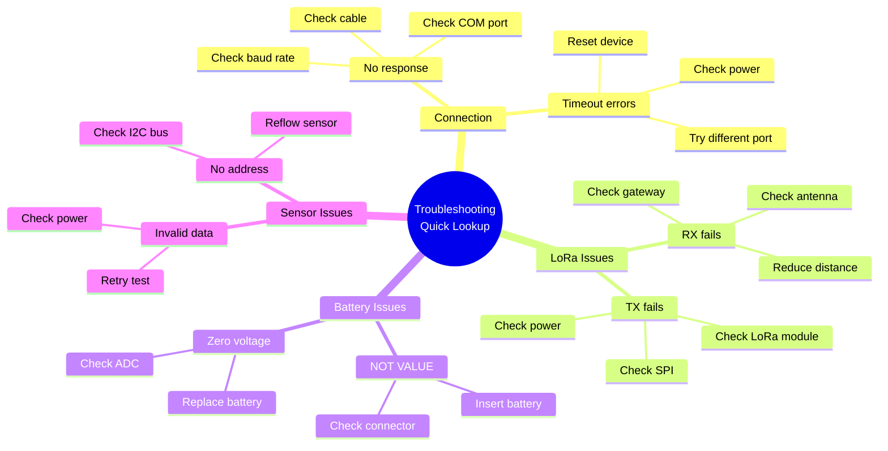

---

## Connection Issues

### Issue 1: Cannot Connect to Device

#### State Diagram: Connection States

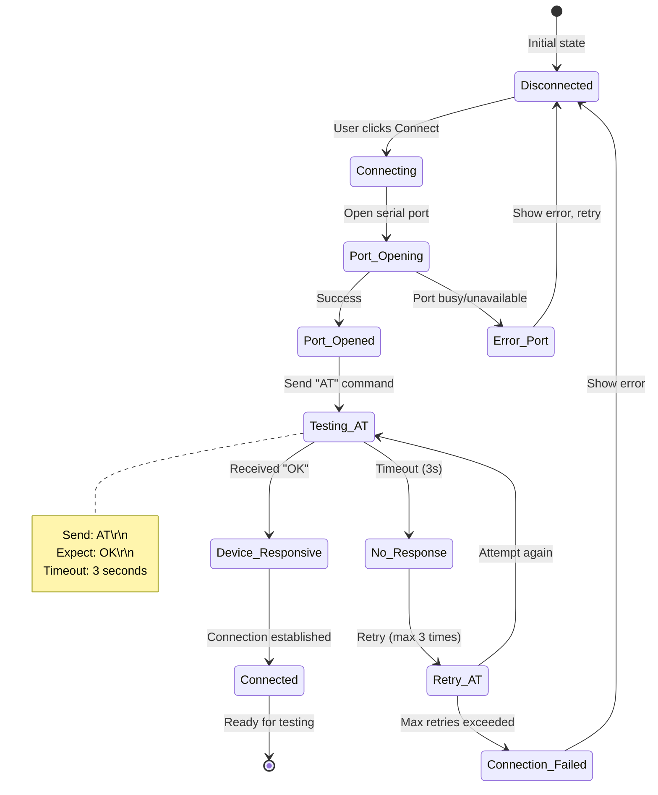

#### Symptoms
- "Could not connect to device" error
- COM port dropdown is empty
- Selected port shows "Port unavailable"
- "Timeout waiting for response" during connection

#### Diagnostic Steps

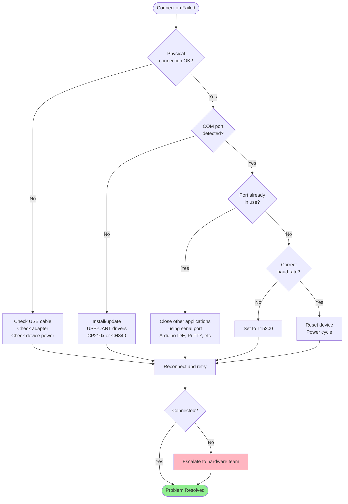

#### Solutions

**Solution 1: Check Physical Connection**
```
Steps:
1. Verify USB cable is fully inserted
2. Check device power LED (if equipped)
3. Try different USB port on test PC
4. Test with known-good USB cable
5. Verify battery is inserted (3.0-4.2V)

Expected Result: Device powered, USB adapter detected
```

**Solution 2: Install/Update Drivers**
```
Windows:
1. Open Device Manager (Win+X → Device Manager)
2. Look for "Other devices" or "Ports (COM & LPT)"
3. If yellow warning icon, right-click → Update Driver
4. Download CP210x or CH340 driver from manufacturer
5. Install driver and reconnect device

Expected Result: COM port appears in list (e.g., COM3)
```

**Solution 3: Close Conflicting Applications**
```
Common Applications:
- Arduino IDE (Serial Monitor)
- PuTTY / Tera Term
- MATLAB (Serial Interface)
- Other EOL Toolkit instances

Steps:
1. Close all serial terminal applications
2. Check Task Manager for orphaned processes
3. If needed, restart test PC
4. Reconnect device

Expected Result: Port available for connection
```

**Solution 4: Reset Device**
```
Hardware Reset:
1. Disconnect USB-UART adapter
2. Remove battery from Droplet
3. Wait 10 seconds
4. Re-insert battery
5. Reconnect USB-UART adapter
6. Click "Connect" in EOL Toolkit

Expected Result: Device responds with "OK" to AT command
```

---

## LoRa Test Failures

### Issue 2: LoRa RX Failure (txDone=1, rxDone=0)

#### State Diagram: LoRa RX States

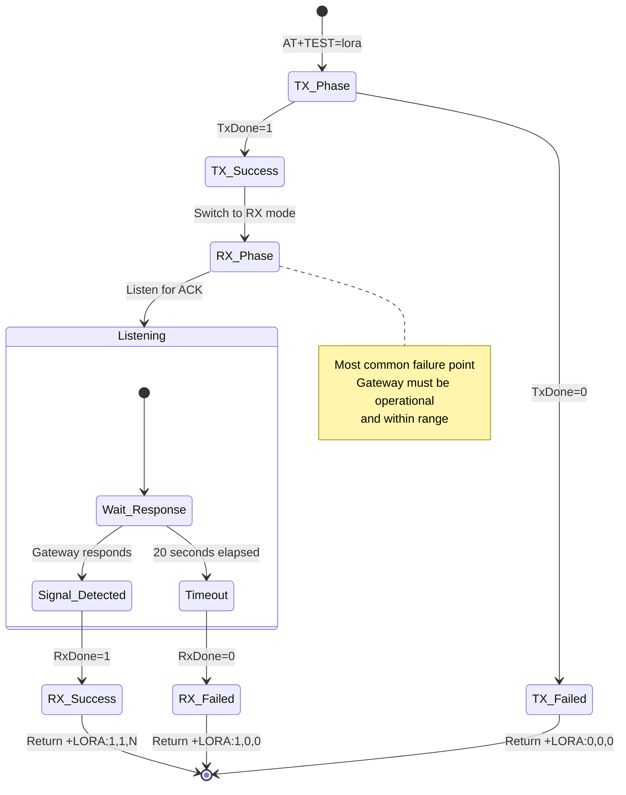

#### Symptoms
- Response: `+LORA:1,0,0`
- Test result: `TX=1, RX=0 (need both=1)`
- Message: "LoRa test failed" or "RX timeout"

#### Root Cause Analysis

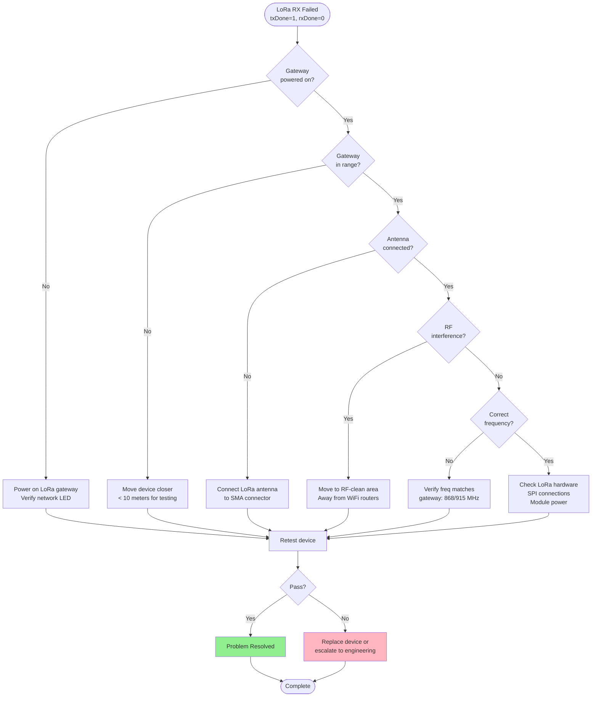

#### Solutions

**Solution 1: Check Gateway Status**
```
Verification Steps:
1. Verify gateway has power (LED indicators)
2. Check gateway network connectivity
3. Review gateway logs for received packets
4. Confirm gateway is listening on correct frequency
5. Test gateway with known-good Droplet device

Gateway Requirements:
- Power: Stable 12V DC or PoE
- Network: Connected to test network
- Frequency: 868 MHz (EU) or 915 MHz (US/AU)
- Mode: Packet forwarder running

Expected Result: Gateway receives test packet and sends ACK
```

**Solution 2: Reduce Distance**
```
Factory Test Setup:
1. Place device within 5-10 meters of gateway
2. Ensure line-of-sight (no metal obstacles)
3. Position antenna vertically
4. Avoid placing near metal surfaces

Distance Guidelines:
- Factory testing: < 10 meters (optimal)
- Production range: 2-5 km (urban), 10+ km (rural)
- Maximum range: 15+ km (line-of-sight)

Expected Result: Strong RSSI signal (-60 to -90 dBm)
```

**Solution 3: Check Antenna Connection**
```
Inspection:
1. Visual inspection of SMA connector
2. Verify antenna is hand-tight (don't overtighten)
3. Check for antenna damage (bent, broken)
4. Test with known-good antenna

Antenna Specifications:
- Type: 868/915 MHz omnidirectional
- Connector: RP-SMA female
- Gain: 2-3 dBi
- Length: 80-100 mm (quarter-wave)

Expected Result: Antenna properly seated, no visible damage
```

**Solution 4: Investigate RF Interference**
```
Common Interference Sources:
- WiFi routers (2.4 GHz overlaps with sub-GHz)
- Microwave ovens
- Other LoRa devices transmitting
- Industrial machinery

Mitigation:
1. Move testing station away from WiFi routers
2. Shield testing area with RF-absorbing foam
3. Test during low-traffic times
4. Use spectrum analyzer to identify interference

Expected Result: Clean RF spectrum, successful RX
```

### Issue 3: LoRa TX Failure (txDone=0)

#### Symptoms
- Response: `+LORA:0,0,0` or `+LORA:0,X,X`
- Test result: `TX=0, RX=0 (need both=1)`
- Message: "LoRa test failed"

#### Diagnostic Flowchart

```mermaid
flowchart TD
    Start([LoRa TX Failed<br/>txDone=0]) --> CheckSPI{SPI<br/>communication OK?}
    
    CheckSPI -->|Unknown| TestSPI[Test SPI bus<br/>with oscilloscope]
    CheckSPI -->|No| FixSPI[Check SPI connections:<br/>MISO, MOSI, SCK, CS]
    CheckSPI -->|Yes| CheckPower{LoRa module<br/>powered?}
    
    TestSPI --> FixSPI
    FixSPI --> Retest
    
    CheckPower -->|No| Fix Power[Check 3.3V supply<br/>to LoRa module]
    CheckPower -->|Yes| CheckConfig{Module<br/>configured?}
    
    FixPower --> Retest
    
    CheckConfig -->|No| FixConfig[Update firmware<br/>with LoRa init code]
    CheckConfig -->|Yes| CheckPA{Power amplifier<br/>functional?}
    
    FixConfig --> Retest
    
    CheckPA -->|No| Replace[Replace LoRa module<br/>or device]
    CheckPA -->|Yes| CheckFirmware[Update device firmware<br/>Check AT command handler]
    
    CheckFirmware --> Retest
    Replace --> End
    
    Retest --> Result{Pass?}
    Result -->|Yes| Success[Problem Resolved]
    Result -->|No| Scrap[Scrap device]
    
    Success --> End([Complete])
    Scrap --> End
    
    style Success fill:#90EE90
    style Scrap fill:#FFB6C1
```

#### Solutions

**Solution 1: Verify SPI Communication**
```
Hardware Check:
1. Inspect PCB for solder bridges on SPI lines
2. Test continuity with multimeter:
   - ESP32 GPIO18 (SCK) → LoRa SCK
   - ESP32 GPIO19 (MISO) → LoRa MISO
   - ESP32 GPIO23 (MOSI) → LoRa MOSI
   - ESP32 GPIO5 (CS) → LoRa CS
3. Verify SPI clock signal with oscilloscope
4. Check for cold solder joints

Expected Result: Continuity on all SPI lines, clean clock signal
```

**Solution 2: Check LoRa Module Power**
```
Voltage Measurements:
1. Measure VDD pin on LoRa module (should be 3.3V)
2. Check current draw (idle: ~10mA, TX: ~120mA)
3. Verify LDO regulator output (3.3V ± 3%)
4. Test under load (during TX)

Power Requirements:
- Voltage: 3.0-3.6V (3.3V nominal)
- Current (TX): 120-140 mA
- Current (RX): 10-15 mA
- Current (Sleep): < 1 µA

Expected Result: Stable 3.3V supply, sufficient current
```

**Solution 3: Replace LoRa Module**
```
When to Replace:
- SPI communication fails
- Module doesn't respond to initialization
- Power consumption abnormal
- TX never completes (txDone=0 consistently)

Replacement Procedure:
1. Desolder SX1276/78 module (hot air or reflow)
2. Clean PCB pads
3. Apply fresh solder paste
4. Place new module (check orientation)
5. Reflow solder
6. Inspect joints under microscope
7. Retest device

Expected Result: txDone=1, successful transmission
```

---

## Battery Test Failures

### Issue 4: Battery Not Detected (NOT VALUE)

#### State Diagram: Battery Detection

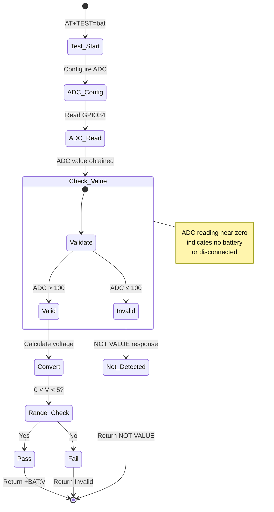

#### Symptoms
- Response: `+BAT:NOT VALUE`
- Test result: `FAIL`
- Message: "No battery value"

#### Diagnostic Steps

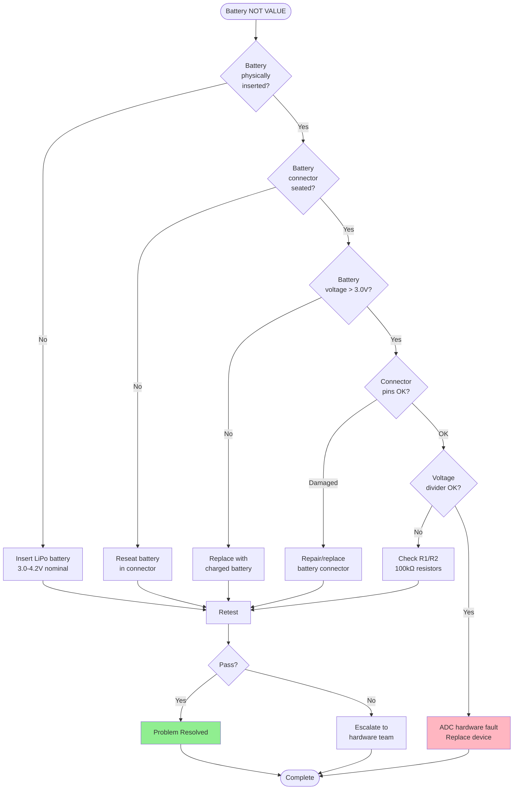

#### Solutions

**Solution 1: Insert Battery**
```
Battery Requirements:
- Type: LiPo (Lithium Polymer)
- Voltage: 3.0-4.2V (3.7V nominal)
- Capacity: 500-1200 mAh (typical)
- Connector: JST-PH 2.0mm or similar

Installation:
1. Verify battery polarity (red=+, black=-)
2. Align connector with socket
3. Insert connector fully (should click)
4. Verify battery is not swollen or damaged

Expected Result: +BAT:3.6 (or similar voltage)
```

**Solution 2: Test Battery Voltage**
```
Multimeter Test:
1. Set multimeter to DC voltage (20V range)
2. Measure battery voltage directly:
   - Red probe → Battery + (red wire)
   - Black probe → Battery - (black wire)
3. Expected: 3.0-4.2V
4. If < 2.5V: Battery fully discharged (replace)
5. If > 4.3V: Overcharged battery (dangerous, dispose)

Voltage States:
- 4.2V: Fully charged
- 3.7V: Nominal (50% capacity)
- 3.4V: Low (20% capacity)
- 3.0V: Critical (0% capacity)
- < 2.5V: Dead (unrecoverable)

Expected Result: Voltage in 3.0-4.2V range
```

**Solution 3: Inspect Voltage Divider Circuit**
```
Circuit Diagram:
    Battery+ ──[R1: 100kΩ]──┬──[R2: 100kΩ]── GND
                             │
                             └── ADC (GPIO34)

Measurements:
1. Check R1 resistance: 100kΩ ± 5%
2. Check R2 resistance: 100kΩ ± 5%
3. Measure voltage at ADC pin (should be Battery/2)
4. Example: Battery=3.6V → ADC pin = 1.8V

Common Faults:
- R1 or R2 open circuit (∞ resistance)
- R1 or R2 short circuit (0 resistance)
- Solder bridge between resistor pads
- Trace cut or damage

Expected Result: Proper voltage division, ADC reads half of battery voltage
```

### Issue 5: Invalid Voltage Reading

#### Symptoms
- Response: `+BAT:0.00` or `+BAT:5.23` (out of range)
- Test result: `FAIL`
- Message: "Invalid voltage"

#### Solutions

**Solution 1: Calibrate ADC**
```
ESP32 ADC Calibration:
1. Read factory-programmed eFuse values
2. Apply calibration curves
3. Account for voltage attenuation (11dB)
4. Test with known voltage source

Calibration Code (ESP32):
esp_adc_cal_characteristics_t *adc_chars;
adc_chars = calloc(1, sizeof(esp_adc_cal_characteristics_t));
esp_adc_cal_characterize(ADC_UNIT_1, ADC_ATTEN_DB_11, 
                          ADC_WIDTH_BIT_12, 1100, adc_chars);

Expected Result: Accurate voltage reading (±0.05V)
```

---

## I2C Sensor Test Failures

### Issue 6: Sensor Not Detected (Empty Address)

#### State Diagram: I2C Detection

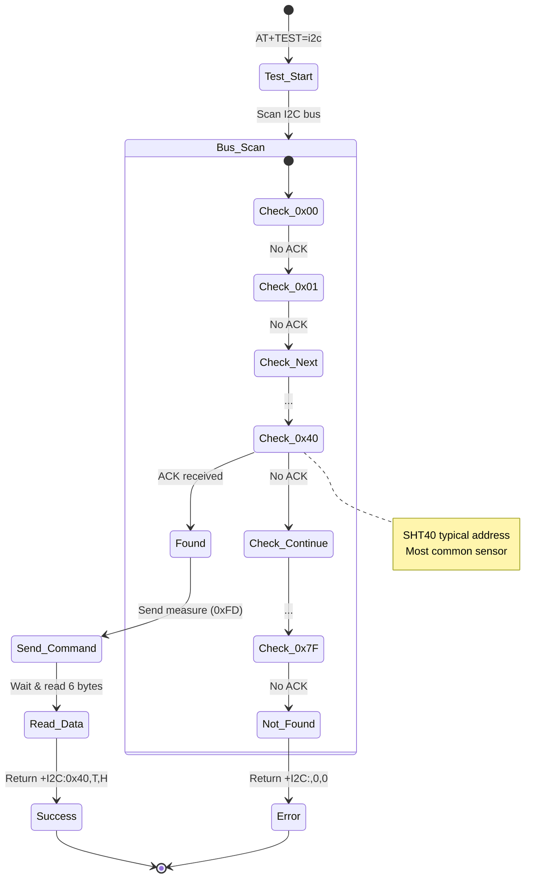

#### Symptoms
- Response: `+I2C:,0,0`
- Test result: `FAIL`
- Message: "Invalid I2C values"
- i2cAddress field is empty

#### Diagnostic Flowchart

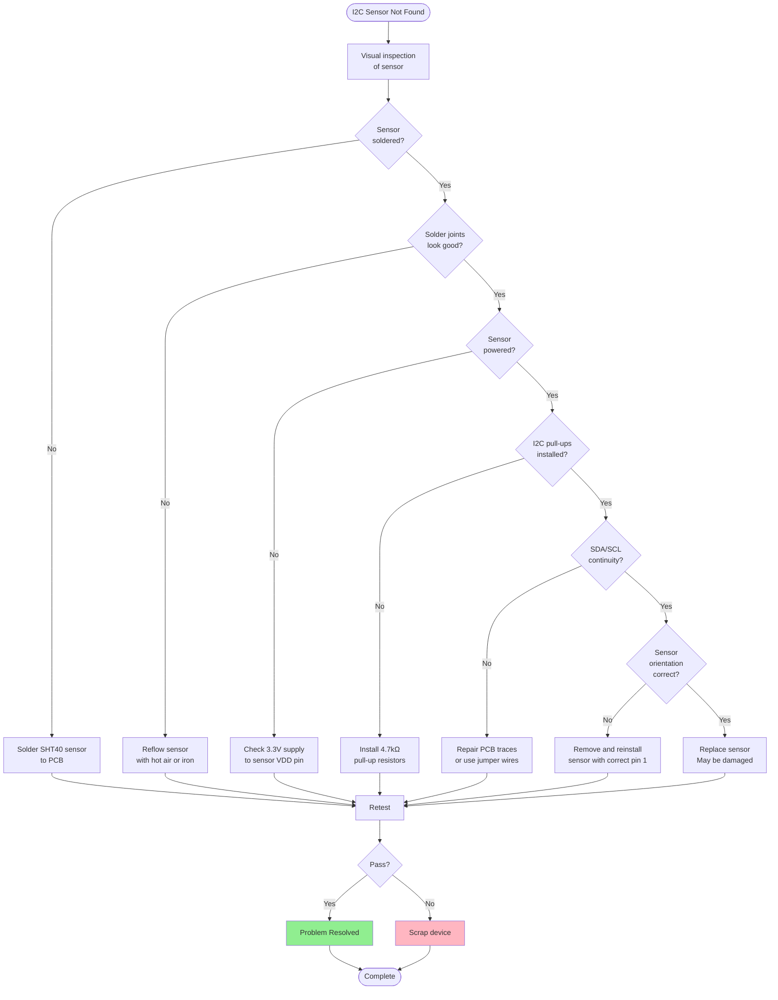

#### Solutions

**Solution 1: Reflow Sensor**
```
Reflow Procedure:
1. Apply flux to sensor pads
2. Heat with hot air (300-350°C) or iron
3. Gently press sensor down while heating
4. Allow to cool (don't disturb)
5. Inspect joints under magnification

Quality Check:
- Solder forms fillets on all pads
- No solder bridges between pads
- Sensor is flush with PCB
- No tombstoning (sensor lifted on one side)

Expected Result: All 4 pins properly soldered, sensor detected at 0x40
```

**Solution 2: Check I2C Bus**
```
Oscilloscope/Logic Analyzer Test:
1. Connect probe to SDA line (GPIO21)
2. Connect probe to SCL line (GPIO22)
3. Trigger on I2C start condition
4. Observe bus activity during test

Healthy I2C Signals:
- SCL: Clean square wave, 100 kHz
- SDA: Data transitions during SCL low
- Pull-ups: Lines idle high (3.3V)
- ACK bits: SDA pulled low by slave

Fault Conditions:
- Lines stuck low: Short to ground
- Lines stuck high: Open circuit or no pull-ups
- No activity: ESP32 not sending commands
- NACK only: Sensor not responding

Expected Result: Clean I2C communication, ACK from 0x40
```

### Issue 7: Invalid Sensor Data (T=0, H=0)

#### Symptoms
- Response: `+I2C:0x40,0,0`
- Test result: `FAIL` or `PASS` (depends on validation logic)
- Message: "Invalid sensor readings"
- Sensor address is valid but data is zero

#### Solutions

**Solution 1: Retry with Delay**
```
Issue: Sensor not ready after power-on

Workaround:
1. Add delay after device connection (500ms)
2. Retry I2C test if first attempt returns zeros
3. Maximum 3 retry attempts

Code Example:
for (let attempt = 0; attempt < 3; attempt++) {
  const result = await i2cTest();
  if (result.temperature !== 0 || result.humidity !== 0) {
    break; // Success
  }
  await delay(500); // Wait before retry
}

Expected Result: Valid temperature and humidity readings
```

**Solution 2: Check CRC**
```
CRC Validation:
1. Sensor sends 6 bytes: [T_MSB, T_LSB, T_CRC, H_MSB, H_LSB, H_CRC]
2. Firmware calculates CRC for temperature and humidity
3. If CRC mismatch, data is invalid

CRC Polynomial: 0x31 (x^8 + x^5 + x^4 + 1)
Initialization: 0xFF

Action:
- If CRC fails repeatedly: Replace sensor
- If intermittent: Check I2C signal integrity

Expected Result: CRC matches, data validated
```

---

## Intermittent Issues

### Issue 8: Tests Pass Sometimes, Fail Sometimes

#### Root Causes and Solutions

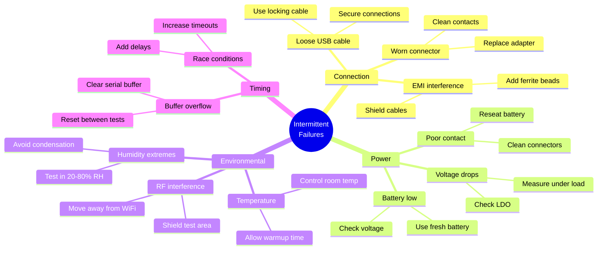

#### Solution: Implement Retry Logic

```javascript
async function reliableTest(testFunction, maxRetries = 3) {
  let lastError;
  for (let attempt = 1; attempt <= maxRetries; attempt++) {
    try {
      const result = await testFunction();
      if (result.pass) {
        return result; // Success
      }
      // Test failed, retry
      lastError = new Error(`Test failed on attempt ${attempt}`);
    } catch (err) {
      lastError = err;
      if (attempt < maxRetries) {
        await delay(1000); // Wait before retry
      }
    }
  }
  throw lastError; // All retries exhausted
}
```

---

## Hardware Diagnostics

### Diagnostic Test Flowchart

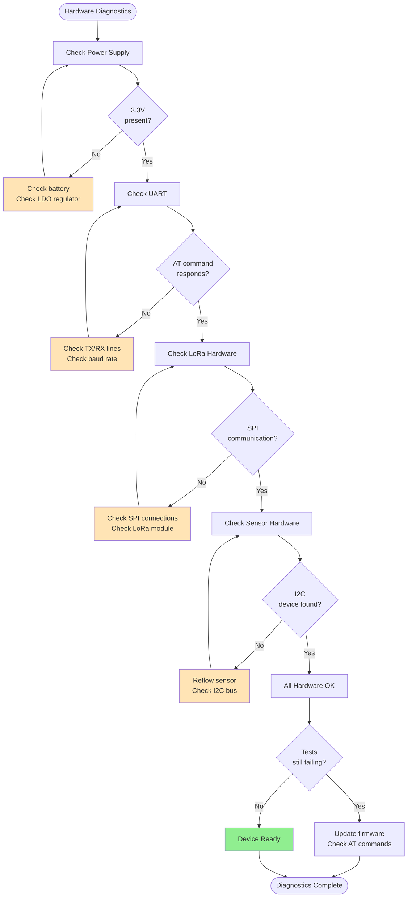

### Hardware Test Checklist

```
□ Power Supply
  □ Battery voltage: 3.0-4.2V ___________V
  □ 3.3V rail: 3.2-3.4V ___________V
  □ Current draw (idle): 20-40mA ___________mA
  □ Current draw (LoRa TX): 120-140mA ___________mA

□ UART Interface
  □ TX line voltage: 0V/3.3V ___________V
  □ RX line voltage: 0V/3.3V ___________V
  □ Baud rate: 115200 ☐ Verified
  □ AT response: OK ☐ Received

□ LoRa Module
  □ SPI CLK signal: Present ☐ Yes ☐ No
  □ CS line toggles: ☐ Yes ☐ No
  □ Module power: 3.3V ___________V
  □ Antenna connected: ☐ Yes ☐ No
  □ TX current surge: ☐ Observed

□ I2C Sensor
  □ Sensor soldered: ☐ Yes ☐ No
  □ SDA pull-up: 4.7kΩ ☐ Verified
  □ SCL pull-up: 4.7kΩ ☐ Verified
  □ I2C address 0x40: ☐ Responds
  □ Sensor power: 3.3V ___________V

□ Overall
  □ All tests passed: ☐ Yes ☐ No
  □ Serial number: _______________________
  □ Test date: ___________  Time: ___________
  □ Operator: _______________________
```

---

## State Diagrams

### Overall Troubleshooting State Machine

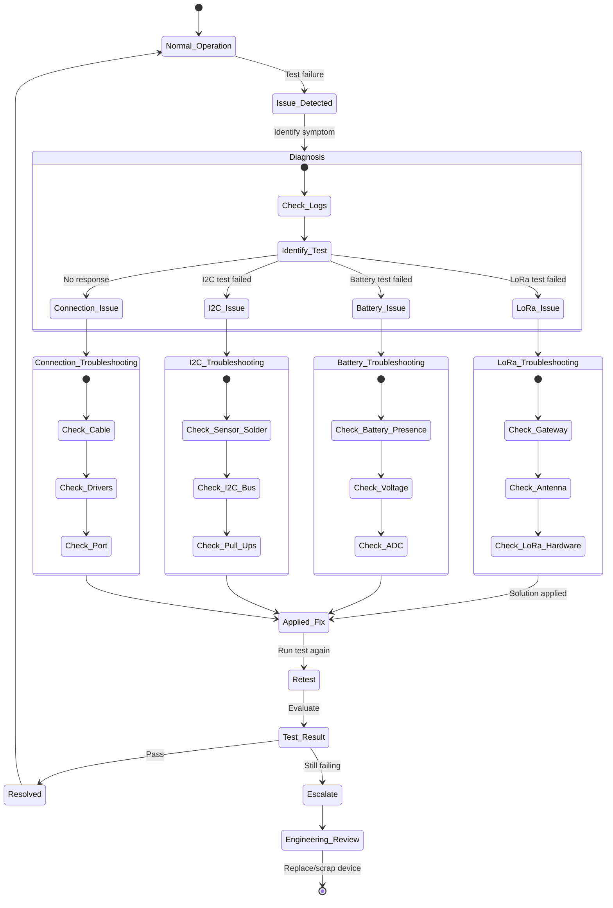

---

## Escalation Procedures

### When to Escalate

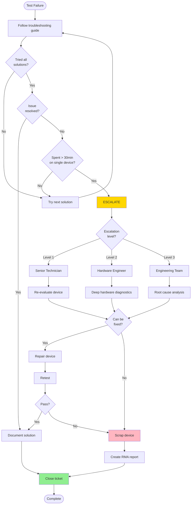

### Escalation Contact Information

| Level | Role | Contact | Response Time | Scope |
|-------|------|---------|---------------|-------|
| **L1** | Senior Test Operator | extension 1234 | 15 minutes | Hardware fixes, retests |
| **L2** | Hardware Engineer | hardware@nube-io.com | 1 hour | PCB debugging, rework |
| **L3** | Engineering Team | engineering@nube-io.com | 4 hours | Firmware, design issues |

### Escalation Report Template

```
ESCALATION REPORT
─────────────────────────────────────────────
Device Type: Droplet
Serial Number: ______________________
Test Date: ______________________
Operator: ______________________

ISSUE SUMMARY:
Test(s) Failed: [ ] LoRa  [ ] Battery  [ ] I2C
Error Message: ______________________
Number of Attempts: ______

TROUBLESHOOTING STEPS TAKEN:
1. ______________________
2. ______________________
3. ______________________
4. ______________________

MEASUREMENTS/OBSERVATIONS:
Battery Voltage: _______V
LoRa Response: ______________________
I2C Address: ______________________
Other Notes: ______________________

RECOMMENDATION:
[ ] Repair (describe): ______________________
[ ] Replace component: ______________________
[ ] Scrap device
[ ] Further investigation required

Escalated To: ______________________
Escalation Time: ______________________
─────────────────────────────────────────────
```

---

## Conclusion

This troubleshooting guide provides comprehensive solutions for all common Droplet factory testing issues. Use the diagnostic flowcharts and state diagrams to systematically identify and resolve problems.

### Quick Tips for Success

✓ **Follow the flowcharts:** They guide you through logical troubleshooting steps  
✓ **Check physical connections first:** Most issues are mechanical  
✓ **Use proper test equipment:** Multimeter, oscilloscope when needed  
✓ **Document all fixes:** Help improve the process  
✓ **Know when to escalate:** Don't waste time on unfixable devices

### Key Metrics

- **Target First-Pass Yield:** > 95%
- **Maximum Troubleshooting Time:** 30 minutes per device
- **Escalation Rate:** < 5% of devices
- **Scrap Rate:** < 2% of devices

---

**End of Droplet Troubleshooting Guide**
