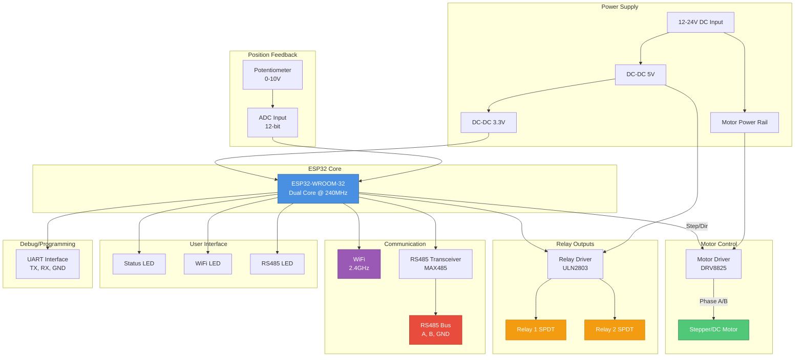
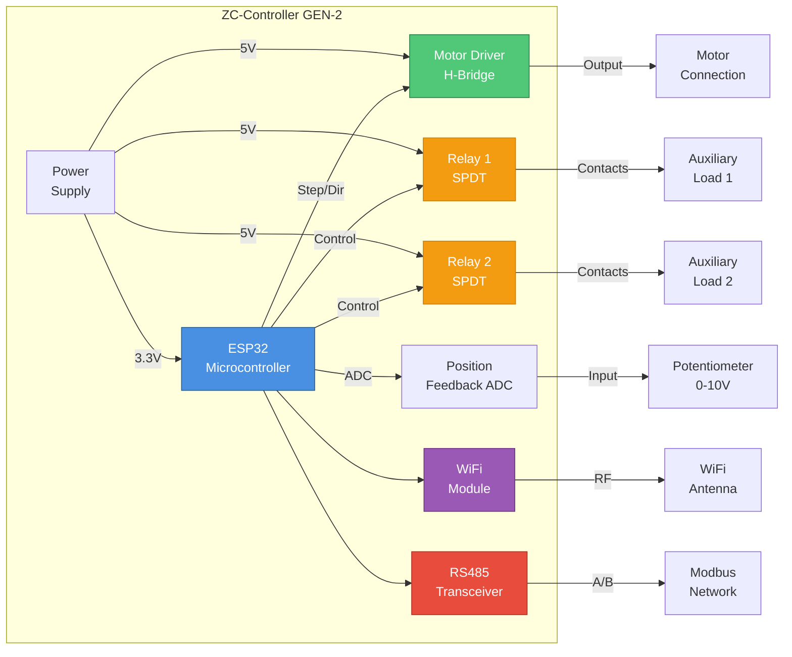
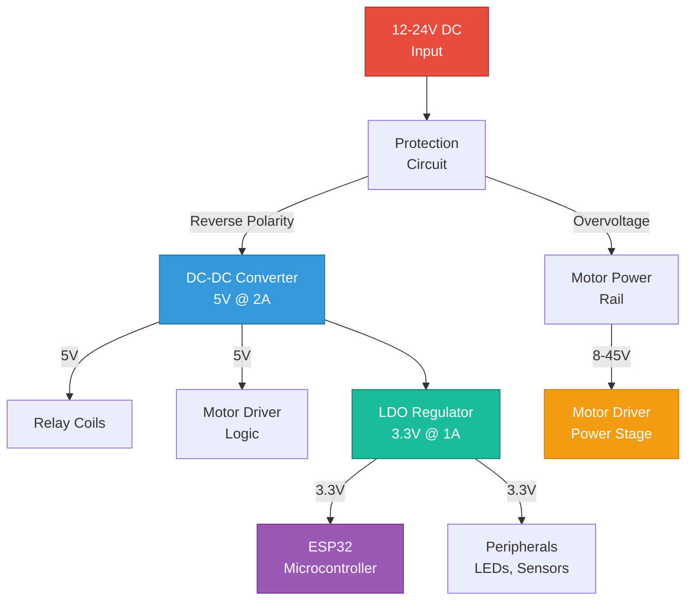
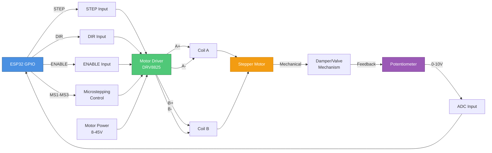
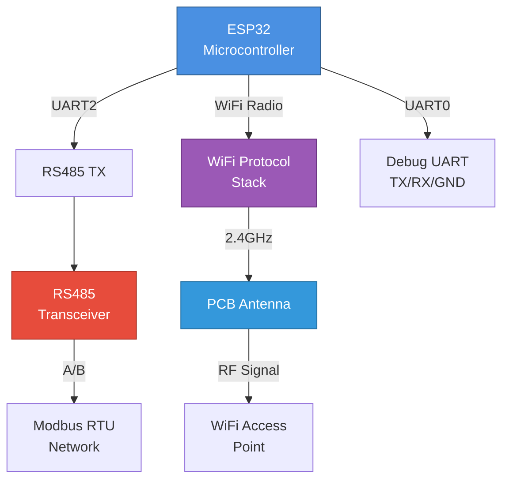

# ZC-Controller Hardware Overview

**Device:** ZC-Controller (Zone Controller - Damper Motor Controller)  
**Generation:** GEN-2  
**Microcontroller:** ESP32-WROOM-32  
**Target Application:** HVAC Damper Control, Valve Actuation  
**Document Type:** Hardware Specifications & Component Architecture  
**Last Updated:** December 9, 2025

---

## 📑 Table of Contents

1. [Device Introduction](#device-introduction)
2. [Hardware Specifications](#hardware-specifications)
3. [Component Architecture](#component-architecture)
4. [Block Diagrams](#block-diagrams)
5. [Interface Specifications](#interface-specifications)
6. [Electrical Characteristics](#electrical-characteristics)
7. [Mechanical Specifications](#mechanical-specifications)
8. [Environmental Ratings](#environmental-ratings)

---

## 🎯 Device Introduction

### Overview

The **ZC-Controller** is a GEN-2 ESP32-based intelligent motor controller designed specifically for HVAC zone control applications. It combines precise stepper/DC motor control, analog position feedback, relay outputs, and industrial communication interfaces (WiFi, RS485) to provide comprehensive damper and valve actuation capabilities for building automation systems.

### Key Differentiators

- **Precision Motor Control:** 0.1% position accuracy with closed-loop feedback
- **Dual Relay Outputs:** Independent SPDT relays for auxiliary control
- **Industrial Connectivity:** RS485 Modbus RTU + WiFi for flexible integration
- **Analog Feedback:** 0-10V position sensor input with 12-bit ADC
- **DIN-Rail Mounting:** Industrial-grade enclosure for panel installation
- **Low Power:** < 5W idle, < 25W peak (motor active)

### Target Market

- VAV (Variable Air Volume) systems
- Chilled beam controllers
- Underfloor air distribution (UFAD)
- Fan coil unit (FCU) automation
- Hydronic valve control
- BMS gateway nodes

---

## ⚙️ Hardware Specifications

### Microcontroller

| Specification | Details |
|---------------|---------|
| **Processor** | ESP32-WROOM-32 (Xtensa dual-core LX6) |
| **Clock Speed** | 240 MHz (dual-core) |
| **Flash Memory** | 4 MB SPI Flash |
| **RAM** | 520 KB SRAM |
| **ROM** | 448 KB ROM |
| **Operating Voltage** | 3.3V (internal logic) |
| **Temperature Range** | -40°C to +85°C (industrial grade) |

### Motor Control Subsystem

| Specification | Details |
|---------------|---------|
| **Motor Driver IC** | DRV8825 or TB6600 equivalent |
| **Motor Type Support** | Stepper (bipolar), DC motor |
| **Control Method** | Step/Direction (stepper), PWM (DC) |
| **Microstepping** | 1, 1/2, 1/4, 1/8, 1/16, 1/32 |
| **Peak Current** | 2.5A per coil |
| **Voltage Range** | 8.2V to 45V (motor supply) |
| **Protection** | Overcurrent, thermal shutdown |

### Position Feedback

| Specification | Details |
|---------------|---------|
| **Input Type** | Analog voltage (potentiometer) |
| **Voltage Range** | 0-10V or 0-5V (jumper selectable) |
| **ADC Resolution** | 12-bit (4096 steps) |
| **ADC Sampling Rate** | 100 Hz |
| **Accuracy** | ±0.5% FSR (Full Scale Range) |
| **Input Impedance** | 100kΩ |

### Relay Outputs

| Specification | Details |
|---------------|---------|
| **Relay Type** | SPDT (Single Pole Double Throw) x 2 |
| **Contact Rating** | 10A @ 250VAC, 10A @ 30VDC |
| **Coil Voltage** | 5V DC (internally supplied) |
| **Switching Time** | < 10ms |
| **Endurance** | 100,000 cycles (resistive load) |
| **Isolation** | 4kV (coil to contact) |

### Communication Interfaces

#### WiFi

| Specification | Details |
|---------------|---------|
| **Standard** | IEEE 802.11 b/g/n |
| **Frequency** | 2.4 GHz (2.412 - 2.484 GHz) |
| **TX Power** | +20 dBm (max) |
| **RX Sensitivity** | -97 dBm @ 11 Mbps |
| **Security** | WPA/WPA2/WPA3 |
| **Antenna** | PCB antenna (internal) |

#### RS485

| Specification | Details |
|---------------|---------|
| **Standard** | EIA-485 (differential) |
| **Baud Rate** | 9600 - 115200 bps |
| **Distance** | Up to 1200m (4000ft) |
| **Nodes** | Up to 32 devices per bus |
| **Protocol** | Modbus RTU |
| **Termination** | 120Ω switchable termination |

#### UART (Debug/Programming)

| Specification | Details |
|---------------|---------|
| **Voltage Level** | 3.3V TTL |
| **Baud Rate** | 115200 bps (default) |
| **Pins** | TX, RX, GND |
| **Protocol** | 8N1 (8 data bits, no parity, 1 stop) |

### Power Supply

| Specification | Details |
|---------------|---------|
| **Input Voltage** | 12-24V DC (wide range) |
| **Idle Current** | < 150 mA @ 24V |
| **Peak Current** | < 1.2A @ 24V (motor active) |
| **Power Consumption** | 5W (idle), 25W (peak) |
| **Protection** | Reverse polarity, overvoltage |
| **Connector** | Screw terminal (2-pin) |

---

## 🏗️ Component Architecture

### System Block Diagram



### Component Diagram (Mermaid)



---

## 📐 Block Diagrams

### Power Distribution Diagram



### Motor Control Subsystem



### Communication Subsystem



---

## 🔌 Interface Specifications

### Terminal Block Pinout

#### Power Input (TB1)

| Pin | Signal | Description |
|-----|--------|-------------|
| 1 | +12-24V | Positive DC input |
| 2 | GND | Ground / Negative |

#### Motor Output (TB2)

| Pin | Signal | Description |
|-----|--------|-------------|
| 1 | A+ | Motor coil A positive |
| 2 | A- | Motor coil A negative |
| 3 | B+ | Motor coil B positive |
| 4 | B- | Motor coil B negative |

#### Position Feedback (TB3)

| Pin | Signal | Description |
|-----|--------|-------------|
| 1 | +10V | Potentiometer supply (+10V) |
| 2 | WIPER | Potentiometer wiper (0-10V) |
| 3 | GND | Potentiometer ground |

#### Relay 1 Output (TB4)

| Pin | Signal | Description |
|-----|--------|-------------|
| 1 | COM | Common contact |
| 2 | NO | Normally open contact |
| 3 | NC | Normally closed contact |

#### Relay 2 Output (TB5)

| Pin | Signal | Description |
|-----|--------|-------------|
| 1 | COM | Common contact |
| 2 | NO | Normally open contact |
| 3 | NC | Normally closed contact |

#### RS485 Interface (TB6)

| Pin | Signal | Description |
|-----|--------|-------------|
| 1 | A (D+) | RS485 differential A |
| 2 | B (D-) | RS485 differential B |
| 3 | GND | Common ground (optional) |

#### Debug/Programming (Header J1)

| Pin | Signal | Description |
|-----|--------|-------------|
| 1 | 3.3V | 3.3V output (limited current) |
| 2 | TX | UART transmit (3.3V level) |
| 3 | RX | UART receive (3.3V level) |
| 4 | GND | Ground |

### Jumper Settings

#### JP1 - Position Feedback Range

| Position | Voltage Range | Application |
|----------|---------------|-------------|
| 1-2 | 0-5V | Standard potentiometer |
| 2-3 | 0-10V | Industrial 0-10V sensor |

#### JP2 - RS485 Termination

| Position | Termination | Use Case |
|----------|-------------|----------|
| OPEN | No termination | Middle of bus |
| CLOSED | 120Ω termination | End of bus |

#### JP3 - Motor Current Limit

| Position | Current Limit | Motor Type |
|----------|---------------|------------|
| 1-2 | 1.0A | Small NEMA 17 |
| 2-3 | 1.5A | Standard NEMA 17 |
| 3-4 | 2.0A | NEMA 23 |
| 4-5 | 2.5A | Large NEMA 23 |

---

## ⚡ Electrical Characteristics

### Absolute Maximum Ratings

| Parameter | Symbol | Min | Max | Unit |
|-----------|--------|-----|-----|------|
| Power supply voltage | VDD | -0.3 | +30 | V |
| Motor supply voltage | VMOT | -0.3 | +50 | V |
| GPIO input voltage | VIO | -0.3 | +3.6 | V |
| Relay contact voltage | VRELAY | - | 250 | VAC |
| Relay contact current | IRELAY | - | 10 | A |
| Operating temperature | TOP | -40 | +85 | °C |
| Storage temperature | TSTG | -55 | +125 | °C |

### Recommended Operating Conditions

| Parameter | Symbol | Min | Typ | Max | Unit |
|-----------|--------|-----|-----|-----|------|
| Power supply voltage | VDD | 12 | 24 | 24 | V |
| Motor supply voltage | VMOT | 8.2 | 24 | 45 | V |
| Logic supply voltage (internal) | VCC | 3.25 | 3.3 | 3.35 | V |
| Operating temperature | TOP | -20 | +25 | +70 | °C |
| Humidity (non-condensing) | RH | 10 | 50 | 90 | % |

### Power Consumption

| Operating Mode | Typical | Maximum | Notes |
|----------------|---------|---------|-------|
| Idle (WiFi off) | 120 mA @ 24V | 150 mA | No motor movement |
| WiFi active | 180 mA @ 24V | 250 mA | WiFi connected, no motor |
| Motor running (full step) | 800 mA @ 24V | 1200 mA | Stepper motor at 2A |
| Motor running (microstepping) | 600 mA @ 24V | 900 mA | 1/16 microstep |
| Relay coil energized (one) | +45 mA | +60 mA | Per relay activated |

### Motor Driver Specifications

| Parameter | Min | Typ | Max | Unit |
|-----------|-----|-----|-----|------|
| Output current per coil | - | - | 2.5 | A |
| Microstepping resolution | 1 | - | 1/32 | step |
| Step pulse width | 1.9 | - | - | µs |
| Direction setup time | 650 | - | - | ns |
| Thermal shutdown temp | - | 150 | 175 | °C |

---

## 📏 Mechanical Specifications

### Enclosure Dimensions

| Dimension | Value | Unit |
|-----------|-------|------|
| Width | 90 | mm |
| Height | 58 | mm |
| Depth | 65 | mm |
| DIN-rail compatibility | 35mm | standard |
| Weight | 185 | grams |

### Physical Construction

- **Enclosure Material:** ABS plastic (flame retardant, UL94-V0)
- **Terminal Blocks:** Pluggable screw terminals, 5.08mm pitch
- **Mounting:** DIN-rail clip (35mm standard rail)
- **LED Indicators:** 3x status LEDs (visible through front panel)
- **Antenna:** Internal PCB antenna (no external antenna required)

### Mounting Hole Pattern

```
┌─────────────────────────────────────┐
│                                     │
│  ○                               ○  │  ← Mounting holes (M3)
│                                     │     80mm spacing
│  [  DIN-RAIL CLIP  ]                │
│                                     │
│  ○                               ○  │
│                                     │
└─────────────────────────────────────┘
     ↑                           ↑
   10mm                        10mm
   (from edge)                (from edge)
```

---

## 🌡️ Environmental Ratings

### Operating Environment

| Parameter | Rating | Standard |
|-----------|--------|----------|
| Operating Temperature | -20°C to +70°C | IEC 60068-2-1, 60068-2-2 |
| Storage Temperature | -40°C to +85°C | IEC 60068-2-1, 60068-2-2 |
| Humidity | 10% to 90% RH (non-condensing) | IEC 60068-2-78 |
| Altitude | Up to 2000m | IEC 61010-1 |

### Protection Ratings

| Protection | Rating | Description |
|------------|--------|-------------|
| Ingress Protection | IP20 | Protected against solid objects > 12.5mm |
| Pollution Degree | 2 | Normal indoor environment |
| Installation Category | II | Equipment connected to mains supply |

### Compliance & Certifications

| Standard | Status | Description |
|----------|--------|-------------|
| CE | Compliant | European conformity |
| FCC Part 15 | Compliant | Radio frequency emissions (USA) |
| RoHS | Compliant | Restriction of hazardous substances |
| REACH | Compliant | Chemical safety regulation (EU) |
| UL 508 | Pending | Industrial control equipment |

---

## 🔧 Installation Guidelines

### DIN-Rail Mounting

1. **Position the device** on the DIN-rail (35mm standard)
2. **Tilt forward** to engage the top clip
3. **Press down** firmly until bottom clip locks
4. **Pull forward** gently to verify secure mounting

### Wiring Best Practices

#### Power Wiring
- Use 18-22 AWG wire for 12-24V DC supply
- Observe polarity: Pin 1 (+), Pin 2 (-)
- Install external fuse (3A) on positive wire
- Keep power wires away from RS485 and feedback signals

#### Motor Wiring
- Use shielded cable for motor connections (minimize EMI)
- Wire gauge: 20-24 AWG for stepper motors < 2A
- Maximum cable length: 3 meters (to minimize inductance)
- Connect shield to ground at controller end only

#### Position Feedback Wiring
- Use shielded twisted-pair cable
- Maximum cable length: 50 meters
- Connect shield to GND at controller end only
- Avoid routing near power wires or relay outputs

#### RS485 Wiring
- Use twisted-pair cable (characteristic impedance 120Ω)
- Maximum bus length: 1200 meters
- Terminate both ends of bus with 120Ω resistor
- Use star-quad cable for noisy environments

#### Relay Wiring
- Maximum wire gauge: 14 AWG (for 10A rating)
- Use snubber circuit for inductive loads (diode or RC)
- Separate relay wiring from low-voltage signals
- Observe contact ratings: 10A @ 250VAC or 30VDC

---

## 📊 Performance Characteristics

### Motor Control Performance

| Parameter | Value | Notes |
|-----------|-------|-------|
| Position accuracy | ±0.1% | With closed-loop feedback |
| Maximum speed | 2000 steps/sec | Full step mode |
| Acceleration | Adjustable | 100-5000 steps/sec² |
| Holding torque | Motor dependent | Up to 3 Nm (NEMA 23) |
| Response time | < 50ms | Command to first step |

### Position Feedback Performance

| Parameter | Value | Notes |
|-----------|-------|-------|
| Resolution | 0.024% | 12-bit ADC (4096 steps) |
| Sampling rate | 100 Hz | 10ms update interval |
| Accuracy | ±0.5% FSR | Full scale range |
| Linearity | ±1% | Over full range |
| Noise (RMS) | < 0.1% | At 0-10V range |

### Communication Performance

#### WiFi
- **Throughput:** Up to 20 Mbps (TCP/IP)
- **Range:** 50m indoor, 100m outdoor (line of sight)
- **Latency:** < 50ms (local network)
- **Reconnection time:** < 5 seconds (after disconnect)

#### RS485/Modbus
- **Transaction rate:** 20-30 requests/second @ 115200 baud
- **Response time:** < 10ms (register read/write)
- **Error rate:** < 0.01% (with proper termination)

---

## 🛠️ Maintenance & Lifecycle

### Maintenance Schedule

| Interval | Task |
|----------|------|
| Weekly | Visual inspection (LEDs, connections) |
| Monthly | Check terminal block torque |
| Quarterly | Clean dust from enclosure |
| Annually | Relay endurance check (cycle test) |
| Bi-annually | Calibrate position feedback |

### Expected Lifecycle

| Component | Expected Lifetime |
|-----------|-------------------|
| ESP32 microcontroller | 10+ years |
| Motor driver | 10+ years |
| Relays | 100,000 cycles (resistive load) |
| Power supply | 50,000+ hours |
| Terminal blocks | 1000+ mating cycles |

---

## 📚 References

### Datasheets

- ESP32-WROOM-32 Datasheet (Espressif Systems)
- DRV8825 Stepper Motor Driver Datasheet (Texas Instruments)
- MAX485 RS485 Transceiver Datasheet (Maxim Integrated)
- ULN2803 Darlington Array Datasheet (STMicroelectronics)

### Standards

- IEC 61131-2: Programmable Controllers - Equipment Requirements
- IEC 60068: Environmental Testing
- IEC 61010-1: Safety Requirements for Electrical Equipment
- EIA-485: Standard for Electrical Characteristics of Generators and Receivers

### Related Documentation

- [ZCController-README.md](./ZCController-README.md) - Master device index
- [ZCController-Sequence.md](./ZCController-Sequence.md) - Test sequence diagrams
- [ZCController-TestCases.md](./ZCController-TestCases.md) - Test procedures
- [ZCController-SourceCode.md](./ZCController-SourceCode.md) - Software manual
- [ZCController-Troubleshooting.md](./ZCController-Troubleshooting.md) - Diagnostic guide

---

**End of ZC-Controller Hardware Overview**
