# ZC-Controller Test Sequence Diagrams

**Device:** ZC-Controller (Zone Controller - Damper Motor Controller)  
**Generation:** GEN-2  
**Document Type:** Test Execution Flows & Message Sequences  
**Last Updated:** December 9, 2025

---

## 📑 Table of Contents

1. [Overview](#overview)
2. [Test Execution Flow](#test-execution-flow)
3. [WiFi Test Sequences](#wifi-test-sequences)
4. [RS485 Test Sequences](#rs485-test-sequences)
5. [Motor Control Test Sequences](#motor-control-test-sequences)
6. [Position Feedback Test Sequences](#position-feedback-test-sequences)
7. [Relay Test Sequences](#relay-test-sequences)
8. [Error Handling Sequences](#error-handling-sequences)
9. [State Diagrams](#state-diagrams)

---

## 📋 Overview

This document provides comprehensive sequence diagrams for the ZC-Controller factory testing process. Each diagram illustrates the message flow, timing, and decision logic for test execution.

### Diagram Legend


---

## 🔄 Test Execution Flow

### Master Test Sequence


### Test Initialization Sequence


---

## 📡 WiFi Test Sequences

### WiFi Network Scan Sequence


### WiFi Connection Sequence


### WiFi Signal Strength Test


---

## 🔌 RS485 Test Sequences

### RS485 Loopback Test

```mermaid
sequenceDiagram
    participant FT as Factory Testing
    participant DUT as ZC-Controller
    participant RS485 as RS485 Transceiver
    participant LOOP as External Loopback
    
    FT->>DUT: {cmd: "rs485_test", mode: "loopback"}
    activate DUT
    
    DUT->>RS485: Enable Transmitter
    activate RS485
    
    DUT->>RS485: Send Test Pattern: 0x55 0xAA
    RS485->>LOOP: Transmit on A/B lines
    
    Note over LOOP: A and B shorted<br/>externally
    
    LOOP-->>RS485: Echo on A/B lines
    
    RS485->>DUT: Receive: 0x55 0xAA
    deactivate RS485
    
    DUT->>DUT: Compare Sent vs Received
    
    alt Data Match
        DUT-->>FT: {result: "PASS", status: 0}
    else Data Mismatch
        DUT-->>FT: {result: "FAIL", status: 1, error: "Loopback failed"}
    end
    
    deactivate DUT
```

### RS485 Modbus RTU Test


### RS485 Timing Diagram

```mermaid
sequenceDiagram
    participant TX as Transmitter
    participant BUS as RS485 Bus
    participant RX as Receiver
    
    Note over TX,RX: Idle State (Mark)
    
    TX->>BUS: Start Bit (Space)
    Note right of TX: t = 0 µs
    
    TX->>BUS: Data Bit 0
    Note right of TX: t = 8.68 µs (115200 baud)
    
    TX->>BUS: Data Bit 1
    TX->>BUS: Data Bit 2
    TX->>BUS: Data Bit 3
    TX->>BUS: Data Bit 4
    TX->>BUS: Data Bit 5
    TX->>BUS: Data Bit 6
    TX->>BUS: Data Bit 7
    
    TX->>BUS: Stop Bit (Mark)
    Note right of TX: t = 86.8 µs
    
    BUS->>RX: Propagated Signal (< 1 µs delay)
    
    RX->>RX: Sample Data Bits
    RX->>RX: Validate Stop Bit
    
    Note over TX,RX: Byte Transmitted Successfully
```



---

## 🎛️ Motor Control Test Sequences

### Motor Position Command Sequence


### Motor Calibration Sequence


### Motor Speed Profile

```mermaid
sequenceDiagram
    participant MOTOR_CTL as Motor Controller
    participant ACCEL as Acceleration Profile
    participant MOTOR as Motor Driver
    
    Note over MOTOR_CTL,MOTOR: Movement Start
    
    MOTOR_CTL->>ACCEL: Calculate Profile
    Note right of ACCEL: Acceleration: 1000 steps/s²<br/>Max Speed: 2000 steps/s<br/>Deceleration: 1000 steps/s²
    
    activate ACCEL
    
    loop Acceleration Phase (0-2s)
        ACCEL->>MOTOR: Step Pulse (increasing frequency)
        Note right of ACCEL: Speed: 0 → 2000 steps/s
    end
    
    loop Constant Speed Phase (2-8s)
        ACCEL->>MOTOR: Step Pulse (constant frequency)
        Note right of ACCEL: Speed: 2000 steps/s
    end
    
    loop Deceleration Phase (8-10s)
        ACCEL->>MOTOR: Step Pulse (decreasing frequency)
        Note right of ACCEL: Speed: 2000 → 0 steps/s
    end
    
    ACCEL->>MOTOR_CTL: Movement Complete
    deactivate ACCEL
    
    Note over MOTOR_CTL,MOTOR: Target Position Reached
```



---

## 📊 Position Feedback Test Sequences

### Analog Position Feedback Sequence


### Position Feedback Calibration


### Feedback Noise Analysis


---

## 🔌 Relay Test Sequences

### Relay Toggle Test


### Relay Endurance Test


### Relay Timing Measurement


---

## ⚠️ Error Handling Sequences

### Communication Timeout Handling


### Device Not Found Error

```mermaid
sequenceDiagram
    participant UI as Test Operator
    participant FT as Factory Testing
    participant UART as Serial Port
    participant DUT as ZC-Controller
    
    UI->>FT: Connect to Device
    activate FT
    
    FT->>UART: Open Serial Port (COM3)
    activate UART
    
    UART->>UART: Check Port Availability
    
    alt Port Not Available
        UART-->>FT: error: "Port in use or not found"
        deactivate UART
        FT-->>UI: Error: "Cannot open COM3"
        
        FT->>FT: Suggest Actions
        FT-->>UI: "1. Check COM port in Device Manager<br/>2. Close other applications<br/>3. Reconnect USB adapter"
    else Port Available
        UART-->>FT: port_opened
        
        FT->>DUT: {cmd: "ping"}
        
        activate DUT
        Note over DUT: Device Powered Off<br/>or Not Connected
        deactivate DUT
        
        FT->>FT: Wait for Response (5 seconds)
        
        alt No Response
            FT-->>UI: Error: "Device not responding"
            FT->>FT: Suggest Actions
            FT-->>UI: "1. Check power supply (12-24V)<br/>2. Verify UART connections<br/>3. Check RX/TX not swapped"
        else Response Received
            DUT-->>FT: {status: "pong"}
            FT-->>UI: Connected Successfully
        end
        
        deactivate UART
    end
    
    deactivate FT
```

### Test Failure Recovery

```mermaid
sequenceDiagram
    participant FT as Factory Testing
    participant DUT as ZC-Controller
    participant RECOVERY as Recovery Handler
    
    FT->>DUT: {cmd: "motor_test"}
    activate FT
    activate DUT
    
    DUT-->>FT: {result: "FAIL", error: "Motor stuck"}
    deactivate DUT
    
    FT->>RECOVERY: Handle Test Failure
    activate RECOVERY
    
    RECOVERY->>RECOVERY: Analyze Error Type
    Note right of RECOVERY: Error: "Motor stuck"<br/>Category: Hardware Fault
    
    RECOVERY->>RECOVERY: Determine Recovery Action
    
    alt Recoverable Error
        RECOVERY->>DUT: {cmd: "motor_reset"}
        activate DUT
        DUT->>DUT: Reset Motor Controller
        DUT->>DUT: Home Motor
        DUT-->>RECOVERY: {status: "reset_complete"}
        deactivate DUT
        
        RECOVERY->>FT: Retry Test (Attempt 2 of 3)
        FT->>DUT: {cmd: "motor_test"}
        activate DUT
        DUT-->>FT: {result: "PASS", position: 50.1}
        deactivate DUT
        
        RECOVERY-->>FT: Recovery Successful
    else Non-Recoverable Error
        RECOVERY->>RECOVERY: Log Failure Details
        RECOVERY-->>FT: Recovery Not Possible
        
        FT->>FT: Mark Test as FAIL
        FT->>FT: Suggest Manual Inspection
    end
    
    deactivate RECOVERY
    deactivate FT
```

---

## 🔄 State Diagrams

### Device Connection State Machine

```mermaid
stateDiagram-v2
    [*] --> Disconnected
    
    Disconnected --> Connecting : User clicks "Connect"
    Connecting --> Connected : Connection success
    Connecting --> Error : Connection failed
    Error --> Disconnected : Retry
    
    Connected --> ReadingInfo : User clicks "Read Info"
    ReadingInfo --> InfoReady : Info received
    ReadingInfo --> Error : Timeout
    InfoReady --> Connected : Continue
    
    Connected --> Testing : User clicks "Run Tests"
    Testing --> TestComplete : All tests done
    Testing --> Error : Test error
    TestComplete --> Connected : View results
    
    Connected --> Disconnecting : User clicks "Disconnect"
    Disconnecting --> Disconnected : Port closed
    
    Error --> [*] : Fatal error
```

### Test Execution State Machine

```mermaid
stateDiagram-v2
    [*] --> Idle
    
    Idle --> WiFiTest : Start tests
    WiFiTest --> RS485Test : WiFi PASS
    WiFiTest --> Failed : WiFi FAIL
    
    RS485Test --> MotorTest : RS485 PASS
    RS485Test --> Failed : RS485 FAIL
    
    MotorTest --> FeedbackTest : Motor PASS
    MotorTest --> Failed : Motor FAIL
    
    FeedbackTest --> Relay1Test : Feedback PASS
    FeedbackTest --> Failed : Feedback FAIL
    
    Relay1Test --> Relay2Test : Relay1 PASS
    Relay1Test --> Failed : Relay1 FAIL
    
    Relay2Test --> Passed : Relay2 PASS
    Relay2Test --> Failed : Relay2 FAIL
    
    Passed --> SavingResults : Save results
    SavingResults --> Idle : Results saved
    
    Failed --> Idle : Abort tests
```

### Motor Control State Machine

```mermaid
stateDiagram-v2
    [*] --> Stopped
    
    Stopped --> Homing : Calibrate command
    Homing --> Stopped : Home complete
    Homing --> Error : Home failed
    
    Stopped --> Accelerating : Move command
    Accelerating --> Running : Target speed reached
    Running --> Decelerating : Near target position
    Decelerating --> Stopped : Target reached
    
    Accelerating --> Error : Motor fault
    Running --> Error : Motor fault
    Decelerating --> Error : Motor fault
    
    Error --> Stopped : Reset command
    Error --> [*] : Fatal error
```

### Relay State Machine

```mermaid
stateDiagram-v2
    [*] --> OFF
    
    OFF --> Energizing : Set ON command
    Energizing --> ON : Coil energized (8ms)
    
    ON --> De_energizing : Set OFF command
    De_energizing --> OFF : Coil de-energized (5ms)
    
    Energizing --> Error : Coil fault
    De_energizing --> Error : Contact stuck
    
    Error --> OFF : Reset
    Error --> [*] : Replace relay
```

---

## 📚 References

### Related Documentation

- [ZCController-README.md](./ZCController-README.md) - Master device index
- [ZCController-Overview.md](./ZCController-Overview.md) - Hardware specifications
- [ZCController-TestCases.md](./ZCController-TestCases.md) - Test procedures
- [ZCController-SourceCode.md](./ZCController-SourceCode.md) - Software manual
- [ZCController-Troubleshooting.md](./ZCController-Troubleshooting.md) - Diagnostic guide

---

**End of ZC-Controller Test Sequence Diagrams**
