# ZC-Controller Source Code Manual

**Device:** ZC-Controller (Zone Controller - Damper Motor Controller)  
**Generation:** GEN-2  
**Document Type:** SOFTWARE MANUAL - Class Diagrams & Method Documentation  
**Last Updated:** December 9, 2025

---

## 📑 Table of Contents

1. [Software Architecture Overview](#software-architecture-overview)
2. [Class Diagrams](#class-diagrams)
3. [Module Documentation](#module-documentation)
4. [API Reference](#api-reference)
5. [Communication Protocol](#communication-protocol)
6. [State Management](#state-management)
7. [Test Command Reference](#test-command-reference)

---

## 🏗️ Software Architecture Overview

### System Architecture


### Software Layers

| Layer | Responsibility | Key Components |
|-------|----------------|----------------|
| **Application** | Test UI, user interaction | FactoryTestingPage.js |
| **Service** | Test orchestration, data handling | factory-testing.js |
| **Communication** | UART protocol, message serialization | Serial port service |
| **Firmware - Command** | Parse commands, route to handlers | Command parser |
| **Firmware - Test** | Execute tests, collect results | Test manager |
| **Firmware - HAL** | Hardware abstraction | WiFi, RS485, Motor, ADC, Relay drivers |
| **Hardware** | Physical interfaces | ESP32, peripherals |

---

## Detailed Code Execution Flow

### Complete Execution Trace: Start Test Button Click (ZC-Controller)

This diagram shows the **complete call stack** with exact file locations and line numbers:

```mermaid
sequenceDiagram
    participant User
    participant UI as FactoryTestingPage.js<br/>Line 300-450
    participant Module as FactoryTestingModule.js<br/>Line 50-100
    participant IPC as Electron IPC
    participant Main as main.js<br/>Line 1390-1444
    participant Service as factory-testing.js<br/>ZC-Controller tests
    participant Serial as SerialPort
    participant Device as ZC-Controller Hardware
    
    User->>UI: Click "Start Test"
    UI->>UI: handleRunTests()<br/>Line 300
    UI->>Module: runTests({ device: 'ZC-Controller' })<br/>Line 330
    Module->>IPC: invoke('factory-testing:run-tests')<br/>Line 65
    
    Note over IPC: Renderer → Main
    
    IPC->>Main: Handler triggered<br/>Line 1420
    Main->>Service: connect(portPath)<br/>Line 1425
    Service->>Serial: new SerialPort(...)<br/>Line 175
    Serial-->>Service: 'open' event<br/>Line 189
    
    Main->>Service: runFactoryTests('v2', 'ZC-Controller', ...)<br/>Line 1430
    Note over Service: ZC-Controller branch
    
    Service->>Service: Initialize resultsZCC
    
    Note over Service,Device: TC-001: WiFi Test
    Service->>Service: awaitTestJSONResult('test_wifi')
    Service->>Serial: write('test_wifi\r\n')
    Serial->>Device: UART TX
    Device-->>Serial: {"result":"done","networks":8}
    Service->>Service: _normalizeWifiResult()
    Service->>Service: resultsZCC.tests.wifi = {...}
    
    Note over Service,Device: TC-002: RS485 Test
    Service->>Service: awaitTestJSONResult('test_rs485')
    Serial->>Device: UART TX
    Device-->>Serial: RS485 loopback result
    Service->>Service: resultsZCC.tests.rs485 = {...}
    
    Note over Service,Device: TC-003: Motor Test
    Service->>Service: awaitTestJSONResult('test_motor')
    Serial->>Device: UART TX
    Note over Device: Move motor 0% → 100% → 0%
    Device-->>Serial: {"position":"OK","steps":200}
    Service->>Service: resultsZCC.tests.motor = {...}
    
    Note over Service,Device: TC-004: Feedback Test
    Service->>Service: awaitTestJSONResult('test_feedback')
    Serial->>Device: UART TX
    Device-->>Serial: ADC readings (0-3.3V)
    Service->>Service: resultsZCC.tests.feedback = {...}
    
    Note over Service,Device: TC-005: Relay Tests
    Service->>Service: awaitTestJSONResult('test_relay1')
    Serial->>Device: UART TX (relay ON/OFF)
    Device-->>Serial: Relay 1 state confirmed
    Service->>Service: resultsZCC.tests.relay1 = {...}
    
    Service->>Service: awaitTestJSONResult('test_relay2')
    Serial->>Device: UART TX (relay ON/OFF)
    Device-->>Serial: Relay 2 state confirmed
    Service->>Service: resultsZCC.tests.relay2 = {...}
    
    Service->>Service: Calculate overall pass/fail
    Service->>Service: return resultsZCC
    
    Service-->>Main: { success: true, data: results }
    Main->>Service: disconnect()<br/>Line 1435
    Main-->>IPC: return results<br/>Line 1440
    
    Note over IPC: Main → Renderer
    
    IPC-->>Module: Promise resolved
    Module-->>UI: results
    UI->>UI: setState({ results })<br/>Line 380
    UI->>UI: renderResults()<br/>Line 650
    UI->>User: Display test results
```



### Stack Trace: ZC-Controller Test Execution

```
User clicks "Start Test"
  ↓
[UI] FactoryTestingPage.js:300 handleRunTests()
  ↓
[UI] FactoryTestingModule.js:65 ipcRenderer.invoke()
  ━━━━━━━━━━━━━━━━━━━━━━━━━━━━━━━━━━━━━━━━━━━━━━━━━━━━━━━━━━━
  IPC BOUNDARY
  ━━━━━━━━━━━━━━━━━━━━━━━━━━━━━━━━━━━━━━━━━━━━━━━━━━━━━━━━━━━
  ↓
[Main] main.js:1420 ipcMain.handle()
  ↓
[Service] factory-testing.js:159 connect()
  ↓
[Service] factory-testing.js:1032 runFactoryTests()
  ↓
[Service] if (device === 'ZC-Controller')
  ↓
[Service] Initialize resultsZCC
  ↓
━━━━━━━━━━━━━━━━━━━━━━━━━━━━━━━━━━━━━━━━━━━━━━━━━━━━━━━━━━━
Test Sequence: WiFi → RS485 → Motor → Feedback → Relay1 → Relay2
━━━━━━━━━━━━━━━━━━━━━━━━━━━━━━━━━━━━━━━━━━━━━━━━━━━━━━━━━━━
  ↓
[Service] awaitTestJSONResult('test_wifi')
  ↓
[Service] _normalizeWifiResult()
  ↓
[Service] awaitTestJSONResult('test_rs485')
  ↓
[Service] awaitTestJSONResult('test_motor')
  ↓
[Hardware] Motor control sequence:
  │  - Set position to 0% (fully closed)
  │  - Move to 100% (fully open)
  │  - Return to 0%
  │  - Verify position feedback
  ↓
[Service] awaitTestJSONResult('test_feedback')
  ↓
[Hardware] Read ADC for position feedback
  ↓
[Service] awaitTestJSONResult('test_relay1')
  ↓
[Hardware] Toggle relay 1 (ON → OFF)
  ↓
[Service] awaitTestJSONResult('test_relay2')
  ↓
[Hardware] Toggle relay 2 (ON → OFF)
  ↓
[Service] Calculate pass/fail
  ↓
[Service] return resultsZCC
```

### Motor Test - Detailed Flow

```
[Service] awaitTestJSONResult('test_motor')
  ↓
[Service] port.write('test_motor\r\n')
  ↓
[Hardware - ZC-Controller] Receive command
  ↓
[Hardware - Firmware] Initialize motor driver
  ↓
[Hardware - Firmware] Set motor speed (default: medium)
  ↓
[Hardware - Firmware] Position: 0% (fully closed)
  │  - Set target position: 0%
  │  - Enable motor
  │  - Wait for completion
  │  - Read position feedback from ADC
  │  - Verify: position ≈ 0% (within tolerance)
  ↓
[Hardware - Firmware] Position: 100% (fully open)
  │  - Set target position: 100%
  │  - Enable motor
  │  - Step motor forward (e.g., 200 steps)
  │  - Wait for completion (~2-3 seconds)
  │  - Read position feedback from ADC
  │  - Verify: position ≈ 100% (within tolerance)
  ↓
[Hardware - Firmware] Position: 0% (return home)
  │  - Set target position: 0%
  │  - Enable motor
  │  - Step motor backward (200 steps)
  │  - Wait for completion
  │  - Read position feedback
  │  - Verify: position ≈ 0%
  ↓
[Hardware - Firmware] Disable motor
  ↓
[Hardware - Firmware] Build response JSON:
  │  {
  │    "result": "done",
  │    "status": "OK",
  │    "position": "OK",
  │    "steps": 200,
  │    "feedback": [0.05, 3.25, 0.08],
  │    "duration_ms": 4500
  │  }
  ↓
[Hardware - Firmware] Send via UART
  ↓
[Service] JSON.parse(response)
  ↓
[Service] Check: parsed.status === 'OK'
  ↓
[Service] Store in resultsZCC.tests.motor
```

---

## 📊 Class Diagrams

### Class Diagram: EOL Toolkit (Host PC)


### Class Diagram: ZC-Controller Firmware


### Class Diagram: Motor Control Subsystem


---

## 📚 Module Documentation

### Module: CommandParser (Firmware)

**File:** `src/command_parser.cpp`  
**Purpose:** Parse JSON commands from UART, route to appropriate handlers

#### Class: CommandParser

```cpp
class CommandParser {
private:
    String rxBuffer;
    StaticJsonDocument<512> jsonDoc;
    
    bool isValidJson(const String& data);
    void sendResponse(JsonObject response);
    
public:
    void init();
    bool parseCommand(const String& data);
    String getCommandType();
    JsonObject getCommandParams();
};
```

#### Methods

**`void init()`**
- **Description:** Initialize command parser, clear buffers
- **Parameters:** None
- **Returns:** void
- **Example:**
  ```cpp
  CommandParser parser;
  parser.init();
  ```

**`bool parseCommand(const String& data)`**
- **Description:** Parse incoming JSON command
- **Parameters:**
  - `data` - JSON string from UART
- **Returns:** `true` if valid JSON, `false` otherwise
- **Example:**
  ```cpp
  String cmd = "{\"cmd\":\"wifi_test\"}";
  if (parser.parseCommand(cmd)) {
      String cmdType = parser.getCommandType();
  }
  ```

**`String getCommandType()`**
- **Description:** Get command type from parsed JSON
- **Parameters:** None
- **Returns:** Command type string (e.g., "wifi_test")
- **Example:**
  ```cpp
  String cmdType = parser.getCommandType();
  if (cmdType == "motor_test") {
      // Handle motor test
  }
  ```

**`JsonObject getCommandParams()`**
- **Description:** Get command parameters as JSON object
- **Parameters:** None
- **Returns:** JsonObject containing parameters
- **Example:**
  ```cpp
  JsonObject params = parser.getCommandParams();
  int targetPos = params["position"];
  ```

**`void sendResponse(JsonObject response)`**
- **Description:** Serialize JSON and send via UART
- **Parameters:**
  - `response` - JSON object to send
- **Returns:** void
- **Example:**
  ```cpp
  StaticJsonDocument<256> doc;
  doc["test"] = "wifi";
  doc["result"] = "PASS";
  parser.sendResponse(doc.as<JsonObject>());
  ```

---

### Module: TestManager (Firmware)

**File:** `src/test_manager.cpp`  
**Purpose:** Execute factory tests, orchestrate hardware drivers

#### Class: TestManager

```cpp
class TestManager {
private:
    enum TestState { IDLE, RUNNING, COMPLETE, ERROR };
    TestState currentState;
    String currentTest;
    
    WiFiDriver* wifi;
    RS485Driver* rs485;
    MotorController* motor;
    PositionFeedback* feedback;
    RelayDriver* relay;
    
    void reportResult(JsonObject result);
    
public:
    void init();
    void executeTest(const String& testName, JsonObject params);
    void runWiFiTest();
    void runRS485Test(const String& mode);
    void runMotorTest(float targetPosition);
    void runFeedbackTest();
    void runRelayTest(int relayNum, const String& state);
};
```

#### Methods

**`void executeTest(const String& testName, JsonObject params)`**
- **Description:** Execute specified test with parameters
- **Parameters:**
  - `testName` - Name of test ("wifi_test", "motor_test", etc.)
  - `params` - Test parameters (position, mode, etc.)
- **Returns:** void
- **Side Effects:** Sends JSON response via UART
- **Example:**
  ```cpp
  StaticJsonDocument<128> params;
  params["position"] = 50;
  testMgr.executeTest("motor_test", params.as<JsonObject>());
  ```

**`void runWiFiTest()`**
- **Description:** Execute WiFi scan and connection test
- **Procedure:**
  1. Call `wifi->scan()`
  2. Count networks found
  3. Attempt connection to test SSID
  4. Report results
- **Response Format:**
  ```json
  {
    "test": "wifi",
    "result": "PASS",
    "networks": 5,
    "connected": 1,
    "rssi": -45,
    "ip": "192.168.1.100"
  }
  ```

**`void runMotorTest(float targetPosition)`**
- **Description:** Command motor to target position, verify arrival
- **Parameters:**
  - `targetPosition` - Target position (0-100%)
- **Procedure:**
  1. Call `motor->moveToPosition(targetPosition)`
  2. Poll `motor->getPosition()` until complete
  3. Read final position from `feedback->readPosition()`
  4. Calculate error
  5. Report results
- **Response Format:**
  ```json
  {
    "test": "motor_movement",
    "result": "PASS",
    "target_position": 50,
    "actual_position": 50.1,
    "position_error": 0.1,
    "movement_time_ms": 11200
  }
  ```

**`void runRelayTest(int relayNum, const String& state)`**
- **Description:** Toggle relay and verify state
- **Parameters:**
  - `relayNum` - Relay number (1 or 2)
  - `state` - Desired state ("ON" or "OFF")
- **Procedure:**
  1. Call `relay->setRelay(relayNum, state == "ON")`
  2. Wait 100ms for debounce
  3. Read back state with `relay->getRelay(relayNum)`
  4. Report results
- **Response Format:**
  ```json
  {
    "test": "relay_toggle",
    "result": "PASS",
    "relay": 1,
    "state": "ON"
  }
  ```

---

### Module: MotorController (Firmware)

**File:** `src/motor_controller.cpp`  
**Purpose:** High-level motor control with closed-loop feedback

#### Class: MotorController

```cpp
class MotorController {
private:
    MotorDriver motor;
    PositionFeedback feedback;
    PIDController pid;
    AccelerationProfile accel;
    
    enum ControlMode { OPEN_LOOP, CLOSED_LOOP };
    ControlMode mode;
    
    float currentPosition;
    float targetPosition;
    bool isMoving;
    
    void updatePID();
    
public:
    void init();
    void moveToPosition(float position);
    float getPosition();
    void calibrate();
    void enableClosedLoop();
    void disableClosedLoop();
    void home();
};
```

#### Methods

**`void moveToPosition(float position)`**
- **Description:** Move motor to target position with closed-loop control
- **Parameters:**
  - `position` - Target position (0.0 to 100.0)
- **Returns:** void (non-blocking, returns immediately)
- **Algorithm:**
  ```cpp
  void MotorController::moveToPosition(float position) {
      targetPosition = constrain(position, 0.0, 100.0);
      isMoving = true;
      
      while (isMoving) {
          currentPosition = feedback.readPosition();
          float error = targetPosition - currentPosition;
          
          if (abs(error) < 0.5) {  // Within 0.5% tolerance
              isMoving = false;
              motor.disable();
              break;
          }
          
          if (mode == CLOSED_LOOP) {
              float output = pid.compute(currentPosition);
              motor.setSpeed(abs(output));
              motor.setDirection(output > 0 ? FORWARD : REVERSE);
          } else {
              motor.setSpeed(accel.calculateSpeed(currentPosition, targetPosition));
              motor.setDirection(error > 0 ? FORWARD : REVERSE);
          }
          
          motor.step();
          delay(1);  // 1ms update rate
      }
  }
  ```

**`void calibrate()`**
- **Description:** Auto-calibrate motor limits and feedback range
- **Procedure:**
  1. Move motor reverse until limit switch (or max steps)
  2. Record position as 0%
  3. Move motor forward until limit switch
  4. Record position as 100%
  5. Calculate steps per percent
  6. Calibrate feedback voltage range
- **Duration:** ~30 seconds
- **Example:**
  ```cpp
  motor.calibrate();
  // Motor now knows travel limits
  motor.moveToPosition(50);  // Accurately move to center
  ```

**`void enableClosedLoop()`**
- **Description:** Enable PID closed-loop position control
- **Effect:** Uses position feedback to correct errors
- **Example:**
  ```cpp
  motor.enableClosedLoop();
  motor.moveToPosition(75);  // Higher accuracy with feedback
  ```

---

### Module: WiFiDriver (Firmware)

**File:** `src/wifi_driver.cpp`  
**Purpose:** WiFi connectivity management

#### Class: WiFiDriver

```cpp
class WiFiDriver {
private:
    bool connected;
    String ssid;
    int rssi;
    IPAddress ip;
    
    std::vector<WiFiNetwork> scanResults;
    
public:
    void init();
    int scan();
    bool connect(const String& ssid, const String& password);
    void disconnect();
    int getRSSI();
    IPAddress getIP();
    String getMAC();
    std::vector<WiFiNetwork> getScanResults();
};
```

#### Methods

**`int scan()`**
- **Description:** Scan for available WiFi networks
- **Returns:** Number of networks found
- **Duration:** 3-10 seconds
- **Example:**
  ```cpp
  int networks = wifi.scan();
  if (networks > 0) {
      auto results = wifi.getScanResults();
      for (auto& net : results) {
          Serial.printf("SSID: %s, RSSI: %d\n", net.ssid.c_str(), net.rssi);
      }
  }
  ```

**`bool connect(const String& ssid, const String& password)`**
- **Description:** Connect to WiFi network
- **Parameters:**
  - `ssid` - Network SSID
  - `password` - WPA2 password
- **Returns:** `true` if connected, `false` otherwise
- **Timeout:** 15 seconds
- **Example:**
  ```cpp
  if (wifi.connect("Factory_Test", "test1234")) {
      IPAddress ip = wifi.getIP();
      int rssi = wifi.getRSSI();
      Serial.printf("Connected: IP=%s, RSSI=%d\n", ip.toString().c_str(), rssi);
  }
  ```

---

### Module: RS485Driver (Firmware)

**File:** `src/rs485_driver.cpp`  
**Purpose:** RS485 communication and Modbus RTU protocol

#### Class: RS485Driver

```cpp
class RS485Driver {
private:
    HardwareSerial* serial;
    int txEnablePin;
    uint8_t slaveID;
    uint16_t registers[256];
    
    uint16_t calculateCRC(uint8_t* data, int length);
    
public:
    void init(int baudRate);
    void write(uint8_t* data, int length);
    int read(uint8_t* buffer, int maxLength);
    void setSlaveID(uint8_t id);
    bool loopbackTest();
    void processModbusRequest();
};
```

#### Methods

**`bool loopbackTest()`**
- **Description:** Test RS485 hardware with loopback
- **Prerequisite:** A and B terminals shorted externally
- **Returns:** `true` if loopback successful
- **Example:**
  ```cpp
  // Short A and B externally
  if (rs485.loopbackTest()) {
      Serial.println("RS485 hardware OK");
  } else {
      Serial.println("RS485 loopback failed - check wiring");
  }
  ```

**`void processModbusRequest()`**
- **Description:** Handle incoming Modbus RTU request (slave mode)
- **Supported Functions:**
  - FC=03: Read Holding Registers
  - FC=06: Write Single Register
  - FC=16: Write Multiple Registers
- **Example:**
  ```cpp
  void loop() {
      if (serial.available()) {
          rs485.processModbusRequest();
      }
  }
  ```

---

### Module: RelayDriver (Firmware)

**File:** `src/relay_driver.cpp`  
**Purpose:** Control SPDT relays

#### Class: RelayDriver

```cpp
class RelayDriver {
private:
    int relay1Pin;
    int relay2Pin;
    bool relay1State;
    bool relay2State;
    
public:
    void init();
    void setRelay(int relay, bool state);
    bool getRelay(int relay);
    void toggleRelay(int relay);
};
```

#### Methods

**`void setRelay(int relay, bool state)`**
- **Description:** Set relay state
- **Parameters:**
  - `relay` - Relay number (1 or 2)
  - `state` - `true` for ON, `false` for OFF
- **Timing:** ~10ms switching time
- **Example:**
  ```cpp
  relay.setRelay(1, true);   // Relay 1 ON
  delay(100);                // Wait for debounce
  relay.setRelay(1, false);  // Relay 1 OFF
  ```

---

## 🔌 API Reference

### Test Commands (Host → Device)

#### Command Format

All commands are JSON objects sent as strings via UART (115200 baud, 8N1).

```json
{
  "cmd": "<command_name>",
  "<param1>": "<value1>",
  "<param2>": "<value2>"
}
```

#### Response Format

All responses are JSON objects:

```json
{
  "test": "<test_name>",
  "result": "PASS|FAIL|WARN",
  "<data_field>": "<value>",
  "duration_ms": 1234
}
```

---

### Command: `wifi_test`

**Description:** Execute WiFi scan and connection test

**Request:**
```json
{
  "cmd": "wifi_test"
}
```

**Response (Success):**
```json
{
  "test": "wifi",
  "result": "PASS",
  "networks": 5,
  "strongest_rssi": -42,
  "connected": 1,
  "ip": "192.168.1.100",
  "rssi": -45,
  "duration_ms": 8500
}
```

**Response (Failure):**
```json
{
  "test": "wifi",
  "result": "FAIL",
  "networks": 0,
  "error": "No networks found",
  "duration_ms": 10000
}
```

---

### Command: `rs485_test`

**Description:** Test RS485 interface (loopback or Modbus)

**Request (Loopback):**
```json
{
  "cmd": "rs485_test",
  "mode": "loopback"
}
```

**Response:**
```json
{
  "test": "rs485_loopback",
  "result": "PASS",
  "status": 0,
  "sent": [85, 170, 255, 0],
  "received": [85, 170, 255, 0],
  "errors": 0,
  "duration_ms": 45
}
```

**Request (Modbus):**
```json
{
  "cmd": "rs485_test",
  "mode": "modbus"
}
```

**Response:**
```json
{
  "test": "rs485_modbus",
  "result": "PASS",
  "status": 0,
  "function_code": 3,
  "registers_read": 2,
  "duration_ms": 35
}
```

---

### Command: `motor_test`

**Description:** Command motor to target position

**Request:**
```json
{
  "cmd": "motor_test",
  "position": 50
}
```

**Parameters:**
- `position` - Target position (0-100, integer or float)

**Response (Success):**
```json
{
  "test": "motor_movement",
  "result": "PASS",
  "target_position": 50,
  "actual_position": 50.1,
  "position_error": 0.1,
  "movement_time_ms": 11200,
  "status": "complete"
}
```

**Response (Failure):**
```json
{
  "test": "motor_movement",
  "result": "FAIL",
  "target_position": 50,
  "actual_position": 0,
  "error": "Motor stuck",
  "movement_time_ms": 15000,
  "status": "error"
}
```

---

### Command: `feedback_test`

**Description:** Read position feedback from potentiometer

**Request:**
```json
{
  "cmd": "feedback_test"
}
```

**Response:**
```json
{
  "test": "feedback_voltage",
  "result": "PASS",
  "voltage_avg": 4.52,
  "voltage_min": 4.50,
  "voltage_max": 4.54,
  "position": 45.2,
  "noise_rms": 0.012,
  "samples": 10,
  "duration_ms": 1000
}
```

---

### Command: `relay_test`

**Description:** Toggle relay and verify state

**Request:**
```json
{
  "cmd": "relay_test",
  "relay": 1,
  "state": "ON"
}
```

**Parameters:**
- `relay` - Relay number (1 or 2)
- `state` - Desired state ("ON" or "OFF")

**Response:**
```json
{
  "test": "relay_toggle",
  "result": "PASS",
  "relay": 1,
  "state": "ON",
  "duration_ms": 105
}
```

---

### Command: `get_info`

**Description:** Read device information

**Request:**
```json
{
  "cmd": "get_info"
}
```

**Response:**
```json
{
  "type": "ZC-Controller",
  "hardware_version": "2.1",
  "firmware_version": "2.4.1",
  "uid": "1A2B3C4D5E6F",
  "serial_number": "ZCC-2025-001234",
  "manufacturer": "Nube iO"
}
```

---

### Command: `ping`

**Description:** Check device connectivity

**Request:**
```json
{
  "cmd": "ping"
}
```

**Response:**
```json
{
  "status": "pong",
  "uptime_ms": 125432
}
```

---

## 🔄 State Management

### Device State Machine


### Test State Enum

```cpp
enum TestState {
    TEST_IDLE,
    TEST_RUNNING,
    TEST_COMPLETE,
    TEST_ERROR
};
```

### State Transitions

| From State | Event | To State | Action |
|------------|-------|----------|--------|
| IDLE | Command received | RUNNING | Parse command, start test |
| RUNNING | Test success | COMPLETE | Send PASS response |
| RUNNING | Test failure | ERROR | Send FAIL response |
| RUNNING | Timeout | ERROR | Send timeout error |
| COMPLETE | Response sent | IDLE | Clear test state |
| ERROR | Response sent | IDLE | Clear error state |

---

## 🧪 Test Command Reference

### Complete Test Command List

| Command | Parameters | Purpose | Duration |
|---------|------------|---------|----------|
| `ping` | None | Check connectivity | < 1s |
| `get_info` | None | Read device info | < 1s |
| `wifi_test` | None | WiFi scan + connect | ~10s |
| `rs485_test` | mode: loopback\|modbus | Test RS485 | ~5s |
| `motor_test` | position: 0-100 | Move motor | ~12s |
| `feedback_test` | None | Read position sensor | ~1s |
| `relay_test` | relay: 1\|2, state: ON\|OFF | Toggle relay | ~0.1s |
| `motor_home` | None | Home motor to 0% | ~15s |
| `motor_calibrate` | None | Auto-calibrate limits | ~30s |
| `abort` | None | Abort current test | < 1s |

### Error Codes

| Code | Name | Description |
|------|------|-------------|
| 0 | SUCCESS | Operation successful |
| 1 | FAIL | General failure |
| 2 | TIMEOUT | Operation timed out |
| 3 | INVALID_PARAM | Invalid parameter value |
| 4 | HW_FAULT | Hardware fault detected |
| 5 | COMM_ERROR | Communication error |
| 6 | NOT_SUPPORTED | Command not supported |

---

## 📚 References

### Related Documentation

- [ZCController-README.md](./ZCController-README.md) - Master device index
- [ZCController-Overview.md](./ZCController-Overview.md) - Hardware specifications
- [ZCController-Sequence.md](./ZCController-Sequence.md) - Test sequence diagrams
- [ZCController-TestCases.md](./ZCController-TestCases.md) - Test procedures
- [ZCController-Troubleshooting.md](./ZCController-Troubleshooting.md) - Diagnostic guide

### External References

- ESP32 Arduino Core API Reference
- ArduinoJson Library Documentation
- Modbus RTU Protocol Specification (v1.1b3)
- PID Control Theory and Tuning

---

**End of ZC-Controller Source Code Manual**
