```mermaid
flowchart TD
    Start([Start RSSI Test]) --> Connect[Connect to WiFi]
    Connect --> InitSample[Initialize Sample Array]
    InitSample --> StartLoop[Start Sampling Loop]
    
    StartLoop --> Sample[Read RSSI Value]
    Sample --> Store[Store Sample]
    Store --> CheckCount{30 samples<br/>collected?}
    
    CheckCount -->|No| Wait[Wait 100ms]
    Wait --> Sample
    
    CheckCount -->|Yes| CalcStats[Calculate Statistics:<br/>Mean, Min, Max, StdDev]
    CalcStats --> CheckMean{Mean RSSI<br/>≥ -70 dBm?}
    
    CheckMean -->|No| WeakAvg[Test Result: FAIL<br/>Error: Weak average signal]
    WeakAvg --> End([End Test])
    
    CheckMean -->|Yes| CheckStdDev{StdDev<br/>< 10 dB?}
    CheckStdDev -->|No| Unstable[Test Result: WARN<br/>Note: Unstable signal]
    Unstable --> PassTest
    
    CheckStdDev -->|Yes| PassTest[Test Result: PASS]
    PassTest --> LogResults[Log Results:<br/>Mean, Min, Max<br/>Standard Deviation]
    LogResults --> End
    
    style Start fill:#4CAF50,stroke:#2E7D32,color:#fff
    style PassTest fill:#4CAF50,stroke:#2E7D32,color:#fff
    style WeakAvg fill:#F44336,stroke:#C62828,color:#fff
    style Unstable fill:#FF9800,stroke:#E65100,color:#fff
    style End fill:#2196F3,stroke:#1565C0,color:#fff
```

```mermaid
flowchart TD
    Start([Start Speed Control Test]) --> TestSlow[Test Slow Speed:<br/>500 steps/sec]
    TestSlow --> MeasureSlow[Measure Actual Speed]
    MeasureSlow --> CheckSlow{Speed within<br/>±10% tolerance?}
    
    CheckSlow -->|No| FailSlow[Test Result: FAIL<br/>Error: Slow speed inaccurate]
    FailSlow --> End([End Test])
    
    CheckSlow -->|Yes| TestMed[Test Medium Speed:<br/>1000 steps/sec]
    TestMed --> MeasureMed[Measure Actual Speed]
    MeasureMed --> CheckMed{Speed within<br/>±10% tolerance?}
    
    CheckMed -->|No| FailMed[Test Result: FAIL<br/>Error: Medium speed inaccurate]
    FailMed --> End
    
    CheckMed -->|Yes| TestFast[Test Fast Speed:<br/>2000 steps/sec]
    TestFast --> MeasureFast[Measure Actual Speed]
    MeasureFast --> CheckFast{Speed within<br/>±10% tolerance?}
    
    CheckFast -->|No| FailFast[Test Result: FAIL<br/>Error: Fast speed inaccurate]
    FailFast --> End
    
    CheckFast -->|Yes| PassTest[Test Result: PASS]
    PassTest --> LogResults[Log Results:<br/>All speed measurements<br/>Speed accuracy]
    LogResults --> End
    
    style Start fill:#4CAF50,stroke:#2E7D32,color:#fff
    style PassTest fill:#4CAF50,stroke:#2E7D32,color:#fff
    style FailSlow fill:#F44336,stroke:#C62828,color:#fff
    style FailMed fill:#F44336,stroke:#C62828,color:#fff
    style FailFast fill:#F44336,stroke:#C62828,color:#fff
    style End fill:#2196F3,stroke:#1565C0,color:#fff
```

```mermaid
flowchart TD
    Start([Start Relay 1 Toggle Test]) --> ReadInit[Read Initial Relay State]
    ReadInit --> CheckInit{Initial state<br/>= OFF?}
    
    CheckInit -->|No| ForceOff[Force Relay OFF]
    ForceOff --> ReadInit
    
    CheckInit -->|Yes| Toggle1[Toggle 1: OFF → ON]
    Toggle1 --> Wait1[Wait 100ms<br/>Debounce]
    Wait1 --> ReadState1[Read Relay State]
    
    ReadState1 --> CheckOn{State = ON?}
    CheckOn -->|No| FailOn[Test Result: FAIL<br/>Error: Relay did not turn ON]
    FailOn --> CheckCoil{Coil voltage<br/>present?}
    CheckCoil --> End([End Test])
    
    CheckOn -->|Yes| Toggle2[Toggle 2: ON → OFF]
    Toggle2 --> Wait2[Wait 100ms<br/>Debounce]
    Wait2 --> ReadState2[Read Relay State]
    
    ReadState2 --> CheckOff{State = OFF?}
    CheckOff -->|No| FailOff[Test Result: FAIL<br/>Error: Relay stuck ON]
    FailOff --> End
    
    CheckOff -->|Yes| Toggle3[Toggle 3: OFF → ON]
    Toggle3 --> Wait3[Wait 100ms]
    Wait3 --> ReadState3[Read Relay State]
    
    ReadState3 --> CheckOn2{State = ON?}
    CheckOn2 -->|No| FailOn2[Test Result: FAIL<br/>Error: Relay intermittent]
    FailOn2 --> End
    
    CheckOn2 -->|Yes| PassTest[Test Result: PASS]
    PassTest --> LogResults[Log Results:<br/>Toggle count: 3<br/>Final state: ON<br/>All toggles successful]
    LogResults --> End
    
    style Start fill:#4CAF50,stroke:#2E7D32,color:#fff
    style PassTest fill:#4CAF50,stroke:#2E7D32,color:#fff
    style FailOn fill:#F44336,stroke:#C62828,color:#fff
    style FailOff fill:#F44336,stroke:#C62828,color:#fff
    style FailOn2 fill:#F44336,stroke:#C62828,color:#fff
    style End fill:#2196F3,stroke:#1565C0,color:#fff
```

# ZC-Controller Test Cases & Procedures

**Device:** ZC-Controller (Zone Controller - Damper Motor Controller)  
**Generation:** GEN-2  
**Document Type:** Test Procedures with Flowcharts & Pass/Fail Criteria  
**Last Updated:** December 9, 2025

---

## 📑 Table of Contents

1. [Test Overview](#test-overview)
2. [Test Environment Setup](#test-environment-setup)
3. [WiFi Tests](#wifi-tests)
4. [RS485 Communication Tests](#rs485-communication-tests)
5. [Motor Control Tests](#motor-control-tests)
6. [Position Feedback Tests](#position-feedback-tests)
7. [Relay Tests](#relay-tests)
8. [Integration Tests](#integration-tests)
9. [Test Result Interpretation](#test-result-interpretation)

---

## 📋 Test Overview

### Test Coverage Matrix

| Test Category | Test Cases | Critical | Hardware | Software | Duration |
|--------------|------------|----------|----------|----------|----------|
| WiFi | 3 | ✓ | WiFi module | WiFi stack | ~15s |
| RS485 | 2 | ✓ | RS485 transceiver | Modbus RTU | ~10s |
| Motor Control | 4 | ✓ | Motor driver, motor | Motion control | ~25s |
| Position Feedback | 3 | ✓ | ADC, potentiometer | Feedback processing | ~10s |
| Relay | 4 | ✓ | Relays, GPIO | Relay control | ~15s |
| Integration | 2 | - | All | All | ~30s |
| **TOTAL** | **18** | **5/6** | **All** | **All** | **~105s** |

### Test Execution Flowchart (Master)


---

## 🔧 Test Environment Setup

### Hardware Requirements

| Item | Specification | Quantity | Purpose |
|------|---------------|----------|---------|
| ZC-Controller DUT | GEN-2, firmware ≥ 2.4.0 | 1 | Device under test |
| Power Supply | 12-24V DC, 2A | 1 | Power DUT |
| USB-UART Adapter | 3.3V TTL, CH340/FT232 | 1 | Communication |
| Stepper Motor | NEMA 17, 2A | 1 | Motor control test |
| Potentiometer | 10kΩ linear, 0-10V | 1 | Position feedback test |
| Relay Load | LED indicators or resistive load | 2 | Relay test verification |
| RS485 Adapter | USB-to-RS485 or loopback | 1 | RS485 test |
| WiFi Access Point | 2.4GHz, WPA2 | 1 | WiFi test |
| Test PC | Windows 10/11, USB ports | 1 | Run EOL Toolkit |

### Software Requirements

| Software | Version | Purpose |
|----------|---------|---------|
| EOL Toolkit | Latest | Factory testing application |
| USB-UART Driver | Latest (CH340 or FT232) | Serial communication |
| WiFi Network | Configured | WiFi connectivity test |
| Node.js | ≥ 14.x (if running from source) | Application runtime |

### Physical Setup Diagram

```
┌─────────────────────────────────────────────────────────────┐
│                      Test Station                           │
│                                                             │
│  ┌──────────────┐          ┌──────────────┐               │
│  │   Test PC    │          │ Power Supply │               │
│  │  (Windows)   │          │  12-24V DC   │               │
│  └──────┬───────┘          └──────┬───────┘               │
│         │                          │                        │
│         │ USB                      │ Power                 │
│         │                          │                        │
│  ┌──────▼──────────────────────────▼───────┐              │
│  │     USB-UART Adapter    ZC-Controller   │              │
│  │     RX ───────────────► TX              │              │
│  │     TX ◄─────────────── RX              │              │
│  │     GND ──────────────► GND             │              │
│  └──────────────────┬───────┬──────┬───────┘              │
│                     │       │      │                       │
│             Motor   │       │      │  Potentiometer        │
│             Stepper │       │      │  10kΩ (0-10V)         │
│             NEMA 17 │       │      │                       │
│                     │       │      │                       │
│                     │       │      │                       │
│             Relay1  │       │      Relay2                  │
│             Load    │       │      Load                    │
│             (LED)   │       │      (LED)                   │
│                     │       │                              │
│                     │       RS485 Bus                      │
│                     │       (Loopback or Master)           │
│                                                             │
│  WiFi AP: "Factory_Test_5G" (2.4GHz, WPA2)                │
└─────────────────────────────────────────────────────────────┘
```

### Pre-Test Checklist

- [ ] **Power:** ZC-Controller powered with 12-24V DC supply
- [ ] **UART:** USB-UART adapter connected (RX↔TX, GND common)
- [ ] **Motor:** Stepper motor connected to motor terminals
- [ ] **Feedback:** Potentiometer connected to feedback terminals
- [ ] **Relays:** Load indicators or multimeter connected
- [ ] **RS485:** Loopback jumper or Modbus master connected
- [ ] **WiFi:** Test WiFi network "Factory_Test_5G" available
- [ ] **Software:** EOL Toolkit running, COM port detected
- [ ] **Selection:** Generation 2 and ZC-Controller selected
- [ ] **Workspace:** Test results folder writable

---

## 📡 WiFi Tests

### TEST-001: WiFi Network Scan

**Objective:** Verify WiFi module can detect nearby wireless networks

**Prerequisites:**
- At least 2 WiFi networks within range (2.4GHz)
- ZC-Controller powered and connected via UART

**Test Procedure:**

```mermaid
flowchart TD
    Start([Start WiFi Scan Test]) --> SendCmd[Send: {cmd: wifi_test}]
    SendCmd --> WaitResp[Wait for Response<br/>Timeout: 10s]
    
    WaitResp --> CheckTimeout{Response<br/>Received?}
    CheckTimeout -->|No| Timeout[Test Result: FAIL<br/>Error: Timeout]
    Timeout --> End([End Test])
    
    CheckTimeout -->|Yes| ParseResp[Parse Response JSON]
    ParseResp --> CheckNetworks{networks > 1?}
    
    CheckNetworks -->|No| NoNetworks[Test Result: FAIL<br/>Error: Insufficient networks]
    NoNetworks --> End
    
    CheckNetworks -->|Yes| CheckRSSI{RSSI values<br/>valid?}
    CheckRSSI -->|No| InvalidRSSI[Test Result: WARN<br/>Note: Weak signals]
    InvalidRSSI --> PassTest
    
    CheckRSSI -->|Yes| PassTest[Test Result: PASS]
    PassTest --> LogResults[Log Results:<br/>Networks found<br/>RSSI values]
    LogResults --> End
    
    style Start fill:#4CAF50,stroke:#2E7D32,color:#fff
    style PassTest fill:#4CAF50,stroke:#2E7D32,color:#fff
    style Timeout fill:#F44336,stroke:#C62828,color:#fff
    style NoNetworks fill:#F44336,stroke:#C62828,color:#fff
    style InvalidRSSI fill:#FF9800,stroke:#E65100,color:#fff
    style End fill:#2196F3,stroke:#1565C0,color:#fff
```

**Test Steps:**

1. **Initiate WiFi Scan**
   ```
   Send Command: {"cmd": "wifi_test"}
   Expected Response Time: < 10 seconds
   ```

2. **Monitor Scan Progress**
   - Observe "Scanning..." status message
   - Wait for scan completion

3. **Evaluate Results**
   - Parse JSON response
   - Count detected networks
   - Check RSSI values

**Pass Criteria:**

| Parameter | Requirement | Measurement |
|-----------|-------------|-------------|
| Networks Found | ≥ 2 | Count of unique SSIDs |
| Strongest RSSI | ≥ -70 dBm | Maximum RSSI value |
| Response Time | < 10 seconds | Elapsed time |
| Status Code | 0 (success) | Response status field |

**Fail Scenarios:**

| Scenario | Symptom | Possible Cause |
|----------|---------|----------------|
| No networks found | networks = 0 | WiFi module fault, antenna issue |
| Timeout | No response after 10s | UART communication failure |
| Weak signals | All RSSI < -80 dBm | Antenna not connected |
| Invalid response | JSON parse error | Firmware bug |

**Expected Output:**

```json
{
  "test": "wifi",
  "result": "PASS",
  "networks": 5,
  "strongest_rssi": -42,
  "networks_list": [
    {"ssid": "Factory_Test_5G", "rssi": -42, "channel": 6},
    {"ssid": "Office_WiFi", "rssi": -58, "channel": 11},
    {"ssid": "Guest_Network", "rssi": -65, "channel": 1}
  ],
  "duration_ms": 8500
}
```

---

### TEST-002: WiFi Connection

**Objective:** Verify device can connect to a WPA2-secured WiFi network

**Prerequisites:**
- Test WiFi network "Factory_Test_5G" available
- Password: "test1234"
- DHCP enabled on network

**Test Procedure:**

```mermaid
flowchart TD
    Start([Start WiFi Connect Test]) --> SendCmd[Send: {cmd: wifi_connect, ssid, pass}]
    SendCmd --> WaitAuth[Wait for Authentication<br/>Timeout: 15s]
    
    WaitAuth --> CheckTimeout{Response<br/>Received?}
    CheckTimeout -->|No| Timeout[Test Result: FAIL<br/>Error: Connection timeout]
    Timeout --> End([End Test])
    
    CheckTimeout -->|Yes| ParseResp[Parse Response JSON]
    ParseResp --> CheckConnected{connected = 1?}
    
    CheckConnected -->|No| ConnFailed[Test Result: FAIL<br/>Error: Connection failed]
    ConnFailed --> CheckError{Error code<br/>available?}
    CheckError -->|Yes| LogError[Log Error:<br/>Auth failed / Wrong password]
    CheckError -->|No| LogGeneric[Log: Unknown error]
    LogError --> End
    LogGeneric --> End
    
    CheckConnected -->|Yes| CheckIP{IP address<br/>assigned?}
    CheckIP -->|No| NoDHCP[Test Result: FAIL<br/>Error: DHCP failed]
    NoDHCP --> End
    
    CheckIP -->|Yes| CheckRSSI{RSSI ≥ -70 dBm?}
    CheckRSSI -->|No| WeakSignal[Test Result: WARN<br/>Note: Weak signal strength]
    WeakSignal --> PassTest
    
    CheckRSSI -->|Yes| PassTest[Test Result: PASS]
    PassTest --> LogResults[Log Results:<br/>IP address<br/>RSSI value<br/>Connection time]
    LogResults --> Disconnect[Disconnect from WiFi]
    Disconnect --> End
    
    style Start fill:#4CAF50,stroke:#2E7D32,color:#fff
    style PassTest fill:#4CAF50,stroke:#2E7D32,color:#fff
    style Timeout fill:#F44336,stroke:#C62828,color:#fff
    style ConnFailed fill:#F44336,stroke:#C62828,color:#fff
    style NoDHCP fill:#F44336,stroke:#C62828,color:#fff
    style WeakSignal fill:#FF9800,stroke:#E65100,color:#fff
    style End fill:#2196F3,stroke:#1565C0,color:#fff
```

**Test Steps:**

1. **Send Connection Command**
   ```
   Send: {"cmd": "wifi_connect", "ssid": "Factory_Test_5G", "password": "test1234"}
   ```

2. **Monitor Connection Process**
   - Wait for authentication
   - Wait for IP assignment
   - Verify connection status

3. **Validate Connection**
   - Check IP address format
   - Measure RSSI
   - Ping gateway (optional)

4. **Disconnect**
   ```
   Send: {"cmd": "wifi_disconnect"}
   ```

**Pass Criteria:**

| Parameter | Requirement | Measurement |
|-----------|-------------|-------------|
| Connection Status | connected = 1 | Status field |
| IP Address | Valid IPv4 (e.g., 192.168.1.x) | IP string format |
| RSSI | ≥ -70 dBm | Signal strength |
| Connection Time | < 15 seconds | Elapsed time |

**Expected Output:**

```json
{
  "test": "wifi_connect",
  "result": "PASS",
  "connected": 1,
  "ip": "192.168.1.100",
  "rssi": -45,
  "gateway": "192.168.1.1",
  "duration_ms": 12300
}
```

---

### TEST-003: WiFi Signal Strength

**Objective:** Verify WiFi signal strength remains stable over time

**Test Procedure:**



**Pass Criteria:**

| Parameter | Requirement |
|-----------|-------------|
| Mean RSSI | ≥ -70 dBm |
| Minimum RSSI | ≥ -80 dBm |
| Standard Deviation | < 10 dB |
| Samples Collected | 30 (3 seconds @ 100ms) |

---

## 🔌 RS485 Communication Tests

### TEST-004: RS485 Loopback

**Objective:** Verify RS485 transceiver hardware integrity

**Prerequisites:**
- RS485 A and B terminals shorted (loopback jumper)
- No other devices on RS485 bus

**Test Procedure:**

```mermaid
flowchart TD
    Start([Start RS485 Loopback Test]) --> SendCmd[Send: {cmd: rs485_test, mode: loopback}]
    SendCmd --> SendPattern[Device Sends Test Pattern:<br/>0x55, 0xAA, 0xFF, 0x00]
    
    SendPattern --> WaitEcho[Wait for Echo<br/>Timeout: 5s]
    WaitEcho --> CheckTimeout{Echo<br/>Received?}
    
    CheckTimeout -->|No| Timeout[Test Result: FAIL<br/>Error: No echo received]
    Timeout --> CheckWiring{Check<br/>A/B shorted?}
    CheckWiring --> End([End Test])
    
    CheckTimeout -->|Yes| CompareData[Compare Sent vs Received]
    CompareData --> CheckMatch{Data<br/>Match?}
    
    CheckMatch -->|No| Mismatch[Test Result: FAIL<br/>Error: Data corruption]
    Mismatch --> LogData[Log Sent and Received Data]
    LogData --> End
    
    CheckMatch -->|Yes| CheckTiming{Response time<br/>< 100ms?}
    CheckTiming -->|No| SlowResp[Test Result: WARN<br/>Note: Slow response]
    SlowResp --> PassTest
    
    CheckTiming -->|Yes| PassTest[Test Result: PASS]
    PassTest --> LogResults[Log Results:<br/>Loopback successful<br/>Response time]
    LogResults --> End
    
    style Start fill:#4CAF50,stroke:#2E7D32,color:#fff
    style PassTest fill:#4CAF50,stroke:#2E7D32,color:#fff
    style Timeout fill:#F44336,stroke:#C62828,color:#fff
    style Mismatch fill:#F44336,stroke:#C62828,color:#fff
    style SlowResp fill:#FF9800,stroke:#E65100,color:#fff
    style End fill:#2196F3,stroke:#1565C0,color:#fff
```

**Test Steps:**

1. **Configure Loopback**
   - Short A and B terminals externally
   - Send loopback test command

2. **Send Test Pattern**
   ```
   Transmitted: 0x55 0xAA 0xFF 0x00 (4 bytes)
   ```

3. **Verify Echo**
   - Receive echoed data
   - Compare byte-by-byte

**Pass Criteria:**

| Parameter | Requirement |
|-----------|-------------|
| Echo Received | All 4 bytes echoed |
| Data Integrity | 100% match (0 errors) |
| Response Time | < 100ms |
| Status Code | 0 (success) |

**Expected Output:**

```json
{
  "test": "rs485_loopback",
  "result": "PASS",
  "status": 0,
  "sent": [85, 170, 255, 0],
  "received": [85, 170, 255, 0],
  "errors": 0,
  "duration_ms": 45
}
```

---

### TEST-005: RS485 Modbus RTU

**Objective:** Verify Modbus RTU protocol implementation

**Prerequisites:**
- Modbus master device on RS485 bus (or software master)
- ZC-Controller configured as Slave ID = 1
- Baud rate: 115200, 8N1

**Test Procedure:**

```mermaid
flowchart TD
    Start([Start Modbus RTU Test]) --> SendCmd[Send: {cmd: rs485_test, mode: modbus}]
    SendCmd --> ConfigSlave[Configure Device as Slave ID 1]
    
    ConfigSlave --> WaitRequest[Wait for Modbus Request<br/>Timeout: 10s]
    WaitRequest --> CheckTimeout{Request<br/>Received?}
    
    CheckTimeout -->|No| Timeout[Test Result: FAIL<br/>Error: No request received]
    Timeout --> CheckMaster{Modbus master<br/>connected?}
    CheckMaster --> End([End Test])
    
    CheckTimeout -->|Yes| ParseRequest[Parse Modbus Request]
    ParseRequest --> CheckFunction{Function code<br/>valid?}
    
    CheckFunction -->|No| InvalidFC[Test Result: FAIL<br/>Error: Invalid function code]
    InvalidFC --> End
    
    CheckFunction -->|Yes| ProcessReq[Process Request:<br/>Read Holding Registers]
    ProcessReq --> BuildResp[Build Modbus Response]
    BuildResp --> CalcCRC[Calculate CRC16]
    CalcCRC --> SendResp[Send Response]
    
    SendResp --> WaitAck[Wait for Master ACK<br/>Timeout: 2s]
    WaitAck --> CheckAck{ACK<br/>Received?}
    
    CheckAck -->|No| NoAck[Test Result: WARN<br/>Note: No ACK from master]
    NoAck --> PassTest
    
    CheckAck -->|Yes| PassTest[Test Result: PASS]
    PassTest --> LogResults[Log Results:<br/>Function code<br/>Registers read/written<br/>Response time]
    LogResults --> End
    
    style Start fill:#4CAF50,stroke:#2E7D32,color:#fff
    style PassTest fill:#4CAF50,stroke:#2E7D32,color:#fff
    style Timeout fill:#F44336,stroke:#C62828,color:#fff
    style InvalidFC fill:#F44336,stroke:#C62828,color:#fff
    style NoAck fill:#FF9800,stroke:#E65100,color:#fff
    style End fill:#2196F3,stroke:#1565C0,color:#fff
```

**Test Steps:**

1. **Configure Modbus Slave**
   ```
   Slave ID: 1
   Baud Rate: 115200
   Parity: None
   Stop Bits: 1
   ```

2. **Send Read Request (Master → Slave)**
   ```
   Request Frame:
   [01] [03] [00 00] [00 02] [CRC_L CRC_H]
   Slave ID | FC | Start Addr | Count | CRC
   ```

3. **Receive Response (Slave → Master)**
   ```
   Response Frame:
   [01] [03] [04] [10 00 20 00] [CRC_L CRC_H]
   Slave ID | FC | Bytes | Data | CRC
   ```

4. **Validate CRC**
   - Calculate expected CRC16
   - Compare with received CRC

**Pass Criteria:**

| Parameter | Requirement |
|-----------|-------------|
| Request Parsed | Successfully decoded |
| Response Sent | Valid Modbus frame |
| CRC Valid | CRC16 calculation correct |
| Status Code | 0 (success) |
| Response Time | < 50ms |

**Expected Output:**

```json
{
  "test": "rs485_modbus",
  "result": "PASS",
  "status": 0,
  "function_code": 3,
  "start_address": 0,
  "register_count": 2,
  "data": [4096, 8192],
  "crc_valid": true,
  "duration_ms": 35
}
```

---

## 🎛️ Motor Control Tests

### TEST-006: Motor Movement

**Objective:** Verify motor driver can control stepper motor position

**Prerequisites:**
- Stepper motor (NEMA 17) connected to motor terminals
- Motor power supply: 12-24V
- Motor not obstructed

**Test Procedure:**

```mermaid
flowchart TD
    Start([Start Motor Movement Test]) --> SendCmd[Send: {cmd: motor_test, position: 50}]
    SendCmd --> ReadInitial[Read Initial Position]
    
    ReadInitial --> CheckInit{Initial position<br/>= 0%?}
    CheckInit -->|No| ResetPos[Send: {cmd: motor_home}]
    ResetPos --> WaitHome[Wait for Homing]
    WaitHome --> ReadInitial
    
    CheckInit -->|Yes| CommandMove[Command Move to 50%]
    CommandMove --> MonitorMove[Monitor Movement:<br/>Read position every 500ms]
    
    MonitorMove --> CheckMoving{Position<br/>changing?}
    CheckMoving -->|No| Stuck[Test Result: FAIL<br/>Error: Motor stuck]
    Stuck --> CheckPower{Motor power<br/>connected?}
    CheckPower --> End([End Test])
    
    CheckMoving -->|Yes| WaitComplete[Wait for Movement Complete<br/>Timeout: 15s]
    WaitComplete --> CheckTimeout{Completed<br/>or timeout?}
    
    CheckTimeout -->|Timeout| Timeout[Test Result: FAIL<br/>Error: Movement timeout]
    Timeout --> End
    
    CheckTimeout -->|Completed| ReadFinal[Read Final Position]
    ReadFinal --> CalcError[Calculate Position Error:<br/>|Target - Actual|]
    
    CalcError --> CheckError{Error < 2%?}
    CheckError -->|No| PosError[Test Result: FAIL<br/>Error: Position inaccurate]
    PosError --> LogError[Log: Target=50%, Actual=X%]
    LogError --> End
    
    CheckError -->|Yes| PassTest[Test Result: PASS]
    PassTest --> LogResults[Log Results:<br/>Final position<br/>Position error<br/>Movement time]
    LogResults --> End
    
    style Start fill:#4CAF50,stroke:#2E7D32,color:#fff
    style PassTest fill:#4CAF50,stroke:#2E7D32,color:#fff
    style Stuck fill:#F44336,stroke:#C62828,color:#fff
    style Timeout fill:#F44336,stroke:#C62828,color:#fff
    style PosError fill:#F44336,stroke:#C62828,color:#fff
    style End fill:#2196F3,stroke:#1565C0,color:#fff
```

**Test Steps:**

1. **Home Motor (if needed)**
   ```
   Send: {"cmd": "motor_home"}
   Wait for: {"status": "home_complete"}
   ```

2. **Command Position**
   ```
   Send: {"cmd": "motor_test", "position": 50}
   Target: 50% (halfway)
   ```

3. **Monitor Movement**
   - Read position every 500ms
   - Verify position is increasing
   - Wait for completion

4. **Verify Final Position**
   - Read final position
   - Calculate error: |50 - actual|
   - Check error < 2%

**Pass Criteria:**

| Parameter | Requirement |
|-----------|-------------|
| Movement Detected | Position changed > 0% |
| Final Position | 48% ≤ position ≤ 52% |
| Position Error | < 2% (< 1% ideal) |
| Movement Time | < 15 seconds |
| Status Code | "complete" |

**Expected Output:**

```json
{
  "test": "motor_movement",
  "result": "PASS",
  "target_position": 50,
  "actual_position": 50.1,
  "position_error": 0.1,
  "movement_time_ms": 11200,
  "status": "complete"
}
```

---

### TEST-007: Motor Speed Control

**Objective:** Verify motor can achieve different speeds

**Test Procedure:**



**Pass Criteria:**

| Speed Setting | Target (steps/s) | Tolerance | Acceptable Range |
|---------------|------------------|-----------|------------------|
| Slow | 500 | ±10% | 450 - 550 |
| Medium | 1000 | ±10% | 900 - 1100 |
| Fast | 2000 | ±10% | 1800 - 2200 |

---

### TEST-008: Motor Direction Control

**Objective:** Verify motor can reverse direction correctly

**Test Procedure:**

1. **Move Forward**
   - Command: Position 0% → 100%
   - Verify movement in forward direction

2. **Move Reverse**
   - Command: Position 100% → 0%
   - Verify movement in reverse direction

3. **Verify Position**
   - Check final position = 0% (±2%)

**Pass Criteria:**

| Parameter | Requirement |
|-----------|-------------|
| Forward Movement | Position increased 0% → 100% |
| Reverse Movement | Position decreased 100% → 0% |
| Final Position Accuracy | < 2% error |
| No Skipped Steps | Position matches commanded |

---

### TEST-009: Motor Holding Torque

**Objective:** Verify motor maintains position under load

**Test Procedure:**

```mermaid
flowchart TD
    Start([Start Holding Torque Test]) --> MovePos[Move to Position 50%]
    MovePos --> EnableHold[Enable Holding Torque]
    
    EnableHold --> ApplyLoad[Apply External Load<br/>Manual force or weight]
    ApplyLoad --> Wait[Wait 5 seconds]
    
    Wait --> ReadPos[Read Current Position]
    ReadPos --> CalcDrift[Calculate Position Drift:<br/>|50 - Current|]
    
    CalcDrift --> CheckDrift{Drift < 1%?}
    CheckDrift -->|No| FailDrift[Test Result: FAIL<br/>Error: Insufficient holding torque]
    FailDrift --> CheckLoad{Load too<br/>heavy?}
    CheckLoad --> End([End Test])
    
    CheckDrift -->|Yes| PassTest[Test Result: PASS]
    PassTest --> LogResults[Log Results:<br/>Position drift<br/>Holding torque sufficient]
    LogResults --> End
    
    style Start fill:#4CAF50,stroke:#2E7D32,color:#fff
    style PassTest fill:#4CAF50,stroke:#2E7D32,color:#fff
    style FailDrift fill:#F44336,stroke:#C62828,color:#fff
    style End fill:#2196F3,stroke:#1565C0,color:#fff
```

**Pass Criteria:**

| Parameter | Requirement |
|-----------|-------------|
| Position Drift | < 1% (after 5 seconds under load) |
| Holding Current | ≥ 50% rated current |
| No Movement | Position stable within ±0.5% |

---

## 📊 Position Feedback Tests

### TEST-010: Analog Voltage Reading

**Objective:** Verify ADC can accurately read potentiometer voltage

**Prerequisites:**
- 10kΩ linear potentiometer connected to feedback terminals
- Potentiometer set to mid-position (~5V)

**Test Procedure:**

```mermaid
flowchart TD
    Start([Start Voltage Reading Test]) --> SendCmd[Send: {cmd: feedback_test}]
    SendCmd --> Sample[Sample ADC 10 times<br/>100ms interval]
    
    Sample --> CalcAvg[Calculate Average Voltage]
    CalcAvg --> CheckRange{Voltage in<br/>0.1V - 9.9V?}
    
    CheckRange -->|No| OutOfRange[Test Result: FAIL<br/>Error: Voltage out of range]
    OutOfRange --> CheckWiring{Potentiometer<br/>connected?}
    CheckWiring --> End([End Test])
    
    CheckRange -->|Yes| CalcNoise[Calculate Noise:<br/>Standard Deviation]
    CalcNoise --> CheckNoise{Noise < 0.1V?}
    
    CheckNoise -->|No| Noisy[Test Result: WARN<br/>Note: Excessive noise]
    Noisy --> PassTest
    
    CheckNoise -->|Yes| PassTest[Test Result: PASS]
    PassTest --> LogResults[Log Results:<br/>Average voltage<br/>Noise level<br/>ADC resolution]
    LogResults --> End
    
    style Start fill:#4CAF50,stroke:#2E7D32,color:#fff
    style PassTest fill:#4CAF50,stroke:#2E7D32,color:#fff
    style OutOfRange fill:#F44336,stroke:#C62828,color:#fff
    style Noisy fill:#FF9800,stroke:#E65100,color:#fff
    style End fill:#2196F3,stroke:#1565C0,color:#fff
```

**Pass Criteria:**

| Parameter | Requirement |
|-----------|-------------|
| Voltage Range | 0.1V ≤ voltage ≤ 9.9V |
| Noise (RMS) | < 0.1V (< 1% FSR) |
| Resolution | 12-bit (0.0024V per step) |
| Sampling Rate | ≥ 100 Hz |

**Expected Output:**

```json
{
  "test": "feedback_voltage",
  "result": "PASS",
  "voltage_avg": 4.52,
  "voltage_min": 4.50,
  "voltage_max": 4.54,
  "noise_rms": 0.012,
  "adc_resolution_bits": 12,
  "samples": 10
}
```

---

### TEST-011: Position Calculation

**Objective:** Verify voltage to position conversion accuracy

**Test Procedure:**

1. **Set Known Positions**
   - Manually set potentiometer to 0%, 25%, 50%, 75%, 100%
   - Read voltage at each position

2. **Calculate Position**
   - Convert voltage to percentage: `position = (voltage / 10) * 100`

3. **Verify Accuracy**
   - Compare calculated position to actual position
   - Check error < 2%

**Pass Criteria:**

| Actual Position | Voltage Range | Calculated Position | Error Tolerance |
|-----------------|---------------|---------------------|-----------------|
| 0% | 0.0 - 0.5V | 0 - 5% | < 5% |
| 25% | 2.0 - 3.0V | 20 - 30% | < 5% |
| 50% | 4.5 - 5.5V | 45 - 55% | < 5% |
| 75% | 7.0 - 8.0V | 70 - 80% | < 5% |
| 100% | 9.5 - 10.0V | 95 - 100% | < 5% |

---

### TEST-012: Feedback Closed-Loop

**Objective:** Verify motor control uses feedback for position accuracy

**Test Procedure:**


**Pass Criteria:**

| Parameter | Requirement |
|-----------|-------------|
| Position Accuracy | < 1% error (with closed-loop) |
| Settling Time | < 5 seconds |
| Overshoot | < 5% |
| Steady-State Error | < 0.5% |

---

## 🔌 Relay Tests

### TEST-013: Relay 1 Toggle

**Objective:** Verify Relay 1 can toggle ON/OFF reliably

**Prerequisites:**
- Relay 1 load connected (LED or resistive load)
- Visual or electrical verification method ready

**Test Procedure:**



**Test Steps:**

1. **Toggle 1: OFF → ON**
   ```
   Send: {"cmd": "relay_test", "relay": 1, "state": "ON"}
   Wait: 100ms
   Read: {"relay": 1, "state": "ON"}
   ```

2. **Toggle 2: ON → OFF**
   ```
   Send: {"cmd": "relay_test", "relay": 1, "state": "OFF"}
   Wait: 100ms
   Read: {"relay": 1, "state": "OFF"}
   ```

3. **Toggle 3: OFF → ON**
   ```
   Send: {"cmd": "relay_test", "relay": 1, "state": "ON"}
   Wait: 100ms
   Read: {"relay": 1, "state": "ON"}
   ```

**Pass Criteria:**

| Parameter | Requirement |
|-----------|-------------|
| Toggle Success Rate | 100% (3/3) |
| Switching Time | < 15ms per toggle |
| State Verification | Electrical and readback match |
| Final State | ON (as commanded) |

**Expected Output:**

```json
{
  "test": "relay1_toggle",
  "result": "PASS",
  "relay": 1,
  "toggles": 3,
  "final_state": "ON",
  "switching_time_avg_ms": 8.5
}
```

---

### TEST-014: Relay 2 Toggle

**Objective:** Verify Relay 2 can toggle ON/OFF reliably

**Test Procedure:** Same as TEST-013, but for Relay 2

**Expected Output:**

```json
{
  "test": "relay2_toggle",
  "result": "PASS",
  "relay": 2,
  "toggles": 3,
  "final_state": "OFF",
  "switching_time_avg_ms": 8.2
}
```

---

### TEST-015: Relay Isolation

**Objective:** Verify relays are electrically isolated from logic

**Test Procedure:**

1. **Measure Isolation Resistance**
   - Relay coil OFF
   - Measure resistance between:
     - Coil pins ↔ Contact pins (should be > 1MΩ)
     - Contact pins ↔ Logic GND (should be > 1MΩ)

2. **Verify No Cross-Talk**
   - Toggle Relay 1
   - Verify Relay 2 state unchanged
   - Toggle Relay 2
   - Verify Relay 1 state unchanged

**Pass Criteria:**

| Parameter | Requirement |
|-----------|-------------|
| Isolation Resistance | > 1 MΩ (coil to contact) |
| Cross-Talk | No unintended relay activation |
| Contact Isolation | > 4 kV (per spec) |

---

### TEST-016: Relay Endurance

**Objective:** Verify relays can sustain repeated cycling

**Test Procedure:**

1. **Cycle Relay 1000 Times**
   - Toggle ON → OFF repeatedly
   - Cycle time: 100ms ON + 100ms OFF = 200ms/cycle
   - Total time: 200 seconds (~3.3 minutes)

2. **Monitor For Failures**
   - Check state after each toggle
   - Record any failed toggles

3. **Final Functionality Test**
   - After 1000 cycles, verify relay still operates
   - Check switching time still < 15ms

**Pass Criteria:**

| Parameter | Requirement |
|-----------|-------------|
| Cycles Completed | 1000 |
| Failure Rate | 0% |
| Final Functionality | Still operational |
| Switching Time Degradation | < 20% increase |

---

## 🔗 Integration Tests

### TEST-017: Multi-Component Test

**Objective:** Verify all subsystems work together

**Test Procedure:**


**Pass Criteria:**

| Parameter | Requirement |
|-----------|-------------|
| WiFi + Modbus | Both operational simultaneously |
| Motor + Feedback | Closed-loop control functional |
| Relay + Communication | Remote relay control works |
| System Stability | No crashes or resets over 30s |

---

### TEST-018: Stress Test

**Objective:** Verify device stability under continuous operation

**Test Procedure:**

1. **Run All Tests Continuously**
   - WiFi scan every 30 seconds
   - Modbus query every 5 seconds
   - Motor movement every 60 seconds
   - Relay toggle every 10 seconds

2. **Monitor For Errors**
   - Duration: 15 minutes
   - Check for communication timeouts
   - Check for motor stalls
   - Check for relay failures

3. **Verify No Degradation**
   - Performance metrics stable
   - No memory leaks
   - No temperature issues

**Pass Criteria:**

| Parameter | Requirement |
|-----------|-------------|
| Test Duration | 15 minutes |
| Error Rate | < 1% (< 3 errors) |
| Communication Timeout | 0 |
| System Resets | 0 |
| Temperature Rise | < 20°C above ambient |

---

## 📈 Test Result Interpretation

### Result Summary Table

| Test ID | Test Name | Critical | Pass Criteria | Typical Pass Rate |
|---------|-----------|----------|---------------|-------------------|
| TEST-001 | WiFi Network Scan | ✓ | Networks ≥ 2 | 98% |
| TEST-002 | WiFi Connection | ✓ | Connected = 1 | 95% |
| TEST-003 | WiFi Signal Strength | - | RSSI ≥ -70 dBm | 90% |
| TEST-004 | RS485 Loopback | ✓ | Data match 100% | 99% |
| TEST-005 | RS485 Modbus RTU | ✓ | Status = 0 | 97% |
| TEST-006 | Motor Movement | ✓ | Error < 2% | 96% |
| TEST-007 | Motor Speed Control | - | Tolerance ±10% | 93% |
| TEST-008 | Motor Direction | ✓ | Both directions OK | 98% |
| TEST-009 | Motor Holding Torque | - | Drift < 1% | 92% |
| TEST-010 | Analog Voltage Reading | ✓ | 0.1V ≤ V ≤ 9.9V | 99% |
| TEST-011 | Position Calculation | ✓ | Error < 2% | 95% |
| TEST-012 | Feedback Closed-Loop | ✓ | Error < 1% | 94% |
| TEST-013 | Relay 1 Toggle | ✓ | 3/3 toggles OK | 99% |
| TEST-014 | Relay 2 Toggle | ✓ | 3/3 toggles OK | 99% |
| TEST-015 | Relay Isolation | - | > 1 MΩ | 100% |
| TEST-016 | Relay Endurance | - | 1000 cycles OK | 85% |
| TEST-017 | Multi-Component | - | All subsystems OK | 90% |
| TEST-018 | Stress Test | - | 15 min stable | 88% |

### Overall Pass/Fail Decision

```mermaid
flowchart TD
    Start([All Tests Complete]) --> CheckCritical{All critical<br/>tests PASS?}
    
    CheckCritical -->|No| FailCritical[OVERALL RESULT: FAIL<br/>Critical test failure]
    FailCritical --> Rework[Send to Rework]
    Rework --> End([End])
    
    CheckCritical -->|Yes| CheckNonCrit{Non-critical tests<br/>≥ 80% PASS?}
    CheckNonCrit -->|No| FailRate[OVERALL RESULT: FAIL<br/>Low pass rate]
    FailRate --> Rework
    
    CheckNonCrit -->|Yes| PassDev[OVERALL RESULT: PASS<br/>Device OK for shipment]
    PassDev --> Label[Apply PASS Label]
    Label --> SaveData[Save Test Data to Database]
    SaveData --> End
    
    style Start fill:#2196F3,stroke:#1565C0,color:#fff
    style PassDev fill:#4CAF50,stroke:#2E7D32,color:#fff
    style FailCritical fill:#F44336,stroke:#C62828,color:#fff
    style FailRate fill:#F44336,stroke:#C62828,color:#fff
    style End fill:#2196F3,stroke:#1565C0,color:#fff
```



### Troubleshooting Failed Tests

For detailed troubleshooting procedures, see [ZCController-Troubleshooting.md](./ZCController-Troubleshooting.md).

---

**End of ZC-Controller Test Cases & Procedures**
