```mermaid
flowchart TD
    Start([WiFi Connection Failed]) --> CheckSSID{SSID<br/>correct?}
    
    CheckSSID -->|No| FixSSID[Configure correct SSID<br/>in test settings]
    FixSSID --> Retry1[Retry connection]
    
    CheckSSID -->|Yes| CheckPass{Password<br/>correct?}
    CheckPass -->|No| FixPass[Configure correct password]
    FixPass --> Retry1
    
    CheckPass -->|Yes| CheckSecurity{Security<br/>= WPA2?}
    CheckSecurity -->|No| ChangeAP[Change AP to WPA2-PSK]
    ChangeAP --> Retry1
    
    CheckSecurity -->|Yes| CheckRSSI{RSSI<br/>≥ -70 dBm?}
    CheckRSSI -->|No| MoveCloser[Move device closer to AP]
    MoveCloser --> Retry1
    
    CheckRSSI -->|Yes| CheckDHCP{DHCP<br/>enabled?}
    CheckDHCP -->|No| EnableDHCP[Enable DHCP on network]
    EnableDHCP --> Retry1
    
    CheckDHCP -->|Yes| CheckMAC{MAC filtering<br/>enabled?}
    CheckMAC -->|Yes| AddMAC[Add device MAC to whitelist]
    AddMAC --> Retry1
    
    CheckMAC -->|No| ResetWiFi[Reset WiFi module]
    ResetWiFi --> Retry1
    
    Retry1 --> Success{Connection<br/>successful?}
    Success -->|Yes| Resolved([Issue Resolved])
    Success -->|No| Escalate([WiFi module fault])
    
    style Start fill:#F44336,stroke:#C62828,color:#fff
    style Resolved fill:#4CAF50,stroke:#2E7D32,color:#fff
    style Escalate fill:#FF9800,stroke:#E65100,color:#fff
```

```mermaid
flowchart TD
    Start([RS485 Loopback Failed]) --> CheckJumper{A-B shorted<br/>externally?}
    
    CheckJumper -->|No| AddJumper[Add jumper wire: A ↔ B]
    AddJumper --> Retry1[Retry loopback test]
    
    CheckJumper -->|Yes| CheckTerm{Termination<br/>resistor enabled?}
    CheckTerm -->|Yes| DisableTerm[Disable termination<br/>JP2 = OPEN]
    DisableTerm --> Retry1
    
    CheckTerm -->|No| CheckIC{RS485 IC<br/>functional?}
    CheckIC --> MeasureVoltage[Measure A-B voltage<br/>during transmit]
    MeasureVoltage --> CheckDiff{Differential<br/>voltage > 2V?}
    
    CheckDiff -->|No| ICFault[RS485 IC fault]
    ICFault --> ReplaceIC[Replace MAX485 IC]
    
    CheckDiff -->|Yes| CheckRX[Check RX enable]
    CheckRX --> FixRX[Verify RX enable GPIO]
    FixRX --> Retry1
    
    Retry1 --> Success{Loopback<br/>successful?}
    Success -->|Yes| Resolved([Issue Resolved])
    Success -->|No| Escalate([Hardware fault - RMA])
    
    ReplaceIC --> Retry1
    
    style Start fill:#F44336,stroke:#C62828,color:#fff
    style Resolved fill:#4CAF50,stroke:#2E7D32,color:#fff
    style Escalate fill:#FF9800,stroke:#E65100,color:#fff
```

# ZC-Controller Troubleshooting Guide

**Device:** ZC-Controller (Zone Controller - Damper Motor Controller)  
**Generation:** GEN-2  
**Document Type:** Diagnostic Procedures with State Diagrams  
**Last Updated:** December 9, 2025

---

## 📑 Table of Contents

1. [Overview](#overview)
2. [Connection Issues](#connection-issues)
3. [WiFi Test Failures](#wifi-test-failures)
4. [RS485 Communication Issues](#rs485-communication-issues)
5. [Motor Control Problems](#motor-control-problems)
6. [Position Feedback Errors](#position-feedback-errors)
7. [Relay Failures](#relay-failures)
8. [System-Level Issues](#system-level-issues)
9. [Diagnostic Tools](#diagnostic-tools)

---

## 📋 Overview

### Troubleshooting Process


### Troubleshooting Priority Matrix

| Issue Type | Severity | Frequency | Priority |
|------------|----------|-----------|----------|
| Connection failure | High | Medium | 🔴 P1 |
| Motor stuck | High | Low | 🔴 P1 |
| WiFi test fail | Medium | High | 🟡 P2 |
| RS485 timeout | Medium | Medium | 🟡 P2 |
| Relay intermittent | Medium | Low | 🟡 P2 |
| Feedback noise | Low | Medium | 🟢 P3 |
| Signal strength weak | Low | High | 🟢 P3 |

---

## 🔌 Connection Issues

### ISSUE-001: Cannot Open Serial Port

**Symptoms:**
- Error message: "Cannot open COM3" or similar
- Device does not appear in toolkit
- Serial port selection disabled

**Diagnostic Flowchart:**

```mermaid
flowchart TD
    Start([Cannot Open Serial Port]) --> CheckDriver{USB-UART driver<br/>installed?}
    
    CheckDriver -->|No| InstallDriver[Install CH340 or FT232 driver]
    InstallDriver --> Reboot[Reboot PC]
    Reboot --> Retry1[Retry connection]
    
    CheckDriver -->|Yes| CheckDevMgr[Open Device Manager]
    CheckDevMgr --> PortVisible{COM port<br/>visible?}
    
    PortVisible -->|No| CheckUSB[Check USB cable connection]
    CheckUSB --> Reconnect[Reconnect USB cable]
    Reconnect --> Retry1
    
    PortVisible -->|Yes| CheckInUse{Port marked<br/>"in use"?}
    CheckInUse -->|Yes| CloseApps[Close other applications<br/>Arduino IDE, PuTTY, etc.]
    CloseApps --> Retry1
    
    CheckInUse -->|No| CheckPerm{Permission<br/>error?}
    CheckPerm -->|Yes| RunAdmin[Run EOL Toolkit as Administrator]
    RunAdmin --> Retry1
    
    CheckPerm -->|No| CheckPort[Try different COM port]
    CheckPort --> Retry1
    
    Retry1 --> Success{Connection<br/>successful?}
    Success -->|Yes| Resolved([Issue Resolved])
    Success -->|No| Escalate([Replace USB adapter or PC])
    
    style Start fill:#F44336,stroke:#C62828,color:#fff
    style Resolved fill:#4CAF50,stroke:#2E7D32,color:#fff
    style Escalate fill:#FF9800,stroke:#E65100,color:#fff
```

**Solutions:**

1. **Install/Update USB-UART Driver**
   - For CH340: Download from [http://www.wch-ic.com/downloads/CH341SER_EXE.html](http://www.wch-ic.com/downloads/CH341SER_EXE.html)
   - For FT232: Download from [https://ftdichip.com/drivers/vcp-drivers/](https://ftdichip.com/drivers/vcp-drivers/)
   - Install driver, reboot PC

2. **Check Device Manager**
   - Open Device Manager (Windows: Win+X → Device Manager)
   - Look under "Ports (COM & LPT)"
   - Verify COM port appears (e.g., "USB-SERIAL CH340 (COM3)")
   - If yellow exclamation mark → right-click → Update driver

3. **Close Conflicting Applications**
   - Arduino IDE
   - PuTTY / Tera Term
   - Other serial terminal programs
   - Previous instances of EOL Toolkit

4. **Verify COM Port Selection**
   - In EOL Toolkit, refresh port list
   - Select correct COM port from dropdown
   - Click "Connect"

**Prevention:**
- Use dedicated test PC for factory testing
- Don't use COM port monitor tools during testing
- Close all serial applications before starting tests

---

### ISSUE-002: Device Not Responding (Timeout)

**Symptoms:**
- Serial port opens successfully
- Send command but no response
- Timeout error after 5-10 seconds

**Diagnostic Flowchart:**


**Solutions:**

1. **Verify Power Supply**
   - Measure voltage at ZC-Controller terminals: 12-24V DC
   - Check polarity: Pin 1 (+), Pin 2 (-)
   - Verify current capacity: ≥ 2A
   - Look for status LED: Should be ON

2. **Check UART Wiring**
   ```
   Correct Wiring:
   USB-UART → ZC-Controller
   TX ────────► RX
   RX ◄──────── TX
   GND ───────► GND
   
   Wrong Wiring (DOES NOT WORK):
   USB-UART → ZC-Controller
   TX ────────► TX  ✗
   RX ────────► RX  ✗
   ```

3. **Verify Baud Rate**
   - EOL Toolkit default: 115200 baud
   - ZC-Controller default: 115200 baud
   - If changed, reset to 115200

4. **Test with Serial Terminal**
   - Use PuTTY or Tera Term
   - Configure: 115200 baud, 8N1
   - Send: `{"cmd":"ping"}`
   - Expect: `{"status":"pong"}`

5. **Reflash Firmware**
   - Use ESP32 flasher tool
   - Load latest ZC-Controller firmware (.bin file)
   - Flash to ESP32
   - Re-test communication

---

## 📡 WiFi Test Failures

### ISSUE-003: No WiFi Networks Found

**Symptoms:**
- WiFi test returns: `"networks": 0`
- Test result: FAIL
- Error: "No networks found"

**Diagnostic State Diagram:**


**Solutions:**

1. **Check WiFi Antenna**
   - Inspect PCB antenna (internal)
   - Look for physical damage
   - Check antenna trace continuity
   - If external antenna: verify U.FL connector

2. **Move to WiFi Coverage Area**
   - Minimum 1 WiFi network required (2+ recommended)
   - Must be 2.4 GHz network (not 5 GHz)
   - Move device closer to WiFi access point
   - Reduce RF interference (metal enclosures, etc.)

3. **Verify WiFi Module**
   - ESP32 WiFi module functional?
   - Check ESP32 power supply (3.3V)
   - Test with standalone WiFi scan sketch

**Pass Criteria:**
- Networks found ≥ 2
- Strongest RSSI ≥ -70 dBm

**Prevention:**
- Position test station near WiFi access point
- Use dedicated test WiFi network
- Avoid metal test benches that block RF

---

### ISSUE-004: WiFi Connection Failed

**Symptoms:**
- Networks found, but connection fails
- Test result: FAIL
- Error: "Connection failed" or "Auth failed"

**Diagnostic Flowchart:**



**Solutions:**

1. **Verify WiFi Credentials**
   - SSID: Must match exactly (case-sensitive)
   - Password: Must be correct (case-sensitive)
   - Security: WPA2-PSK supported (WEP/WPA3 may fail)

2. **Check Signal Strength**
   - Move device within 5 meters of AP
   - RSSI should be ≥ -60 dBm for reliable connection
   - Avoid obstacles (walls, metal)

3. **Network Configuration**
   - Enable DHCP on network
   - Check IP address pool not exhausted
   - Disable MAC filtering (or whitelist device)
   - Reduce AP client limit if maxed out

4. **Reset WiFi Module**
   - Power cycle device (off for 10 seconds)
   - Send reset command: `{"cmd":"wifi_reset"}`
   - Re-run WiFi test

**Pass Criteria:**
- Connected = 1
- IP address assigned (e.g., 192.168.1.x)
- RSSI ≥ -70 dBm

---

## 🔌 RS485 Communication Issues

### ISSUE-005: RS485 Loopback Failed

**Symptoms:**
- Loopback test returns: `"result": "FAIL"`
- Sent and received data do not match
- Error: "Loopback failed" or "No echo received"

**Diagnostic Flowchart:**



**Solutions:**

1. **Install Loopback Jumper**
   ```
   RS485 Terminal Block:
   [A] ──┐
         │ ← Short with jumper wire
   [B] ──┘
   [GND]
   ```

2. **Disable Termination Resistor**
   - For loopback test, termination should be OFF
   - Set JP2 jumper to OPEN position
   - Termination only needed for bus ends

3. **Check RS485 IC**
   - Measure differential voltage on A-B during transmit
   - Expected: ±2V to ±5V differential
   - If no voltage: RS485 IC fault

4. **Verify GPIO Configuration**
   - TX enable pin correctly configured
   - RX enable pin correctly configured
   - Timing: TX enable HIGH before transmit

**Pass Criteria:**
- Sent data = Received data (100% match)
- Response time < 100ms
- Status = 0

---

### ISSUE-006: RS485 Modbus Timeout

**Symptoms:**
- Modbus test returns: `"result": "FAIL"`
- No response from Modbus master
- Error: "Timeout" or "No response"

**Diagnostic Flowchart:**


**Solutions:**

1. **Connect Modbus Master**
   - Use USB-to-RS485 adapter + Modbus software (e.g., ModScan)
   - Configure master: Slave ID=1, Baud=115200, 8N1
   - Send test query: Read Holding Registers (FC=03)

2. **Match Baud Rates**
   - ZC-Controller default: 115200 baud
   - Modbus master: Set to 115200 baud
   - Verify 8N1 (8 data bits, no parity, 1 stop bit)

3. **Check Wiring Polarity**
   ```
   Correct Wiring:
   Master A ───── Controller A
   Master B ───── Controller B
   Master GND ─── Controller GND (optional)
   ```

4. **Enable Termination**
   - For bus end devices: JP2 = CLOSED (120Ω)
   - For middle devices: JP2 = OPEN
   - Both bus ends should have termination

**Pass Criteria:**
- Modbus response received
- CRC valid
- Status = 0
- Response time < 50ms

---

## 🎛️ Motor Control Problems

### ISSUE-007: Motor Not Moving

**Symptoms:**
- Motor test returns: `"position": 0` (no change)
- Test result: FAIL
- Error: "Motor stuck" or "Position unchanged"

**Diagnostic State Diagram:**


**Solutions:**

1. **Verify Motor Power Supply**
   - Measure motor power rail: 12-24V DC
   - Check current capacity: ≥ 2A
   - Motor driver LED indicator should be ON
   - If no power: check power supply connection

2. **Check Motor Connection**
   ```
   Stepper Motor Wiring:
   Motor     Controller
   Coil A+ ─── Terminal 1
   Coil A- ─── Terminal 2
   Coil B+ ─── Terminal 3
   Coil B- ─── Terminal 4
   ```

3. **Enable Motor Driver**
   - Check ENABLE pin state (should be LOW for enabled)
   - Verify motor driver IC not in fault state
   - Check thermal shutdown (motor driver overheating?)

4. **Verify Motor Not Jammed**
   - Manually rotate motor shaft (power OFF)
   - Should rotate freely
   - If jammed: check mechanical load

5. **Test with Different Motor**
   - Try known-good NEMA 17 stepper motor
   - If new motor works: original motor faulty

**Pass Criteria:**
- Position changed > 0%
- Target position reached (±2% tolerance)
- Movement time < 15 seconds

---

### ISSUE-008: Motor Position Inaccurate

**Symptoms:**
- Motor moves but doesn't reach target
- Position error > 2%
- Test result: FAIL (position inaccurate)

**Diagnostic Flowchart:**


**Solutions:**

1. **Connect Position Feedback**
   - Connect 10kΩ linear potentiometer
   - Wiring: +10V, WIPER (0-10V), GND
   - Mechanically couple pot to motor shaft

2. **Run Motor Calibration**
   - Send command: `{"cmd":"motor_calibrate"}`
   - Motor will find travel limits automatically
   - Duration: ~30 seconds
   - Re-run motor test after calibration

3. **Reduce Motor Speed**
   - High speed can cause skipped steps
   - Reduce speed from 2000 to 1000 steps/sec
   - Check for smooth movement

4. **Adjust Current Limit**
   - Set JP3 jumper to higher current setting
   - NEMA 17: 1.5A typical, 2.0A max
   - NEMA 23: 2.5A
   - Don't exceed motor rating

5. **Tune PID Controller**
   - Increase Kp for faster response
   - Increase Ki to reduce steady-state error
   - Increase Kd to reduce overshoot
   - Start with: Kp=1.0, Ki=0.1, Kd=0.01

**Pass Criteria:**
- Position error < 2% (ideally < 1%)
- No overshoot > 5%
- Settling time < 5 seconds

---

## 📊 Position Feedback Errors

### ISSUE-009: Feedback Voltage Out of Range

**Symptoms:**
- Feedback test returns voltage < 0.1V or > 9.9V
- Test result: FAIL
- Error: "Voltage out of range" or "Sensor fault"

**Diagnostic Flowchart:**


**Solutions:**

1. **Connect Potentiometer**
   ```
   Feedback Terminal Block:
   [+10V] ─── Pot terminal 1 (supply)
   [WIPER] ── Pot terminal 2 (wiper)
   [GND] ──── Pot terminal 3 (ground)
   ```

2. **Verify Potentiometer**
   - Measure resistance: Pin 1 to 3 should be ~10kΩ
   - Rotate pot: Pin 2 to 3 should vary 0Ω to 10kΩ
   - Replace if open circuit or wrong value

3. **Check +10V Supply**
   - Measure voltage between +10V and GND terminals
   - Expected: 9.5V to 10.5V
   - If < 9V: internal regulator fault

4. **Set Voltage Range Jumper**
   - JP1 jumper position:
     - Pins 2-3: 0-10V range (default)
     - Pins 1-2: 0-5V range
   - Verify jumper matches potentiometer type

5. **Calibrate ADC**
   - Set pot to 0% (0V): Read ADC
   - Set pot to 100% (10V): Read ADC
   - Update calibration constants in firmware

**Pass Criteria:**
- Voltage: 0.1V ≤ V ≤ 9.9V
- Noise RMS < 0.1V
- Resolution: 12-bit (0.0024V per step)

---

### ISSUE-010: Excessive Feedback Noise

**Symptoms:**
- Feedback voltage readings fluctuate excessively
- Noise RMS > 0.1V
- Test result: WARN (noisy signal)

**Solutions:**

1. **Use Shielded Cable**
   - Replace unshielded wire with shielded twisted pair
   - Connect shield to GND at controller end only
   - Maximum cable length: 50 meters

2. **Add Filtering**
   - Enable software filter (moving average, n=10)
   - Add 0.1µF capacitor across wiper and GND (hardware filter)
   - Reduce ADC sampling rate if aliasing

3. **Separate from Power Wires**
   - Route feedback cable away from motor power wires
   - Minimum separation: 10 cm
   - Avoid parallel runs

4. **Check Grounding**
   - Verify GND connection solid
   - Use star-ground topology (not daisy-chain)

**Pass Criteria:**
- Noise RMS < 0.1V (< 1% FSR)
- Standard deviation < 0.02V
- SNR > 60 dB

---

## 🔌 Relay Failures

### ISSUE-011: Relay Does Not Toggle

**Symptoms:**
- Relay test returns same state after toggle command
- Test result: FAIL
- Error: "Relay stuck" or "State did not change"

**Diagnostic State Diagram:**


**Solutions:**

1. **Check GPIO Output**
   - Measure GPIO pin voltage (ESP32)
   - Expected: 0V (OFF), 3.3V (ON)
   - If stuck at 0V or 3.3V: firmware issue

2. **Verify Relay Driver IC**
   - Check ULN2803 input (from GPIO)
   - Check ULN2803 output (to relay coil)
   - Input HIGH → Output LOW (sinking)
   - If no output: replace ULN2803

3. **Measure Relay Coil Voltage**
   - Coil voltage should be 5V when ON
   - If no voltage: driver IC fault
   - If voltage present but relay doesn't click: coil open

4. **Test Relay Contacts**
   - Use multimeter in continuity mode
   - Relay OFF: COM-NC closed, COM-NO open
   - Relay ON: COM-NC open, COM-NO closed
   - If contacts don't change: relay faulty

5. **Replace Relay**
   - Use equivalent SPDT relay (5V coil, 10A contacts)
   - Verify pinout matches original
   - Solder carefully (heat-sensitive)

**Pass Criteria:**
- State toggles as commanded (3/3 successful)
- Switching time < 15ms
- Electrical and readback states match

---

### ISSUE-012: Relay Endurance Test Failed

**Symptoms:**
- Relay works initially but fails after many cycles
- Endurance test fails before 1000 cycles
- Contact degradation

**Solutions:**

1. **Check Load Type**
   - Inductive loads (motors, solenoids) degrade contacts faster
   - Add snubber circuit: Diode (1N4007) for DC, RC (100Ω + 0.1µF) for AC
   - Use relay rated for inductive loads

2. **Reduce Cycle Rate**
   - Don't exceed 10 cycles/second
   - Allow 100ms OFF time between cycles
   - Reduce contact arcing

3. **Check Contact Current**
   - Ensure current < 10A (relay rating)
   - High current accelerates wear
   - Use contactor for high-power loads

4. **Replace Relay**
   - Relay contacts wear out after 100,000+ cycles
   - If < 1000 cycles: defective relay
   - Use higher-quality relay (gold-plated contacts)

**Expected Lifetime:**
- Resistive load: 100,000 cycles
- Inductive load: 10,000-50,000 cycles

---

## 🔧 System-Level Issues

### ISSUE-013: System Resets During Test

**Symptoms:**
- Device reboots unexpectedly during test
- Connection lost mid-test
- Test incomplete

**Diagnostic Flowchart:**


**Solutions:**

1. **Upgrade Power Supply**
   - Use 24V 3A power supply (not 12V 1A)
   - Motor movement causes current spikes
   - Ensure supply can handle peak current

2. **Disable Brownout Detector**
   - ESP32 brownout detector may trigger falsely
   - Adjust threshold or disable in firmware
   - Monitor 3.3V rail with oscilloscope

3. **Add Capacitors**
   - Add 100µF electrolytic capacitor near ESP32
   - Add 0.1µF ceramic capacitor near power pins
   - Reduces voltage ripple

4. **Fix Firmware Issues**
   - Check for null pointer dereferences
   - Check for stack overflow (reduce local variable sizes)
   - Check for infinite loops (add watchdog feeds)

**Prevention:**
- Use regulated bench power supply for testing
- Add bulk capacitance (1000µF) at power input
- Test firmware stability with stress tests

---

## 🛠️ Diagnostic Tools

### Recommended Tools

| Tool | Purpose | Part Number |
|------|---------|-------------|
| Multimeter | Voltage, resistance, continuity | Fluke 115 or similar |
| Oscilloscope | Signal analysis, noise measurement | Rigol DS1054Z |
| Logic Analyzer | UART, RS485 protocol debugging | Saleae Logic 8 |
| USB-to-RS485 Adapter | RS485 testing, Modbus simulation | Various |
| Serial Terminal | UART communication testing | PuTTY, Tera Term |
| Power Supply (adjustable) | Stable power, voltage variation testing | Mean Well RS-150-24 |

### Diagnostic Commands

| Command | Purpose | Example |
|---------|---------|---------|
| `{"cmd":"ping"}` | Test connectivity | Check device responding |
| `{"cmd":"get_info"}` | Read device info | Verify firmware version |
| `{"cmd":"motor_home"}` | Home motor | Reset position to 0% |
| `{"cmd":"motor_calibrate"}` | Calibrate motor | Auto-find travel limits |
| `{"cmd":"wifi_reset"}` | Reset WiFi module | Clear WiFi credentials |
| `{"cmd":"factory_reset"}` | Reset to defaults | Clear all settings |

### Log Analysis

Enable verbose logging in firmware:

```cpp
#define DEBUG_UART_VERBOSE 1  // Enable detailed logging

// Log levels:
// 0 = NONE
// 1 = ERROR
// 2 = WARN
// 3 = INFO
// 4 = DEBUG
// 5 = VERBOSE
```

Common log patterns:

| Log Message | Meaning | Action |
|-------------|---------|--------|
| `WiFi scan start` | WiFi scanning | Normal operation |
| `Motor step timeout` | Motor not moving | Check motor power |
| `RS485 CRC error` | Data corruption | Check wiring, termination |
| `ADC overflow` | Voltage > max | Check feedback connection |
| `Watchdog reset` | System hung | Fix firmware bug |

---

## 📞 Escalation Procedures

### When to Escalate

Escalate to engineering if:
- Multiple ZC-Controllers exhibit same failure
- Failures not covered in this guide
- Hardware appears defective (not configuration issue)
- Firmware bug suspected

### Escalation Information to Collect

1. **Device Information**
   - Serial number
   - Hardware version
   - Firmware version
   - UID

2. **Test Results**
   - CSV/JSON export of test results
   - Screenshots of errors
   - Serial port log capture

3. **Environmental Information**
   - Power supply voltage/current
   - Test environment (temperature, RF interference)
   - Attached peripherals (motor, sensors, etc.)

4. **Troubleshooting Steps Taken**
   - List of diagnostic steps performed
   - Results of each step

### Contact Information

- **Technical Support Email:** support@nube-io.com
- **Engineering Team:** engineering@nube-io.com
- **Documentation:** https://docs.nube-io.com
- **GitHub Issues:** https://github.com/NubeIO/ZC-Controller/issues

---

## 📚 References

### Related Documentation

- [ZCController-README.md](./ZCController-README.md) - Master device index
- [ZCController-Overview.md](./ZCController-Overview.md) - Hardware specifications
- [ZCController-Sequence.md](./ZCController-Sequence.md) - Test sequence diagrams
- [ZCController-TestCases.md](./ZCController-TestCases.md) - Test procedures
- [ZCController-SourceCode.md](./ZCController-SourceCode.md) - Software manual

### External Resources

- ESP32 Hardware Design Guidelines
- RS485 Wiring Best Practices
- Stepper Motor Tuning Guide
- PID Control Tuning Methods

---

**End of ZC-Controller Troubleshooting Guide**
