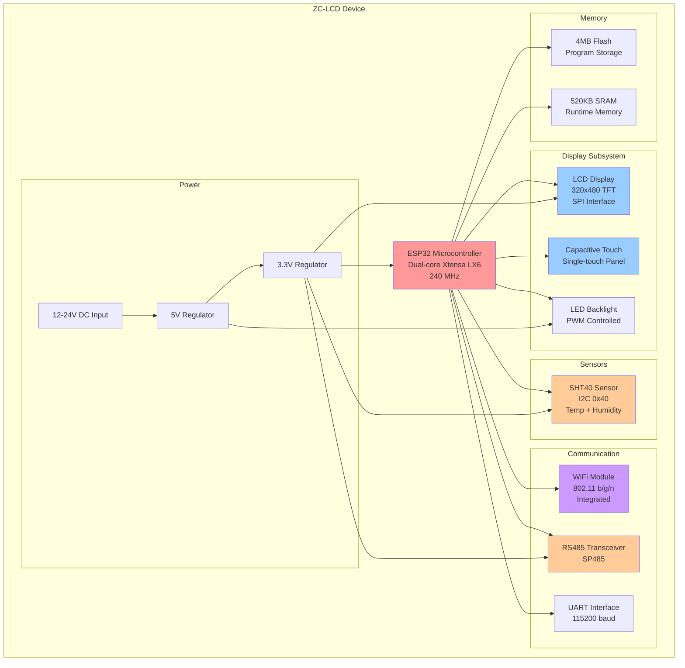
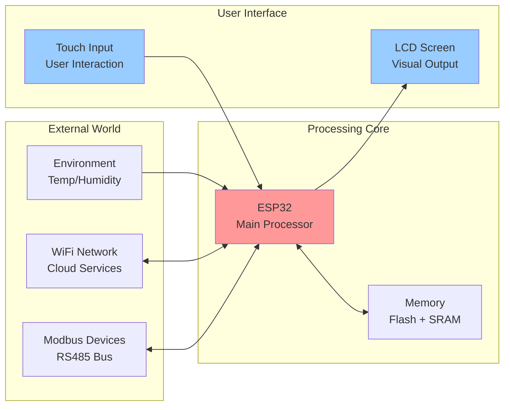
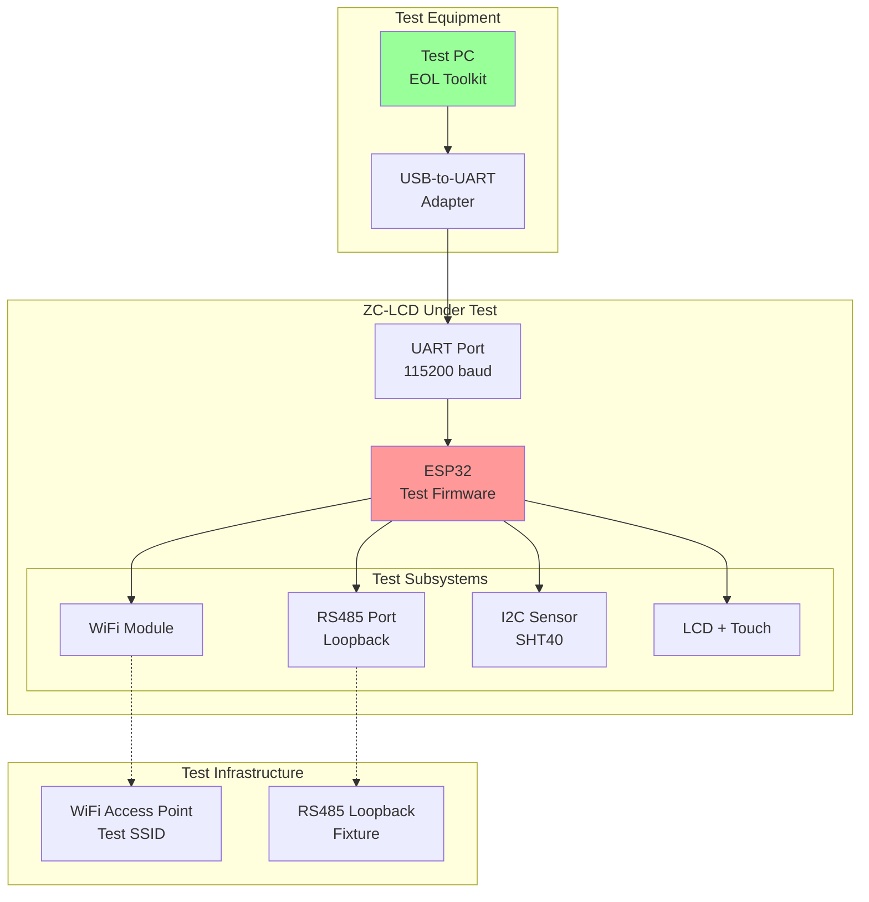
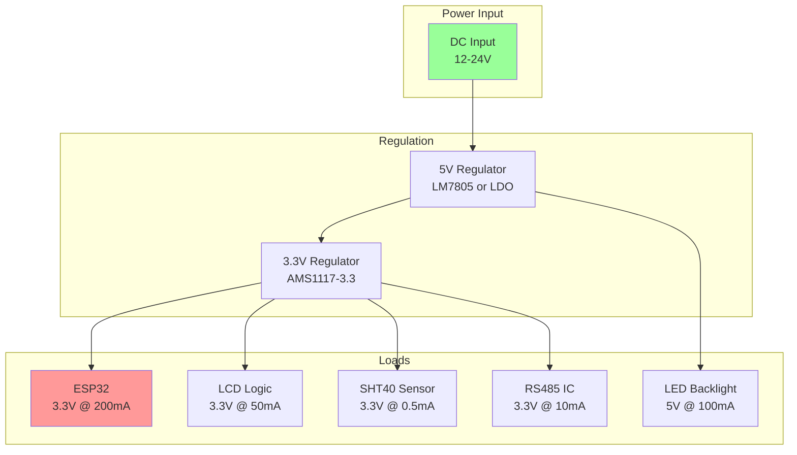
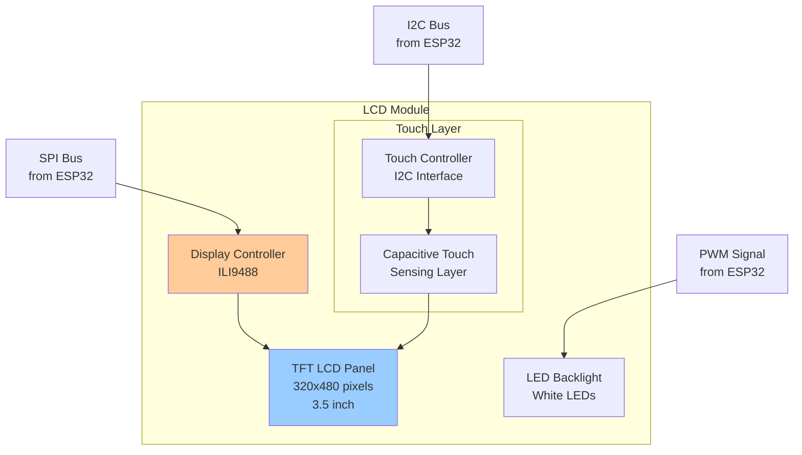

# ZC-LCD Hardware Overview

**Device:** ZC-LCD (Zone Controller with LCD)  
**Generation:** GEN-2  
**Microcontroller:** ESP32 (Dual-core Xtensa LX6)  
**Purpose:** Smart building zone controller with integrated touchscreen display  
**Last Updated:** December 9, 2025

---

## Table of Contents

1. [Device Summary](#device-summary)
2. [Hardware Specifications](#hardware-specifications)
3. [System Architecture](#system-architecture)
4. [Component Descriptions](#component-descriptions)
5. [Communication Interfaces](#communication-interfaces)
6. [Power Requirements](#power-requirements)
7. [Physical Specifications](#physical-specifications)
8. [Test Points & Connectors](#test-points--connectors)
9. [LCD Display Specifications](#lcd-display-specifications)
10. [I2C Sensor Details](#i2c-sensor-details)

---

## Device Summary

The **ZC-LCD** is an ESP32-based smart building controller featuring an integrated capacitive touchscreen LCD display. It combines WiFi connectivity, RS485 industrial communication, environmental sensing (temperature/humidity), and a user-friendly touch interface for HVAC and building automation applications.

### Key Differentiators

- **Integrated LCD:** Capacitive touchscreen for local control and status display
- **Environmental Sensor:** SHT40 I2C temperature/humidity sensor
- **Dual Communication:** WiFi (wireless) + RS485 (industrial wired)
- **User Interface:** Touch-enabled HMI for zone control
- **Compact Design:** Wall-mountable form factor

---

## Hardware Specifications

### Microcontroller

| Parameter | Specification |
|-----------|---------------|
| **MCU** | ESP32 (Espressif Systems) |
| **Architecture** | Dual-core Xtensa LX6 32-bit |
| **Clock Speed** | 240 MHz (dual-core) |
| **Flash Memory** | 4 MB |
| **RAM** | 520 KB SRAM |
| **WiFi** | Integrated 802.11 b/g/n |
| **Bluetooth** | BLE 4.2 (not used in factory testing) |
| **GPIO Pins** | 34 programmable GPIOs |
| **ADC** | 18 channels, 12-bit SAR ADC |

### LCD Display Module

| Parameter | Specification |
|-----------|---------------|
| **Display Type** | TFT LCD with LED backlight |
| **Screen Size** | 3.5 inches (diagonal) |
| **Resolution** | 320 × 480 pixels |
| **Color Depth** | 16-bit (65K colors) |
| **Touch Technology** | Capacitive touch panel |
| **Touch Points** | Single-touch |
| **Interface** | SPI (Serial Peripheral Interface) |
| **Backlight** | Adjustable LED backlight |
| **Viewing Angle** | 160° (typical) |

### I2C Sensor (SHT40)

| Parameter | Specification |
|-----------|---------------|
| **Sensor Model** | Sensirion SHT40 |
| **I2C Address** | 0x40 (default) |
| **Temperature Range** | -40°C to +125°C |
| **Temperature Accuracy** | ±0.2°C (typical) |
| **Humidity Range** | 0% to 100% RH |
| **Humidity Accuracy** | ±1.8% RH (typical) |
| **Response Time** | 8 seconds (τ63%) |
| **Power Consumption** | 0.4 µA (sleep mode) |
| **Interface** | I2C (Fast Mode, up to 400 kHz) |

### WiFi Module (Integrated)

| Parameter | Specification |
|-----------|---------------|
| **Standard** | IEEE 802.11 b/g/n |
| **Frequency** | 2.4 GHz |
| **TX Power** | +20 dBm max |
| **RX Sensitivity** | -98 dBm @ 11 Mbps |
| **Security** | WPA/WPA2-PSK, WPA2-Enterprise |
| **Modes** | Station, AP, Station+AP |
| **Antenna** | PCB antenna or external (connector) |

### RS485 Interface

| Parameter | Specification |
|-----------|---------------|
| **Transceiver IC** | SP485 or equivalent |
| **Baud Rate** | 9600 - 115200 bps |
| **Protocol Support** | Modbus RTU |
| **Differential Signaling** | A/B (D+/D-) |
| **Protection** | ESD protection diodes |
| **Max Distance** | 1200 meters |
| **Termination** | 120Ω (external) |

### UART Interface (Test Port)

| Parameter | Specification |
|-----------|---------------|
| **Baud Rate** | 115200 (factory testing) |
| **Data Bits** | 8 |
| **Parity** | None |
| **Stop Bits** | 1 |
| **Flow Control** | None |
| **Connector** | 4-pin header (TX, RX, GND, 3.3V) |

---

## System Architecture

### Component Diagram



### Block Diagram - Data Flow



### Factory Testing Architecture



---

## Component Descriptions

### 1. ESP32 Microcontroller (Main Processor)

**Purpose:** Central processing unit managing display, sensors, communication, and test execution.

**Key Features:**
- Dual-core architecture for parallel processing
- Integrated WiFi and Bluetooth
- Rich peripheral set (SPI, I2C, UART, PWM)
- Hardware encryption and security features
- Low power modes for battery operation

**In Factory Testing:**
- Executes AT command interpreter
- Coordinates all test sequences
- Manages WiFi scanning and connection
- Controls RS485 loopback testing
- Reads I2C sensor data
- Monitors LCD touch events

**Pinout for Testing:**
- GPIO 16/17: UART TX/RX (test interface)
- GPIO 21/22: I2C SDA/SCL (sensor)
- GPIO 4/5: RS485 TX/RX control
- SPI Bus: LCD communication
- Touch GPIO: Capacitive touch sensing

### 2. LCD Display Module

**Purpose:** Visual output and user interface for zone control and status display.

**Key Features:**
- High-resolution 320×480 pixel display
- 16-bit color depth (65K colors)
- SPI interface for fast data transfer
- LED backlight with PWM brightness control
- Wide viewing angle

**In Factory Testing:**
- Displays test instructions ("Touch the screen")
- Shows current test status
- Visual feedback for operator
- Touch count displayed during LCD test
- Backlight verification

**Display Controller:**
- IC: ILI9488 or equivalent
- Interface: 4-wire SPI
- Command/Data selection via D/C pin
- Reset control via RST pin

### 3. Capacitive Touch Panel

**Purpose:** User input interface for local control and test interaction.

**Key Features:**
- Capacitive sensing technology
- Single-touch detection
- Fast response time (<50ms)
- Overlay on LCD screen
- Gesture support (optional)

**In Factory Testing:**
- Detects touch events during LCD test
- Counts number of touches
- Validates touch sensitivity
- Pass criteria: > 2 touches detected
- Operator interaction required

**Touch Controller:**
- Interface: I2C or dedicated GPIO
- Calibration: Factory calibrated
- Sampling rate: 100 Hz typical

### 4. SHT40 Temperature/Humidity Sensor

**Purpose:** Environmental monitoring for HVAC control and comfort management.

**Key Features:**
- High accuracy (±0.2°C temperature, ±1.8% RH humidity)
- I2C digital interface
- Fast response time
- Low power consumption
- Small form factor (1.5×1.5×0.5 mm DFN package)

**In Factory Testing:**
- Responds to AT+TEST=i2c command
- Returns I2C address (0x40)
- Provides temperature reading (×10, e.g., 266 = 26.6°C)
- Provides humidity reading (×10, e.g., 671 = 67.1% RH)
- Validates I2C bus communication

**Data Format:**
```
Raw Response: +I2C:0x40,266,671
  - Address:     0x40 (SHT40 default)
  - Temperature: 266 → 26.6°C
  - Humidity:    671 → 67.1% RH
```

**I2C Communication:**
- Clock speed: Up to 400 kHz (Fast Mode)
- Pull-up resistors: 4.7kΩ typical
- SCL/SDA lines shared with other I2C devices

### 5. WiFi Module (Integrated in ESP32)

**Purpose:** Wireless connectivity for cloud services and network access.

**Key Features:**
- IEEE 802.11 b/g/n compliance
- 2.4 GHz operation
- Station and AP modes
- WPA/WPA2 security
- Network scanning capability

**In Factory Testing:**
- Scans for available WiFi networks
- Attempts connection to test SSID
- Reports network count (should be > 1)
- Reports connection status (should be 1 = connected)
- Pass criteria: Networks > 1 AND Connected = 1

**Test Sequence:**
1. Enable WiFi radio
2. Scan for networks (passive scan)
3. Count detected SSIDs
4. Attempt connection to pre-configured test SSID
5. Report results via UART

### 6. RS485 Interface

**Purpose:** Industrial serial communication for Modbus RTU devices.

**Key Features:**
- Differential signaling (A/B lines)
- Long-distance capability (up to 1200m)
- Multi-drop network support
- ESD protection
- Modbus RTU protocol

**In Factory Testing:**
- Loopback test configuration
- Sends test pattern (value: 4096)
- Receives and verifies loopback
- Reports received value
- Pass criteria: Value = 4096 (exact match)

**Transceiver IC:**
- Model: SP485 or MAX485
- Supply voltage: 5V
- Data rate: Up to 250 kbps
- Driver output: ±1.5V to ±5V differential

### 7. UART Test Interface

**Purpose:** Factory testing communication and programming port.

**Key Features:**
- Standard serial protocol
- 115200 baud rate
- AT command interface
- 3.3V logic levels
- Direct connection to ESP32

**In Factory Testing:**
- Primary test communication channel
- Receives AT commands from test PC
- Sends test results back to PC
- Logs test progress messages
- Timeout: 30 seconds per command

**Connector Pinout:**
```
Pin 1: GND    (Ground)
Pin 2: 3.3V   (Power - for USB adapter)
Pin 3: TX     (ESP32 transmit → PC receive)
Pin 4: RX     (ESP32 receive ← PC transmit)
```

---

## Communication Interfaces

### WiFi Protocol (802.11n)

**Configuration:**
- Mode: Station (for factory testing)
- SSID: Pre-configured test network
- Security: WPA2-PSK (test environment)
- DHCP: Enabled

**Test Procedure:**
1. Initialize WiFi subsystem
2. Start passive scan
3. Collect SSID list
4. Count unique networks
5. Attempt connection to test SSID
6. Report: `+WIFI:<count>,<connected>`

**Expected Environment:**
- Multiple APs visible (count > 1)
- Test AP within range
- Stable WiFi environment

### I2C Protocol (Sensor Bus)

**Configuration:**
- Clock Speed: 100 kHz (Standard Mode) or 400 kHz (Fast Mode)
- Pull-ups: 4.7kΩ on SDA and SCL
- Devices: SHT40 sensor at 0x40

**SHT40 Communication Sequence:**
1. Send measure command: 0xFD (high precision)
2. Wait 8ms for conversion
3. Read 6 bytes: [Temp MSB, Temp LSB, CRC, Hum MSB, Hum LSB, CRC]
4. Calculate temperature and humidity
5. Return formatted data

**Temperature Calculation:**
```
Raw_Temp = (MSB << 8) | LSB
Temperature_C = -45 + 175 × (Raw_Temp / 65535)
Returned value = Temperature_C × 10 (integer)
```

**Humidity Calculation:**
```
Raw_Hum = (MSB << 8) | LSB
Humidity_RH = 100 × (Raw_Hum / 65535)
Returned value = Humidity_RH × 10 (integer)
```

### RS485 Protocol (Modbus RTU)

**Configuration:**
- Baud Rate: 9600 - 115200 bps
- Data Format: 8N1 (8 data bits, no parity, 1 stop bit)
- Half-duplex operation
- Automatic direction control

**Loopback Test:**
1. Configure RS485 transceiver in loopback mode
2. Send test pattern: value = 4096 (0x1000)
3. Read back received data
4. Compare sent vs received
5. Report: `+RS485:<value>`

**Physical Layer:**
- Differential voltage: ±1.5V minimum
- Common mode: -7V to +12V
- Termination: 120Ω resistor at both ends

### SPI Protocol (LCD Display)

**Configuration:**
- Clock Speed: 40 MHz (ESP32 SPI max)
- Mode: SPI Mode 0 (CPOL=0, CPHA=0)
- Bit Order: MSB first
- Chip Select: Active low

**LCD Communication:**
- Command write: D/C = 0, write byte
- Data write: D/C = 1, write bytes
- DMA transfer for fast screen updates

---

## Power Requirements

### Input Power

| Source | Voltage | Current | Power | Notes |
|--------|---------|---------|-------|-------|
| **DC Input** | 12-24V DC | 400mA max | 5W | Terminal block or barrel jack |

### Power Distribution



### Power Consumption

| Operating Mode | Typical | Maximum | Notes |
|----------------|---------|---------|-------|
| **Idle (Display On)** | 1.5W | 2W | Backlight at 50% |
| **WiFi Active** | 2.5W | 3.5W | Transmitting data |
| **Touch Event** | 1.8W | 2.3W | Touch processing |
| **Full Operation** | 3W | 4.5W | All subsystems active |
| **Sleep Mode** | 20mW | 50mW | Display off, ESP32 deep sleep |
| **Display Off** | 0.8W | 1.2W | ESP32 running, backlight off |

### Voltage Rails

| Rail | Voltage | Tolerance | Max Current | Purpose |
|------|---------|-----------|-------------|---------|
| **VCC_5V** | 5.0V | ±5% | 500mA | LCD backlight, RS485 |
| **VCC_3V3** | 3.3V | ±3% | 400mA | ESP32, LCD logic, sensor |
| **VCC_1V8** | 1.8V | ±2% | 100mA | ESP32 internal (generated) |

### Thermal Considerations

- **Operating Temperature:** 0°C to +50°C (with LCD)
- **Storage Temperature:** -20°C to +70°C
- **Maximum Junction Temp:** 85°C (ESP32)
- **Cooling:** Passive (no fan required)
- **Heat Sources:** ESP32 (main), 5V regulator, backlight LEDs

---

## Physical Specifications

### Dimensions

| Parameter | Value |
|-----------|-------|
| **Length** | 95 mm |
| **Width** | 70 mm |
| **Height** | 25 mm (including LCD) |
| **Weight** | 120 g |
| **Mounting** | Wall mount, standard gang box compatible |
| **Screen Size** | 3.5" diagonal (active area: 48×72 mm) |

### Enclosure

| Parameter | Specification |
|-----------|---------------|
| **Material** | ABS plastic (flame retardant) |
| **Color** | White or custom |
| **Finish** | Matte or glossy |
| **Screen Window** | Polycarbonate or acrylic |
| **Buttons** | None (touch only) |
| **Indicators** | None (status shown on screen) |

### Environmental

| Parameter | Specification |
|-----------|---------------|
| **Operating Temp** | 0°C to +50°C |
| **Storage Temp** | -20°C to +70°C |
| **Humidity** | 10% to 90% RH (non-condensing) |
| **Altitude** | 0 to 2000 meters |
| **Ingress Protection** | IP20 (indoor use) |
| **Shock** | IEC 60068-2-27 |
| **Vibration** | IEC 60068-2-6 |

### Certifications

- CE (Electromagnetic Compatibility)
- FCC Part 15 (Radio Frequency)
- RoHS Compliant
- REACH Compliant

---

## Test Points & Connectors

### Main Connectors

#### 1. UART Test Connector (4-pin Header)

**Location:** Bottom edge of PCB  
**Type:** 0.1" (2.54mm) pitch header  
**Pinout:**

| Pin | Signal | Direction | Notes |
|-----|--------|-----------|-------|
| 1 | GND | - | Ground reference |
| 2 | 3.3V | Output | For powering USB adapter (optional) |
| 3 | TX | Output | ESP32 transmit → PC receive |
| 4 | RX | Input | ESP32 receive ← PC transmit |

**Connection:**
- Use USB-to-UART adapter (CP2102, FTDI, CH340)
- Connect: TX → RX (crossover)
- Baud rate: 115200, 8N1

#### 2. RS485 Terminal Block

**Location:** Side edge of PCB  
**Type:** 2-position screw terminal  
**Pinout:**

| Pin | Signal | Notes |
|-----|--------|-------|
| 1 | A (D+) | Positive differential line |
| 2 | B (D-) | Negative differential line |

**For Testing:**
- Install loopback jumper or test fixture
- 120Ω termination (if end of bus)

#### 3. Power Input Terminal

**Location:** Side edge of PCB  
**Type:** 2-position screw terminal  
**Pinout:**

| Pin | Signal | Voltage |
|-----|--------|---------|
| 1 | VCC | 12-24V DC |
| 2 | GND | Ground |

**Polarity Protection:** Reverse polarity diode included

#### 4. I2C Sensor (SHT40)

**Location:** On-board (internal)  
**Type:** SMD package (soldered)  
**Pinout:** Not user-accessible

**I2C Bus:**
- SDA: GPIO 21 (ESP32)
- SCL: GPIO 22 (ESP32)
- Pull-ups: 4.7kΩ to 3.3V

### Test Points (PCB)

| Label | Signal | Purpose |
|-------|--------|---------|
| **TP1** | 3.3V | Power rail verification |
| **TP2** | 5.0V | Power rail verification |
| **TP3** | GND | Ground reference |
| **TP4** | I2C_SDA | I2C data line probing |
| **TP5** | I2C_SCL | I2C clock line probing |
| **TP6** | RS485_A | RS485 A line probing |
| **TP7** | RS485_B | RS485 B line probing |
| **TP8** | TOUCH_INT | Touch interrupt signal |

### Programming/Debug Interface

**Programming Method:**
- USB-to-UART bootloader (standard)
- JTAG interface (optional, for debugging)

**Boot Mode Selection:**
- Automatic (via DTR/RTS control)
- Manual: Hold BOOT button, press RESET

---

## LCD Display Specifications

### Display Characteristics



### Display Resolution & Color

- **Physical Size:** 3.5 inches (diagonal)
- **Resolution:** 320 × 480 pixels (HVGA)
- **Pixel Pitch:** 0.099 × 0.099 mm
- **Aspect Ratio:** 2:3 (portrait orientation)
- **Color Depth:** 16-bit RGB (565 format)
- **Total Colors:** 65,536 (64K)

### Backlight

- **Type:** White LED array
- **Control:** PWM (Pulse Width Modulation)
- **Brightness Levels:** 256 (0-255)
- **Default Brightness:** 200 (78%)
- **Lifetime:** 50,000 hours typical

### Touch Panel

- **Technology:** Projected capacitive (P-CAP)
- **Touch Points:** Single touch
- **Scan Rate:** 100 Hz
- **Touch Resolution:** 320 × 480 (matches display)
- **Activation Force:** <50gf
- **Surface:** Glass or acrylic cover

---

## I2C Sensor Details

### SHT40 Sensor Datasheet Summary

**Sensirion SHT40 Digital Temperature/Humidity Sensor**

#### Electrical Characteristics

| Parameter | Min | Typ | Max | Unit |
|-----------|-----|-----|-----|------|
| **Supply Voltage** | 1.7 | 3.3 | 3.6 | V |
| **Active Current** | - | 0.4 | 0.8 | mA |
| **Sleep Current** | - | 0.4 | - | µA |
| **I2C Clock** | 0 | 100 | 400 | kHz |

#### Measurement Specifications

**Temperature:**
- Range: -40°C to +125°C
- Accuracy: ±0.2°C (0°C to +65°C)
- Resolution: 0.01°C
- Repeatability: 0.1°C

**Humidity:**
- Range: 0% to 100% RH
- Accuracy: ±1.8% RH (25°C, 20% to 80% RH)
- Resolution: 0.01% RH
- Repeatability: 0.1% RH

#### Factory Testing Typical Values

At room temperature (25°C, 50% RH):
```
+I2C:0x40,250,500
  Address:     0x40
  Temperature: 250 → 25.0°C
  Humidity:    500 → 50.0% RH
```

Valid ranges for factory floor:
- Temperature: 200-300 (20°C to 30°C)
- Humidity: 300-700 (30% to 70% RH)

---

## Comparison with Other NubeIO Devices

| Feature | ZC-LCD | ACB-M | Micro Edge | ZC-Controller |
|---------|--------|-------|------------|---------------|
| **MCU** | ESP32 | STM32 | ESP32 | ESP32 |
| **Display** | ✅ 3.5" Touch | ❌ | ❌ | ❌ |
| **Temp/Hum Sensor** | ✅ SHT40 | ❌ | ✅ Various | ✅ |
| **WiFi** | ✅ | ✅ | ✅ | ✅ |
| **Ethernet** | ❌ | ✅ | ❌ | ❌ |
| **RS485** | ✅ | ✅ | ✅ | ✅ |
| **LoRa** | ❌ | ❌ | ✅ | ❌ |
| **RTC** | ❌ | ✅ | ❌ | ❌ |
| **User Interface** | ✅ Touch | ❌ | ❌ | ❌ |
| **Form Factor** | Wall Mount | DIN Rail | DIN Rail | Wall Mount |
| **Target Use** | Zone Control | Gateway | LoRa Gateway | Controller |

---

## Revision History

| Version | Date | Changes | Author |
|---------|------|---------|--------|
| 1.0 | 2025-12-09 | Initial hardware overview for ZC-LCD | Documentation Team |

---

**Related Documentation:**
- [← Back to ZC-LCD README](./ZCLCD-README.md)
- [Next: Sequence Diagrams →](./ZCLCD-Sequence.md)
- [Test Cases](./ZCLCD-TestCases.md)
- [Source Code Manual](./ZCLCD-SourceCode.md)
- [Troubleshooting](./ZCLCD-Troubleshooting.md)
