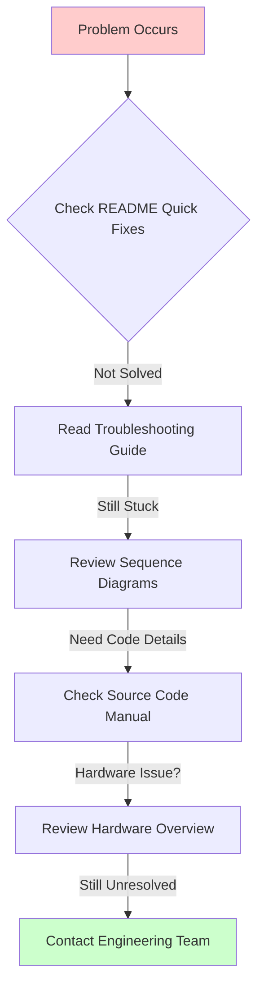

# ZC-LCD Factory Testing Documentation

**Device:** ZC-LCD (Zone Controller with LCD)  
**Generation:** GEN-2  
**Microcontroller:** ESP32  
**Communication:** UART (115200 baud)  
**Last Updated:** December 9, 2025

---

## 📚 Quick Navigation

### By Role

**🔧 Test Operator:**
- Start here: [Quick Start Guide](#quick-start-guide)
- Then go to: [Test Cases & Procedures](./ZCLCD-TestCases.md)
- When issues arise: [Troubleshooting Guide](./ZCLCD-Troubleshooting.md)

**👨‍💻 Software Developer:**
- Start here: [Source Code Manual](./ZCLCD-SourceCode.md)
- Then review: [Sequence Diagrams](./ZCLCD-Sequence.md)
- For hardware context: [Hardware Overview](./ZCLCD-Overview.md)

**⚙️ Hardware Engineer:**
- Start here: [Hardware Overview](./ZCLCD-Overview.md)
- For test procedures: [Test Cases](./ZCLCD-TestCases.md)
- For diagnostics: [Troubleshooting](./ZCLCD-Troubleshooting.md)

**📊 Quality Assurance:**
- Start here: [Test Cases & Procedures](./ZCLCD-TestCases.md)
- Review flows: [Sequence Diagrams](./ZCLCD-Sequence.md)
- Check criteria: Pass/fail thresholds in Test Cases

---

## 📖 Documentation Files

| File | Purpose | Audience | Diagrams |
|------|---------|----------|----------|
| **[ZCLCD-Overview.md](./ZCLCD-Overview.md)** | Hardware specifications, component architecture | Hardware engineers, beginners | Component Diagram, Block Diagrams |
| **[ZCLCD-Sequence.md](./ZCLCD-Sequence.md)** | Test execution flows, message sequences | Developers, testers | 15+ Sequence Diagrams, State Diagrams |
| **[ZCLCD-TestCases.md](./ZCLCD-TestCases.md)** | Detailed test procedures, pass/fail criteria | Test operators, QA | 15+ Flowcharts, Mind Maps |
| **[ZCLCD-SourceCode.md](./ZCLCD-SourceCode.md)** | Software manual, class/method documentation | Developers, maintainers | 5+ Class Diagrams |
| **[ZCLCD-Troubleshooting.md](./ZCLCD-Troubleshooting.md)** | Issue diagnosis, solutions | Operators, support engineers | 10+ State Diagrams, Flowcharts |

---

## 🔍 Device Overview

### What is ZC-LCD?

The **ZC-LCD (Zone Controller with LCD)** is a GEN-2 ESP32-based smart building controller featuring an integrated capacitive touchscreen LCD display. It combines wireless connectivity (WiFi), industrial communication (RS485), environmental sensing (I2C temperature/humidity sensor), and user interface capabilities for advanced HVAC and building automation applications.

### Key Features

- **Microcontroller:** ESP32 (Dual-core Xtensa LX6)
- **Display:** LCD with capacitive touch interface
- **Wireless:** WiFi 802.11b/g/n (2.4 GHz)
- **Sensor:** I2C SHT40 temperature/humidity sensor
- **Industrial:** RS485 interface for Modbus RTU
- **User Interface:** Touch-enabled LCD for local control
- **Power:** 12-24V DC input

### Application Areas

- HVAC zone controllers with local display
- Room automation panels
- Building management user interfaces
- Temperature/humidity monitoring stations
- Modbus RTU gateway with HMI
- Smart thermostat platforms

---

## 🧪 Test Summary

The ZC-LCD factory testing validates **4 critical subsystems**:

| Test | What It Checks | Pass Criteria | Typical Duration |
|------|----------------|---------------|------------------|
| **WiFi** | Wireless connectivity | Networks > 1, Connected = 1 | ~10 seconds |
| **RS485** | Serial communication | Value = 4096 | ~8 seconds |
| **I2C Sensor** | Temperature/humidity sensor | Valid address (0x40), temp/hum readings | ~5 seconds |
| **LCD Touch** | Touchscreen functionality | Touch count > 2 | ~10 seconds (user interaction) |

**Total Test Time:** ~35-40 seconds  
**Pre-Testing:** Device info read (Version, UID, Make)  
**Post-Testing:** Results saved as CSV + JSON

---

## 🚀 Quick Start Guide

### Prerequisites

1. **Hardware Setup:**
   - ZC-LCD device powered and ready
   - USB-to-UART adapter connected to test PC
   - LCD display visible and responsive
   - WiFi access point nearby (for WiFi test)
   - RS485 test fixture/loopback (for RS485 test)

2. **Software:**
   - NubeIO EOL Toolkit application
   - Proper COM port drivers installed

### Testing in 5 Steps


#### Step-by-Step:

1. **Select Device Type:**
   - Open Factory Testing tab
   - Select **"ZC-LCD"** from device dropdown
   - Select COM port where ZC-LCD is connected

2. **Connect to Device:**
   - Click **"Connect"** button
   - Wait for green "Connected" status
   - Device info will be read automatically

3. **Run Tests:**
   - Tests run automatically after connection
   - **LCD Touch Test:** Touch the screen 3+ times when prompted
   - Watch progress bar and status messages
   - Each test takes 5-10 seconds

4. **Review Results:**
   - Check ✅/❌ indicators for each test
   - Overall PASS requires all tests passing
   - Review details in results panel

5. **Save & Next:**
   - Results auto-saved to `logs/` folder
   - Optional: Print label
   - Disconnect and test next unit

---

## 📊 Understanding Results

### Device Information

Before tests run, the system reads device information:

```json
{
  "version": "2.1.0",
  "uid": "A4B1C8D2E3F4A1B2",
  "deviceMake": "ZC-LCD"
}
```

- **Version:** Firmware version (format: X.Y.Z)
- **UID:** Unique device identifier (16 hex digits)
- **Device Make:** Should match "ZC-LCD"

### Test Results Structure

Each test returns structured data:

#### WiFi Test Result
```json
{
  "pass": true,
  "networks": 6,
  "connected": 1,
  "raw": "+WIFI:6,1",
  "message": "Networks: 6, connected"
}
```

#### RS485 Test Result
```json
{
  "pass": true,
  "value": 4096,
  "raw": "+RS485:4096",
  "message": "RS485 test passed (value=4096)"
}
```

#### I2C Sensor Test Result
```json
{
  "pass": true,
  "i2cAddress": "0x40",
  "temperature": 266,
  "humidity": 671,
  "raw": "+I2C:0x40,266,671",
  "message": "I2C: 0x40, Temp: 266, Hum: 671"
}
```

#### LCD Touch Test Result
```json
{
  "pass": true,
  "touchCount": 5,
  "raw": "+LCD:5",
  "message": "LCD test passed (touches: 5)"
}
```

### Pass/Fail Criteria

**✅ PASS (All tests must pass):**
- **WiFi:** Networks > 1 AND Connected = 1
- **RS485:** Value = 4096 (exact match)
- **I2C:** Valid address (0x40) AND temp/humidity readings are numeric
- **LCD:** Touch count > 2

**❌ FAIL (Any test fails):**
- Device marked as FAILED
- Review failed test details
- Check troubleshooting guide
- Re-test or escalate to engineering

---

## 🔗 AT Command Reference (Quick)

| Command | Response | Purpose |
|---------|----------|---------|
| `AT+VERSION?` | `+VERSION:2.1.0` | Read firmware version |
| `AT+UID?` | `+UID:A4B1C8D2E3F4A1B2` | Read unique ID |
| `AT+DEVICEMAKE?` | `+DEVICEMAKE:ZC-LCD` | Read device type |
| `AT+TEST=wifi` | `+WIFI:6,1` | WiFi scan and connect test |
| `AT+TEST=rs485` | `+RS485:4096` | RS485 loopback test |
| `AT+TEST=i2c` | `+I2C:0x40,266,671` | I2C sensor test (SHT40) |
| `AT+TEST=lcd` | `+LCD:5` | LCD touch test (user interaction) |

**Note:** All commands require response within timeout period (30 seconds). Each test command returns specific format.

### AT Command Details

#### WiFi Test Command
```
Command:  AT+TEST=wifi
Response: +WIFI:<network_count>,<connected_status>
Example:  +WIFI:6,1
          (6 networks found, 1 = connected)
```

#### RS485 Test Command
```
Command:  AT+TEST=rs485
Response: +RS485:<loopback_value>
Example:  +RS485:4096
          (Must be exactly 4096 for pass)
```

#### I2C Sensor Test Command
```
Command:  AT+TEST=i2c
Response: +I2C:<address>,<temp_x10>,<humidity_x10>
Example:  +I2C:0x40,266,671
          (Address: 0x40, Temp: 26.6°C, Humidity: 67.1%)
```

#### LCD Touch Test Command
```
Command:  AT+TEST=lcd
Response: +LCD:<touch_count>
Example:  +LCD:5
          (5 touches detected, need > 2 for pass)
```

---

## 🛠️ Common Issues & Quick Fixes

| Symptom | Likely Cause | Quick Fix |
|---------|--------------|-----------|
| Can't connect | Wrong COM port | Check Device Manager, select correct port |
| WiFi networks = 0 | No AP nearby | Move closer to WiFi access point |
| WiFi connected = 0 | Wrong credentials | Check test SSID configuration |
| RS485 fails | Wrong loopback value | Check RS485 hardware, firmware version |
| I2C fails | Sensor not detected | Check SHT40 sensor connection, I2C bus |
| I2C wrong address | Sensor mismatch | Verify SHT40 sensor (should be 0x40) |
| LCD touch count = 0 | No touches detected | Touch screen 3+ times during test |
| LCD not responding | Hardware issue | Check LCD connector, display power |

**For detailed troubleshooting, see:** [ZCLCD-Troubleshooting.md](./ZCLCD-Troubleshooting.md)

---

## 📈 Statistics & Performance

### Typical Test Session

- **Connection Time:** 3-5 seconds
- **Device Info Read:** 2-3 seconds
- **WiFi Test:** 10 seconds (includes scan and connect)
- **RS485 Test:** 8 seconds
- **I2C Sensor Test:** 5 seconds
- **LCD Touch Test:** 10 seconds (user interaction time)
- **Total Time:** ~40 seconds per unit

### Throughput

- **Per Hour:** ~80 units (with operator efficiency)
- **Per Shift (8hr):** ~600 units
- **Success Rate:** Typically 92-96% first-pass yield
- **LCD Touch Test:** Most common point of user error (touch too few times)

### Test Reliability

- **WiFi Test:** 98% reliability (depends on AP proximity)
- **RS485 Test:** 99% reliability (hardware loopback)
- **I2C Test:** 97% reliability (sensor quality)
- **LCD Touch Test:** 95% reliability (user interaction dependent)

---

## 📁 Files Generated

After each test session, the following files are created:

### CSV File (for database import)
```
logs/factory-results-zc-lcd.csv
```
Contains: Version, UID, Device Make, test results, pass/fail status, timestamp

### JSON File (for detailed analysis)
```
logs/factory-results-zc-lcd-[timestamp].json
```
Contains: Complete test results with all raw responses

### Log File (for debugging)
```
logs/factory-testing-[date].log
```
Contains: Detailed execution log with all AT commands and responses

---

## 🎓 Learning Resources

### For Beginners

1. **Start with concepts:**
   - Read [Hardware Overview](./ZCLCD-Overview.md) to understand the device
   - Study [Test Cases](./ZCLCD-TestCases.md) to learn what each test does
   - Review component diagram to see how parts connect

2. **Practice testing:**
   - Follow step-by-step procedures in Test Cases
   - Practice LCD touch test (3+ touches required)
   - Watch for green/red indicators
   - Use troubleshooting guide when stuck

3. **Build understanding:**
   - Read [Sequence Diagrams](./ZCLCD-Sequence.md) to see test flows
   - Review AT command protocol
   - Learn to interpret raw responses
   - Understand I2C sensor data format (temp/humidity × 10)

### For Developers

1. **Understand the code:**
   - Study [Source Code Manual](./ZCLCD-SourceCode.md)
   - Review class diagrams and method documentation
   - See how ZC-LCD differs from ACB-M and Micro Edge

2. **Modify tests:**
   - Follow "Adding New Tests" guide in SourceCode.md
   - Test changes with actual hardware
   - Update documentation

3. **Debug issues:**
   - Enable verbose logging (see SourceCode.md)
   - Use serial monitor to see raw AT commands
   - Review sequence diagrams for expected flow
   - Check I2C sensor datasheet (SHT40)

### Understanding I2C Sensor Values

The SHT40 sensor returns values multiplied by 10:

```
Temperature: 266 → 26.6°C
Humidity:    671 → 67.1% RH

Conversion formula:
  Actual Temperature = raw_value / 10
  Actual Humidity    = raw_value / 10
```

**Valid Ranges:**
- Temperature: -40°C to +125°C (raw: -400 to 1250)
- Humidity: 0% to 100% RH (raw: 0 to 1000)

---

## 🔄 Comparison with Other Devices

| Feature | ZC-LCD | ACB-M | Micro Edge | Droplet |
|---------|--------|-------|------------|---------|
| **Microcontroller** | ESP32 | STM32 | ESP32 | ESP32 |
| **LCD Display** | ✅ Yes (Touch) | ❌ No | ❌ No | ❌ No |
| **WiFi** | ✅ Yes | ✅ Yes | ✅ Yes | ✅ Yes |
| **Ethernet** | ❌ No | ✅ Yes | ❌ No | ❌ No |
| **RS485** | ✅ Yes | ✅ Yes (RS485-2) | ✅ Yes | ❌ No |
| **I2C Sensor** | ✅ Yes (SHT40) | ❌ No | ✅ Yes | ❌ No |
| **LoRa** | ❌ No | ❌ No | ✅ Yes | ✅ Yes |
| **RTC** | ❌ No | ✅ Yes | ❌ No | ❌ No |
| **Test Count** | 4 tests | 5 tests | 10 tests | 3 tests |
| **User Interaction** | ✅ Yes (Touch) | ❌ No | ❌ No | ❌ No |
| **Typical Duration** | ~40 sec | ~45 sec | ~70 sec | ~30 sec |

### Unique Characteristics of ZC-LCD

1. **LCD Touch Interface:**
   - Only device with integrated touchscreen
   - Requires user interaction during testing
   - Visual feedback for operators

2. **Environmental Sensing:**
   - Built-in SHT40 temperature/humidity sensor
   - I2C interface validation
   - Useful for HVAC applications

3. **User Interface Focus:**
   - Designed for local control panels
   - Touch count validation ensures screen functionality
   - HMI (Human-Machine Interface) capabilities

---

## 📞 Getting Help

### Documentation Chain



### Escalation Path

1. **Self-Service:** Use this documentation
2. **Peer Support:** Ask experienced operator
3. **Team Lead:** Escalate recurring issues
4. **Engineering:** Hardware/firmware defects
5. **Vendor:** Component failures (LCD, sensor)

### Common Support Topics

**LCD Touch Issues:**
- Screen not responding → Check connector, power
- Touch count too low → Remind operator to touch 3+ times
- Intermittent touches → Clean screen, check capacitive touch layer

**I2C Sensor Issues:**
- Wrong address → Verify SHT40 sensor installed (not SHT30/31)
- Invalid readings → Check I2C pull-up resistors, bus integrity
- No sensor detected → Inspect soldering, sensor orientation

**RS485 Issues:**
- Value ≠ 4096 → Check firmware version, loopback configuration
- No response → Check RS485 transceiver, termination

---

## 📝 Revision History

| Version | Date | Changes | Author |
|---------|------|---------|--------|
| 1.0 | 2025-12-09 | Initial comprehensive documentation for ZC-LCD | Documentation Team |

---

## 🎯 Next Steps

**Choose your path:**

- **📺 Learn Hardware:** Go to [ZCLCD-Overview.md](./ZCLCD-Overview.md)
- **🔄 Understand Flows:** Go to [ZCLCD-Sequence.md](./ZCLCD-Sequence.md)
- **🧪 Run Tests:** Go to [ZCLCD-TestCases.md](./ZCLCD-TestCases.md)
- **💻 Code Deep Dive:** Go to [ZCLCD-SourceCode.md](./ZCLCD-SourceCode.md)
- **🔧 Fix Problems:** Go to [ZCLCD-Troubleshooting.md](./ZCLCD-Troubleshooting.md)

---

**Need to test a different device?**
- [← Back to Factory Testing Main](../README.md)
- [ACB-M Documentation](../acb-m/ACBM-README.md)
- [Micro Edge Documentation](../../gen-1/micro-edge/MicroEdge-README.md)
- [ZC-Controller Documentation](../zc-controller/ZCController-README.md)
- [Droplet Documentation](../droplet/Droplet-README.md)

---

## 💡 Quick Tips

### For Fast Testing

1. **Pre-position WiFi AP:** Keep access point within 3 meters of test bench
2. **Pre-clean LCD:** Clean touchscreen before testing to ensure responsiveness
3. **Practice Touch Test:** Train operators to touch screen quickly (3-5 times)
4. **Batch Testing:** Test multiple units with same WiFi AP

### For Quality Assurance

1. **Monitor I2C Values:** Track sensor readings for consistency
2. **LCD Touch Trends:** Log touch counts to identify screen quality issues
3. **WiFi Signal Strength:** Monitor network count for AP placement optimization
4. **RS485 Loopback:** Value must be exactly 4096 (indicates proper firmware)

### For Maintenance

1. **Clean LCD Screens:** Use microfiber cloth, avoid harsh chemicals
2. **Check WiFi AP:** Ensure test AP is stable and accessible
3. **Verify RS485 Fixture:** Test loopback device periodically
4. **Update Firmware:** Keep ZC-LCD firmware current for latest test protocols
