# ZC-LCD Sequence Diagrams

**Device:** ZC-LCD (Zone Controller with LCD)  
**Purpose:** Test execution flows and message sequences  
**Last Updated:** December 9, 2025

---

## Table of Contents

1. [Overview](#overview)
2. [Complete Test Sequence](#complete-test-sequence)
3. [Connection Sequence](#connection-sequence)
4. [Device Info Reading](#device-info-reading)
5. [WiFi Test Sequence](#wifi-test-sequence)
6. [RS485 Test Sequence](#rs485-test-sequence)
7. [I2C Sensor Test Sequence](#i2c-sensor-test-sequence)
8. [LCD Touch Test Sequence](#lcd-touch-test-sequence)
9. [Results Processing](#results-processing)
10. [Error Handling Flows](#error-handling-flows)
11. [State Diagrams](#state-diagrams)
12. [Timing Diagrams](#timing-diagrams)

---

## Overview

This document contains **15+ sequence diagrams** showing the interaction between the Test PC (EOL Toolkit), the ZC-LCD device firmware, and hardware subsystems during factory testing. These diagrams help developers and testers understand the test flow and timing requirements.

### Diagram Legend

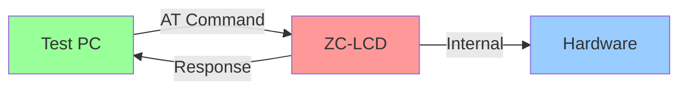

- **Green:** Test equipment (PC, EOL Toolkit)
- **Red:** ZC-LCD firmware/software
- **Blue:** Hardware subsystems

---

## Complete Test Sequence

### High-Level Test Flow

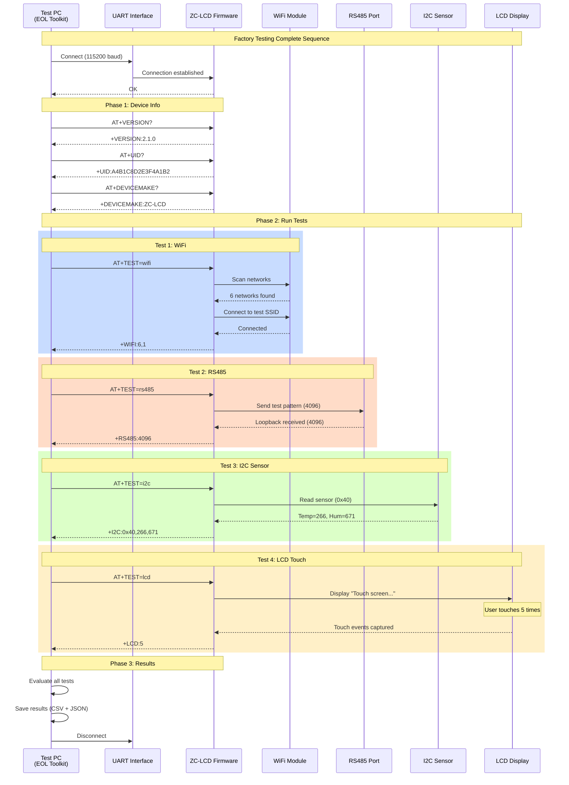

### Test Timeline

```mermaid
gantt
    title ZC-LCD Factory Testing Timeline
    dateFormat ss
    axisFormat %S
    
    section Connection
    Connect to device     :a1, 00, 3s
    
    section Device Info
    Read VERSION          :a2, 03, 2s
    Read UID              :a3, 05, 2s
    Read DEVICEMAKE       :a4, 07, 2s
    
    section Tests
    WiFi Test             :a5, 09, 10s
    RS485 Test            :a6, 19, 8s
    I2C Sensor Test       :a7, 27, 5s
    LCD Touch Test        :a8, 32, 10s
    
    section Finalization
    Process Results       :a9, 42, 2s
    Save Logs             :a10, 44, 1s
```

**Total Duration:** ~45 seconds (including user interaction)

---

## Connection Sequence

### Initial Connection

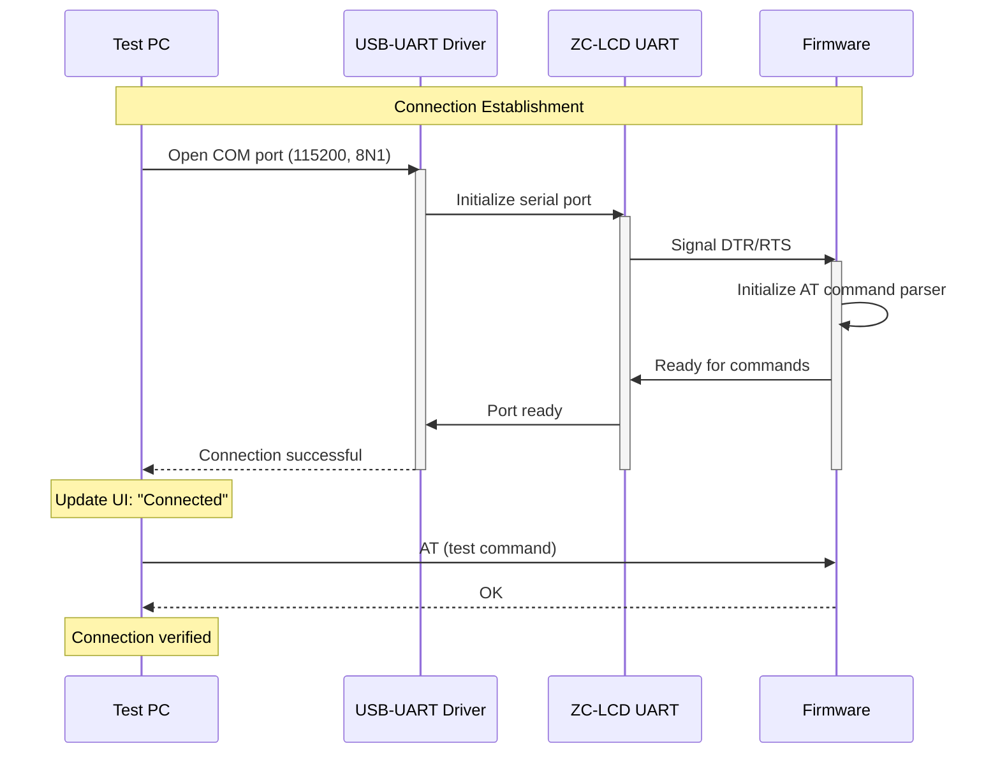

### Connection State Diagram

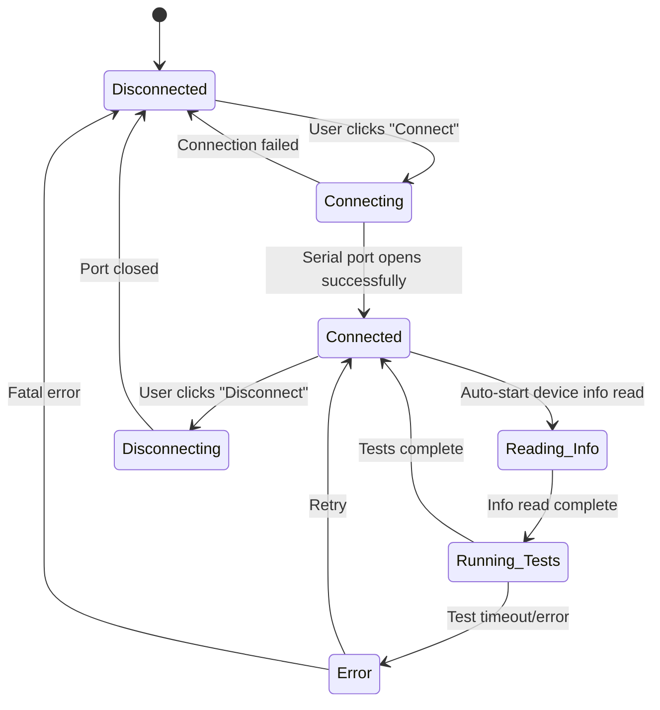

---

## Device Info Reading

### Version, UID, and Device Make

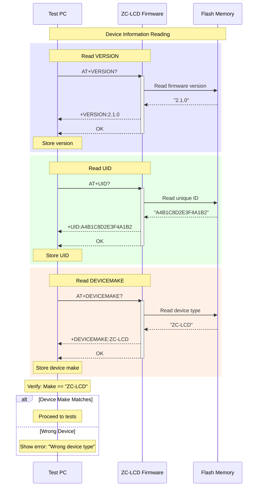

---

## WiFi Test Sequence

### WiFi Scan and Connect

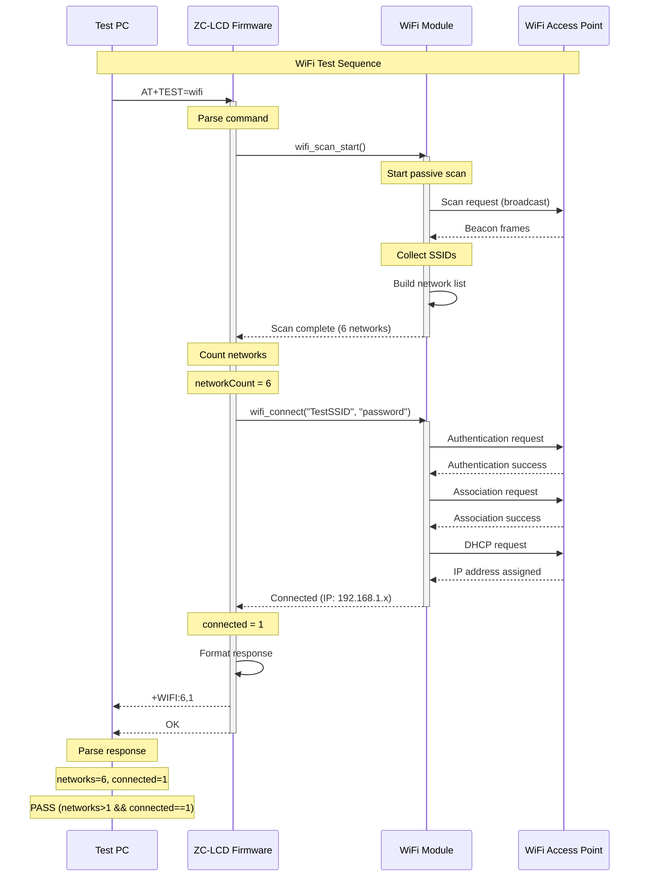

### WiFi Test State Machine

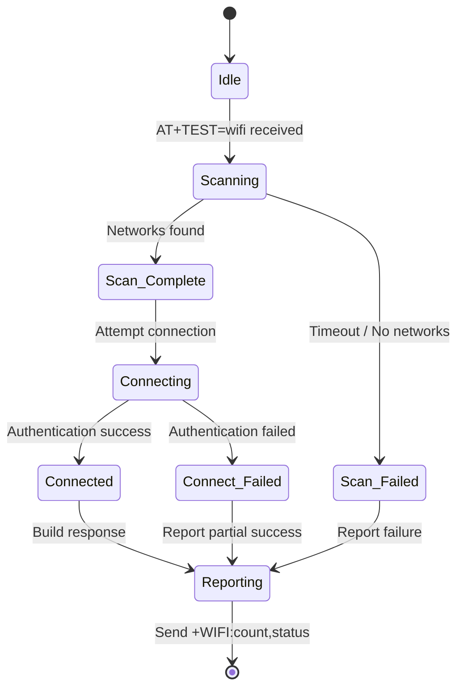

### WiFi Test Flowchart

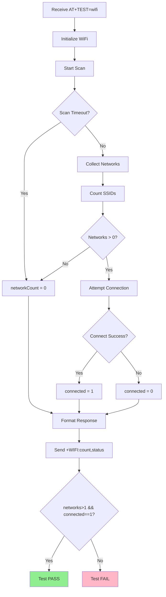

---

## RS485 Test Sequence

### RS485 Loopback Test

```mermaid
sequenceDiagram
    participant PC as Test PC
    participant FW as ZC-LCD Firmware
    participant RS485 as RS485 Transceiver
    participant LOOP as Loopback Fixture
    
    Note over PC,LOOP: RS485 Loopback Test
    
    PC->>FW: AT+TEST=rs485
    activate FW
    Note over FW: Parse command
    
    FW->>RS485: Configure UART (9600 baud)
    Note over RS485: Set to transmit mode
    
    FW->>FW: Prepare test pattern
    Note over FW: value = 4096 (0x1000)
    
    FW->>RS485: Send data (4096)
    activate RS485
    RS485->>LOOP: TX differential signal (A/B)
    Note over LOOP: Loopback: A→A, B→B
    LOOP-->>RS485: RX differential signal
    deactivate RS485
    
    Note over RS485: Switch to receive mode
    RS485->>FW: Data received
    
    FW->>FW: Read received data
    Note over FW: receivedValue = 4096
    
    FW->>FW: Compare sent vs received
    
    alt Value Matches
        Note over FW: pass = true
        FW-->>PC: +RS485:4096
    else Value Mismatch
        Note over FW: pass = false
        FW-->>PC: +RS485:<wrong_value>
    end
    
    FW-->>PC: OK
    deactivate FW
    
    Note over PC: Parse response
    Note over PC: PASS if value == 4096
```

### RS485 Internal Flow

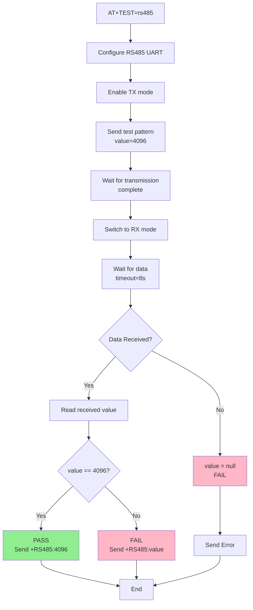

### RS485 Timing Diagram

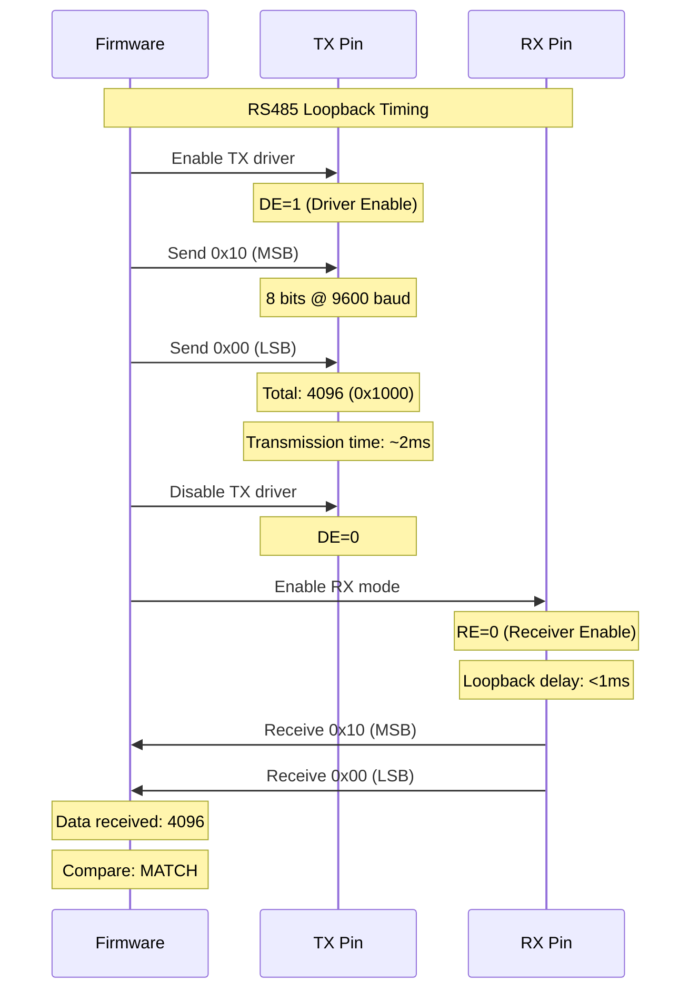

---

## I2C Sensor Test Sequence

### SHT40 Sensor Reading

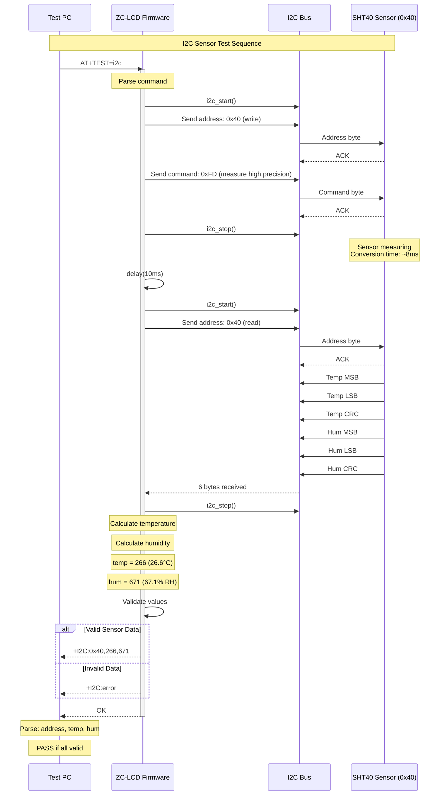

### I2C Communication Flowchart

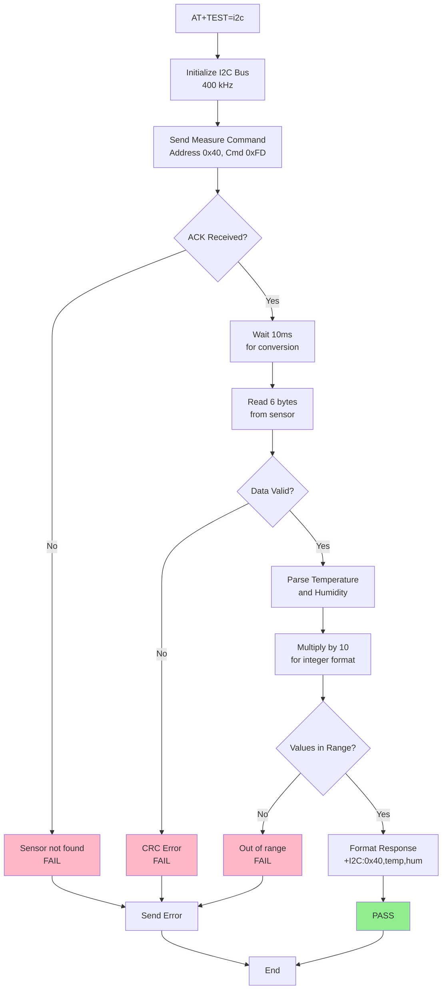

### SHT40 Data Conversion

```mermaid
graph LR
    A[Raw 16-bit Temp<br/>0x5F83] --> B[Convert to Celsius<br/>-45 + 175*(raw/65535)]
    B --> C[Result: 26.6°C]
    C --> D[Multiply by 10<br/>266]
    D --> E[Send to PC<br/>temp=266]
    
    F[Raw 16-bit Hum<br/>0xABCD] --> G[Convert to %RH<br/>100*(raw/65535)]
    G --> H[Result: 67.1% RH]
    H --> I[Multiply by 10<br/>671]
    I --> J[Send to PC<br/>hum=671]
    
    style E fill:#90EE90
    style J fill:#90EE90
```

---

## LCD Touch Test Sequence

### Touch Detection and Counting

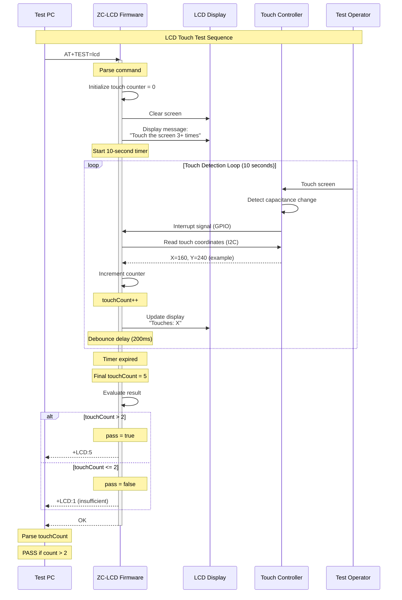

### Touch Test State Machine

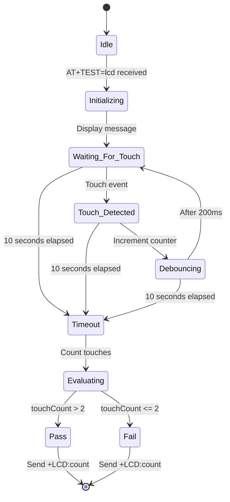

### Touch Test Flowchart

```mermaid
graph TD
    A[AT+TEST=lcd] --> B[Clear LCD screen]
    B --> C[Display instruction<br/>"Touch screen 3+ times"]
    C --> D[Initialize counter = 0]
    D --> E[Start 10-second timer]
    E --> F{Touch Event?}
    F -->|Yes| G[Read touch coordinates]
    G --> H[Increment counter]
    H --> I[Update display<br/>show count]
    I --> J[Debounce delay 200ms]
    J --> F
    F -->|No, Timer| K{Timeout?}
    K -->|No| F
    K -->|Yes| L{touchCount > 2?}
    L -->|Yes| M[PASS<br/>Send +LCD:count]
    L -->|No| N[FAIL<br/>Send +LCD:count]
    M --> O[End]
    N --> O
    
    style M fill:#90EE90
    style N fill:#FFB6C6
```

### Touch Event Timing

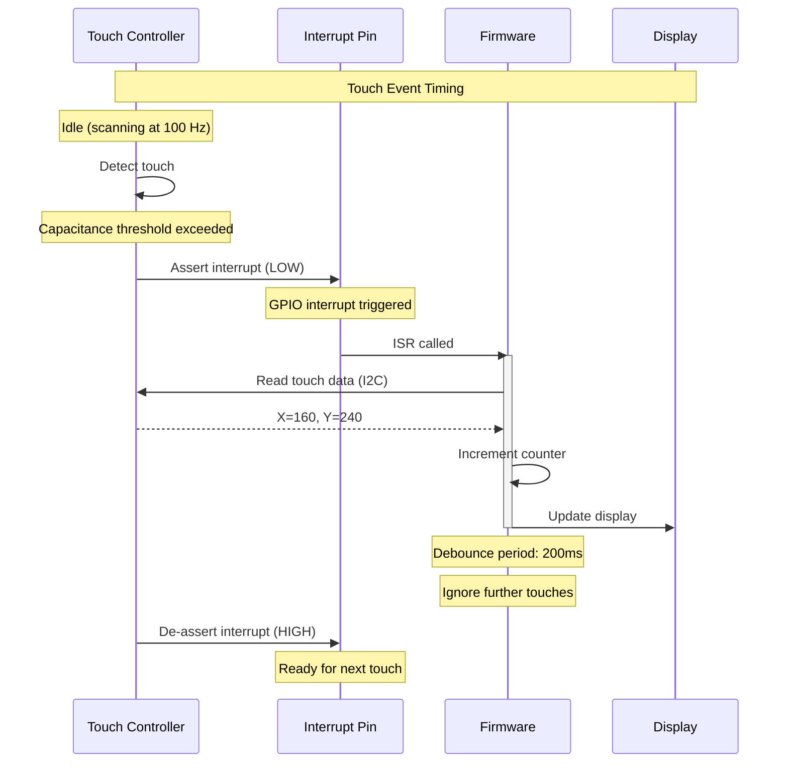

---

## Results Processing

### Test Results Aggregation

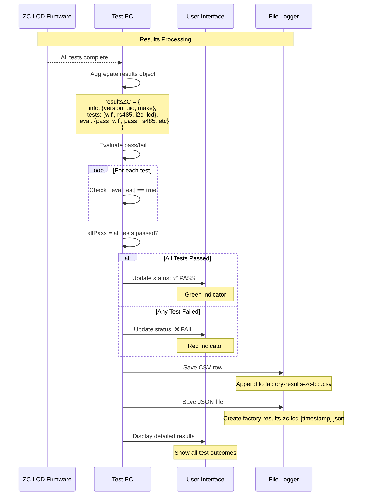

### Results Evaluation Logic

```mermaid
graph TD
    A[All tests completed] --> B{WiFi Test}
    B -->|networks>1 && connected==1| C{RS485 Test}
    B -->|FAIL| Z[Overall FAIL]
    
    C -->|value==4096| D{I2C Test}
    C -->|FAIL| Z
    
    D -->|Valid address & readings| E{LCD Test}
    D -->|FAIL| Z
    
    E -->|touchCount>2| F[All tests PASS]
    E -->|FAIL| Z
    
    F --> G[Set passAll = true]
    Z --> H[Set passAll = false]
    
    G --> I[Save results]
    H --> I
    
    I --> J[Update UI]
    J --> K[Log to file]
    
    style F fill:#90EE90
    style Z fill:#FFB6C6
```

---

## Error Handling Flows

### Timeout Handling

```mermaid
sequenceDiagram
    participant PC as Test PC
    participant FW as ZC-LCD Firmware
    
    Note over PC,FW: Command Timeout Handling
    
    PC->>FW: AT+TEST=wifi
    Note over PC: Start 30-second timeout timer
    
    alt Normal Response
        FW-->>PC: +WIFI:6,1 (within 10s)
        FW-->>PC: OK
        Note over PC: Cancel timeout timer
        Note over PC: Process result
    else Timeout Occurs
        Note over FW: Device not responding
        Note over PC: 30 seconds elapsed
        Note over PC: Timeout timer fires
        PC->>PC: Mark test as FAILED
        Note over PC: Error: "WiFi test timeout"
        PC->>PC: Continue to next test
    end
```

### Connection Loss Handling

```mermaid
stateDiagram-v2
    [*] --> Connected
    
    Connected --> Running_Test : Test command sent
    Running_Test --> Test_Complete : Response received
    Test_Complete --> Connected : Ready for next test
    
    Running_Test --> Connection_Lost : Serial error
    Connected --> Connection_Lost : Serial error
    
    Connection_Lost --> Reconnecting : Auto-reconnect attempt
    Reconnecting --> Connected : Success
    Reconnecting --> Failed : Max retries exceeded
    
    Failed --> [*] : Abort testing
```

### Error Response Handling

```mermaid
graph TD
    A[Send AT Command] --> B[Wait for Response]
    B --> C{Response Type?}
    
    C -->|+PREFIX:data| D[Expected response]
    C -->|ERROR| E[Device error]
    C -->|Unknown command| F[Unsupported command]
    C -->|Timeout| G[No response]
    
    D --> H[Parse data]
    H --> I[Mark test result]
    
    E --> J[Log error message]
    J --> K[Mark test FAIL]
    
    F --> L[Check firmware version]
    L --> M[Mark test FAIL]
    
    G --> N[Retry command]
    N --> O{Retry < 3?}
    O -->|Yes| A
    O -->|No| P[Mark test FAIL]
    
    I --> Q[Continue to next test]
    K --> Q
    M --> Q
    P --> Q
    
    style I fill:#90EE90
    style K fill:#FFB6C6
    style M fill:#FFB6C6
    style P fill:#FFB6C6
```

---

## State Diagrams

### Overall Test State Machine

```mermaid
stateDiagram-v2
    [*] --> Disconnected
    
    Disconnected --> Connecting : User action
    Connecting --> Connected : Serial port opened
    Connecting --> Error : Connection failed
    
    Connected --> Reading_Info : Auto-start
    Reading_Info --> Info_Complete : VERSION, UID, MAKE read
    Reading_Info --> Error : Timeout / Parse error
    
    Info_Complete --> Test_WiFi : Start tests
    Test_WiFi --> Test_RS485 : WiFi complete
    Test_RS485 --> Test_I2C : RS485 complete
    Test_I2C --> Test_LCD : I2C complete
    Test_LCD --> Processing_Results : LCD complete
    
    Test_WiFi --> Error : Test failed critically
    Test_RS485 --> Error : Test failed critically
    Test_I2C --> Error : Test failed critically
    Test_LCD --> Error : Test failed critically
    
    Processing_Results --> Results_Ready : Evaluation complete
    Results_Ready --> Connected : Stay connected
    Results_Ready --> Disconnecting : Auto-disconnect
    
    Error --> Recovering : Retry
    Recovering --> Connected : Recovered
    Recovering --> Disconnected : Fatal error
    
    Disconnecting --> Disconnected : Port closed
    
    Connected --> Disconnecting : User action
```

### Individual Test State Machine

```mermaid
stateDiagram-v2
    [*] --> Idle
    
    Idle --> Command_Sent : AT+TEST=X received
    Command_Sent --> Executing : Firmware processing
    
    Executing --> Hardware_Active : Interact with hardware
    Hardware_Active --> Response_Building : Data collected
    Response_Building --> Response_Sent : +PREFIX:data sent
    
    Response_Sent --> Pass : Criteria met
    Response_Sent --> Fail : Criteria not met
    
    Executing --> Timeout : Time exceeded
    Hardware_Active --> Timeout : Time exceeded
    
    Timeout --> Fail : Mark as failed
    
    Pass --> [*]
    Fail --> [*]
```

---

## Timing Diagrams

### Complete Test Timing

```
Time (s)  0    5    10   15   20   25   30   35   40   45
          |----|----|----|----|----|----|----|----|----|----|
Connect   [===]
Info Read      [===]
WiFi           [==========]
RS485                    [========]
I2C                              [====]
LCD                                   [==========]
Results                                         [==]
          |----|----|----|----|----|----|----|----|----|----|

Legend:
[===]  Activity period
|      Time marker (5 seconds)
```

### Detailed WiFi Test Timing

```
Time (ms) 0    2000  4000  6000  8000  10000
          |-----|-----|-----|-----|-----|
Scan Start[
Scanning       [===============]
Scan Done                      *
Connect Start                   [
Connecting                       [======]
Connected                               *
Response                                 [==]
          |-----|-----|-----|-----|-----|

* = Event marker
[ = Start of activity
] = End of activity
```

---

## Revision History

| Version | Date | Changes | Author |
|---------|------|---------|--------|
| 1.0 | 2025-12-09 | Initial sequence diagrams for ZC-LCD testing | Documentation Team |

---

**Related Documentation:**
- [← Back to ZC-LCD README](./ZCLCD-README.md)
- [← Hardware Overview](./ZCLCD-Overview.md)
- [Next: Test Cases →](./ZCLCD-TestCases.md)
- [Source Code Manual](./ZCLCD-SourceCode.md)
- [Troubleshooting](./ZCLCD-Troubleshooting.md)
