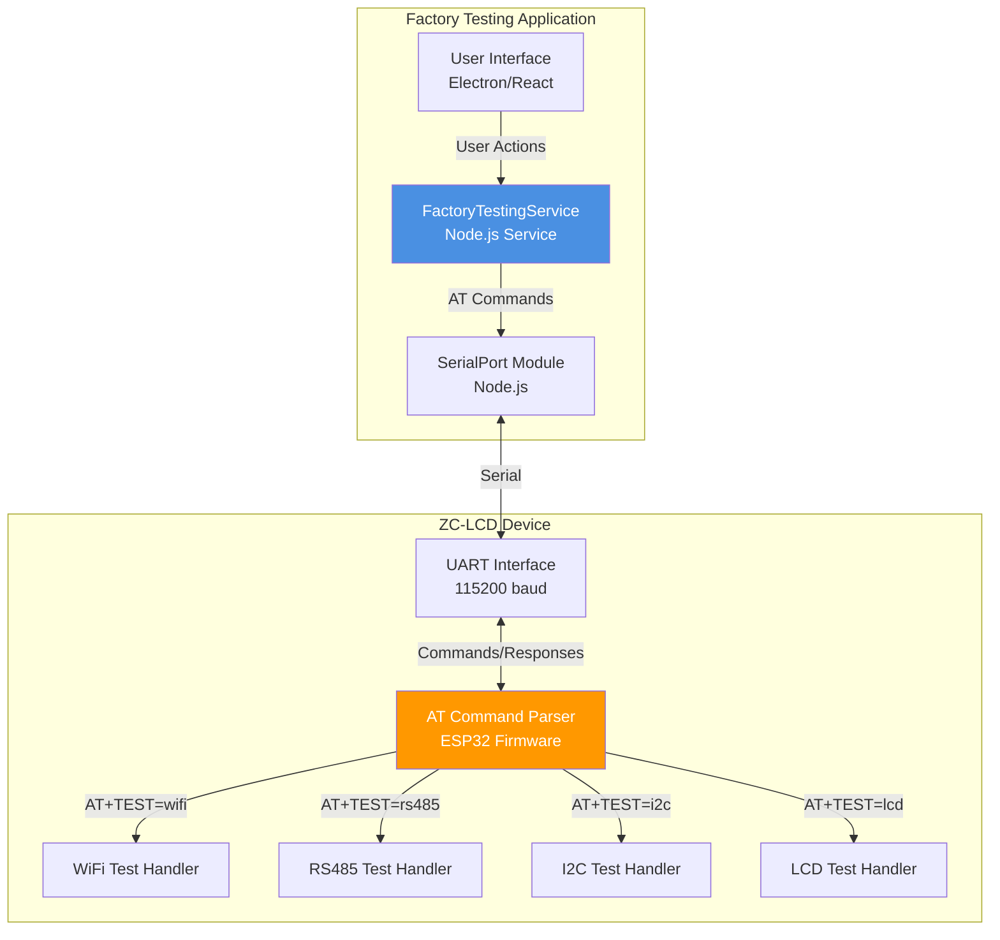
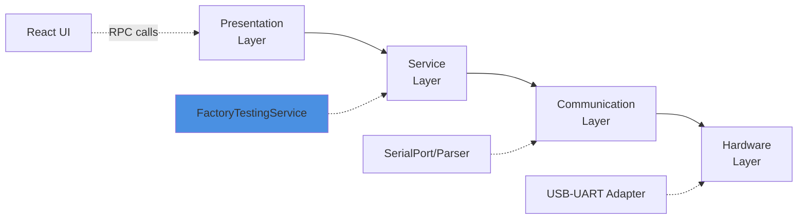
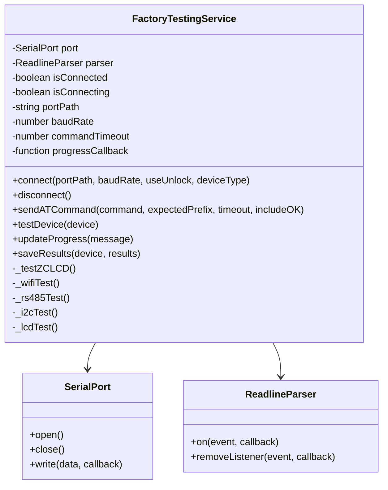
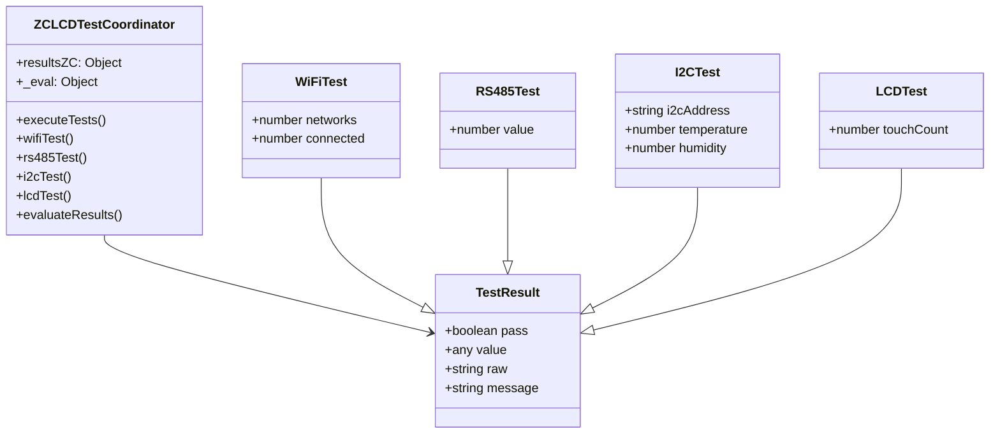
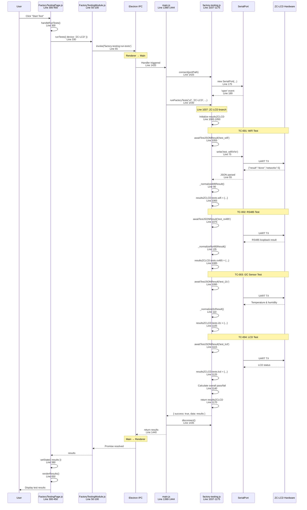
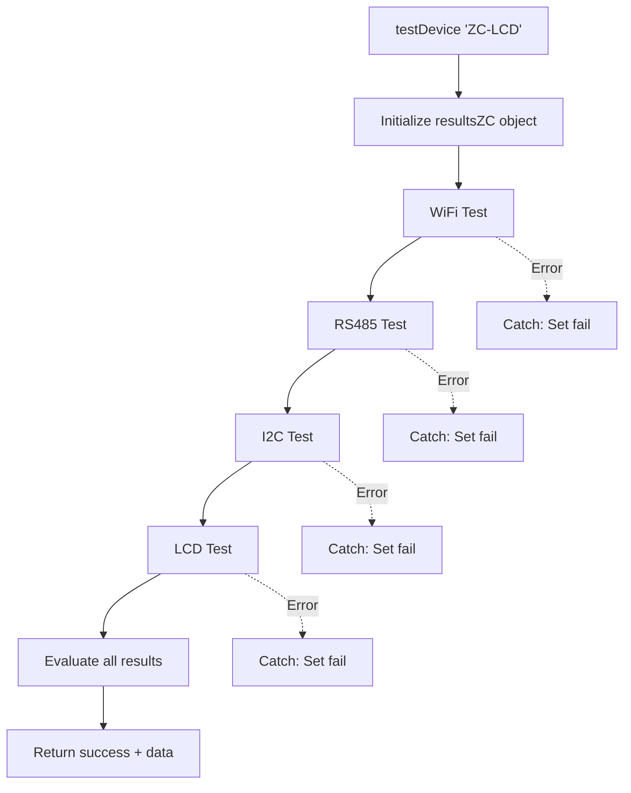
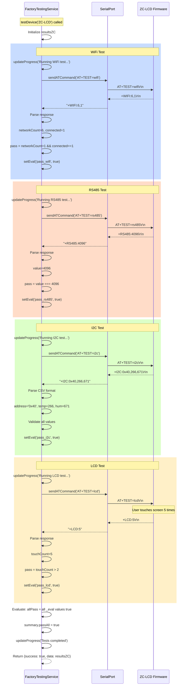
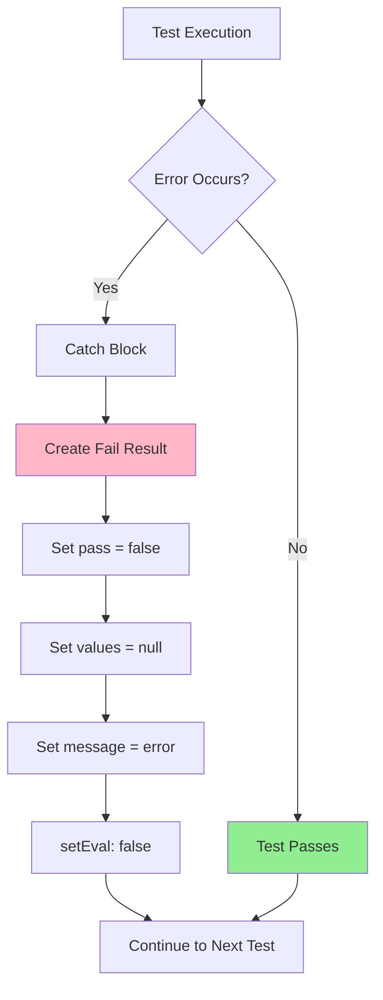

# ZC-LCD Source Code Manual (SOFTWARE MANUAL)

**Device:** ZC-LCD (Zone Controller with LCD)  
**Target Audience:** Software Developers, Maintainers  
**Source File:** `services/factory-testing.js` (lines 1037-1175)  
**Last Updated:** December 9, 2025

---

## Table of Contents

1. [Architecture Overview](#architecture-overview)
2. [Class Diagrams](#class-diagrams)
3. [ZC-LCD Implementation](#zc-lcd-implementation)
4. [Method Documentation](#method-documentation)
5. [Data Structures](#data-structures)
6. [Test Execution Flow](#test-execution-flow)
7. [Error Handling](#error-handling)
8. [Adding New Tests](#adding-new-tests)
9. [Code Examples](#code-examples)

---

## Architecture Overview

### System Architecture



### Software Layers



---

## Class Diagrams

### FactoryTestingService Class



### ZC-LCD Test Flow Class



---

## ZC-LCD Implementation

### Complete Source Code (Lines 1037-1175)

```javascript
if (device === 'ZC-LCD') {
  const resultsZC = {
    info: {},
    tests: {},
    _eval: {}
  };

  const setEval = (key, state) => {
    resultsZC._eval[key] = state === true;
  };

  this.updateProgress('ZC-LCD: Starting tests...');

  // WiFi test: AT+TEST=wifi → +WIFI:6,1 (networks>1, connected=1)
  this.updateProgress('ZC-LCD: Running WiFi test...');
  try {
    const resp = await this.sendATCommand('AT+TEST=wifi', '+WIFI:', 30000, false);
    const payload = resp.replace('+WIFI:', '').trim();
    const parts = payload.split(',');
    const networkCount = Number(parts[0] || '0');
    const connected = Number(parts[1] || '0');
    const pass = Number.isFinite(networkCount) && networkCount > 1 && connected === 1;
    resultsZC.tests.wifi = {
      pass,
      networks: networkCount,
      connected,
      raw: resp,
      message: pass ? `Networks: ${networkCount}, connected` : `Networks=${networkCount}, connected=${connected}`
    };
    setEval('pass_wifi', pass);
  } catch (err) {
    resultsZC.tests.wifi = {
      pass: false,
      networks: null,
      connected: null,
      raw: null,
      message: err.message || 'WiFi test failed'
    };
    setEval('pass_wifi', false);
  }

  // RS485 test: AT+TEST=rs485 → +RS485:4096 (must be exactly 4096)
  this.updateProgress('ZC-LCD: Running RS485 test...');
  try {
    const resp = await this.sendATCommand('AT+TEST=rs485', '+RS485:', 30000, false);
    const payload = resp.replace('+RS485:', '').trim();
    // Expected format: +RS485:4096 (value should be 4096 for pass)
    const value = Number(payload);
    const pass = value === 4096;
    resultsZC.tests.rs485 = {
      pass,
      value,
      raw: resp,
      message: pass ? 'RS485 test passed (value=4096)' : `Expected 4096, received ${value}`
    };
    setEval('pass_rs485', pass);
  } catch (err) {
    resultsZC.tests.rs485 = {
      pass: false,
      value: null,
      raw: null,
      message: err.message || 'RS485 test failed'
    };
    setEval('pass_rs485', false);
  }

  // I2C test: AT+TEST=i2c → +I2C:0x40,266,671 (address, temp, humidity with OK)
  this.updateProgress('ZC-LCD: Running I2C test...');
  try {
    const resp = await this.sendATCommand('AT+TEST=i2c', '+I2C:', 30000, false);
    const payload = resp.replace('+I2C:', '').trim();
    // Expected format: +I2C:0x40,266,671 (i2c_address, temp*10, hum*10)
    const parts = payload.split(',');
    const i2cAddress = parts[0] ? parts[0].trim() : '';
    const temp = parts[1] ? Number(parts[1].trim()) : null;
    const hum = parts[2] ? Number(parts[2].trim()) : null;
    
    // Validate: must have valid address and reasonable sensor values
    const addressValid = i2cAddress && i2cAddress.startsWith('0x');
    const tempValid = temp !== null && Number.isFinite(temp);
    const humValid = hum !== null && Number.isFinite(hum);
    const pass = addressValid && tempValid && humValid;
    
    resultsZC.tests.i2c = {
      pass,
      i2cAddress,
      temperature: temp,
      humidity: hum,
      raw: resp,
      message: pass ? `I2C: ${i2cAddress}, Temp: ${temp}, Hum: ${hum}` : 'Invalid I2C values'
    };
    setEval('pass_i2c', pass);
  } catch (err) {
    resultsZC.tests.i2c = {
      pass: false,
      i2cAddress: null,
      temperature: null,
      humidity: null,
      raw: null,
      message: err.message || 'I2C test failed'
    };
    setEval('pass_i2c', false);
  }

  // LCD test: AT+TEST=lcd → +LCD:5 (touch count > 2 for pass)
  this.updateProgress('ZC-LCD: Running LCD test...');
  try {
    const resp = await this.sendATCommand('AT+TEST=lcd', '+LCD:', 30000, false);
    const payload = resp.replace('+LCD:', '').trim();
    // Expected format: +LCD:5 (touch count must be > 2)
    const touchCount = Number(payload);
    const pass = Number.isFinite(touchCount) && touchCount > 2;
    resultsZC.tests.lcd = {
      pass,
      touchCount,
      raw: resp,
      message: pass ? `LCD test passed (touches: ${touchCount})` : `Touch count: ${touchCount} (need > 2)`
    };
    setEval('pass_lcd', pass);
  } catch (err) {
    resultsZC.tests.lcd = {
      pass: false,
      touchCount: null,
      raw: null,
      message: err.message || 'LCD test failed'
    };
    setEval('pass_lcd', false);
  }

  const allPass = Object.keys(resultsZC._eval).length > 0 && Object.values(resultsZC._eval).every(Boolean);
  resultsZC.summary = {
    passAll: allPass
  };

  this.updateProgress('ZC-LCD tests completed');
  return { success: true, data: resultsZC };
}
```

---

## Detailed Code Execution Flow

### Complete Execution Trace: Start Test Button Click (ZC-LCD)

This diagram shows the **complete call stack** with exact file locations and line numbers:



### Stack Trace: ZC-LCD Test Execution

```
User clicks "Start Test"
  ↓
[UI] FactoryTestingPage.js:300 handleRunTests()
  ↓
[UI] FactoryTestingModule.js:65 ipcRenderer.invoke()
  ═══════════════════════════════════════════════════════════
  IPC BOUNDARY
  ═══════════════════════════════════════════════════════════
  ↓
[Main] main.js:1420 ipcMain.handle()
  ↓
[Service] factory-testing.js:159 connect()
  ↓
[Service] factory-testing.js:1032 runFactoryTests()
  ↓
[Service] factory-testing.js:1037 if (device === 'ZC-LCD')
  ↓
[Service] factory-testing.js:1043-1050 Initialize resultsZCLCD
  ↓
═══════════════════════════════════════════════════════════
Test Sequence: WiFi → RS485 → I2C → LCD
═══════════════════════════════════════════════════════════
  ↓
[Service] factory-testing.js:1055 awaitTestJSONResult('test_wifi')
  ↓
[Service] factory-testing.js:30 awaitTestJSONResult()
  ↓
[Service] factory-testing.js:75 port.write()
  ↓
[Service] factory-testing.js:90 _normalizeWifiResult()
  ↓
[Service] factory-testing.js:1075 awaitTestJSONResult('test_rs485')
  ↓
[Service] factory-testing.js:135 _normalizeRs485Result()
  ↓
[Service] factory-testing.js:1095 awaitTestJSONResult('test_i2c')
  ↓
[Service] factory-testing.js:110 _normalizeI2cResult()
  ↓
[Service] factory-testing.js:1115 awaitTestJSONResult('test_lcd')
  ↓
[Service] factory-testing.js:1140 Calculate pass/fail
  ↓
[Service] factory-testing.js:1170 return resultsZCLCD
```

---

## Method Documentation

### Main Test Method: `testDevice(device)`

**Purpose:** Coordinates all tests for ZC-LCD device type.

**Signature:**
```javascript
async testDevice(device: string): Promise<{success: boolean, data: Object}>
```

**Parameters:**
- `device` (string): Device type identifier, must be "ZC-LCD"

**Returns:**
```typescript
{
  success: boolean,
  data: {
    info: {},
    tests: {
      wifi: TestResult,
      rs485: TestResult,
      i2c: TestResult,
      lcd: TestResult
    },
    _eval: {
      pass_wifi: boolean,
      pass_rs485: boolean,
      pass_i2c: boolean,
      pass_lcd: boolean
    },
    summary: {
      passAll: boolean
    }
  }
}
```

**Flow Diagram:**


---

### Helper Method: `sendATCommand()`

**Purpose:** Send AT command and wait for expected response.

**Signature:**
```javascript
async sendATCommand(
  command: string,
  expectedPrefix: string,
  timeout: number,
  includeOK: boolean
): Promise<string>
```

**Parameters:**
- `command`: AT command to send (e.g., "AT+TEST=wifi")
- `expectedPrefix`: Expected response prefix (e.g., "+WIFI:")
- `timeout`: Milliseconds to wait (e.g., 30000 for 30 seconds)
- `includeOK`: Whether to wait for "OK" terminator (false for ZC-LCD)

**Returns:** String containing the response with prefix (e.g., "+WIFI:6,1")

**Throws:** Error on timeout or communication failure

**Example:**
```javascript
const resp = await this.sendATCommand('AT+TEST=wifi', '+WIFI:', 30000, false);
// resp = "+WIFI:6,1"
```

---

### Helper Method: `setEval(key, state)`

**Purpose:** Store pass/fail state for individual tests in evaluation object.

**Signature:**
```javascript
function setEval(key: string, state: boolean): void
```

**Parameters:**
- `key`: Evaluation key (e.g., "pass_wifi")
- `state`: Boolean pass/fail state

**Side Effect:** Sets `resultsZC._eval[key] = state`

**Example:**
```javascript
setEval('pass_wifi', true);  // resultsZC._eval.pass_wifi = true
setEval('pass_rs485', false); // resultsZC._eval.pass_rs485 = false
```

---

### Helper Method: `updateProgress(message)`

**Purpose:** Send progress update to UI during testing.

**Signature:**
```javascript
updateProgress(message: string): void
```

**Parameters:**
- `message`: Progress message (e.g., "ZC-LCD: Running WiFi test...")

**Example:**
```javascript
this.updateProgress('ZC-LCD: Starting tests...');
this.updateProgress('ZC-LCD: Running WiFi test...');
this.updateProgress('ZC-LCD tests completed');
```

---

## Data Structures

### resultsZC Object Structure

```typescript
interface ZCLCDResults {
  info: {},  // Reserved for device info (version, UID, make)
  
  tests: {
    wifi: WiFiTestResult,
    rs485: RS485TestResult,
    i2c: I2CTestResult,
    lcd: LCDTestResult
  },
  
  _eval: {
    pass_wifi: boolean,
    pass_rs485: boolean,
    pass_i2c: boolean,
    pass_lcd: boolean
  },
  
  summary: {
    passAll: boolean
  }
}
```

### WiFiTestResult Structure

```typescript
interface WiFiTestResult {
  pass: boolean,
  networks: number | null,
  connected: number | null,
  raw: string | null,
  message: string
}
```

**Example:**
```json
{
  "pass": true,
  "networks": 6,
  "connected": 1,
  "raw": "+WIFI:6,1",
  "message": "Networks: 6, connected"
}
```

### RS485TestResult Structure

```typescript
interface RS485TestResult {
  pass: boolean,
  value: number | null,
  raw: string | null,
  message: string
}
```

**Example:**
```json
{
  "pass": true,
  "value": 4096,
  "raw": "+RS485:4096",
  "message": "RS485 test passed (value=4096)"
}
```

### I2CTestResult Structure

```typescript
interface I2CTestResult {
  pass: boolean,
  i2cAddress: string | null,
  temperature: number | null,
  humidity: number | null,
  raw: string | null,
  message: string
}
```

**Example:**
```json
{
  "pass": true,
  "i2cAddress": "0x40",
  "temperature": 266,
  "humidity": 671,
  "raw": "+I2C:0x40,266,671",
  "message": "I2C: 0x40, Temp: 266, Hum: 671"
}
```

### LCDTestResult Structure

```typescript
interface LCDTestResult {
  pass: boolean,
  touchCount: number | null,
  raw: string | null,
  message: string
}
```

**Example:**
```json
{
  "pass": true,
  "touchCount": 5,
  "raw": "+LCD:5",
  "message": "LCD test passed (touches: 5)"
}
```

---

## Test Execution Flow

### Detailed Execution Sequence



---

## Error Handling

### Try-Catch Pattern

Each test is wrapped in try-catch to isolate failures:

```javascript
try {
  const resp = await this.sendATCommand('AT+TEST=wifi', '+WIFI:', 30000, false);
  // ... parse and validate ...
  setEval('pass_wifi', true);
} catch (err) {
  resultsZC.tests.wifi = {
    pass: false,
    networks: null,
    connected: null,
    raw: null,
    message: err.message || 'WiFi test failed'
  };
  setEval('pass_wifi', false);
}
```

### Error Scenarios

| Scenario | Behavior | Result |
|----------|----------|--------|
| **Timeout** | sendATCommand throws error | Test marked as FAIL, null values |
| **Invalid response** | Parse fails, values null/NaN | Test marked as FAIL |
| **Wrong value** | Validation fails | Test marked as FAIL with actual value |
| **Connection lost** | sendATCommand throws | Test marked as FAIL |

### Error Recovery



---

## Adding New Tests

### Steps to Add a New Test

1. **Add Test Command Handler in Firmware**
2. **Add Test Execution in Service**
3. **Parse Response**
4. **Validate Result**
5. **Store Result**

### Example: Adding a New "Button" Test

```javascript
// Step 1: Add after LCD test
this.updateProgress('ZC-LCD: Running Button test...');
try {
  // Step 2: Send command
  const resp = await this.sendATCommand('AT+TEST=button', '+BUTTON:', 30000, false);
  
  // Step 3: Parse response
  const payload = resp.replace('+BUTTON:', '').trim();
  const buttonPressed = Number(payload);
  
  // Step 4: Validate
  const pass = buttonPressed === 1; // Button was pressed
  
  // Step 5: Store result
  resultsZC.tests.button = {
    pass,
    buttonPressed,
    raw: resp,
    message: pass ? 'Button test passed' : 'Button not pressed'
  };
  setEval('pass_button', pass);
} catch (err) {
  resultsZC.tests.button = {
    pass: false,
    buttonPressed: null,
    raw: null,
    message: err.message || 'Button test failed'
  };
  setEval('pass_button', false);
}
```

---

## Code Examples

### Example 1: WiFi Test Logic

```javascript
// Parse response: "+WIFI:6,1"
const payload = resp.replace('+WIFI:', '').trim(); // "6,1"
const parts = payload.split(',');                  // ["6", "1"]
const networkCount = Number(parts[0] || '0');      // 6
const connected = Number(parts[1] || '0');         // 1

// Validate
const pass = Number.isFinite(networkCount) && 
             networkCount > 1 && 
             connected === 1;

// Result: pass = true (6 > 1 AND 1 === 1)
```

### Example 2: I2C Test Parsing

```javascript
// Parse response: "+I2C:0x40,266,671"
const payload = resp.replace('+I2C:', '').trim();  // "0x40,266,671"
const parts = payload.split(',');                  // ["0x40", "266", "671"]
const i2cAddress = parts[0] ? parts[0].trim() : '';
const temp = parts[1] ? Number(parts[1].trim()) : null;
const hum = parts[2] ? Number(parts[2].trim()) : null;

// Validate
const addressValid = i2cAddress && i2cAddress.startsWith('0x');
const tempValid = temp !== null && Number.isFinite(temp);
const humValid = hum !== null && Number.isFinite(hum);
const pass = addressValid && tempValid && humValid;

// Result:
//   addressValid = true ('0x40' starts with '0x')
//   tempValid = true (266 is finite number)
//   humValid = true (671 is finite number)
//   pass = true
```

### Example 3: Overall Pass Evaluation

```javascript
// _eval object after all tests:
// {
//   pass_wifi: true,
//   pass_rs485: true,
//   pass_i2c: true,
//   pass_lcd: true
// }

const allPass = Object.keys(resultsZC._eval).length > 0 && 
                Object.values(resultsZC._eval).every(Boolean);

// Object.values(resultsZC._eval) = [true, true, true, true]
// .every(Boolean) = true (all elements are true)
// allPass = true
```

---

## Revision History

| Version | Date | Changes | Author |
|---------|------|---------|--------|
| 1.0 | 2025-12-09 | Initial source code documentation for ZC-LCD | Documentation Team |

---

**Related Documentation:**
- [← Back to ZC-LCD README](./ZCLCD-README.md)
- [← Hardware Overview](./ZCLCD-Overview.md)
- [← Sequence Diagrams](./ZCLCD-Sequence.md)
- [← Test Cases](./ZCLCD-TestCases.md)
- [Next: Troubleshooting →](./ZCLCD-Troubleshooting.md)
