# ZC-LCD - Test Cases Documentation

**Device Type:** GEN-2 (ESP32-based with LCD touchscreen)  
**Target Audience:** Test Operators, QA Engineers, Beginners  
**Last Updated:** December 9, 2025

---

## Table of Contents

- [Test Summary](#test-summary)
- [Pre-Testing Requirements](#pre-testing-requirements)
- [Test Execution Flow](#test-execution-flow)
- [Individual Test Cases](#individual-test-cases)
  - [TC-001: WiFi Connectivity Test](#tc-001-wifi-connectivity-test)
  - [TC-002: RS485 Communication Test](#tc-002-rs485-communication-test)
  - [TC-003: I2C Sensor Test (SHT40)](#tc-003-i2c-sensor-test-sht40)
  - [TC-004: LCD Touch Test](#tc-004-lcd-touch-test)
- [Pass/Fail Criteria](#passfail-criteria)
- [Test Results Interpretation](#test-results-interpretation)
- [Quick Troubleshooting](#quick-troubleshooting)

---

## Test Summary

### Test Coverage

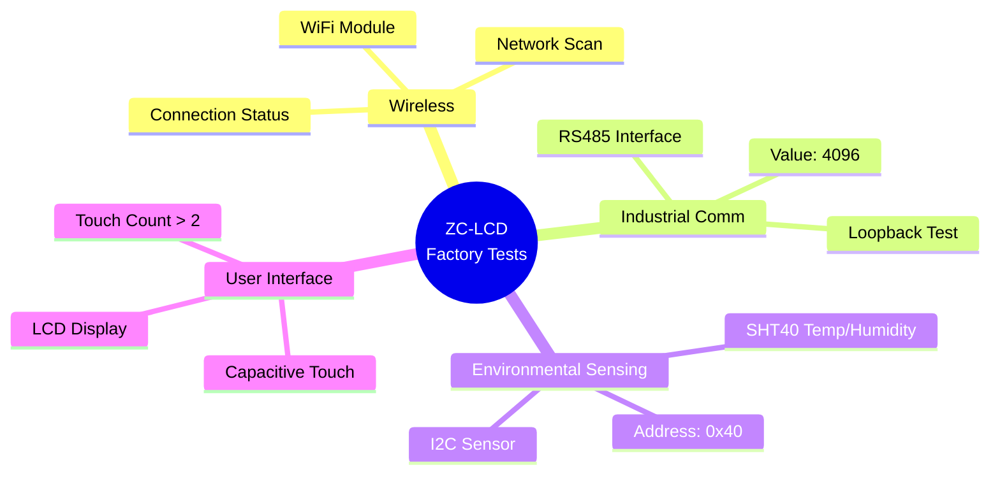

### Test Statistics

| Category | Test Count | Duration | Criticality |
|----------|------------|----------|-------------|
| **Wireless Communication** | 1 | ~10 sec | Critical |
| **Industrial Interface** | 1 | ~8 sec | Critical |
| **Sensor Validation** | 1 | ~5 sec | High |
| **Display & Touch** | 1 | ~10 sec | Critical |
| **TOTAL** | 4 | ~35 sec | - |

**Test Characteristics:**
- All tests run with **30-second timeout**
- Tests are **independent** (one failure doesn't block others)
- **LCD test requires user interaction** (touch screen 3+ times)
- Results stored in structured format for CSV/JSON export

---

## Pre-Testing Requirements

### Test Fixture Setup

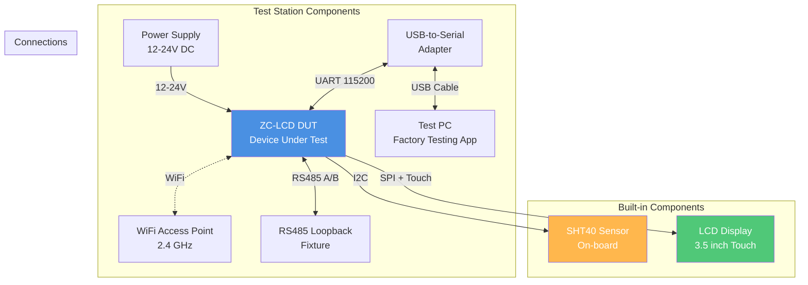

### Hardware Checklist

**Before Testing:**

- [ ] **Power Supply:** 12-24V DC regulated, 500mA minimum
- [ ] **USB-to-Serial Adapter:** FTDI or CH340, drivers installed
- [ ] **WiFi Access Point:** 2.4GHz network active (any visible SSID)
- [ ] **RS485 Loopback:** Test fixture or jumper (A-to-A, B-to-B)
- [ ] **LCD Display:** Clean screen, no visible defects
- [ ] **Touch Panel:** No cracks or dead zones
- [ ] **PC Application:** NubeIO EOL Toolkit v1.5.0 or later

### Software Checklist

- [ ] Factory Testing application installed and updated
- [ ] COM port drivers installed (FTDI/CH340)
- [ ] WiFi AP configured and broadcasting
- [ ] Test operator trained on LCD touch interaction
- [ ] Results directory configured (for CSV/JSON logs)

### Environmental Requirements

**Testing Environment:**
- Temperature: 20-28°C (optimal for SHT40 sensor calibration)
- Humidity: 30-70% RH (typical factory floor)
- WiFi: At least 2 APs visible (for network count validation)
- Lighting: Adequate for viewing LCD screen
- ESD Protection: Grounded workstation, wrist straps

---

## Test Execution Flow

### High-Level Test Sequence

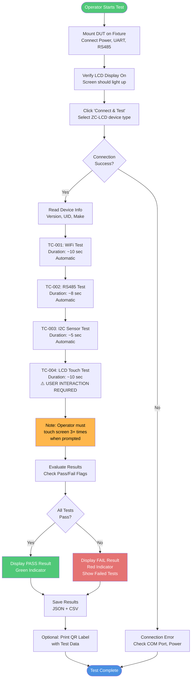

### Test Sequence State Machine

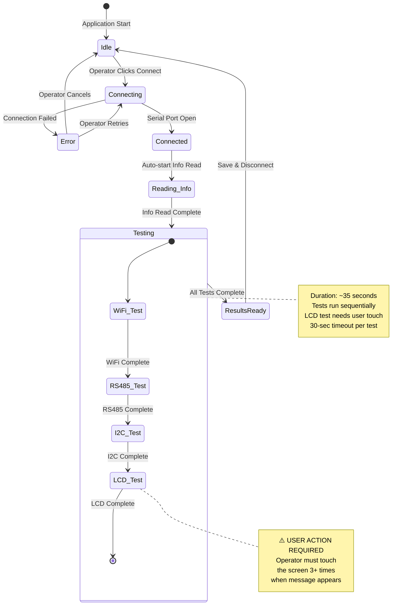

---

## Individual Test Cases

## TC-001: WiFi Connectivity Test

### Test Information

| Field | Value |
|-------|-------|
| **Test ID** | TC-001 |
| **Category** | Wireless Communication |
| **Priority** | Critical |
| **Duration** | ~10 seconds |
| **Dependencies** | None |
| **User Interaction** | None (automatic) |

### Objective

Verify the WiFi module can scan for available 2.4GHz networks and establish a connection to a test access point. This ensures the WiFi radio, antenna, and driver stack are fully functional.

### Test Procedure

```mermaid
flowchart TD
    START([TC-001 Start]) --> PREREQ[Prerequisites:<br/>WiFi AP must be available<br/>within range 2 meters]
    
    PREREQ --> SEND[Send AT Command<br/>AT+TEST=wifi]
    SEND --> SCAN[ESP32 WiFi Scan<br/>Passive scan on channels 1-11<br/>Duration: 3-8 seconds]
    
    SCAN --> COUNT[Count Detected Networks<br/>Build SSID list]
    COUNT --> CONNECT[Attempt Connection<br/>to Test SSID with Password<br/>Duration: 2-5 seconds]
    
    CONNECT --> WAIT[Wait for Response<br/>Timeout: 30 sec]
    WAIT --> PARSE{Response<br/>Received?}
    
    PARSE -->|No| TIMEOUT[Timeout Error<br/>WiFi not responding]
    TIMEOUT --> FAIL_TIMEOUT[Test FAILED<br/>WiFi module timeout]
    
    PARSE -->|Yes| EXTRACT[Extract Data<br/>Format: +WIFI: count,status]
    EXTRACT --> SPLIT[Parse CSV Format<br/>networkCount, connected]
    
    SPLIT --> VALIDATE{Valid<br/>Format?}
    VALIDATE -->|No| FAIL_FORMAT[Test FAILED<br/>Invalid response format]
    
    VALIDATE -->|Yes| CHECK_NETS{Networks<br/>Found > 1?}
    CHECK_NETS -->|No| FAIL_SCAN[Test FAILED<br/>Insufficient networks<br/>Expected >1, got ≤1]
    
    CHECK_NETS -->|Yes| CHECK_CONN{Connected<br/>= 1?}
    CHECK_CONN -->|No| FAIL_CONNECT[Test FAILED<br/>Scan OK but<br/>connection failed]
    
    CHECK_CONN -->|Yes| PASS[Test PASSED<br/>WiFi fully functional<br/>Networks: {count}<br/>Status: Connected]
    
    PASS --> END([TC-001 Complete])
    FAIL_TIMEOUT --> END
    FAIL_FORMAT --> END
    FAIL_SCAN --> END
    FAIL_CONNECT --> END
    
    style PASS fill:#50C878,color:#fff
    style FAIL_TIMEOUT fill:#E57373,color:#fff
    style FAIL_FORMAT fill:#E57373,color:#fff
    style FAIL_SCAN fill:#E57373,color:#fff
    style FAIL_CONNECT fill:#E57373,color:#fff
```

### AT Command Details

**Command:**
```
AT+TEST=wifi
```

**Expected Response:**
```
+WIFI:6,1
OK
```

**Response Format:**
- Prefix: `+WIFI:`
- Format: `{networkCount},{connected}`
- `networkCount`: Number of WiFi networks detected (integer ≥ 2)
- `connected`: Connection status (1 = connected, 0 = failed)

**Example Responses:**

| Response | Networks | Connected | Result | Reason |
|----------|----------|-----------|--------|--------|
| `+WIFI:6,1` | 6 | Yes | ✅ PASS | All criteria met |
| `+WIFI:8,1` | 8 | Yes | ✅ PASS | More networks even better |
| `+WIFI:2,1` | 2 | Yes | ✅ PASS | Minimum threshold met |
| `+WIFI:1,1` | 1 | Yes | ❌ FAIL | Only 1 network (need >1) |
| `+WIFI:5,0` | 5 | No | ❌ FAIL | Scan OK, connection failed |
| `+WIFI:0,0` | 0 | No | ❌ FAIL | No networks detected |

### Pass/Fail Criteria

**Pass Conditions:**
✅ Response received within 30 seconds  
✅ Network count **strictly > 1** (at least 2 networks)  
✅ Connected status = 1 (successfully connected)  

**Fail Conditions:**
❌ Timeout (no response within 30 seconds)  
❌ Network count ≤ 1 (0 or 1 network)  
❌ Connected status = 0 (scan worked but connection failed)  
❌ Invalid response format (parse error)  
❌ ERROR response from device  

**Why Network Count > 1?**

Multiple networks indicate:
- WiFi radio is actively scanning (not cached data)
- Antenna is properly connected
- RF sensitivity is adequate
- Test environment is realistic

### Example Test Results

**PASS Example:**
```json
{
  "pass": true,
  "networks": 6,
  "connected": 1,
  "raw": "+WIFI:6,1",
  "message": "Networks: 6, connected"
}
```

**FAIL Example (Only 1 Network):**
```json
{
  "pass": false,
  "networks": 1,
  "connected": 1,
  "raw": "+WIFI:1,1",
  "message": "Networks=1, connected=1"
}
```

**FAIL Example (No Connection):**
```json
{
  "pass": false,
  "networks": 5,
  "connected": 0,
  "raw": "+WIFI:5,0",
  "message": "Networks=5, connected=0"
}
```

**FAIL Example (Timeout):**
```json
{
  "pass": false,
  "networks": null,
  "connected": null,
  "raw": null,
  "message": "Timeout waiting for +WIFI:"
}
```

### WiFi Test Decision Tree

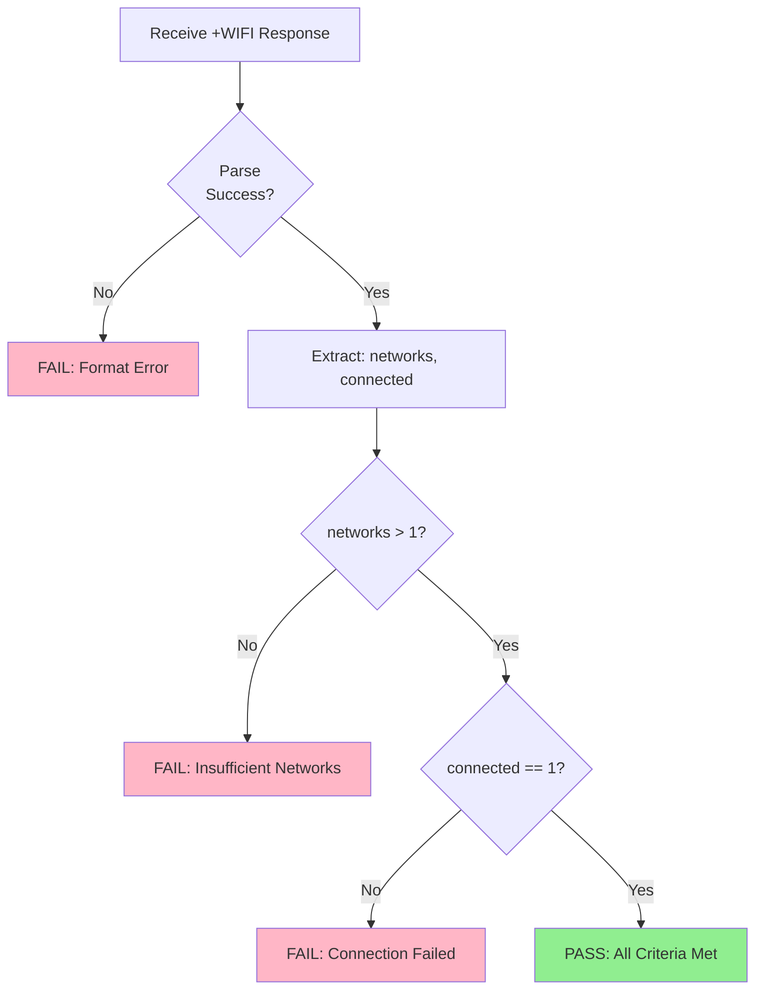

### Troubleshooting

| Symptom | Possible Cause | Solution |
|---------|----------------|----------|
| **Timeout** | ESP32 not responding | Check power, reset device, verify UART connection |
| **Networks = 0** | Antenna disconnected | Check U.FL connector, antenna placement |
| **Networks = 1** | Weak RF environment | Move test station near multiple APs |
| **Connected = 0** | Wrong test SSID/password | Update firmware with correct credentials |
| **Intermittent** | RF interference | Shield from metal, check grounding |

---

## TC-002: RS485 Communication Test

### Test Information

| Field | Value |
|-------|-------|
| **Test ID** | TC-002 |
| **Category** | Industrial Interface |
| **Priority** | Critical |
| **Duration** | ~8 seconds |
| **Dependencies** | TC-001 (UART functional) |
| **User Interaction** | None (automatic) |

### Objective

Verify the RS485 transceiver and UART hardware by performing a loopback test. The test sends a specific value (4096) and verifies it's received correctly, validating the differential signaling and transceiver circuitry.

### Test Procedure

```mermaid
flowchart TD
    START([TC-002 Start]) --> PREREQ[Prerequisites:<br/>RS485 A-B loopback<br/>connected on fixture]
    
    PREREQ --> SEND[Send AT Command<br/>AT+TEST=rs485]
    SEND --> CONFIG[Configure RS485 UART<br/>Baud: 9600 or 115200<br/>Format: 8N1]
    
    CONFIG --> PREPARE[Prepare Test Pattern<br/>value = 4096 decimal<br/>= 0x1000 hex]
    
    PREPARE --> TX[Transmit Mode<br/>DE pin HIGH<br/>Send 4096 via TX]
    
    TX --> SWITCH[Switch to RX Mode<br/>DE pin LOW<br/>Enable receiver]
    
    SWITCH --> LOOP[Loopback Fixture<br/>A line → A line<br/>B line → B line<br/>Signal returns via RX]
    
    LOOP --> WAIT[Wait for Response<br/>Timeout: 30 sec]
    WAIT --> PARSE{Response<br/>Received?}
    
    PARSE -->|No| TIMEOUT[Timeout Error<br/>No data received]
    TIMEOUT --> FAIL_TIMEOUT[Test FAILED<br/>RS485 timeout]
    
    PARSE -->|Yes| EXTRACT[Extract Value<br/>Remove '+RS485:' prefix]
    EXTRACT --> CONVERT[Convert to Integer<br/>Parse decimal string]
    
    CONVERT --> VALID{Valid<br/>Number?}
    VALID -->|No| FAIL_FORMAT[Test FAILED<br/>Invalid number format]
    
    VALID -->|Yes| CHECK{Value<br/>= 4096?}
    CHECK -->|No| FAIL_VALUE[Test FAILED<br/>Expected: 4096<br/>Received: {value}]
    
    CHECK -->|Yes| PASS[Test PASSED<br/>RS485 loopback verified<br/>Value: 4096]
    
    PASS --> END([TC-002 Complete])
    FAIL_TIMEOUT --> END
    FAIL_FORMAT --> END
    FAIL_VALUE --> END
    
    style PASS fill:#50C878,color:#fff
    style FAIL_TIMEOUT fill:#E57373,color:#fff
    style FAIL_FORMAT fill:#E57373,color:#fff
    style FAIL_VALUE fill:#E57373,color:#fff
```

### AT Command Details

**Command:**
```
AT+TEST=rs485
```

**Expected Response:**
```
+RS485:4096
OK
```

**Response Format:**
- Prefix: `+RS485:`
- Expected Value: `4096` (decimal integer)
- **Critical:** Value must be **exactly** 4096 (no tolerance)

**Why 4096?**

The value 4096 (0x1000 in hex) is chosen because:
- Binary: `0001 0000 0000 0000` (single bit in nibble 3)
- Easy to identify bit errors
- Not a common noise pattern (not 0x00, 0xFF, 0xAA, 0x55)
- Validates 12-bit+ communication integrity

### Pass/Fail Criteria

**Pass Conditions:**
✅ Response received within 30 seconds  
✅ Value parsed successfully as integer  
✅ Value **exactly equals 4096** (no deviation)  

**Fail Conditions:**
❌ Timeout (no response within 30 seconds)  
❌ Value ≠ 4096 (any other number)  
❌ Invalid format (non-numeric)  
❌ ERROR response from device  

**No Tolerance:** Unlike other tests, there is **zero tolerance** for deviation. Value must be exactly 4096.

### RS485 Loopback Diagram

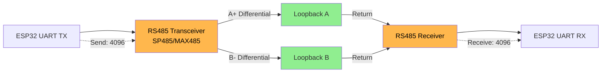

### Example Test Results

**PASS Example:**
```json
{
  "pass": true,
  "value": 4096,
  "raw": "+RS485:4096",
  "message": "RS485 test passed (value=4096)"
}
```

**FAIL Example (Wrong Value):**
```json
{
  "pass": false,
  "value": 4095,
  "raw": "+RS485:4095",
  "message": "Expected 4096, received 4095"
}
```

**FAIL Example (Zero):**
```json
{
  "pass": false,
  "value": 0,
  "raw": "+RS485:0",
  "message": "Expected 4096, received 0"
}
```

**FAIL Example (Timeout):**
```json
{
  "pass": false,
  "value": null,
  "raw": null,
  "message": "Timeout waiting for +RS485:"
}
```

### RS485 Test Value Validation

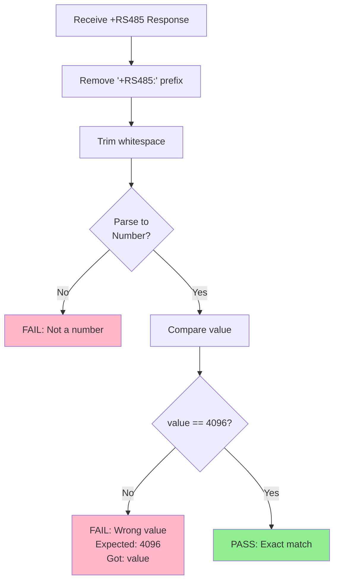

### Troubleshooting

| Symptom | Possible Cause | Solution |
|---------|----------------|----------|
| **Timeout** | RS485 transceiver not powered | Check 5V supply to SP485/MAX485 |
| **Value = 0** | No loopback connected | Check A-B jumper wires on test fixture |
| **Value ≠ 4096** | Bit errors, wrong baud rate | Check baud rate config, inspect differential lines |
| **Intermittent** | Loose loopback connection | Secure A/B connections, check solder joints |
| **Value = 65535** | Inverted polarity (A/B swapped) | Check A and B line connections |

---

## TC-003: I2C Sensor Test (SHT40)

### Test Information

| Field | Value |
|-------|-------|
| **Test ID** | TC-003 |
| **Category** | Environmental Sensing |
| **Priority** | High |
| **Duration** | ~5 seconds |
| **Dependencies** | TC-001 (UART functional) |
| **User Interaction** | None (automatic) |

### Objective

Verify the I2C bus communication and SHT40 temperature/humidity sensor functionality. This test validates:
1. I2C bus operational (SDA/SCL lines)
2. SHT40 sensor responds at correct address (0x40)
3. Sensor returns valid temperature and humidity readings

### Test Procedure

```mermaid
flowchart TD
    START([TC-003 Start]) --> SEND[Send AT Command<br/>AT+TEST=i2c]
    SEND --> INIT[Initialize I2C Bus<br/>Speed: 400 kHz Fast Mode<br/>Pins: SDA=21, SCL=22]
    
    INIT --> ADDR[Send I2C Address<br/>0x40 write<br/>Check ACK]
    
    ADDR --> ACK{ACK<br/>Received?}
    ACK -->|No| FAIL_ACK[Test FAILED<br/>Sensor not detected<br/>at address 0x40]
    
    ACK -->|Yes| CMD[Send Measure Command<br/>0xFD high precision]
    CMD --> DELAY[Wait for Conversion<br/>Delay: 10ms]
    
    DELAY --> READ[Read 6 Bytes<br/>Temp MSB/LSB/CRC<br/>Hum MSB/LSB/CRC]
    
    READ --> CALC[Calculate Values<br/>Temp = raw × formula<br/>Hum = raw × formula]
    
    CALC --> SCALE[Scale to Integer<br/>Multiply by 10<br/>temp_x10, hum_x10]
    
    SCALE --> WAIT[Wait for Response<br/>Timeout: 30 sec]
    WAIT --> PARSE{Response<br/>Received?}
    
    PARSE -->|No| TIMEOUT[Timeout Error]
    TIMEOUT --> FAIL_TIMEOUT[Test FAILED<br/>I2C sensor timeout]
    
    PARSE -->|Yes| EXTRACT[Extract Data<br/>Format: +I2C:addr,temp,hum]
    EXTRACT --> SPLIT[Parse CSV<br/>address, temp_x10, hum_x10]
    
    SPLIT --> VALIDATE{Valid<br/>Data?}
    VALIDATE -->|No| FAIL_FORMAT[Test FAILED<br/>Invalid response format]
    
    VALIDATE -->|Yes| CHECK_ADDR{Address<br/>= 0x40?}
    CHECK_ADDR -->|No| FAIL_ADDR[Test FAILED<br/>Wrong sensor address]
    
    CHECK_ADDR -->|Yes| CHECK_VALS{Temp & Hum<br/>Numeric?}
    CHECK_VALS -->|No| FAIL_DATA[Test FAILED<br/>Invalid sensor data]
    
    CHECK_VALS -->|Yes| PASS[Test PASSED<br/>SHT40 functional<br/>Address: 0x40<br/>Temp: {temp}<br/>Humidity: {hum}]
    
    PASS --> END([TC-003 Complete])
    FAIL_ACK --> END
    FAIL_TIMEOUT --> END
    FAIL_FORMAT --> END
    FAIL_ADDR --> END
    FAIL_DATA --> END
    
    style PASS fill:#50C878,color:#fff
    style FAIL_ACK fill:#E57373,color:#fff
    style FAIL_TIMEOUT fill:#E57373,color:#fff
    style FAIL_FORMAT fill:#E57373,color:#fff
    style FAIL_ADDR fill:#E57373,color:#fff
    style FAIL_DATA fill:#E57373,color:#fff
```

### AT Command Details

**Command:**
```
AT+TEST=i2c
```

**Expected Response:**
```
+I2C:0x40,266,671
OK
```

**Response Format:**
- Prefix: `+I2C:`
- Format: `{address},{temp_x10},{humidity_x10}`
- `address`: I2C address in hex (0x40 for SHT40)
- `temp_x10`: Temperature × 10 (e.g., 266 = 26.6°C)
- `humidity_x10`: Humidity × 10 (e.g., 671 = 67.1% RH)

**Data Scaling:**

The sensor returns values multiplied by 10 to preserve precision as integers:

```
Actual Temperature = temp_x10 / 10.0
Actual Humidity    = humidity_x10 / 10.0

Example:
+I2C:0x40,266,671
  → Temperature: 26.6°C
  → Humidity: 67.1% RH
```

**Valid Ranges:**

| Parameter | Min | Typ | Max | Unit |
|-----------|-----|-----|-----|------|
| **Temperature (×10)** | -400 | 200-300 | 1250 | (×0.1°C) |
| **Humidity (×10)** | 0 | 300-700 | 1000 | (×0.1% RH) |
| **I2C Address** | - | 0x40 | - | Hex |

### Pass/Fail Criteria

**Pass Conditions:**
✅ Response received within 30 seconds  
✅ I2C address = "0x40" (SHT40 default address)  
✅ Temperature is numeric and finite  
✅ Humidity is numeric and finite  
✅ Values within physical limits (-400 to 1250 for temp, 0 to 1000 for hum)  

**Fail Conditions:**
❌ Timeout (sensor not responding)  
❌ Wrong I2C address (not 0x40)  
❌ Temperature or humidity not numeric  
❌ Values outside physical sensor range  
❌ Sensor NAK (not acknowledged)  
❌ CRC error in sensor data  

### SHT40 I2C Transaction

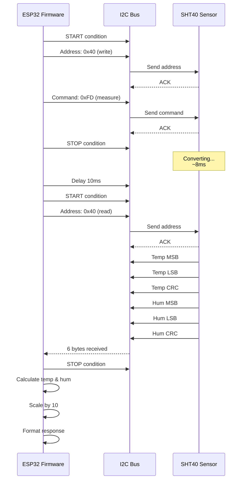

### Example Test Results

**PASS Example (Room Temperature):**
```json
{
  "pass": true,
  "i2cAddress": "0x40",
  "temperature": 266,
  "humidity": 671,
  "raw": "+I2C:0x40,266,671",
  "message": "I2C: 0x40, Temp: 266, Hum: 671"
}
```

**PASS Example (Cooler Environment):**
```json
{
  "pass": true,
  "i2cAddress": "0x40",
  "temperature": 210,
  "humidity": 450,
  "raw": "+I2C:0x40,210,450",
  "message": "I2C: 0x40, Temp: 210, Hum: 450"
}
```

**FAIL Example (Sensor Not Found):**
```json
{
  "pass": false,
  "i2cAddress": null,
  "temperature": null,
  "humidity": null,
  "raw": null,
  "message": "Timeout waiting for +I2C:"
}
```

**FAIL Example (Wrong Address):**
```json
{
  "pass": false,
  "i2cAddress": "0x44",
  "temperature": 250,
  "humidity": 500,
  "raw": "+I2C:0x44,250,500",
  "message": "Invalid I2C values"
}
```

### I2C Data Validation Logic

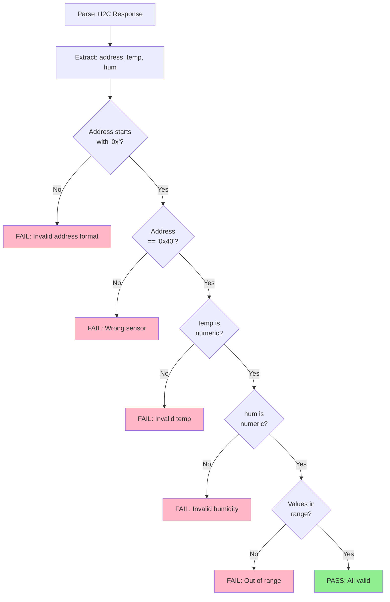

### Troubleshooting

| Symptom | Possible Cause | Solution |
|---------|----------------|----------|
| **Timeout / No ACK** | SHT40 not soldered or damaged | Inspect sensor, check soldering |
| **Wrong address (not 0x40)** | Wrong sensor model installed | Verify SHT40 (not SHT30/31), check part number |
| **Temp/Hum = 0 or invalid** | CRC error, communication issue | Check I2C pull-up resistors (4.7kΩ) |
| **Intermittent failures** | Loose connection, bus capacitance | Check PCB traces, reduce bus length |
| **Values out of range** | Sensor damaged or environmental extreme | Replace sensor, verify test room temp/humidity |

---

## TC-004: LCD Touch Test

### Test Information

| Field | Value |
|-------|-------|
| **Test ID** | TC-004 |
| **Category** | User Interface |
| **Priority** | Critical |
| **Duration** | ~10 seconds |
| **Dependencies** | TC-001 (UART functional) |
| **User Interaction** | ✅ **REQUIRED** - Operator must touch screen 3+ times |

### Objective

Verify the LCD display and capacitive touch panel are functional. This test validates:
1. LCD display can show instructions
2. Touch controller detects touch events
3. Touch events are properly counted
4. Screen responsiveness is adequate

⚠️ **Critical:** This test **requires user interaction**. The operator must physically touch the screen when prompted.

### Test Procedure

```mermaid
flowchart TD
    START([TC-004 Start]) --> SEND[Send AT Command<br/>AT+TEST=lcd]
    SEND --> CLEAR[LCD: Clear Screen<br/>Set background color]
    
    CLEAR --> DISPLAY[LCD: Display Message<br/>"Touch the screen<br/>3 or more times"]
    
    DISPLAY --> INIT[Initialize Touch Counter<br/>touchCount = 0]
    INIT --> TIMER[Start 10-Second Timer<br/>Countdown display]
    
    TIMER --> LOOP[Monitor Touch Events<br/>Scan capacitive panel]
    
    LOOP --> TOUCHED{Touch<br/>Detected?}
    
    TOUCHED -->|Yes| INCREMENT[Increment Counter<br/>touchCount++<br/>Update LCD display]
    INCREMENT --> DEBOUNCE[Debounce Delay<br/>200ms<br/>Prevent double-count]
    DEBOUNCE --> CHECK_TIME
    
    TOUCHED -->|No| CHECK_TIME{10 Seconds<br/>Elapsed?}
    
    CHECK_TIME -->|No| LOOP
    CHECK_TIME -->|Yes| FINALIZE[Finalize Count<br/>Stop monitoring]
    
    FINALIZE --> WAIT[Wait for Response<br/>Timeout: 30 sec]
    WAIT --> PARSE{Response<br/>Received?}
    
    PARSE -->|No| TIMEOUT[Timeout Error]
    TIMEOUT --> FAIL_TIMEOUT[Test FAILED<br/>LCD timeout]
    
    PARSE -->|Yes| EXTRACT[Extract Touch Count<br/>Remove '+LCD:' prefix]
    EXTRACT --> CONVERT[Convert to Integer<br/>Parse string to number]
    
    CONVERT --> VALID{Valid<br/>Number?}
    VALID -->|No| FAIL_FORMAT[Test FAILED<br/>Invalid count format]
    
    VALID -->|Yes| CHECK_COUNT{Touch Count<br/>> 2?}
    CHECK_COUNT -->|No| FAIL_COUNT[Test FAILED<br/>Insufficient touches<br/>Need >2, got {count}]
    
    CHECK_COUNT -->|Yes| PASS[Test PASSED<br/>LCD touch functional<br/>Touches: {count}]
    
    PASS --> END([TC-004 Complete])
    FAIL_TIMEOUT --> END
    FAIL_FORMAT --> END
    FAIL_COUNT --> END
    
    style PASS fill:#50C878,color:#fff
    style FAIL_TIMEOUT fill:#E57373,color:#fff
    style FAIL_FORMAT fill:#E57373,color:#fff
    style FAIL_COUNT fill:#E57373,color:#fff
    style DISPLAY fill:#FFB74D,color:#000
```

### AT Command Details

**Command:**
```
AT+TEST=lcd
```

**Expected Response:**
```
+LCD:5
OK
```

**Response Format:**
- Prefix: `+LCD:`
- Value: Touch count (integer, must be > 2)
- Example: `+LCD:5` means 5 touches detected

**LCD Display During Test:**

The ZC-LCD screen will display:
```
╔════════════════════════════╗
║  LCD TOUCH TEST            ║
║                            ║
║  Touch the screen          ║
║  3 or more times           ║
║                            ║
║  Touches: X                ║
║  Time remaining: Ys        ║
╚════════════════════════════╝
```

### Pass/Fail Criteria

**Pass Conditions:**
✅ Response received within 30 seconds  
✅ Touch count is numeric and finite  
✅ Touch count **strictly > 2** (at least 3 touches)  

**Fail Conditions:**
❌ Timeout (LCD not responding)  
❌ Touch count ≤ 2 (0, 1, or 2 touches)  
❌ Invalid format (non-numeric)  
❌ Touch count = 0 (screen not touched or not working)  

**Why > 2 Touches?**

Requiring 3+ touches ensures:
- Operator is actively engaged (not accidental touch)
- Touch sensitivity is adequate (can detect multiple events)
- Touch controller is responsive
- Screen surface is not damaged

### LCD Touch Detection Flow

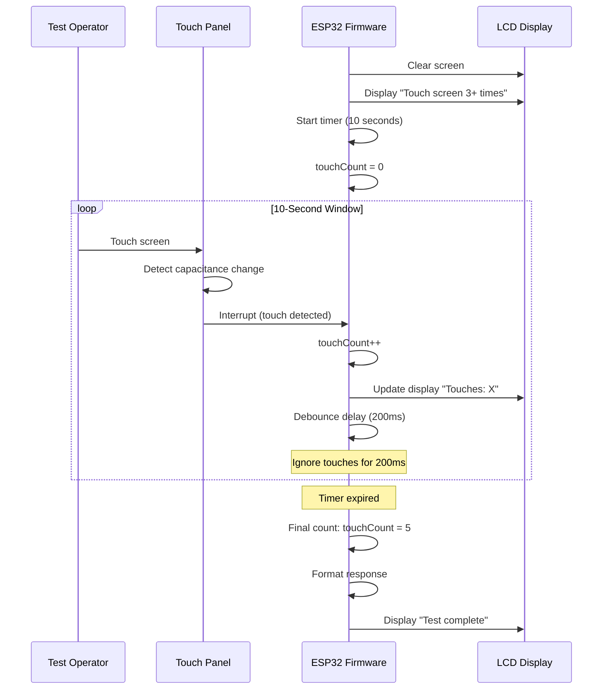

### Example Test Results

**PASS Example (5 Touches):**
```json
{
  "pass": true,
  "touchCount": 5,
  "raw": "+LCD:5",
  "message": "LCD test passed (touches: 5)"
}
```

**PASS Example (Minimum 3 Touches):**
```json
{
  "pass": true,
  "touchCount": 3,
  "raw": "+LCD:3",
  "message": "LCD test passed (touches: 3)"
}
```

**FAIL Example (Only 2 Touches):**
```json
{
  "pass": false,
  "touchCount": 2,
  "raw": "+LCD:2",
  "message": "Touch count: 2 (need > 2)"
}
```

**FAIL Example (No Touches):**
```json
{
  "pass": false,
  "touchCount": 0,
  "raw": "+LCD:0",
  "message": "Touch count: 0 (need > 2)"
}
```

**FAIL Example (Timeout - Operator Forgot):**
```json
{
  "pass": false,
  "touchCount": null,
  "raw": null,
  "message": "Timeout waiting for +LCD:"
}
```

### Touch Count Validation

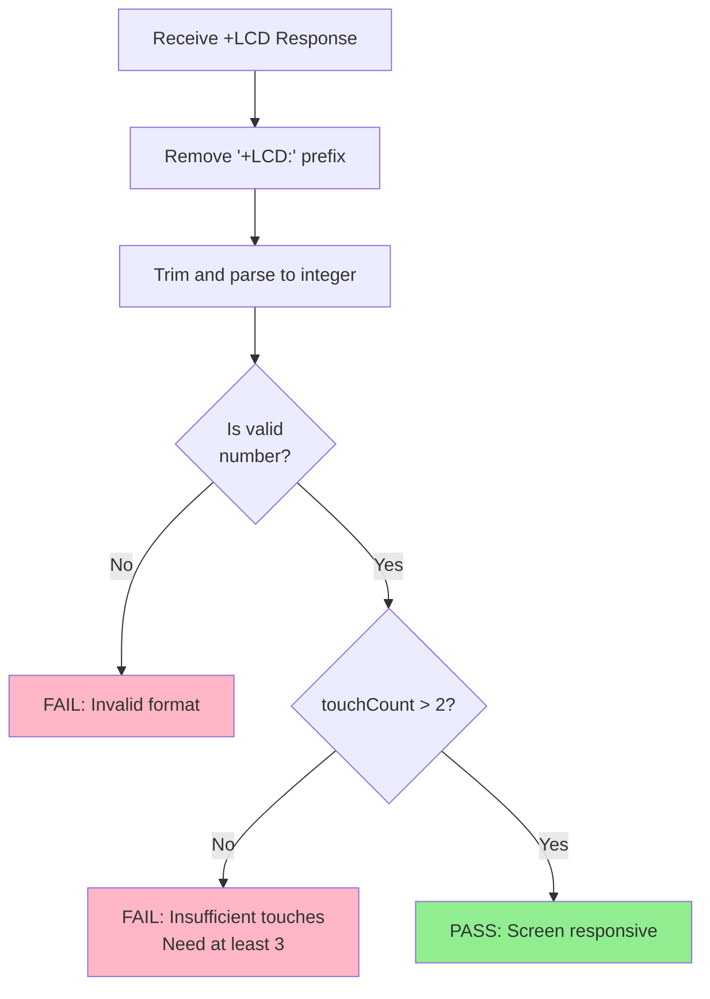

### Operator Instructions

**How to Perform LCD Touch Test:**

1. **Watch the Screen:** When TC-004 starts, the LCD will display instructions
2. **Touch Rapidly:** Touch the screen **at least 3 times** within 10 seconds
3. **See Feedback:** Each touch increments the counter on screen
4. **Wait for Result:** After 10 seconds, the test completes automatically
5. **Check Status:** Green ✅ = PASS (3+ touches), Red ❌ = FAIL (≤2 touches)

**Tips for Operators:**
- Touch firmly but gently
- Touch different areas of the screen
- Wait briefly between touches (debounce)
- Don't touch during other tests (only during TC-004)

### Troubleshooting

| Symptom | Possible Cause | Solution |
|---------|----------------|----------|
| **touchCount = 0** | Operator didn't touch screen | Re-run test, remind operator to touch |
| **touchCount = 0 (repeated)** | Touch controller not working | Check touch controller I2C connection |
| **touchCount = 1 or 2** | Operator too slow or cautious | Train operator to touch 3-5 times quickly |
| **Timeout** | LCD not powered | Check 5V backlight, 3.3V LCD logic power |
| **Screen blank** | LCD SPI not working | Check SPI bus, display controller |
| **Intermittent detection** | Touch panel damaged | Inspect for cracks, replace if needed |

---

## Pass/Fail Criteria

### Overall Device Pass Criteria

For a ZC-LCD device to **PASS** factory testing, **ALL 4 tests must pass**:

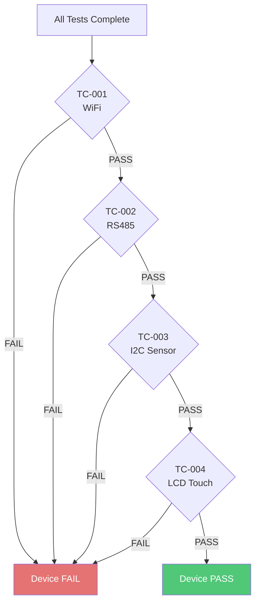

### Test-Specific Criteria Summary

| Test | Pass Criteria | Fail Examples |
|------|---------------|---------------|
| **TC-001: WiFi** | networks > 1 AND connected == 1 | networks ≤ 1, connected == 0 |
| **TC-002: RS485** | value == 4096 | value ≠ 4096, timeout |
| **TC-003: I2C** | address == 0x40, valid temp/hum | wrong address, invalid data |
| **TC-004: LCD** | touchCount > 2 | touchCount ≤ 2, timeout |

---

## Test Results Interpretation

### Result Data Structure

```json
{
  "info": {
    "version": "2.1.0",
    "uid": "A4B1C8D2E3F4A1B2",
    "deviceMake": "ZC-LCD"
  },
  "tests": {
    "wifi": {
      "pass": true,
      "networks": 6,
      "connected": 1,
      "raw": "+WIFI:6,1",
      "message": "Networks: 6, connected"
    },
    "rs485": {
      "pass": true,
      "value": 4096,
      "raw": "+RS485:4096",
      "message": "RS485 test passed (value=4096)"
    },
    "i2c": {
      "pass": true,
      "i2cAddress": "0x40",
      "temperature": 266,
      "humidity": 671,
      "raw": "+I2C:0x40,266,671",
      "message": "I2C: 0x40, Temp: 266, Hum: 671"
    },
    "lcd": {
      "pass": true,
      "touchCount": 5,
      "raw": "+LCD:5",
      "message": "LCD test passed (touches: 5)"
    }
  },
  "_eval": {
    "pass_wifi": true,
    "pass_rs485": true,
    "pass_i2c": true,
    "pass_lcd": true
  },
  "summary": {
    "passAll": true
  }
}
```

### Reading Test Results

**Green ✅ Indicators:**
- All tests passed
- Device is functional
- Ready for next production stage

**Red ❌ Indicators:**
- One or more tests failed
- Review failed test details
- Troubleshoot or reject device

**Yellow ⚠️ Indicators (if any):**
- Test completed but with warnings
- May require attention

---

## Quick Troubleshooting

### Common Failure Patterns

| Failure Pattern | Likely Root Cause | Action |
|-----------------|-------------------|--------|
| **All tests fail** | Device not powered / No UART connection | Check power, USB cable, COM port |
| **WiFi fails only** | Antenna issue | Check antenna connection, RF environment |
| **RS485 fails only** | Loopback not connected | Verify test fixture RS485 loopback |
| **I2C fails only** | Sensor not soldered | Inspect SHT40, check soldering |
| **LCD fails (touchCount=0)** | Operator error OR touch hardware | Re-run test, instruct operator to touch |
| **LCD fails (repeated)** | Touch controller defective | Replace LCD module |

### Escalation Guidelines

1. **First Failure:** Re-run test once
2. **Second Failure:** Check test fixture and connections
3. **Third Failure:** Escalate to engineering team
4. **Consistent Pattern:** Report to quality assurance

---

## Revision History

| Version | Date | Changes | Author |
|---------|------|---------|--------|
| 1.0 | 2025-12-09 | Initial test cases documentation for ZC-LCD | Documentation Team |

---

**Related Documentation:**
- [← Back to ZC-LCD README](./ZCLCD-README.md)
- [← Hardware Overview](./ZCLCD-Overview.md)
- [← Sequence Diagrams](./ZCLCD-Sequence.md)
- [Next: Source Code Manual →](./ZCLCD-SourceCode.md)
- [Troubleshooting Guide](./ZCLCD-Troubleshooting.md)
