# ZC-LCD Troubleshooting Guide

**Device:** ZC-LCD (Zone Controller with LCD)  
**Target Audience:** Test Operators, Support Engineers, QA  
**Last Updated:** December 9, 2025

---

## Table of Contents

1. [Quick Diagnostics](#quick-diagnostics)
2. [Connection Issues](#connection-issues)
3. [WiFi Test Failures](#wifi-test-failures)
4. [RS485 Test Failures](#rs485-test-failures)
5. [I2C Sensor Test Failures](#i2c-sensor-test-failures)
6. [LCD Touch Test Failures](#lcd-touch-test-failures)
7. [State Diagrams](#state-diagrams)
8. [Root Cause Analysis](#root-cause-analysis)
9. [Escalation Procedures](#escalation-procedures)

---

## Quick Diagnostics

### 5-Minute Diagnostic Flowchart

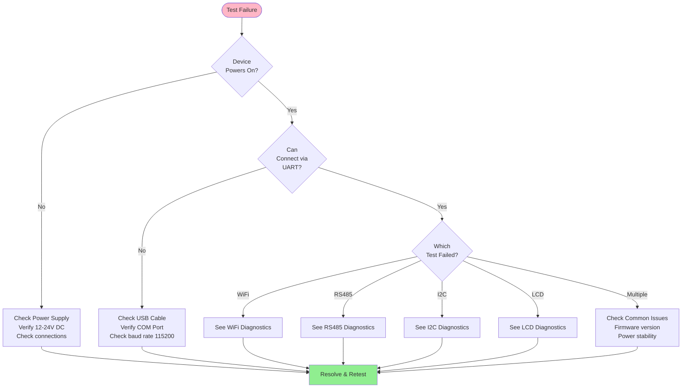

### Quick Reference Table

| Symptom | Most Likely Cause | Quick Fix | Section |
|---------|-------------------|-----------|---------|
| Cannot connect | Wrong COM port | Check Device Manager | [Connection](#connection-issues) |
| WiFi fails | No APs nearby | Move closer to WiFi router | [WiFi](#wifi-test-failures) |
| RS485 wrong value | No loopback | Connect RS485 test jumper | [RS485](#rs485-test-failures) |
| I2C fails | Sensor not detected | Check SHT40 soldering | [I2C](#i2c-sensor-test-failures) |
| LCD touchCount=0 | User didn't touch | Remind operator to touch screen | [LCD](#lcd-touch-test-failures) |
| All tests fail | Firmware issue | Reflash firmware, check version | [Root Cause](#root-cause-analysis) |

---

## Connection Issues

### Problem: Cannot Connect to ZC-LCD

#### State Diagram: Connection States

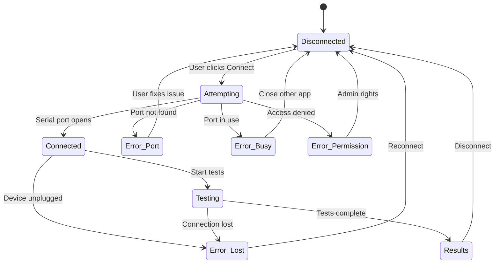

#### Symptom: "Port not found" or "Cannot open port"

**Diagnostic Steps:**

1. **Check Physical Connection**
   ```
   ✓ USB cable plugged into PC
   ✓ USB cable plugged into ZC-LCD UART header
   ✓ LED on USB-UART adapter lit (if present)
   ```

2. **Verify COM Port in Device Manager (Windows)**
   ```
   Open Device Manager → Ports (COM & LPT)
   Look for: "USB Serial Port (COMx)" or "CH340" or "FTDI"
   Note the COM port number (e.g., COM3, COM15)
   ```

3. **Check for Port Conflicts**
   ```
   Close other applications that might use serial ports:
   - Arduino IDE
   - PuTTY
   - Other factory test instances
   - Serial terminal emulators
   ```

**Solutions:**

| Cause | Solution |
|-------|----------|
| **USB cable disconnected** | Reconnect USB cable firmly |
| **Wrong COM port selected** | Select correct COM port from dropdown |
| **Driver not installed** | Install CH340 or FTDI driver |
| **Port in use by another app** | Close conflicting application |
| **USB hub issue** | Connect directly to PC USB port |

#### Symptom: "Connection timeout"

**Diagnostic Steps:**

1. **Verify Baud Rate**
   ```
   Expected: 115200
   Check settings in application
   ```

2. **Check Device Power**
   ```
   ✓ Power LED on ZC-LCD lit
   ✓ LCD screen displays something
   ✓ Power supply 12-24V DC within spec
   ```

3. **Test UART with Serial Terminal**
   ```
   Use PuTTY or similar:
   - Port: COMx
   - Baud: 115200
   - Data: 8 bits
   - Parity: None
   - Stop bits: 1
   
   Type: AT<Enter>
   Expected response: OK
   ```

**Solutions:**

| Cause | Solution |
|-------|----------|
| **Wrong baud rate** | Set baud rate to 115200 |
| **Device not powered** | Check power supply voltage |
| **Firmware not responding** | Reset device, reflash firmware |
| **UART hardware fault** | Check TX/RX connections, replace device |

---

## WiFi Test Failures

### Problem: WiFi Test Fails (networks ≤ 1 or connected = 0)

#### State Diagram: WiFi Test States

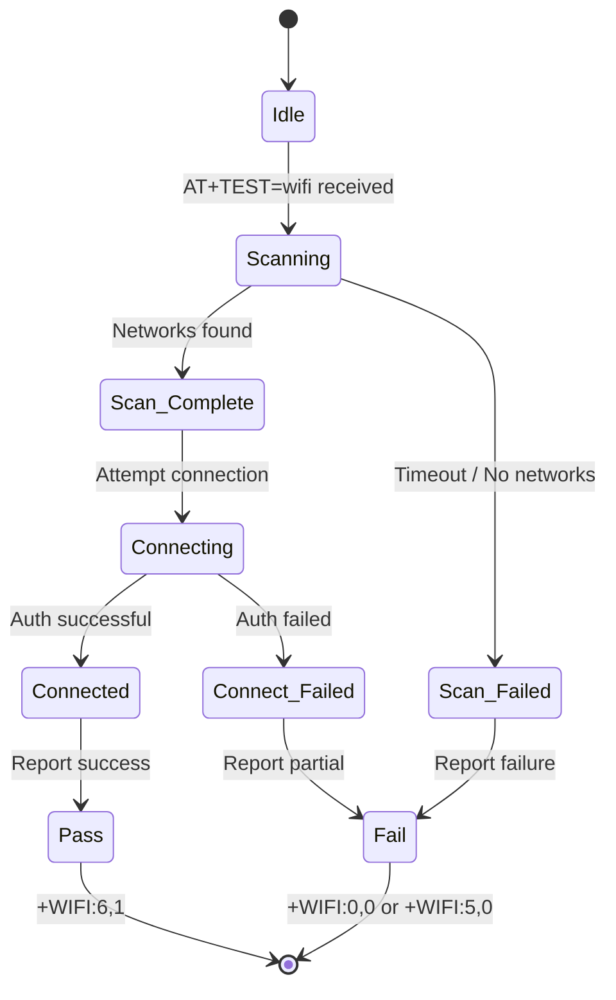

#### Symptom: networks = 0 (No networks detected)

**Diagnostic Steps:**

1. **Check WiFi Environment**
   ```
   Test with phone:
   - Open WiFi settings on smartphone
   - Count visible 2.4 GHz networks
   - Should see at least 2 networks
   ```

2. **Check Antenna Connection**
   ```
   ✓ Antenna cable connected to U.FL connector
   ✓ Antenna not damaged or bent excessively
   ✓ Connector clicked into place (not loose)
   ```

3. **Verify WiFi Module Power**
   ```
   Measure: 3.3V at WiFi module power pin
   Check: ESP32 power LED (if present)
   ```

**Solutions:**

| Cause | Solution |
|-------|----------|
| **No WiFi APs in range** | Move test station closer to router (< 3 meters) |
| **Antenna disconnected** | Reconnect antenna U.FL connector |
| **Antenna damaged** | Replace antenna |
| **Shielded environment** | Move out of metal enclosure |
| **WiFi module fault** | Reflash firmware, replace module if needed |

#### Symptom: networks = 1 (Only one network)

**Diagnostic Steps:**

1. **Survey WiFi Environment**
   ```
   Use WiFi analyzer app:
   - Scan for 2.4 GHz networks
   - Should detect 2+ networks minimum
   ```

2. **Move Test Station**
   ```
   Relocate to area with more APs:
   - Near office areas
   - Near public spaces
   - Away from isolated rooms
   ```

**Solutions:**

| Cause | Solution |
|-------|----------|
| **Isolated location** | Move test bench to area with multiple APs |
| **Weak antenna** | Replace antenna, check connection |
| **Test environment issue** | Add additional AP for testing |

#### Symptom: connected = 0 (Cannot connect)

**Diagnostic Steps:**

1. **Verify Test AP Configuration**
   ```
   Check firmware configuration:
   - Test SSID matches actual AP
   - Password is correct
   - AP is 2.4 GHz (not 5 GHz only)
   - AP security is WPA2-PSK (not Enterprise)
   ```

2. **Check AP Status**
   ```
   ✓ AP powered on and broadcasting
   ✓ AP not at client limit
   ✓ AP not MAC filtering
   ```

**Solutions:**

| Cause | Solution |
|-------|----------|
| **Wrong SSID in firmware** | Update firmware with correct test SSID |
| **Wrong password** | Update firmware with correct password |
| **AP not available** | Check AP is powered and working |
| **AP security incompatible** | Use WPA2-PSK, not WPA-Enterprise |

#### WiFi Failure Decision Tree

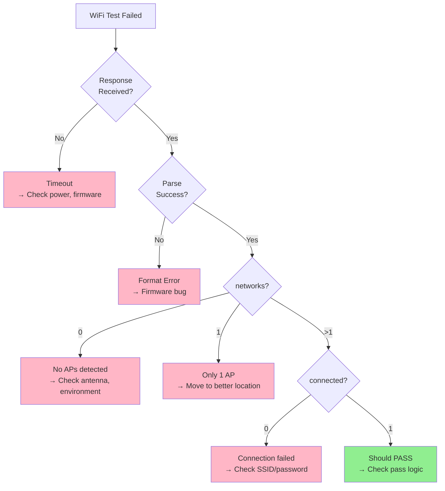

---

## RS485 Test Failures

### Problem: RS485 Test Fails (value ≠ 4096)

#### State Diagram: RS485 Test States

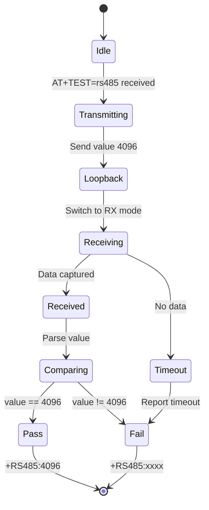

#### Symptom: value = 0

**Diagnostic Steps:**

1. **Check Loopback Connection**
   ```
   Verify test fixture:
   ✓ A line connected: TX-A to RX-A
   ✓ B line connected: TX-B to RX-B
   ✓ Jumper wires secure
   ✓ No broken traces on fixture
   ```

2. **Verify RS485 Transceiver Power**
   ```
   Measure: 5V or 3.3V at RS485 IC power pin
   Check: IC not overheating
   ```

**Solutions:**

| Cause | Solution |
|-------|----------|
| **No loopback connected** | Connect A-to-A, B-to-B jumper wires |
| **Broken fixture** | Repair or replace test fixture |
| **RS485 IC not powered** | Check power supply to transceiver |

#### Symptom: value ≠ 4096 (wrong value)

**Diagnostic Steps:**

1. **Identify Value Pattern**
   ```
   Common patterns:
   - value = 0:      No loopback
   - value = 65535:  Inverted (A/B swapped)
   - value = 4095:   Single bit error
   - Random value:   Noise, baud rate mismatch
   ```

2. **Check Differential Signaling**
   ```
   With oscilloscope:
   - Measure A-B differential voltage
   - Should see ±1.5V to ±5V
   - Clean square waves, no ringing
   ```

**Solutions:**

| Value Received | Likely Cause | Solution |
|----------------|--------------|----------|
| **0** | No loopback | Connect A/B loopback |
| **65535 (0xFFFF)** | A/B lines swapped | Swap A and B connections |
| **4095** | Single bit flip | Check for noise, grounding |
| **Random** | Baud rate mismatch | Verify UART baud rate config |

#### Symptom: Timeout (no response)

**Diagnostic Steps:**

1. **Check UART Configuration**
   ```
   Verify RS485 UART settings:
   - Baud rate: 9600 or 115200
   - Data: 8 bits
   - Parity: None
   - Stop bits: 1
   ```

2. **Check Direction Control**
   ```
   RS485 transceiver has DE (Driver Enable) pin:
   ✓ DE pin connected to GPIO
   ✓ DE toggles TX→RX correctly
   ✓ Timing: DE before TX, !DE after TX
   ```

**Solutions:**

| Cause | Solution |
|-------|----------|
| **RS485 IC fault** | Replace RS485 transceiver |
| **DE pin not working** | Check GPIO configuration |
| **UART not configured** | Reflash firmware |

---

## I2C Sensor Test Failures

### Problem: I2C Test Fails (sensor not detected or invalid data)

#### State Diagram: I2C Test States

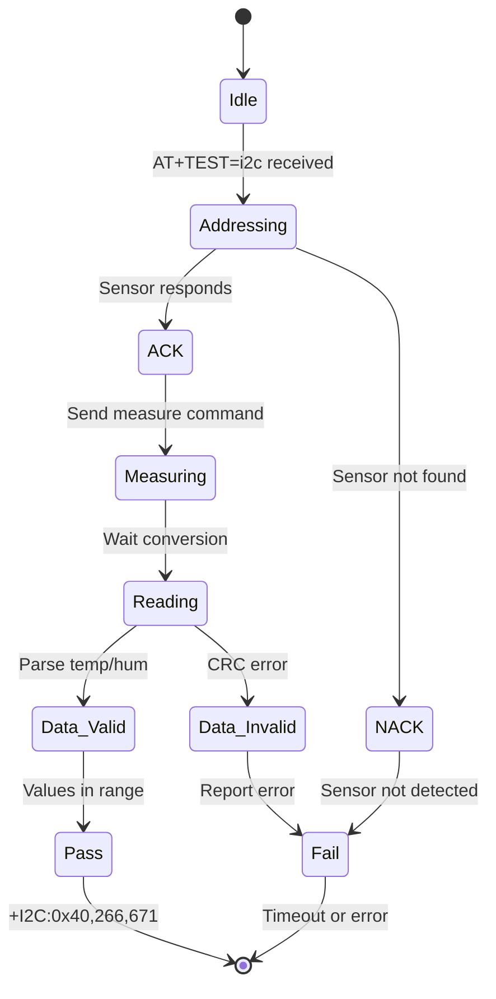

#### Symptom: Timeout / No response

**Diagnostic Steps:**

1. **Check SHT40 Sensor Presence**
   ```
   Visual inspection:
   ✓ SHT40 IC soldered on PCB
   ✓ Part number matches: SHT40 (not SHT30, SHT31)
   ✓ No visible solder bridges
   ✓ Orientation correct (pin 1 marker)
   ```

2. **Verify I2C Bus**
   ```
   Measure with multimeter (power off):
   - SDA line continuity: ESP32 GPIO21 to SHT40 SDA
   - SCL line continuity: ESP32 GPIO22 to SHT40 SCL
   - Pull-up resistors: 4.7kΩ on SDA and SCL to 3.3V
   ```

3. **Check Sensor Power**
   ```
   Measure (power on):
   - VDD at SHT40: 3.3V ±0.3V
   - GND at SHT40: 0V
   ```

**Solutions:**

| Cause | Solution |
|-------|----------|
| **Sensor not soldered** | Solder SHT40 sensor |
| **Wrong sensor model** | Replace with SHT40 (not SHT30/31) |
| **I2C bus open circuit** | Check traces, repair if broken |
| **Missing pull-ups** | Add 4.7kΩ resistors to SDA/SCL |
| **Sensor damaged** | Replace SHT40 sensor |

#### Symptom: Wrong address (not 0x40)

**Diagnostic Steps:**

1. **Identify Actual Address**
   ```
   From response:
   +I2C:0x44,250,500  → Address is 0x44
   
   I2C address table:
   0x40: SHT40 (correct)
   0x44: SHT30/SHT31 (wrong part)
   0x45: SHT35 (wrong part)
   ```

2. **Verify Part Number**
   ```
   Check IC markings:
   - SHT40: Correct sensor
   - SHT30/31/35: Wrong sensor family
   ```

**Solutions:**

| Cause | Solution |
|-------|----------|
| **Wrong sensor installed** | Replace with SHT40 (address 0x40) |
| **BOM error** | Update BOM to specify SHT40 |

#### Symptom: Invalid temperature or humidity values

**Diagnostic Steps:**

1. **Identify Value Pattern**
   ```
   Common patterns:
   - temp = 0, hum = 0:      Sensor not measuring
   - temp = -40, hum = 0:    Sensor returning default
   - temp = 999, hum = 999:  Communication error
   - Values out of range:    CRC error, bad data
   ```

2. **Check Environmental Conditions**
   ```
   Expected ranges (factory floor):
   - Temperature: 200-300 (20-30°C)
   - Humidity: 300-700 (30-70% RH)
   
   If outside:
   - Too cold: < 150 (15°C) → Check HVAC
   - Too hot: > 350 (35°C) → Check HVAC
   ```

**Solutions:**

| Value Pattern | Cause | Solution |
|---------------|-------|----------|
| **0, 0** | Sensor not initialized | Reset device, reflash firmware |
| **-400, 0** | Sensor fault | Replace SHT40 |
| **Out of range** | Environmental issue | Move to normal temp/humidity area |
| **Random** | I2C bus noise | Add capacitors, check grounding |

#### I2C Troubleshooting Flowchart

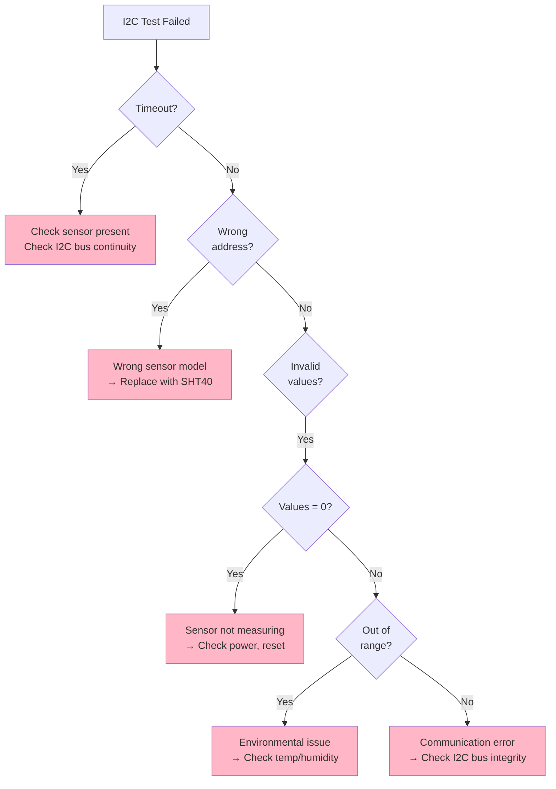

---

## LCD Touch Test Failures

### Problem: LCD Touch Test Fails (touchCount ≤ 2)

#### State Diagram: LCD Touch Test States

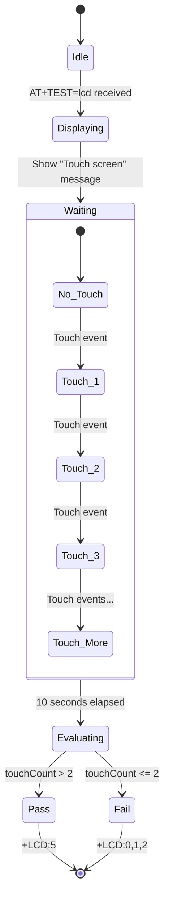

#### Symptom: touchCount = 0 (No touches detected)

**Diagnostic Steps:**

1. **Operator Training Issue**
   ```
   Interview operator:
   - Did you see the test message?
   - Did you touch the screen?
   - Did you touch 3 or more times?
   - Was there visual feedback?
   ```

2. **Check LCD Display**
   ```
   Visual verification:
   ✓ LCD screen powered on (backlight lit)
   ✓ Message "Touch screen..." visible
   ✓ Touch counter updates on screen
   ```

3. **Test Touch Manually**
   ```
   During test:
   - Touch screen firmly 5+ times
   - Touch different areas (center, corners)
   - Watch for counter increment
   ```

**Solutions:**

| Cause | Solution |
|-------|----------|
| **Operator didn't touch** | Re-run test, remind operator |
| **Operator too slow** | Train: touch quickly, 3-5 times |
| **Screen not responding** | Check touch controller (next section) |

#### Symptom: touchCount = 0 (repeated failures)

**Diagnostic Steps:**

1. **Check Touch Controller Power**
   ```
   Measure:
   - Touch controller VDD: 3.3V
   - I2C bus voltage: 3.3V on SDA/SCL
   ```

2. **Test Touch Controller I2C**
   ```
   Expected:
   - Touch controller at I2C address (e.g., 0x38)
   - Responds to I2C scan
   - Generates interrupt on touch
   ```

3. **Check Touch Panel Connection**
   ```
   Inspect:
   ✓ Flex cable from touch panel to PCB
   ✓ FPC connector locked (flip down)
   ✓ No torn flex cable
   ✓ Proper contact at all pins
   ```

**Solutions:**

| Cause | Solution |
|-------|----------|
| **Touch controller not powered** | Check 3.3V supply |
| **I2C bus fault** | Check SDA/SCL connections |
| **Flex cable disconnected** | Reconnect flex cable, lock connector |
| **Touch panel damaged** | Replace LCD module |
| **Touch controller IC fault** | Replace touch controller IC |

#### Symptom: touchCount = 1 or 2 (Insufficient touches)

**Diagnostic Steps:**

1. **Operator Behavior**
   ```
   Observe:
   - Is operator touching quickly enough?
   - Are touches registering (counter updating)?
   - Is debounce too aggressive?
   ```

2. **Touch Sensitivity**
   ```
   Test with different finger pressures:
   - Light touch: May not register
   - Firm touch: Should register reliably
   - Very firm: Risk damaging screen
   ```

**Solutions:**

| Cause | Solution |
|-------|----------|
| **Operator too cautious** | Train: 3-5 quick touches |
| **Low sensitivity** | Adjust touch threshold in firmware |
| **Screen dirty** | Clean screen with microfiber cloth |

#### Symptom: Intermittent touch detection

**Diagnostic Steps:**

1. **Check Physical Condition**
   ```
   Inspect touch panel:
   ✓ No cracks or scratches
   ✓ No air bubbles (if laminated)
   ✓ No moisture ingress
   ✓ Clean surface
   ```

2. **Test Different Areas**
   ```
   Touch mapping:
   - Center: Works / Doesn't work
   - Top-left: Works / Doesn't work
   - Top-right: Works / Doesn't work
   - Bottom-left: Works / Doesn't work
   - Bottom-right: Works / Doesn't work
   
   Identify dead zones
   ```

**Solutions:**

| Cause | Solution |
|-------|----------|
| **Screen damaged** | Replace LCD module |
| **Dead zones** | RMA, manufacturing defect |
| **Calibration issue** | Recalibrate touch (if supported) |
| **EMI interference** | Check grounding, shielding |

#### LCD Touch Failure Flowchart

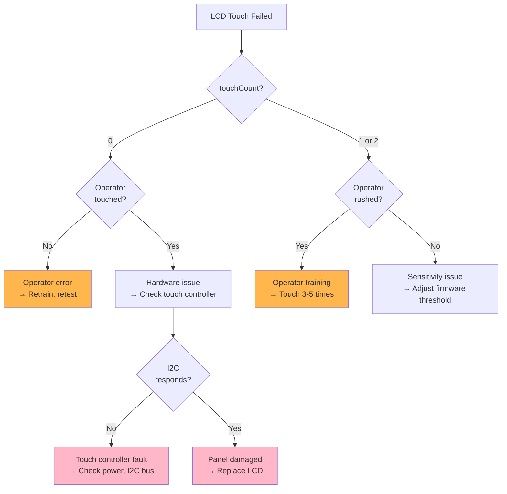

---

## State Diagrams

### Overall Device Test State Machine

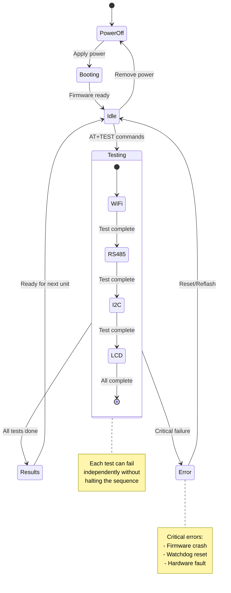

### Test Failure Recovery State Machine

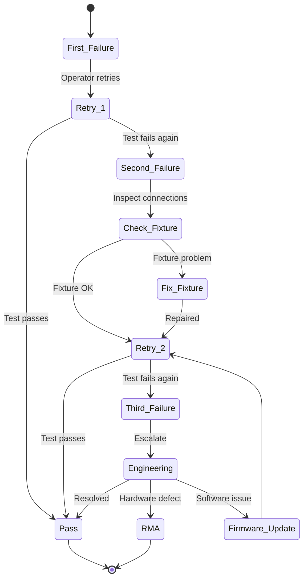

---

## Root Cause Analysis

### Failure Pattern Analysis

#### Pattern 1: All Tests Fail

**Symptoms:**
- WiFi: timeout
- RS485: timeout  
- I2C: timeout
- LCD: timeout

**Root Causes:**
1. Device not powered
2. UART connection broken
3. Firmware not loaded/corrupted
4. Wrong baud rate

**Diagnostic Tree:**
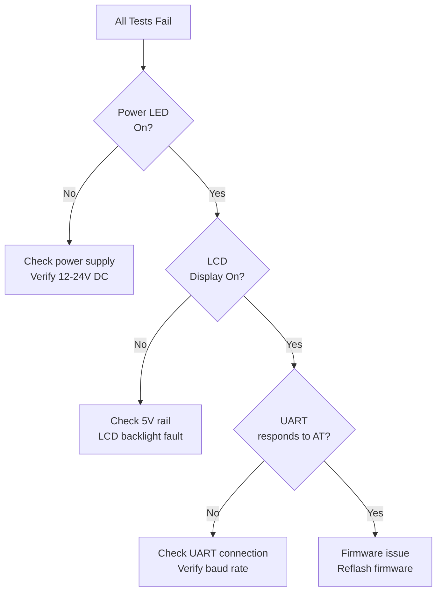

#### Pattern 2: WiFi-Only Failure

**Symptoms:**
- WiFi: networks=0 or connected=0
- RS485: pass
- I2C: pass
- LCD: pass

**Root Causes:**
1. Antenna problem
2. WiFi module fault
3. RF shielding issue
4. Test environment (no APs)

#### Pattern 3: Touch-Only Failure

**Symptoms:**
- WiFi: pass
- RS485: pass
- I2C: pass
- LCD: touchCount=0

**Root Causes:**
1. Operator error (most common)
2. Touch controller fault
3. Flex cable disconnected
4. Touch panel damaged

### Common Failure Modes

| Failure Mode | Frequency | Impact | Fix Time |
|--------------|-----------|--------|----------|
| **Operator error (LCD)** | 40% | Low | <1 min (retrain) |
| **WiFi environment** | 20% | Medium | 5 min (relocate) |
| **RS485 loopback** | 15% | Low | 2 min (reconnect) |
| **I2C sensor fault** | 10% | High | 30 min (replace) |
| **Antenna disconnected** | 8% | Medium | 5 min (reconnect) |
| **Firmware issue** | 5% | Medium | 10 min (reflash) |
| **Hardware defect** | 2% | Critical | RMA |

---

## Escalation Procedures

### Escalation Levels

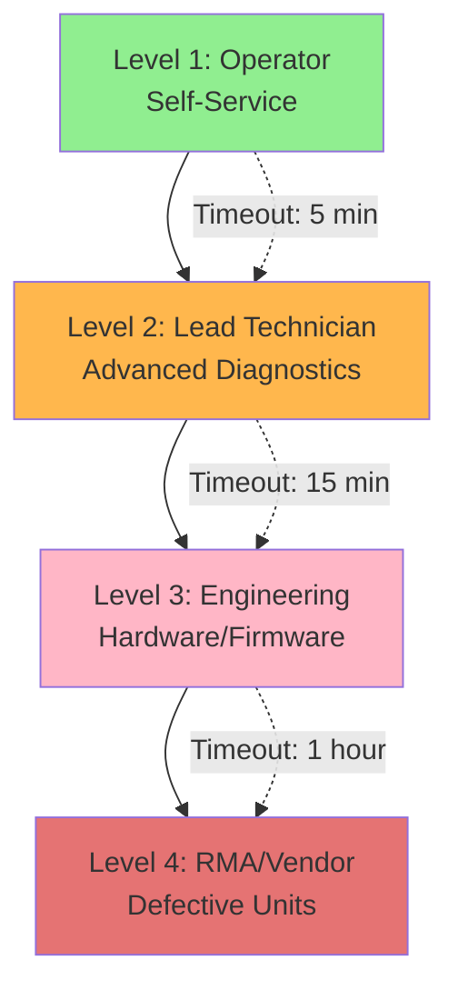

### Level 1: Operator Self-Service (0-5 minutes)

**Operator Actions:**
1. Retry test once
2. Check obvious issues:
   - Power connected?
   - USB cable connected?
   - WiFi AP nearby?
   - Did I touch the screen?
3. Refer to quick reference table
4. If unresolved → Escalate to Level 2

### Level 2: Lead Technician (5-15 minutes)

**Lead Technician Actions:**
1. Review test logs
2. Check test fixture:
   - RS485 loopback connected?
   - All connections secure?
3. Inspect DUT visually:
   - SHT40 sensor present?
   - Antenna connected?
   - LCD screen intact?
4. Test with known-good fixture
5. If unresolved → Escalate to Level 3

### Level 3: Engineering (15-60 minutes)

**Engineering Actions:**
1. Analyze failure patterns
2. Check firmware version
3. Reflash firmware if needed
4. Test individual subsystems:
   - WiFi module
   - RS485 transceiver
   - I2C sensor
   - Touch controller
5. Determine: Rework or RMA
6. If defective → Escalate to Level 4

### Level 4: RMA/Vendor (>1 hour)

**RMA Process:**
1. Document failure mode
2. Tag device with RMA number
3. Return to vendor or rework station
4. Root cause analysis by vendor

---

## Revision History

| Version | Date | Changes | Author |
|---------|------|---------|--------|
| 1.0 | 2025-12-09 | Initial troubleshooting guide for ZC-LCD | Documentation Team |

---

**Related Documentation:**
- [← Back to ZC-LCD README](./ZCLCD-README.md)
- [← Hardware Overview](./ZCLCD-Overview.md)
- [← Sequence Diagrams](./ZCLCD-Sequence.md)
- [← Test Cases](./ZCLCD-TestCases.md)
- [← Source Code Manual](./ZCLCD-SourceCode.md)
