# Fleet Monitoring - Overview

## Table of Contents
1. [Introduction](#introduction)
2. [Architecture Overview](#architecture-overview)
3. [MQTT Protocol](#mqtt-protocol)
4. [Topic Structure](#topic-structure)
5. [Message Format](#message-format)
6. [Device Discovery](#device-discovery)
7. [Message Parsing](#message-parsing)
8. [Real-Time Updates](#real-time-updates)
9. [Performance Metrics](#performance-metrics)
10. [Integration Points](#integration-points)

---

## Introduction

**Fleet Monitoring** provides real-time visibility into deployed FGA-Gen2-Fw devices via MQTT messaging. Monitor device health, debug logs, and operational status from a centralized dashboard.

**Key Capabilities:**
- 📡 **Real-Time Monitoring**: Live MQTT message streaming
- 🔍 **Device Discovery**: Automatic detection of active devices
- 📊 **Message Aggregation**: Collect logs from multiple devices
- 🎯 **Filtering**: By device ID, log level, or environment
- 📈 **Fleet Dashboard**: Overview of all connected devices

**Use Cases:**
- Production fleet monitoring
- Remote debugging and diagnostics
- Device health tracking
- Log aggregation for analysis
- Real-time alerting

---

## Architecture Overview

### System Component Diagram


### Data Flow Sequence


### Device Lifecycle Sequence

```mermaid
sequenceDiagram
    participant Device as ESP32 Device
    participant Broker as MQTT Broker
    participant Service as FleetMonitoringService
    participant DeviceMap as Device Map
    participant UI as Dashboard
    
    Note over Device: Device boots up
    Device->>Broker: CONNECT (clientId: FGA-001)
    Broker-->>Device: CONNACK
    
    Device->>Broker: PUBLISH logs/FGA-001/prod/INFO<br/>"Device started"
    Broker->>Service: Forward message
    Service->>Service: Parse topic → clientId=FGA-001
    
    alt Device Not in Map
        Service->>DeviceMap: Create new device entry
        Note over DeviceMap: {clientId, firstSeen,<br/>messageCount: 0}
    end
    
    Service->>DeviceMap: Update lastSeen timestamp
    Service->>DeviceMap: Increment messageCount
    Service->>UI: Notify device discovered
    UI->>UI: Add FGA-001 to device list
    UI->>UI: Show status: 🟢 Active
    
    loop Every 10 seconds
        Device->>Broker: PUBLISH logs/FGA-001/prod/INFO
        Broker->>Service: Forward message
        Service->>DeviceMap: Update lastSeen
        UI->>UI: Keep status: 🟢 Active
    end
    
    Note over Device: Device goes offline
    
    Note over Service,UI: No messages for 60+ seconds
    UI->>UI: Change status: 🟡 Inactive
    
    Note over Service,UI: No messages for 5+ minutes
    UI->>UI: Change status: 🔴 Offline
```



### Error Handling Sequence

```mermaid
sequenceDiagram
    participant Device as ESP32 Device
    participant Broker as MQTT Broker
    participant Service as FleetMonitoringService
    participant UI as Dashboard
    participant Alert as Alert System
    
    Device->>Broker: PUBLISH logs/FGA-001/prod/ERROR<br/>"Sensor failure"
    Broker->>Service: Forward ERROR message
    Service->>Service: Parse level = ERROR
    Service->>DeviceMap: Update device status
    Service->>UI: Update device: 🔴 Error
    Service->>Alert: Trigger alert (optional)
    Alert->>Alert: Send notification
    
    Note over UI: User investigates
    
    Device->>Broker: PUBLISH logs/FGA-001/prod/INFO<br/>"Sensor recovered"
    Broker->>Service: Forward INFO message
    Service->>Service: Parse level = INFO
    Service->>DeviceMap: Update device status
    Service->>UI: Update device: 🟢 Active
    Service->>Alert: Clear alert (optional)
```



### Reconnection Sequence

```mermaid
sequenceDiagram
    participant Service as FleetMonitoringService
    participant MQTT as MQTT Client
    participant Broker as MQTT Broker
    participant UI as Dashboard
    
    Note over Service,Broker: Connected and monitoring
    
    Broker->>MQTT: Connection Lost
    MQTT->>Service: emit('close')
    Service->>Service: isConnected = false
    Service->>UI: Show status: 🔴 Disconnected
    
    Note over MQTT: Auto-reconnect after 5s
    
    MQTT->>Broker: TCP Reconnect
    Broker-->>MQTT: Connection Accepted
    MQTT->>Service: emit('reconnect')
    Service->>UI: Show status: 🔵 Reconnecting
    
    MQTT->>Service: emit('connect')
    Service->>Service: isConnected = true
    MQTT->>Broker: Re-SUBSCRIBE topic (automatic)
    Broker-->>MQTT: SUBACK
    Service->>UI: Show status: 🟢 Connected
    
    Note over Service,UI: Monitoring resumed
```



---

## MQTT Protocol

### MQTT Client Configuration

**Connection Settings:**
```javascript
{
    broker: '192.168.1.100',
    port: 1883,
    protocol: 'mqtt',
    clientId: 'fleet_monitor_abc123',
    clean: true,
    reconnectPeriod: 5000,
    keepalive: 60,
    connectTimeout: 10000
}
```

### Quality of Service (QoS)

| QoS Level | Delivery | Use Case |
|-----------|----------|----------|
| **0** | At most once | Non-critical logs (DEBUG) |
| **1** | At least once | **Fleet monitoring** (INFO) |
| **2** | Exactly once | Critical alerts (ERROR) |

**Fleet Monitoring uses QoS 1** for reliable message delivery without excessive overhead.

### Connection Lifecycle


---

## Topic Structure

### Topic Hierarchy

```
nube-io/hvac/logs/{client_id}/{environment}/{level}
│       │    │    │          │             └─ Log level
│       │    │    │          └─────────────── Environment
│       │    │    └────────────────────────── Unique device ID
│       │    └─────────────────────────────── Feature namespace
│       └──────────────────────────────────── Product namespace
└──────────────────────────────────────────── Company namespace
```

### Topic Examples

```
nube-io/hvac/logs/FGA-001/production/INFO
nube-io/hvac/logs/FGA-002/production/ERROR
nube-io/hvac/logs/FGA-003/staging/DEBUG
nube-io/hvac/logs/FGA-004/development/WARN
```

### Wildcard Subscription

```javascript
// Subscribe to all devices, all environments, all levels
baseTopic = 'nube-io/hvac/logs/#'

// Subscribe to specific device
baseTopic = 'nube-io/hvac/logs/FGA-001/#'

// Subscribe to specific environment
baseTopic = 'nube-io/hvac/logs/+/production/#'

// Subscribe to specific level
baseTopic = 'nube-io/hvac/logs/+/+/ERROR'
```

**Wildcard Symbols:**
- `+`: Single-level wildcard (matches one level)
- `#`: Multi-level wildcard (matches all remaining levels)

---

## Message Format

### JSON Payload Structure

```json
{
    "timestamp": "2024-01-15T14:32:10.123Z",
    "tag": "mqtt",
    "message": "Device connected to broker",
    "level": "INFO",
    "environment": "production",
    "metadata": {
        "firmware_version": "1.2.3",
        "uptime_seconds": 3600,
        "free_heap": 45678
    }
}
```

### Field Descriptions

| Field | Type | Description | Required |
|-------|------|-------------|----------|
| `timestamp` | ISO 8601 string | Message timestamp | Yes |
| `tag` | string | Log category (mqtt, wifi, sensor) | No |
| `message` | string | Human-readable log message | Yes |
| `level` | string | Log level (DEBUG/INFO/WARN/ERROR) | Yes |
| `environment` | string | Deployment environment | Yes |
| `metadata` | object | Additional context data | No |

### Log Levels


### Plain Text Fallback

If payload is not JSON, treated as plain text:
```
Device rebooted due to watchdog timeout
```

Parsed as:
```json
{
    "message": "Device rebooted due to watchdog timeout",
    "timestamp": "2024-01-15T14:32:10.123Z"
}
```

---

## Device Discovery

### Automatic Device Detection


### Device Information Structure

```javascript
{
    clientId: 'FGA-001',
    environment: 'production',
    firstSeen: '2024-01-15T10:00:00.000Z',
    lastSeen: '2024-01-15T14:32:10.123Z',
    messageCount: 1523,
    status: 'active',  // active, inactive, error
    lastLevel: 'INFO'
}
```

### Device Lifecycle States


---

## Message Parsing

### Parsing Workflow


### Topic Parsing Logic

```javascript
// Topic: nube-io/hvac/logs/FGA-001/production/INFO
const parts = topic.split('/');

if (parts.length < 5 || 
    parts[0] !== 'nube-io' || 
    parts[1] !== 'hvac' || 
    parts[2] !== 'logs') {
    // Invalid format - ignore
    return;
}

const clientId = parts[3];     // "FGA-001"
const environment = parts[4];  // "production"
const level = parts[5] || 'INFO';  // "INFO"
```

### Payload Parsing

```javascript
let data = {};
try {
    data = JSON.parse(payload.toString());
} catch (e) {
    // Not JSON - treat as plain text
    data = { message: payload.toString() };
}

const message = {
    timestamp: data.timestamp || new Date().toISOString(),
    clientId: clientId,
    environment: environment,
    level: level,
    tag: data.tag || '',
    message: data.message || payload.toString(),
    topic: topic,
    metadata: data.metadata || {}
};
```

---

## Real-Time Updates

### Message Buffer Management


**Buffer Configuration:**
- **Max Size**: 500 messages (configurable)
- **Overflow Strategy**: FIFO (First-In-First-Out)
- **Memory Impact**: ~100 KB for 500 messages

### IPC Communication

```javascript
// Backend → Frontend
ipcMain.handle('fleet-monitoring:get-status', () => {
    return service.getStatus();
});

// Frontend updates every 2 seconds
setInterval(() => {
    ipcRenderer.invoke('fleet-monitoring:get-status').then(status => {
        updateUI(status);
    });
}, 2000);
```

---

## Performance Metrics

### Message Throughput

| Scenario | Messages/sec | Devices | Notes |
|----------|--------------|---------|-------|
| Low Activity | 1-5 | 1-10 | Periodic status updates |
| Moderate | 10-50 | 10-50 | Active debugging |
| High | 50-200 | 50+ | Production fleet |
| Burst | 500+ | Any | Error conditions |

### Resource Usage

**Memory Footprint:**
```
Service base: ~10 MB
+ Device Map: ~1 KB per device
+ Message Buffer: ~200 bytes per message
= Total: ~10 MB + (deviceCount * 1 KB) + (500 * 200 bytes)

Example: 100 devices = 10 MB + 100 KB + 100 KB ≈ 10.2 MB
```

**CPU Usage:**
- Idle (no messages): < 1%
- Active (50 msg/s): 2-5%
- High load (200 msg/s): 10-15%

### Network Bandwidth

**MQTT Message Size:**
```
Topic: ~50 bytes
Payload (JSON): 200-500 bytes
Total per message: 250-550 bytes
```

**Bandwidth Calculation:**
```
10 messages/sec × 400 bytes avg = 4 KB/s = 32 kbps
50 messages/sec = 20 KB/s = 160 kbps
200 messages/sec = 80 KB/s = 640 kbps
```

---

## Integration Points

### ESP32 Firmware Integration

```cpp
// ESP32 publishes logs via MQTT
#include <PubSubClient.h>

void publishLog(const char* level, const char* message) {
    String topic = "nube-io/hvac/logs/" + String(CLIENT_ID) + 
                   "/production/" + String(level);
    
    StaticJsonDocument<256> doc;
    doc["timestamp"] = getTimestamp();
    doc["tag"] = "app";
    doc["message"] = message;
    doc["metadata"]["uptime"] = millis() / 1000;
    doc["metadata"]["free_heap"] = ESP.getFreeHeap();
    
    char payload[256];
    serializeJson(doc, payload);
    
    mqttClient.publish(topic.c_str(), payload, false);  // QoS 0
}
```

### Database Logging (Optional)

```javascript
// Store messages in database for historical analysis
async function logToDatabase(message) {
    const query = `
        INSERT INTO device_logs (
            client_id, environment, level, 
            message, timestamp, metadata
        ) VALUES ($1, $2, $3, $4, $5, $6)
    `;
    
    await db.query(query, [
        message.clientId,
        message.environment,
        message.level,
        message.message,
        message.timestamp,
        JSON.stringify(message.metadata)
    ]);
}
```

### External Monitoring Tools

```javascript
// Forward critical errors to external monitoring
service.on('message', (msg) => {
    if (msg.level === 'ERROR' || msg.level === 'FATAL') {
        // Send to Sentry, DataDog, etc.
        sendToMonitoring(msg);
    }
});
```

---

## Summary

✅ **Architecture** - MQTT-based real-time monitoring system  
✅ **MQTT Protocol** - QoS 1, reconnection logic, keep-alive  
✅ **Topic Structure** - Hierarchical namespace with wildcards  
✅ **Message Format** - JSON payload with fallback to plain text  
✅ **Device Discovery** - Automatic detection and tracking  
✅ **Message Parsing** - Topic and payload parsing logic  
✅ **Real-Time Updates** - IPC communication with frontend  
✅ **Performance** - 1-200 msg/s capacity, ~10 MB memory  
✅ **Integration** - ESP32 firmware, database, external tools  

**Key Features:**

| Feature | Description |
|---------|-------------|
| Real-Time | Live MQTT message streaming |
| Auto-Discovery | Devices automatically added to fleet |
| Filtering | By device, level, environment |
| Buffering | Last 500 messages retained |
| Reconnection | Automatic reconnect on disconnect |

**Next Steps:**  
See [UserGuide.md](UserGuide.md) for usage instructions and [SourceCode.md](SourceCode.md) for API reference.
