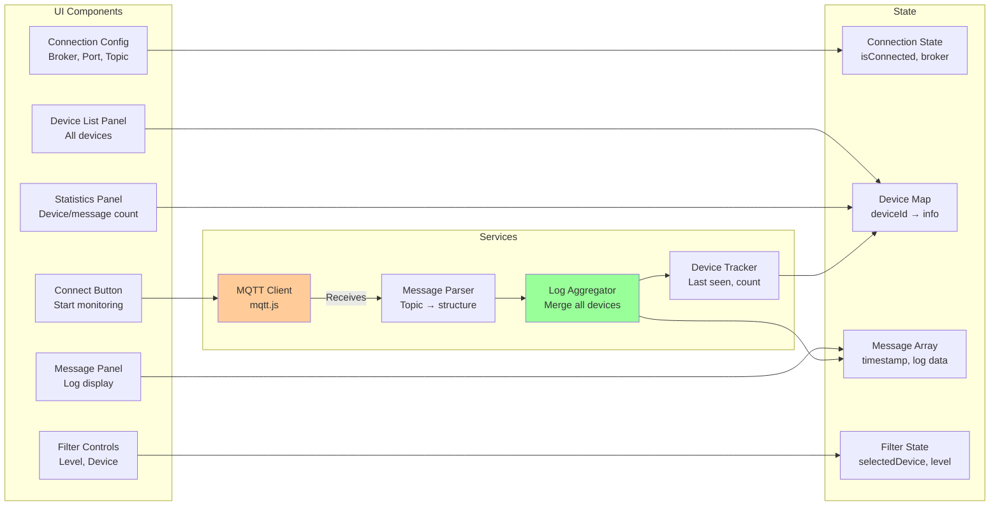

# Fleet Monitoring - Multi-Device MQTT Monitoring

**Feature:** Fleet Monitoring (Production Monitoring)  
**Purpose:** Monitor multiple FGA-Gen2-Fw devices via MQTT in real-time  
**Status:** Core feature - Always enabled  
**Last Updated:** December 9, 2025

---

## 📋 Overview

The **Fleet Monitoring** feature provides centralized real-time monitoring of FGA-Gen2-Fw devices deployed in the field. By subscribing to MQTT log topics, it aggregates logs from multiple devices, tracks device status, and enables quick troubleshooting of production issues.

### Key Capabilities

- 📡 **MQTT Log Aggregation** - Subscribe to device log topics
- 🔍 **Multi-Device Tracking** - Monitor unlimited devices simultaneously
- 📊 **Log Level Filtering** - ERROR, WARN, INFO, DEBUG
- 🎯 **Device-Specific View** - Filter logs by device ID
- 🔄 **Auto-Refresh** - Real-time updates every 2 seconds
- 💾 **Message History** - Keep last 500 messages
- 🌐 **Production Ready** - Monitor remote MQTT brokers

---

## 🚀 Quick Start

### 1. Configure MQTT Broker

**Settings:**
- **Broker:** Remote MQTT broker IP/hostname
- **Port:** 1884 (or your broker port)
- **Base Topic:** `nube-io/hvac/logs/#` (subscribe to all devices)

### 2. Connect

1. Click **Connect** button
2. Wait for connection (2-5 seconds)
3. Status shows "Connected"
4. Device count appears

### 3. Monitor Devices

**Automatic Device Discovery:**
- Devices automatically appear when they publish logs
- Device list updated in real-time
- Message count tracked per device

**View Logs:**
- All devices: Shows mixed logs
- Select device: Shows only that device's logs
- Filter by level: ERROR, WARN, INFO, DEBUG

### 4. Filter and Analyze

**Filter Options:**
1. **By Device:** Click device in list
2. **By Log Level:** Select from dropdown
3. **Combined:** Device + Level filtering

---

## 🏗️ Architecture

### System Overview

```mermaid
graph TB
    subgraph Production Devices
        DEV1[Device 1<br/>FGA-Gen2-Fw]
        DEV2[Device 2<br/>FGA-Gen2-Fw]
        DEVN[Device N<br/>FGA-Gen2-Fw]
    end
    
    subgraph MQTT Broker
        BROKER[MQTT Broker<br/>mosquitto/HiveMQ]
        TOPIC1[nube-io/hvac/logs/<br/>{client_id}/{env}/{level}]
    end
    
    subgraph Electron Main Process
        FLEET[FleetMonitoringService<br/>MQTT Client]
    end
    
    subgraph Electron Renderer
        PAGE[FleetMonitoringPage<br/>UI Display]
        DEVICELIST[Device List<br/>Active devices]
        MESSAGES[Message Display<br/>Filtered logs]
    end
    
    DEV1 -->|Publish Logs| TOPIC1
    DEV2 -->|Publish Logs| TOPIC1
    DEVN -->|Publish Logs| TOPIC1
    TOPIC1 --> BROKER
    BROKER -->|Subscribe| FLEET
    FLEET -.IPC: fleet:message.-> PAGE
    PAGE --> DEVICELIST
    PAGE --> MESSAGES
    
    style FLEET fill:#ff9999
    style BROKER fill:#99ccff
```

### Component Diagram



---

## 🎮 Features

### MQTT Topic Structure

**Topic Format:**
```
nube-io/hvac/logs/{client_id}/{environment}/{level}
```

**Example Topics:**
```
nube-io/hvac/logs/device_001/production/ERROR
nube-io/hvac/logs/device_001/production/WARN
nube-io/hvac/logs/device_001/production/INFO
nube-io/hvac/logs/device_002/staging/DEBUG
```

**Components:**
- `client_id`: Unique device identifier
- `environment`: production, staging, development
- `level`: ERROR, WARN, INFO, DEBUG

**Subscription:**
```
nube-io/hvac/logs/#  → Subscribe to all devices
nube-io/hvac/logs/device_001/#  → Subscribe to one device
nube-io/hvac/logs/+/production/ERROR  → All production errors
```

### Message Format

**MQTT Payload (JSON):**
```json
{
  "timestamp": "2025-12-09T14:23:45.123Z",
  "tag": "WIFI",
  "message": "Connection established to network 'ProductionWiFi'"
}
```

**Parsed Message Structure:**
```javascript
{
  timestamp: "2025-12-09T14:23:45.123Z",
  clientId: "device_001",
  environment: "production",
  level: "INFO",
  tag: "WIFI",
  message: "Connection established...",
  topic: "nube-io/hvac/logs/device_001/production/INFO"
}
```

### Device Tracking

**Device Info:**
```javascript
{
  clientId: "device_001",
  environment: "production",
  firstSeen: "2025-12-09T14:00:00.000Z",
  lastSeen: "2025-12-09T14:23:45.123Z",
  messageCount: 1234
}
```

**Tracking:**
- First message timestamp
- Last message timestamp (activity indicator)
- Total message count
- Current environment

### Log Level Filtering

**Filter Levels:**
- **All** - Show all messages (no filtering)
- **ERROR** - Critical errors only
- **WARN** - Warnings and errors
- **INFO** - Informational messages and above
- **DEBUG** - All messages including debug

**Color Coding:**
- 🔴 **ERROR** - Red text
- 🟠 **WARN** - Orange text
- 🔵 **INFO** - Blue text
- ⚪ **DEBUG** - Gray text

### Auto-Refresh

**Real-Time Updates:**
- Polls MQTT service every 2 seconds
- Updates device list and message display
- Preserves scroll position (unless at bottom)
- Auto-scrolls when at bottom

**Performance:**
- Incremental updates only
- No full page re-render
- Efficient DOM manipulation
- Handles high message rates

---

## 💻 User Interface

### Main Layout

```
┌─────────────────────────────────────────────────┐
│ Fleet Monitoring                                │
├─────────────────────────────────────────────────┤
│                                                 │
│ Connection                                      │
│ ┌───────────────────────────────────────────┐  │
│ │ Broker: [113.160.225.31]  Port: [1884]   │  │
│ │ Topic:  [nube-io/hvac/logs/#]            │  │
│ │ [Connect]                                 │  │
│ └───────────────────────────────────────────┘  │
│                                                 │
│ ┌─────────────┬───────────────────────────────┐ │
│ │ Devices (5) │ Messages (234)                │ │
│ ├─────────────┼───────────────────────────────┤ │
│ │             │                               │ │
│ │ device_001  │ Filter: [All Levels ▼]       │ │
│ │  125 msgs   │                               │ │
│ │  2 min ago  │ [14:23:45] [device_001] [INFO]│ │
│ │             │ [WIFI] Connected              │ │
│ │ device_002  │                               │ │
│ │  89 msgs    │ [14:23:40] [device_002] [ERROR]│
│ │  1 min ago  │ [SENSOR] Timeout              │ │
│ │             │                               │ │
│ │ device_003  │ [14:23:35] [device_001] [DEBUG]│
│ │  20 msgs    │ [HVAC] Temperature: 22.5°C    │ │
│ │  30 sec ago │                               │ │
│ │             │ (Scrollable message area)     │ │
│ │ [All]       │                               │ │
│ └─────────────┴───────────────────────────────┘ │
│                                                 │
└─────────────────────────────────────────────────┘
```

---

## 🎯 Common Tasks

### Task 1: Connect to Production Broker

**Scenario:** Monitor production devices

**Configuration:**
```
Broker: 113.160.225.31
Port:   1884
Topic:  nube-io/hvac/logs/#
```

**Procedure:**
1. Enter broker IP
2. Enter port 1884
3. Verify topic (wildcard # for all devices)
4. Click **Connect**
5. Wait for "Connected" status
6. Devices appear as they publish logs

---

### Task 2: Monitor Specific Device

**Scenario:** Debug one device's issues

**Procedure:**
1. Connect to broker (see Task 1)
2. Wait for device list to populate
3. Click on device in left panel (e.g., `device_001`)
4. Only that device's logs shown
5. Click **All** to see all devices again

**Use Case:**
- Troubleshoot specific device
- Focus on one device's behavior
- Isolate issues

---

### Task 3: Find All Errors Across Fleet

**Scenario:** Identify devices with errors

**Procedure:**
1. Connect to broker
2. Select filter: **ERROR**
3. All error messages from all devices displayed
4. Note which devices generating errors
5. Click on specific device to investigate

**Analysis:**
```
Error Pattern Example:
- device_001: [ERROR] [SENSOR] Timeout (repeated 10 times)
- device_005: [ERROR] [WIFI] Connection lost
→ Likely network issue affecting multiple devices
```

---

### Task 4: Monitor Device Deployment

**Scenario:** Verify new firmware rollout

**Setup:**
1. Connect to production broker
2. Filter: **INFO** level (or **ALL**)
3. Monitor device list

**Watch For:**
- New devices appearing (newly deployed)
- Version messages in logs
- Connectivity confirmations
- Error rates

**Success Indicators:**
- All devices connecting
- No repeated errors
- Version logs show new firmware
- Message counts increasing steadily

---

## 🐛 Troubleshooting

### Issue: Can't Connect to Broker

**Symptoms:**
- Connection fails
- Timeout error
- Status stays "Disconnected"

**Solutions:**

**1. Verify Broker Address**
```
Correct:   113.160.225.31
Incorrect: mqtt://113.160.225.31 (no protocol prefix)
Incorrect: 113.160.225.31:1884 (no port in address field)
```

**2. Check Network Connectivity**
```powershell
# Ping broker
ping 113.160.225.31

# Test MQTT with mosquitto_sub
mosquitto_sub -h 113.160.225.31 -p 1884 -t "#" -v
```

**3. Verify Port**
- Standard MQTT: 1883
- Custom MQTT: Check broker config
- MQTT over TLS: 8883

**4. Check Firewall**
```powershell
# Allow outbound MQTT
New-NetFirewallRule -DisplayName "MQTT Fleet" -Direction Outbound `
  -Protocol TCP -RemotePort 1884 -Action Allow
```

---

### Issue: No Devices Appearing

**Symptoms:**
- Connected to broker
- But device list empty
- No messages received

**Solutions:**

**1. Verify Topic Subscription**
```
Correct:   nube-io/hvac/logs/#
Incorrect: nube-io/hvac/logs (missing wildcard)
Incorrect: nube-io/hvac/logs/* (wrong wildcard)
```

**2. Check Devices Publishing**
```bash
# Subscribe manually to verify devices publishing
mosquitto_sub -h 113.160.225.31 -p 1884 -t "nube-io/hvac/logs/#" -v

# Should see messages if devices active
```

**3. Verify Firmware Version**
- Devices must be running FGA-Gen2-Fw
- Firmware must have MQTT logging enabled
- Check firmware configuration

**4. Check Device Connectivity**
- Are devices powered on?
- Are devices connected to WiFi?
- Check device serial console for errors

---

### Issue: Messages Not Updating

**Symptoms:**
- Connected
- Devices listed
- But messages not refreshing

**Solutions:**

**1. Check Auto-Refresh**
- Auto-refresh should start automatically on connect
- Refresh interval: 2 seconds
- Check browser console for errors

**2. Manual Refresh**
- Disconnect and reconnect
- Should trigger message update

**3. Clear Message Buffer**
- Disconnect
- Reconnect (clears old messages)
- Fresh start

**4. Check Memory**
- Browser may be out of memory
- Refresh page
- Close other tabs

---

### Issue: Too Many Messages (Overwhelming)

**Symptoms:**
- Hundreds of messages per second
- UI lagging
- Can't find relevant messages

**Solutions:**

**1. Use Log Level Filtering**
- Select **ERROR** to see only errors
- Select **WARN** for warnings and errors
- Reduces message volume significantly

**2. Filter by Device**
- Click on specific device
- Shows only that device's messages
- Much more manageable

**3. Adjust Topic Subscription**
```
Instead of: nube-io/hvac/logs/#
Use:        nube-io/hvac/logs/+/production/ERROR
→ Only production errors from all devices
```

**4. Increase Message Buffer**
- Default: 500 messages
- Can be increased in code (FleetMonitoringService.maxMessages)
- Trades memory for history

---

## 📚 Code References

**Main Files:**
- `renderer/pages/FleetMonitoringPage.js` - UI control (410 lines)
- `services/fleet-monitoring.js` - MQTT service (224 lines)
- `main.js` - IPC handlers for fleet monitoring

**Key Methods:**
- `FleetMonitoringService.connect(broker, port, baseTopic)` - Connect to MQTT
- `FleetMonitoringService.disconnect()` - Disconnect
- `FleetMonitoringService.handleMessage(topic, payload)` - Parse message
- `FleetMonitoringPage.getFilteredMessages()` - Apply filters
- `FleetMonitoringPage.startAutoRefresh()` - Start polling

**IPC Channels:**
- `fleet:connect` - Connect to broker
- `fleet:disconnect` - Disconnect
- `fleet:get-status` - Get connection state
- `fleet:get-config` - Get broker config
- `fleet:message` - New message received (main → renderer)
- `fleet:device-update` - Device info updated (main → renderer)

---

## 🔗 Related Features

- **Devices** - Monitor individual devices via MQTT
- **UDP Logs** - Local device logging
- **TCP Console** - Direct device communication
- **Factory Testing** - Pre-deployment device testing

---

## 📝 Best Practices

### For Production Monitoring

1. **Use dedicated MQTT broker** - Don't share with control traffic
2. **Filter by ERROR level** - Focus on critical issues
3. **Monitor device count** - Detect offline devices
4. **Set up alerts** - External monitoring for critical errors
5. **Regular log review** - Daily check of error patterns

### For Debugging

1. **Start with ALL level** - See complete picture
2. **Then filter by device** - Focus investigation
3. **Then filter by level** - Narrow to specific issues
4. **Copy relevant logs** - Share with team
5. **Compare device logs** - Find commonalities

### For Development

1. **Use staging environment** - Separate broker/topic
2. **Monitor during testing** - Catch issues early
3. **Watch for performance** - High log rates impact UI
4. **Test with multiple devices** - Verify scaling
5. **Document log formats** - Team reference

---

## 🎓 Learning Resources

**MQTT Protocol:**
- [MQTT Essentials](https://www.hivemq.com/mqtt-essentials/)
- [MQTT Topic Best Practices](https://www.hivemq.com/blog/mqtt-essentials-part-5-mqtt-topics-best-practices/)

**Fleet Management:**
- [IoT Device Management](https://aws.amazon.com/iot-device-management/)
- [Fleet Monitoring Best Practices](https://www.mongodb.com/use-cases/internet-of-things)

**Related Documentation:**
- [Main Documentation Index](../../README.md)
- [Devices](../devices/README.md)
- [UDP Logs](../udp-logs/README.md)
- [Factory Testing](../factory-testing/README.md)

---

## 📄 File Listing

**This Feature's Documentation:**
- [README.md](./README.md) - This file (overview)
- [FleetMonitoring-Overview.md](./FleetMonitoring-Overview.md) - Technical deep dive
- [FleetMonitoring-UserGuide.md](./FleetMonitoring-UserGuide.md) - Detailed procedures
- [FleetMonitoring-SourceCode.md](./FleetMonitoring-SourceCode.md) - Developer documentation
- [FleetMonitoring-Troubleshooting.md](./FleetMonitoring-Troubleshooting.md) - Problem solving

---

**Last Updated:** December 9, 2025  
**Status:** ✅ Core Feature - Always Available  
**Next:** Read [FleetMonitoring-UserGuide.md](./FleetMonitoring-UserGuide.md) for monitoring procedures
