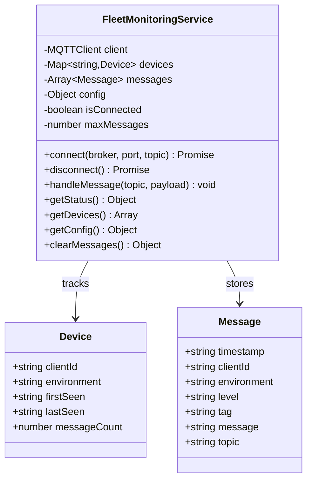
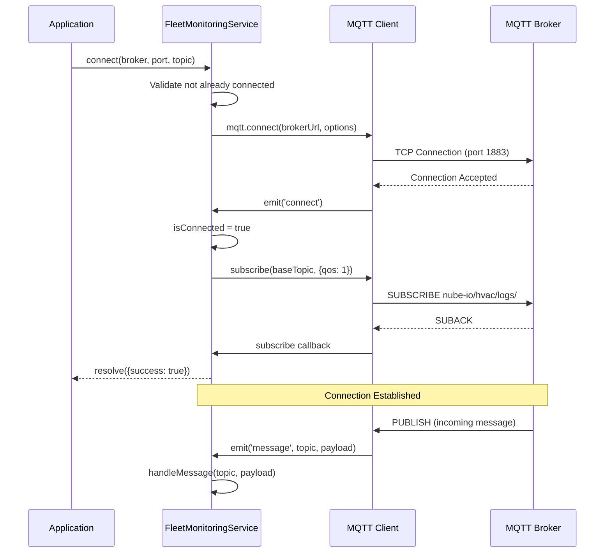
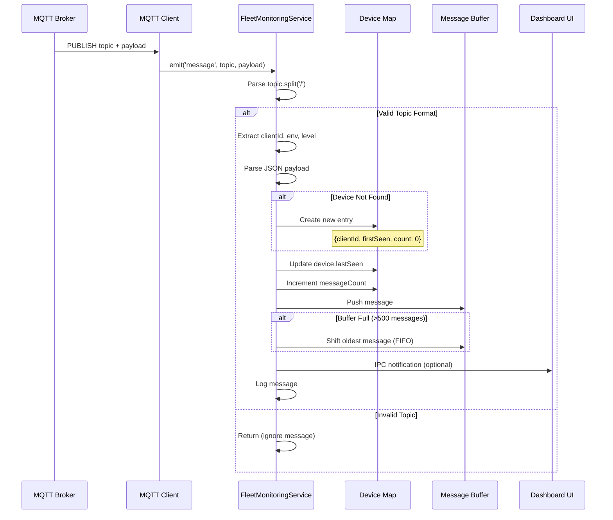
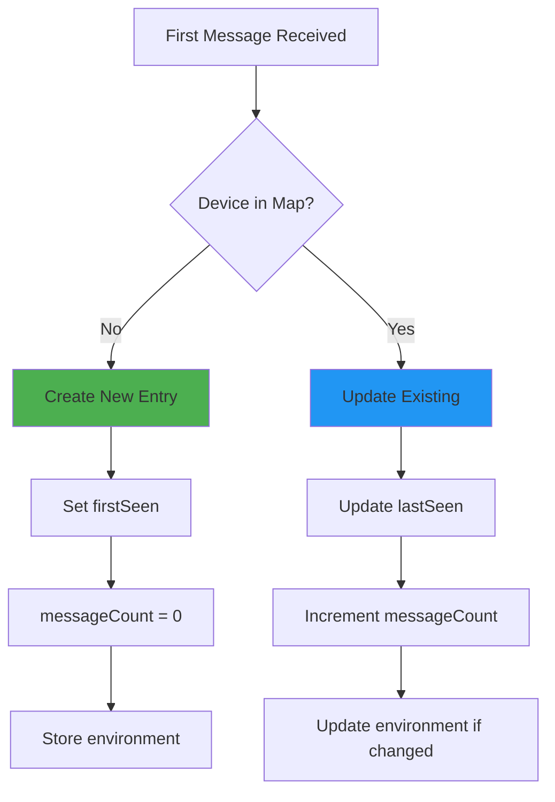

# Fleet Monitoring - Source Code Documentation

## Table of Contents
1. [Architecture](#architecture)
2. [FleetMonitoringService Class](#fleetmonitoringservice-class)
3. [Connection Management](#connection-management)
4. [Message Handling](#message-handling)
5. [Device Tracking](#device-tracking)
6. [Status and Query Methods](#status-and-query-methods)
7. [Code Examples](#code-examples)
8. [Testing Guide](#testing-guide)

---

## Architecture

### Class Diagram



### Connection Flow Sequence



---

## FleetMonitoringService Class

**Location:** `services/fleet-monitoring.js`

### Constructor

```javascript
class FleetMonitoringService {
    constructor() {
        this.client = null;
        this.config = {
            broker: '113.160.225.31',
            port: 1884,
            baseTopic: 'nube-io/hvac/logs/#'
        };
        this.isConnected = false;
        this.devices = new Map();  // clientId → device info
        this.messages = [];         // Recent messages
        this.maxMessages = 500;     // Buffer size
    }
}
```

### Properties

| Property | Type | Description |
|----------|------|-------------|
| `client` | `MQTTClient` | MQTT.js client instance |
| `config` | `Object` | Broker connection config |
| `isConnected` | `boolean` | Connection status flag |
| `devices` | `Map<string, Device>` | Device tracking map |
| `messages` | `Array<Message>` | Message buffer (FIFO) |
| `maxMessages` | `number` | Max messages to retain (500) |

---

## Connection Management

### connect()

Establishes connection to MQTT broker and subscribes to topic.

**Signature:**
```javascript
async connect(
    broker: string,
    port: number,
    baseTopic: string
): Promise<Object>
```

**Parameters:**
- `broker`: Broker hostname or IP (e.g., `'192.168.1.100'`)
- `port`: MQTT port (e.g., `1883`)
- `baseTopic`: Topic pattern with wildcards (e.g., `'nube-io/hvac/logs/#'`)

**Returns:**
```javascript
{
    success: true,
    message: 'Connected and subscribed'
}
```

**Implementation:**
```javascript
connect(broker, port, baseTopic) {
    return new Promise((resolve, reject) => {
        if (this.isConnected) {
            return resolve({ success: true, message: 'Already connected' });
        }
        
        this.config = { broker, port, baseTopic };
        const brokerUrl = `mqtt://${broker}:${port}`;
        
        console.log(`Fleet Monitoring: Connecting to ${brokerUrl}`);
        
        // Create MQTT client
        this.client = mqtt.connect(brokerUrl, {
            clientId: `fleet_monitor_${Math.random().toString(16).slice(2, 10)}`,
            clean: true,
            reconnectPeriod: 5000,
            port: parseInt(port),
            host: broker,
            keepalive: 60,
            connectTimeout: 10000
        });
        
        // Connection successful
        this.client.on('connect', () => {
            console.log('Fleet Monitoring: Connected to MQTT broker');
            this.isConnected = true;
            
            // Subscribe to topic
            this.client.subscribe(baseTopic, (err) => {
                if (err) {
                    reject(new Error(`Subscription failed: ${err.message}`));
                } else {
                    console.log(`Fleet Monitoring: Subscribed to ${baseTopic}`);
                    resolve({ success: true, message: 'Connected and subscribed' });
                }
            });
        });
        
        // Handle incoming messages
        this.client.on('message', (topic, payload) => {
            this.handleMessage(topic, payload);
        });
        
        // Error handling
        this.client.on('error', (error) => {
            console.error('Fleet Monitoring: MQTT error:', error);
            if (!this.isConnected) {
                reject(new Error(`Connection failed: ${error.message}`));
            }
        });
        
        // Reconnection
        this.client.on('reconnect', () => {
            console.log(`Fleet Monitoring: Reconnecting to ${broker}:${port}...`);
        });
        
        // Connection closed
        this.client.on('close', () => {
            console.log('Fleet Monitoring: Connection closed');
            this.isConnected = false;
        });
        
        // Offline
        this.client.on('offline', () => {
            console.log('Fleet Monitoring: Client offline');
            this.isConnected = false;
        });
    });
}
```

**Usage Example:**
```javascript
const service = new FleetMonitoringService();

try {
    await service.connect('192.168.1.100', 1883, 'nube-io/hvac/logs/#');
    console.log('✓ Connected to fleet');
} catch (error) {
    console.error('✗ Connection failed:', error.message);
}
```

---

### disconnect()

Closes MQTT connection gracefully.

**Signature:**
```javascript
async disconnect(): Promise<Object>
```

**Returns:**
```javascript
{
    success: true,
    message: 'Disconnected'
}
```

**Implementation:**
```javascript
async disconnect() {
    if (this.client && this.isConnected) {
        return new Promise((resolve) => {
            this.client.end(() => {
                this.isConnected = false;
                this.client = null;
                console.log('Fleet Monitoring: Disconnected');
                resolve({ success: true });
            });
        });
    }
    return { success: true, message: 'Not connected' };
}
```

---

## Message Handling

### Message Processing Sequence



### handleMessage()

Processes incoming MQTT messages and updates device tracking.

**Signature:**
```javascript
handleMessage(topic: string, payload: Buffer): void
```

**Parameters:**
- `topic`: MQTT topic string (e.g., `'nube-io/hvac/logs/FGA-001/production/INFO'`)
- `payload`: Message payload as Buffer

**Implementation:**
```javascript
handleMessage(topic, payload) {
    try {
        // Parse topic: nube-io/hvac/logs/{client_id}/{environment}/{level}
        const parts = topic.split('/');
        
        // Validate topic format
        if (parts.length < 5 || 
            parts[0] !== 'nube-io' || 
            parts[1] !== 'hvac' || 
            parts[2] !== 'logs') {
            // Ignore non-matching topics
            return;
        }
        
        const clientId = parts[3];
        const environment = parts[4];
        const level = parts[5] || 'INFO';
        
        // Parse JSON payload
        let data = {};
        try {
            data = JSON.parse(payload.toString());
        } catch (e) {
            // Not JSON - treat as plain text
            data = { message: payload.toString() };
        }
        
        // Create message object
        const message = {
            timestamp: data.timestamp || new Date().toISOString(),
            clientId: clientId,
            environment: environment,
            level: level,
            tag: data.tag || '',
            message: data.message || payload.toString(),
            topic: topic
        };
        
        // Update device tracking
        if (!this.devices.has(clientId)) {
            // New device discovered
            this.devices.set(clientId, {
                clientId: clientId,
                environment: environment,
                lastSeen: message.timestamp,
                messageCount: 0,
                firstSeen: message.timestamp
            });
        }
        
        const device = this.devices.get(clientId);
        device.lastSeen = message.timestamp;
        device.messageCount++;
        device.environment = environment;
        
        // Add to message buffer
        this.messages.push(message);
        
        // Limit buffer size (FIFO)
        if (this.messages.length > this.maxMessages) {
            this.messages.shift();  // Remove oldest
        }
        
        console.log(`Fleet Monitoring: [${clientId}] ${level}: ${message.message.substring(0, 100)}`);
    } catch (error) {
        console.error('Fleet Monitoring: Error handling message:', error);
    }
}
```

**Topic Parsing Example:**
```
Input: "nube-io/hvac/logs/FGA-001/production/INFO"

Parsed:
├─ parts[0] = "nube-io"
├─ parts[1] = "hvac"
├─ parts[2] = "logs"
├─ parts[3] = "FGA-001"        ← clientId
├─ parts[4] = "production"     ← environment
└─ parts[5] = "INFO"           ← level
```

---

## Device Tracking

### Device Object Structure

```javascript
{
    clientId: 'FGA-001',
    environment: 'production',
    firstSeen: '2024-01-15T10:00:00.000Z',
    lastSeen: '2024-01-15T14:32:10.123Z',
    messageCount: 1523
}
```

### Device Lifecycle



---

## Status and Query Methods

### getStatus()

Returns comprehensive service status including all devices and messages.

**Signature:**
```javascript
getStatus(): Object
```

**Returns:**
```javascript
{
    isConnected: true,
    broker: '192.168.1.100',
    port: 1883,
    baseTopic: 'nube-io/hvac/logs/#',
    devices: {
        'FGA-001': { clientId: 'FGA-001', ... },
        'FGA-002': { clientId: 'FGA-002', ... }
    },
    deviceCount: 2,
    messageCount: 1523,
    messages: [
        { timestamp: '...', clientId: 'FGA-001', ... },
        ...
    ]
}
```

**Implementation:**
```javascript
getStatus() {
    // Convert Map to Object
    const devicesObj = {};
    this.devices.forEach((device, id) => {
        devicesObj[id] = device;
    });
    
    return {
        isConnected: this.isConnected,
        broker: this.config.broker,
        port: this.config.port,
        baseTopic: this.config.baseTopic,
        devices: devicesObj,
        deviceCount: this.devices.size,
        messageCount: this.messages.length,
        messages: this.messages
    };
}
```

---

### getDevices()

Returns array of all tracked devices.

**Signature:**
```javascript
getDevices(): Array<Device>
```

**Returns:**
```javascript
[
    { clientId: 'FGA-001', environment: 'production', ... },
    { clientId: 'FGA-002', environment: 'staging', ... }
]
```

---

### getConfig()

Returns current configuration.

**Signature:**
```javascript
getConfig(): Object
```

**Returns:**
```javascript
{
    broker: '192.168.1.100',
    port: 1883,
    baseTopic: 'nube-io/hvac/logs/#'
}
```

---

### clearMessages()

Clears message buffer.

**Signature:**
```javascript
clearMessages(): Object
```

**Returns:**
```javascript
{
    success: true
}
```

**Implementation:**
```javascript
clearMessages() {
    this.messages = [];
    return { success: true };
}
```

---

## Code Examples

### Example 1: Basic Fleet Monitoring

```javascript
const FleetMonitoringService = require('./services/fleet-monitoring');

async function monitorFleet() {
    const service = new FleetMonitoringService();
    
    // Connect
    try {
        await service.connect('192.168.1.100', 1883, 'nube-io/hvac/logs/#');
        console.log('✓ Connected to fleet broker');
    } catch (error) {
        console.error('✗ Connection failed:', error.message);
        return;
    }
    
    // Monitor status every 10 seconds
    setInterval(() => {
        const status = service.getStatus();
        
        console.log(`\n=== Fleet Status ===`);
        console.log(`Connected: ${status.isConnected}`);
        console.log(`Devices: ${status.deviceCount}`);
        console.log(`Messages: ${status.messageCount}`);
        
        // Show recent messages
        const recent = status.messages.slice(-5);
        console.log(`\nRecent Messages:`);
        recent.forEach(msg => {
            console.log(`  [${msg.clientId}] ${msg.level}: ${msg.message}`);
        });
    }, 10000);
}

monitorFleet().catch(console.error);
```

---

### Example 2: Device Health Monitoring

```javascript
async function monitorDeviceHealth() {
    const service = new FleetMonitoringService();
    await service.connect('192.168.1.100', 1883, 'nube-io/hvac/logs/#');
    
    // Check device health every 60 seconds
    setInterval(() => {
        const devices = service.getDevices();
        const now = new Date();
        
        console.log(`\n=== Device Health Report ===`);
        
        devices.forEach(device => {
            const lastSeen = new Date(device.lastSeen);
            const ageSeconds = (now - lastSeen) / 1000;
            
            let status = '🟢 Active';
            if (ageSeconds > 60) {
                status = '🟡 Inactive';
            }
            if (ageSeconds > 300) {
                status = '🔴 Offline';
            }
            
            console.log(`${device.clientId}: ${status} (${Math.round(ageSeconds)}s ago)`);
        });
    }, 60000);
}
```

---

### Example 3: Error Alerting

```javascript
async function monitorErrors() {
    const service = new FleetMonitoringService();
    await service.connect('192.168.1.100', 1883, 'nube-io/hvac/logs/+/+/ERROR');
    
    // Override handleMessage to add alerting
    const originalHandler = service.handleMessage.bind(service);
    service.handleMessage = (topic, payload) => {
        originalHandler(topic, payload);
        
        // Check if message is ERROR level
        const parts = topic.split('/');
        const level = parts[5];
        
        if (level === 'ERROR' || level === 'FATAL') {
            const data = JSON.parse(payload.toString());
            sendAlert({
                device: parts[3],
                level: level,
                message: data.message,
                timestamp: data.timestamp
            });
        }
    };
}

function sendAlert(error) {
    console.error(`\n⚠️  ALERT: ${error.device} reported ${error.level}`);
    console.error(`    Message: ${error.message}`);
    console.error(`    Time: ${error.timestamp}`);
    
    // Send email, Slack notification, etc.
}
```

---

### Example 4: CSV Export

```javascript
function exportToCSV(service) {
    const status = service.getStatus();
    const messages = status.messages;
    
    // CSV header
    let csv = 'Timestamp,ClientID,Environment,Level,Tag,Message\n';
    
    // Add rows
    messages.forEach(msg => {
        const row = [
            msg.timestamp,
            msg.clientId,
            msg.environment,
            msg.level,
            msg.tag,
            `"${msg.message.replace(/"/g, '""')}"`  // Escape quotes
        ].join(',');
        csv += row + '\n';
    });
    
    // Save to file
    const fs = require('fs');
    const filename = `fleet-logs-${new Date().toISOString().split('T')[0]}.csv`;
    fs.writeFileSync(filename, csv, 'utf8');
    
    console.log(`✓ Exported ${messages.length} messages to ${filename}`);
}
```

---

## Testing Guide

### Unit Tests

```javascript
const FleetMonitoringService = require('./services/fleet-monitoring');
const assert = require('assert');

describe('FleetMonitoringService', () => {
    let service;
    
    beforeEach(() => {
        service = new FleetMonitoringService();
    });
    
    describe('constructor', () => {
        it('should initialize with default config', () => {
            assert.strictEqual(service.isConnected, false);
            assert.strictEqual(service.maxMessages, 500);
            assert.strictEqual(service.devices.size, 0);
        });
    });
    
    describe('handleMessage()', () => {
        it('should parse valid topic and payload', () => {
            const topic = 'nube-io/hvac/logs/FGA-001/production/INFO';
            const payload = Buffer.from(JSON.stringify({
                timestamp: '2024-01-15T14:32:10.123Z',
                message: 'Test message'
            }));
            
            service.handleMessage(topic, payload);
            
            // Device should be tracked
            assert(service.devices.has('FGA-001'));
            const device = service.devices.get('FGA-001');
            assert.strictEqual(device.clientId, 'FGA-001');
            assert.strictEqual(device.environment, 'production');
            
            // Message should be stored
            assert.strictEqual(service.messages.length, 1);
            assert.strictEqual(service.messages[0].clientId, 'FGA-001');
            assert.strictEqual(service.messages[0].level, 'INFO');
        });
        
        it('should ignore invalid topics', () => {
            const topic = 'invalid/topic/structure';
            const payload = Buffer.from('test');
            
            service.handleMessage(topic, payload);
            
            // Should not track device or store message
            assert.strictEqual(service.devices.size, 0);
            assert.strictEqual(service.messages.length, 0);
        });
        
        it('should handle plain text payloads', () => {
            const topic = 'nube-io/hvac/logs/FGA-002/staging/DEBUG';
            const payload = Buffer.from('Plain text log message');
            
            service.handleMessage(topic, payload);
            
            assert.strictEqual(service.messages.length, 1);
            assert.strictEqual(service.messages[0].message, 'Plain text log message');
        });
        
        it('should limit message buffer to maxMessages', () => {
            service.maxMessages = 3;
            
            for (let i = 0; i < 5; i++) {
                const topic = `nube-io/hvac/logs/FGA-${i}/prod/INFO`;
                const payload = Buffer.from(`Message ${i}`);
                service.handleMessage(topic, payload);
            }
            
            // Should only keep last 3 messages
            assert.strictEqual(service.messages.length, 3);
            assert.strictEqual(service.messages[0].message, 'Message 2');
            assert.strictEqual(service.messages[2].message, 'Message 4');
        });
    });
});
```

---

## Summary

✅ **Architecture** - FleetMonitoringService class with MQTT integration  
✅ **Connection** - Async connect/disconnect with error handling  
✅ **Message Handling** - Topic parsing, JSON/text support, device tracking  
✅ **Device Tracking** - Auto-discovery via Map data structure  
✅ **Status Methods** - getStatus(), getDevices(), getConfig()  
✅ **Code Examples** - 4 practical implementations  
✅ **Testing** - Unit tests for message handling and device tracking  

**Key Methods:**

| Method | Purpose |
|--------|---------|
| `connect()` | Connect to MQTT broker and subscribe |
| `disconnect()` | Close connection gracefully |
| `handleMessage()` | Process incoming MQTT messages |
| `getStatus()` | Get full service status |
| `getDevices()` | Get array of tracked devices |
| `clearMessages()` | Clear message buffer |

For troubleshooting, see [Troubleshooting.md](Troubleshooting.md).
